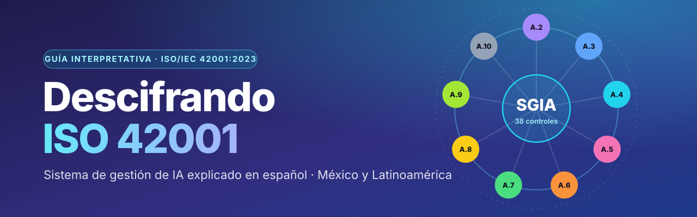
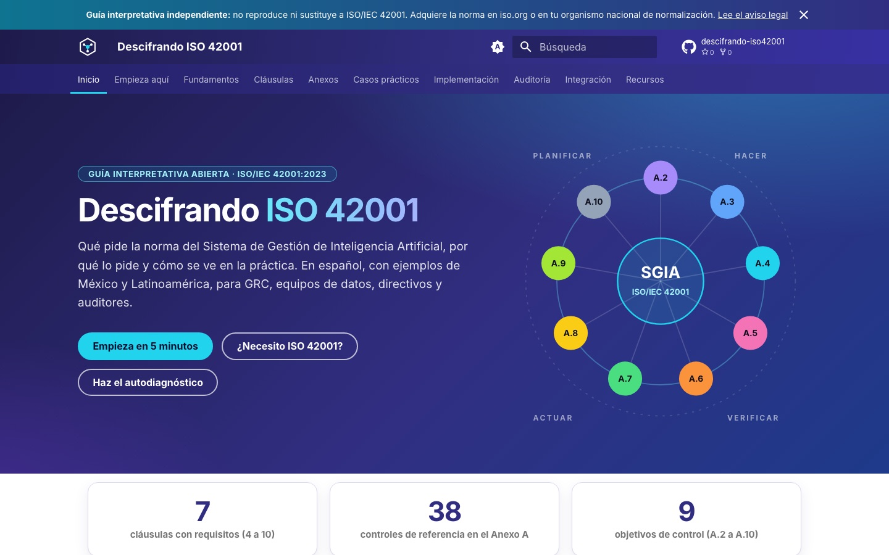
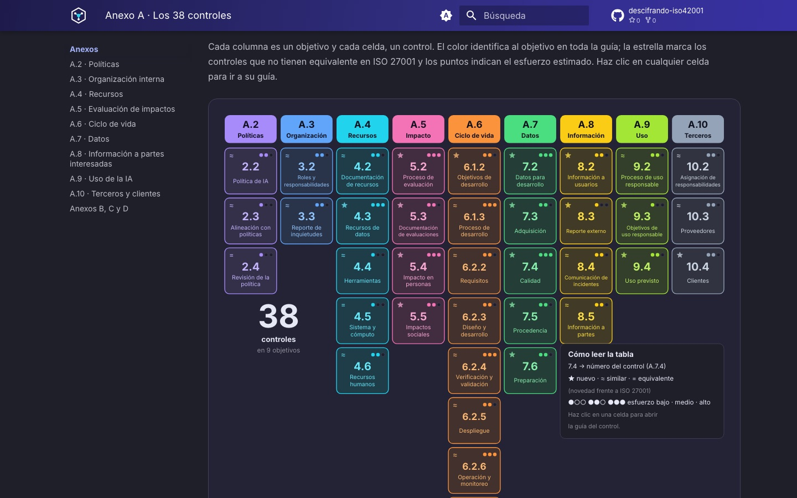

<p align="center">
  <a href="https://adriangzmncrz-arch.github.io/descifrando-iso42001/">
    
  </a>
</p>

<p align="center">
  <a href="https://adriangzmncrz-arch.github.io/descifrando-iso42001/"></a>
  <a href="LICENSE"></a>
  <a href="LICENSE-CODE"></a>
  
  <a href="CHANGELOG.md"></a>
</p>

<h3 align="center">
  👉 <a href="https://adriangzmncrz-arch.github.io/descifrando-iso42001/">Lee la guía en adriangzmncrz-arch.github.io/descifrando-iso42001</a>
</h3>

---

## ¿Qué es?

**Descifrando ISO 42001** es una guía interpretativa abierta, en español, para entender e implementar **ISO/IEC 42001:2023**, la norma internacional del **sistema de gestión de inteligencia artificial (SGIA)**.

No es un paquete de plantillas. Es una explicación de **qué pide la norma, por qué lo pide y cómo se ve en la práctica**, con ejemplos del contexto mexicano y latinoamericano. Las plantillas existen, pero como material de apoyo.

> [!IMPORTANT]
> Esta guía es la interpretación de su autor; no es una postura oficial de ISO ni de IEC. No reproduce ni sustituye a la norma, que debe adquirirse en [iso.org](https://www.iso.org/standard/81230.html) o en el organismo nacional de normalización de tu país. Las referencias legales son informativas y no constituyen asesoría legal. Lee el [aviso legal completo](https://adriangzmncrz-arch.github.io/descifrando-iso42001/acerca-de/#aviso-legal).

## Así se ve

<p align="center">
  <a href="https://adriangzmncrz-arch.github.io/descifrando-iso42001/"></a>
  <a href="https://adriangzmncrz-arch.github.io/descifrando-iso42001/anexo-a/"></a>
</p>

## ¿Para quién?

| Perfil | Lo que encontrarás |
|---|---|
| 🛡️ **GRC y responsables de SGSI** que ya conocen ISO 27001 | Qué reutilizas de tu SGSI, qué adaptas y qué es nuevo con la IA. |
| 🧠 **Equipos de datos y desarrollo de IA** | El sistema de gestión explicado sin burocracia: qué documentar y por qué. |
| 💼 **Directivos de PyMEs** que usan IA | Si te aplica, cuánto esfuerzo implica y qué ganas. |
| 🔎 **Auditores y estudiantes** | Criterios, evidencia esperada, preguntas por cláusula y control, hallazgos de ejemplo. |

## Mapa del contenido

| Sección | Contenido |
|---|---|
| **Empieza aquí** | La norma en 5 minutos, árbol de decisión "¿Necesito ISO 42001?", mitos y rutas de lectura por perfil. |
| **Fundamentos** | Qué es un SGIA, IA explicada para GRC, roles según ISO/IEC 22989, familia de normas, principios de IA responsable, riesgo frente a impacto. |
| **Cláusulas 4 a 10** | Una página por cláusula con pestañas por rol, diferencias con ISO 27001, evidencia que espera un auditor y ejemplos resueltos. |
| **Anexo A** | Los 38 controles en 9 objetivos: tabla periódica, matriz filtrable y una guía por control. |
| **Anexos B, C y D** | Cómo usar la guía de implementación, los objetivos y fuentes de riesgo, y la integración por sectores. |
| **Casos prácticos** | Una PyME que usa IA generativa, una fintech con *scoring* crediticio y una empresa que vende un chatbot. |
| **Implementación y auditoría** | Hoja de ruta, documentación requerida, errores frecuentes, proceso de certificación y hallazgos de ejemplo. |
| **Integración** | ISO 27001, NIST AI RMF, Reglamento de IA de la UE y contexto de México y Latinoamérica (con fuentes y fechas de consulta). |
| **Recursos** | Autodiagnóstico con gráfica de radar, selector de rol, 11 plantillas descargables, glosario de más de 150 términos y 40 preguntas frecuentes. |

### Plantillas incluidas

| Plantilla | Formato |
|---|---|
| Política de IA · Política de uso aceptable de IA generativa · Roles y responsabilidades (RACI) | Markdown |
| Inventario de sistemas de IA | Excel |
| Metodología de evaluación de riesgos de IA y matriz con mapa de calor | Markdown + Excel |
| Evaluación de impacto del sistema de IA · Ficha del sistema de IA | Markdown |
| Declaración de Aplicabilidad de los 38 controles, con validación de consistencia | Excel + CSV |
| Procedimiento y registro de incidentes de IA | Markdown + Excel |
| Procedimiento de gestión del ciclo de vida · Checklist de auditoría interna | Markdown |

Todas están en la carpeta [`plantillas/`](plantillas/) y tienen vista previa en el sitio. Para descargarlas juntas, cada [versión publicada](https://github.com/adriangzmncrz-arch/descifrando-iso42001/releases/latest) incluye un ZIP con las plantillas y la licencia.

## Inicio rápido

¿Solo quieres leer? Entra al [sitio](https://adriangzmncrz-arch.github.io/descifrando-iso42001/).

¿Quieres construir el sitio en tu equipo?

```bash
git clone https://github.com/adriangzmncrz-arch/descifrando-iso42001.git
cd descifrando-iso42001
python -m venv .venv && source .venv/bin/activate   # En Windows: .venv\Scripts\activate
pip install -r requirements.txt
mkdocs serve        # http://127.0.0.1:8000
mkdocs build --strict
```

Los datos de los 38 controles viven en [`data/controles.yml`](data/controles.yml). Si los cambias, regenera los archivos derivados:

```bash
python scripts/generar_datos.py              # datos de la matriz, tabla periódica y tabla estática
python scripts/generar_plantillas_excel.py   # plantillas Excel y CSV
python scripts/validar_contenido.py          # consistencia de controles, anclas e insignias
pip install -r requirements-dev.txt && python scripts/verificar_excel.py   # recalcula las fórmulas de los Excel
```

## Autor

**Carlos Adrián Guzmán** — consultor GRC y auditor líder en ISO 27001, ISO 9001 e ISO 22301. Director general de [Cipherwell](https://cipherwell-sec.com).

- LinkedIn: [linkedin.com/in/adriancruz-grc](https://www.linkedin.com/in/adriancruz-grc/)
- Proyecto hermano: [ISO 27001 Toolkit en español](https://github.com/adriangzmncrz-arch/iso27001-toolkit-es)

## Cómo contribuir

¿Encontraste un error de interpretación, tienes una mejora o un caso práctico? Abre un *issue* con la plantilla correspondiente o envía un *pull request*. Lee primero [CONTRIBUTING.md](CONTRIBUTING.md) y el [Código de Conducta](CODE_OF_CONDUCT.md).

**Regla de oro:** nunca copies texto de ISO/IEC 42001 ni de otras normas ISO/IEC. Explica con tus palabras y referencia por número de cláusula o control.

## Licencia

- **Contenido** (textos, infografías y plantillas): [CC BY-SA 4.0](LICENSE).
- **Código** (JavaScript de las herramientas, scripts de Python, plantillas del tema y flujos de trabajo): [MIT](LICENSE-CODE).

Para citar esta guía, usa el botón *Cite this repository* de GitHub (archivo [`CITATION.cff`](CITATION.cff)).
