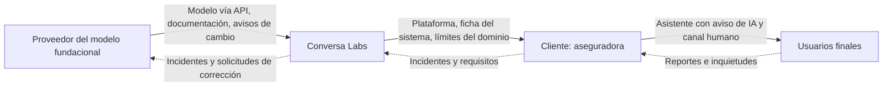

# A.10 · Relaciones con terceros y clientes

A.10 · Terceros
:material-view-grid-outline: 3 controles
:material-clock-outline: 21 min de lectura

**El objetivo, en palabras simples:** cuando proveedores, socios o clientes intervienen en cualquier momento de la vida de un sistema de IA, que cada quien sepa qué le toca, que los riesgos queden bien repartidos y que tu organización no pierda nunca su propia rendición de cuentas.

**Lo que está en juego:** la tierra de nadie. El proveedor cree que el cliente revisa, el cliente cree que el proveedor garantiza, y cuando algo falla nadie avisó, nadie corrigió y nadie responde.

!!! abstract "En una frase"
    Puedes subcontratar partes de la IA, pero no la responsabilidad: A.10 te pide repartirla por escrito, vigilar lo que te entregan tus proveedores y entender lo que esperan tus clientes.

## Por qué importa este objetivo

Piensa en la construcción de una casa. La dueña contrata a una constructora, que compra materiales a distintos proveedores y subcontrata la instalación eléctrica. Si el techo se filtra, el contrato dirá quién paga la reparación, pero quien vive bajo la gotera es la dueña; y si la constructora usó un impermeabilizante sin especificaciones, la responsabilidad ante su clienta sigue siendo suya. Una obra bien llevada tiene tres cosas: un reparto claro de responsabilidades, control de lo que entra de los proveedores y un entendimiento compartido de lo que la clienta espera y de lo que ella misma debe hacer para mantener la casa. Esos son, en ese orden, **A.10.2**, **A.10.3** y **A.10.4**.

En IA la cadena es más larga y menos visible que en la mayoría de los servicios de TI. Un sistema típico combina un modelo fundacional de un tercero, datos de otro, bibliotecas de código abierto, una nube, un integrador y un cliente que lo despliega frente a sus propios usuarios. Cada eslabón decide algo que afecta el comportamiento final. Los riesgos que aborda este objetivo son:

- **Huecos de responsabilidad**: tareas críticas (el aviso de IA, la calidad de la base de conocimiento, la atención de reportes) que nadie asumió.
- **Cambios unilaterales**: el proveedor publica una nueva versión del modelo o modifica sus términos sobre el uso de tus datos.
- **Opacidad**: componentes de terceros de los que no sabes con qué se entrenaron, cómo se evaluaron ni qué limitaciones tienen.
- **Dependencia**: no poder cambiar de proveedor sin rehacer el sistema.
- **Uso fuera de dominio por el cliente**: tu sistema funciona bien para lo que lo diseñaste, y el cliente lo usa para otra cosa.

**Relación con las cláusulas.** La cláusula [4.1](../clausulas/c4-contexto.md#c-4-1) pide determinar tus roles respecto de cada sistema de IA, y una nota remite a los roles de ISO/IEC 22989 (proveedor, productor, cliente, socio, sujeto de IA, autoridades); A.10 es lo que haces con esos roles cuando hay más de una organización involucrada (ver [roles en la IA](../fundamentos/roles-en-la-ia.md)). La [8.1](../clausulas/c8-operacion.md#c-8-1) pide controlar los procesos, productos o servicios externos relevantes para el SGIA, y A.10.3 es la herramienta para hacerlo. La [4.2](../clausulas/c4-contexto.md#c-4-2) pide entender a las partes interesadas, y A.10.4 lo aterriza para los clientes. Y las evaluaciones de riesgo e impacto ([6.1.2](../clausulas/c6-planificacion.md#c-6-1-2), [6.1.4](../clausulas/c6-planificacion.md#c-6-1-4)) tienen que considerar lo que aportan y deciden los terceros.

**Cómo cambia según tu rol.** A.10.2 y A.10.3 aplican a los tres roles; A.10.4 solo a quien provee IA a clientes.

- **Si usas IA de terceros** (Contadores Alameda), A.10.3 es tu control más importante: casi todo lo que haces con IA depende de BotNorte, de tu suite de ofimática y de tu software contable.
- **Si desarrollas IA** (Monarca Crédito), tus terceros son proveedores de datos (como la información crediticia que consultas con autorización), de componentes y de servicios como la API de detección de fraude.
- **Si provees IA a clientes** (Conversa Labs), estás en medio de la cadena: eres cliente del proveedor del modelo fundacional y proveedor de tus clientes. Para ti, A.10 es el centro de gravedad del SGIA.

!!! info "Diferencias con ISO 27001"
    La base reutilizable son los controles de relaciones con proveedores de ISO 27001 (ISO 27001 A.5.19 a A.5.23): inventario de proveedores, diligencia debida, cláusulas, seguimiento, gestión de cambios y servicios en la nube con responsabilidad compartida. Lo que agrega A.10: preguntas propias de la IA (uso de tus datos para entrenar, evaluaciones de sesgo, cambios de versión del modelo, documentación técnica), responsabilidades por los impactos en personas y no solo por la seguridad, y el lado del cliente (A.10.4), que el SGSI apenas toca.

## Los controles de un vistazo

| Control | Qué pide, en una línea | Aplica a | Esfuerzo | Frente a ISO 27001 |
|---|---|---|---|---|
| [A.10.2 Asignación de responsabilidades](#a-10-2) | Repartir y documentar quién hace qué en cada etapa del ciclo de vida cuando participan terceros | Usa · Desarrolla · Provee | Medio | Similar (5.19, 5.20, 5.23) |
| [A.10.3 Proveedores](#a-10-3) | Un proceso para que lo que entregan los proveedores sea coherente con tu enfoque responsable | Usa · Desarrolla · Provee | Medio | Similar (5.19 a 5.22) |
| [A.10.4 Clientes](#a-10-4) | Considerar necesidades y expectativas de los clientes y comunicarles límites y responsabilidades | Provee | Medio | Nuevo (relacionado con 5.20) |

!!! note "Sobre los nombres de los controles"
    Son traducciones libres de referencia del autor; la redacción oficial puede variar.

Así se ve la cadena de Conversa Labs, el caso con más eslabones de esta guía:

## A.10.2 Asignación de responsabilidades {#a-10-2 .dx-control .obj-a10}

:material-cloud-download-outline: Usa IA de terceros
:material-code-braces: Desarrolla IA
:material-handshake-outline: Provee IA a clientes
:material-gauge: Esfuerzo medio
:material-approximately-equal: Similar a 27001

**Propósito.** Que, cuando varias organizaciones intervienen en un sistema de IA, quede claro quién hace qué en cada etapa, para que ninguna tarea crítica caiga entre dos sillas.

**En la práctica.** El control pide que las responsabilidades del ciclo de vida queden repartidas entre tu organización y las demás partes (socios, proveedores, clientes, terceros), lo que exige saber quién participa y con qué rol. La herramienta natural es una **matriz de responsabilidad compartida**: la misma idea del modelo de responsabilidad compartida de la nube (*shared responsibility model*), extendida a lo que añade la IA. Te recomendamos organizarla en cuatro capas: **datos, modelo, sistema y uso**. Así se ve, resumida, la de Conversa Labs para una aseguradora cliente:

| Capa | Proveedor del modelo fundacional | Conversa Labs | Cliente (aseguradora) |
|---|---|---|---|
| **Datos** | Datos de entrenamiento del modelo base; compromiso contractual de no entrenar con lo enviado por API | Ingesta de la base de conocimiento; aislamiento entre clientes; compromiso de no entrenar con datos de clientes | Contenido de la base de conocimiento: exactitud, vigencia y derechos de uso |
| **Modelo** | Entrenamiento y evaluaciones de seguridad del modelo base; documentación; aviso de cambios de versión | Elección del modelo y su versión; evaluaciones de calidad en el caso de uso; pruebas adversarias y de inyección de instrucciones | Aceptar el desempeño en su dominio antes de salir a producción |
| **Sistema** | Disponibilidad y seguridad de la API | Orquestación, filtros de seguridad, traspaso a humano, registros, seguridad de la plataforma | Configuración: temas permitidos, tono, aviso de IA, horarios del equipo humano |
| **Uso** | Políticas de uso aceptable de su modelo | Monitoreo agregado de calidad; soporte de segundo nivel; plan de incidentes de la plataforma | Aviso a usuarios finales y aviso de privacidad; supervisión de conversaciones; primer nivel de atención; comunicación con sus asegurados |

Una matriz así solo vale si **baja a los contratos**: cada celda importante debería tener detrás una cláusula, un anexo de servicio o una sección de los términos de uso, y una persona dentro de cada organización que responda por ella (tu RACI interno de [A.3.2](a3-organizacion-interna.md#a-3-2)).

**Roles de datos personales.** Con datos personales, el reparto tiene una capa jurídica: quién decide sobre el tratamiento (responsable; *PII controller* en ISO/IEC 29100) y quién trata por cuenta de otro (encargado; *PII processor*). Una organización puede tener ambos roles según el tratamiento. En nuestra lectura, sujeta a revisión jurídica de cada contrato: la aseguradora es responsable de los datos de sus asegurados; Conversa es encargada al procesar las conversaciones, y el proveedor del modelo, subcontratado de Conversa; pero Conversa es responsable de los datos de contacto de sus propios clientes. Si un proveedor usara los datos para fines propios, como entrenar, podría dejar de ser un simple encargado. ISO/IEC 27701 ofrece controles para cada rol; en México, conviene reflejarlos en el aviso de privacidad y en el contrato con cada encargado (ver [México y Latinoamérica](../integracion/contexto-mexico-latam.md)).

**Qué reutilizas de ISO 27001.** La política de proveedores y los acuerdos (ISO 27001 A.5.19 y A.5.20) y, sobre todo, la responsabilidad compartida de los servicios en la nube (ISO 27001 A.5.23). Agregas responsabilidades que no son de seguridad: calidad de datos, sesgo, supervisión humana, transparencia e incidentes de IA. Si **provees**, la guía añade desarrollar con enfoque responsable ([A.6](a6-ciclo-de-vida.md)) y poder entregar la documentación. Si **usas**, la matriz suele ser corta: la de Alma, en Contadores Alameda, cabe en una página. El control **no** exige matrices de doscientas filas: exige que nadie suponga.

!!! success "Implementación mínima viable"
    - Lista de las partes que intervienen en cada sistema, registrada en el inventario.
    - Matriz de responsabilidad compartida por capa (datos, modelo, sistema, uso) para los sistemas relevantes.
    - Roles de datos personales definidos por tratamiento y reflejados en contratos y avisos de privacidad.
    - Cláusulas que respalden las responsabilidades críticas.
    - Revisión de la matriz cuando cambia un proveedor, un cliente o la arquitectura.

!!! tip "Implementación madura"
    - Matriz publicada para clientes en el portal de documentación.
    - Trazabilidad de cada responsabilidad a su cláusula, su control y su responsable interno.
    - Revisión anual conjunta con proveedores y clientes clave.
    - Lista de materiales de IA (AI-BOM) vinculada a la matriz.
    - Escenarios de incidente ensayados con las otras partes.

=== ":material-folder-check-outline: Evidencia típica"

    - Matriz de responsabilidad compartida aprobada.
    - Contratos, anexos de servicio y términos de uso con las cláusulas correspondientes.
    - Contratos de encargo o cláusulas de tratamiento de datos personales.
    - Avisos de privacidad que reflejan los roles.
    - RACI interno vinculado a la matriz.

=== ":material-account-search-outline: Preguntas del auditor"

    1. ¿Quiénes intervienen en el ciclo de vida de este sistema y qué hace cada uno?
    2. ¿Quién responde por la exactitud de la base de conocimiento? ¿Dónde está escrito?
    3. ¿Qué rol de datos personales tienen respecto de estas conversaciones?
    4. ¿Qué pasa si el proveedor cambia la versión del modelo sin avisar?
    5. ¿Cómo se enteran sus clientes de lo que les toca a ellos?
    6. ¿Qué responsabilidades consideran que no pueden delegar?

=== ":material-alert-outline: Errores comunes"

    - Suponer que el contrato estándar del proveedor resuelve todo.
    - Una matriz bien diseñada que no se refleja en ningún contrato.
    - Celdas huérfanas: nadie es dueño del aviso de IA o de la base de conocimiento.
    - Confundir responsable y encargado, u olvidar a los subcontratados.
    - No actualizar la matriz cuando cambia la arquitectura.

=== ":material-scale-balance: ¿Se puede excluir?"

    **Podría justificarse si…** el sistema se diseña, entrena, opera y usa enteramente dentro de la organización, con infraestructura propia y sin datos, componentes ni clientes externos; hoy es raro. Ejemplo de redacción: "Se excluye A.10.2 porque el único sistema en alcance se desarrolla y opera con personal, datos e infraestructura propios, sin participación de terceros en ninguna etapa de su ciclo de vida."

    **No se justifica si…** hay cualquier proveedor de modelos, datos, nube o plataforma, o clientes que despliegan el sistema.

**Relaciones.** Cláusulas: [4.1](../clausulas/c4-contexto.md#c-4-1), [4.2](../clausulas/c4-contexto.md#c-4-2), [8.1](../clausulas/c8-operacion.md#c-8-1) · Controles: [A.3.2](a3-organizacion-interna.md#a-3-2), [A.6.2.7](a6-ciclo-de-vida.md#a-6-2-7), [A.8.4](a8-informacion-partes-interesadas.md#a-8-4), [A.10.3](#a-10-3), [A.10.4](#a-10-4) · ISO 27001: A.5.19, A.5.20 y A.5.23 · Normas: ISO/IEC 22989 (roles), ISO/IEC 29100, ISO/IEC 27701 · **Anexo B:** la guía B.10.2 explica que en la cadena de la IA las responsabilidades pueden quedar divididas entre quienes aportan datos, modelos, desarrollo o uso; pide identificar a todas las partes y orienta sobre los roles de datos personales con apoyo de ISO/IEC 29100 e ISO/IEC 27701.

## A.10.3 Proveedores {#a-10-3 .dx-control .obj-a10}

:material-cloud-download-outline: Usa IA de terceros
:material-code-braces: Desarrolla IA
:material-handshake-outline: Provee IA a clientes
:material-gauge: Esfuerzo medio
:material-approximately-equal: Similar a 27001

**Propósito.** Que lo que compras a terceros (datos, modelos, componentes, sistemas completos o servicios por API) no contradiga tu enfoque de IA responsable, y que puedas reaccionar cuando deje de cumplirlo.

**En la práctica.** El control pide un proceso que asegure esa alineación. Empieza por reconocer **qué tipo** de proveedor tienes, porque el riesgo cambia:

| Tipo | Ejemplos | Riesgo típico |
|---|---|---|
| Datos | Conjuntos de datos, servicios de etiquetado, información crediticia | Calidad, sesgo, derechos de uso, datos personales |
| Modelos | Modelos preentrenados o fundacionales | Opacidad, cambios de versión, uso de tus datos |
| Componentes | Bibliotecas, bases vectoriales, herramientas de MLOps | Vulnerabilidades, licencias, dependencia |
| Sistemas completos | SaaS con IA (como Alma, de BotNorte) o IA embebida en software que ya usas | Poca visibilidad interna, cambios sin aviso |
| APIs | Detección de fraude, transcripción, modelos de lenguaje | Desempeño en tu población, disponibilidad, retención |

Con el tipo y el uso que le darás, asignas un **nivel de diligencia**: *básico* para herramientas de productividad sin datos sensibles (revisión de términos y cuestionario corto); *reforzado* para lo que trata datos personales o llega a clientes (cuestionario completo, evidencias, cláusulas); *crítico* para lo que decide sobre personas o forma parte de tu producto (todo lo anterior, más pruebas propias y revisión periódica).

**Cuestionario de evaluación de proveedores de IA.** Las preguntas que más información dan, en nuestra experiencia:

1. ¿Usan nuestras entradas, archivos o resultados para entrenar o mejorar sus modelos? ¿Se puede excluir por contrato?
2. ¿Cuánto tiempo retienen entradas y salidas, para qué y cómo se eliminan?
3. ¿En qué países se procesan y almacenan los datos? ¿Qué subcontratados intervienen?
4. ¿Qué evaluaciones de sesgo, desempeño y seguridad han hecho? ¿Pueden compartir resultados?
5. ¿Qué documentación técnica entregan: uso previsto, limitaciones, datos de entrenamiento a alto nivel, métricas?
6. ¿Cómo y en qué plazo notifican incidentes que nos afecten?
7. ¿Cómo gestionan los cambios de versión del modelo: aviso previo, versiones fijas, fecha de retiro?
8. ¿Tienen un sistema de gestión de IA o certificaciones como ISO/IEC 42001 o ISO/IEC 27001?

**Cláusulas que conviene negociar:** no entrenamiento con tus datos; retención y eliminación; ubicación y aviso de nuevos subcontratados; notificación de incidentes con plazo; aviso previo de cambios de modelo y posibilidad de fijar versión (*version pinning*); entrega de documentación; acceso a reportes de auditoría; acciones correctivas; y salida ordenada.

**Seguimiento y acciones correctivas.** La evaluación no termina al firmar: revisa a cada proveedor según su nivel, vigila sus avisos de cambio y mide el desempeño del componente en tu propio uso ([A.6.2.6](a6-ciclo-de-vida.md#a-6-2-6)). Si no funciona como se esperaba o produce impactos contrarios a tu enfoque, exige acciones correctivas o trabaja con el proveedor para lograrlas. Ejemplo: Monarca nota que la API de detección de fraude (IA-03) marca de forma desproporcionada solicitudes de ciertos estados; pide un análisis al proveedor y, mientras tanto, envía esas alertas a revisión humana. Además, **documenta la integración** de cada componente (versión, configuración, flujos de datos, dependencias): es la base de tu lista de materiales de IA (*AI-BOM*).

**Realismo con proveedores grandes.** A un proveedor fundacional global no lo vas a auditar en sitio ni a renegociarle el contrato. Compensa con su documentación pública, pruebas propias en tu caso de uso, versiones fijas y una arquitectura que te permita cambiar de modelo. Lo que no se vale es no haber leído sus términos. Reutiliza tu proceso de ISO 27001 (ISO 27001 A.5.19 a A.5.22) y agrégale las preguntas de IA.

!!! success "Implementación mínima viable"
    - Inventario de proveedores de IA con tipo y nivel de diligencia.
    - Cuestionario de IA aplicado a los proveedores de nivel reforzado y crítico.
    - Cláusulas mínimas en contratos nuevos: no entrenamiento, retención, incidentes, cambios de versión.
    - Documentación del proveedor recibida y archivada, con la integración documentada.
    - Revisión anual de los proveedores críticos y procedimiento para exigir acciones correctivas.

!!! tip "Implementación madura"
    - Diligencia diferenciada integrada en el flujo de compras.
    - Pruebas de regresión automáticas cada vez que cambia la versión de un modelo.
    - Tablero de proveedores con indicadores (incidentes, desempeño, cumplimiento de cláusulas).
    - Plan de salida y alternativa probada para componentes críticos.

=== ":material-folder-check-outline: Evidencia típica"

    - Evaluaciones de proveedores y cuestionarios respondidos.
    - Contratos y anexos con cláusulas de IA.
    - Documentación técnica recibida del proveedor.
    - Registros de seguimiento periódico y de cambios de versión.
    - Solicitudes de acción correctiva y su cierre.
    - Diagramas o registros de integración de componentes.

=== ":material-account-search-outline: Preguntas del auditor"

    1. ¿Cuáles son sus proveedores de IA y cómo decidieron el nivel de diligencia de cada uno?
    2. Muéstrame la evaluación de su proveedor más crítico.
    3. ¿El proveedor usa sus datos para entrenar? ¿Cómo lo verificaron?
    4. ¿Cómo se enteran de un cambio de versión del modelo y qué hacen cuando ocurre?
    5. ¿Han exigido alguna acción correctiva a un proveedor?
    6. ¿Dónde está documentado cómo se integra este componente en su sistema?

=== ":material-alert-outline: Errores comunes"

    - Usar el cuestionario de seguridad de siempre, sin preguntas de IA.
    - Evaluar solo al contratar y nunca más.
    - No detectar la IA embebida en software que ya se usa (suite de ofimática, sistema contable).
    - Aceptar términos estándar sin revisar qué dicen sobre el uso de tus datos para entrenar.
    - No tener plan si el proveedor retira el modelo.

=== ":material-scale-balance: ¿Se puede excluir?"

    **Podría justificarse si…** la organización no adquiere datos, modelos, componentes ni servicios de IA de terceros, algo rarísimo: incluso quien desarrolla todo suele depender de bibliotecas y nubes. Ejemplo de redacción: "Se excluye A.10.3 porque el sistema en alcance se construye solo con datos propios, componentes desarrollados internamente e infraestructura propia; las bibliotecas de terceros se gestionan bajo el proceso de proveedores del SGSI."

    **No se justifica si…** usas cualquier servicio, modelo o conjunto de datos de terceros en un sistema de IA.

**Relaciones.** Cláusulas: [6.1.2](../clausulas/c6-planificacion.md#c-6-1-2), [8.1](../clausulas/c8-operacion.md#c-8-1) · Controles: [A.4.4](a4-recursos.md#a-4-4), [A.6.2.7](a6-ciclo-de-vida.md#a-6-2-7), [A.7.3](a7-datos.md#a-7-3), [A.8.4](a8-informacion-partes-interesadas.md#a-8-4), [A.9.2](a9-uso.md#a-9-2), [A.10.2](#a-10-2) · ISO 27001: A.5.19, A.5.20, A.5.21 y A.5.22 · **Anexo B:** la guía B.10.3 repasa la variedad de cosas que pueden obtenerse de proveedores y pide ajustar selección, requisitos y vigilancia al riesgo de cada tipo, documentar la integración, exigir correcciones cuando algo no está alineado y asegurar que el proveedor entregue documentación adecuada.

## A.10.4 Clientes {#a-10-4 .dx-control .obj-a10}

:material-handshake-outline: Provee IA a clientes
:material-gauge: Esfuerzo medio
:material-star-four-points-outline: Nuevo frente a 27001

**Propósito.** Cuando tú suministras IA, que tu enfoque responsable tenga en cuenta lo que tus clientes necesitan y esperan, y que quede claro dónde termina tu responsabilidad y empieza la suya.

**En la práctica.** Aplica cuando tu organización es proveedora de un producto o servicio de IA. Las necesidades y expectativas de los clientes llegan por tres vías: **requisitos de producto** durante el diseño (idiomas, temas prohibidos, traspaso a humano, integración con sus sistemas), **requisitos contractuales** (datos, niveles de servicio, auditoría) y **términos de uso generales** para quienes contratan sin negociar. Y cada tipo de cliente espera algo distinto: una aseguradora quiere control estricto de lo que se dice sobre coberturas; una universidad, lenguaje adecuado para jóvenes y accesibilidad; un comercio, rapidez.

La relación proveedor–cliente en IA es enredada, y el control pide entender dónde cae cada responsabilidad sin dejar de atender lo que el cliente espera. Dos herramientas son clave:

- **Comunicar los límites del dominio de uso válido.** Conversa documenta en la ficha que entrega a cada cliente que su plataforma está evaluada para atención informativa (preguntas frecuentes, estatus, citas) en español; que **no** está validada para diagnósticos médicos, asesoría legal o financiera personalizada, ni para decidir elegibilidad o coberturas; y que su desempeño depende de la calidad de la base de conocimiento que carga el cliente.
- **Dar información para que el cliente trate sus propios riesgos.** Si identificas riesgos en el uso que hará el cliente, puedes tratarlos entregándole lo que necesita: resultados de tus evaluaciones, limitaciones conocidas, configuración recomendada, plantillas de aviso de IA, guías de supervisión de conversaciones y de retención. Así el cliente puede cumplir [A.8.2](a8-informacion-partes-interesadas.md#a-8-2) y [A.9.4](a9-uso.md#a-9-4) de su lado.

**Ejemplo: el cliente en España.** Uno de los clientes de Conversa opera en la Unión Europea. El Reglamento de IA de la UE incluye obligaciones de transparencia (art. 50), como informar a las personas de que interactúan con un sistema de IA, que recaen en el proveedor o en el responsable del despliegue según el caso; cuándo y cómo aplican se analiza en [Reglamento de IA de la UE](../integracion/reglamento-ia-ue.md). Para Conversa, A.10.4 se traduce en levantar al inicio los requisitos regulatorios del cliente, activar para él un aviso de IA que no puede desactivarse, entregarle documentación que respalde sus propias obligaciones y dejar por escrito, en el contrato y en la matriz de [A.10.2](#a-10-2), qué hace cada parte, sin emitir conclusiones jurídicas que corresponden a la asesoría legal del cliente.

**Considerar no es obedecer.** Si un cliente pide desactivar el aviso de IA o usar el asistente para negar reclamaciones de forma automática, tu enfoque responsable puede llevarte a decir que no o a aceptar solo con condiciones. Esa decisión, documentada, también es evidencia del control. Fíjate en la diferencia con A.8.2: aquel mira a los usuarios; este, al cliente que te contrata, que muchas veces no es quien usa el sistema. De ISO 27001 solo reutilizas la lógica de los acuerdos (ISO 27001 A.5.20), vista desde el otro lado.

!!! success "Implementación mínima viable"
    - Cuestionario de arranque para levantar requisitos del cliente: sector, país, usuarios, regulación.
    - Términos de uso con usos permitidos y prohibidos.
    - Ficha del sistema para clientes con los límites del dominio de uso válido.
    - Matriz de responsabilidades compartida con el cliente ([A.10.2](#a-10-2)).
    - Canal para que los clientes reporten problemas y reciban avisos de cambios.

!!! tip "Implementación madura"
    - Portal de confianza (*trust center*) con fichas, resultados de evaluación y registro de cambios.
    - Configuraciones seguras por defecto según el sector y la jurisdicción del cliente.
    - Revisiones periódicas con clientes clave que incluyan el uso responsable.
    - Requisitos de clientes rastreados hasta el diseño y las pruebas.

=== ":material-folder-check-outline: Evidencia típica"

    - Requisitos de clientes registrados (cuestionarios de arranque, especificaciones).
    - Contratos y términos de uso vigentes.
    - Documentación entregada al cliente, con acuse.
    - Comunicaciones sobre límites del dominio y cambios relevantes.
    - Registro de solicitudes de clientes rechazadas o condicionadas, con su justificación.

=== ":material-account-search-outline: Preguntas del auditor"

    1. ¿Cómo conocen las expectativas de sus clientes sobre el uso responsable del sistema?
    2. ¿Qué le dicen al cliente sobre los límites del sistema? Muéstrame la documentación.
    3. ¿Dónde está escrito qué le toca al cliente y qué les toca a ustedes?
    4. ¿Qué hacen si un cliente pide desactivar el aviso de IA?
    5. ¿Cómo atienden a clientes en otras jurisdicciones?
    6. ¿Cómo sabrían si un cliente usa el sistema fuera del dominio validado?

=== ":material-alert-outline: Errores comunes"

    - Términos de uso genéricos, sin límites del dominio.
    - Material comercial que exagera capacidades y contradice la documentación técnica.
    - Tratar igual a todos los clientes sin importar su sector o país.
    - Dar por hecho que el cliente leerá y entenderá todo.
    - No avisar al cliente de cambios de modelo que alteran el comportamiento.

=== ":material-scale-balance: ¿Se puede excluir?"

    **Podría justificarse si…** la organización no suministra sistemas, productos ni servicios de IA a clientes. Contadores Alameda, por ejemplo, podría razonar así: "Se excluye A.10.4 porque la organización no suministra sistemas de IA a clientes: usa sistemas de terceros para prestar servicios contables, y la información a los clientes que interactúan con el asistente se cubre en A.8.2." En nuestra lectura es defendible, pero algunos auditores podrían considerar que ofrecer a Alma a sus clientes es un servicio relacionado con IA; conviene comentarlo con el organismo de certificación.

    **No se justifica si…** vendes, licencias o integras un producto o servicio con IA, aunque sea una función secundaria.

**Relaciones.** Cláusulas: [4.2](../clausulas/c4-contexto.md#c-4-2), [8.1](../clausulas/c8-operacion.md#c-8-1) · Controles: [A.6.2.2](a6-ciclo-de-vida.md#a-6-2-2), [A.6.2.7](a6-ciclo-de-vida.md#a-6-2-7), [A.8.2](a8-informacion-partes-interesadas.md#a-8-2), [A.8.5](a8-informacion-partes-interesadas.md#a-8-5), [A.10.2](#a-10-2) · ISO 27001: A.5.20 · **Anexo B:** la guía B.10.4 orienta sobre cómo se manifiestan las expectativas del cliente (en el diseño, en contratos o en términos de uso), sobre entender dónde recae cada responsabilidad en una relación proveedor–cliente compleja y sobre tratar riesgos dando información al cliente, con la comunicación de los límites del dominio como ejemplo.

## Cómo se ve este objetivo en los casos prácticos

=== "Contadores Alameda"

    Para **A.10.2**, el despacho resolvió en una página la matriz de Alma: BotNorte responde por la plataforma, la relación con el proveedor del modelo de lenguaje y la disponibilidad; Contadores Alameda, por la base de conocimiento, el aviso a sus clientes, la atención humana y los datos de sus clientes como responsable, con BotNorte como encargado. Para **A.10.3**, aplicó el cuestionario de IA a BotNorte, a su suite de ofimática (IA-01) y al proveedor de su software contable (IA-03), y descubrió que este último no había informado qué subcontratados intervenían en la extracción de facturas: pidió la aclaración por escrito. Esa misma evaluación le sirvió para contestar el cuestionario del banco cliente, porque ante el banco el proveedor es el despacho. **A.10.4** lo excluyó con la justificación que se muestra en ese control.

=== "Monarca Crédito"

    Monarca **desarrolla** IA con insumos de terceros. Su matriz de **A.10.2** cubre a la sociedad de información crediticia que le da el historial (con autorización de cada solicitante), al proveedor de la API de detección de fraude (IA-03) y a su proveedor de nube, con roles de datos personales definidos para cada uno. En **A.10.3** clasificó la API de fraude como crítica y le exigió acciones correctivas cuando detectó alertas desproporcionadas por entidad federativa. Hoy **A.10.4** no le aplica porque no suministra IA a clientes; si sus alianzas con bancos llegaran a incluir ofrecer el Score Monarca como servicio, tendría que incorporarlo.

=== "Conversa Labs"

    Conversa vive en medio de la cadena, y A.10 es su objetivo más denso. Su matriz de **A.10.2** es la de la tabla de este capítulo y se anexa a cada contrato. En **A.10.3** clasificó al proveedor del modelo fundacional como crítico: respondió el cuestionario con su documentación pública y su contrato empresarial, fija la versión del modelo en producción y corre su batería de evaluaciones antes de adoptar cada versión nueva. En **A.10.4**, su proceso de arranque pregunta a cada cliente sector, país, usuarios y regulación; para el cliente español activó configuraciones específicas y documentación de apoyo, sin emitir conclusiones jurídicas en su nombre.

## Plantillas y recursos relacionados

- [Roles y responsabilidades (RACI)](../plantillas/index.md#raci-ia): punto de partida para la matriz interna que respalda A.10.2.
- [Inventario de sistemas de IA](../plantillas/index.md#inventario-sistemas-ia): dónde registrar proveedores, componentes y clientes de cada sistema.
- [Ficha del sistema de IA](../plantillas/index.md#ficha-del-sistema): documentación que pides a tus proveedores y entregas a tus clientes.
- [Metodología y matriz de riesgos de IA](../plantillas/index.md#evaluacion-de-riesgos): para clasificar a los proveedores por nivel de riesgo.
- [Registro de incidentes de IA](../plantillas/index.md#registro-de-incidentes): incluye columnas para incidentes originados en terceros.
- Casos completos: [PyME que usa IA generativa](../casos-practicos/pyme-usa-ia-generativa.md), [fintech de *scoring*](../casos-practicos/fintech-scoring.md) y [empresa que desarrolla un chatbot](../casos-practicos/empresa-desarrolla-chatbot.md).
- Para profundizar: [roles en la IA](../fundamentos/roles-en-la-ia.md), [integración con ISO 27001](../integracion/con-iso27001.md) y [Reglamento de IA de la UE](../integracion/reglamento-ia-ue.md).
