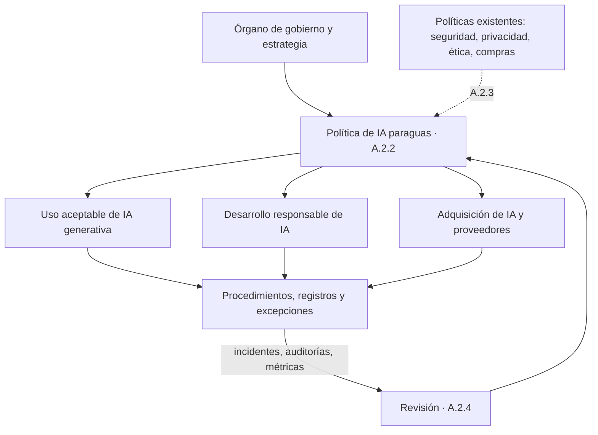

# A.2 · Políticas relacionadas con la IA

A.2 · Políticas
:material-view-grid-outline: 3 controles
:material-clock-outline: 25 min de lectura

**El objetivo, en palabras simples:** que la dirección deje por escrito hacia dónde va la organización con la IA y con qué reglas, de forma coherente con lo que necesita el negocio y con las demás políticas internas.

**Lo que está en juego:** sin una política clara, cada área decide por su cuenta qué herramienta usar, con qué datos y con cuánto riesgo; aparecen la IA en la sombra, las contradicciones con el aviso de privacidad y las contrataciones de servicios de IA que nadie evaluó.

!!! abstract "En una frase"
    El objetivo A.2 pide tres cosas fáciles de enunciar y difíciles de hacer bien: una política de IA con sustancia, un análisis honesto de cómo convive con las políticas que ya tienes y un mecanismo para que no se quede vieja.

## Por qué importa este objetivo

Piensa en el reglamento de un condominio. No le dice a nadie cómo decorar su departamento, pero sí fija qué se vale en las áreas comunes, quién resuelve cuando hay dudas, cómo se pide un permiso especial y qué pasa si alguien rompe las reglas. Tampoco puede contradecir la escritura del régimen de propiedad ni las leyes locales, y la asamblea lo actualiza cuando cambian las circunstancias: llegan las bicicletas eléctricas, alguien quiere instalar un cargador para su auto. La política de IA funciona igual. No detalla cada caso de uso, pero da el marco para decidirlos todos.

La IA entró a muchas organizaciones por la puerta de atrás: alguien abrió una cuenta gratuita de un asistente generativo, un proveedor activó "funciones inteligentes" en el sistema contable, el área comercial contrató un chatbot sin pasar por TI. Cuando no existe una regla, cada persona aplica su propio criterio, y ese criterio rara vez incluye el aviso de privacidad, el secreto profesional o las cláusulas de confidencialidad firmadas con clientes. La política es la herramienta con la que la dirección recupera el control sin frenar la innovación: le dice al personal qué puede hacer desde hoy, qué requiere autorización y qué está fuera de la mesa.

Este objetivo está muy amarrado a la cláusula 5. La [cláusula 5.2](../clausulas/c5-liderazgo.md#c-5-2) obliga a la alta dirección a establecer una política de IA con ciertos elementos mínimos; los controles de A.2 profundizan en su contenido, en su relación con el resto de las políticas internas y en su mantenimiento. La política también es el punto de partida de otros requisitos: los objetivos de IA deben ser coherentes con ella ([6.2](../clausulas/c6-planificacion.md#c-6-2)), la forma de evaluar riesgos de IA tiene que seguir su misma línea ([6.1.2](../clausulas/c6-planificacion.md#c-6-1-2)) y el personal debe conocerla y entender qué implica no cumplirla ([7.3](../clausulas/c7-apoyo.md#c-7-3)). Si la política es vaga, todo lo que cuelga de ella queda igual de vago.

La forma de la política cambia según tu rol frente a la IA (ver [roles en la IA](../fundamentos/roles-en-la-ia.md)):

- **Si usas IA de terceros**, el corazón de la política son las reglas de uso: qué herramientas están autorizadas, qué información nunca se comparte, quién aprueba nuevos casos de uso y cómo se revisan los resultados antes de entregarlos a un cliente.
- **Si desarrollas IA**, además necesitas principios de diseño y desarrollo responsable: criterios para los datos, pruebas de sesgo, supervisión humana y aprobaciones antes de pasar a producción.
- **Si provees IA a clientes**, la política también es un compromiso hacia afuera. Tus clientes, y los reguladores de tus clientes, querrán saber qué principios sigues; por eso es común publicar una versión resumida.

En todos los casos, el auditor no busca un documento bonito, sino uno que se note vivo: que se usó para decir "sí" o "no" a algo, que generó excepciones registradas y que cambió cuando el contexto cambió.

## Los controles de un vistazo

| Control | Qué pide, en una línea | Aplica a | Esfuerzo | Frente a ISO 27001 |
|---|---|---|---|---|
| [A.2.2 Política de IA](#a-2-2) | Tener una política documentada que oriente el desarrollo o el uso de IA. | Usa · Desarrolla · Provee | Medio | Similar |
| [A.2.3 Alineación con otras políticas de la organización](#a-2-3) | Detectar qué políticas existentes tocan a la IA y ajustarlas o referenciarlas. | Usa · Desarrolla · Provee | Bajo | Similar |
| [A.2.4 Revisión de la política de IA](#a-2-4) | Revisarla en fechas planeadas y cuando algo relevante cambie. | Usa · Desarrolla · Provee | Bajo | Equivalente |

!!! note "Sobre los nombres de los controles"
    Son traducciones libres de referencia del autor; la redacción oficial puede variar.

Así se ordenan las piezas: el órgano de gobierno y la estrategia alimentan una política paraguas, que convive con las políticas existentes, se aterriza en políticas temáticas y procedimientos, y se corrige con lo que enseña la operación.

## A.2.2 Política de IA {#a-2-2 .dx-control .obj-a2}

:material-cloud-download-outline: Usa IA de terceros
:material-code-braces: Desarrolla IA
:material-handshake-outline: Provee IA a clientes
:material-gauge: Esfuerzo medio
:material-approximately-equal: Similar a 27001

**Propósito.** Evitar que cada área decida por su cuenta cómo usar o construir IA. La política convierte la postura de la dirección (qué buscamos, qué no estamos dispuestos a hacer y quién decide) en reglas que todo el personal conoce.

**En la práctica.** Este control y la cláusula [5.2](../clausulas/c5-liderazgo.md#c-5-2) hablan del mismo documento. La cláusula fija el piso: la política tiene que estar documentada y comunicada, incluir el compromiso de cumplir los requisitos aplicables y de mejorar el SGIA, servir de base para fijar objetivos de IA, ser adecuada al propósito de la organización, remitir a otras políticas cuando haga falta y estar al alcance de las partes interesadas que corresponda. El control A.2.2 y su guía en el Anexo B le dan sustancia: en nuestra lectura, piden que la política nazca de la estrategia del negocio, de los valores de la organización, de cuánto riesgo está dispuesta a tolerar y del nivel de riesgo real de sus sistemas, y que incluya principios y una vía formal para manejar excepciones.

Una buena política de IA responde, como mínimo, estas preguntas. **¿Dónde aplica?** Áreas, sedes, sistemas y roles (usas, desarrollas o provees IA), y a quién obliga: personal, contratistas, practicantes. **¿Qué principios nos guían?** Equidad, transparencia, supervisión humana, privacidad, seguridad y rendición de cuentas, explicados en lenguaje de la organización (ver [principios de IA responsable](../fundamentos/principios-ia-responsable.md)). **¿Qué está permitido, condicionado o prohibido según el tipo de uso?** Un semáforo funciona muy bien. **¿Qué reglas especiales tiene la IA generativa?** Herramientas autorizadas, datos que jamás se escriben en una instrucción (*prompt*), revisión humana antes de entregar un resultado a un cliente y propiedad intelectual de lo generado. **¿Quién decide?** Roles, comité y la matriz RACI ([A.3.2](a3-organizacion-interna.md#a-3-2)). **¿Cómo se pide una excepción y qué pasa si alguien se desvía?** Quién autoriza, por cuánto tiempo, con qué controles compensatorios y dónde queda registrado.

Sobre la arquitectura documental hay dos caminos válidos. El primero es una **política paraguas** breve (tres a seis páginas), firmada por la alta dirección, que fija principios y reglas generales y remite a **políticas temáticas** con su propio dueño: uso aceptable de IA generativa, desarrollo responsable, adquisición de servicios de IA, datos para IA. El segundo es un solo documento más largo con capítulos. Te recomendamos el primero: la política paraguas casi no cambia, mientras que las temáticas pueden actualizarse cada trimestre sin volver a pasar por la firma de la dirección general.

Un ejemplo: una aseguradora en Colombia define su semáforo así. Verde: resumir documentos internos sin datos personales con la herramienta corporativa. Amarillo: usar IA para apoyar el análisis de siniestros, con evaluación de impacto y visto bueno del comité de IA. Rojo: rechazar una reclamación de manera automática, sin revisión humana. Con esa tabla, cualquier gerente sabe qué hacer antes de comprar o probar algo.

**Si ya tienes un SGSI**, tu política de seguridad (ISO 27001 A.5.1) te da el molde: aprobación por la dirección, comunicación, política general con políticas temáticas. Lo que cambia es el contenido. La política de IA mira las consecuencias para personas y sociedad, no solo la confidencialidad, integridad y disponibilidad, y necesita principios propios como la equidad, la transparencia o la supervisión humana.

Lo que **no** exige: un tratado de 40 páginas, prohibir la IA ni publicar el documento íntegro. Como basta con ponerla al alcance de las partes interesadas cuando corresponda, puedes compartir un extracto o una declaración pública de principios.

??? example "Ejemplo de índice de una política de IA paraguas"
    1. Propósito y mensaje de la dirección.
    2. Alcance: áreas, sedes, sistemas y roles frente a la IA; a quién obliga.
    3. Definiciones clave: sistema de IA, IA generativa, caso de uso, dueño del sistema.
    4. Principios de IA responsable de la organización.
    5. Compromisos: requisitos legales, contractuales y de clientes; mejora continua del SGIA.
    6. Reglas por tipo de uso (verde, amarillo, rojo) y alta de nuevos casos de uso.
    7. IA generativa: herramientas autorizadas, información prohibida, revisión humana, transparencia.
    8. Desarrollo y adquisición de IA (remite a las políticas temáticas).
    9. Roles y responsabilidades (remite a la matriz RACI).
    10. Cuándo es obligatoria una evaluación de riesgos o de impacto.
    11. Excepciones y desviaciones: solicitud, autorización, vigencia máxima, registro.
    12. Cómo reportar inquietudes e incidentes.
    13. Consecuencias del incumplimiento.
    14. Relación con otras políticas.
    15. Revisión, aprobación e historial de versiones.

!!! success "Implementación mínima viable"
    - Política de tres a seis páginas aprobada por la alta dirección, con fecha, versión y dueño.
    - Alcance, principios, semáforo de usos y una sección específica de IA generativa.
    - Procedimiento breve de excepciones con registro, aunque sea en una hoja de cálculo.
    - Comunicación documentada: correo, sesión de inducción, acuse de lectura.
    - Referencias explícitas a las políticas de seguridad, privacidad y ética.

!!! tip "Implementación madura"
    - Política paraguas estable más políticas temáticas con dueños y ciclos de revisión propios.
    - Principios traducidos a criterios verificables, por ejemplo: "toda decisión adversa a un cliente tiene revisión humana".
    - Acuse de lectura en el sistema de recursos humanos y preguntas sobre la política en la capacitación anual.
    - Tablero de excepciones (cuántas, de qué tipo, cuántas vencidas) que alimenta la revisión.
    - Versión pública resumida para clientes y reguladores en el sitio web o en un centro de confianza.

=== ":material-folder-check-outline: Evidencia típica"

    - Política vigente con firma o registro de aprobación de la alta dirección.
    - Control de versiones con fecha de la próxima revisión.
    - Evidencia de comunicación: correos, listas de asistencia, acuses de lectura.
    - Registro de excepciones con justificación, vigencia y aprobador.
    - Políticas temáticas (por ejemplo, uso aceptable de IA generativa) que remiten a la política paraguas.
    - Versión publicada o entregada a clientes, cuando aplique.

=== ":material-account-search-outline: Preguntas del auditor"

    1. ¿Quién aprobó esta política y cómo me lo demuestran?
    2. ¿Cómo se refleja en la política el nivel de riesgo de los sistemas que tienen en su inventario?
    3. Dame un ejemplo de un caso de uso que se haya aprobado o rechazado con base en la política.
    4. ¿Qué excepciones se concedieron en el último año, quién las autorizó y siguen vigentes?
    5. ¿Cómo se entera de la política una persona de nuevo ingreso?
    6. ¿Dónde está disponible para clientes u otras partes interesadas y quién decide qué se comparte?
    7. ¿Cómo usaron la política para fijar los objetivos de IA?

=== ":material-alert-outline: Errores comunes"

    - Copiar una política genérica de internet que menciona principios o sistemas que la organización ni tiene ni puede cumplir.
    - Redactarla tan abstracta ("usaremos la IA de forma ética") que no sirve para decidir ningún caso real.
    - Escribir solo una política de uso de chatbots y llamarla política de IA, o al revés, olvidar por completo la IA generativa.
    - No prever excepciones: el personal las hace de todos modos, pero sin registro ni control.
    - Que la firme TI o cumplimiento en lugar de la alta dirección.
    - Comunicarla una vez y nunca más.

=== ":material-scale-balance: ¿Se puede excluir?"

    **Podría justificarse si…** en nuestra lectura, prácticamente en ningún caso. La cláusula 5.2 ya obliga a tener una política de IA, así que excluir A.2.2 chocaría con un requisito certificable. Lo normal es que un mismo documento cumpla ambos y que en la SoA se registre como aplicable, por ejemplo: "Incluido. La política POL-IA-01 v2 cumple 5.2 y A.2.2; se complementa con la política de uso aceptable de IA generativa POL-IA-02".

    **No se justifica si…** en ningún escenario realista: toda organización dentro del alcance de un SGIA necesita una política de IA, sin importar si usa, desarrolla o provee sistemas.

**Relaciones.** Cláusulas: [5.1](../clausulas/c5-liderazgo.md#c-5-1), [5.2](../clausulas/c5-liderazgo.md#c-5-2), [6.2](../clausulas/c6-planificacion.md#c-6-2), [7.3](../clausulas/c7-apoyo.md#c-7-3), [7.4](../clausulas/c7-apoyo.md#c-7-4) · Controles: [A.2.3](#a-2-3), [A.2.4](#a-2-4), [A.3.2](a3-organizacion-interna.md#a-3-2), [A.6.1.2](a6-ciclo-de-vida.md#a-6-1-2), [A.9.2](a9-uso.md#a-9-2) · ISO 27001 A.5.1 (políticas de seguridad de la información) · Normas: ISO/IEC 38507 (ver [familia de normas](../fundamentos/familia-de-normas.md)) · **Anexo B:** la guía B.2.2 orienta sobre los insumos de los que conviene partir al redactar la política y sobre lo que debería agregar a lo que pide 5.2, en especial principios rectores y manejo de excepciones; también sugiere tratar ciertos temas dentro de la política o remitiendo a políticas específicas.

## A.2.3 Alineación con otras políticas de la organización {#a-2-3 .dx-control .obj-a2}

:material-cloud-download-outline: Usa IA de terceros
:material-code-braces: Desarrolla IA
:material-handshake-outline: Provee IA a clientes
:material-gauge-low: Esfuerzo bajo
:material-approximately-equal: Similar a 27001

**Propósito.** Que la política de IA no viva en una isla. Se trata de detectar en qué puntos las políticas que ya existen se ven afectadas por la IA, o ya le aplican, para que no se contradigan ni dejen huecos.

**En la práctica.** La IA atraviesa terrenos que ya tienen dueño: seguridad de la información, privacidad, calidad, compras, recursos humanos. El control pide determinar dónde esas políticas se tocan con lo que la organización quiere lograr con la IA. El cruce funciona en dos sentidos. A veces la IA obliga a ajustar una política existente: si un chatbot ahora trata datos personales de clientes, el aviso de privacidad probablemente necesita mencionar esa finalidad y al proveedor que interviene. Otras veces una política vigente ya resuelve un tema de IA y basta con remitir a ella: la clasificación de la información que definiste para tu SGSI es la que debe decir qué datos no pueden escribirse en una instrucción a una herramienta externa.

El método más práctico es una **matriz de cruce**. Haz la lista de tus políticas vigentes, léelas con "lentes de IA" y decide para cada una si hay que ajustarla, referenciarla desde la política de IA, dejarla igual o crear algo nuevo porque hay un hueco. Involucra al dueño de cada política: es quien tendrá que firmar el cambio, y quien mejor conoce sus implicaciones.

| Política existente | Dónde se cruza con la IA | Decisión | Ajuste de ejemplo |
|---|---|---|---|
| Seguridad de la información | Herramientas de IA como nuevos activos y servicios; amenazas propias como la inyección de instrucciones | Ajustar y referenciar | Agregar las herramientas de IA autorizadas al catálogo de software y remitir a la política de IA para los casos de uso |
| Clasificación de la información | Qué información puede entrar a cada herramienta de IA | Referenciar | Información confidencial solo en herramientas corporativas con contrato |
| Privacidad y aviso de privacidad | Nuevas finalidades, proveedores que tratan datos por cuenta de la organización, decisiones automatizadas, derechos ARCO | Ajustar | Actualizar el aviso para mencionar el asistente y el tratamiento que hace |
| Compras | Contratación de servicios con IA y funciones de IA que se activan en software ya contratado | Ajustar | Pregunta obligatoria "¿usa IA?" en la solicitud de compra, que dispara una evaluación |
| Gestión de proveedores | Debida diligencia de proveedores de IA, uso de datos de la organización para entrenar modelos | Ajustar | Cuestionario de IA y cláusula contractual de no entrenamiento |
| Código de ética o de conducta | Uso honesto de la IA, transparencia con clientes, no discriminación | Referenciar | Principio de uso responsable de IA y remisión al canal de inquietudes ([A.3.3](a3-organizacion-interna.md#a-3-3)) |
| Recursos humanos | IA en reclutamiento o evaluación del desempeño, sanciones, inducción | Ajustar | Ninguna decisión de contratación se toma solo con IA; la política de IA entra en la inducción |
| Comunicación y redes sociales | Textos, imágenes o voces generados con IA, afirmaciones de marketing sobre la IA | Ajustar | Revisión humana y criterios para indicar cuándo un contenido se generó con IA |
| Propiedad intelectual | Titularidad de lo generado, obras de terceros, secretos industriales en instrucciones | Ajustar | Qué código o documentos propios nunca se suben a herramientas externas |
| Retención documental | Historiales de conversaciones, datos de entrenamiento, bitácoras | Referenciar | Plazos de conservación de las conversaciones del chatbot en el catálogo de retención |

Arriba de todas las políticas está el órgano de gobierno: el consejo de administración o la junta de socios. La guía del control sugiere que lo que ese órgano ya definió para la organización (apetito de riesgo, ética, cumplimiento) informe la política de IA, y remite a ISO/IEC 38507, que orienta a los miembros del órgano de gobierno sobre cómo gobernar el uso de la IA. Dicho de forma práctica: si el consejo ya aprobó un marco de apetito de riesgo, tu política de IA no puede ignorarlo ni contradecirlo.

Un ejemplo: una universidad en Perú que adopta asistentes generativos descubre, al hacer la matriz, que su reglamento de integridad académica no dice nada sobre trabajos escritos con IA y que su política de propiedad intelectual de la investigación no prevé que los investigadores suban borradores inéditos a servicios externos. Dos ajustes pequeños evitan conflictos grandes. Por rol, los cruces cambian: quien **usa** IA suele concentrarse en compras, privacidad y uso aceptable; quien **desarrolla**, en la política de desarrollo seguro; quien **provee**, además, en los términos de servicio y en los contratos con clientes.

**Si ya tienes un SGSI**, tu política de seguridad ya convivía con otras políticas temáticas (ISO 27001 A.5.1). Reutiliza ese mapa y amplíalo a políticas que el SGSI casi nunca toca, como recursos humanos, comunicación, ética o propiedad intelectual.

Lo que **no** exige: reescribir todas tus políticas ni fusionarlas en una sola. Sí exige que el análisis exista y se pueda mostrar.

!!! success "Implementación mínima viable"
    - Lista de políticas vigentes con su dueño.
    - Matriz de cruce con la decisión para cada política y un responsable del ajuste.
    - Ajustes prioritarios hechos: aviso de privacidad, compras y uso aceptable.
    - Sección "Relación con otras políticas" dentro de la política de IA.

!!! tip "Implementación madura"
    - La matriz se actualiza cada vez que se crea o modifica una política, como paso del control documental.
    - La plantilla corporativa de políticas incluye un campo "¿toca a la IA?".
    - Revisión conjunta anual entre los dueños de seguridad, privacidad, legal y recursos humanos.
    - Trazabilidad entre los acuerdos del órgano de gobierno y la política de IA.
    - Indicador: porcentaje de políticas con análisis de IA vigente.

=== ":material-folder-check-outline: Evidencia típica"

    - Matriz de cruce fechada, con dueños y decisiones.
    - Políticas modificadas cuyo control de cambios muestra la referencia a la IA.
    - Aviso de privacidad actualizado cuando hubo nuevas finalidades.
    - Minuta o correos de validación con los dueños de cada política.
    - Sección de referencias cruzadas en la política de IA.

=== ":material-account-search-outline: Preguntas del auditor"

    1. ¿Qué políticas revisaron para ver si se cruzan con la IA y cómo eligieron cuáles?
    2. Muéstrame un caso en el que la IA obligó a modificar una política existente.
    3. ¿Su aviso de privacidad refleja los tratamientos que hacen sus sistemas de IA?
    4. Si mañana cambia la política de compras, ¿cómo se aseguran de que siga siendo coherente con la de IA?
    5. ¿Qué lineamientos del consejo o de la junta de socios tomaron en cuenta?
    6. ¿Detectaron contradicciones entre políticas? ¿Cómo las resolvieron?

=== ":material-alert-outline: Errores comunes"

    - Afirmar que "la política de IA es coherente con las demás" sin ningún análisis que lo respalde.
    - Revisar solo seguridad y privacidad, y olvidar compras, recursos humanos o comunicación, que es justo por donde suele entrar la IA en la sombra.
    - Copiar textos de otras políticas dentro de la de IA, lo que crea duplicados que con el tiempo se contradicen.
    - No involucrar a los dueños de las demás políticas.
    - Olvidar las políticas del corporativo o de los clientes cuando la organización es filial o proveedora.

=== ":material-scale-balance: ¿Se puede excluir?"

    **Podría justificarse si…** en nuestra lectura, casi nunca. Solo en un caso límite (una organización recién creada sin ninguna otra política formal) se podría argumentar que no hay con qué alinear, y aun así conviene incluir el control y documentar esa conclusión. Una redacción típica de inclusión: "Incluido. La matriz MC-IA-01 identificó nueve políticas con cruce; seis se ajustaron y tres se referencian desde POL-IA-01".

    **No se justifica si…** la organización tiene cualquier política de seguridad, privacidad, ética o compras, que es el caso de prácticamente todas las que buscan certificarse.

**Relaciones.** Cláusulas: [4.1](../clausulas/c4-contexto.md#c-4-1), [5.2](../clausulas/c5-liderazgo.md#c-5-2), [7.5](../clausulas/c7-apoyo.md#c-7-5) · Controles: [A.2.2](#a-2-2), [A.2.4](#a-2-4), [A.9.2](a9-uso.md#a-9-2), [A.10.3](a10-terceros.md#a-10-3) · ISO 27001 A.5.1 (políticas de seguridad de la información) · Normas: ISO/IEC 38507, ISO/IEC 27001, ISO/IEC 27701 (ver [familia de normas](../fundamentos/familia-de-normas.md)) · **Anexo B:** la guía B.2.3 recomienda analizar a fondo los dominios que se cruzan con la IA, como calidad, seguridad y privacidad, y decidir si se actualizan esas políticas o se cubre el tema dentro de la de IA; además, señala el papel del órgano de gobierno y remite a ISO/IEC 38507.

## A.2.4 Revisión de la política de IA {#a-2-4 .dx-control .obj-a2}

:material-cloud-download-outline: Usa IA de terceros
:material-code-braces: Desarrolla IA
:material-handshake-outline: Provee IA a clientes
:material-gauge-low: Esfuerzo bajo
:material-equal: Equivalente en 27001

**Propósito.** Que la política no se quede congelada mientras la tecnología, las leyes y el propio negocio cambian cada trimestre.

**En la práctica.** La revisión tiene dos modos. El **periódico**, en intervalos que la organización define (te recomendamos al menos una vez al año, idealmente antes de la revisión por la dirección para llevarle conclusiones). Y el **extraordinario**, cuando algo lo amerita. En ambos casos la pregunta es la misma que en cualquier sistema de gestión: ¿la política sigue siendo apropiada para lo que hacemos (idoneidad), alcanza para cubrirlo (adecuación) y de verdad está funcionando (eficacia)?

**¿Quién la revisa?** Conviene que la responsabilidad de preparar, revisar y evaluar la política recaiga en un rol designado con el aval de la dirección; casi siempre es el responsable del SGIA. Esa persona consulta a legal, privacidad, seguridad y a las áreas de negocio, y la versión nueva la aprueba la alta dirección. Los insumos típicos son los resultados de la [revisión por la dirección](../clausulas/c9-evaluacion-del-desempeno.md#c-9-3), los incidentes, los hallazgos de auditoría, el registro de excepciones y los cambios del entorno.

| Disparador | Ejemplo | Qué revisar en la política |
|---|---|---|
| Cambio legal o regulatorio | Nueva ley de datos personales; reglamento de una ley de IA en un país donde operas; un cliente europeo que te traslada obligaciones | Compromisos de cumplimiento, transparencia, decisiones automatizadas |
| Nuevo tipo de IA | Agentes que ejecutan acciones por su cuenta (enviar correos, hacer pagos); IA incrustada en una herramienta que ya usas | Semáforo de usos, autorizaciones, supervisión humana |
| Incidente o casi incidente | Alguien pega una nómina en un chatbot gratuito; el chatbot da un plazo fiscal equivocado | Prohibiciones, controles técnicos, capacitación |
| Resultados de la revisión por la dirección | La dirección decide entrar a un nuevo mercado o fija un objetivo nuevo | Alcance, principios, objetivos |
| Hallazgos de auditoría | No conformidad por excepciones sin registro | Procedimiento de excepciones |
| Excepciones recurrentes | Cinco áreas piden la misma excepción en un trimestre | Si la regla está mal planteada |
| Cambio de negocio o de proveedor | Nuevo producto, fusión, cambio del proveedor del modelo | Alcance, roles, compromisos con clientes |

Un ejemplo regional: una universidad en Perú adelantó la revisión de su política cuando se publicó el reglamento de la ley peruana sobre IA, aunque la revisión anual estaba programada para meses después. Ese es exactamente el tipo de cambio que no debe esperar al calendario (ver [contexto de México y Latinoamérica](../integracion/contexto-mexico-latam.md)).

Una revisión que concluye "sin cambios" es perfectamente válida si queda registrada: fecha, participantes, insumos considerados y razón de la conclusión. Lo que no es válido es cambiar la fecha de la portada y llamarlo revisión.

**Si ya tienes un SGSI**, este control equivale a lo que ISO 27001 A.5.1 ya pide para las políticas de seguridad: revisión planificada y ante cambios significativos. Reutiliza el mismo calendario, el mismo control documental y el mismo comité. Lo que hay que agregar son los disparadores propios de la IA (nuevos tipos de sistemas, cambios del proveedor del modelo, regulación específica de IA) y el vínculo explícito con los resultados de la revisión por la dirección del SGIA.

Lo que **no** exige: reescribir la política cada año ni una frecuencia fija; la frecuencia la defines tú y la cumples.

!!! success "Implementación mínima viable"
    - Frecuencia de revisión y responsable definidos dentro de la propia política.
    - Lista de disparadores de revisión extraordinaria.
    - Registro de cada revisión, aunque concluya "sin cambios".
    - Historial de versiones con un resumen de lo que cambió.
    - Nueva versión aprobada por la alta dirección y comunicada.

!!! tip "Implementación madura"
    - Revisión calendarizada antes de la revisión por la dirección y alimentada con métricas: excepciones, incidentes, hallazgos.
    - Vigilancia regulatoria con responsable y bitácora de cambios legales evaluados.
    - Disparadores conectados con la planificación de cambios ([6.3](../clausulas/c6-planificacion.md#c-6-3)).
    - Comunicación de cambios con formato "qué cambió y qué te toca", con acuse de lectura.
    - Indicador: días transcurridos entre un disparador y la versión actualizada.

=== ":material-folder-check-outline: Evidencia típica"

    - Historial de versiones y control de cambios de la política.
    - Minutas o registros de revisión, incluidas las que no generaron cambios.
    - Entradas y resultados de la revisión por la dirección vinculados con la política.
    - Bitácora de vigilancia regulatoria.
    - Comunicación de la versión vigente al personal.

=== ":material-account-search-outline: Preguntas del auditor"

    1. ¿Cuándo fue la última revisión de la política y qué la motivó?
    2. ¿Quién es responsable de revisarla y quién aprueba los cambios?
    3. ¿Qué cambios legales, tecnológicos o de negocio ocurrieron desde la última versión y cómo los evaluaron?
    4. ¿Cómo influyeron los resultados de la última revisión por la dirección en la política?
    5. Después del último incidente de IA, ¿evaluaron si la política tenía que cambiar?
    6. Muéstrame cómo comunicaron la versión vigente.

=== ":material-alert-outline: Errores comunes"

    - Cambiar solo la fecha de la portada y llamarlo revisión.
    - Comprometer una revisión anual y no hacerla, o no poder demostrarla.
    - Revisar solo por calendario e ignorar disparadores evidentes, como un incidente grave o un producto nuevo.
    - Aprobar una nueva versión y no comunicarla; el personal sigue trabajando con la anterior.
    - Que la misma persona redacte, revise y apruebe sin intervención de la dirección.

=== ":material-scale-balance: ¿Se puede excluir?"

    **Podría justificarse si…** no vemos un supuesto razonable. Si la política existe, tiene que revisarse; la cláusula 5.2 y la revisión por la dirección (9.3) lo dan por hecho.

    **No se justifica si…** en ningún caso. Una redacción típica de inclusión en la SoA: "Incluido. Revisión anual previa a la revisión por la dirección y revisión extraordinaria ante los disparadores del apartado 15 de POL-IA-01".

**Relaciones.** Cláusulas: [5.2](../clausulas/c5-liderazgo.md#c-5-2), [6.3](../clausulas/c6-planificacion.md#c-6-3), [9.3](../clausulas/c9-evaluacion-del-desempeno.md#c-9-3), [10.1](../clausulas/c10-mejora.md#c-10-1) · Controles: [A.2.2](#a-2-2), [A.2.3](#a-2-3), [A.3.2](a3-organizacion-interna.md#a-3-2), [A.8.5](a8-informacion-partes-interesadas.md#a-8-5) · ISO 27001 A.5.1 (políticas de seguridad de la información) · Normas: ISO/IEC 38507 · **Anexo B:** la guía B.2.4 sugiere asignar a un rol avalado por la dirección la tarea de mantener la política, aprovechar cada revisión para buscar mejoras ante cambios del entorno (legales, técnicos, de negocio) y considerar lo que resulte de la revisión por la dirección.

## Cómo se ve este objetivo en los casos prácticos

=== "Contadores Alameda"

    **Detonante.** Un colaborador pegó una nómina con datos personales en un chatbot gratuito. La socia directora decidió que eso no podía volver a pasar sin que nadie lo supiera.

    **Política (A.2.2).** Firmó una política paraguas de cuatro páginas y, debajo, una política de uso aceptable de IA generativa de una sola hoja con semáforo. Verde: usar IA-01 (el asistente de la suite de ofimática, con licencia empresarial) para redactar y resumir información interna. Amarillo: usar IA-01 con datos personales de clientes, solo con la cuenta corporativa y revisando el resultado antes de enviarlo. Rojo: cualquier chatbot gratuito o cuenta personal con información de clientes, fiscal o de nómina.

    **Alineación (A.2.3).** La matriz de cruce identificó seis políticas. Los ajustes clave: el aviso de privacidad ahora menciona a Alma (IA-02) y a BotNorte como proveedor que trata datos por cuenta del despacho; el contrato de servicios con clientes incluye una cláusula sobre el uso de IA; y el reglamento interior de trabajo remite a la política de IA para efectos disciplinarios.

    **Revisión (A.2.4).** Revisión anual en enero, a cargo del gerente de TI, con aprobación de la socia directora. La primera revisión extraordinaria llegó antes: al contestar el cuestionario de proveedores del banco cliente, descubrieron que la política no decía nada sobre informar a los clientes cuando interactúan con una IA. Se agregó el compromiso.

    [:octicons-arrow-right-24: Ver el caso completo](../casos-practicos/pyme-usa-ia-generativa.md)

=== "Monarca Crédito"

    **Política (A.2.2).** La dirección general aprobó la política y la presentó al consejo. Sus principios se escribieron pensando en los solicitantes de crédito: decisiones explicables (motivos de rechazo comprensibles), vigilancia de sesgos por sexo, edad y entidad federativa, revisión humana en la banda gris del Score Monarca v3 y posibilidad de pedir reconsideración. La política temática de desarrollo de modelos exige que ningún modelo pase a producción sin aprobación del Comité de Modelos.

    **Alineación (A.2.3).** El cruce más importante fue con el manual de crédito y la política de riesgo de crédito: ambos describían cómo se aprueba un préstamo como si todo fuera manual. También se ajustaron la política de privacidad (consentimiento para usar datos de comportamiento en la app), la de atención de reclamaciones y la de proveedores, por la API de detección de fraude (IA-03).

    **Revisión (A.2.4).** Cuando el área de cobranza propuso usar un asistente generativo para redactar mensajes a clientes, el oficial de cumplimiento activó una revisión extraordinaria: el semáforo no contemplaba contenido generado que se envía directamente a clientes. Se agregó como uso amarillo, con plantillas aprobadas y revisión humana.

    [:octicons-arrow-right-24: Ver el caso completo](../casos-practicos/fintech-scoring.md)

=== "Conversa Labs"

    **Política (A.2.2).** Conversa tiene tres capas: una política paraguas firmada por el CEO; una política de desarrollo responsable para el equipo técnico que dirige el CTO (evaluaciones de calidad, pruebas adversarias, filtros de seguridad); y una declaración pública de principios en su centro de confianza, que incluye el compromiso de no entrenar modelos con datos de clientes.

    **Alineación (A.2.3).** Ese compromiso público tenía que decir exactamente lo mismo que los términos de servicio, el contrato de tratamiento de datos y la política de desarrollo seguro. La matriz también detectó un cruce con la política de comunicación: marketing ya no puede prometer asistentes que "nunca se equivocan".

    **Revisión (A.2.4).** La dueña del SGIA (responsable de Confianza y Seguridad) revisa la política cada año y cada vez que cambia algo relevante del proveedor del modelo fundacional. La firma del contrato con el cliente de España disparó una revisión extraordinaria para incorporar las obligaciones de transparencia del Reglamento de IA de la UE que pueden aplicar a ese despliegue (ver [Reglamento de IA de la UE](../integracion/reglamento-ia-ue.md)).

    [:octicons-arrow-right-24: Ver el caso completo](../casos-practicos/empresa-desarrolla-chatbot.md)

## Plantillas y recursos relacionados

- [Plantilla de política de IA](../plantillas/index.md#politica-de-ia)
- [Política de uso aceptable de IA generativa](../plantillas/index.md#uso-aceptable-ia-generativa)
- [Cláusula 5 · Liderazgo](../clausulas/c5-liderazgo.md): requisitos de la política en 5.2.
- [Principios de IA responsable](../fundamentos/principios-ia-responsable.md): de dónde sacar los principios de tu política.
- [A.3 · Organización interna](a3-organizacion-interna.md): quién aprueba, quién revisa y a quién se reportan las inquietudes.
- [Documentación requerida](../implementacion/documentacion-requerida.md) y [errores frecuentes](../implementacion/errores-frecuentes.md).
- [Integración con ISO 27001](../integracion/con-iso27001.md): cómo reutilizar tu marco de políticas del SGSI.
