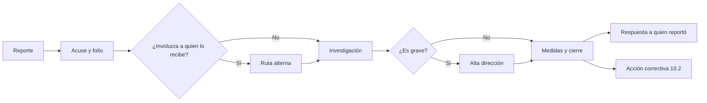

# A.3 · Organización interna

A.3 · Organización
:material-view-grid-outline: 2 controles
:material-clock-outline: 19 min de lectura

**El objetivo, en palabras simples:** que dentro de la organización siempre haya alguien con nombre y apellido que responda por cada aspecto de la IA, y que cualquier persona del equipo pueda levantar la mano, sin miedo, cuando algo le preocupa.

**Lo que está en juego:** la responsabilidad difusa. Cuando un sistema de IA falla y nadie es dueño, TI culpa al negocio, el negocio culpa al proveedor y las señales de alerta que vio alguien del equipo nunca llegaron a quien podía actuar.

!!! abstract "En una frase"
    A.3 asegura dos cosas: que cada actividad de la IA tenga un responsable claro y que exista un camino protegido para que las preocupaciones del personal lleguen a quien puede decidir.

## Por qué importa este objetivo

En muchas ciudades de México, una obra de construcción de cierto tamaño necesita un Director Responsable de Obra que firma y responde por ella, y en una obra bien llevada todos saben a quién avisar si ven una grieta. Ninguna de las dos cosas sustituye a la otra: el director puede ser excelente, pero si el albañil que vio la grieta tiene miedo de hablar, el problema crece. El objetivo A.3 trae esa misma lógica a la IA: el control [A.3.2](#a-3-2) nombra a los responsables y el control [A.3.3](#a-3-3) instala el canal para avisar de las grietas.

La IA es especialmente propensa a la responsabilidad difusa porque en un mismo sistema intervienen muchas disciplinas: el área de negocio que lo pidió, el equipo de datos que lo construyó o configuró, TI que lo opera, legal que revisó el contrato, el proveedor que entrega el modelo y las personas que supervisan sus resultados. Si no se escribe quién decide qué, cada uno asume que otro lo está cuidando. Y las señales tempranas casi siempre las ve alguien de la primera línea: la analista que nota que el modelo rechaza a demasiados solicitantes de cierta región, el agente de atención que ve al chatbot inventar un plazo, el desarrollador al que le piden saltarse las pruebas de sesgo para llegar a la fecha de lanzamiento.

El objetivo se conecta con varias cláusulas. La [cláusula 5.3](../clausulas/c5-liderazgo.md#c-5-3) obliga a la alta dirección a asignar responsabilidades sobre el sistema de gestión; A.3.2 extiende esa idea a cada sistema de IA y a todo su ciclo de vida. Las competencias que esos roles necesitan se gestionan con [7.2](../clausulas/c7-apoyo.md#c-7-2) y con el control [A.4.6](a4-recursos.md#a-4-6). Las inquietudes que llegan por el canal de A.3.3 alimentan la [acción correctiva (10.2)](../clausulas/c10-mejora.md#c-10-2) y la revisión por la dirección. Cuando las responsabilidades se reparten con proveedores o clientes, entra en juego [A.10.2](a10-terceros.md#a-10-2).

Según tu rol frente a la IA:

- **Si usas IA de terceros**, los roles clave son el dueño de cada herramienta, quien revisa sus resultados y quien gestiona al proveedor. El canal de inquietudes recibirá sobre todo reportes de uso indebido.
- **Si desarrollas IA**, se suman ciencia de datos, validación independiente de modelos y un comité que autorice pasos a producción. El canal debe proteger a quien denuncia presiones para lanzar sin pruebas suficientes.
- **Si provees IA a clientes**, además hay que definir quién atiende a los clientes cuando algo falla y quién comunica los cambios; el canal interno debe incluir a contratistas como etiquetadores o equipos de pruebas.

## Los controles de un vistazo

| Control | Qué pide, en una línea | Aplica a | Esfuerzo | Frente a ISO 27001 |
|---|---|---|---|---|
| [A.3.2 Roles y responsabilidades de IA](#a-3-2) | Definir y asignar quién hace qué en la IA, según las necesidades de la organización. | Usa · Desarrolla · Provee | Medio | Similar |
| [A.3.3 Reporte de inquietudes](#a-3-3) | Tener un proceso para que el personal reporte inquietudes sobre la IA durante todo su ciclo de vida. | Usa · Desarrolla · Provee | Medio | Similar |

!!! note "Sobre los nombres de los controles"
    Son traducciones libres de referencia del autor; la redacción oficial puede variar.

## A.3.2 Roles y responsabilidades de IA {#a-3-2 .dx-control .obj-a3}

:material-cloud-download-outline: Usa IA de terceros
:material-code-braces: Desarrolla IA
:material-handshake-outline: Provee IA a clientes
:material-gauge: Esfuerzo medio
:material-approximately-equal: Similar a 27001

**Propósito.** Que cada actividad relevante de la IA (decidir, construir, evaluar, supervisar, contratar, cumplir) tenga un responsable identificado, para que la rendición de cuentas no se diluya entre áreas.

**En la práctica.** El control pide definir y asignar los roles de IA de acuerdo con lo que la organización necesita. En nuestra lectura, la clave está en esa última parte: no hay un organigrama obligatorio, sino que los roles salen de la política de IA, de los objetivos y de los riesgos identificados, de modo que ningún riesgo relevante se quede sin dueño. Se vale priorizar: empieza por los sistemas de mayor impacto. No lo confundas con la [cláusula 5.3](../clausulas/c5-liderazgo.md#c-5-3), que se enfoca en quién cuida el sistema de gestión y le informa a la dirección; A.3.2 baja al nivel de cada sistema y de cada etapa de su ciclo de vida.

Estos son los roles que aparecen con más frecuencia (sus nombres son ilustrativos; lo importante es la función):

| Rol | Qué le toca | En una PyME suele recaer en… |
|---|---|---|
| Alta dirección | Aprueba la política y el apetito de riesgo, da recursos, acepta riesgos residuales | Dirección general o socios |
| Responsable del SGIA | Coordina el sistema de gestión y reporta su desempeño a la dirección | Gerencia de TI o de cumplimiento |
| Dueño del sistema de IA | Responde por un sistema concreto: uso previsto, riesgos, cambios, proveedor | Líder del área que usa el sistema |
| Evaluador de impacto | Conduce la evaluación de impacto y consulta a personas afectadas o expertas | Cumplimiento o privacidad, con apoyo externo |
| Supervisor humano | Revisa, corrige o anula resultados; puede detener el sistema | Analistas, ejecutivos de atención |
| Responsable de datos | Cuida calidad, procedencia y permisos de uso de los datos | Dueño del proceso o TI |
| Comité de IA o de modelos | Autoriza casos de uso, pasos a producción, cambios mayores y excepciones | Reunión mensual de tres o cuatro personas |
| Compras y gestión de proveedores | Evalúa y contrata servicios de IA, cuida las cláusulas | Administración |
| Legal y privacidad | Requisitos legales, aviso de privacidad, contratos, derechos ARCO | Coordinación de cumplimiento o despacho externo |
| Seguridad de la información | Amenazas propias de la IA, accesos, incidentes | TI o proveedor de seguridad gestionada |
| Desarrollo y ciencia de datos | Construye, prueba y documenta modelos (solo si desarrollas) | Equipo técnico o proveedor de desarrollo |

Con esos roles se arma una matriz RACI: para cada actividad, quién la ejecuta (R), quién rinde cuentas y aprueba (A, solo uno), a quién se consulta (C) y a quién se informa (I). Un ejemplo compacto:

| Actividad | R (ejecuta) | A (rinde cuentas) | C (consultados) | I (informados) |
|---|---|---|---|---|
| Redactar y publicar la política de IA | Responsable del SGIA | Alta dirección | Legal y privacidad, seguridad, comité de IA | Todo el personal |
| Dar de alta un caso de uso nuevo | Dueño del sistema | Comité de IA | Responsable del SGIA, legal, seguridad, datos | Alta dirección |
| Evaluación de impacto | Evaluador de impacto | Dueño del sistema | Legal y privacidad, datos, representantes de usuarios | Comité de IA |
| Evaluación de riesgos y propuesta de tratamiento | Dueño del sistema | Responsable del SGIA | Seguridad, datos, legal | Alta dirección |
| Aceptación de riesgos residuales | Responsable del SGIA | Alta dirección | Comité de IA | Dueño del sistema |
| Evaluar y contratar un proveedor de IA | Compras | Dueño del sistema | Seguridad, legal y privacidad, responsable del SGIA | Comité de IA |
| Autorizar el paso a producción | Dueño del sistema | Comité de IA | Seguridad, datos, legal | Responsable del SGIA |
| Supervisar resultados en operación | Supervisores humanos | Dueño del sistema | Datos, ante anomalías | Responsable del SGIA |
| Atender un incidente de IA | Seguridad o el equipo técnico | Dueño del sistema | Legal y privacidad, comunicación | Alta dirección |

**PyMEs: acumulación de roles y segregación.** En una organización de 50 personas, la misma persona puede ser responsable del SGIA, encargada de seguridad y dueña de un sistema. Eso es aceptable; lo que conviene evitar es que alguien se apruebe a sí mismo. Tres reglas prácticas: nadie autoriza sus propias excepciones, quien es dueño de un sistema no es el único que evalúa su impacto y nadie audita su propio trabajo ([9.2](../clausulas/c9-evaluacion-del-desempeno.md#c-9-2)). Si no hay a quién más asignar, compensa con una segunda revisión por parte de un socio, un comité pequeño o un asesor externo, y deja escrito cómo resolviste el conflicto.

Un ejemplo: un hospital privado en Chile que adopta un asistente para resumir expedientes no inventó un comité nuevo: amplió su comité de ética asistencial con la jefatura de TI y la encargada de privacidad, y le dio la facultad de autorizar los usos clínicos de IA.

**Si ya tienes un SGSI**, reutiliza la estructura de roles de ISO 27001 A.5.2 y tus reglas de segregación de ISO 27001 A.5.3. Lo que hay que agregar son los roles propios de la IA (dueño del sistema, evaluador de impacto, supervisor humano, comité de modelos) y responsabilidades que van más allá de la seguridad, como la equidad o la explicabilidad.

Lo que **no** exige: un director de IA, contrataciones nuevas ni un comité de tiempo completo. Sí exige que las responsabilidades se describan con el detalle suficiente para que cada persona sepa qué hacer, y que se comuniquen.

!!! success "Implementación mínima viable"
    - Matriz RACI de IA con las actividades clave y una sola A por actividad.
    - Dueño nombrado para cada sistema del inventario.
    - Responsable del SGIA designado por escrito por la alta dirección.
    - Supervisores humanos identificados para los sistemas que lo requieren.
    - Registro de roles acumulados y de cómo se compensa la falta de segregación.

!!! tip "Implementación madura"
    - Comité de IA o de modelos con estatuto, quórum, periodicidad y minutas.
    - Responsabilidades de IA incluidas en descripciones de puesto y en objetivos de desempeño.
    - Cada rol vinculado a las competencias que requiere ([A.4.6](a4-recursos.md#a-4-6)) y a su plan de capacitación.
    - RACI revisada ante reestructuras y en cada revisión por la dirección.
    - Indicador de sistemas sin dueño o con dueño que ya dejó la organización, con meta de cero.

=== ":material-folder-check-outline: Evidencia típica"

    - Matriz RACI de IA aprobada y vigente.
    - Nombramientos firmados: responsable del SGIA, dueños de sistemas, integrantes del comité.
    - Descripciones de puesto con responsabilidades de IA.
    - Estatuto y minutas del comité de IA o de modelos.
    - Inventario de sistemas de IA con dueño asignado.
    - Entrevistas en las que la persona nombrada explica lo que le toca.

=== ":material-account-search-outline: Preguntas del auditor"

    1. ¿Quién es el dueño de este sistema de IA? (Y al dueño:) ¿qué decisiones puedes tomar tú y cuáles no?
    2. ¿Cómo decidieron qué roles de IA necesitaban? ¿Qué riesgos u objetivos tomaron en cuenta?
    3. ¿Quién puede detener un sistema de IA que se está comportando mal? ¿Ha ocurrido?
    4. ¿Qué pasa cuando el dueño de un sistema deja la organización?
    5. ¿Dónde se acumulan roles y cómo evitan que alguien se apruebe a sí mismo?
    6. Muéstrame las minutas del comité de IA de los últimos seis meses.
    7. ¿Cómo comunicaron estas responsabilidades a las personas designadas?

=== ":material-alert-outline: Errores comunes"

    - Asignar "todo lo de IA" a TI.
    - Una RACI con varias A por actividad, o con la A en un comité que no sesiona.
    - Roles en papel que las propias personas desconocen.
    - Sistemas sin dueño, sobre todo las funciones de IA incrustadas en software contratado.
    - Un supervisor humano que solo da clic en "aprobar" sin tiempo, información ni autoridad para discrepar.
    - Olvidar a compras y a legal, que es por donde entran los proveedores de IA.

=== ":material-scale-balance: ¿Se puede excluir?"

    **Podría justificarse si…** no vemos un supuesto razonable. Un SGIA sin roles definidos no es operable, y la cláusula 5.3 ya exige asignar responsabilidades. Lo que sí se adapta es la escala: en una organización pequeña, la RACI puede tener seis filas y tres personas.

    **No se justifica si…** en ningún caso. Una redacción típica de inclusión: "Incluido. Roles definidos en la matriz RACI-IA v1, aprobada por la dirección general; dueños asignados en el inventario de sistemas de IA".

**Relaciones.** Cláusulas: [5.1](../clausulas/c5-liderazgo.md#c-5-1), [5.3](../clausulas/c5-liderazgo.md#c-5-3), [7.2](../clausulas/c7-apoyo.md#c-7-2), [7.4](../clausulas/c7-apoyo.md#c-7-4), [9.2](../clausulas/c9-evaluacion-del-desempeno.md#c-9-2) · Controles: [A.2.2](a2-politicas.md#a-2-2), [A.3.3](#a-3-3), [A.4.6](a4-recursos.md#a-4-6), [A.9.3](a9-uso.md#a-9-3), [A.10.2](a10-terceros.md#a-10-2) · ISO 27001 A.5.2 (roles y responsabilidades de seguridad) e ISO 27001 A.5.3 (segregación de funciones) · Normas: ISO/IEC 22989 para los roles del ecosistema de IA (ver [roles en la IA](../fundamentos/roles-en-la-ia.md)) · **Anexo B:** la guía B.3.2 explica por qué definir roles es la base de la rendición de cuentas, sugiere asignarlos a la luz de la política, los objetivos y los riesgos, permite priorizar y ofrece ejemplos de áreas que suelen necesitar un responsable, desde la gestión de riesgos hasta la calidad de los datos.

## A.3.3 Reporte de inquietudes {#a-3-3 .dx-control .obj-a3}

:material-cloud-download-outline: Usa IA de terceros
:material-code-braces: Desarrolla IA
:material-handshake-outline: Provee IA a clientes
:material-gauge: Esfuerzo medio
:material-approximately-equal: Similar a 27001

**Propósito.** Que quien vea algo preocupante en la forma en que la organización desarrolla, provee o usa un sistema de IA pueda decirlo sin miedo, y que alguien con autoridad escuche, investigue y actúe.

**En la práctica.** El control pide definir e implementar un proceso para reportar inquietudes sobre el papel de la organización frente a un sistema de IA, en cualquier etapa de su ciclo de vida. Lo usan las personas que trabajan para la organización, tanto en nómina como contratadas. Ejemplos de inquietudes: un analista nota que el modelo rechaza a más solicitantes de un estado que de otros; una desarrolladora recibe presión para saltarse las pruebas de sesgo; un compañero sigue usando su cuenta personal de un chatbot con datos de clientes; el área comercial promete capacidades que el producto no tiene; un proveedor parece usar datos de forma contraria al contrato.

Un buen canal responde bien a estas preguntas de diseño:

| Pregunta de diseño | Qué esperar de un buen canal | Ejemplo |
|---|---|---|
| ¿Quién lo puede usar y cómo se entera? | Abierto al personal propio y contratado; se difunde en la inducción, la intranet y recordatorios periódicos | Código QR en las salas de juntas y en el portal de proveedores |
| ¿Cómo se protege a quien reporta? | Opción confidencial, anónima o ambas; protección efectiva contra represalias, también para quienes investigan | Plataforma que no registra datos de quien reporta y da seguimiento por folio |
| ¿Quién lo atiende? | Personas preparadas en gestión de denuncias, con nociones de IA y sin conflicto de interés | Comité de ética apoyado por el responsable del SGIA |
| ¿Qué pueden hacer quienes lo atienden? | Facultades para pedir información, entrevistar, recomendar suspender un sistema y proponer medidas | Puede solicitar a ciencia de datos los reportes de sesgo |
| ¿Cuándo llega a la dirección? | Criterios de escalamiento oportuno según gravedad, personas afectadas o nivel jerárquico de los implicados | Casos graves a la dirección general en 48 horas |
| ¿En cuánto tiempo se responde? | Acuse de recibo, plazos de investigación y de cierre, retroalimentación a quien reportó | Acuse en tres días hábiles, cierre en 30 días |
| ¿Qué se aprende? | Estadísticas agregadas que no revelan identidades, útiles para la revisión por la dirección | Tendencias trimestrales por tipo de inquietud |

**Reutiliza lo que ya tienes.** Muchas organizaciones en México y Latinoamérica ya operan una línea ética o de denuncia, a menudo con un proveedor externo, creada para temas de corrupción, fraude o acoso. Usarla es válido y, en nuestra opinión, lo más sensato. Solo hay que agregar una categoría de IA al formulario, capacitar a quienes reciben los reportes para entender estos temas, definir cómo se canaliza un caso al responsable del SGIA sin revelar identidades y decidir cuándo un reporte se convierte en un incidente que se gestiona con [A.8.4](a8-informacion-partes-interesadas.md#a-8-4). Como referencia de buenas prácticas, la guía remite a ISO 37002, la norma de sistemas de gestión de denuncias, que desarrolla con detalle la confianza, la imparcialidad y la protección de quien denuncia.

**No es lo mismo que A.8.3.** El control [A.8.3](a8-informacion-partes-interesadas.md#a-8-3) trata del canal **externo**: usuarios, clientes, personas afectadas y otros terceros que reportan impactos adversos. A.3.3 es el canal **interno**. Pueden compartir el equipo que clasifica los casos, pero el público, la difusión y las expectativas de confidencialidad son distintos. Tampoco es lo mismo que el reporte de eventos de seguridad: ese es operativo y rara vez anónimo, mientras que aquí caben preocupaciones éticas y la protección de quien reporta es central.

**En una PyME sin línea ética**, basta un formulario que no pida iniciar sesión, con opción anónima, y dos receptores alternos (por ejemplo, una socia y un asesor externo) para que el canal no termine en la persona que podría estar involucrada.

**Si ya tienes un SGSI**, el reporte de eventos de ISO 27001 A.6.8 te da la plomería: medios de reporte, registro y tiempos. Hay que añadir lo que ese control no pide: confidencialidad o anonimato, protección contra represalias y un alcance que incluya preocupaciones éticas, no solo de seguridad.

Lo que **no** exige: una línea telefónica 24/7 operada por un tercero ni que el anonimato sea la única opción. Sí exige que el canal funcione, que se conozca y que proteja.

!!! legal "Revisa tus obligaciones"
    Algunas regulaciones sectoriales o nacionales imponen requisitos propios a los canales de denuncia. Confirma con tu área legal si te aplica alguno; en ese caso, el canal de inquietudes sobre IA debe respetar esas reglas.

!!! success "Implementación mínima viable"
    - Procedimiento breve: medios para reportar, quién recibe, plazos, escalamiento y protección.
    - Al menos un medio con opción confidencial o anónima.
    - Ruta alterna si el reporte involucra a quien normalmente lo recibe.
    - Difusión del canal al personal y a contratistas.
    - Registro de reportes con folio, estado y fecha de cierre.
    - Compromiso de no represalias en el código de conducta o en la política de IA.

!!! tip "Implementación madura"
    - Línea ética operada por un tercero, con categoría específica de IA y seguimiento anónimo por folio.
    - Receptores capacitados en temas de IA y en técnicas de investigación.
    - Indicadores: tiempo de acuse, tiempo de cierre, porcentaje de reportes con retroalimentación, encuesta de confianza en el canal.
    - Estadísticas anonimizadas en la revisión por la dirección.
    - Prueba periódica del canal con un reporte de prueba.
    - Diseño alineado con ISO 37002.

=== ":material-folder-check-outline: Evidencia típica"

    - Procedimiento del canal de inquietudes que menciona expresamente la IA.
    - Material de difusión y registros de capacitación.
    - Registro de reportes, con datos protegidos, y su atención.
    - Política o cláusula de no represalias.
    - Informes agregados presentados a la dirección.
    - Configuración del canal: opciones de anonimato y accesos restringidos.

=== ":material-account-search-outline: Preguntas del auditor"

    1. (A cualquier colaborador) Si ves que un sistema de IA está causando un problema, ¿qué haces?
    2. ¿Cómo garantizan que quien reporta no sufra represalias? ¿Ha habido casos?
    3. ¿Quién recibe los reportes y qué pasa si el reporte involucra a esa persona?
    4. Muéstrame el registro de reportes del último año y cómo se atendió uno de ellos.
    5. ¿En qué plazos se responde y cómo verifican que se cumplan?
    6. ¿Qué facultades tiene quien investiga para obtener información del área técnica o del proveedor?
    7. ¿Cómo llega a la alta dirección lo que se aprende en este canal?

=== ":material-alert-outline: Errores comunes"

    - Un buzón de correo que lee el mismo gerente que podría estar involucrado.
    - Un canal que existe, pero que nadie conoce, en especial los contratistas.
    - Descartar reportes sobre IA porque la línea ética se pensó solo para fraude o acoso.
    - Prometer un anonimato que no se puede cumplir: formularios que piden correo o bitácoras que registran al usuario.
    - No dar retroalimentación, con lo que la gente deja de reportar.
    - Confundirlo con el canal externo de A.8.3 y no tener nada para el personal.

=== ":material-scale-balance: ¿Se puede excluir?"

    **Podría justificarse si…** no vemos un supuesto razonable. Incluso una organización muy pequeña puede definir un proceso sencillo, y las inquietudes del personal son una de las fuentes más valiosas de detección temprana.

    **No se justifica si…** en ningún caso. Una redacción típica de inclusión: "Incluido. Se amplió la línea ética corporativa con la categoría 'uso de IA'; procedimiento PR-ETI-02 v3".

**Relaciones.** Cláusulas: [5.1](../clausulas/c5-liderazgo.md#c-5-1), [7.3](../clausulas/c7-apoyo.md#c-7-3), [7.4](../clausulas/c7-apoyo.md#c-7-4), [9.3](../clausulas/c9-evaluacion-del-desempeno.md#c-9-3), [10.2](../clausulas/c10-mejora.md#c-10-2) · Controles: [A.3.2](#a-3-2), [A.6.2.6](a6-ciclo-de-vida.md#a-6-2-6), [A.8.3](a8-informacion-partes-interesadas.md#a-8-3), [A.8.4](a8-informacion-partes-interesadas.md#a-8-4) · ISO 27001 A.6.8 (reporte de eventos de seguridad de la información) · Normas: ISO 37002 (ver [familia de normas](../fundamentos/familia-de-normas.md)) · **Anexo B:** la guía B.3.3 describe las cualidades que debería reunir el mecanismo de reporte, centradas en proteger a quien reporta y en asegurar que alguien con autoridad investigue y responda a tiempo; permite reutilizar mecanismos existentes y recomienda ISO 37002 como referencia adicional.

## Cómo se ve este objetivo en los casos prácticos

=== "Contadores Alameda"

    **Roles (A.3.2).** Con 58 colaboradores, la RACI cabe en una hoja. La socia directora aprueba la política y acepta los riesgos residuales. El gerente de TI acumula tres sombreros: responsable del SGIA, seguridad y dueño de IA-01 (el asistente de ofimática). La líder de atención a clientes es dueña de Alma (IA-02), cura la base de conocimiento y supervisa las conversaciones que el bot escala a una persona. La coordinadora de cumplimiento y datos personales lleva privacidad y conduce las evaluaciones de impacto. El gerente del área contable es dueño del módulo de captura de CFDI (IA-03). Para compensar la acumulación de roles, las excepciones que pide el gerente de TI las autoriza la socia directora y la auditoría interna la hace un consultor externo.

    **Inquietudes (A.3.3).** El despacho no tenía línea ética. Creó un formulario sin inicio de sesión, con opción anónima, que llega a la coordinadora de cumplimiento y, como ruta alterna, a la socia directora. El primer reporte avisó que en un área se seguían usando cuentas personales de un chatbot; se atendió con capacitación y con el bloqueo de esos sitios en la red de la oficina.

    [:octicons-arrow-right-24: Ver el caso completo](../casos-practicos/pyme-usa-ia-generativa.md)

=== "Monarca Crédito"

    **Roles (A.3.2).** El Comité de Modelos es el corazón: lo integran el director de Riesgos (dueño del Score Monarca v3), el líder de Ciencia de Datos, el oficial de Cumplimiento, el oficial de Privacidad y una persona de operaciones de crédito. Autoriza cada versión del modelo antes de producción. La segregación es estricta: el equipo que entrena el modelo no lo valida; la validación la hace una analista de Riesgos que no participó en el desarrollo. Los analistas de la banda gris son los supervisores humanos y tienen facultad expresa para contradecir al modelo, con la obligación de documentar su motivo.

    **Inquietudes (A.3.3).** Monarca ya tenía línea ética para su código de conducta y la amplió con la categoría "modelos y uso de datos". Uno de los primeros reportes vino de una analista que notó que la banda gris recibía muy pocas solicitudes de algunos estados del sur; el caso pasó al Comité de Modelos y detonó un análisis de sesgo por entidad federativa. Los reclamos de los solicitantes no entran por aquí: van por el proceso de reconsideración y por atención a usuarios, que corresponden a A.8.3.

    [:octicons-arrow-right-24: Ver el caso completo](../casos-practicos/fintech-scoring.md)

=== "Conversa Labs"

    **Roles (A.3.2).** El CEO es la alta dirección; la responsable de Confianza y Seguridad es dueña del SGIA; el CTO es dueño técnico de la plataforma; Customer Success es responsable de comunicar cambios e incidentes a los clientes; Legal cuida contratos y privacidad. Como cada cliente despliega su propio asistente, el contrato pide que el cliente nombre a un "dueño del despliegue" de su lado, lo que conecta A.3.2 con la responsabilidad compartida de [A.10.2](a10-terceros.md#a-10-2).

    **Inquietudes (A.3.3).** El canal interno está abierto también a los contratistas que hacen pruebas y revisión de conversaciones. Un ingeniero reportó, de forma anónima, que se planeaba liberar una nueva función sin completar las pruebas adversarias de inyección de instrucciones; la responsable de Confianza y Seguridad detuvo la liberación hasta cerrar las pruebas. Los reportes de usuarios finales de los clientes llegan por otra vía, la del canal externo.

    [:octicons-arrow-right-24: Ver el caso completo](../casos-practicos/empresa-desarrolla-chatbot.md)

## Plantillas y recursos relacionados

- [Roles y responsabilidades (RACI)](../plantillas/index.md#raci-ia)
- [Política de IA](../plantillas/index.md#politica-de-ia): sección de roles y canal de inquietudes.
- [Roles en la IA](../fundamentos/roles-en-la-ia.md): los roles del ecosistema según ISO/IEC 22989, distintos de los roles internos de esta página.
- [Cláusula 5 · Liderazgo](../clausulas/c5-liderazgo.md) y [Cláusula 7 · Apoyo](../clausulas/c7-apoyo.md).
- [A.8 · Información para las partes interesadas](a8-informacion-partes-interesadas.md): canal externo y comunicación de incidentes.
- [Preguntas del auditor](../auditoria/preguntas-del-auditor.md) y [hallazgos de ejemplo](../auditoria/hallazgos-ejemplo.md).
