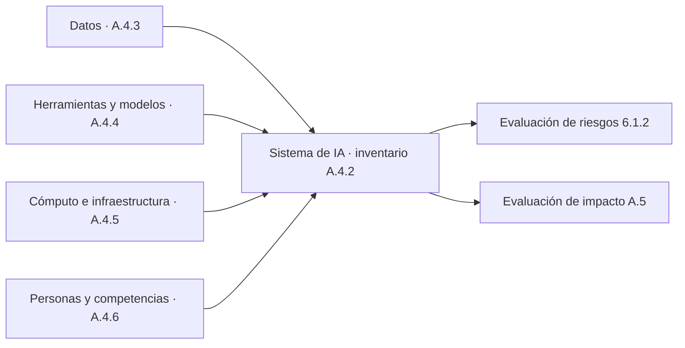
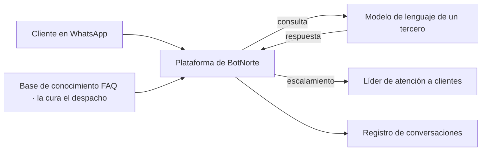

# A.4 · Recursos para sistemas de IA

A.4 · Recursos
:material-view-grid-outline: 5 controles
:material-clock-outline: 35 min de lectura

**El objetivo, en palabras simples:** saber con qué está hecho cada sistema de IA (qué datos lo alimentan, qué modelos y herramientas lo construyen, en qué infraestructura corre y qué personas lo hacen funcionar) para poder entender a fondo sus riesgos e impactos.

**Lo que está en juego:** no se puede gestionar lo que no se conoce. Sin este expediente, la evaluación de impacto se hace a ciegas, un cambio del proveedor del modelo te toma por sorpresa y nadie sabe qué sistemas se ven afectados cuando aparece una vulnerabilidad, un sesgo en los datos o una persona clave renuncia.

!!! abstract "En una frase"
    A.4 es el expediente técnico de tu IA: un inventario de sistemas y, para cada uno, una descripción suficiente de sus datos, herramientas, cómputo y personas.

## Por qué importa este objetivo

En México, cualquier producto empacado lleva su lista de ingredientes. Si una galleta contiene cacahuate y no lo dice, la persona alérgica no tiene forma de protegerse. Con la IA pasa lo mismo: si no sabes que un modelo se entrenó casi solo con datos de una región, no puedes advertir que funcionará peor en otra; si no sabes que tu chatbot depende de un modelo de un tercero, no puedes prever qué pasa cuando ese tercero lo cambia. Y como en la industria automotriz, donde la lista de materiales permite llamar a revisión justo a los autos que llevan la pieza defectuosa, un buen inventario de recursos te dice en minutos qué sistemas tocan un conjunto de datos, una biblioteca o un proveedor con problemas.

En nuestra lectura, la idea de fondo es que la organización pueda dar cuenta de todo lo que compone cada sistema (piezas, activos, insumos), porque solo así entiende y atiende sus riesgos e impactos. Por eso A.4 es, en la práctica, el insumo de casi todo lo demás: la [evaluación de riesgos (6.1.2)](../clausulas/c6-planificacion.md#c-6-1-2) y la [evaluación de impacto (6.1.4)](../clausulas/c6-planificacion.md#c-6-1-4) necesitan saber qué datos se usan y a quién representan; el diseño ([A.6.2.3](a6-ciclo-de-vida.md#a-6-2-3)) documenta las decisiones sobre esos recursos; los controles de datos ([A.7](a7-datos.md)) gestionan lo que A.4.3 cataloga; y la gestión de proveedores ([A.10.3](a10-terceros.md#a-10-3)) se ocupa de los recursos que aporta un tercero. A nivel de sistema de gestión, la [cláusula 7.1](../clausulas/c7-apoyo.md#c-7-1) pide los recursos para el SGIA en general; A.4 baja esa idea a cada sistema de IA.

Los riesgos que aborda son muy concretos: la IA en la sombra que nadie inventarió, la dependencia de un proveedor que nadie dimensionó, datos de origen dudoso, costos de cómputo que se disparan en temporada alta y sistemas que solo una persona entiende.

El objetivo cambia de peso según tu rol:

- **Si usas IA de terceros**, tu trabajo central es el inventario ([A.4.2](#a-4-2)) y las personas que operan y supervisan los sistemas ([A.4.6](#a-4-6)). De los datos, herramientas e infraestructura del proveedor documentas lo que él te informa. En esta guía clasificamos A.4.3, A.4.4 y A.4.5 como propios de quien desarrolla o provee, aunque con matices que verás en cada control.
- **Si desarrollas IA**, los cinco controles aplican de lleno: fichas de datos, versiones de modelos y bibliotecas, capacidad de cómputo y equipos con competencias diversas.
- **Si provees IA a clientes**, además debes distinguir qué recursos aporta cada cliente (sus bases de conocimiento, por ejemplo) y cuáles aporta tu proveedor del modelo, porque eso define responsabilidades y lo que tienes que informar.

## Los controles de un vistazo

| Control | Qué pide, en una línea | Aplica a | Esfuerzo | Frente a ISO 27001 |
|---|---|---|---|---|
| [A.4.2 Documentación de recursos](#a-4-2) | Identificar y documentar los recursos que cada sistema de IA necesita en las etapas de su ciclo de vida. | Usa · Desarrolla · Provee | Medio | Similar |
| [A.4.3 Recursos de datos](#a-4-3) | Documentar los conjuntos de datos que usa el sistema. | Desarrolla · Provee | Alto | Nuevo |
| [A.4.4 Recursos de herramientas](#a-4-4) | Documentar modelos, algoritmos, bibliotecas y plataformas. | Desarrolla · Provee | Bajo | Similar |
| [A.4.5 Recursos de sistema y cómputo](#a-4-5) | Documentar dónde corre el sistema, con qué capacidad y con qué impacto. | Desarrolla · Provee | Bajo | Equivalente |
| [A.4.6 Recursos humanos](#a-4-6) | Documentar las personas y competencias que el sistema necesita en todo su ciclo de vida. | Usa · Desarrolla · Provee | Medio | Similar |

!!! note "Sobre los nombres de los controles"
    Son traducciones libres de referencia del autor; la redacción oficial puede variar.

## A.4.2 Documentación de recursos {#a-4-2 .dx-control .obj-a4}

:material-cloud-download-outline: Usa IA de terceros
:material-code-braces: Desarrolla IA
:material-handshake-outline: Provee IA a clientes
:material-gauge: Esfuerzo medio
:material-approximately-equal: Similar a 27001

**Propósito.** No se puede evaluar el riesgo ni el impacto de algo cuyas piezas no conoces. Documentar los recursos de cada sistema es el primer paso para entenderlo.

**En la práctica.** El control pide saber, y dejar por escrito, qué recursos hacen falta en cada fase por la que pasa un sistema de IA, además de los que requieren otras actividades de IA de la organización. Lo más útil es pensarlo en dos capas. La primera es el **inventario de sistemas de IA**: la lista completa de lo que está en el alcance, incluidas las herramientas generativas que usa el personal y las funciones de IA incrustadas en software que ya contrataste. La segunda es, para cada sistema, la descripción de sus recursos: los componentes del propio sistema y las cuatro familias que desarrollan los controles siguientes (datos, herramientas, cómputo y personas). Registra también **quién aporta cada recurso**: la organización, un cliente o un tercero.

**Cómo encontrar la IA que no sabes que tienes.** Revisa contratos y facturas (las suscripciones pagadas con tarjeta corporativa son una mina), los registros del inicio de sesión único y del proxy, las notas de versión de tus proveedores de software (muchos activan funciones de IA sin avisar) y pregunta directamente a cada líder de área. Para cada sistema, como mínimo: identificador, nombre, uso previsto, dueño, rol de la organización (usa, desarrolla o provee), proveedor, datos que usa (con indicación de datos personales), modelo o herramienta, dónde corre, tipo de supervisión humana, estado (piloto, producción, retirado) y vínculo con sus evaluaciones de riesgo e impacto. Al final de esta página hay un [inventario de ejemplo](#inventario-de-ejemplo) con los sistemas de las tres empresas de los casos prácticos.

**Diagramas.** Un diagrama de arquitectura y uno de flujo de datos valen más que diez páginas de descripción: muestran por dónde viajan los datos, qué terceros intervienen, en qué países se procesan y dónde están las fronteras de confianza. Así se ve, simplificado, el flujo de datos de Alma, el chatbot de Contadores Alameda:

**Detectar lo que falta.** Documentar recursos también sirve para descubrir que algo no está disponible antes de que sea tarde. Una cadena de tiendas en México que planeaba analizar video con IA en la nube descubrió, al documentar recursos, que los enlaces de internet de sus sucursales no soportaban ese tráfico; tuvo que rediseñar el sistema para procesar en la tienda. Cuando falta un recurso, lo correcto es ajustar el diseño o los requisitos de despliegue, no lanzar y esperar lo mejor.

**Si ya tienes un SGSI**, reutiliza el inventario de activos de ISO 27001 A.5.9: la herramienta, el concepto de dueño y el ciclo de actualización. Lo que hay que agregar son los atributos propios de la IA (uso previsto, rol, modelo, conjuntos de datos, supervisión humana) y la vista por sistema, que agrupa activos dispersos en una sola ficha.

Lo que **no** exige: una base de datos de configuración ni una herramienta especial; una hoja de cálculo bien mantenida funciona. En nuestra lectura, también se vale ser proporcional: una herramienta de bajo riesgo puede tener un registro breve, mientras que un sistema que decide sobre personas merece una ficha completa.

!!! success "Implementación mínima viable"
    - Inventario de sistemas de IA en hoja de cálculo, incluidas herramientas generativas y funciones de IA incrustadas.
    - Campos mínimos por sistema: dueño, uso previsto, rol, proveedor, datos, modelo, ubicación, supervisión humana, estado.
    - Diagrama de flujo de datos para cada sistema de impacto medio o alto.
    - Indicación de qué recursos aporta la organización, el cliente o un tercero.
    - Revisión del inventario al menos dos veces al año y con cada alta o baja.

!!! tip "Implementación madura"
    - Inventario integrado al catálogo de activos, con atributos de IA y filtros por sistema.
    - Detección automática de IA en la sombra a partir de registros de acceso, proxy y gastos.
    - Fichas del sistema completas, enlazadas con sus evaluaciones de riesgo e impacto.
    - Diagramas de arquitectura versionados junto con el código.
    - Alta en el inventario como paso obligatorio de compras y de despliegue.

=== ":material-folder-check-outline: Evidencia típica"

    - Inventario de sistemas de IA vigente, con fecha de última revisión.
    - Fichas del sistema con sus recursos.
    - Diagramas de arquitectura y de flujo de datos.
    - Registro de altas, cambios y bajas en el inventario.
    - Evidencia del método usado para detectar IA no registrada.

=== ":material-account-search-outline: Preguntas del auditor"

    1. Muéstrame el inventario de sistemas de IA. ¿Cómo saben que está completo?
    2. ¿Qué funciones de IA vienen incluidas en el software que ya contrataron? ¿Están inventariadas?
    3. Para este sistema, ¿qué datos usa, quién los aporta y a dónde viajan?
    4. ¿Cuándo se actualizó el diagrama de flujo de datos y qué cambió?
    5. ¿Qué recursos dependen de un tercero y qué pasa si deja de prestarlos?
    6. ¿Cómo usaron esta documentación en la evaluación de impacto?

=== ":material-alert-outline: Errores comunes"

    - Inventariar solo los proyectos de ciencia de datos y olvidar las herramientas generativas y la IA incrustada en servicios contratados.
    - Un inventario que se hizo una vez para la auditoría y nunca se actualizó.
    - Diagramas de cajas sin flujos de datos ni terceros.
    - No distinguir qué recursos aporta el cliente o el proveedor.
    - Mezclar la IA con el inventario general de activos sin forma de filtrarla.

=== ":material-scale-balance: ¿Se puede excluir?"

    **Podría justificarse si…** no vemos un supuesto razonable. Cualquier organización con un SGIA tiene al menos un sistema de IA en su alcance, y sin inventario no hay forma de evaluar riesgos ni impactos.

    **No se justifica si…** en ningún caso. Una redacción típica de inclusión: "Incluido. Inventario INV-IA-01 con siete sistemas; fichas completas para los de impacto medio y alto".

**Relaciones.** Cláusulas: [4.1](../clausulas/c4-contexto.md#c-4-1), [4.3](../clausulas/c4-contexto.md#c-4-3), [6.1.2](../clausulas/c6-planificacion.md#c-6-1-2), [6.1.4](../clausulas/c6-planificacion.md#c-6-1-4), [7.1](../clausulas/c7-apoyo.md#c-7-1), [7.5](../clausulas/c7-apoyo.md#c-7-5) · Controles: [A.4.3](#a-4-3), [A.4.6](#a-4-6), [A.5.2](a5-evaluacion-de-impacto.md#a-5-2), [A.6.2.3](a6-ciclo-de-vida.md#a-6-2-3), [A.6.2.7](a6-ciclo-de-vida.md#a-6-2-7), [A.10.3](a10-terceros.md#a-10-3) · ISO 27001 A.5.9 (inventario de información y otros activos asociados) · Normas: ISO/IEC 22989, ISO/IEC 23053 (ver [familia de normas](../fundamentos/familia-de-normas.md)) · **Anexo B:** la guía B.4.2 explica para qué sirve documentar recursos (entender riesgos e impactos y alimentar la evaluación de impacto), sugiere apoyarse en diagramas, ofrece una tipología general de recursos, recuerda que pueden venir de la organización, de sus clientes o de terceros, y añade que la documentación ayuda a detectar recursos faltantes.

## A.4.3 Recursos de datos {#a-4-3 .dx-control .obj-a4}

:material-code-braces: Desarrolla IA
:material-handshake-outline: Provee IA a clientes
:material-gauge-full: Esfuerzo alto
:material-star-four-points-outline: Nuevo frente a 27001

**Propósito.** Los datos determinan en gran medida cómo se comporta un sistema de IA. Documentarlos permite saber de dónde vienen, para qué sirven, qué tan buenos son y qué sesgos pueden arrastrar.

**En la práctica.** Como parte de la identificación de recursos, el control pide documentar información sobre los datos que usa el sistema. La herramienta habitual es la **ficha del conjunto de datos** (*datasheet*), inspirada en la propuesta académica conocida como *Datasheets for Datasets*. Se hace una por cada conjunto relevante: los de entrenamiento, validación y prueba, pero también los datos de producción y las bases de conocimiento que consulta un sistema con generación aumentada por recuperación (RAG). Esta es una estructura que funciona, ilustrada con el histórico de solicitudes de Monarca Crédito:

| Bloque | Qué registrar | Ejemplo |
|---|---|---|
| Identificación | Nombre, versión, dueño, descripción breve | "HIST-SOL v7", dueño: líder de Ciencia de Datos |
| Origen y derechos | Procedencia (interna, proveedor, fuente pública, cliente), licencia o base legal, presencia de datos personales o sensibles | Solicitudes propias; buró de crédito con autorización del solicitante; uso de la app con consentimiento |
| Tiempo | Periodo que cubre, fecha de la última actualización o modificación, frecuencia de actualización | 36 meses de solicitudes; corte mensual con fecha en los metadatos |
| Papel en el ciclo de vida | Entrenamiento, validación, prueba o producción, y cómo se hizo la partición | Partición temporal: los meses más recientes se reservan para prueba |
| Contenido | Categorías de datos, variables, volumen, población que representa | Ingresos, historial crediticio, comportamiento transaccional |
| Etiquetado | Qué significa la etiqueta, quién y cómo la asigna, cómo se verifica | "Incumplimiento" definido por días de atraso en los primeros meses del crédito |
| Calidad | Requisitos y métricas: completitud, exactitud, duplicados, actualidad | Ingresos faltantes en una fracción pequeña de registros, tratados según [A.7.6](a7-datos.md#a-7-6) |
| Sesgos conocidos o potenciales | Subrepresentación, variables sustitutas, sesgo histórico | Pocas solicitudes de estados del sur; el código postal podría actuar como sustituto del nivel socioeconómico |
| Preparación | Limpieza, transformaciones, enriquecimiento | Cuaderno de preparación versionado |
| Uso previsto | Para qué se puede usar el conjunto y para qué no | Solo modelos de riesgo de crédito; prohibido para mercadotecnia |
| Retención y eliminación | Plazo, criterio, método de eliminación o anonimización | Conservación alineada con obligaciones regulatorias y con el aviso de privacidad |

**A.4.3 frente a A.7.** Este control es el "qué hay": el catálogo con sus metadatos. Los controles de [A.7](a7-datos.md) son el "cómo se gestiona": adquisición, calidad, procedencia y preparación. Se alimentan entre sí, y una buena ficha termina siendo evidencia de varios controles de A.7 a la vez. Como referencias técnicas, la guía de la norma remite a una norma de categorías de datos (ISO/IEC 19944-1) y a la serie ISO/IEC 5259 sobre calidad de datos para analítica y aprendizaje automático.

**Si provees IA**, ojo con los datos que aportan tus clientes. Conversa Labs mantiene una ficha ligera por cada base de conocimiento: el dueño es el cliente; registra qué contiene, la fecha de su última carga, si incluye datos personales, qué pasa con ella al terminar el contrato y la confirmación de que no se usa para entrenar modelos. También documenta sus conjuntos de evaluación, como las baterías de preguntas de prueba y de ataques de inyección de instrucciones.

**Si solo usas IA de terceros**, este control suele pesar poco, pero hay un matiz importante: si alimentas al sistema con datos propios, como la base de preguntas frecuentes que Contadores Alameda cura para Alma, en nuestra lectura ya estás aportando un recurso de datos y conviene documentarlo, aunque sea con una ficha de media página.

**Por qué es nuevo frente a ISO 27001.** El inventario de ISO 27001 A.5.9 y la clasificación de ISO 27001 A.5.12 te dan el dueño y la etiqueta de confidencialidad de los datos. Pero no preguntan si un conjunto sirvió para entrenar o para probar, cómo se etiquetó, a quién representa ni qué sesgos tiene. Esa es la parte nueva.

Lo que **no** exige: una herramienta de catálogo de datos ni fichas para cada tabla de tus bases de datos; solo para los conjuntos que alimentan sistemas de IA.

!!! success "Implementación mínima viable"
    - Lista de conjuntos de datos por sistema de IA, con dueño.
    - Ficha básica por conjunto relevante: procedencia, fechas, papel en el ciclo de vida, datos personales, uso previsto, retención y sesgos conocidos.
    - Trazabilidad entre la versión de los datos y la versión del modelo que entrenaron.
    - Ficha ligera para las bases de conocimiento usadas en RAG.
    - Actualización de la ficha cada vez que el conjunto cambia de forma significativa.

!!! tip "Implementación madura"
    - Catálogo de datos con metadatos automáticos: fechas, esquema, perfilado de calidad.
    - Versionado de datos con herramientas especializadas, vinculado al registro de modelos.
    - Métricas de representatividad y sesgo recalculadas en cada actualización.
    - Fichas generadas en parte automáticamente desde el flujo de procesamiento.
    - Revisión de privacidad y legal antes de incorporar un conjunto nuevo.

=== ":material-folder-check-outline: Evidencia típica"

    - Fichas de conjuntos de datos versionadas.
    - Catálogo o inventario de datos por sistema de IA.
    - Metadatos de versiones y fechas de actualización.
    - Reportes de perfilado de calidad.
    - Registro de sesgos conocidos y de cómo se tratan.
    - Base legal o licencia de cada fuente.

=== ":material-account-search-outline: Preguntas del auditor"

    1. ¿Con qué datos se entrenó la versión del modelo que está en producción? Muéstrame la ficha.
    2. ¿Cómo separaron los datos de entrenamiento, validación y prueba, y cómo evitaron que se contaminaran entre sí?
    3. ¿Qué sesgos conocen en estos datos y qué hicieron al respecto?
    4. ¿Cuándo se actualizaron los datos por última vez?
    5. ¿Qué datos personales contiene el conjunto y con qué base legal los usan?
    6. ¿Cuánto tiempo conservan estos datos y cómo los eliminan?
    7. ¿Para qué otros fines se ha usado este conjunto?

=== ":material-alert-outline: Errores comunes"

    - Documentar las tablas de la base de datos y no los conjuntos que de verdad alimentan al modelo.
    - No poder decir qué versión de los datos entrenó qué versión del modelo.
    - Dejar vacío el campo de sesgos "porque no encontramos ninguno", sin haber buscado.
    - Olvidar las bases de conocimiento de RAG y los conjuntos de evaluación.
    - Fichas que nadie actualiza después del primer entrenamiento.

=== ":material-scale-balance: ¿Se puede excluir?"

    **Podría justificarse si…** la organización solo usa servicios de IA terminados y no aporta datos propios para entrenarlos, ajustarlos ni alimentarlos. Ejemplo de redacción: "Excluido. La organización no desarrolla ni ajusta modelos; los datos de entrenamiento son responsabilidad del proveedor y se gestionan mediante A.10.3. Los datos que el personal introduce durante el uso se controlan con la política de uso aceptable y A.7.4".

    **No se justifica si…** desarrollas, ajustas o evalúas modelos, o alimentas un sistema con bases de conocimiento propias o de tus clientes, porque esos datos determinan el comportamiento del sistema.

**Relaciones.** Cláusulas: [6.1.2](../clausulas/c6-planificacion.md#c-6-1-2), [6.1.4](../clausulas/c6-planificacion.md#c-6-1-4), [7.5](../clausulas/c7-apoyo.md#c-7-5) · Controles: [A.4.2](#a-4-2), [A.5.4](a5-evaluacion-de-impacto.md#a-5-4), [A.7.3](a7-datos.md#a-7-3), [A.7.4](a7-datos.md#a-7-4), [A.7.5](a7-datos.md#a-7-5), [A.7.6](a7-datos.md#a-7-6) · ISO 27001 A.5.9 (inventario de activos) e ISO 27001 A.5.12 (clasificación de la información) · Normas: ISO/IEC 19944-1, serie ISO/IEC 5259 · **Anexo B:** la guía B.4.3 propone los temas que debería cubrir la documentación de datos, desde su origen y vigencia hasta su calidad, sesgos, retención y preparación, y remite a normas de categorías y de calidad de datos.

## A.4.4 Recursos de herramientas {#a-4-4 .dx-control .obj-a4}

:material-code-braces: Desarrolla IA
:material-handshake-outline: Provee IA a clientes
:material-gauge-low: Esfuerzo bajo
:material-approximately-equal: Similar a 27001

**Propósito.** Saber con qué se construyó, evaluó y opera el sistema para poder reproducirlo, auditarlo y reaccionar rápido cuando una herramienta cambia, se retira o resulta vulnerable.

**En la práctica.** El control pide documentar los recursos de herramientas del sistema de IA. "Herramientas" aquí es un término amplio: abarca desde el tipo de algoritmo y el modelo hasta las bibliotecas, las plataformas y los métodos con los que se prepara, optimiza y evalúa. Una forma práctica de organizarlo:

| Categoría | Ejemplos | Qué registrar |
|---|---|---|
| Modelos y algoritmos | Árboles con *gradient boosting*; modelo fundacional vía API; modelo de pesos abiertos descargado | Tipo, versión exacta, origen, licencia |
| Bibliotecas y marcos | scikit-learn, XGBoost, LightGBM, PyTorch; marcos de orquestación de modelos de lenguaje | Versión fijada, licencia, vulnerabilidades conocidas |
| Preparación de datos | Flujos de extracción y transformación, herramientas de etiquetado | Versión y configuración |
| Optimización y evaluación | Búsqueda de hiperparámetros, métricas de equidad, evaluaciones automáticas de respuestas, pruebas adversarias | Métodos, umbrales y conjuntos usados |
| Plataformas de MLOps | Seguimiento de experimentos y registro de modelos (por ejemplo, MLflow), orquestación de procesos, aprovisionamiento de recursos | Plataforma, responsable, configuración |
| Componentes de IA generativa | Base de datos vectorial, gestor de instrucciones, filtros de seguridad (*guardrails*) | Versión y reglas activas |
| Entorno de desarrollo | Cuadernos (*notebooks*), asistentes de programación con IA | Herramientas autorizadas |

**Modelos fundacionales vía API.** Merecen atención especial porque el proveedor puede cambiar el comportamiento de tu sistema sin que tú cambies una línea de código. Registra el proveedor, el nombre y la **versión exacta** del modelo (evita los alias genéricos del tipo "la más reciente"), la fecha en que empezaste a usarla, la región donde se procesan los datos, las condiciones de retención y si el proveedor puede usar tus datos para entrenar. Vigila los avisos de retiro de versiones: es común que los proveedores anuncien con algunos meses de anticipación que una versión dejará de estar disponible, y la migración exige volver a evaluar.

**La idea de la AI-BOM.** La lista de materiales de software (SBOM) que ya usan muchos equipos de desarrollo se puede extender a la IA: una lista de materiales de IA (*AI bill of materials*) que enumera modelos, conjuntos de datos, bibliotecas y servicios, con sus versiones y relaciones. Formatos abiertos como CycloneDX (desde su versión 1.5, de junio de 2023) y SPDX (con los perfiles de IA y de conjuntos de datos de su versión 3.0, de abril de 2024) ya contemplan modelos de aprendizaje automático y conjuntos de datos[^aibom]. Su valor se ve en una crisis: si se publica una vulnerabilidad en una biblioteca, un proveedor retira un modelo o se descubre un problema de licencia, sabes en minutos qué sistemas están afectados. Un ejemplo: una universidad en Perú que descarga un modelo de pesos abiertos desde un repositorio público registra la fuente, la licencia y la huella digital (*hash*) del archivo, para comprobar después que nadie lo alteró.

**Si solo usas IA de terceros**, las herramientas son del proveedor. Aun así, conviene anotar en el inventario ([A.4.2](#a-4-2)) qué modelo subyacente usa cada servicio, cuando el proveedor lo informa.

**Si ya tienes un SGSI**, reutiliza el inventario de software de ISO 27001 A.5.9 y, si lo tienes, tu proceso de SBOM. Lo que hay que agregar: versiones de modelos, métodos de optimización y evaluación, dependencias de modelos consumidos por API y las condiciones de uso de datos de esos proveedores. Para la tipología de componentes de un sistema de aprendizaje automático, ISO/IEC 23053 es la referencia.

Lo que **no** exige: listar a mano cada dependencia indirecta; para eso están los archivos de dependencias y las herramientas que generan SBOM automáticamente.

!!! success "Implementación mínima viable"
    - Lista de herramientas, bibliotecas y modelos por sistema, con versión.
    - Para modelos vía API: proveedor, nombre y versión exacta, región y condiciones de uso de datos.
    - Métodos de evaluación usados para aprobar cada versión del modelo.
    - Archivo de dependencias con versiones fijadas en el repositorio.
    - Registro de cambios de versión de modelos y herramientas críticas.

!!! tip "Implementación madura"
    - AI-BOM generada automáticamente en cada liberación, en un formato estándar.
    - Registro de modelos con linaje completo: datos, código, hiperparámetros y métricas de cada versión.
    - Monitoreo de avisos de retiro de modelos y de vulnerabilidades en bibliotecas.
    - Verificación de integridad de los modelos descargados.
    - Lista de herramientas autorizadas para el desarrollo, incluidos los asistentes de programación.

=== ":material-folder-check-outline: Evidencia típica"

    - Inventario de herramientas y modelos con versiones.
    - AI-BOM o SBOM del sistema.
    - Registro de modelos o de experimentos.
    - Términos y condiciones del proveedor del modelo fundacional.
    - Registro de cambios de versión del modelo.

=== ":material-account-search-outline: Preguntas del auditor"

    1. ¿Qué versión exacta del modelo está en producción hoy y desde cuándo?
    2. Si el proveedor retira esa versión, ¿cómo se enteran y qué hacen?
    3. ¿Con qué métodos y métricas evaluaron el modelo antes de liberarlo?
    4. Si mañana se publica una vulnerabilidad grave en una biblioteca de aprendizaje automático, ¿cuánto tardan en saber qué sistemas la usan?
    5. ¿Qué licencias tienen los modelos y bibliotecas que usan? ¿Alguna restringe el uso comercial?
    6. ¿Cómo verifican que un modelo descargado no fue alterado?

=== ":material-alert-outline: Errores comunes"

    - Llamar al modelo con un alias genérico y no saber qué versión respondió en una fecha dada.
    - Documentar bibliotecas, pero no los métodos de evaluación.
    - Olvidar piezas "pequeñas" que cambian el resultado: filtros de seguridad, plantillas de instrucciones, bases vectoriales.
    - No revisar las licencias de los modelos de pesos abiertos.
    - Un inventario de herramientas sin dueño que se desactualiza en semanas.

=== ":material-scale-balance: ¿Se puede excluir?"

    **Podría justificarse si…** la organización solo usa servicios de IA terminados y no construye, ajusta, configura de manera relevante ni evalúa modelos. Ejemplo de redacción: "Excluido. La organización no desarrolla sistemas de IA; las herramientas de construcción son responsabilidad del proveedor y se gestionan con A.10.3. El modelo subyacente de cada servicio se registra en el inventario (A.4.2) cuando el proveedor lo informa".

    **No se justifica si…** desarrollas o integras sistemas, aunque sea con un modelo de terceros vía API: la orquestación, las instrucciones de sistema y los filtros son herramientas tuyas.

**Relaciones.** Cláusulas: [7.1](../clausulas/c7-apoyo.md#c-7-1), [8.1](../clausulas/c8-operacion.md#c-8-1) · Controles: [A.4.2](#a-4-2), [A.6.2.3](a6-ciclo-de-vida.md#a-6-2-3), [A.6.2.4](a6-ciclo-de-vida.md#a-6-2-4), [A.6.2.7](a6-ciclo-de-vida.md#a-6-2-7), [A.10.3](a10-terceros.md#a-10-3) · ISO 27001 A.5.9 (inventario de activos) · Normas: ISO/IEC 23053 · **Anexo B:** la guía B.4.4 ofrece una tipología amplia de herramientas para aprendizaje automático, que va de los algoritmos y modelos a los métodos de evaluación, el aprovisionamiento y el software y hardware de desarrollo, y remite a ISO/IEC 23053.

## A.4.5 Recursos de sistema y cómputo {#a-4-5 .dx-control .obj-a4}

:material-code-braces: Desarrolla IA
:material-handshake-outline: Provee IA a clientes
:material-gauge-low: Esfuerzo bajo
:material-equal: Equivalente en 27001

**Propósito.** Saber dónde y con qué capacidad corre el sistema de IA, cuánto cuesta y qué impacto ambiental tiene, para evitar caídas, sorpresas de costo y decisiones a ciegas sobre dónde se procesan los datos.

**En la práctica.** El control pide documentar la información sobre los recursos de sistema y de cómputo que usa el sistema de IA. Empieza por **dónde corre**: en servidores propios, en la nube, en el borde (*edge*: un celular, una terminal punto de venta, una cámara) o como servicio del proveedor. Después, **qué necesita**: procesadores y aceleradores, memoria, almacenamiento, red y latencia aceptable. Esto último importa mucho cuando el sistema debe funcionar en dispositivos con recursos limitados, como una app de crédito que corre en teléfonos de gama baja.

**Cada etapa pide recursos distintos.** Entrenar un modelo exige ráfagas de cómputo intensivo; servirlo en producción exige latencia estable; reentrenarlo y mejorarlo exige capacidad reservada y ambientes de prueba. Si consumes modelos por API, tus "recursos" son cuotas, límites de consultas por minuto y costo por consulta o por *token*. Y hay que pensar en los picos: en México, la temporada de declaración anual de personas físicas en abril multiplica las preguntas a un chatbot fiscal; las quincenas disparan las solicitudes en una app de crédito; el Buen Fin pone a prueba a cualquier sistema de comercio electrónico.

**Impacto ambiental y costo.** La guía de la norma pide considerar el impacto del hardware que ejecuta las cargas de IA, tanto ambiental (energía durante el entrenamiento y el uso, enfriamiento, fabricación del equipo) como económico. Conecta con la consideración del cambio climático en el [contexto de la organización (4.1)](../clausulas/c4-contexto.md#c-4-1), con los impactos sociales de [A.5.5](a5-evaluacion-de-impacto.md#a-5-5) y con el objetivo de impacto ambiental que sugiere el Anexo C. Algunos proveedores de nube ofrecen tableros de huella de carbono; si no tienes datos, documenta una estimación o deja constancia de que no están disponibles. Una decisión sencilla con impacto real: elegir el modelo más pequeño que cumpla los requisitos.

Dos ejemplos regionales: un hospital en Chile prefiere ejecutar su modelo de apoyo diagnóstico en servidores propios para mantener los datos clínicos dentro de su red; una cadena de tiendas en México procesa video en cada sucursal porque sus enlaces no soportan subirlo a la nube. Ambos deben documentar esas decisiones, su capacidad y sus límites.

**Si ya tienes un SGSI**, este control equivale en buena medida a la gestión de la capacidad de ISO 27001 A.8.6, sumada al inventario de infraestructura de ISO 27001 A.5.9. Reutiliza tus planes de capacidad, tu monitoreo y tu inventario. Lo que hay que agregar: aceleradores gráficos, cuotas y costos de servicios de IA consumidos por API, las diferencias entre etapas del ciclo de vida y el impacto ambiental.

Lo que **no** exige: una contabilidad de carbono precisa ni centro de datos propio.

!!! success "Implementación mínima viable"
    - Para cada sistema: dónde corre (local, nube, borde o servicio del proveedor), región y proveedor de infraestructura.
    - Requisitos de cómputo, memoria y almacenamiento en desarrollo y en producción.
    - Cuotas, límites y costo estimado de los servicios de IA consumidos por API.
    - Monitoreo básico de capacidad con alertas de saturación.
    - Nota de impacto ambiental: datos del proveedor o constancia de que no están disponibles.

!!! tip "Implementación madura"
    - Plan de capacidad que contempla picos de temporada y reentrenamientos.
    - Tablero de costos por sistema (horas de cómputo, *tokens*) con presupuesto y alertas.
    - Métricas de consumo energético o de huella de carbono por sistema cuando el proveedor las ofrece.
    - Criterio documentado para elegir el modelo más pequeño que cumpla los requisitos.
    - Pruebas de carga antes de las temporadas altas.

=== ":material-folder-check-outline: Evidencia típica"

    - Inventario de infraestructura asociado a cada sistema de IA.
    - Plan de capacidad y reportes de monitoreo.
    - Cuotas y límites contratados con proveedores de API.
    - Reportes de costos de cómputo.
    - Datos de consumo energético o de huella de carbono, cuando existan.

=== ":material-account-search-outline: Preguntas del auditor"

    1. ¿Dónde se ejecuta este sistema y en qué región se procesan los datos?
    2. ¿Qué pasa si en temporada alta se alcanza el límite de consultas del proveedor del modelo?
    3. ¿Cómo planearon la capacidad para el reentrenamiento?
    4. ¿Cuánto cuesta operar este sistema al mes y quién le da seguimiento?
    5. ¿Consideraron el impacto ambiental al elegir el modelo o la infraestructura?
    6. ¿Qué diferencias de recursos hay entre el ambiente de desarrollo y el de producción?

=== ":material-alert-outline: Errores comunes"

    - Documentar servidores, pero no las cuotas ni los límites de los servicios de IA consumidos por API.
    - No prever los picos de temporada.
    - Descubrir el costo real de un modelo cuando llega la factura.
    - Ignorar el impacto ambiental "porque todo está en la nube".
    - No registrar la región donde se procesan los datos, lo que después complica el aviso de privacidad y los contratos.

=== ":material-scale-balance: ¿Se puede excluir?"

    **Podría justificarse si…** la organización solo consume servicios de IA terminados y no administra infraestructura para IA. Ejemplo de redacción: "Excluido. La organización no opera infraestructura para sistemas de IA; los servicios se consumen como SaaS y su ubicación y capacidad se gestionan con A.10.3 y en el inventario (A.4.2)". Aun en ese caso, conviene registrar región y proveedor de cada servicio.

    **No se justifica si…** entrenas, ajustas u hospedas modelos, o integras modelos vía API en un producto propio: las cuotas, la latencia y los costos son recursos tuyos.

**Relaciones.** Cláusulas: [4.1](../clausulas/c4-contexto.md#c-4-1), [7.1](../clausulas/c7-apoyo.md#c-7-1), [8.1](../clausulas/c8-operacion.md#c-8-1) · Controles: [A.4.2](#a-4-2), [A.5.5](a5-evaluacion-de-impacto.md#a-5-5), [A.6.2.5](a6-ciclo-de-vida.md#a-6-2-5), [A.6.2.6](a6-ciclo-de-vida.md#a-6-2-6), [A.10.3](a10-terceros.md#a-10-3) · ISO 27001 A.5.9 (inventario de activos) e ISO 27001 A.8.6 (gestión de la capacidad) · Normas: ISO/IEC 22989 · **Anexo B:** la guía B.4.5 sugiere qué información de cómputo documentar, desde los requisitos y la ubicación de los recursos hasta el impacto ambiental y económico del hardware, y advierte que el desarrollo, el despliegue, la operación y la mejora continua pueden necesitar recursos distintos.

## A.4.6 Recursos humanos {#a-4-6 .dx-control .obj-a4}

:material-cloud-download-outline: Usa IA de terceros
:material-code-braces: Desarrolla IA
:material-handshake-outline: Provee IA a clientes
:material-gauge: Esfuerzo medio
:material-approximately-equal: Similar a 27001

**Propósito.** Asegurar que cada sistema de IA tenga, en cada etapa, a las personas con los conocimientos necesarios, incluidas las que supervisan sus resultados, y que eso quede documentado.

**En la práctica.** El control pide documentar a las personas y sus competencias durante toda la vida del sistema: desde que se concibe y se construye, pasando por las pruebas, la integración, la puesta en marcha, la operación, los cambios y el mantenimiento, hasta su traspaso a otro equipo o proveedor y su retiro. Cada etapa pide perfiles distintos: una científica de datos en el desarrollo, un experto del negocio en la validación, operadores y supervisores en la operación, y alguien que sepa retirar el sistema y sus datos de forma segura cuando llegue el momento.

**Diversidad de experiencia.** Ningún equipo técnico, por bueno que sea, ve todos los riesgos. Conviene combinar perfiles técnicos con expertos del dominio (contadores, médicos, analistas de crédito), legal y privacidad, seguridad, ética y la perspectiva de los grupos afectados. La guía de la norma llega a contemplar la inclusión de personas de grupos demográficos relacionados con los datos de entrenamiento cuando el diseño del sistema lo requiere. Un ejemplo: un gobierno estatal que diseña un asistente de voz para atender a hablantes de lenguas indígenas integra a hablantes de esas lenguas en el diseño y en las pruebas; sin ellos, nadie en el equipo notaría que el asistente confunde palabras clave.

**Supervisión humana.** Las personas que revisan, corrigen o anulan los resultados de la IA necesitan competencias específicas: entender qué hace y qué no hace el sistema, reconocer errores típicos, resistir el sesgo de automatización (*automation bias*, la tendencia a confiar de más en lo que dice la máquina) y saber cuándo y cómo detenerlo. Además, necesitan tiempo y autoridad: un supervisor que debe revisar cien casos por hora no supervisa, firma. Documenta quiénes supervisan, con qué capacitación y con qué carga de trabajo.

**Matriz de competencias.** La forma más práctica de documentar este control es una matriz: rol, competencias requeridas, nivel esperado, nivel actual, evidencia y acción para cerrar la brecha. Se conecta directamente con la [cláusula 7.2](../clausulas/c7-apoyo.md#c-7-2), que pide determinar la competencia necesaria, asegurarla, actuar cuando falta y conservar evidencia. Para todo el personal, conviene una base de alfabetización en IA; el [Reglamento de IA de la UE](../integracion/reglamento-ia-ue.md) incluye medidas en este sentido, relevantes si tienes operaciones o clientes en Europa.

**Si solo usas IA de terceros**, también necesitas personas: quien administra la herramienta, quien cura la información que la alimenta, quien revisa los resultados antes de entregarlos y quien entiende el contrato con el proveedor.

**Si ya tienes un SGSI**, reutiliza tu programa de concienciación y capacitación de ISO 27001 A.6.3: la plataforma, los registros y el ciclo anual. Lo que hay que agregar: competencias técnicas de IA, formación específica para supervisores humanos, participación de expertos del dominio, diversidad de perspectivas y la documentación por sistema y por etapa del ciclo de vida.

Lo que **no** exige: contratar científicos de datos si no desarrollas, ni cuotas de diversidad.

!!! success "Implementación mínima viable"
    - Roles necesarios por sistema y por etapa, con las personas asignadas.
    - Matriz de competencias para roles de IA con brechas identificadas.
    - Capacitación específica para supervisores humanos, con registro.
    - Sensibilización básica en IA para todo el personal.
    - Identificación de dependencias críticas de una sola persona.

!!! tip "Implementación madura"
    - Perfiles de puesto con competencias de IA y criterios de evaluación.
    - Plan de capacitación con medición de eficacia: evaluaciones y simulacros de supervisión.
    - Equipos multidisciplinarios formales, con expertos del dominio y perspectivas de grupos afectados.
    - Planes de sucesión para roles críticos y para el traspaso de sistemas.
    - Indicadores de carga de trabajo de los supervisores humanos.

=== ":material-folder-check-outline: Evidencia típica"

    - Matriz de competencias para roles relacionados con IA.
    - Perfiles o descripciones de puesto con responsabilidades y competencias de IA.
    - Planes y registros de capacitación, incluida la de supervisión humana.
    - Evidencias de competencia: certificados, evaluaciones, experiencia documentada.
    - Composición de los equipos de proyecto que muestre diversidad de experiencia.
    - Planes de sucesión o de traspaso.

=== ":material-account-search-outline: Preguntas del auditor"

    1. ¿Quiénes supervisan los resultados de este sistema y qué capacitación recibieron?
    2. ¿Qué competencias definieron para cada rol de IA y cómo verificaron que se cumplen?
    3. ¿Qué expertos del dominio participaron en el diseño y la validación?
    4. Si la persona que más sabe de este sistema se va mañana, ¿qué pasa?
    5. ¿Cómo evalúan la eficacia de la capacitación en IA?
    6. ¿Cómo consideraron la diversidad de perspectivas al integrar el equipo?
    7. ¿Quién participará cuando haya que retirar este sistema?

=== ":material-alert-outline: Errores comunes"

    - Documentar solo al equipo técnico y olvidar a supervisores, expertos del dominio y personal de operación.
    - Capacitar a todo el personal con el mismo curso genérico.
    - Depender por completo de una persona clave sin respaldo documentado.
    - Supervisores humanos sin tiempo real para revisar.
    - Confundir una lista de asistencia con evidencia de competencia.

=== ":material-scale-balance: ¿Se puede excluir?"

    **Podría justificarse si…** no vemos un supuesto razonable. Incluso quien solo usa IA de terceros necesita personas que la administren, revisen y supervisen; lo que varía es la profundidad.

    **No se justifica si…** en ningún caso. Una redacción típica de inclusión: "Incluido. Matriz de competencias MC-IA-01 y plan de capacitación anual; supervisores de IA-02 capacitados".

**Relaciones.** Cláusulas: [5.3](../clausulas/c5-liderazgo.md#c-5-3), [7.2](../clausulas/c7-apoyo.md#c-7-2), [7.3](../clausulas/c7-apoyo.md#c-7-3) · Controles: [A.3.2](a3-organizacion-interna.md#a-3-2), [A.4.2](#a-4-2), [A.6.2.6](a6-ciclo-de-vida.md#a-6-2-6), [A.9.3](a9-uso.md#a-9-3) · ISO 27001 A.6.3 (concienciación, educación y formación en seguridad de la información) · Normas: ISO/IEC 22989 · **Anexo B:** la guía B.4.6 subraya la necesidad de experiencia diversa, da ejemplos de perfiles que suelen requerirse (técnicos, de supervisión humana, de confiabilidad y del dominio) y recuerda que las necesidades cambian a lo largo del ciclo de vida.

## Cómo se ve este objetivo en los casos prácticos

### Inventario de ejemplo {#inventario-de-ejemplo}

Así podría verse un inventario que reúne los sistemas de las tres empresas ficticias de los casos prácticos. En la vida real cada organización tiene el suyo; aquí se juntan para comparar el nivel de detalle según el rol. La [plantilla de inventario](../plantillas/index.md#inventario-sistemas-ia) incluye más columnas, como estado, nivel de riesgo y vínculo con la evaluación de impacto.

| Empresa | ID · Sistema | Rol | Uso previsto | Proveedor, modelo e infraestructura | Datos principales | Dueño | Supervisión humana |
|---|---|---|---|---|---|---|---|
| Contadores Alameda | IA-01 · Asistente de IA generativa de la suite de ofimática | Usa | Redactar correos, resumir juntas, analizar hojas de cálculo | Proveedor de la suite, en su nube; licencia empresarial | Documentos y correos internos; datos de clientes solo con la cuenta corporativa | Gerente de TI | Quien lo usa revisa el resultado antes de enviarlo |
| Contadores Alameda | IA-02 · Alma, chatbot de WhatsApp | Usa y despliega ante clientes | Preguntas frecuentes, estatus de trámites, agenda de citas | BotNorte (SaaS) con un modelo de lenguaje de un tercero | Base de conocimiento curada por el despacho; mensajes y teléfono de clientes | Líder de atención a clientes | Escalamiento a una persona; revisión semanal por muestreo |
| Contadores Alameda | IA-03 · Captura automática de facturas y CFDI | Usa | Extraer datos de facturas para registrarlas en la contabilidad | Proveedor nacional del software contable | Comprobantes fiscales de clientes | Gerente del área contable | El contador asignado revisa las discrepancias |
| Monarca Crédito | IA-01 · Score Monarca v3 | Desarrolla y usa | Estimar la probabilidad de incumplimiento y clasificar solicitudes en tres bandas | Modelo propio de *gradient boosting* en nube pública | Solicitud, buró de crédito (con autorización), comportamiento transaccional, uso de la app (con consentimiento) | Director de Riesgos | Analistas revisan la banda gris; reconsideración a petición del solicitante |
| Monarca Crédito | IA-02 · Asignación de línea de crédito | Desarrolla y usa | Proponer el monto de la línea para solicitudes aprobadas | Modelo propio derivado de IA-01 | Datos de IA-01 más el resultado del score | Director de Riesgos | Montos máximos fijados por política; revisión de excepciones |
| Monarca Crédito | IA-03 · API de detección de fraude | Usa (cliente de un tercero) | Señalar solicitudes con indicios de fraude en la originación | Proveedor externo vía API | Datos de la solicitud enviados al proveedor | Oficial de Cumplimiento | Analistas revisan las alertas antes de rechazar |
| Conversa Labs | IA-01 · Plataforma Conversa | Provee y desarrolla; cliente del proveedor del modelo | Asistentes virtuales de atención a clientes, uno por cliente | Modelo fundacional vía API, RAG, orquestación propia y filtros de seguridad, en nube pública | Base de conocimiento de cada cliente; conversaciones de usuarios finales (no se usan para entrenar) | CTO | Traspaso a agente humano del cliente; revisión de calidad por muestreo |

=== "Contadores Alameda"

    **Inventario (A.4.2).** Al armar el inventario, el gerente de TI descubrió que el módulo de captura de facturas (IA-03) usaba IA: lo supo por las notas de versión del proveedor, no por el contrato. Lo agregó al inventario y al alcance. Para Alma elaboró el diagrama de flujo de datos que aparece en [A.4.2](#a-4-2), que mostró que los mensajes de los clientes pasan por BotNorte y por el proveedor del modelo; eso se reflejó en el aviso de privacidad.

    **Datos, herramientas y cómputo (A.4.3 a A.4.5).** En la SoA, el despacho excluyó A.4.4 y A.4.5 con la justificación de que no construye ni hospeda modelos. Mantuvo A.4.3 en versión ligera, por la base de conocimiento de Alma: una ficha de media página con su dueña, sus fuentes (por ejemplo, información oficial publicada por el SAT), la fecha de la última actualización y una revisión mensual obligatoria antes de cada temporada de declaraciones.

    **Personas (A.4.6).** La líder de atención recibió capacitación para curar la base de conocimiento y para revisar conversaciones escaladas; los contadores, un taller sobre cómo verificar lo que produce el asistente de ofimática; los 58 colaboradores, una sesión de sensibilización sobre la política de uso aceptable.

    [:octicons-arrow-right-24: Ver el caso completo](../casos-practicos/pyme-usa-ia-generativa.md)

=== "Monarca Crédito"

    **Inventario y datos (A.4.2 y A.4.3).** Cada sistema tiene ficha completa. Para el Score Monarca v3 existen fichas del histórico de solicitudes, de los datos de buró y de los datos de uso de la app, y el registro de modelos vincula cada versión del score con la versión exacta de los datos que la entrenaron. La ficha del histórico registra dos sesgos conocidos: pocas solicitudes de algunos estados del sur y el riesgo de que el código postal funcione como sustituto del nivel socioeconómico.

    **Herramientas y cómputo (A.4.4 y A.4.5).** Cada liberación genera una AI-BOM con la biblioteca de *gradient boosting*, sus dependencias y la versión de los datos. El entrenamiento corre por lotes en la nube; la calificación de solicitudes corre en tiempo real con un requisito de latencia, y el plan de capacidad considera los picos de quincena. La API de fraude (IA-03) se documenta con sus cuotas contratadas y su tiempo de respuesta.

    **Personas (A.4.6).** Los analistas de la banda gris tienen un programa de capacitación sobre cómo leer el score y sus motivos, y cómo resistir el sesgo de automatización; se mide cuántos casos revisa cada analista por día. La validación del modelo la hace una persona del área de Riesgos que no participó en el desarrollo.

    [:octicons-arrow-right-24: Ver el caso completo](../casos-practicos/fintech-scoring.md)

=== "Conversa Labs"

    **Inventario (A.4.2).** Conversa inventaria un solo producto, pero con muchos componentes: el modelo fundacional, el motor de RAG, la orquestación, los filtros de seguridad, el traspaso a agentes humanos y el panel de analítica. Sus diagramas de arquitectura muestran cómo se aíslan los datos de cada cliente.

    **Datos (A.4.3).** Una ficha por cada base de conocimiento de cliente y fichas para sus conjuntos de evaluación: preguntas de prueba por industria y baterías de ataques de inyección de instrucciones.

    **Herramientas y cómputo (A.4.4 y A.4.5).** La AI-BOM fija la versión exacta del modelo fundacional, y el equipo del CTO monitorea los avisos de retiro de versiones del proveedor; cada cambio de versión pasa por la batería de evaluaciones antes de llegar a los clientes. Se documentan las cuotas de la API, el costo por conversación de cada cliente y la región donde se procesan los datos, algo que preguntan los clientes de Chile, Colombia y España. Para clasificar la intención de los mensajes se usa un modelo más pequeño, con menor costo y consumo.

    **Personas (A.4.6).** La matriz de competencias incluye ingeniería de evaluación, Confianza y Seguridad, y Customer Success, que recibió capacitación sobre los límites del producto para no prometer de más. Los contratistas que revisan muestras de conversaciones tienen su propia capacitación sobre privacidad.

    [:octicons-arrow-right-24: Ver el caso completo](../casos-practicos/empresa-desarrolla-chatbot.md)

## Plantillas y recursos relacionados

- [Inventario de sistemas de IA (Excel)](../plantillas/index.md#inventario-sistemas-ia)
- [Ficha del sistema de IA](../plantillas/index.md#ficha-del-sistema)
- [Roles y responsabilidades (RACI)](../plantillas/index.md#raci-ia): punto de partida para la matriz de competencias.
- [A.7 · Datos para sistemas de IA](a7-datos.md): cómo se gestionan los datos que A.4.3 cataloga.
- [A.10 · Relaciones con terceros y clientes](a10-terceros.md): recursos que aportan proveedores y clientes.
- [Cláusula 7 · Apoyo](../clausulas/c7-apoyo.md): recursos y competencia a nivel del sistema de gestión.
- [Documentación requerida](../implementacion/documentacion-requerida.md).

[^aibom]: CycloneDX, referencia de la especificación 1.5 (tipos de componente `machine-learning-model` y `data`), <https://cyclonedx.org/docs/1.5/json/>, y versiones publicadas, <https://github.com/CycloneDX/specification/releases>; SPDX, especificación 3.0.1 con los perfiles AI y Dataset, <https://spdx.github.io/spdx-spec/v3.0.1/model/AI/AI/>, y anuncio de SPDX 3.0 de la Linux Foundation, <https://www.linuxfoundation.org/press/spdx-3-revolutionizes-software-management-in-systems-with-enhanced-functionality-and-streamlined-use-cases>. Fuente primaria; consultado el 9 de octubre de 2026.
