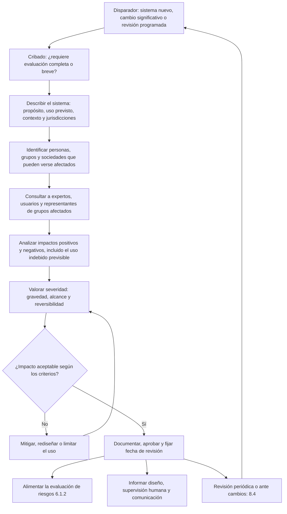

# A.5 · Evaluación de impactos de los sistemas de IA

A.5 · Impacto
:material-view-grid-outline: 4 controles
:material-clock-outline: 32 min de lectura

**El objetivo, en palabras simples:** antes de lanzar un sistema de IA, y mientras siga operando, voltear a ver a quienes no están en la sala de juntas: las personas que serán evaluadas, atendidas o excluidas por él, y la sociedad en la que vive. Valorar qué les puede pasar, para bien y para mal, y dejarlo por escrito.

**Lo que está en juego:** sin este ejercicio, la organización solo mide lo que le duele a ella (multas, reputación, pérdidas) y pasa por alto los daños que sufren otros: un crédito negado sin motivo, un paciente mal priorizado, un trabajador vigilado de más, una comunidad entera que queda fuera de un servicio. Esos daños tarde o temprano regresan como quejas, demandas, sanciones o pérdida de confianza.

!!! abstract "En una frase"
    A.5 convierte la evaluación de impacto que exige la cláusula 6.1.4 en un proceso concreto: cuándo se hace, quién participa, qué se revisa en las personas y en la sociedad, cómo se valora la severidad y cómo se documenta y conserva el resultado.

## Por qué importa este objetivo

En México, muchas obras (una carretera, una planta industrial, un desarrollo turístico en la costa) requieren antes una manifestación de impacto ambiental. Ese estudio no pregunta si la constructora va a ganar dinero; pregunta qué le pasará al río, a la fauna y a las comunidades vecinas. La evaluación de impacto del sistema de IA (*AI system impact assessment*) es el equivalente para los algoritmos: un análisis que se hace **desde afuera hacia adentro**, poniendo en el centro a quienes reciben las consecuencias del sistema.

Esto es lo que más distingue a ISO/IEC 42001 de ISO/IEC 27001. En un sistema de gestión de seguridad de la información, el riesgo se mide casi siempre contra la organización: pérdida de confidencialidad, integridad o disponibilidad de *sus* activos. En un SGIA, además de la evaluación de riesgos (6.1.2), existe una evaluación separada que se pregunta qué les puede pasar a **personas, grupos y sociedades**. Ambas se tocan, pero no son lo mismo: un sesgo que nadie ha detectado puede no representar un riesgo financiero inmediato para la empresa y, al mismo tiempo, cerrar puertas a miles de personas. La diferencia está explicada con calma en [Riesgo frente a impacto](../fundamentos/riesgo-vs-impacto.md).

**¿Cómo se reparten el trabajo las cláusulas y los controles?** En nuestra lectura, la relación es la siguiente:

- La cláusula [6.1.4](../clausulas/c6-planificacion.md#c-6-1-4) obliga a **definir el proceso**: valorar las consecuencias del despliegue, del uso previsto y del uso indebido previsible; considerar el contexto técnico y social y las jurisdicciones aplicables; documentar el resultado; poder compartirlo con partes interesadas cuando corresponda, y usarlo como insumo de la evaluación de riesgos.
- La cláusula [8.4](../clausulas/c8-operacion.md#c-8-4) obliga a **ejecutarlo**: a intervalos planificados y cuando se propongan cambios significativos, conservando los resultados.
- Los controles de A.5 **detallan el contenido**: A.5.2 pide que el proceso cubra todo el ciclo de vida; A.5.3 añade que la documentación se conserve durante un plazo definido; A.5.4 y A.5.5 piden analizar y documentar, por separado, el impacto en personas y grupos y el impacto en la sociedad.

Dicho de otro modo: las cláusulas dicen *que* hay que evaluar impactos; los controles de A.5 dicen *qué contiene* una evaluación bien hecha. Por eso, aunque en teoría podrías excluir algún control de A.5 en la Declaración de Aplicabilidad, la obligación de evaluar impactos seguiría viva por 6.1.4 y 8.4.

**Cómo cambia según tu rol:**

- **Si usas IA de terceros**, evalúas el impacto del uso que *tú* le das, en *tu* contexto. El proveedor no conoce a tus clientes ni a tus empleados; tú sí. Lo que necesites saber del sistema (limitaciones, datos de entrenamiento, pruebas de sesgo) lo pides al proveedor mediante [A.10.3](a10-terceros.md#a-10-3).
- **Si desarrollas IA**, la evaluación empieza en el diseño y sus resultados se convierten en requisitos ([A.6.2.2](a6-ciclo-de-vida.md#a-6-2-2)), en criterios de prueba ([A.6.2.4](a6-ciclo-de-vida.md#a-6-2-4)) y en necesidades de supervisión humana.
- **Si provees IA a clientes**, no conoces todos los contextos de uso, pero sí puedes anticipar los usos previsibles (y los indebidos) y entregar a tus clientes la información que necesitan para hacer su propia evaluación ([A.8.2](a8-informacion-partes-interesadas.md#a-8-2), [A.10.4](a10-terceros.md#a-10-4)).

## Los controles de un vistazo

| Control | Qué pide, en una línea | Aplica a | Esfuerzo | Frente a ISO 27001 |
|---|---|---|---|---|
| [A.5.2 Proceso de evaluación de impacto](#a-5-2) | Tener un método repetible para valorar consecuencias en personas, grupos y sociedades durante todo el ciclo de vida | Usa · Desarrolla · Provee | Alto | Nuevo |
| [A.5.3 Documentación de las evaluaciones de impacto](#a-5-3) | Dejar por escrito cada resultado y conservarlo durante un plazo definido | Usa · Desarrolla · Provee | Medio | Nuevo |
| [A.5.4 Evaluación del impacto en individuos o grupos](#a-5-4) | Analizar efectos en derechos, oportunidades, seguridad y bienestar de personas concretas | Usa · Desarrolla · Provee | Alto | Nuevo |
| [A.5.5 Evaluación de impactos sociales](#a-5-5) | Analizar efectos amplios: ambientales, económicos, democráticos, de salud y culturales | Usa · Desarrolla · Provee | Medio | Nuevo |

!!! note "Sobre los nombres de los controles"
    Son traducciones libres de referencia del autor; la redacción oficial puede variar.

## El flujo de una evaluación de impacto

La norma no impone un método, pero cualquier evaluación defendible sigue más o menos este recorrido. Fíjate en dos cosas: el ciclo se cierra (la evaluación se repite cuando algo cambia) y el resultado sale hacia dos destinos, la evaluación de riesgos y las decisiones de diseño y uso.

## Una escala de severidad para dejar de discutir en abstracto

Sin una escala, las reuniones de evaluación de impacto se vuelven debates de opinión ("a mí no me parece grave"). La cláusula 6.1.1 pide que la organización establezca criterios que sirvan, entre otras cosas, para evaluar impactos; la norma no dice cuáles. Te proponemos una escala de tres dimensiones que funciona bien en la práctica. **Es una propuesta del autor, no un requisito de la norma**: ajústala a tu sector y a tus criterios de riesgo.

| Nivel | Gravedad: ¿qué tan profundo es el daño? | Alcance: ¿a cuántas personas toca? | Reversibilidad: ¿se puede deshacer? |
|---|---|---|---|
| **1 · Bajo** | Molestia o pérdida de tiempo menor; la persona sigue su camino sin consecuencias | Casos aislados o una sola persona | Se corrige en el momento y sin costo para la persona |
| **2 · Moderado** | Pérdida económica pequeña y recuperable, trato desigual que no cierra puertas, estrés pasajero | Un grupo acotado (decenas o cientos de personas) | Se corrige en días, pero la persona tiene que reclamar |
| **3 · Alto** | Se niega un servicio importante (crédito, empleo, salud, educación), daño económico relevante o afectación a un derecho | Miles de personas, o todo un grupo en situación de vulnerabilidad | Revertirlo exige un proceso formal y largo; parte del daño permanece |
| **4 · Crítico** | Daño a la vida, a la integridad física o a la libertad, o pérdida del patrimonio básico de una familia | Una población, una región o la sociedad en su conjunto | Irreversible: no hay forma de devolver a la persona a su situación previa |

**Cómo combinarlas.** Suma los tres niveles (resultado entre 3 y 12) y aplica dos reglas de piso:

| Puntaje | Severidad | Qué conviene hacer | Quién aprueba | Revisión sugerida |
|---|---|---|---|---|
| 3–4 | Baja | Documentar y monitorear | Dueño del sistema | Anual o ante cambios |
| 5–7 | Media | Medidas de mitigación con responsable y fecha | Dueño del sistema y responsable del SGIA | Semestral |
| 8–9 | Alta | Mitigar antes de liberar; reforzar la supervisión humana; consulta externa | Comité de IA o alta dirección | Trimestral y ante cualquier cambio |
| 10–12 | Crítica | No liberar hasta reducirla; replantear el diseño o el uso | Alta dirección, por escrito | Continua |

- **Piso por gravedad:** si la gravedad es 4, el resultado nunca baja de *Alta*, aunque el alcance sea mínimo. Una sola lesión grave basta.
- **Piso por vulnerabilidad:** si el grupo expuesto tiene necesidades especiales de protección (niñas y niños, personas mayores, personas con discapacidad, trabajadores en relación de subordinación), sube un nivel la gravedad.

Ejemplo rápido: si Score Monarca v3 rechazara de forma injustificada a solicitantes de ciertas entidades federativas, la gravedad sería 3 (se niega crédito), el alcance 3 (miles de solicitudes) y la reversibilidad 2 (existe reconsideración, pero la persona debe pedirla): 8 puntos, severidad **Alta**.

## Evaluación de impacto, EIPD e ISO/IEC 42005

Una duda frecuente es si la evaluación de impacto de IA es lo mismo que la evaluación de impacto en la protección de datos personales (EIPD; *data protection impact assessment*, DPIA). **No lo es, aunque se parecen y conviene que se hablen.**

| Aspecto | EIPD | Evaluación de impacto del sistema de IA |
|---|---|---|
| Pregunta central | ¿Qué riesgos genera este tratamiento de datos personales para sus titulares? | ¿Qué consecuencias puede tener este sistema de IA para personas, grupos y sociedades? |
| Quién está en el centro | Titulares de los datos | Cualquier persona afectada, tenga o no datos en el sistema, y la sociedad |
| Tipos de daño | Pérdida de control sobre los datos, vulneraciones, usos incompatibles | Además de lo anterior: discriminación, exclusión, daño físico, pérdida económica, efectos ambientales, democráticos o culturales |
| Qué la detona | Tratamientos de alto riesgo según la ley de datos aplicable | Los criterios de tu proceso (6.1.4, A.5.2) |
| Marco de referencia | Legislación de datos personales | ISO/IEC 42001 y, como guía, ISO/IEC 42005 |

Hay casos en que la EIPD no ve nada y la evaluación de IA sí: un sistema de visión que guía un montacargas no trata datos personales, pero puede lesionar a alguien. Y al revés: la EIPD entra a detalles (base de licitud, transferencias, plazos de conservación) que la evaluación de IA solo toca de pasada.

**¿Se pueden integrar?** Sí, y te lo recomendamos cuando el sistema trata datos personales. La guía del Anexo B sugiere revisar si las evaluaciones por disciplina que ya haces (privacidad, seguridad física, seguridad de la información) incorporan suficientemente las consideraciones de IA, y el Anexo D menciona que los aspectos de privacidad del SGIA pueden integrarse con un sistema de gestión de privacidad basado en ISO/IEC 27701. Dos formas prácticas de hacerlo:

1. **Un solo formato con módulos:** una sección común (descripción del sistema, flujos de datos, partes interesadas) y módulos específicos (privacidad, impacto en personas, impacto social).
2. **Dos documentos con referencias cruzadas:** la evaluación de IA remite a la EIPD para los temas de datos personales y viceversa, con el mismo identificador de sistema.

!!! latam "En México y Latinoamérica"
    La EIPD aparece en leyes de datos personales de varios países de la región o en las aplicables al sector público, con alcances distintos. Revisa en [Contexto México y Latinoamérica](../integracion/contexto-mexico-latam.md) qué aplica a tu caso. Si ya tienes un formato de EIPD, no lo tires: es el mejor punto de partida para tu evaluación de impacto de IA. Si además operas en la Unión Europea, el Reglamento de IA prevé, para ciertos responsables del despliegue de sistemas de alto riesgo, una evaluación de impacto en los derechos fundamentales; consulta [Reglamento de IA de la UE](../integracion/reglamento-ia-ue.md).

**¿Y ISO/IEC 42005?** Es la norma de la familia dedicada específicamente a la evaluación de impacto de sistemas de IA. Da orientación sobre cómo planear, realizar y documentar estas evaluaciones. ISO/IEC 42001 no te obliga a usarla y la 42005 no es una norma certificable por sí sola, pero es la referencia natural si quieres un método más detallado que el de esta página. Para el análisis de riesgos e impactos sobre la propia organización, la referencia es ISO/IEC 23894. Ambas se describen en [La familia de normas de IA](../fundamentos/familia-de-normas.md).

## A.5.2 Proceso de evaluación de impacto {#a-5-2 .dx-control .obj-a5}

:material-cloud-download-outline: Usa IA de terceros
:material-code-braces: Desarrolla IA
:material-handshake-outline: Provee IA a clientes
:material-gauge-full: Esfuerzo alto
:material-star-four-points-outline: Nuevo frente a 27001

**Propósito.** Evitar que la evaluación de impacto dependa de quién esté de turno o de que alguien se acuerde de hacerla. Un proceso definido garantiza que los sistemas relevantes se evalúen con el mismo rigor, en los momentos correctos y a lo largo de todo su ciclo de vida, y que el resultado sirva para decidir algo.

**En la práctica.** Un proceso no es un formulario. Es un conjunto de reglas que responde cinco preguntas: **cuándo** se evalúa, **quién** participa, **con qué método y criterios**, **a quiénes** se considera afectados y **qué se hace con el resultado**. El método puede seguir la misma lógica que ya conoces de la gestión de riesgos al estilo ISO 31000 (identificar, analizar, valorar, tratar y comunicar), solo que mirando a las personas y a la sociedad en lugar de a los activos de la organización. Conviene que la evaluación considere los datos con los que se construyó el sistema, la tecnología que usa y su funcionalidad completa, no solo la pantalla que ve el usuario.

**Cuándo hacerla: los disparadores.** Te recomendamos un cribado (*screening*) breve para todos los sistemas del inventario y una evaluación completa solo cuando el cribado lo indique. Las preguntas del cribado pueden agruparse en cuatro familias:

- **Criticidad del propósito y del contexto.** ¿El sistema decide o recomienda sobre crédito, empleo, salud, educación, vivienda, seguros, acceso a programas públicos o seguridad de las personas? ¿Se usa en un contexto donde un error es difícil de detectar?
- **Complejidad y nivel de automatización.** ¿Es un modelo opaco? ¿Toma decisiones sin una persona en el circuito? ¿Puede ejecutar acciones por sí mismo (por ejemplo, un agente que envía correos o modifica registros)?
- **Sensibilidad de los datos.** ¿Procesa datos sensibles, biométricos, de salud, financieros o de menores de edad? ¿Combina fuentes que juntas revelan más de lo que revela cada una?
- **Cambios significativos en cualquiera de los anteriores.** Un nuevo uso, una nueva población de usuarios, un nuevo país, el cambio del modelo de base por parte del proveedor, un reentrenamiento con fuentes nuevas, un incidente grave o una reforma legal.

Si alguna respuesta es "sí", corresponde evaluación completa; si todas son "no", basta una evaluación breve que documente esa conclusión. Además, la cláusula 8.4 pide repetirla a intervalos planificados, así que conviene que cada evaluación salga con fecha de próxima revisión.

**Quién la hace y con quién consulta.** Te sugerimos que el **dueño del sistema** sea responsable de la evaluación, que el área de riesgos o cumplimiento la **facilite** (aporta el método y cuida la consistencia) y que participe un equipo multidisciplinario: negocio, ciencia de datos o TI, privacidad, legal y, cuando haya trabajadores afectados, recursos humanos. Para sistemas de impacto medio o alto, la evaluación mejora mucho al consultar a tres tipos de voces: **expertos** (del dominio, de ética, de accesibilidad), **usuarios** que operan el sistema y **representantes de los grupos afectados** (una asociación de usuarios, una organización de personas con discapacidad, la representación de los trabajadores, un comité de pacientes). Un principio útil: quien evalúa no debería ser solo quien gana con el lanzamiento.

Por ejemplo, una aseguradora en Colombia que quiere ordenar automáticamente la fila de reclamaciones de gastos médicos activa tres disparadores a la vez (salud, dinero y diagnósticos como datos sensibles). Hace evaluación completa y consulta a médicos dictaminadores, a ajustadores y a asegurados a quienes se les rechazó una reclamación el año anterior.

**Uso indebido previsible.** La evaluación no se limita al uso que imaginó el equipo de producto. Pregúntate qué haría alguien razonablemente previsible: un empleado que usa el chatbot de preguntas frecuentes para dar asesoría fiscal personalizada, un área de cobranza que reutiliza el *score* de originación para decidir a quién presionar más, un cliente que intenta engañar al sistema para obtener datos de otra persona. No se trata de imaginar cualquier catástrofe, sino lo que la experiencia y el sentido común dicen que va a pasar.

**Matices por rol y qué NO exige.** Si usas IA de terceros, el proceso puede ser más ligero, pero no desaparece: el contexto de uso es tuyo. Si provees IA, incluye los usos previsibles de tus clientes. La norma **no** exige un formato específico, consultas públicas ni publicar los resultados; exige un proceso definido, proporcional y que realmente se aplique.

!!! success "Implementación mínima viable"
    - Procedimiento breve aprobado con disparadores, roles, método, criterios de severidad y frecuencia de revisión.
    - Cuestionario de cribado aplicado a todos los sistemas del inventario.
    - Un formato único de evaluación (puedes partir de nuestra [plantilla](../plantillas/index.md#evaluacion-de-impacto)).
    - Escala de severidad con criterios de aceptación ligados a los criterios de riesgo de 6.1.1.
    - Regla explícita de que los resultados alimentan el registro de riesgos.

!!! tip "Implementación madura"
    - Cribado integrado al flujo de nuevos proyectos y de compras: no hay orden de compra de una herramienta con IA sin cribado.
    - Panel consultivo con representantes de usuarios o grupos afectados para sistemas de impacto alto.
    - EIPD, evaluación de seguridad y evaluación de impacto de IA en un solo flujo.
    - Reevaluaciones disparadas desde el monitoreo (deriva, quejas, incidentes) de [A.6.2.6](a6-ciclo-de-vida.md#a-6-2-6).
    - Revisión de calidad de las evaluaciones por una segunda línea o por auditoría interna.

=== ":material-folder-check-outline: Evidencia típica"

    - Procedimiento de evaluación de impacto aprobado y versionado.
    - Cuestionarios de cribado de todos los sistemas del inventario.
    - Evaluaciones completas de los sistemas que lo ameritaron.
    - Minutas o notas de las consultas con expertos, usuarios o representantes.
    - Registro de riesgos con referencias cruzadas a la evaluación de impacto.
    - Evidencia de una reevaluación tras un cambio significativo.

=== ":material-account-search-outline: Preguntas del auditor"

    1. ¿Cómo deciden si un sistema necesita evaluación de impacto completa? Muéstreme el cribado de los sistemas del inventario.
    2. ¿Qué cambios disparan una reevaluación? Deme un ejemplo de los últimos doce meses.
    3. ¿Quién participó en la evaluación de este sistema? ¿A quién consultaron fuera del equipo técnico?
    4. ¿Cómo consideraron el uso indebido previsible?
    5. Muéstreme cómo un resultado de la evaluación de impacto se reflejó en la evaluación de riesgos o en el diseño.
    6. ¿Con qué criterios deciden si un impacto es aceptable y quién lo aprueba?

=== ":material-alert-outline: Errores comunes"

    - Confundir la evaluación de impacto con la de riesgos y llenar una sola matriz que solo mira a la organización.
    - Evaluar una vez, antes del lanzamiento, y nunca más.
    - Dejar la evaluación solo al equipo técnico (o solo a cumplimiento), sin escuchar a nadie que viva las consecuencias.
    - Considerar únicamente el uso previsto y olvidar el uso indebido previsible.
    - Concluir algo en la evaluación y que nada cambie: ni el diseño, ni los riesgos, ni la supervisión.
    - Diseñar un procedimiento tan pesado que todos buscan cómo evitarlo.

=== ":material-scale-balance: ¿Se puede excluir?"

    **Podría justificarse si…** en nuestra lectura, prácticamente nunca. Las cláusulas 6.1.4 y 8.4 son requisitos obligatorios y ya exigen tener y aplicar el proceso; excluir A.5.2 no te libera de ellos. Lo que sí puedes hacer es aplicarlo de forma proporcional. Redacción sugerida en la SoA: *"Aplicable. Se implementa mediante el procedimiento de evaluación de impacto, con cribado de dos niveles: evaluación breve para sistemas sin disparadores y completa para el resto."*

    **No se justifica si…** el argumento es "solo usamos IA de terceros" o "nuestros sistemas son de bajo riesgo". Que un sistema tenga bajo impacto es el *resultado* de la evaluación, no una razón para no hacerla.

**Relaciones.** Cláusulas: [4.1](../clausulas/c4-contexto.md#c-4-1), [6.1.1](../clausulas/c6-planificacion.md#c-6-1-1), [6.1.2](../clausulas/c6-planificacion.md#c-6-1-2), [6.1.4](../clausulas/c6-planificacion.md#c-6-1-4), [8.4](../clausulas/c8-operacion.md#c-8-4) · Controles: [A.5.3](#a-5-3), [A.5.4](#a-5-4), [A.5.5](#a-5-5), [A.6.2.2](a6-ciclo-de-vida.md#a-6-2-2), [A.6.2.6](a6-ciclo-de-vida.md#a-6-2-6), [A.9.4](a9-uso.md#a-9-4), [A.10.3](a10-terceros.md#a-10-3) · ISO 27001: sin control equivalente; puedes reutilizar la mecánica del proceso de riesgos de la cláusula 6.1.2 de 27001 · Normas: ISO/IEC 42005, ISO/IEC 23894, ISO 31000 · **Anexo B:** la guía B.5.2 orienta sobre las circunstancias que deberían detonar una evaluación, las etapas que puede tener el proceso, quién la realiza, cómo se aprovechan sus resultados en el diseño y el uso, y a quiénes considerar afectados; también advierte que el proceso puede variar según el rol de la organización y el dominio de aplicación.

## A.5.3 Documentación de las evaluaciones de impacto {#a-5-3 .dx-control .obj-a5}

:material-cloud-download-outline: Usa IA de terceros
:material-code-braces: Desarrolla IA
:material-handshake-outline: Provee IA a clientes
:material-gauge: Esfuerzo medio
:material-star-four-points-outline: Nuevo frente a 27001

**Propósito.** Que lo que se analizó no se pierda: que se pueda demostrar, comparar en el tiempo, reutilizar y comunicar. Y que se conserve lo suficiente para responder preguntas futuras de auditores, clientes, autoridades o personas afectadas, incluso años después de una decisión.

**En la práctica.** El control pide dos cosas: documentar los **resultados** (no solo que "se hizo la evaluación") y conservarlos durante un **periodo definido**. La documentación tiene además un uso práctico que muchas organizaciones pasan por alto: es la fuente natural para decidir qué información se comunica a usuarios y otras partes interesadas ([A.8.2](a8-informacion-partes-interesadas.md#a-8-2), [A.8.5](a8-informacion-partes-interesadas.md#a-8-5)).

**Qué registrar.** Te proponemos que cada evaluación tenga, como mínimo, estas secciones:

| Sección | Qué contiene |
|---|---|
| Identificación | Sistema, versión del sistema evaluada, fecha, personas que evaluaron, quién aprobó y fecha de próxima revisión |
| Descripción y contexto | Propósito, uso previsto, quiénes lo operan, en qué países, qué tan complejo es técnicamente y cómo se integra con otros procesos |
| Usos indebidos | Los usos inadecuados que razonablemente pueden ocurrir y cómo se previenen o detectan |
| Personas y grupos | Quiénes reciben las consecuencias, sus características demográficas pertinentes y los grupos con necesidades especiales de protección |
| Impactos | Positivos y negativos, en personas y en la sociedad, cada uno con su valoración de severidad |
| Fallas previsibles | Qué puede fallar, qué le pasaría a la gente si falla y qué se hizo para mitigarlo |
| Papel de las personas | Quién supervisa, con qué herramientas puede intervenir y cómo se pide una revisión humana |
| Efectos en el personal | Cómo cambian los puestos de trabajo y qué capacitación necesitan quienes operan el sistema |
| Decisiones | Medidas acordadas, responsables, fechas e impacto residual aceptado (con firma) |
| Consultas y vínculos | A quién se consultó y qué se recogió; referencias al registro de riesgos, a la EIPD y a la [ficha del sistema](../plantillas/index.md#ficha-del-sistema) |

**Cuánto tiempo conservarla.** La norma deja el plazo a tu criterio, pero pide que esté definido. Te recomendamos esta regla: **conserva cada versión durante toda la vida del sistema y, después de su retiro, al menos durante el plazo más largo en que alguien podría cuestionar una decisión que el sistema tomó o en que una autoridad podría pedirte cuentas.** La razón es práctica: si una persona reclama hoy un rechazo de hace dos años, necesitas la evaluación que estaba vigente *en ese momento*, no la de hoy. Alinea el plazo con tu tabla de retención y con las obligaciones de conservación que ya tienes (fiscales, de datos personales, sectoriales). Y no conserves más datos personales de los necesarios: si la evaluación incluye nombres de personas consultadas, basta con su rol.

**Versiones y disponibilidad.** La evaluación es un documento vivo: cada reevaluación genera una versión nueva, sin sobrescribir la anterior. Aplica el control de información documentada que ya tienes para el SGIA ([7.5](../clausulas/c7-apoyo.md#c-7-5)): quién puede editar, quién aprueba, dónde se guarda. La cláusula 6.1.4 permite que pongas los resultados a disposición de partes interesadas cuando corresponda, según lo que tú definas; en la práctica conviene tener dos niveles: la evaluación completa (interna) y un **resumen** para clientes, autoridades o el público.

Por ejemplo, Contadores Alameda documentó la evaluación de Alma, su chatbot de WhatsApp, en seis páginas con estas secciones. La versión vigente (1.2) conserva el historial de las anteriores, y cada cambio tiene una nota breve: la 1.1 se emitió al descubrir que muchos dueños de micronegocios de mayor edad no notaban que hablaban con un asistente virtual. El despacho la conserva mientras Alma opere y cinco años después de su retiro, el plazo que fijó en su política interna para expedientes de clientes, y entregó un resumen de dos páginas al banco cliente que le envió el cuestionario sobre gobierno de IA.

**Qué NO exige.** No exige un documento único (puede ser un registro en una herramienta GRC), ni guardar las evaluaciones para siempre, ni publicarlas. Para quien usa IA de terceros, la documentación puede ser breve; para quien provee IA, conviene preparar desde el inicio una versión resumida que los clientes puedan usar en sus propias evaluaciones.

!!! success "Implementación mínima viable"
    - Plantilla única con las secciones mínimas de la tabla anterior.
    - Cada evaluación con versión, fecha, autores y aprobación registrada.
    - Repositorio controlado con historial de versiones, no correos ni carpetas personales.
    - Plazo de conservación definido en la tabla de retención de la organización.
    - Resumen para partes interesadas cuando el sistema las afecta directamente.

!!! tip "Implementación madura"
    - Evaluaciones como registros en una herramienta GRC, vinculadas a riesgos, controles e incidentes.
    - Flujo de aprobación con firma electrónica y trazabilidad.
    - Fichas de impacto públicas o para clientes, actualizadas con cada versión.
    - Alertas automáticas de vencimiento de la fecha de revisión.
    - Conservación inmutable (por ejemplo, almacenamiento de solo escritura) para sistemas de impacto alto.

=== ":material-folder-check-outline: Evidencia típica"

    - Evaluaciones firmadas y versionadas, con historial completo.
    - Tabla de retención que incluye la categoría "evaluaciones de impacto de IA" con su plazo y su fundamento.
    - Permisos de acceso al repositorio de evaluaciones.
    - Resúmenes entregados a clientes o publicados.
    - Evidencia de eliminación segura al vencer el plazo, si ya ocurrió.

=== ":material-account-search-outline: Preguntas del auditor"

    1. Muéstreme la evaluación vigente de este sistema y la versión anterior. ¿Qué cambió y por qué?
    2. ¿Cuánto tiempo conservan estas evaluaciones y en qué se basa ese plazo?
    3. ¿Dónde se guardan y quién puede modificarlas?
    4. Si una persona reclama hoy una decisión de hace dos años, ¿pueden recuperar la evaluación vigente en aquel momento?
    5. ¿Qué parte de la evaluación comparten con usuarios, clientes o autoridades?
    6. ¿Quién aprueba una evaluación y cómo queda constancia?

=== ":material-alert-outline: Errores comunes"

    - Sobrescribir la evaluación en cada actualización y perder el historial.
    - Documentar el procedimiento, pero no los resultados concretos de cada sistema.
    - Definir el plazo en abstracto ("el tiempo necesario") o no definirlo.
    - Guardar evaluaciones en la computadora de quien las hizo o en un hilo de correo.
    - Incluir datos personales innecesarios de las personas consultadas.
    - Documentar solo impactos negativos y omitir los positivos que justifican el sistema.

=== ":material-scale-balance: ¿Se puede excluir?"

    **Podría justificarse si…** en nuestra lectura, no hay un escenario razonable. La cláusula 8.4 ya obliga a guardar evidencia de lo que arrojó cada evaluación; A.5.3 solo añade que el plazo de conservación esté definido. Excluirlo dejaría una no conformidad contra la cláusula de todos modos.

    **No se justifica si…** el argumento es "la evaluación fue verbal en el comité" o "la información está en la cabeza del dueño del sistema". Lo que no está documentado no se puede demostrar ni reutilizar.

**Relaciones.** Cláusulas: [6.1.4](../clausulas/c6-planificacion.md#c-6-1-4), [7.5](../clausulas/c7-apoyo.md#c-7-5), [8.4](../clausulas/c8-operacion.md#c-8-4) · Controles: [A.5.2](#a-5-2), [A.6.2.7](a6-ciclo-de-vida.md#a-6-2-7), [A.8.2](a8-informacion-partes-interesadas.md#a-8-2), [A.8.5](a8-informacion-partes-interesadas.md#a-8-5) · ISO 27001 A.5.33 (protección de registros) y la cláusula 7.5 de 27001: reutiliza tu control documental y tu tabla de retención, y agrega la categoría nueva · Normas: ISO/IEC 42005 · **Anexo B:** la guía B.5.3 explica que la documentación ayuda a decidir qué comunicar a usuarios y partes interesadas, que los plazos de conservación pueden seguir el calendario de retención de la organización o requisitos legales, y sugiere varios temas que conviene registrar en cada evaluación.

## A.5.4 Evaluación del impacto en individuos o grupos {#a-5-4 .dx-control .obj-a5}

:material-cloud-download-outline: Usa IA de terceros
:material-code-braces: Desarrolla IA
:material-handshake-outline: Provee IA a clientes
:material-gauge-full: Esfuerzo alto
:material-star-four-points-outline: Nuevo frente a 27001

**Propósito.** Mirar con lupa a las personas: qué le puede pasar a quien es evaluado, atendido, vigilado o excluido por el sistema, durante todo su ciclo de vida, con atención especial a quienes tienen menos capacidad de defenderse.

**En la práctica.** El punto de partida son tus propios compromisos: la política de IA ([A.2.2](a2-politicas.md#a-2-2)), tus principios y tus objetivos. Si tu política dice que tratas a todos los solicitantes con equidad, la evaluación tiene que poner a prueba esa promesa. Luego identifica a **todas** las personas involucradas, no solo al usuario que opera el sistema: quien recibe la decisión (el solicitante de crédito), quien interactúa con el sistema sin saberlo (el cliente que escribe por WhatsApp), terceros que nunca lo usan pero sufren sus efectos (el aval de un crédito, la familia de un paciente). Estas personas tienen expectativas legítimas sobre el sistema (que funcione, que sea justo, que alguien responda) y conviene que la evaluación las identifique y decida cómo atenderlas.

**Áreas de impacto.** Usa las siguientes como lista de verificación; no todas aplican a todos los sistemas, pero conviene descartarlas de forma razonada y no por omisión:

| Área | Pregunta guía | Ejemplo latinoamericano |
|---|---|---|
| Derechos humanos | ¿Puede limitar la intimidad, la libertad de expresión o de circulación, o la no discriminación? | Un gobierno estatal que usa reconocimiento facial en el acceso a un estadio |
| Equidad (*fairness*) | ¿Trata peor a un grupo sin una razón legítima? | Un modelo de crédito con tasas de rechazo mucho mayores para mujeres |
| Consecuencias económicas | ¿Puede hacer perder dinero, empleo, acceso a crédito o a beneficios? | Un chatbot que da una fecha equivocada y el cliente paga recargos |
| Salud y seguridad física | ¿Puede causar una lesión, retrasar una atención o generar daño psicológico? | Un hospital en Chile que prioriza la fila de urgencias con un modelo |
| Privacidad y seguridad | ¿Expone datos, permite inferir aspectos íntimos o abre la puerta a fraudes? | Un asistente que revela el estatus del trámite de otra persona |
| Transparencia y explicabilidad | ¿La persona sabe que interviene una IA y puede entender por qué obtuvo ese resultado? | Un rechazo de crédito sin un motivo comprensible |
| Rendición de cuentas (*accountability*) | ¿Hay alguien a quien reclamar y que pueda corregir el resultado? | Un solicitante rechazado que no tiene a quién pedir una revisión |
| Accesibilidad | ¿Pueden usarlo personas con discapacidad, personas mayores, personas con baja conectividad o hablantes de lenguas indígenas? | Una app que exige verificación de identidad por video con buena señal |

**Grupos con necesidades de protección.** La guía de la norma menciona expresamente a niñas y niños, personas mayores, personas con discapacidad y trabajadores (estos últimos por la relación de subordinación: es difícil negarse a un sistema que impone el empleador). En nuestra lectura, la lista no es cerrada; en Latinoamérica conviene añadir, según el caso, a pueblos indígenas, personas migrantes, población no bancarizada y personas con baja alfabetización digital. Para estos grupos, la escala de severidad sube un nivel.

**Cómo consultar.** Para sistemas de impacto medio o alto, recoge evidencia de personas reales: entrevistas con operadores, pruebas con usuarios (incluidas personas mayores o con discapacidad), grupos focales y revisión de quejas históricas; para Monarca Crédito, las quejas recibidas por su unidad de atención a usuarios y por la Condusef son una fuente valiosa.

**Ejemplo: Score Monarca v3.** La evaluación de los solicitantes de crédito identificó: posible inequidad por sexo, edad y entidad federativa aunque esas variables no se usen, porque el código postal puede funcionar como variable sustituta (*proxy*); consecuencias económicas serias si un rechazo injusto empuja a la persona hacia prestamistas informales; la necesidad de motivos de rechazo en lenguaje claro y de un canal real de reconsideración; riesgos de privacidad por los datos de uso de la app, y barreras de accesibilidad para personas mayores con poca huella digital. También documentó un **impacto positivo**: la inclusión de personas sin historial en el buró de crédito que la banca tradicional no atiende.

**Matices por rol y qué NO exige.** Si usas IA de terceros, piensa también en tus propios trabajadores: el asistente de ofimática de Contadores Alameda no decide sobre clientes, pero si sus métricas de uso se emplearan para evaluar la productividad del personal, el impacto en los trabajadores cambiaría por completo. La norma **no** exige eliminar todo impacto negativo (exige identificarlo, valorarlo y decidir de forma consciente), ni métricas de equidad concretas, ni consultas públicas.

!!! success "Implementación mínima viable"
    - Sección de impactos en personas dentro de la plantilla, con las áreas de impacto como lista de verificación.
    - Identificación explícita de quiénes son los afectados, además de los usuarios.
    - Revisión de grupos con necesidades especiales de protección.
    - Al menos una consulta documentada con usuarios u operadores para sistemas de impacto medio o alto.
    - Valoración de severidad por impacto y una medida asociada a cada impacto relevante.
    - Vínculo con la EIPD cuando hay datos personales.

!!! tip "Implementación madura"
    - Métricas de equidad por segmento integradas a la validación ([A.6.2.4](a6-ciclo-de-vida.md#a-6-2-4)) y al monitoreo.
    - Panel consultivo con representantes de grupos afectados.
    - Pruebas de usabilidad y accesibilidad con personas mayores y con discapacidad.
    - Análisis continuo de quejas y reclamaciones como fuente de nuevos impactos.
    - Debida diligencia en derechos humanos alineada con los Principios Rectores de la ONU sobre las empresas y los derechos humanos.

=== ":material-folder-check-outline: Evidencia típica"

    - Sección de impactos en personas y grupos, con valoración de severidad.
    - Minutas o notas de consultas con expertos, usuarios o representantes.
    - Resultados de pruebas de sesgo por segmento.
    - Plan de mitigación con responsables y fechas.
    - Evidencia de un canal de reconsideración o de quejas en funcionamiento.
    - Resultados de pruebas de accesibilidad.

=== ":material-account-search-outline: Preguntas del auditor"

    1. ¿Quiénes son las personas afectadas por este sistema, además de los usuarios directos?
    2. ¿Qué grupos con necesidades especiales de protección identificaron y qué hicieron al respecto?
    3. ¿A quién consultaron y qué cambió gracias a esa consulta?
    4. ¿Cómo evaluaron la equidad? Muéstreme resultados por segmento.
    5. Si una persona no está de acuerdo con el resultado, ¿qué puede hacer? Muéstreme un caso real.
    6. ¿Qué impactos positivos identificaron y cómo saben si se materializan?
    7. ¿Cómo se relaciona esta evaluación con la EIPD?

=== ":material-alert-outline: Errores comunes"

    - Pensar solo en quien opera el sistema y olvidar a quien recibe la decisión.
    - Concluir que no hay sesgo porque "no usamos la variable sexo", sin revisar variables sustitutas.
    - Tratar la accesibilidad como un tema de diseño gráfico.
    - Ignorar a los propios trabajadores como grupo afectado.
    - Marcar "no aplica" en todas las áreas de impacto sin ningún análisis.

=== ":material-scale-balance: ¿Se puede excluir?"

    **Podría justificarse si…** en nuestra lectura, solo en casos muy acotados donde ningún sistema del alcance interactúa con personas ni produce resultados que lleguen a ellas. Aun así, conviene aplicarlo con una conclusión breve. Ejemplo de redacción, si se decide excluir: *"Excluido. El único sistema en alcance optimiza la temperatura del centro de datos; no procesa datos personales ni genera decisiones o contenidos dirigidos a personas. La evaluación de impacto de 6.1.4 lo confirma."*

    **No se justifica si…** el sistema decide, recomienda, clasifica o conversa con personas, aunque sea un producto de terceros y aunque una persona revise el resultado al final.

**Relaciones.** Cláusulas: [4.2](../clausulas/c4-contexto.md#c-4-2), [6.1.2](../clausulas/c6-planificacion.md#c-6-1-2), [6.1.4](../clausulas/c6-planificacion.md#c-6-1-4) · Controles: [A.2.2](a2-politicas.md#a-2-2), [A.5.2](#a-5-2), [A.5.5](#a-5-5), [A.6.2.4](a6-ciclo-de-vida.md#a-6-2-4), [A.7.4](a7-datos.md#a-7-4), [A.8.2](a8-informacion-partes-interesadas.md#a-8-2), [A.9.2](a9-uso.md#a-9-2) · ISO 27001 A.5.34 (privacidad y protección de datos personales): cubre una de las áreas, no todas · Normas: ISO/IEC 42005, ISO/IEC TR 24027 (sesgo), ISO/IEC 27701 · **Anexo B:** la guía B.5.4 pide partir de los principios, políticas y objetivos de IA de la organización, tener en cuenta las expectativas de las personas y las necesidades de protección de ciertos grupos, ofrece una lista no exhaustiva de áreas de impacto y recomienda consultar a expertos y usuarios cuando haga falta.

## A.5.5 Evaluación de impactos sociales {#a-5-5 .dx-control .obj-a5}

:material-cloud-download-outline: Usa IA de terceros
:material-code-braces: Desarrolla IA
:material-handshake-outline: Provee IA a clientes
:material-gauge: Esfuerzo medio
:material-star-four-points-outline: Nuevo frente a 27001

**Propósito.** Levantar la vista más allá de las personas concretas: cómo el sistema, multiplicado por miles o millones de interacciones, puede cambiar el ambiente, la economía, la vida democrática, la salud pública o la cultura, para bien o para mal.

**En la práctica.** La diferencia con [A.5.4](#a-5-4) es la **escala y la agregación**. Hay daños que ninguna persona en lo individual podría reclamar, pero que existen: el deterioro de la confianza en la información pública, el consumo de agua de los centros de datos en una región con estrés hídrico, la desaparición gradual de empleos en un sector. Y hay beneficios del mismo tipo. Los impactos sociales varían mucho según la organización y el tipo de sistema, así que conviene que la evaluación sea específica, no un ensayo genérico sobre la IA y la humanidad.

| Dimensión | Impacto negativo posible | Impacto positivo posible |
|---|---|---|
| Económica (acceso a servicios financieros, empleo, mercados, recaudación) | Exclusión crediticia de regiones enteras; desplazamiento de empleos en centros de contacto | Inclusión financiera de micronegocios; formalización; trámites más rápidos |
| Ambiental (energía, agua, emisiones, recursos naturales) | Huella del cómputo para entrenar y consultar modelos grandes | Rutas de reparto optimizadas; menos desperdicio de alimentos en el comercio minorista |
| Salud pública (acceso, diagnóstico, daño físico o psicológico) | Un asistente que da consejos de salud peligrosos a miles de personas | Detección temprana en zonas rurales con pocos especialistas |
| Vida democrática, gobierno y justicia | Videos falsos (*deepfakes*) de candidatos; información electoral falsa repetida por asistentes; sesgos en sistemas de justicia o seguridad | Trámites públicos explicados en lenguaje claro; acceso a la información |
| Cultura, valores y cohesión social | Modelos que refuerzan estereotipos o invisibilizan lenguas indígenas y variantes regionales del español | Traducción y preservación de lenguas originarias; contenidos accesibles |

**Uso indebido y daños históricos.** Pregúntate cómo podrían usar tu sistema actores con malas intenciones para causar un daño colectivo (campañas de desinformación, fraude masivo, acoso coordinado) y si el sistema podría **reforzar desigualdades históricas**: por ejemplo, un modelo de crédito que reproduce la exclusión que ya sufrían ciertas colonias o municipios porque aprendió de decisiones del pasado. La pregunta tiene también un lado positivo: ¿puede el sistema ayudar a corregir esos daños, abriendo el acceso a quien antes no lo tenía? La guía de la norma pide poner en la balanza beneficios y perjuicios, no solo estos últimos.

**El impacto ambiental, sin excusas.** Muchas organizaciones lo omiten porque "no tenemos datos exactos". No hace falta un análisis de ciclo de vida completo para un chatbot de preguntas frecuentes; basta con preguntar al proveedor por la información de consumo energético que publique, elegir modelos de tamaño proporcional a la tarea y dejar constancia del razonamiento. Conecta este análisis con tu estrategia de sostenibilidad y, si es pertinente, con la consideración de cambio climático que pide la cláusula [4.1](../clausulas/c4-contexto.md#c-4-1). El Anexo C, por cierto, menciona el impacto ambiental como posible objetivo de IA.

**Ejemplo: Conversa Labs.** Como proveedor de una plataforma usada por aseguradoras, universidades y comercios en cuatro países, Conversa tiene impactos sociales que ninguno de sus clientes ve por separado. Su evaluación identificó: efecto en el empleo de centros de contacto (negativo si los clientes sustituyen agentes; positivo si los liberan de tareas repetitivas y Conversa ofrece traspaso a agente humano); riesgo de información errónea a escala (una universidad que responde mal sobre becas a miles de aspirantes); riesgo de uso para campañas políticas o mensajes engañosos, que se atendió con una política de uso aceptable en los contratos; sesgo hacia un español "neutro" que entiende mal a usuarios de ciertas regiones, y un consumo de cómputo que se reduce eligiendo modelos más pequeños para tareas simples.

**Matices por rol y qué NO exige.** Si usas IA de terceros con pocos usuarios, esta sección puede ser breve y concluir que el impacto social no es significativo, siempre con razones. Si provees IA o desarrollas sistemas de gran alcance, la escala hace que este análisis importe más. La norma **no** exige cuantificar con precisión la huella de carbono ni resolver problemas sociales; exige evaluarlos y documentarlos a lo largo del ciclo de vida.

!!! success "Implementación mínima viable"
    - Sección de impactos sociales en la plantilla, con las cinco dimensiones como guía.
    - Análisis explícito de usos indebidos con efecto colectivo.
    - Una pregunta documentada al proveedor sobre huella ambiental, o una estimación propia razonada.
    - Registro de los impactos positivos esperados y de cómo se comprobará que ocurren.
    - Conclusión proporcional y firmada, aunque sea "impacto social bajo, por estas razones".

!!! tip "Implementación madura"
    - Integración con la estrategia de sostenibilidad y con el informe ESG de la organización.
    - Métricas de cómputo, energía y, cuando sea posible, agua por sistema.
    - Política de uso aceptable para clientes que prohíba usos con daño social.
    - Vigilancia de tendencias regulatorias y sociales que cambien la valoración.
    - Consulta con academia u organizaciones de la sociedad civil para sistemas de gran alcance.

=== ":material-folder-check-outline: Evidencia típica"

    - Sección de impactos sociales de la evaluación, con valoración.
    - Análisis de usos indebidos con efecto colectivo.
    - Datos o declaraciones del proveedor sobre consumo de cómputo o energía.
    - Referencia cruzada con la estrategia de sostenibilidad.
    - Cláusulas de uso aceptable en contratos con clientes.
    - Minuta del comité que aprobó la conclusión.

=== ":material-account-search-outline: Preguntas del auditor"

    1. ¿Qué efectos podría tener este sistema más allá de las personas que lo usan?
    2. ¿Cómo podría usarse para causar daño colectivo y qué hicieron para prevenirlo?
    3. ¿Consideraron el impacto ambiental? ¿Con qué datos o supuestos?
    4. ¿Qué impactos positivos esperan y cómo sabrán si se materializan?
    5. ¿Revisaron si el sistema podría reforzar desigualdades históricas?
    6. ¿Cómo se conecta este análisis con su estrategia de sostenibilidad?

=== ":material-alert-outline: Errores comunes"

    - Escribir párrafos genéricos sobre "la IA y la sociedad" sin relación con el sistema concreto.
    - Omitir el impacto ambiental por falta de datos exactos.
    - Ver solo lo negativo y no documentar los beneficios que justifican el sistema.
    - Suponer que una organización pequeña no puede tener impacto social.
    - No reevaluar cuando el sistema escala de cientos a cientos de miles de usuarios.

=== ":material-scale-balance: ¿Se puede excluir?"

    **Podría justificarse si…** rara vez. La cláusula 6.1.4 ya pide considerar a las sociedades, así que excluir A.5.5 deja un hueco difícil de defender. Concluir que el impacto social no es significativo es válido, y eso es *aplicar* el control, no excluirlo. Redacción sugerida en la SoA: *"Aplicable. Para IA-01 e IA-03 el impacto social se valoró como no significativo; para IA-02 se identificaron dos impactos sociales con medidas asignadas (ver evaluaciones de impacto vigentes)."*

    **No se justifica si…** el sistema tiene muchos usuarios, interviene en servicios esenciales, genera contenidos que circulan públicamente o consume cómputo intensivo.

**Relaciones.** Cláusulas: [4.1](../clausulas/c4-contexto.md#c-4-1), [6.1.4](../clausulas/c6-planificacion.md#c-6-1-4), [6.2](../clausulas/c6-planificacion.md#c-6-2) · Controles: [A.5.2](#a-5-2), [A.5.4](#a-5-4), [A.8.5](a8-informacion-partes-interesadas.md#a-8-5), [A.9.4](a9-uso.md#a-9-4), [A.10.4](a10-terceros.md#a-10-4) · ISO 27001: sin control equivalente · Normas: ISO/IEC 42005, ISO/IEC TR 24368 (aspectos éticos y sociales de la IA) · **Anexo B:** la guía B.5.5 da ejemplos de dimensiones sociales que pueden verse afectadas, recuerda que los efectos pueden ser beneficiosos o perjudiciales y pide considerar la sostenibilidad ambiental en el marco de la estrategia de la organización, el mal uso de los sistemas y el riesgo de reforzar sesgos históricos.

## Cómo se ve este objetivo en los casos prácticos

=== "Contadores Alameda"

    El despacho aplicó el cribado a sus tres sistemas. **IA-01** (asistente de ofimática) recibió una evaluación breve centrada en privacidad (datos de nómina en las instrucciones) y en los trabajadores (se acordó que las métricas de uso no se usarán para evaluar desempeño). **IA-02, Alma**, recibió evaluación completa: atiende a clientes, da información con consecuencias fiscales y muchos usuarios no saben que hablan con una IA. **IA-03** (captura de CFDI) quedó con severidad media por el efecto de un error de extracción en la contabilidad del cliente.

    Para Alma, el impacto "fecha de declaración equivocada" se valoró con gravedad 2, alcance 2 y reversibilidad 2: 6 puntos, severidad media. Medidas: revisión mensual de la FAQ por un contador, fecha de última actualización visible en cada respuesta sobre plazos, traspaso a una persona para cualquier consulta de vencimientos y un aviso claro de que se conversa con un asistente virtual. Disparador definido: si BotNorte cambia el modelo de lenguaje que usa, Alma se reevalúa. Más detalle en el [caso completo](../casos-practicos/pyme-usa-ia-generativa.md).

=== "Monarca Crédito"

    **Score Monarca v3** tiene evaluación completa aprobada por el Comité de Modelos, integrada con la EIPD que coordina el Oficial de Privacidad. Se consultó a los analistas de la banda gris, a un grupo de clientes con micronegocio y a una especialista externa en equidad algorítmica. Los impactos descritos en [A.5.4](#a-5-4) se valoraron como severidad alta y se tradujeron en requisitos: monitoreo de tasas de aprobación por segmento, motivos de rechazo en lenguaje claro y un procedimiento de revisión humana de rechazos automáticos.

    Disparadores definidos: cada reentrenamiento, cualquier cambio en los umbrales de las tres bandas y cambios económicos que alteren el perfil de los solicitantes. Aunque **IA-03** (detección de fraude) es de un proveedor, también se evaluó: un falso positivo bloquea a un solicitante legítimo sin explicación. Ver el [caso completo](../casos-practicos/fintech-scoring.md).

=== "Conversa Labs"

    Como proveedor, Conversa evalúa la plataforma y los **usos previsibles** de sus clientes por sector (aseguradoras, universidades, comercios), incluidos los indebidos: suplantar a una persona, generar mensajes engañosos, usar el asistente para decisiones que deberían tomar personas. El resultado se refleja en la política de uso aceptable de los contratos y en una **ficha de impacto** que entrega a cada cliente para que haga su propia evaluación como responsable del despliegue.

    La evaluación se repite cada vez que el proveedor del modelo fundacional publica una versión nueva que Conversa decide adoptar. Para el cliente en España se añadió la revisión de las obligaciones de transparencia del Reglamento de IA de la UE. Ver el [caso completo](../casos-practicos/empresa-desarrolla-chatbot.md).

## Plantillas y recursos relacionados

- [Evaluación de impacto del sistema de IA](../plantillas/index.md#evaluacion-de-impacto): plantilla con cribado, escala de severidad y secciones para A.5.3, A.5.4 y A.5.5.
- [Metodología y matriz de riesgos de IA](../plantillas/index.md#evaluacion-de-riesgos): para llevar los resultados de la evaluación de impacto a la evaluación de riesgos.
- [Inventario de sistemas de IA](../plantillas/index.md#inventario-sistemas-ia): punto de partida del cribado.
- [Ficha del sistema de IA](../plantillas/index.md#ficha-del-sistema): descripción técnica a la que remite la evaluación.
- [Riesgo frente a impacto](../fundamentos/riesgo-vs-impacto.md): la diferencia conceptual, explicada paso a paso.
- [Cláusula 6.1.4](../clausulas/c6-planificacion.md#c-6-1-4) y [cláusula 8.4](../clausulas/c8-operacion.md#c-8-4): los requisitos que este objetivo desarrolla.
- [A.7 Datos para sistemas de IA](a7-datos.md): los datos son una de las fuentes principales de impacto.
- [La familia de normas de IA](../fundamentos/familia-de-normas.md): ISO/IEC 42005 e ISO/IEC 23894.
