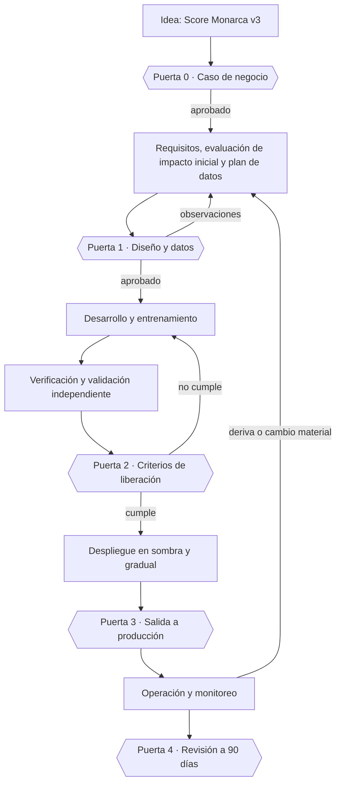

# A.6 · Ciclo de vida del sistema de IA

A.6 · Ciclo de vida
:material-view-grid-outline: 9 controles
:material-clock-outline: 55 min de lectura

**El objetivo, en palabras simples:** que la organización sepa qué quiere lograr cuando construye IA de forma responsable, que tenga un proceso para lograrlo y que cada etapa de cada sistema, desde la idea hasta el retiro, tenga criterios claros, documentados y comprobables para avanzar.

**Lo que está en juego:** modelos que llegan a producción sin que nadie haya decidido qué significaba "suficientemente bueno", pruebas que nunca miraron a los grupos afectados, cambios hechos en caliente, sistemas que se degradan en silencio y, cuando algo sale mal, ninguna bitácora para reconstruir qué pasó.

!!! abstract "En una frase"
    A.6 convierte el desarrollo de IA en un proceso con reglas y puertas de aprobación: objetivos responsables que bajan a requisitos y pruebas, criterios para pasar de una etapa a la siguiente, y documentación y registros que permiten demostrar (y reconstruir) lo que se hizo.

## Por qué importa este objetivo

Piensa en una obra de construcción en cualquier ciudad de México. Existe un reglamento de construcción que vale para todas las obras: fija qué se espera en seguridad estructural, instalaciones y protección civil, y quién debe firmar qué. Y luego está cada obra concreta, con sus planos, su bitácora, sus pruebas de resistencia del concreto, la revisión antes de que alguien la habite y el mantenimiento de los años siguientes. Nadie aceptaría que se levantaran muros sin saber qué carga deben soportar, ni que se entregara un edificio sin probar las instalaciones de gas. Con la IA pasa lo mismo, solo que los "muros" son datos, modelos y umbrales de decisión, y los inquilinos son las personas a las que el sistema califica, atiende o recomienda.

Este objetivo está partido en **dos subobjetivos**, y entender por qué ayuda a implementarlo bien:

- **A.6.1, orientación de la dirección para el desarrollo**, es el "reglamento de construcción" de tu organización. La dirección decide hacia dónde se desarrolla la IA (objetivos de desarrollo responsable, [A.6.1.2](#a-6-1-2)) y cómo se trabaja (un proceso con etapas, responsables y aprobaciones, [A.6.1.3](#a-6-1-3)). Se define una vez para toda la organización y se revisa cuando cambia el contexto.
- **A.6.2, ciclo de vida del sistema de IA**, es la "obra concreta". Fija los criterios y requisitos de cada etapa y se aplica a cada sistema y a cada versión: requisitos, diseño, verificación y validación, despliegue, operación, documentación técnica y registros ([A.6.2.2](#a-6-2-2) a [A.6.2.8](#a-6-2-8)).

Separarlos evita dos fallas muy comunes. La primera es tener un procedimiento impecable que ningún proyecto sigue (A.6.1 sin A.6.2). La segunda es tener equipos que documentan cada proyecto a su manera, sin objetivos ni estándar común, de modo que comparar dos modelos o auditar uno se vuelve imposible (A.6.2 sin A.6.1). Un detalle de numeración que suele desconcertar: los controles de A.6.1 empiezan en A.6.1.2 y los de A.6.2 en A.6.2.2, porque en la guía del Anexo B el número terminado en ".1" se reserva para el enunciado de cada objetivo. Por eso en todo el Anexo A el primer control de cada tema termina en ".2".

**Qué riesgos aborda.** La lista de fuentes de riesgo del [Anexo C](../anexos-b-c-d.md) menciona explícitamente los problemas del ciclo de vida, la falta de transparencia y las fuentes de riesgo propias del aprendizaje automático. A.6 es la respuesta operativa a ellas: un modelo entrenado con datos que no representan a la población, una métrica de evaluación que esconde errores graves en un grupo, un despliegue que no se puede revertir, una deriva que nadie vigila o un incidente imposible de investigar porque no hay registros.

**Cómo se conecta con las cláusulas.** La [cláusula 8.1](../clausulas/c8-operacion.md#c-8-1) pide planificar y controlar los procesos operativos e implementar los controles seleccionados, y menciona precisamente el ciclo de vida de desarrollo y uso como ejemplo; A.6 es, en la práctica, el contenido de ese control operacional para quien construye IA. Los objetivos de [A.6.1.2](#a-6-1-2) son la versión "de desarrollo" de los objetivos de IA de la [cláusula 6.2](../clausulas/c6-planificacion.md#c-6-2), igual que [A.9.3](a9-uso.md#a-9-3) lo es para el uso. Las puertas del proceso son el lugar natural para ejecutar las evaluaciones de riesgo e impacto que exigen [8.2](../clausulas/c8-operacion.md#c-8-2) y [8.4](../clausulas/c8-operacion.md#c-8-4), y los cambios materiales a un modelo son justo el tipo de cambio planificado que 8.1 pide controlar. Todo lo que A.6 produce es información documentada sujeta a [7.5](../clausulas/c7-apoyo.md#c-7-5), y el monitoreo de [A.6.2.6](#a-6-2-6) alimenta la medición de la [cláusula 9.1](../clausulas/c9-evaluacion-del-desempeno.md#c-9-1).

**Cómo cambia según tu rol.** Si desarrollas o provees IA, A.6 es probablemente el objetivo más pesado de tu Declaración de Aplicabilidad: los nueve controles te aplican. Si solo usas IA de terceros, la mayor parte del ciclo de desarrollo lo ejecuta tu proveedor, pero el despliegue, la operación y los registros siguen siendo tuyos.

!!! info "Si solo usas IA de terceros: qué te toca de A.6"
    | Control | ¿Suele aplicar? | Por qué |
    |---|---|---|
    | [A.6.2.5 Despliegue](#a-6-2-5) | Sí | Tú decides cuándo, cómo y con qué configuración se pone en marcha el sistema frente a tu personal o tus clientes. |
    | [A.6.2.6 Operación y monitoreo](#a-6-2-6) | Sí | Aunque no puedas reentrenar el modelo, sí puedes (y debes) vigilar sus resultados, dar soporte a tus usuarios y escalar fallas al proveedor. |
    | [A.6.2.8 Registro de eventos](#a-6-2-8) | Sí | Necesitas poder reconstruir qué hizo el sistema mientras lo usaste; si los registros los guarda el proveedor, asegura por contrato el acceso y la retención. |
    | [A.6.1.2](#a-6-1-2), [A.6.1.3](#a-6-1-3), [A.6.2.2](#a-6-2-2), [A.6.2.3](#a-6-2-3), [A.6.2.4](#a-6-2-4), [A.6.2.7](#a-6-2-7) | Normalmente se excluyen | Cubren el diseño y la construcción del sistema, que no haces tú. La justificación remite a [A.10.3](a10-terceros.md#a-10-3) (lo que exiges al proveedor) y a [A.9](a9-uso.md) (uso responsable). |

    Un matiz importante, en nuestra lectura: si configuras el sistema de forma sustancial (curas la base de conocimiento de un asistente, escribes sus instrucciones de sistema, ajustas un modelo con tus datos o encadenas varios servicios), parte de lo que haces ya es desarrollo. En ese caso conviene conservar al menos una versión ligera de [A.6.2.2](#a-6-2-2) y [A.6.2.4](#a-6-2-4) para esa capa propia, o cubrir sus pruebas dentro de los criterios de liberación de [A.6.2.5](#a-6-2-5). Algunos organismos de certificación lo preguntarán.

!!! auditor "Lo que mira el auditor en A.6"
    La prueba más reveladora es seguir **un sistema de punta a punta**: el auditor elige un modelo en producción y pide ver su requisito original, las decisiones de diseño, el reporte de pruebas con los criterios que se fijaron antes de probar, la aprobación de salida, el tablero de monitoreo y una muestra de sus registros. Si la cadena se rompe en algún eslabón, el hallazgo suele ser contra el proceso ([A.6.1.3](#a-6-1-3)) y no solo contra el eslabón.

## Los controles de un vistazo

| Control | Qué pide, en una línea | Aplica a | Esfuerzo | Frente a ISO 27001 |
|---|---|---|---|---|
| [A.6.1.2 Objetivos para el desarrollo responsable](#a-6-1-2) | Definir objetivos como equidad o transparencia y convertirlos en requisitos, criterios y pruebas en cada etapa. | Desarrolla · Provee | Medio | Nuevo |
| [A.6.1.3 Procesos para el diseño y desarrollo responsable](#a-6-1-3) | Tener un proceso documentado de desarrollo de IA con etapas, puertas de aprobación, pruebas y supervisión humana. | Desarrolla · Provee | Alto | Similar (8.25, 8.27) |
| [A.6.2.2 Requisitos y especificación](#a-6-2-2) | Documentar por qué y para qué se construye o se mejora un sistema y qué debe cumplir. | Desarrolla · Provee | Medio | Similar (8.26) |
| [A.6.2.3 Documentación del diseño y desarrollo](#a-6-2-3) | Registrar las decisiones de diseño, sus razones y la arquitectura final. | Desarrolla · Provee | Medio | Similar (8.27, 8.28) |
| [A.6.2.4 Verificación y validación](#a-6-2-4) | Fijar antes de probar cómo, con qué datos y con qué criterios se aprueba el sistema. | Desarrolla · Provee | Alto | Similar (8.29) |
| [A.6.2.5 Despliegue](#a-6-2-5) | Planear la puesta en producción y comprobar que se cumplen los requisitos antes de hacerla. | Usa · Desarrolla · Provee | Medio | Similar (8.31, 8.32) |
| [A.6.2.6 Operación y monitoreo](#a-6-2-6) | Vigilar, reparar, actualizar y dar soporte al sistema mientras esté en uso. | Usa · Desarrolla · Provee | Alto | Similar (8.16, 8.6, 8.8) |
| [A.6.2.7 Documentación técnica](#a-6-2-7) | Dar a cada parte interesada la documentación técnica que necesita, en la forma adecuada. | Desarrolla · Provee | Medio | Nuevo |
| [A.6.2.8 Registro de eventos](#a-6-2-8) | Decidir en qué etapas se registran eventos (como mínimo, en uso) y cuánto se conservan. | Usa · Desarrolla · Provee | Medio | Similar (8.15, 8.17) |

!!! note "Sobre los nombres de los controles"
    Son traducciones libres de referencia del autor; la redacción oficial puede variar.

La siguiente rueda ubica cada control en la etapa del ciclo de vida donde más pesa. Las etapas se inspiran en el modelo genérico de ciclo de vida de ISO/IEC 22989, que la norma permite adaptar. Incluye los controles de datos de [A.7](a7-datos.md), porque en la práctica se ejecutan en las mismas etapas.

<figure class="dx-infografia">
--8<-- "docs/assets/infografias/ciclo-de-vida.svg"
<figcaption>Los controles de A.6 y A.7 en cada etapa del ciclo de vida. Al centro, el gobierno del desarrollo; abajo, los controles que acompañan todo el ciclo.</figcaption>
</figure>

??? note "Descripción textual de la infografía"
    La infografía es una rueda con siete etapas que se recorren en el sentido de las agujas del reloj. Cada etapa es una tarjeta con los controles que más pesan en ella; los controles de A.6 aparecen en naranja y los de A.7 en verde, y cada uno enlaza a su explicación.

    1. **Concepción:** A.6.2.2 (requisitos) y A.7.2 (gestión de datos para desarrollo y mejora).
    2. **Diseño y desarrollo:** A.6.2.3 (decisiones de diseño y arquitectura), A.7.3 (adquisición de datos), A.7.6 (preparación de datos) y A.7.5 (procedencia de datos).
    3. **Verificar y validar:** A.6.2.4 (pruebas y criterios de aceptación) y A.7.4 (calidad de los datos).
    4. **Despliegue:** A.6.2.5 (plan de despliegue y criterios de liberación).
    5. **Operación y monitoreo:** A.6.2.6 (monitoreo, reparaciones, actualizaciones y soporte) y A.7.4 (calidad de los datos de producción).
    6. **Revalidar y mejorar:** A.6.2.6 (deriva y reentrenamiento), A.6.2.4 (volver a validar tras un cambio) y A.6.2.2 (requisitos de una mejora material).
    7. **Retiro:** A.6.1.3 (el proceso debe prever cómo se retira un sistema) y A.6.2.8 (conservar los registros el tiempo necesario).

    Del retiro sale una línea punteada que regresa a la concepción: las lecciones de un sistema que se retira alimentan el siguiente.

    Al centro de la rueda está el **gobierno del desarrollo** (subobjetivo A.6.1), que rige todas las etapas: A.6.1.2 (objetivos de desarrollo responsable) y A.6.1.3 (proceso con puertas de aprobación).

    En una banda inferior aparecen los controles **transversales** a todo el ciclo: A.6.2.7 (documentación técnica según cada parte interesada) y A.6.2.8 (registro de eventos, obligatorio al menos durante la operación).

## A.6.1.2 Objetivos para el desarrollo responsable {#a-6-1-2 .dx-control .obj-a6}

:material-code-braces: Desarrolla IA
:material-handshake-outline: Provee IA a clientes
:material-gauge: Esfuerzo medio
:material-star-four-points-outline: Nuevo frente a 27001

**Propósito.** Que "desarrollar IA de forma responsable" deje de ser un eslogan y se convierta en metas concretas que el equipo técnico pueda diseñar, medir y probar. Sin objetivos explícitos, cada científico de datos interpreta "justo", "seguro" o "transparente" a su manera, y nadie puede demostrar que el sistema los cumple.

**En la práctica.** El control tiene dos mitades que muchas organizaciones separan sin darse cuenta. La primera es identificar y documentar qué objetivos guiarán el desarrollo; la segunda, mucho más exigente, es integrarlos en el ciclo de vida con medidas concretas. La primera mitad se resuelve con una lista; la segunda distingue a una organización madura, porque cada objetivo debe "bajar" a requisitos, criterios de aceptación y pruebas en las etapas donde importa. Las fuentes naturales de esos objetivos son los objetivos de IA de la [cláusula 6.2](../clausulas/c6-planificacion.md#c-6-2), la [política de IA](a2-politicas.md#a-2-2), los resultados de las [evaluaciones de impacto](a5-evaluacion-de-impacto.md#a-5-2) y el catálogo de objetivos potenciales del [Anexo C](../anexos-b-c-d.md) (equidad, privacidad, robustez, transparencia y explicabilidad, seguridad, entre otros).

Veamos cómo baja un objetivo de **equidad** en Monarca Crédito para su modelo de originación, Score Monarca v3:

| Etapa | Cómo se materializa "equidad" |
|---|---|
| Requisitos | El modelo no usará sexo, edad ni estado civil como variables; se medirá si otras variables (como el código postal) funcionan como sustitutas. |
| Datos | La muestra de entrenamiento debe cubrir las 32 entidades federativas y a solicitantes sin historial en buró, con un mínimo de casos por grupo. |
| Desarrollo | Prueba de sensibilidad: el resultado no puede cambiar de banda si solo se modifica una variable sustituta sospechosa. |
| Verificación y validación | Criterio de aceptación: la diferencia en tasa de aprobación entre grupos comparables no supera el umbral aprobado por el Comité de Modelos. |
| Operación | Tablero mensual de aprobaciones y rechazos por segmento, con alerta si la brecha se abre. |

Otros objetivos se traducen igual. **Transparencia**: cada rechazo genera hasta cuatro motivos comprensibles para el solicitante. **Robustez**: el desempeño no cae más de cierto margen si faltan datos de uso de la app. **Privacidad**: no se usan contactos ni ubicación precisa del teléfono. **Seguridad**: en un asistente de IA generativa, la tasa de ataques exitosos de inyección de instrucciones (*prompt injection*) en la batería de pruebas se mantiene por debajo de un umbral. Lo importante es que cada objetivo tenga una definición operativa (qué significa *aquí*, para *este* tipo de sistema) y al menos una forma de comprobarlo.

Si **provees** IA a clientes, como Conversa Labs, tus objetivos también deben recoger lo que tus clientes esperan ([A.10.4](a10-terceros.md#a-10-4)) y conviene comunicarlos en tu documentación. Si solo **usas** IA de terceros, este control no te aplica; su espejo es [A.9.3](a9-uso.md#a-9-3), objetivos para el uso responsable.

Lo que **no** exige: un número mínimo de objetivos, métricas de equidad específicas ni que todos los objetivos apliquen a todos los sistemas. Un modelo que clasifica facturas por tipo de gasto quizá no necesite un objetivo de equidad, pero sí uno de exactitud y otro de privacidad. Tampoco exige que los objetivos se cumplan siempre al 100 %: exige que existan, que estén documentados y que orienten el trabajo de cada etapa.

!!! success "Implementación mínima viable"
    - Documento breve con 3 a 6 objetivos de desarrollo responsable, aprobado por la dirección y vinculado a la política de IA y a la cláusula 6.2.
    - Definición operativa de cada objetivo y al menos una métrica o prueba asociada.
    - Plantilla de requisitos con una sección obligatoria de "requisitos derivados de objetivos responsables".
    - Criterios de aceptación en el plan de pruebas que remiten a cada objetivo aplicable.
    - Revisión anual de los objetivos o cuando cambie la política o una evaluación de impacto lo sugiera.

!!! tip "Implementación madura"
    - Matriz de trazabilidad objetivo → requisito → prueba → resultado, generada desde tu herramienta de gestión de trabajo.
    - Bibliotecas de pruebas estándar por objetivo (por ejemplo, métricas de equidad con bibliotecas abiertas) integradas en el flujo de integración continua.
    - Umbrales diferenciados según el nivel de riesgo del sistema.
    - Indicadores de cumplimiento de objetivos presentados en la revisión por la dirección.
    - Objetivos actualizados con insumos de evaluaciones de impacto, reportes externos ([A.8.3](a8-informacion-partes-interesadas.md#a-8-3)) e incidentes.

=== ":material-folder-check-outline: Evidencia típica"

    - Documento de objetivos de desarrollo responsable aprobado, con definiciones operativas.
    - Historias de usuario o requisitos con criterios de aceptación ligados a un objetivo.
    - Matriz de trazabilidad objetivo-requisito-prueba de al menos un sistema.
    - Reportes de pruebas con el resultado contra cada objetivo.
    - Minuta o registro de aprobación de los objetivos y de sus umbrales.

=== ":material-account-search-outline: Preguntas del auditor"

    1. ¿Qué objetivos de desarrollo responsable definieron y cómo decidieron cuáles eran pertinentes?
    2. Tomemos el objetivo de equidad: ¿me muestra dónde aparece en los requisitos, en las pruebas y en el monitoreo de este sistema?
    3. ¿Cómo se relacionan estos objetivos con los objetivos de IA de la cláusula 6.2 y con la política de IA?
    4. ¿Quién aprobó los umbrales y con qué fundamento?
    5. ¿Qué ocurrió la última vez que un modelo no alcanzó el criterio asociado a un objetivo?
    6. ¿Cómo se enteran los desarrolladores nuevos de estos objetivos?

=== ":material-alert-outline: Errores comunes"

    - Objetivos como valores abstractos ("somos éticos") sin definición operativa ni métrica.
    - Objetivos bien redactados que no aparecen en ningún requisito ni prueba: el auditor sigue la traza y se rompe.
    - Copiar completo el catálogo del Anexo C sin priorizar ni adaptar al tipo de sistema.
    - Umbrales fijados solo por el equipo técnico, sin participación de negocio, riesgos o legal.
    - No revisar los objetivos después de una evaluación de impacto que reveló un riesgo nuevo.

=== ":material-scale-balance: ¿Se puede excluir?"

    **Podría justificarse si…** la organización no diseña, desarrolla ni modifica sustancialmente sistemas de IA y solo usa sistemas de terceros. Ejemplo de redacción en la SoA: *"No aplica: la organización no desarrolla ni adapta sistemas de IA. Los objetivos de uso responsable se gestionan mediante A.9.3 y los requisitos exigibles a los proveedores mediante A.10.3."*

    **No se justifica si…** desarrollas o provees IA, aunque solo sea ajustando un modelo de terceros, construyendo la orquestación de un asistente con recuperación de documentos o entrenando un modelo interno pequeño. Tampoco si tu evaluación de riesgos identificó sesgo, opacidad o fallas de seguridad en un sistema propio: los objetivos son la forma de responder a esos riesgos.

**Relaciones.** Cláusulas: [6.2](../clausulas/c6-planificacion.md#c-6-2), [6.1.3](../clausulas/c6-planificacion.md#c-6-1-3) · Controles: [A.2.2](a2-politicas.md#a-2-2), [A.6.1.3](#a-6-1-3), [A.6.2.4](#a-6-2-4), [A.5.4](a5-evaluacion-de-impacto.md#a-5-4), [A.9.3](a9-uso.md#a-9-3) · ISO 27001: sin equivalente en su Anexo A; lo más cercano son los objetivos de seguridad de su cláusula 6.2 · Normas: ISO/IEC 23894 (gestión de riesgos de IA) e ISO/IEC TR 24027 (sesgo), ver [familia de normas](../fundamentos/familia-de-normas.md) · **Anexo B:** la guía ilustra, con un objetivo de equidad, cómo un mismo objetivo debe reflejarse en varias etapas del desarrollo, y sugiere dar a los equipos pautas concretas (por ejemplo, herramientas de prueba obligatorias); también remite al Anexo C como fuente de ideas.

## A.6.1.3 Procesos para el diseño y desarrollo responsable {#a-6-1-3 .dx-control .obj-a6}

:material-code-braces: Desarrolla IA
:material-handshake-outline: Provee IA a clientes
:material-gauge-full: Esfuerzo alto
:material-approximately-equal: Similar a 27001

**Propósito.** Tener un "así construimos IA aquí" escrito: qué etapas recorre un sistema, quién decide en cada una, qué se prueba y qué hace falta para pasar a la siguiente. Así la calidad y la responsabilidad no dependen de qué equipo o qué persona lleve el proyecto.

**En la práctica.** Este control es el proceso que hace realidad los objetivos de [A.6.1.2](#a-6-1-2). Casi siempre se materializa en un procedimiento del ciclo de vida con **puertas de aprobación** (*stage gates*): puntos de control donde un responsable o un comité revisa la evidencia de la etapa y decide avanzar, regresar o detener el proyecto. Las etapas pueden inspirarse en el modelo genérico de ISO/IEC 22989, en el ciclo de desarrollo de software que ya usas o en tu flujo de MLOps; la norma te deja elegirlas, siempre que estén definidas y se sigan.

Un buen proceso responde a cuatro bloques de preguntas (el orden y la agrupación son nuestros):

- **El mapa.** ¿Qué etapas y qué puertas hay? ¿En cuáles se hace o se actualiza la [evaluación de impacto](a5-evaluacion-de-impacto.md#a-5-2) y la evaluación de riesgos? ¿Qué cambios obligan a regresar a una etapa anterior (control de cambios)? ¿Cómo se retira un sistema?
- **Las reglas del material.** ¿Qué datos se pueden usar para entrenar y cuáles están prohibidos? ¿De qué proveedores de datos aprobados? ¿Con qué reglas de etiquetado, consentimiento y licencia? (Aquí el proceso se apoya en [A.7](a7-datos.md).)
- **Las reglas de calidad.** ¿Qué pruebas son obligatorias y con qué herramientas o entornos se ejecutan? ¿Cuáles son los criterios de liberación? ¿Cómo se comprueba la usabilidad y la controlabilidad, es decir, que quien opera el sistema pueda entenderlo, corregirlo o detenerlo?
- **Las personas.** ¿Qué competencias técnicas y de dominio necesita el equipo (en un modelo de crédito, alguien que entienda de riesgo de crédito y no solo de modelos)? ¿Quién aprueba cada puerta? ¿Qué supervisión humana se diseña, con qué procesos y herramientas, sobre todo si el sistema afecta a personas? ¿Cuándo y cómo se consulta a las partes interesadas, como usuarios internos, áreas afectadas o representantes de clientes?

Así se ven las puertas de aprobación del Score Monarca v3 en Monarca Crédito, donde el Comité de Modelos decide en las puertas 1 y 2, y el Director de Riesgos, como dueño del modelo, firma la salida a producción:

Conviene describir cada puerta con la misma ficha: evidencia de entrada (qué se debe presentar), quién decide, posibles resultados (aprobar, aprobar con condiciones, regresar, cancelar) y dónde queda registrada la decisión. Una puerta sin registro, para un auditor, no existió.

**Frente a ISO 27001.** Es *similar* a los controles de desarrollo seguro (ISO 27001 A.8.25, ciclo de vida de desarrollo seguro, y A.8.27, arquitectura e ingeniería seguras). Si ya tienes un ciclo de desarrollo con revisiones de código, pruebas de seguridad y gestión de cambios, **extiéndelo**: agrega las etapas de datos y de evaluación de modelos, la evaluación de impacto en las puertas, los criterios de equidad y explicabilidad, la supervisión humana y la participación de partes interesadas. No construyas un proceso paralelo que los equipos tengan que seguir además del otro.

Lo que **no** exige: una metodología concreta (ágil, cascada o híbrida valen), herramientas de MLOps sofisticadas ni comités numerosos. Sí conviene que el proceso sea **proporcional**: un modelo de bajo riesgo para clasificar correos internos puede tener un carril rápido con dos puertas, mientras que un modelo que decide créditos recorre todas.

!!! success "Implementación mínima viable"
    - Procedimiento del ciclo de vida aprobado, con etapas, puertas y responsables de cada aprobación.
    - Lista de evidencia mínima por puerta y formato de registro de la decisión.
    - Reglas escritas sobre datos de entrenamiento permitidos y prohibidos.
    - Criterio de cuándo un cambio obliga a regresar a una puerta anterior.
    - Matriz de competencias del equipo de desarrollo, incluida la experiencia de dominio.
    - Al menos un sistema que haya recorrido el proceso con todas sus aprobaciones registradas.

!!! tip "Implementación madura"
    - Puertas integradas en la plataforma de MLOps: un modelo no puede promoverse a producción sin las aprobaciones registradas.
    - Carriles diferenciados según el nivel de riesgo del sistema.
    - Validación independiente (segunda línea) para los sistemas de mayor impacto.
    - Catálogo de proveedores de datos aprobados con revisión periódica.
    - Participación estructurada de partes interesadas (paneles de usuarios, pruebas con operadores).
    - Métricas del proceso: tiempo por etapa, proyectos detenidos en puertas, excepciones aprobadas.

=== ":material-folder-check-outline: Evidencia típica"

    - [Procedimiento del ciclo de vida](../plantillas/index.md#procedimiento-ciclo-de-vida) vigente, con etapas y puertas.
    - Registros de aprobación de puertas (minutas del comité, aprobaciones en la herramienta de trabajo).
    - Reglas sobre datos de entrenamiento y lista de proveedores de datos aprobados.
    - Matriz de competencias y evidencia de capacitación del equipo.
    - Registros de control de cambios de modelos.
    - Evidencia de consulta a partes interesadas en algún proyecto.

=== ":material-account-search-outline: Preguntas del auditor"

    1. ¿Me muestra el procedimiento con el que desarrollan sistemas de IA? ¿Cuándo se aprobó por última vez?
    2. Elija un modelo en producción: ¿dónde están las aprobaciones de cada puerta?
    3. ¿En qué etapa se hace la evaluación de impacto y cuándo se actualiza?
    4. ¿Qué datos tienen prohibido usar para entrenar y cómo lo controlan?
    5. ¿Qué pasa si un proyecto llega a la puerta de liberación sin cumplir los criterios?
    6. ¿Cómo decidieron qué supervisión humana tendría este sistema?
    7. ¿Hubo excepciones al proceso en el último año? ¿Quién las aprobó?

=== ":material-alert-outline: Errores comunes"

    - Un procedimiento genérico de software con la palabra "IA" agregada, sin etapas de datos ni de evaluación de modelos.
    - Puertas que existen en el papel, pero cuyas decisiones no quedan registradas.
    - La evaluación de impacto se hace una sola vez, al final, cuando ya no puede cambiar el diseño.
    - Mismo proceso pesado para todos los sistemas, lo que empuja a los equipos a saltárselo.
    - Ninguna regla para el retiro de sistemas o para los cambios de modelo después de la liberación.

=== ":material-scale-balance: ¿Se puede excluir?"

    **Podría justificarse si…** la organización no diseña ni desarrolla sistemas de IA. Ejemplo de redacción: *"No aplica: la organización adquiere sistemas de IA de terceros y no realiza actividades de diseño o desarrollo. El ciclo de desarrollo es responsabilidad de los proveedores, cuyas prácticas se evalúan conforme a A.10.3."*

    **No se justifica si…** desarrollas o provees IA, aunque sea en un solo producto. Para un productor, la ausencia de un proceso documentado de desarrollo es una de las no conformidades más previsibles de una auditoría.

**Relaciones.** Cláusulas: [8.1](../clausulas/c8-operacion.md#c-8-1), [8.2](../clausulas/c8-operacion.md#c-8-2), [8.4](../clausulas/c8-operacion.md#c-8-4), [7.2](../clausulas/c7-apoyo.md#c-7-2) · Controles: [A.6.1.2](#a-6-1-2), [A.5.2](a5-evaluacion-de-impacto.md#a-5-2), [A.4.6](a4-recursos.md#a-4-6), [A.7.2](a7-datos.md#a-7-2), [A.9.2](a9-uso.md#a-9-2) · ISO 27001: A.8.25, A.8.27, A.8.32 · Normas: ISO/IEC 22989 (modelo de ciclo de vida) e ISO/IEC 5338 (procesos del ciclo de vida de sistemas de IA) · **Anexo B:** la guía enumera los temas que un proceso de desarrollo responsable debería considerar (etapas, pruebas, supervisión humana, datos, competencias, aprobaciones, cambios y participación de partes interesadas, entre otros) y aclara que los procesos concretos dependen de la tecnología que se use.

## A.6.2.2 Requisitos y especificación {#a-6-2-2 .dx-control .obj-a6}

:material-code-braces: Desarrolla IA
:material-handshake-outline: Provee IA a clientes
:material-gauge: Esfuerzo medio
:material-approximately-equal: Similar a 27001

**Propósito.** Dejar por escrito, antes de construir, para qué existe el sistema y qué debe cumplir. Sin requisitos no hay contra qué probar, y tampoco hay base para decidir a tiempo que un proyecto no conviene.

**En la práctica.** El control aplica a dos situaciones: sistemas nuevos y **mejoras materiales** a sistemas existentes. Qué es "material" lo defines tú en el procedimiento; criterios razonables son un uso previsto nuevo, una población distinta (por ejemplo, usar para micronegocios un modelo entrenado con créditos personales), variables nuevas, un cambio de modelo fundacional o un ajuste de umbrales que modifica decisiones sobre personas.

Un documento de requisitos útil responde, como mínimo, a tres preguntas. **¿Por qué lo construimos?** Puede ser un caso de negocio, la petición de un cliente o una obligación regulatoria; el motivo condiciona todo lo demás. **¿Cómo se entrenará y de dónde saldrán los datos?** Aquí aparecen las primeras sorpresas: si los datos existen, si tienes derecho a usarlos, si el aviso de privacidad cubre esa finalidad. **¿Qué debe cumplir?** Desempeño, equidad, explicabilidad, supervisión humana, seguridad, privacidad, requisitos legales y de operación (latencia, disponibilidad, volumen), y también lo que hará falta durante todo el ciclo de vida, como el monitoreo y el retiro.

Un ejemplo de requisito bien escrito para el Score Monarca v3: *"Reducir la tasa de incumplimiento a 90 días de la cartera nueva sin que la tasa de aprobación caiga más de 2 puntos; no usar sexo, edad ni estado civil; entregar hasta cuatro motivos de rechazo comprensibles; mantener la banda gris de revisión humana por debajo del 15 % de las solicitudes para que el equipo de analistas las atienda en menos de 24 horas."* Cada frase puede probarse más adelante en [A.6.2.4](#a-6-2-4).

Los requisitos son **vivos**. Deben revisarse cuando el sistema no funciona como se esperaba, cuando aparece información nueva o cuando el proyecto resulta inviable. Imagina una aseguradora en Colombia que quiere detectar fraude en reclamos de autos. Al especificar los requisitos de datos descubre que apenas unos cuantos cientos de reclamos están etiquetados como fraude confirmado, muy pocos para entrenar algo confiable. La decisión documentada es replantear el proyecto: primero un sistema de reglas y un año de etiquetado disciplinado, después el modelo. Esa decisión, con su razonamiento, también es evidencia de este control.

Si **provees** IA, buena parte de tus requisitos vienen de tus clientes ([A.10.4](a10-terceros.md#a-10-4)). En Conversa Labs, por ejemplo, el compromiso contractual de no entrenar modelos con datos de clientes, la operación en español de México, Colombia y Chile, y el traspaso a un agente humano son requisitos de primer nivel, no detalles de implementación.

**Frente a ISO 27001.** Es *similar* a ISO 27001 A.8.26 (requisitos de seguridad de las aplicaciones). Puedes reutilizar tu plantilla de requisitos y su flujo de aprobación, pero hay que agregar las secciones propias de la IA: uso previsto y usos fuera de alcance, requisitos de datos, métricas de desempeño y equidad, explicabilidad y supervisión humana.

Lo que **no** exige: un documento de 80 páginas ni requisitos completos desde el día uno. En desarrollo iterativo los requisitos se refinan, y una ficha de una o dos páginas versionada en el repositorio puede bastar, siempre que esté documentada, aprobada y actualizada.

!!! success "Implementación mínima viable"
    - Plantilla de requisitos con secciones de propósito, uso previsto, datos, desempeño, equidad, supervisión humana, seguridad y privacidad.
    - Criterio escrito de qué es una mejora material.
    - Requisitos aprobados en una puerta del proceso antes de iniciar el desarrollo.
    - Control de versiones de los requisitos y registro de cambios.
    - Decisiones de replantear o cancelar documentadas con su razón.

!!! tip "Implementación madura"
    - Requisitos en la herramienta de gestión de trabajo, enlazados a pruebas y resultados.
    - Análisis de viabilidad de datos y de costo antes de aprobar el desarrollo.
    - Participación de expertos de dominio, Legal y Privacidad en la revisión de requisitos.
    - Requisitos no funcionales de IA reutilizables por tipo de sistema (clasificador, asistente generativo, recomendador).
    - Revisión formal de requisitos tras cada incidente o hallazgo de monitoreo relevante.

=== ":material-folder-check-outline: Evidencia típica"

    - Documento de requisitos o caso de negocio aprobado, con versión y fecha.
    - Sección de requisitos de datos con fuentes previstas y base legal.
    - Requisitos medibles de desempeño, equidad y supervisión humana.
    - Historial de cambios de requisitos y su justificación.
    - Registro de un proyecto replanteado o cancelado por inviable, si lo hubo.

=== ":material-account-search-outline: Preguntas del auditor"

    1. ¿Por qué decidieron construir este sistema? ¿Dónde está documentado?
    2. ¿Cómo determinaron que tenían los datos necesarios y el derecho a usarlos?
    3. ¿Qué requisitos de desempeño y equidad fijaron y quién los aprobó?
    4. ¿Qué consideran una mejora material? ¿Me muestra un ejemplo reciente?
    5. ¿Han cambiado los requisitos durante el desarrollo? ¿Cómo quedó registrado?
    6. ¿Algún proyecto se detuvo porque resultó inviable?

=== ":material-alert-outline: Errores comunes"

    - Requisitos que solo hablan de exactitud global, sin equidad, explicabilidad ni supervisión humana.
    - Requisitos escritos después de construir el modelo, para que "cuadren".
    - Tratar el reentrenamiento con variables nuevas como mantenimiento rutinario, sin requisitos.
    - Requisitos de datos que ignoran el aviso de privacidad y la base legal del tratamiento.
    - No documentar los proyectos que se detuvieron, perdiendo el aprendizaje.

=== ":material-scale-balance: ¿Se puede excluir?"

    **Podría justificarse si…** la organización no desarrolla ni modifica sistemas de IA. Ejemplo de redacción: *"No aplica: la organización no especifica ni desarrolla sistemas de IA. Los requisitos que deben cumplir los sistemas adquiridos se definen en el proceso de compras y evaluación de proveedores (A.10.3)."*

    **No se justifica si…** desarrollas, provees o mejoras de forma material algún sistema de IA, o si configuras uno de terceros de manera tan profunda que en la práctica defines su comportamiento.

**Relaciones.** Cláusulas: [6.1.4](../clausulas/c6-planificacion.md#c-6-1-4), [8.1](../clausulas/c8-operacion.md#c-8-1) · Controles: [A.6.1.2](#a-6-1-2), [A.6.2.4](#a-6-2-4), [A.7.2](a7-datos.md#a-7-2), [A.9.4](a9-uso.md#a-9-4), [A.10.4](a10-terceros.md#a-10-4) · ISO 27001: A.8.26 · Normas: ISO/IEC 5338 (procesos del ciclo de vida) e ISO 9241-210 (diseño centrado en las personas) · **Anexo B:** la guía pide documentar los motivos y metas del sistema, considerar desde el inicio cómo se entrenará y cómo se cubrirán las necesidades de datos, y revisar los requisitos cuando el sistema no rinde lo esperado o cuando aparece información nueva, incluida la inviabilidad económica.

## A.6.2.3 Documentación del diseño y desarrollo {#a-6-2-3 .dx-control .obj-a6}

:material-code-braces: Desarrolla IA
:material-handshake-outline: Provee IA a clientes
:material-gauge: Esfuerzo medio
:material-approximately-equal: Similar a 27001

**Propósito.** Dejar constancia de las decisiones de diseño y de por qué se tomaron, y tener disponible la arquitectura final. Quien llegue después (un auditor, un integrante nuevo del equipo, una autoridad) debe poder entender por qué el sistema es como es.

**En la práctica.** Un sistema de IA acumula decisiones que no son obvias desde el código. Conviene documentarlas agrupadas en cuatro frentes:

- **El aprendizaje.** Tipo de enfoque (supervisado, no supervisado, por refuerzo o uso de un modelo fundacional con generación aumentada por recuperación), algoritmo y tipo de modelo, cómo se entrenará y qué calidad de datos requiere (en relación con [A.7.4](a7-datos.md#a-7-4)), y cómo se evaluará y afinará.
- **La plataforma.** Componentes de hardware y software, y consideraciones de interoperabilidad y portabilidad: ¿podríamos cambiar de proveedor de modelo sin rehacer todo?
- **Las personas.** Interfaz y forma de presentar los resultados, y cómo interactúan los humanos con el sistema: quién ve el resultado, quién puede corregirlo o anularlo y con qué información.
- **Las amenazas.** Un modelo de amenazas que incluya las propias de la IA a lo largo de todo el ciclo: **envenenamiento de datos** (*data poisoning*, alguien contamina los datos de entrenamiento para torcer el comportamiento), **robo o extracción del modelo** (*model stealing*, consultas masivas para replicarlo), **inversión del modelo** (*model inversion*, reconstruir datos de entrenamiento a partir de sus respuestas) y, en sistemas generativos, la inyección de instrucciones. Catálogos públicos como MITRE ATLAS o el OWASP Top 10 para aplicaciones con LLM ayudan a no partir de cero.

Diseño y desarrollo rara vez son lineales: hay idas y vueltas. Por eso conviene documentar **durante** cada iteración, no reconstruir todo al final, y asegurarte de que al cerrar exista una descripción de la **arquitectura final**. Una técnica ligera y muy eficaz son los **registros de decisiones de arquitectura** (*architecture decision records*, ADR): notas breves con el contexto, la decisión, las alternativas descartadas y sus consecuencias. Por ejemplo, en Monarca Crédito: *"ADR-007: usamos árboles con gradient boosting en lugar de una red neuronal porque el desempeño es comparable y permite explicar cada decisión con valores de contribución por variable, lo que exige el requisito R-12 de motivos de rechazo."* En Conversa Labs: *"ADR-014: adoptamos recuperación híbrida (palabras clave más vectores) porque la búsqueda solo vectorial fallaba con números de póliza y claves de producto."*

Fíjate en que ambos ADR **remiten a un requisito o a un objetivo**. El control pide documentar el diseño tomando como punto de partida lo que la organización se propuso, lo que quedó especificado y los requisitos aprobados; la traza "elegimos X porque el requisito R pide Y" es exactamente lo que demuestra eso.

**Frente a ISO 27001.** Es *similar* a ISO 27001 A.8.27 (arquitectura e ingeniería seguras) y A.8.28 (codificación segura). Reutiliza tus plantillas de diseño, tus diagramas de arquitectura y tus revisiones de código; agrega la justificación de la elección de modelo, la información de los datos y el modelo de amenazas específico de IA.

Lo que **no** exige: documentar a mano cada experimento (las herramientas de seguimiento de experimentos ya lo registran y sirven como evidencia) ni un formato específico. Un repositorio con ADR, un diagrama vigente y el modelo de amenazas puede ser suficiente.

!!! success "Implementación mínima viable"
    - Documento de diseño por sistema con enfoque de aprendizaje, modelo, datos, interfaz e interacción humana.
    - Diagrama de arquitectura final vigente.
    - Modelo de amenazas que incluya amenazas propias de la IA.
    - ADR para las decisiones relevantes, con referencia al requisito u objetivo que las motiva.
    - Documentación versionada junto con el código o el modelo.

!!! tip "Implementación madura"
    - Seguimiento de experimentos automatizado, enlazado al registro de modelos.
    - Plantilla de ADR obligatoria en el repositorio y revisada en cada solicitud de integración.
    - Modelo de amenazas basado en un catálogo público y actualizado en cada versión mayor.
    - Lista de componentes del sistema de IA (AI-BOM) generada automáticamente.
    - Revisiones de diseño con participación de seguridad, privacidad y expertos de dominio.

=== ":material-folder-check-outline: Evidencia típica"

    - Documento de diseño aprobado y diagrama de arquitectura final.
    - Repositorio de ADR con fechas y autores.
    - Modelo de amenazas de IA con medidas asociadas.
    - Registro de experimentos y del modelo elegido.
    - Minutas de revisiones de diseño.

=== ":material-account-search-outline: Preguntas del auditor"

    1. ¿Por qué eligieron este tipo de modelo y no otro? ¿Dónde quedó documentado?
    2. ¿Me muestra la arquitectura final del sistema y su fecha de actualización?
    3. ¿Qué amenazas propias de la IA consideraron y qué medidas tomaron?
    4. ¿Cómo diseñaron la interacción de las personas con el resultado del sistema?
    5. ¿Cómo se relacionan sus decisiones de diseño con los requisitos aprobados?
    6. Si cambiaran de proveedor de modelo, ¿qué partes del diseño se verían afectadas?

=== ":material-alert-outline: Errores comunes"

    - Documentación de diseño escrita una sola vez y nunca actualizada tras las iteraciones.
    - Modelo de amenazas copiado del de una aplicación web, sin amenazas propias de la IA.
    - Diagramas que no coinciden con lo que realmente está en producción.
    - Decisiones clave que viven solo en conversaciones de chat o en la memoria del equipo.
    - Ninguna referencia a la interacción humana ni a cómo se presentan los resultados.

=== ":material-scale-balance: ¿Se puede excluir?"

    **Podría justificarse si…** la organización no diseña ni desarrolla sistemas de IA. Ejemplo de redacción: *"No aplica: la organización no realiza diseño ni desarrollo de sistemas de IA. La documentación de diseño de los sistemas adquiridos se solicita al proveedor cuando es necesaria (A.10.3)."*

    **No se justifica si…** construyes cualquier componente de un sistema de IA, incluida la orquestación, la recuperación de documentos o los filtros de seguridad alrededor de un modelo de terceros.

**Relaciones.** Cláusulas: [7.5](../clausulas/c7-apoyo.md#c-7-5), [8.1](../clausulas/c8-operacion.md#c-8-1) · Controles: [A.6.2.2](#a-6-2-2), [A.6.2.7](#a-6-2-7), [A.4.4](a4-recursos.md#a-4-4), [A.7.4](a7-datos.md#a-7-4), [A.9.4](a9-uso.md#a-9-4) · ISO 27001: A.8.27, A.8.28 · Normas: ISO 9241-210 (diseño centrado en las personas), ver [familia de normas](../fundamentos/familia-de-normas.md) · **Anexo B:** la guía repasa las decisiones de diseño típicas de un sistema de IA, menciona amenazas de seguridad propias de la IA y pide que, aunque haya varias iteraciones, la documentación se mantenga y exista una descripción final de la arquitectura.

## A.6.2.4 Verificación y validación {#a-6-2-4 .dx-control .obj-a6}

:material-code-braces: Desarrolla IA
:material-handshake-outline: Provee IA a clientes
:material-gauge-full: Esfuerzo alto
:material-approximately-equal: Similar a 27001

**Propósito.** Decidir de antemano cómo se comprobará que el sistema está bien construido (**verificación**: ¿cumple su especificación?) y que sirve para su uso previsto con las personas reales a las que afecta (**validación**: ¿construimos lo correcto?), y con qué criterios se aprueba o se rechaza.

**En la práctica.** El control pide definir y documentar las medidas de verificación y validación y los criterios para usarlas. En la práctica, eso se traduce en un **plan de evaluación escrito antes de ver los resultados** con tres piezas: los métodos y herramientas de prueba; los datos de prueba, que deben representar el ámbito de uso previsto (si el modelo se usará en todo México, el conjunto de prueba no puede venir solo de la Ciudad de México y Monterrey; además debe estar separado del entrenamiento e idealmente incluir un periodo posterior, *out-of-time*); y los **criterios de liberación**, es decir, qué resultados hay que alcanzar para aprobar.

Para fijar esos criterios, el plan debería contestar estas preguntas:

- ¿Qué tasas de error son aceptables y por qué? ¿Hay usos que exigen umbrales más estrictos?
- ¿Cómo se evaluarán el sistema completo y sus componentes frente a los riesgos para personas, grupos y la sociedad identificados en la [evaluación de impacto](a5-evaluacion-de-impacto.md#a-5-4)?
- ¿Cómo se comprobarán los objetivos de desarrollo y uso responsable ([A.6.1.2](#a-6-1-2), [A.9.3](a9-uso.md#a-9-3))?
- ¿En qué rangos de condiciones de operación (calidad de los datos de entrada, tipo de usuario, canal) se garantiza el desempeño?
- ¿Cómo sabremos que quienes deciden con el resultado, o quienes lo reciben, pueden interpretarlo correctamente? ¿Cada cuánto se repetirá esa evaluación?
- ¿Qué factores pueden explicar un desempeño bajo y qué haremos cuando aparezcan?

**Elegir la métrica es una decisión de riesgo, no solo técnica.** En el Score Monarca v3, llamemos "positivo" a un solicitante que incumplirá. Un **falso negativo** es aprobar a quien no pagará: pérdida para Monarca y sobreendeudamiento para la persona. Un **falso positivo** es rechazar a quien sí habría pagado: un cliente perdido y, sobre todo, una persona excluida del crédito sin razón. La métrica F1 combina la **precisión** (*precision*: de los marcados como positivos, cuántos lo eran) y la **exhaustividad** (*recall*: de los positivos reales, cuántos detectó) en una media armónica, y es útil cuando ambos errores importan y las clases están desbalanceadas, como en crédito, donde pocos incumplen. Pero F1 trata ambos errores casi por igual.

??? example "Ejemplo numérico: cuando el F1 más alto no es la mejor opción"
    Supón 1 000 solicitudes, de las cuales 100 incumplirán. El modelo A tiene precisión 0.40 y exhaustividad 0.70 (F1 ≈ 0.51); el modelo B, precisión 0.55 y exhaustividad 0.50 (F1 ≈ 0.52). Por F1, B gana.

    Ahora pon costos ilustrativos: cada falso negativo cuesta 8 000 pesos y cada falso positivo, 2 000. El modelo A comete 30 falsos negativos y unos 105 falsos positivos: 450 000 pesos. El modelo B comete 50 falsos negativos y unos 41 falsos positivos: 482 000 pesos. Con estos costos conviene A, aunque su F1 sea menor; y si además pesa el daño de excluir a buenos pagadores, el análisis cambia otra vez. Por eso la métrica se elige **después** de valorar el impacto de cada tipo de error, y la decisión se documenta. Si los costos son asimétricos, una variante ponderada (F-beta) o una matriz de costos refleja mejor la realidad. En riesgo de crédito también son habituales el índice de Gini, la estadística KS y las pruebas de calibración.

ISO/IEC TS 4213 es la referencia para evaluar el desempeño de clasificación en aprendizaje automático, y conviene citarla en tu plan si la sigues.

**Evalúa por segmentos.** Un promedio global puede esconder que el modelo falla mucho más en un grupo. Desglosa las métricas por sexo, grupos de edad, entidad federativa y tipo de solicitante (por ejemplo, quienes no tienen historial en buró), aunque esas variables no entren al modelo. Y **documenta los factores que explican un desempeño bajo**, junto con lo que se hace frente a ellos: en el módulo de captura de CFDI de Contadores Alameda, los escaneos de baja resolución; en el asistente de Conversa Labs, los modismos chilenos o los mensajes de voz mal transcritos; en Monarca, los solicitantes sin historial crediticio. La respuesta puede ser pedir otra imagen, mandar el caso a revisión humana o acotar el uso previsto.

**Robustez y pruebas adversarias.** Incluye pruebas con datos ruidosos, incompletos o deliberadamente erróneos para ver cómo se degrada el sistema; ISO/IEC TR 24029-1 ofrece un panorama de la evaluación de robustez de redes neuronales. En sistemas generativos, esto incluye **pruebas adversarias de inyección de instrucciones**, tanto directas (el usuario intenta que el asistente ignore sus reglas) como indirectas (instrucciones maliciosas escondidas en un documento de la base de conocimiento).

**Si no se cumplen los criterios**, sobre todo los ligados a objetivos responsables, el sistema no se libera tal cual. Las opciones legítimas son reconsiderar o acotar el uso previsto (por ejemplo, que el modelo solo recomiende y una persona decida), ajustar los requisitos de desempeño con una aprobación documentada y razonada, reforzar la supervisión humana o regresar a datos y desarrollo. Lo que nunca debe pasar es que el umbral se baje en silencio para que el modelo "pase". Cuida también la **integridad de la evaluación**: datos de prueba custodiados, que no se filtren al entrenamiento, y, para los sistemas de mayor impacto, una validación hecha por alguien distinto de quien construyó el modelo.

**Frente a ISO 27001.** Es *similar* a ISO 27001 A.8.29 (pruebas de seguridad en desarrollo y aceptación). Reutilizas la disciplina de planes de prueba, entornos y aceptación formal; lo nuevo son las métricas de desempeño estadístico, la evaluación por segmentos, las pruebas de equidad y de robustez, y la validación con usuarios.

!!! success "Implementación mínima viable"
    - Plan de evaluación aprobado antes de las pruebas, con métricas, umbrales y datos de prueba definidos.
    - Conjunto de prueba separado y representativo del uso previsto.
    - Métricas desglosadas por los segmentos relevantes.
    - Reporte de resultados frente a cada criterio, firmado por quien aprueba la liberación.
    - Registro de qué se decidió cuando algún criterio no se cumplió.

!!! tip "Implementación madura"
    - Batería de pruebas automatizada (desempeño, equidad, robustez, seguridad) que corre en cada versión.
    - Validación independiente para sistemas de alto impacto.
    - Conjuntos dorados (*golden sets*) curados por expertos de dominio y versionados.
    - Ejercicios de equipo rojo (*red team*) antes de cada versión mayor.
    - Pruebas de interpretabilidad con los usuarios que toman decisiones.
    - Frecuencia de reevaluación ligada al nivel de impacto del sistema.

=== ":material-folder-check-outline: Evidencia típica"

    - Plan de evaluación con fecha anterior a los resultados.
    - Descripción de los datos de prueba y de su representatividad.
    - Reportes de evaluación por segmento, de robustez y de pruebas adversarias.
    - Justificación documentada de la elección de métricas.
    - Criterios de liberación firmados y registro de excepciones.
    - Evidencia de pruebas con usuarios que interpretan los resultados.

=== ":material-account-search-outline: Preguntas del auditor"

    1. ¿Cuándo definieron los criterios de aceptación, antes o después de ver los resultados?
    2. ¿Por qué eligieron esta métrica? ¿Qué error les preocupa más y por qué?
    3. ¿Cómo comprobaron que los datos de prueba representan a la población real?
    4. ¿Me muestra los resultados por segmento? ¿Qué hicieron con la brecha más grande?
    5. ¿Qué pasó la última vez que un modelo no cumplió un criterio?
    6. ¿Cómo verificaron que los analistas entienden el resultado que reciben?
    7. ¿Quién valida los modelos de mayor impacto y qué independencia tiene?

=== ":material-alert-outline: Errores comunes"

    - Fijar o mover los umbrales después de ver los resultados.
    - Reportar solo exactitud global, sin desglose por segmentos.
    - Datos de prueba que comparten periodo o registros con el entrenamiento.
    - No probar nunca con entradas degradadas o adversarias.
    - Evaluar el modelo aislado y no el sistema completo con su interfaz y sus reglas de negocio.

=== ":material-scale-balance: ¿Se puede excluir?"

    **Podría justificarse si…** la organización no desarrolla sistemas de IA. Ejemplo de redacción: *"No aplica: la organización no desarrolla sistemas de IA. Las pruebas de aceptación de los sistemas adquiridos se realizan como criterios de liberación en A.6.2.5."*

    **No se justifica si…** desarrollas o provees IA. Tampoco, en nuestra lectura, si adaptas un sistema de terceros con tus propios datos o instrucciones y esa capa propia puede producir resultados dañinos sin una prueba previa.

**Relaciones.** Cláusulas: [6.1.4](../clausulas/c6-planificacion.md#c-6-1-4), [8.4](../clausulas/c8-operacion.md#c-8-4), [9.1](../clausulas/c9-evaluacion-del-desempeno.md#c-9-1) · Controles: [A.6.1.2](#a-6-1-2), [A.6.2.2](#a-6-2-2), [A.6.2.5](#a-6-2-5), [A.7.4](a7-datos.md#a-7-4), [A.5.4](a5-evaluacion-de-impacto.md#a-5-4), [A.9.3](a9-uso.md#a-9-3) · ISO 27001: A.8.29 · Normas: ISO/IEC TS 4213 (desempeño de clasificación), ISO/IEC TR 24029-1 (robustez de redes neuronales) e ISO/IEC 25059 (modelo de calidad de sistemas de IA) · **Anexo B:** la guía describe qué incluir en las medidas de verificación y validación y en los criterios de evaluación, insiste en evaluar contra los criterios documentados y explica qué reconsiderar cuando el sistema no los alcanza.

## A.6.2.5 Despliegue {#a-6-2-5 .dx-control .obj-a6}

:material-cloud-download-outline: Usa IA de terceros
:material-code-braces: Desarrolla IA
:material-handshake-outline: Provee IA a clientes
:material-gauge: Esfuerzo medio
:material-approximately-equal: Similar a 27001

**Propósito.** Que la puesta en producción sea un paso planeado y verificado, no un "ya súbelo", y que ocurra solo cuando el sistema cumple los requisitos acordados.

**En la práctica.** El control pide un **plan de despliegue documentado** y comprobar, antes de desplegar, que se cumplen los requisitos que correspondan. Un plan útil responde qué se despliega, dónde, cuándo, quién aprueba, cómo se sabrá que salió bien y cómo se revierte si sale mal.

Dos particularidades de la IA merecen espacio en ese plan. La primera son los **entornos distintos**: es común entrenar en un entorno (cuadernos en servidores propios o cómputo con GPU en la nube) y servir el modelo en otro (una API en otra nube o un servidor en sitio). Las diferencias de bibliotecas, de hardware o de cómo llegan los datos de entrada pueden hacer que el modelo se comporte distinto en producción que en pruebas. La segunda son los **componentes que se despliegan por separado**: el modelo y el software que lo rodea (API, reglas de negocio, interfaz) pueden publicarse de forma independiente. Conviene versionarlos por separado y saber qué versión del modelo es compatible con qué versión del software.

Los **criterios de liberación** son el corazón del control: verificación y validación aprobadas ([A.6.2.4](#a-6-2-4)), métricas de desempeño alcanzadas, pruebas con usuarios completadas y aprobaciones de la dirección obtenidas. El plan también debe considerar a las partes interesadas: capacitar a quienes operarán el sistema, actualizar el aviso de privacidad si cambian las finalidades, avisar a los clientes y preparar al área de atención para las preguntas que vendrán.

Las estrategias graduales reducen el riesgo. En Monarca Crédito, el Score Monarca v3 corrió cuatro semanas en **sombra** (*shadow deployment*): calificaba cada solicitud en paralelo a la versión anterior, sin decidir nada, para comparar resultados. Después pasó a un despliegue **canario** (*canary release*) con el 10 % de las solicitudes y un interruptor para regresar a la versión 2 en minutos. La Puerta 3 de su proceso exigía la comparación en sombra, la prueba del interruptor y la firma del Director de Riesgos.

Si **usas IA de terceros**, el despliegue es tuyo aunque el sistema no lo sea. Contadores Alameda, antes de abrir a sus clientes el chatbot "Alma" de BotNorte, definió una lista de salida: preguntas frecuentes revisadas por un contador, aviso de que se conversa con una IA desde el primer mensaje, enlace al aviso de privacidad, traspaso a una persona probado, piloto con 20 clientes y aprobación de la Socia directora. Para el asistente de IA integrado en su suite de ofimática, el "despliegue" fue la configuración: quién lo tiene habilitado, qué etiquetas de sensibilidad respeta y cómo se trata la información según el contrato del proveedor.

**Frente a ISO 27001.** Es *similar* a ISO 27001 A.8.31 (separación de entornos) y A.8.32 (gestión de cambios). Reutilizas los entornos separados, las ventanas de cambio y las aprobaciones; agregas los criterios de liberación propios del modelo, las estrategias graduales y la perspectiva de las personas afectadas.

Lo que **no** exige: integración y despliegue continuos sofisticados. Una lista de verificación firmada y un plan de reversión probado son defendibles.

!!! success "Implementación mínima viable"
    - Plan de despliegue por sistema o por versión, con responsables y fecha.
    - Lista de verificación de salida a producción con los criterios de liberación.
    - Aprobación registrada de la dirección o del dueño del sistema.
    - Plan de reversión documentado.
    - Comunicación y capacitación a usuarios y áreas afectadas.

!!! tip "Implementación madura"
    - Despliegues en sombra y canarios estandarizados, con comparación automática de resultados.
    - Registro de modelos que impide promover una versión sin aprobaciones.
    - Interruptor de apagado probado periódicamente.
    - Verificación automática de compatibilidad entre versión de modelo y versión de software.
    - Revisión posterior al despliegue a fecha fija (por ejemplo, a 30 o 90 días).

=== ":material-folder-check-outline: Evidencia típica"

    - Plan de despliegue aprobado.
    - Lista de verificación de salida firmada.
    - Resultados del despliegue en sombra o piloto.
    - Registro de aprobación de la dirección.
    - Evidencia de prueba del plan de reversión.
    - Comunicaciones enviadas a usuarios o clientes.

=== ":material-account-search-outline: Preguntas del auditor"

    1. ¿Me muestra el plan de despliegue de la última versión que pusieron en producción?
    2. ¿Qué criterios verificaron antes de liberar y quién los firmó?
    3. ¿En qué se diferencia el entorno de pruebas del de producción y cómo lo controlaron?
    4. ¿Cómo revierten a la versión anterior? ¿Lo han probado?
    5. ¿Despliegan el modelo y el software por separado? ¿Cómo controlan la compatibilidad?
    6. ¿Cómo prepararon a los usuarios y a las personas afectadas?

=== ":material-alert-outline: Errores comunes"

    - Despliegues "urgentes" sin lista de verificación ni aprobación.
    - Plan de reversión que nunca se ha probado.
    - Ignorar las diferencias entre el entorno de entrenamiento y el de producción.
    - Activar funciones de IA de un proveedor sin revisar su configuración.
    - No avisar a los usuarios de cambios que alteran el comportamiento del sistema.

=== ":material-scale-balance: ¿Se puede excluir?"

    **Podría justificarse si…** la organización no pone en marcha ningún sistema de IA: por ejemplo, solo usa funciones de IA incluidas por defecto en software comercial, sin configuración propia, y su evaluación de riesgos no lo requiere. Es un caso raro. Ejemplo de redacción: *"No aplica: la organización no despliega sistemas de IA; las funciones de IA incluidas en el software comercial se habilitan con la configuración del fabricante y su uso se rige por A.9."*

    **No se justifica si…** pones en producción cualquier sistema de IA, propio o de terceros, frente a tu personal, tus clientes o el público.

**Relaciones.** Cláusulas: [8.1](../clausulas/c8-operacion.md#c-8-1), [8.2](../clausulas/c8-operacion.md#c-8-2) · Controles: [A.6.2.4](#a-6-2-4), [A.6.2.6](#a-6-2-6), [A.8.2](a8-informacion-partes-interesadas.md#a-8-2), [A.9.4](a9-uso.md#a-9-4), [A.10.3](a10-terceros.md#a-10-3) · ISO 27001: A.8.31, A.8.32 · **Anexo B:** la guía pide considerar las diferencias entre el entorno de desarrollo y el de despliegue, si los componentes se despliegan por separado, los requisitos que deben cumplirse antes de liberar y la perspectiva de las partes interesadas.

## A.6.2.6 Operación y monitoreo {#a-6-2-6 .dx-control .obj-a6}

:material-cloud-download-outline: Usa IA de terceros
:material-code-braces: Desarrolla IA
:material-handshake-outline: Provee IA a clientes
:material-gauge-full: Esfuerzo alto
:material-approximately-equal: Similar a 27001

**Propósito.** Un sistema de IA puede degradarse sin "romperse": sigue respondiendo, pero cada vez peor, o empieza a usarse para cosas para las que no se diseñó. Este control asegura que alguien lo vigila, lo repara, lo actualiza y da soporte a sus usuarios mientras esté en uso.

**En la práctica.** El control fija un piso de cuatro elementos que debes definir y documentar para la operación continua: **monitoreo, reparaciones, actualizaciones y soporte**, tanto del sistema como de su desempeño.

**Monitoreo.** Abarca dos capas. La técnica: errores, caídas, latencia, tiempos de espera. Y la de desempeño con datos de producción: ¿el sistema sigue haciendo bien su trabajo con los datos reales? En un asistente, eso se mide con la tasa de consultas resueltas, la tasa de traspaso a humano, las quejas y la calificación de los usuarios; en un modelo de clasificación, con tasas de error y niveles de confianza. También se vigilan los compromisos con clientes y las obligaciones legales aplicables.

**Deriva y reentrenamiento.** El desempeño cambia aunque nadie toque el modelo. La **deriva de datos** (*data drift*) ocurre cuando cambia la distribución de las entradas: Monarca lanza una campaña con creadores de contenido y de pronto llegan solicitantes mucho más jóvenes de lo que vio el modelo. La **deriva de concepto** (*concept drift*) ocurre cuando cambia la relación entre las entradas y el resultado: con el mismo ingreso, el riesgo de incumplir sube porque aumentaron las tasas de interés o la inflación. Indicadores como el índice de estabilidad poblacional (PSI) ayudan a detectarla, y conviene fijar umbrales que disparen una revisión, un reentrenamiento o una revalidación según [A.6.2.4](#a-6-2-4). Si el sistema usa **aprendizaje continuo** (*continuous learning*) y se reentrena con sus propios datos de producción, el monitoreo debe comprobar que sigue cumpliendo sus objetivos de diseño; ojo con los bucles de retroalimentación: Monarca solo observa si pagan las personas a las que aprobó, nunca las que rechazó.

**Reparaciones y actualizaciones.** Necesitas un proceso para responder a errores y fallas, y otro para actualizar el sistema, ya sea porque evoluciona, porque apareció un problema crítico o por causas externas como la queja de un cliente o un cambio legal. Ese proceso debe decir qué componentes cambian, con qué calendario y qué se comunica a los usuarios (notas de versión claras). Los cambios de uso previsto o de funcionalidad necesitan su propio procedimiento, con comunicación a los usuarios. Un caso típico para quien provee IA: cuando el proveedor del modelo fundacional anuncia que retirará una versión, Conversa Labs vuelve a correr su batería de evaluación con la versión nueva antes de migrar a sus clientes.

**Soporte.** Puede ser interno, externo o mixto. Define cómo contactan los usuarios a quien puede ayudarles, cómo se reportan problemas e incidentes (en relación con [A.8.3](a8-informacion-partes-interesadas.md#a-8-3) y [A.8.4](a8-informacion-partes-interesadas.md#a-8-4)), los **acuerdos de nivel de servicio** (*service level agreements*, SLA) y las métricas de soporte.

**Usos no previstos y amenazas propias de la IA.** Cuando el sistema se empieza a usar para algo distinto de su propósito, hay que evaluar si ese uso es adecuado. En Monarca, el área de cobranza comenzó a usar el score de originación para priorizar llamadas: un uso no previsto que se detuvo hasta evaluarlo ([A.9.4](a9-uso.md#a-9-4)). Además, la operación debe vigilar las amenazas de seguridad propias de la IA: envenenamiento de datos, extracción del modelo (limitar la tasa de consultas y detectar patrones anómalos en la API), inversión del modelo e inyección de instrucciones. Lo ideal es que esas alertas lleguen al mismo centro de monitoreo de seguridad que ya tienes.

Si **usas IA de terceros**, no puedes reentrenar el modelo, pero sí vigilar sus resultados. Contadores Alameda revisa cada semana una muestra de 30 conversaciones de Alma con un contador, lleva un indicador de respuestas incorrectas sobre plazos fiscales y actualiza las preguntas frecuentes antes de la temporada de declaraciones anuales. El soporte técnico lo da BotNorte conforme a un SLA contratado; el soporte a los clientes del despacho lo da su Líder de atención.

**Frente a ISO 27001.** Es *similar* a ISO 27001 A.8.16 (monitoreo), A.8.6 (capacidad) y A.8.8 (vulnerabilidades técnicas). Reutilizas la infraestructura de monitoreo, la mesa de ayuda y la gestión de cambios; agregas el monitoreo de desempeño estadístico, la deriva, los usos no previstos y las amenazas propias de la IA.

!!! success "Implementación mínima viable"
    - Manual de operación por sistema con monitoreo, reparaciones, actualizaciones y soporte.
    - Indicadores de desempeño en producción con umbrales y responsable de revisarlos.
    - Revisión periódica de deriva (mensual o trimestral según el riesgo).
    - Proceso de actualización con notas de versión para los usuarios.
    - Canal de soporte publicado y SLA definidos (internos o con el proveedor).

!!! tip "Implementación madura"
    - Tableros en tiempo real de desempeño, deriva y equidad por segmento, con alertas automáticas.
    - Reentrenamiento disparado por umbrales y siempre seguido de revalidación.
    - Detección de usos no previstos mediante análisis de patrones de uso.
    - Alertas de amenazas propias de la IA integradas al centro de operaciones de seguridad.
    - Revisión trimestral del desempeño operativo con el dueño del sistema y su presentación en la revisión por la dirección.

=== ":material-folder-check-outline: Evidencia típica"

    - Tableros de monitoreo con umbrales y su historial de alertas.
    - Reportes de deriva y decisiones tomadas (reentrenar, revalidar, no actuar).
    - Registros de reparaciones y actualizaciones con notas de versión.
    - Tickets de soporte y cumplimiento de SLA.
    - Registro de usos no previstos detectados y su evaluación.
    - Reglas de detección de amenazas propias de la IA.

=== ":material-account-search-outline: Preguntas del auditor"

    1. ¿Cómo saben hoy que el sistema sigue funcionando como se esperaba con datos reales?
    2. ¿Qué umbral de deriva dispara una acción y cuándo se activó por última vez?
    3. ¿Me muestra la última actualización del sistema y lo que se comunicó a los usuarios?
    4. ¿Cómo reporta un usuario un problema y en cuánto tiempo se atiende?
    5. ¿Han detectado usos no previstos del sistema? ¿Qué hicieron?
    6. ¿Qué amenazas propias de la IA monitorean y cómo?

=== ":material-alert-outline: Errores comunes"

    - Monitorear solo la disponibilidad del servicio y no la calidad de sus resultados.
    - Reentrenar automáticamente sin volver a validar.
    - Cambiar de versión de modelo fundacional sin repetir la evaluación.
    - Tableros que nadie revisa ni tienen dueño.
    - No tener forma de saber si el sistema se está usando para otra cosa.

=== ":material-scale-balance: ¿Se puede excluir?"

    **Podría justificarse si…** prácticamente nunca, mientras haya un sistema de IA en uso dentro del alcance. Una excepción defendible sería un sistema retirado que aún aparece en el inventario. Ejemplo de redacción: *"No aplica temporalmente: no hay sistemas de IA en operación dentro del alcance; el control se reactivará al aprobarse el primer despliegue."*

    **No se justifica si…** tienes algún sistema de IA en operación, sea propio o de terceros. Que el proveedor monitoree su servicio no sustituye que tú vigiles los resultados en tu contexto.

**Relaciones.** Cláusulas: [8.1](../clausulas/c8-operacion.md#c-8-1), [9.1](../clausulas/c9-evaluacion-del-desempeno.md#c-9-1), [10.2](../clausulas/c10-mejora.md#c-10-2) · Controles: [A.6.2.4](#a-6-2-4), [A.6.2.8](#a-6-2-8), [A.7.4](a7-datos.md#a-7-4), [A.8.4](a8-informacion-partes-interesadas.md#a-8-4), [A.9.4](a9-uso.md#a-9-4) · ISO 27001: A.8.16, A.8.6, A.8.8 · Normas: ISO/IEC 23053 (marco para sistemas de IA basados en aprendizaje automático) · **Anexo B:** la guía detalla qué considerar en cada uno de los elementos mínimos de operación (monitoreo con datos de producción, aprendizaje continuo y deriva, reparaciones, actualizaciones y su comunicación, soporte, usos no previstos y amenazas de seguridad propias de la IA) y da orientación sobre cómo elegir criterios y métricas de desempeño.

## A.6.2.7 Documentación técnica {#a-6-2-7 .dx-control .obj-a6}

:material-code-braces: Desarrolla IA
:material-handshake-outline: Provee IA a clientes
:material-gauge: Esfuerzo medio
:material-star-four-points-outline: Nuevo frente a 27001

**Propósito.** Que cada parte interesada reciba la documentación técnica que necesita para usar, integrar, operar o supervisar el sistema, ni más ni menos, y en una forma que pueda aprovechar.

**En la práctica.** El primer paso no es escribir, sino **decidir quién necesita qué**. Una matriz sencilla de audiencias por documentos ordena el trabajo:

| Audiencia | Qué suele necesitar | Ejemplo en Conversa Labs |
|---|---|---|
| Usuarios y operadores | Propósito, instrucciones de uso, limitaciones, cómo influir en el resultado o anularlo | Manual del panel para los agentes humanos que reciben traspasos |
| Socios e integradores | Supuestos técnicos (entorno, datos esperados, capacidades de hardware y software), API, límites | Guía de integración con el CRM de una aseguradora |
| Clientes | Configuración segura, tasas de error conocidas, responsabilidades compartidas | Ficha del asistente y guía de buenas prácticas para la base de conocimiento |
| Autoridades supervisoras | Diseño, datos, gestión de riesgos, verificación y validación, cambios, evaluación de impacto | Expediente técnico preparado a solicitud, bajo confidencialidad |
| Equipo de operación | Procedimientos operativos, observabilidad, plan de manejo de fallas, roles | Manual de guardia (*runbook*) del servicio |

Más allá de la descripción del sistema, la documentación técnica debería cubrir su **funcionamiento responsable**, y aquí está lo que más se olvida:

- **Plan de manejo de fallas:** cómo revertir a una versión anterior, qué funciones se pueden desactivar sin apagar todo, cómo se actualiza y cómo y cuándo se avisa a clientes y usuarios.
- **Observabilidad** (*observability*): cómo se sabe que el sistema opera dentro de sus márgenes normales y qué se hace cuando sale de ellos.
- **Procedimientos operativos:** qué eventos se vigilan, cómo se priorizan y revisan los registros ([A.6.2.8](#a-6-2-8)) y cómo se investiga y previene una falla.
- **Roles:** quién opera el sistema y quién rinde cuentas por su uso, sobre todo ante fallas y actualizaciones.
- **Historial de cambios:** qué cambió en operación, incluidos usos previstos nuevos o modificados.

La pieza central suele ser una **[ficha del sistema](../plantillas/index.md#ficha-del-sistema)** o **ficha del modelo** (*model card*): un documento de pocas páginas con propósito, uso previsto y fuera de alcance, datos, métricas por segmento, limitaciones conocidas, supervisión humana y contacto. De ella se derivan las vistas para cada audiencia. La documentación debe mantenerse **actualizada y exacta**, y la aprueba la dirección que corresponda; un documento con la versión del modelo anterior es peor que no tener ninguno, porque genera confianza falsa.

**No confundas este control con [A.8.2](a8-informacion-partes-interesadas.md#a-8-2).** A.8.2 se enfoca en la información para los usuarios, en lenguaje comprensible; A.6.2.7 es la documentación técnica para quien necesita profundidad. Se traslapan y conviene que salgan de una misma fuente, pero no son lo mismo. Si alguno de tus sistemas cae en la categoría de alto riesgo del [Reglamento de IA de la UE](../integracion/reglamento-ia-ue.md), su artículo 11 exige documentación técnica con contenido específico, y una buena implementación de este control te deja bien posicionado.

**Frente a ISO 27001.** Lo clasificamos como *nuevo*: aunque ISO 27001 A.5.37 (procedimientos operativos documentados) cubre una parte (los procedimientos para el equipo de operación), no pide determinar la documentación por tipo de parte interesada ni describir limitaciones técnicas, tasas de error o supuestos de un modelo.

Lo que **no** exige: publicar los detalles internos del sistema ni revelar secretos industriales. Tú decides qué recibe cada audiencia y en qué forma; a una autoridad puedes entregarla bajo reserva.

!!! success "Implementación mínima viable"
    - Matriz de audiencias y documentos técnicos por sistema.
    - Ficha del sistema o del modelo vigente y aprobada.
    - Plan de manejo de fallas con procedimiento de reversión.
    - Procedimientos operativos con eventos a vigilar y roles.
    - Control de versiones que liga cada documento a la versión del modelo.

!!! tip "Implementación madura"
    - Fichas generadas en parte automáticamente desde el registro de modelos y los reportes de evaluación.
    - Portal de documentación para clientes con historial de versiones y notas de cambio.
    - Expediente técnico listo para entregar a una autoridad en días, no en semanas.
    - Revisión de la documentación como criterio obligatorio de liberación.
    - Retroalimentación de usuarios sobre la utilidad de la documentación.

=== ":material-folder-check-outline: Evidencia típica"

    - Matriz de audiencias y documentación técnica.
    - Ficha del sistema o del modelo con fecha y aprobación.
    - Manual de operación y plan de manejo de fallas.
    - Documentación entregada a clientes o socios, con acuse.
    - Historial de versiones de la documentación ligado a las versiones del sistema.

=== ":material-account-search-outline: Preguntas del auditor"

    1. ¿Cómo decidieron qué documentación técnica necesita cada tipo de parte interesada?
    2. ¿Me muestra la ficha de este modelo? ¿Corresponde a la versión en producción?
    3. ¿Qué harían si el modelo empieza a fallar mañana? ¿Dónde está escrito?
    4. ¿Qué documentación entregan a sus clientes y cómo les avisan de cambios?
    5. ¿Quién aprueba la documentación técnica?
    6. Si una autoridad la pidiera, ¿qué entregarían y en cuánto tiempo?

=== ":material-alert-outline: Errores comunes"

    - Un solo documento para todos los públicos, demasiado técnico para unos y superficial para otros.
    - Fichas de modelo que no se actualizan tras el reentrenamiento.
    - Ningún plan de reversión ni de desactivación parcial.
    - Limitaciones técnicas omitidas por miedo a que "se vean mal" ante los clientes.
    - Documentación sin aprobación ni control de versiones.

=== ":material-scale-balance: ¿Se puede excluir?"

    **Podría justificarse si…** la organización no desarrolla ni provee sistemas de IA; la documentación técnica de los sistemas que usa la produce el proveedor. Ejemplo de redacción: *"No aplica: la organización no desarrolla ni provee sistemas de IA. La documentación técnica de los sistemas adquiridos se obtiene de los proveedores conforme a A.10.3 y se pone a disposición del personal que los opera."*

    **No se justifica si…** desarrollas o provees IA, aunque tus clientes nunca te hayan pedido documentación: el control pide que tú determines qué necesitan.

**Relaciones.** Cláusulas: [7.5](../clausulas/c7-apoyo.md#c-7-5), [7.4](../clausulas/c7-apoyo.md#c-7-4) · Controles: [A.6.2.3](#a-6-2-3), [A.6.2.8](#a-6-2-8), [A.8.2](a8-informacion-partes-interesadas.md#a-8-2), [A.8.5](a8-informacion-partes-interesadas.md#a-8-5), [A.10.4](a10-terceros.md#a-10-4) · ISO 27001: A.5.37 · Normas: ISO/IEC 22989 (etapas del ciclo de vida a las que se asocia la documentación) · **Anexo B:** la guía sugiere contenidos para la documentación técnica general, para la de cada etapa del ciclo de vida y para la del funcionamiento responsable del sistema, y pide que esté al día, sea exacta y cuente con aprobación.

## A.6.2.8 Registro de eventos {#a-6-2-8 .dx-control .obj-a6}

:material-cloud-download-outline: Usa IA de terceros
:material-code-braces: Desarrolla IA
:material-handshake-outline: Provee IA a clientes
:material-gauge: Esfuerzo medio
:material-approximately-equal: Similar a 27001

**Propósito.** Poder reconstruir qué hizo el sistema, cuándo, con qué versión y con qué datos, para detectar comportamientos fuera de lo previsto, investigar quejas e incidentes y demostrar trazabilidad.

**En la práctica.** El control deja que la organización decida en qué etapas del ciclo de vida registra eventos, pero fija un **piso: como mínimo mientras el sistema está en uso**. En desarrollo también conviene registrar (experimentos, entrenamientos, aprobaciones), pero lo no negociable es la operación. Los registros sirven para dos cosas: dar trazabilidad de que el sistema funciona como se pretendía y detectar cuando opera fuera de sus condiciones previstas, antes de que eso produzca resultados indeseados o afecte a alguien. Lo típico es registrar la fecha y hora de cada uso, los datos de entrada (o una referencia a ellos), la salida, la versión del modelo y las salidas fuera de rango.

**Qué registrar en un asistente basado en un LLM**, como el de Conversa Labs, sin convertir la bitácora en un riesgo de privacidad:

| Campo | Para qué sirve | Cuidado de privacidad |
|---|---|---|
| Marca de tiempo, ID de conversación y de cliente | Trazabilidad | Identificadores seudónimos, no nombres ni teléfonos |
| Instrucción del usuario (*prompt*) y respuesta | Reconstruir qué dijo el asistente | Enmascarar datos personales (CURP, teléfonos, números de póliza) antes de guardar; acceso restringido |
| Versión del modelo, de la instrucción de sistema y de la configuración | Saber qué versión respondió | Sin datos personales |
| Documentos recuperados de la base de conocimiento | Explicar de dónde salió la respuesta | Guardar referencias, no copias del contenido |
| Activaciones de filtros y detecciones de inyección de instrucciones | Seguridad y mejora de filtros | Sin datos personales adicionales |
| Traspaso a humano y su motivo | Supervisión humana | Igual que la conversación |
| Latencia, consumo y errores | Operación | Sin datos personales |

En un modelo de decisión como el Score Monarca v3, el registro de cada solicitud incluye la versión del modelo, una instantánea de las variables de entrada, el score, la banda, los motivos generados, la decisión final y, en la banda gris, si el analista cambió el resultado y por qué. Ese registro es lo que permite atender una solicitud de reconsideración o responder a una queja ante la Condusef con hechos y no con suposiciones.

**Retención.** Los registros se conservan el tiempo que exija el uso previsto del sistema, dentro de tu política de retención de datos y de los requisitos legales aplicables. Hay una tensión real: más retención significa más capacidad de investigar, pero también más riesgo de privacidad. Conviene definir plazos por tipo de registro (por ejemplo, conversaciones completas enmascaradas por pocos meses y registros de decisiones crediticias durante el plazo que determine tu área legal) y aplicar la supresión de forma automática.

!!! latam "En México y Latinoamérica"
    Si tus registros contienen datos personales, son un tratamiento más: deben estar cubiertos por el aviso de privacidad, limitarse a lo necesario para su finalidad y protegerse con medidas de seguridad, y los titulares pueden ejercer sus derechos ARCO sobre ellos. En México aplica la LFPDPPP; en otros países de la región, sus propias leyes de protección de datos. Revisa la página de [contexto de México y Latinoamérica](../integracion/contexto-mexico-latam.md).

**Requisitos adicionales en algunas jurisdicciones.** Ciertos países exigen más en materia de bitácoras para algunos tipos de sistema, en especial los que identifican personas por sus rasgos biométricos. El [Reglamento de IA de la UE](../integracion/reglamento-ia-ue.md), por ejemplo, dedica su artículo 12 a los registros de los sistemas de alto riesgo y fija contenidos mínimos específicos para ciertos sistemas de identificación biométrica. Si operas o vendes en otras jurisdicciones, inclúyelas en tu análisis de requisitos legales.

**Si usas IA de terceros**, los registros suelen estar del lado del proveedor. Lo que te toca es asegurarte de que existen, de que puedes acceder a ellos y de que se conservan el tiempo que necesitas. Contadores Alameda pactó con BotNorte la exportación mensual de las conversaciones de Alma con datos enmascarados y activó la bitácora de auditoría de su suite de ofimática para saber quién usa el asistente integrado.

**Frente a ISO 27001.** Es *similar* a ISO 27001 A.8.15 (registro de eventos) y A.8.17 (sincronización de relojes). Reutilizas tu infraestructura de registros (por ejemplo, tu sistema de gestión de eventos de seguridad), la protección contra alteración y la sincronización horaria; agregas los campos propios de la IA (versión del modelo, entradas y salidas, intervenciones humanas, salidas fuera de rango) y las reglas de privacidad sobre el contenido.

!!! success "Implementación mínima viable"
    - Decisión documentada de qué etapas registran eventos, con la operación como mínimo.
    - Lista de campos que se registran por sistema, incluida la versión del modelo.
    - Reglas de enmascaramiento o minimización de datos personales en los registros.
    - Plazos de retención por tipo de registro, alineados con la política de retención.
    - Acceso restringido y protección contra alteración.

!!! tip "Implementación madura"
    - Registros estructurados y centralizados, consultables por ID de decisión o de conversación.
    - Alertas automáticas sobre salidas fuera de rango y patrones anómalos.
    - Enmascaramiento automático de datos personales antes de almacenar.
    - Supresión automática al vencer el plazo de retención.
    - Pruebas periódicas de que es posible reconstruir una decisión concreta de punta a punta.

=== ":material-folder-check-outline: Evidencia típica"

    - Configuración de registros del sistema y lista de campos.
    - Muestra de registros reales (con datos enmascarados).
    - Política de retención aplicada a los registros de IA.
    - Controles de acceso y de integridad sobre los registros.
    - Cláusulas contractuales de acceso a registros con proveedores.

=== ":material-account-search-outline: Preguntas del auditor"

    1. ¿En qué etapas del ciclo de vida registran eventos y por qué decidieron así?
    2. Tome esta decisión de hace tres meses: ¿puede reconstruir qué versión del modelo la tomó y con qué datos?
    3. ¿Qué datos personales quedan en los registros y cómo los protegen?
    4. ¿Cuánto tiempo conservan cada tipo de registro y en qué se basa ese plazo?
    5. Si el proveedor guarda los registros, ¿cómo acceden a ellos?
    6. ¿Quién revisa los registros y con qué frecuencia?

=== ":material-alert-outline: Errores comunes"

    - Registrar solo eventos técnicos (errores, caídas) y no las decisiones del sistema.
    - Guardar instrucciones y respuestas completas con datos personales sin enmascarar y sin plazo de retención.
    - No registrar la versión del modelo, lo que impide saber cuál tomó una decisión.
    - Depender de los registros del proveedor sin haber verificado que existen o que se pueden exportar.
    - Registros que nadie revisa hasta que llega una queja.

=== ":material-scale-balance: ¿Se puede excluir?"

    **Podría justificarse si…** no hay sistemas de IA en uso dentro del alcance, lo cual es muy raro en una organización que busca certificarse. Ejemplo de redacción: *"No aplica temporalmente: no hay sistemas de IA en operación dentro del alcance del SGIA."*

    **No se justifica si…** algún sistema de IA está en uso: el control fija el registro durante el uso como mínimo. Que los registros los guarde el proveedor no te exime; cambia cómo cumples, no si cumples.

**Relaciones.** Cláusulas: [7.5](../clausulas/c7-apoyo.md#c-7-5), [9.1](../clausulas/c9-evaluacion-del-desempeno.md#c-9-1) · Controles: [A.6.2.6](#a-6-2-6), [A.6.2.7](#a-6-2-7), [A.7.5](a7-datos.md#a-7-5), [A.8.4](a8-informacion-partes-interesadas.md#a-8-4), [A.10.3](a10-terceros.md#a-10-3) · ISO 27001: A.8.15, A.8.17 · **Anexo B:** la guía explica para qué sirve el registro automático de eventos durante la operación, da ejemplos del tipo de información que puede registrarse, liga la retención al uso previsto y a la política de la organización, y advierte que ciertos sistemas, como los biométricos, pueden tener requisitos adicionales según la jurisdicción.

## Cómo se ve este objetivo en los casos prácticos

=== "Contadores Alameda"

    Como despacho que **solo usa IA de terceros**, Contadores Alameda incluyó en su Declaración de Aplicabilidad tres controles de A.6: [A.6.2.5](#a-6-2-5), [A.6.2.6](#a-6-2-6) y [A.6.2.8](#a-6-2-8). Excluyó los otros seis con una justificación común: no diseña ni desarrolla sistemas de IA, y lo que exige a sus proveedores se gestiona con [A.10.3](a10-terceros.md#a-10-3).

    Su matiz está en "Alma", el chatbot de WhatsApp: el despacho cura la base de preguntas frecuentes que alimenta las respuestas, y eso es una capa propia que puede equivocarse. En lugar de adoptar todo [A.6.2.4](#a-6-2-4), metió una **prueba de aceptación** en sus criterios de liberación: antes de publicar cada cambio a las preguntas frecuentes, un contador hace 60 preguntas de prueba sobre plazos, trámites y citas, y la versión solo se publica si no hay respuestas incorrectas sobre fechas fiscales. En operación, revisa una muestra semanal de conversaciones y pactó con BotNorte la exportación mensual de registros con datos enmascarados.

    [:octicons-arrow-right-24: Ver el caso completo](../casos-practicos/pyme-usa-ia-generativa.md)

=== "Monarca Crédito"

    Como fintech que **desarrolla** su propio modelo de originación, Monarca Crédito aplica los nueve controles. El Score Monarca v3 recorrió cinco puertas de aprobación: el Comité de Modelos aprobó el diseño y los datos, y después la liberación, con validación independiente; el Director de Riesgos firmó la salida a producción tras cuatro semanas en sombra y un canario del 10 %.

    Los criterios de liberación incluyeron métricas de discriminación y calibración, y brechas máximas de aprobación entre segmentos (sexo, edad y entidad federativa, medidos aunque no entren al modelo). En operación, un tablero mensual vigila la deriva con PSI y la equidad por segmento; un umbral superado obliga a revalidar. Cada decisión queda registrada con versión del modelo, variables, score, banda, motivos y, si la hubo, la intervención del analista, lo que sostiene las reconsideraciones que solicitan los clientes.

    [:octicons-arrow-right-24: Ver el caso completo](../casos-practicos/fintech-scoring.md)

=== "Conversa Labs"

    Como empresa que **provee** una plataforma de asistentes y **desarrolla** su orquestación, Conversa Labs también aplica los nueve controles, con énfasis en la evaluación. Mantiene un **conjunto dorado** de preguntas por vertical (seguros, universidades, comercio) con respuestas validadas, y mide en cada versión la tasa de respuestas fundamentadas en la base de conocimiento, las respuestas inventadas y los traspasos a humano.

    Antes de cada liberación corre una batería de **pruebas adversarias de inyección de instrucciones**, directas e indirectas (instrucciones escondidas en documentos cargados a la base de conocimiento), en español con variantes de México, Colombia y Chile; el criterio de liberación exige que ningún ataque consiga revelar la instrucción de sistema ni datos de otro cliente. Cuando su proveedor de modelo fundacional anuncia una versión nueva, repite toda la evaluación antes de migrar. Entrega a cada cliente una ficha del asistente y una guía de configuración segura, y registra instrucciones y respuestas con datos personales enmascarados.

    [:octicons-arrow-right-24: Ver el caso completo](../casos-practicos/empresa-desarrolla-chatbot.md)

## Plantillas y recursos relacionados

- [Procedimiento del ciclo de vida](../plantillas/index.md#procedimiento-ciclo-de-vida): etapas, puertas de aprobación y evidencia mínima por puerta ([A.6.1.3](#a-6-1-3)).
- [Ficha del sistema de IA](../plantillas/index.md#ficha-del-sistema): base de la documentación técnica ([A.6.2.7](#a-6-2-7)) y de la información para usuarios.
- [Evaluación de impacto del sistema de IA](../plantillas/index.md#evaluacion-de-impacto): para ejecutarla en las puertas del proceso.
- [Registro de incidentes de IA](../plantillas/index.md#registro-de-incidentes): para las reparaciones y fallas de [A.6.2.6](#a-6-2-6).
- [Declaración de Aplicabilidad](../plantillas/index.md#declaracion-de-aplicabilidad): con ejemplos de justificación de exclusión para quien solo usa IA de terceros.
- Páginas relacionadas: [A.7 · Datos para sistemas de IA](a7-datos.md), [A.5 · Evaluación de impactos](a5-evaluacion-de-impacto.md), [cláusula 8 · Operación](../clausulas/c8-operacion.md), [integración con ISO 27001](../integracion/con-iso27001.md) y [familia de normas de IA](../fundamentos/familia-de-normas.md).
