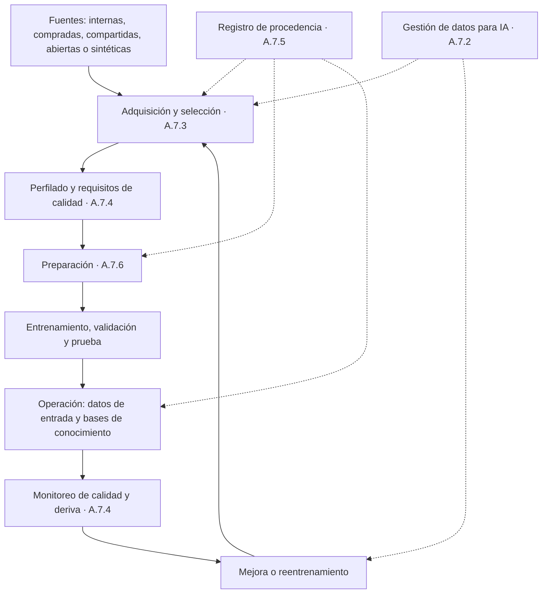

# A.7 · Datos para sistemas de IA

A.7 · Datos
:material-view-grid-outline: 5 controles
:material-clock-outline: 31 min de lectura

**El objetivo, en palabras simples:** entender qué papel juegan los datos en lo que hace cada sistema de IA y tenerlos bajo control en todo su recorrido: de dónde salen, con qué derecho se usan, qué tan buenos son, qué se les hizo antes de usarlos y cómo cambian con el tiempo.

**Lo que está en juego:** un modelo aprende lo que le enseñan sus datos, defectos incluidos. Datos sesgados, incompletos, mal etiquetados u obtenidos sin derecho producen decisiones injustas, errores en producción, sanciones por datos personales y conflictos por derechos de autor. Y sin registro de procedencia, nadie puede explicar después por qué el sistema se comportó como lo hizo.

!!! abstract "En una frase"
    A.7 pide tratar los datos de IA como un insumo crítico con ficha técnica: reglas para gestionarlos, registro de cómo se obtuvieron, requisitos de calidad medibles, trazabilidad de su origen y transformaciones, y criterios documentados para prepararlos.

## Por qué importa este objetivo

Piensa en un restaurante serio. El chef sabe de qué proveedor vino cada ingrediente, cuándo llegó, cómo se almacenó y qué se le hizo antes de llegar al plato. Si un comensal se intoxica, puede rastrear el lote en minutos. En la IA, los datos son los ingredientes y el modelo es la receta: con ingredientes en mal estado, la mejor receta del mundo produce un plato peligroso.

En el software tradicional, el comportamiento está escrito en el código y se puede leer. En los sistemas de aprendizaje automático (*machine learning*), el comportamiento **emerge de los datos**: los datos son, en la práctica, una especificación implícita que nadie escribió línea por línea. Por eso los riesgos de datos en IA van mucho más allá de la confidencialidad:

- **Sesgo histórico:** si las decisiones del pasado fueron injustas, el modelo aprende a repetirlas.
- **Falta de representatividad:** un modelo entrenado con clientes del centro del país puede fallar con los del sureste.
- **Deriva** (*drift*): los datos de hoy dejan de parecerse a los de entrenamiento y el modelo pierde precisión sin avisar.
- **Envenenamiento de datos** (*data poisoning*): alguien manipula los datos de entrenamiento o la base de conocimiento para alterar el comportamiento.
- **Derechos:** datos personales sin una base adecuada, contenidos protegidos por derechos de autor, licencias que prohíben el uso comercial.
- **Explicabilidad:** sin saber qué datos intervinieron, es imposible explicar un resultado a la persona afectada.

**Cómo encaja con el resto del SGIA.** [A.4.3](a4-recursos.md#a-4-3) pide *inventariar* los recursos de datos; A.7 pide *gestionarlos*. Los datos alimentan la evaluación de impacto ([A.5](a5-evaluacion-de-impacto.md)), las pruebas ([A.6.2.4](a6-ciclo-de-vida.md#a-6-2-4)) y el monitoreo en producción ([A.6.2.6](a6-ciclo-de-vida.md#a-6-2-6)), y sus riesgos se analizan en [6.1.2](../clausulas/c6-planificacion.md#c-6-1-2). El Anexo C, además, sugiere como posible objetivo de IA contar con datos suficientes y de buena calidad para entrenar y probar los sistemas.

**Frente a ISO 27001.** Los cinco controles son nuevos. Tu SGSI protege la confidencialidad, integridad y disponibilidad de los datos, pero nunca te preguntó si un conjunto de datos *representa* a la población donde se usará o si es *adecuado para un propósito*. Lo que sí reutilizas: clasificación de la información, control de acceso, enmascaramiento, protección de datos personales y gestión de la información de prueba.

**Cómo cambia según tu rol.** Si **desarrollas** IA, como Monarca Crédito, A.7 completo es el corazón técnico de tu SGIA. Si **provees** IA, como Conversa Labs, se aplica a tus propios datos y a la forma en que tratas los datos que te confían tus clientes. Si **usas** IA de terceros, como Contadores Alameda, A.7 aplica a medias: lo explicamos [más abajo](#si-usas-ia-de-terceros-a7-aplica-a-medias).

## Los controles de un vistazo

| Control | Qué pide, en una línea | Aplica a | Esfuerzo | Frente a ISO 27001 |
|---|---|---|---|---|
| [A.7.2 Datos para desarrollo y mejora](#a-7-2) | Tener procesos de gestión de datos para construir y mejorar sistemas de IA | Desarrolla · Provee | Alto | Nuevo |
| [A.7.3 Adquisición de datos](#a-7-3) | Documentar de dónde salen los datos, por qué se eligieron y con qué derecho se usan | Desarrolla · Provee | Medio | Nuevo |
| [A.7.4 Calidad de los datos](#a-7-4) | Fijar requisitos de calidad medibles y comprobar que los datos los cumplen | Usa · Desarrolla · Provee | Alto | Nuevo |
| [A.7.5 Procedencia de los datos](#a-7-5) | Registrar el origen, las transformaciones y las transferencias de los datos | Desarrolla · Provee | Medio | Nuevo |
| [A.7.6 Preparación de los datos](#a-7-6) | Elegir con criterio y documentar cómo se limpian y transforman | Desarrolla · Provee | Medio | Nuevo |

!!! note "Sobre los nombres de los controles"
    Son traducciones libres de referencia del autor; la redacción oficial puede variar.

## El recorrido de los datos

Los cinco controles siguen el viaje de los datos. A.7.2 es el marco que lo gobierna todo; A.7.5 acompaña cada etapa, porque la procedencia se registra mientras existan los datos y mientras opere el sistema.

## Si usas IA de terceros: A.7 aplica a medias {#si-usas-ia-de-terceros-a7-aplica-a-medias}

Cuando no entrenas modelos, la mayor parte de A.7 se refiere a datos que no controlas: los que usó el proveedor para entrenar su modelo. Esos los supervisas mediante [A.10.3](a10-terceros.md#a-10-3) (cuestionarios, cláusulas contractuales) y con la documentación que el proveedor te entrega. Pero los datos siguen pasando por tus manos en al menos cuatro lugares:

1. **Datos de entrada en producción:** las facturas que lee tu módulo de captura, los documentos que resume tu asistente, lo que tus colaboradores escriben en las instrucciones (*prompts*).
2. **Bases de conocimiento para generación aumentada por recuperación (RAG)** que tú escribes o curas, como la FAQ que alimenta a Alma, el chatbot de Contadores Alameda.
3. **Datos de configuración o de ajuste fino** (*fine-tuning*), si el proveedor te permite personalizar el modelo.
4. **Conjuntos de prueba** que armas para comprobar que el sistema del proveedor funciona en tu contexto.

Sobre esos datos, A.7.4 aplica de lleno (por eso es el único control de A.7 que marcamos para quien usa IA de terceros) y partes de A.7.3 y A.7.5 suelen aplicar también.

| Control | ¿Aplica si usas IA de terceros? | Qué cubrir | Ejemplo: Contadores Alameda |
|---|---|---|---|
| A.7.2 | Normalmente no; parcial si ajustas el modelo o construyes una base de conocimiento | Reglas sobre qué datos puedes cargar al sistema | La FAQ de Alma solo contiene información general del despacho, nunca datos de clientes |
| A.7.3 | Parcial | Fuentes de lo que cargas y derecho a usarlo | La FAQ se redacta a partir del calendario fiscal oficial y de criterios internos |
| A.7.4 | Sí | Calidad de la base de conocimiento y de las entradas | FAQ revisada cada mes; CFDI en XML de preferencia sobre PDF escaneado |
| A.7.5 | Parcial | Historial de versiones de lo que cargas | Cada respuesta de la FAQ tiene responsable, fuente y fecha de revisión |
| A.7.6 | Normalmente no, si el proveedor hace la ingesta | Solo si tú transformas datos antes de cargarlos | BotNorte segmenta e indexa la FAQ; el despacho no prepara datos |

**Cómo justificar exclusiones parciales.** La cláusula 6.1.3 pide justificar en la Declaración de Aplicabilidad (SoA) por qué incluyes o excluyes cada control; una exclusión se sostiene si tu evaluación de riesgos no requiere el control y ningún requisito externo lo exige. En nuestra lectura, cuando *alguna parte* del control aplica, es más sólido marcarlo como **aplicable con alcance acotado** que excluirlo, porque una exclusión tiene que ser cierta para todo el control.

!!! example "Ejemplo de redacción en la SoA de Contadores Alameda"
    **A.7.2 · Excluido.** El despacho no desarrolla, entrena ni ajusta modelos de IA; los tres sistemas en alcance son servicios de terceros. La gestión de sus datos de entrenamiento corresponde a los proveedores y se supervisa mediante A.10.3. Se reevaluará si se decide ajustar un modelo.

    **A.7.4 · Aplicable.** Requisitos de calidad para la base de conocimiento de Alma (vigencia, fuente, revisión mensual) y para los CFDI que procesa IA-03 (formato, legibilidad, muestreo de exactitud).

    **A.7.5 · Aplicable con alcance acotado.** Solo a la base de conocimiento de Alma: control de versiones, responsable y fuente de cada respuesta.

## A.7.2 Datos para desarrollo y mejora {#a-7-2 .dx-control .obj-a7}

:material-code-braces: Desarrolla IA
:material-handshake-outline: Provee IA a clientes
:material-gauge-full: Esfuerzo alto
:material-star-four-points-outline: Nuevo frente a 27001

**Propósito.** Que el uso de datos para construir y mejorar sistemas de IA siga reglas definidas y no la improvisación de cada proyecto: qué datos se pueden usar, para qué, con qué protecciones y con qué comprobaciones de representatividad y exactitud.

**En la práctica.** Este control es el marco de los otros cuatro. Pide un **proceso de gestión de datos** definido, documentado y, sobre todo, aplicado. En una organización mediana suele ser un procedimiento que cubre la solicitud y aprobación de datos para un proyecto, su clasificación, quién accede, en qué entorno se trabaja, cuánto tiempo se conservan y cómo se eliminan. Lo que lo distingue de un procedimiento de seguridad de la información son los temas propios de la IA que conviene que atienda (la guía del Anexo B los sugiere, no los impone):

- **Privacidad y seguridad**, porque los conjuntos de entrenamiento suelen concentrar datos sensibles en un solo lugar.
- **Amenazas que existen precisamente porque el sistema depende de datos:** envenenamiento, inferencia de pertenencia (*membership inference*: averiguar si una persona estaba en los datos de entrenamiento), inversión del modelo o extracción de datos memorizados.
- **Transparencia y explicabilidad:** poder decir qué datos intervinieron y cómo influyen en un resultado, cuando el sistema lo requiere.
- **Representatividad:** que los datos de entrenamiento se parezcan a la población y a las condiciones donde el sistema va a operar.
- **Exactitud e integridad:** que los datos sean correctos y no se alteren sin control.

**Representatividad, en concreto.** Supón que el 70 % de los clientes históricos de Monarca Crédito vive en la Ciudad de México, el Estado de México, Jalisco y Nuevo León, y que la empresa está creciendo en Chiapas, Oaxaca y Guerrero. Score Monarca v3 aprendió muy poco de esos estados; su desempeño ahí es una incógnita. El proceso de Monarca exige comparar la distribución por entidad federativa de los datos de entrenamiento con la de los solicitantes actuales, medir el desempeño por entidad y decidir: reponderar, recolectar más datos o enviar a la banda gris de revisión humana las solicitudes de las entidades poco representadas hasta tener evidencia suficiente.

**Privacidad y consentimiento.** Monarca usa datos de comportamiento en la app con consentimiento. Su procedimiento verifica, antes de cada entrenamiento, que la finalidad "desarrollo y mejora de modelos de riesgo" esté cubierta por el aviso de privacidad y que los consentimientos sigan vigentes. La nueva LFPDPPP pide consentimiento expreso para datos financieros o patrimoniales y reconoce el derecho de oposición frente a tratamientos automatizados que afecten significativamente a la persona sin intervención humana; el detalle está en [Contexto México y Latinoamérica](../integracion/contexto-mexico-latam.md). En los entornos de desarrollo se trabaja con datos seudonimizados, nunca con la base de producción completa.

**Mejora con datos de producción.** Aquí está una de las decisiones más delicadas, sobre todo para quien provee IA. Conversa Labs se comprometió por contrato a **no entrenar modelos con datos de sus clientes**. Su procedimiento lo vuelve operativo: las conversaciones no alimentan ningún ajuste de modelos, y si el equipo quiere usar conversaciones para construir conjuntos de evaluación, necesita autorización expresa del cliente y anonimización previa. Además, como los clientes cargan sus propios documentos a la base de conocimiento, Conversa trata esos documentos como una superficie de ataque: un documento manipulado puede contener instrucciones ocultas (inyección indirecta de instrucciones) o información falsa.

**Qué NO exige.** No exige un lago de datos ni una plataforma de gobierno de datos, ni prohíbe usar datos personales: exige gestionarlos con reglas claras. Tampoco pide que los datos sean perfectos, sino que conozcas y controles sus limitaciones.

!!! success "Implementación mínima viable"
    - Procedimiento de gestión de datos para IA (puede ser un anexo del [procedimiento del ciclo de vida](../plantillas/index.md#procedimiento-ciclo-de-vida)).
    - Solicitud y aprobación de datos por proyecto: finalidad, base legal, clasificación y responsable.
    - Entornos de desarrollo separados y con datos seudonimizados.
    - Análisis de representatividad documentado antes de liberar cada modelo.
    - Controles de integridad de los conjuntos (sumas de verificación, accesos restringidos).
    - Regla explícita sobre el uso de datos de producción o de clientes para mejorar el sistema.

!!! tip "Implementación madura"
    - Catálogo de datos con clasificación y etiquetas de uso permitido por conjunto.
    - Pruebas automáticas de representatividad y deriva en el flujo de MLOps.
    - Modelado de amenazas de datos y pruebas adversarias (envenenamiento, extracción).
    - Técnicas de mejora de la privacidad: datos sintéticos validados, privacidad diferencial cuando proceda.
    - Hojas de datos (*datasheets*) por conjunto, enlazadas desde la [ficha del sistema](../plantillas/index.md#ficha-del-sistema).

=== ":material-folder-check-outline: Evidencia típica"

    - Procedimiento de gestión de datos para IA aprobado.
    - Solicitudes y aprobaciones de uso de datos por proyecto.
    - Análisis de representatividad con resultados por segmento.
    - Registros de acceso a los conjuntos de entrenamiento.
    - Evidencia de seudonimización en entornos de desarrollo.
    - Cláusulas contractuales sobre el uso de datos de clientes (si provees IA).

=== ":material-account-search-outline: Preguntas del auditor"

    1. ¿Qué reglas siguen para decidir qué datos se pueden usar para entrenar o mejorar un modelo? Muéstreme una aprobación reciente.
    2. ¿Cómo comprobaron que los datos de entrenamiento representan a la población donde opera el sistema?
    3. ¿Qué amenazas específicas de datos consideraron y qué controles tienen frente a ellas?
    4. ¿Los datos personales usados para entrenar están cubiertos por el aviso de privacidad y el consentimiento?
    5. ¿Usan datos de producción o de clientes para mejorar los modelos? ¿Bajo qué reglas?
    6. ¿Podrían explicar qué datos influyen más en una decisión concreta?

=== ":material-alert-outline: Errores comunes"

    - Tratar la gestión de datos para IA como tema exclusivo de TI o de privacidad.
    - Copiar la base de producción completa al equipo del científico de datos.
    - Medir la representatividad solo en el total, nunca por segmento.
    - Reentrenar con datos de producción o de clientes sin revisar el contrato ni el aviso de privacidad.
    - Descartar el envenenamiento de datos porque "los datos son internos".

=== ":material-scale-balance: ¿Se puede excluir?"

    **Podría justificarse si…** la organización no desarrolla, entrena, ajusta ni mejora sistemas de IA, y tampoco construye bases de conocimiento que cambien su comportamiento. Redacción sugerida: *"Excluido. No se desarrollan, entrenan ni ajustan modelos; los datos de entrenamiento de los sistemas de terceros se supervisan mediante A.10.3."*

    **No se justifica si…** entrenas, reentrenas o ajustas modelos, aunque sea con datos internos, o si provees IA a clientes.

**Relaciones.** Cláusulas: [6.1.2](../clausulas/c6-planificacion.md#c-6-1-2), [8.1](../clausulas/c8-operacion.md#c-8-1) · Controles: [A.4.3](a4-recursos.md#a-4-3), [A.7.3](#a-7-3), [A.7.4](#a-7-4), [A.6.2.3](a6-ciclo-de-vida.md#a-6-2-3), [A.6.2.4](a6-ciclo-de-vida.md#a-6-2-4), [A.10.4](a10-terceros.md#a-10-4) · ISO 27001 A.5.12 (clasificación), ISO 27001 A.5.34 (datos personales), ISO 27001 A.8.11 (enmascaramiento) e ISO 27001 A.8.33 (información de prueba): se reutilizan; lo nuevo es la representatividad y las amenazas propias de la IA · Normas: ISO/IEC 22989, ISO/IEC 27701 · **Anexo B:** la guía B.7.2 enumera los temas que la gestión de datos para IA puede abarcar, desde la privacidad y la seguridad hasta la representatividad y la exactitud, y remite a ISO/IEC 22989 para los conceptos de ciclo de vida y gestión de datos.

## A.7.3 Adquisición de datos {#a-7-3 .dx-control .obj-a7}

:material-code-braces: Desarrolla IA
:material-handshake-outline: Provee IA a clientes
:material-gauge: Esfuerzo medio
:material-star-four-points-outline: Nuevo frente a 27001

**Propósito.** Saber, y poder demostrar, cómo llegaron los datos a tus manos y por qué se eligieron: qué se necesitaba, de dónde salió, con qué derecho se usa y qué defectos se conocían desde el principio.

**En la práctica.** Te recomendamos una **ficha de adquisición** por conjunto de datos. No tiene que ser larga; tiene que responder siete preguntas:

| Pregunta | Qué documentar | Ejemplo: Score Monarca v3 |
|---|---|---|
| ¿Para qué y cuánto? | Categorías de datos necesarias y volumen requerido, con su justificación | Solicitudes de 36 meses con su resultado de pago a 12 meses |
| ¿De dónde viene? | Tipo de fuente: interna, comprada, compartida por un socio, abierta o sintética | Interna (solicitudes y transacciones), consulta a buró con autorización, indicadores públicos por municipio |
| ¿Cómo se genera? | Si es estática o llega en flujo continuo, si la capturan personas o la generan máquinas | Uso de la app: flujo continuo generado por el dispositivo |
| ¿Qué historia trae? | Usos anteriores y si se trató conforme a requisitos de privacidad y seguridad | Datos de cobranza recabados para gestionar la cartera |
| ¿Quiénes están representados? | Rasgos demográficos y sesgos o errores sistemáticos conocidos o sospechados | Pocas mujeres con micronegocio rural; solo hay resultado de pago de quienes fueron aprobados |
| ¿Con qué derecho? | Base legal y consentimiento para datos personales, licencias, derechos de autor, contratos | Autorización de consulta a buró; consentimiento para datos de la app |
| ¿Qué la acompaña? | Metadatos, diccionario, reglas de etiquetado y enlace al registro de procedencia | Diccionario de variables v3; definición de incumplimiento |

Fíjate en el quinto renglón. El historial de Monarca solo tiene resultado de pago de quienes **fueron aprobados** por la política anterior; de los rechazados no se sabe si habrían pagado. Ese sesgo de selección es invisible si nadie lo documenta al adquirir los datos, y explica por qué un modelo puede perpetuar los criterios de la política que lo precedió.

**Variables sustitutas.** Elegir datos también es elegir riesgos. Score Monarca v3 no usa el sexo ni la edad como variables de entrada, pero el código postal puede funcionar como sustituto de nivel de ingreso, origen étnico o región. La ficha de adquisición de Monarca documenta la decisión del Comité de Modelos: ni el código postal ni la entidad federativa son variables de entrada del modelo; la entidad se usa para monitorear la equidad y la representatividad. Lo importante no es que tu decisión coincida con la de Monarca, sino que exista, esté razonada y quede escrita.

**Derechos sobre los datos.** Tres frentes suelen dar sorpresas:

- **Datos personales:** que la finalidad de entrenar modelos esté cubierta por el aviso de privacidad y, cuando corresponda, por el consentimiento. Si compras datos, verifica que el proveedor tenía derecho a transferirlos.
- **Derechos de autor y términos de uso:** que un texto o una imagen esté publicado en internet no significa que puedas usarlo para entrenar; muchos sitios prohíben la extracción automatizada en sus términos.
- **Licencias de datos abiertos:** algunas prohíben el uso comercial o exigen atribución.

Los **datos sintéticos** merecen su propia línea en la ficha: heredan los sesgos del generador y de los datos que lo alimentaron, así que conviene documentar cómo se generaron y cómo se validaron.

Un ejemplo distinto: una universidad en Perú que quería predecir la deserción estudiantil evaluó comprar a un proveedor un "índice socioeconómico" por estudiante. Al llenar la ficha, nadie pudo responder de dónde obtenía el proveedor sus datos ni con qué consentimiento. La universidad descartó la compra; la ficha cumplió su función antes de que existiera el problema.

**Si provees IA.** Conversa Labs documenta qué recibe de cada cliente para la base de conocimiento (tipo de documentos, si contienen datos personales, quién es el titular de los derechos) y qué datos genera por su cuenta (conversaciones sintéticas para pruebas). El contrato deja claro que el cliente garantiza su derecho a usar los documentos que carga. **Qué NO exige:** no prohíbe datos abiertos, comprados ni sintéticos; exige saber qué son y de dónde vienen. ISO/IEC 19944-1 ofrece una estructura útil para categorizar datos y sus usos.

!!! success "Implementación mínima viable"
    - Registro de fuentes de datos por sistema (una hoja de cálculo basta).
    - Ficha de adquisición por conjunto con las siete preguntas.
    - Verificación de derechos (base legal, licencia o contrato) antes del primer uso.
    - Lista de sesgos conocidos o sospechados por fuente.
    - Aprobación de la selección por el dueño del modelo.

!!! tip "Implementación madura"
    - Catálogo de datos con fichas y licencias legibles por máquina.
    - Debida diligencia de proveedores de datos: cuestionario, cláusulas de origen lícito y derecho de auditoría.
    - Revisión legal estandarizada para datos obtenidos de internet.
    - Categorización de datos y usos con ISO/IEC 19944-1.
    - Alertas cuando una licencia vence o cambia de condiciones.

=== ":material-folder-check-outline: Evidencia típica"

    - Registro de fuentes de datos por sistema.
    - Contratos y licencias de datos.
    - Aviso de privacidad y evidencia de consentimiento, cuando aplica.
    - Fichas de adquisición con sesgos conocidos.
    - Análisis y decisión documentada sobre variables sustitutas.
    - Expedientes de debida diligencia de proveedores de datos.

=== ":material-account-search-outline: Preguntas del auditor"

    1. ¿De dónde provienen los datos con los que se entrenó este modelo? Muéstreme el registro.
    2. ¿Con qué derecho usan cada fuente? Muéstreme la licencia, el contrato o la base legal.
    3. ¿Por qué eligieron esta cantidad y este periodo de datos?
    4. ¿Qué sesgos conocían de estas fuentes al adquirirlas y qué hicieron al respecto?
    5. ¿Cómo comprueban que un proveedor de datos los obtuvo de forma lícita?
    6. ¿Usan datos sintéticos? ¿Cómo se generaron y validaron?

=== ":material-alert-outline: Errores comunes"

    - Que la única documentación sea "los datos los pasó el área de negocio".
    - Asumir que todo lo publicado en internet es libre de usar.
    - No documentar el sesgo de selección de los datos históricos.
    - Comprar bases de datos sin verificar su origen.
    - Olvidar que los datos sintéticos heredan los sesgos de su generador.

=== ":material-scale-balance: ¿Se puede excluir?"

    **Podría justificarse si…** no adquieres ni seleccionas datos para desarrollar o mejorar sistemas de IA, porque solo usas servicios de terceros. Si cargas una base de conocimiento, considera aplicarlo con alcance acotado. Redacción sugerida para exclusión total: *"Excluido. No se adquieren datos para desarrollar o ajustar sistemas de IA; la información cargada a los servicios de terceros se rige por A.7.4 y por la política de uso aceptable."*

    **No se justifica si…** entrenas o ajustas modelos, aunque sea solo con datos internos: "interno" también es una fuente que se documenta.

**Relaciones.** Cláusulas: [4.1](../clausulas/c4-contexto.md#c-4-1), [6.1.2](../clausulas/c6-planificacion.md#c-6-1-2) · Controles: [A.4.3](a4-recursos.md#a-4-3), [A.7.2](#a-7-2), [A.7.4](#a-7-4), [A.7.5](#a-7-5), [A.10.3](a10-terceros.md#a-10-3) · ISO 27001 A.5.19 (proveedores), ISO 27001 A.5.32 (derechos de propiedad intelectual) e ISO 27001 A.5.34 (datos personales): se reutilizan para la verificación de derechos; lo nuevo es documentar sesgos, representatividad e historia de cada fuente · Normas: ISO/IEC 19944-1 · **Anexo B:** la guía B.7.3 propone un conjunto amplio de detalles de adquisición que conviene documentar, desde el tipo de fuente hasta los derechos y los sesgos conocidos, y sugiere ISO/IEC 19944-1 como estructura para describir datos y usos.

## A.7.4 Calidad de los datos {#a-7-4 .dx-control .obj-a7}

:material-cloud-download-outline: Usa IA de terceros
:material-code-braces: Desarrolla IA
:material-handshake-outline: Provee IA a clientes
:material-gauge-full: Esfuerzo alto
:material-star-four-points-outline: Nuevo frente a 27001

**Propósito.** Que "datos buenos" deje de ser una opinión: definir por escrito qué calidad necesita cada conjunto para su propósito y comprobar con mediciones que la cumple, tanto al desarrollar el sistema como al operarlo.

**En la práctica.** La calidad de datos no es absoluta: un conjunto puede ser excelente para un propósito e inútil para otro. Las normas de calidad de datos la entienden como el grado en que los datos satisfacen las necesidades de quien los usa en un contexto concreto. Por eso el control pide **requisitos por conjunto** (entrenamiento, validación, prueba y producción), expresados en métricas con umbrales:

| Dimensión | Métrica posible | Umbral: Score Monarca v3 | Umbral: FAQ de Alma |
|---|---|---|---|
| Completitud | Porcentaje de valores faltantes por variable | ≤ 5 % en variables obligatorias | Toda respuesta tiene fuente y fecha de revisión |
| Exactitud | Coincidencia con una fuente de verdad, por muestreo | ≥ 98 % en ingreso declarado contra comprobantes | 100 % de plazos coinciden con el calendario oficial |
| Actualidad | Antigüedad del dato | Datos de buró con menos de 30 días | Revisión mensual; semanal en temporada de declaración anual |
| Consistencia y unicidad | Registros contradictorios o duplicados | 0 duplicados por solicitud | Sin respuestas contradictorias entre sí |
| Representatividad | Distribución por segmento frente a la población objetivo | Cada entidad con al menos 2 000 casos o se marca como poco representada | Cubre las 30 preguntas más frecuentes del último trimestre |
| Calidad de etiquetas | Acuerdo entre etiquetadores | Definición única de incumplimiento aplicada al 100 % | No aplica |

**Sesgo y equidad.** Un conjunto de datos no es de calidad si su sesgo hace que el sistema funcione peor o trate peor a un grupo. Monarca mide, por sexo, rango de edad y entidad federativa, la tasa de aprobación, la tasa de falsos rechazos (personas que habrían pagado y fueron rechazadas) y la calibración del puntaje. Como referencia usa la regla de los cuatro quintos, de origen estadounidense (la tasa de aprobación de un grupo no debería ser menor al 80 % de la del grupo más favorecido), y cuando un segmento no la cumple, el Comité de Modelos decide si ajustar los datos, el modelo o los umbrales, y documenta por qué el resultado final es aceptable para el caso de uso. ISO/IEC TR 24027 describe las distintas formas de sesgo en sistemas de IA y es una buena lectura para el equipo.

**Calidad en operación.** El control no termina al entrenar. Los datos que entran al sistema en producción también deben cumplir requisitos. Monarca vigila, con alertas, cambios bruscos en los valores faltantes (por ejemplo, tras una actualización de la app que dejó de capturar un campo) o en el formato de la respuesta del buró. Conversa Labs define requisitos mínimos para las bases de conocimiento de sus clientes (formatos admitidos, vigencia, sin duplicados) y entrega un diagnóstico antes de salir a producción; la responsabilidad queda repartida: el cliente responde por la exactitud del contenido y Conversa por la calidad de la ingesta.

**Si usas IA de terceros, esto sí te toca.** Contadores Alameda no entrena ningún modelo, pero la calidad de las respuestas de Alma depende por completo de la FAQ que el despacho escribe. Una FAQ con un plazo vencido produce respuestas equivocadas, por buena que sea la tecnología de BotNorte. Lo mismo con IA-03: un CFDI fotografiado con mala luz da extracciones erróneas. El despacho fijó requisitos (cada respuesta con responsable, fuente y fecha; preferencia por el XML del CFDI; muestreo mensual de 2 % de extracciones contra el XML) y los revisa.

**Qué NO exige.** No exige datos perfectos, ni una herramienta de calidad de datos, ni métricas concretas. Exige requisitos definidos y documentados, y evidencia de que se cumplen o de qué se hace cuando no. La serie ISO/IEC 5259, dedicada a la calidad de datos para analítica y aprendizaje automático, es la referencia si quieres profundizar.

!!! success "Implementación mínima viable"
    - Requisitos de calidad documentados por conjunto, con métricas y umbrales.
    - Reporte de perfilado antes de cada entrenamiento o actualización de la base de conocimiento.
    - Métricas de sesgo por los segmentos relevantes, con umbral de aceptación aprobado.
    - Un responsable de calidad por conjunto.
    - Regla de qué pasa si no se cumple un umbral: no liberar, escalar o aceptar la excepción por escrito.

!!! tip "Implementación madura"
    - Validaciones automáticas de esquema y de expectativas en el flujo de datos.
    - Monitoreo continuo de los datos de producción, con alertas.
    - Tablero de calidad por conjunto con tendencias.
    - Auditorías periódicas del etiquetado.
    - Adopción de la serie ISO/IEC 5259 como marco de referencia.

=== ":material-folder-check-outline: Evidencia típica"

    - Documento de requisitos de calidad por conjunto.
    - Reportes de perfilado.
    - Resultados de pruebas de sesgo por segmento.
    - Registro de excepciones aprobadas.
    - Alertas y tickets de calidad de datos en producción.
    - Si usas IA de terceros: bitácora de revisión de la base de conocimiento y muestreos de exactitud.

=== ":material-account-search-outline: Preguntas del auditor"

    1. ¿Qué requisitos de calidad definieron para este conjunto y cómo los miden?
    2. Muéstreme el último reporte de perfilado. ¿Qué pasó con lo que no cumplió?
    3. ¿Cómo evalúan el sesgo y qué umbrales consideran aceptables? ¿Quién los aprobó?
    4. ¿Cómo vigilan la calidad de los datos que entran al sistema en producción?
    5. ¿Quién revisa la base de conocimiento y con qué frecuencia?
    6. ¿Qué hacen cuando un conjunto no cumple los requisitos y hay presión por lanzar?

=== ":material-alert-outline: Errores comunes"

    - Definir calidad como "datos limpios", sin métricas ni umbrales.
    - Revisar la calidad al entrenar y nunca en producción.
    - Medir el sesgo solo en el total de la población.
    - Creer que, si usas IA de terceros, la calidad de los datos no es asunto tuyo.
    - Mover el umbral cada vez que no se cumple.

=== ":material-scale-balance: ¿Se puede excluir?"

    **Podría justificarse si…** en nuestra lectura, casi nunca: aplica a los tres roles porque todos alimentan datos al sistema en operación. Si tu único uso es un asistente generalista sin datos propios, conviene aplicarlo con alcance acotado (calidad de los insumos mediante la guía de uso) en lugar de excluirlo.

    **No se justifica si…** el resultado del sistema depende de bases de conocimiento, documentos o datos que tú aportas.

**Relaciones.** Cláusulas: [6.2](../clausulas/c6-planificacion.md#c-6-2), [9.1](../clausulas/c9-evaluacion-del-desempeno.md#c-9-1) · Controles: [A.7.2](#a-7-2), [A.7.6](#a-7-6), [A.5.4](a5-evaluacion-de-impacto.md#a-5-4), [A.6.2.4](a6-ciclo-de-vida.md#a-6-2-4), [A.6.2.6](a6-ciclo-de-vida.md#a-6-2-6) · ISO 27001: sin control equivalente; la integridad de 27001 protege contra cambios no autorizados, pero no dice si un dato es adecuado para un propósito · Normas: serie ISO/IEC 5259, ISO/IEC TR 24027, ISO/IEC 25024 · **Anexo B:** la guía B.7.4 explica por qué la calidad de los datos condiciona la validez de los resultados, pide definirla, medirla y mejorarla en las distintas etapas del aprendizaje automático, tomar en cuenta cómo el sesgo afecta tanto el funcionamiento como el trato justo, y remite a la serie ISO/IEC 5259 y a ISO/IEC TR 24027.

## A.7.5 Procedencia de los datos {#a-7-5 .dx-control .obj-a7}

:material-code-braces: Desarrolla IA
:material-handshake-outline: Provee IA a clientes
:material-gauge: Esfuerzo medio
:material-star-four-points-outline: Nuevo frente a 27001

**Propósito.** Poder reconstruir la historia de cualquier dato que usó el sistema: de dónde vino, quién lo tocó, qué se le hizo y a dónde fue. Sin esa trazabilidad no se puede investigar un incidente, responder a un titular de datos ni repetir un resultado.

**En la práctica.** Conviene distinguir dos conceptos cercanos. La **procedencia** (*provenance*) es la historia del dato: su origen y lo que le ha pasado. El **linaje** (*lineage*) es su recorrido técnico por sistemas y transformaciones. El control pide un proceso para registrar la procedencia durante dos ciclos de vida que no coinciden: el de los datos (un conjunto puede vivir más que un modelo) y el del sistema (un modelo reentrenado usa varias versiones de datos). Los eventos que conviene registrar son:

- cuándo y cómo se **creó** o capturó el dato;
- cada **actualización** o corrección;
- las **transformaciones**: agregaciones, resúmenes, cambios de formato, transcripciones;
- las **validaciones** aplicadas;
- cada vez que el dato **cambia de manos** (se transfiere su control) o se **comparte** sin transferirlo.

**La pregunta que lo justifica todo.** Una persona presenta una queja ante la Condusef por un rechazo de crédito del 3 de marzo. Monarca necesita responder: ¿qué versión de Score Monarca v3 tomó esa decisión, con qué datos se entrenó esa versión y qué datos de la solicitante usó? Si cada versión del modelo está ligada a las versiones exactas de los conjuntos de datos (con un identificador inmutable, como una suma de verificación) y cada decisión queda registrada con la versión del modelo ([A.6.2.8](a6-ciclo-de-vida.md#a-6-2-8)), la respuesta toma minutos. Si no, toma semanas o nunca llega.

**Verificar cuando el riesgo lo amerita.** La guía de la norma pide considerar, según la fuente, el contenido y el contexto de uso, si hacen falta medidas para *verificar* la procedencia y no solo registrarla. Datos de una fuente externa, contenidos sensibles o sistemas de alto impacto justifican más: sumas de verificación al recibir archivos, firmas digitales, constancias contractuales de origen, muestreos contra la fuente. Para datos obtenidos de internet, registra la dirección, la fecha de obtención y los términos de uso vigentes. Para datos sintéticos, la versión del generador y los datos que lo alimentaron.

Un ejemplo distinto: un hospital en Chile entrena un modelo de lectura de radiografías con imágenes de tres hospitales de una misma red. Su registro de procedencia guarda, por imagen, el hospital, el equipo que la tomó y el proceso de anonimización aplicado. Cuando el desempeño cayó en uno de ellos, el registro permitió descubrir en un día que ese hospital había cambiado de equipo y que el modelo nunca había visto imágenes de ese fabricante.

**Si provees IA con RAG.** En Conversa Labs, cada fragmento indexado de la base de conocimiento lleva metadatos de procedencia: cliente, documento de origen, versión y fecha de ingesta. Eso permite tres cosas: citar la fuente en la respuesta, eliminar con certeza todo lo derivado de un documento cuando el cliente lo retira o termina el contrato, y rastrear de qué documento salió una respuesta problemática.

**Qué NO exige.** No exige una herramienta automatizada de linaje ni registrar la historia de cada fila. La granularidad puede ser por conjunto de datos en la mayoría de los casos y por registro solo donde el riesgo lo justifique.

!!! success "Implementación mínima viable"
    - Registro de procedencia por conjunto: origen, fecha, responsable, transformaciones y versiones.
    - Versionado de conjuntos con identificador inmutable.
    - Vínculo entre cada versión del modelo y las versiones de datos que usó.
    - Registro de los datos recibidos de terceros y entregados a terceros.
    - Criterio documentado de cuándo hay que verificar la procedencia.

!!! tip "Implementación madura"
    - Linaje capturado automáticamente por la plataforma de datos.
    - Metadatos de procedencia en cada fragmento de la base de conocimiento.
    - Firmas o sumas de verificación para datos externos y constancias de origen de proveedores.
    - Capacidad de reproducir un entrenamiento completo a partir del registro.
    - Ejercicios periódicos de trazabilidad: elegir una decisión al azar y reconstruir su origen.

=== ":material-folder-check-outline: Evidencia típica"

    - Registros de linaje o de procedencia por conjunto.
    - Repositorio de versiones de conjuntos de datos.
    - Registro de modelos con referencia a las versiones de datos.
    - Bitácora de transferencias de datos con terceros.
    - Constancias de origen entregadas por proveedores de datos.
    - Resultado de un ejercicio de trazabilidad.

=== ":material-account-search-outline: Preguntas del auditor"

    1. Elija una predicción del mes pasado: ¿pueden decirme con qué versión del modelo y de los datos se generó?
    2. ¿Cómo registran las transformaciones que sufren los datos desde su origen?
    3. ¿Qué datos reciben de terceros o entregan a terceros y cómo queda registro?
    4. ¿En qué casos verifican la procedencia de un conjunto y cómo lo hacen?
    5. Si un cliente pide retirar un documento de la base de conocimiento, ¿cómo saben dónde quedó todo lo derivado de él?

=== ":material-alert-outline: Errores comunes"

    - Confundir procedencia con "la base vino de TI".
    - Sobrescribir conjuntos de datos sin versión.
    - Registrar el linaje de los datos de entrenamiento, pero no el de los datos de producción ni el de la base de conocimiento.
    - No poder ligar el modelo en producción con los datos que lo entrenaron.
    - Tener un registro de procedencia que nadie actualiza después de los cambios.

=== ":material-scale-balance: ¿Se puede excluir?"

    **Podría justificarse si…** no desarrollas ni provees IA y no cargas datos propios a los sistemas de terceros. Si mantienes una base de conocimiento, aplícalo con alcance acotado a ella, como en el [ejemplo de Contadores Alameda](#si-usas-ia-de-terceros-a7-aplica-a-medias).

    **No se justifica si…** entrenas, ajustas o provees sistemas de IA, o si tus obligaciones de datos personales te exigen saber dónde están los datos de una persona para atender sus derechos ARCO.

**Relaciones.** Cláusulas: [7.5](../clausulas/c7-apoyo.md#c-7-5), [8.1](../clausulas/c8-operacion.md#c-8-1) · Controles: [A.4.3](a4-recursos.md#a-4-3), [A.7.3](#a-7-3), [A.7.4](#a-7-4), [A.6.2.7](a6-ciclo-de-vida.md#a-6-2-7), [A.6.2.8](a6-ciclo-de-vida.md#a-6-2-8) · ISO 27001 A.5.14 (transferencia de información) e ISO 27001 A.8.15 (registro de eventos): aportan la bitácora de transferencias y de accesos; lo nuevo es la historia y las transformaciones del dato · Normas: ISO 8000-2 · **Anexo B:** la guía B.7.5 se apoya en ISO 8000-2 para describir qué puede contener un registro de procedencia, lo amplía a intercambios y transformaciones de datos, y pide valorar, según la fuente, el contenido y el contexto, si hace falta verificar la procedencia.

## A.7.6 Preparación de los datos {#a-7-6 .dx-control .obj-a7}

:material-code-braces: Desarrolla IA
:material-handshake-outline: Provee IA a clientes
:material-gauge: Esfuerzo medio
:material-star-four-points-outline: Nuevo frente a 27001

**Propósito.** Que las transformaciones que se aplican a los datos antes de entrenar u operar, y que pueden cambiar radicalmente lo que el modelo aprende, se elijan con criterios explícitos y queden documentadas, en lugar de depender del gusto o la costumbre de cada científico de datos.

**En la práctica.** Casi ningún dato llega listo para usarse: hay valores faltantes, errores de captura, escalas muy distintas, categorías que hay que convertir en números. Cada decisión de preparación parece técnica y neutral, pero puede introducir sesgos o errores. El control pide documentar dos cosas: los **criterios** con que eliges los métodos y los **métodos concretos** que aplicaste en cada tarea.

| Técnica | Para qué sirve | Riesgo si se elige sin criterio | Decisión en Score Monarca v3 |
|---|---|---|---|
| Exploración estadística | Conocer distribuciones, medias, medianas, dispersión y estratos antes de tocar nada | Pasar por alto un sesgo que estaba a la vista | Se descubrió que el 18 % de los ingresos declarados faltaba, concentrado en solicitantes con micronegocio |
| Limpieza | Corregir errores, valores imposibles y duplicados | Borrar filas incompletas elimina de forma desproporcionada a un grupo | No se eliminan solicitudes incompletas; se corrigen solo valores imposibles |
| Imputación | Completar valores faltantes | Usar la media general oculta diferencias entre grupos | Mediana por segmento más una variable que indica "dato faltante" |
| Codificación | Convertir categorías en números | Inventar un orden que no existe; colar variables sustitutas | Entidad federativa fuera del modelo (solo para monitoreo); código postal excluido |
| Normalización y escalado | Llevar variables a rangos comparables | Calcular parámetros con datos de prueba (fuga de información) | No se escala para el modelo de árboles, que no lo necesita; sí para el modelo logístico de referencia |
| Etiquetado | Definir la variable objetivo o las categorías | Una definición distinta cambia por completo lo que se aprende | Incumplimiento: 90 días de atraso en los primeros 12 meses, aprobado por el Comité de Modelos |

**Por qué, no solo qué.** La diferencia entre un registro útil y uno decorativo está en la justificación. "Imputamos con la mediana" no dice nada; "imputamos con la mediana por segmento porque los faltantes no son aleatorios (se concentran en micronegocios) y la media general subestimaría su ingreso" sí permite a un auditor, o a tu yo de dentro de un año, entender y cuestionar la decisión. Te recomendamos además una regla contra la **fuga de información** (*data leakage*): toda transformación que aprende parámetros de los datos (medias, escalas, codificaciones) se ajusta solo con el conjunto de entrenamiento.

**Etiquetado con guía.** Cuando las etiquetas las ponen personas, la calidad depende de la guía y de la capacitación. Una cadena de comercio minorista en México que clasifica conversaciones de servicio por intención (queja, devolución, factura, seguimiento de pedido) necesita una guía con definiciones, ejemplos de casos límite y doble revisión de una muestra para medir el acuerdo entre etiquetadores. Sin eso, el modelo aprende las inconsistencias del equipo.

**En sistemas de IA generativa.** Para Conversa Labs, preparar la base de conocimiento de un cliente incluye convertir documentos a texto, segmentarlos en fragmentos (*chunking*), quitar duplicados, añadir metadatos de procedencia y enmascarar datos personales como CURP, RFC o números de póliza antes de indexar. El tamaño de los fragmentos no se eligió por costumbre: se probaron varias opciones contra un conjunto de evaluación y se documentó la que daba respuestas más exactas. Esa configuración queda registrada por cliente.

**Qué NO exige.** No impone técnicas concretas ni prohíbe ninguna. No pide el "mejor" método, sino que la elección esté razonada y escrita, y que lo aplicado se pueda reproducir.

!!! success "Implementación mínima viable"
    - Cuaderno (*notebook*) o guion de preparación versionado por sistema.
    - Registro de cada transformación con su justificación.
    - Regla contra la fuga de información entre entrenamiento y prueba.
    - Guía de etiquetado cuando hay etiquetado manual.
    - Revisión por pares de la preparación antes de entrenar.

!!! tip "Implementación madura"
    - Flujos de preparación como código, reproducibles y con pruebas automatizadas.
    - Almacén de variables (*feature store*) con definiciones y responsables.
    - Análisis del efecto de cada transformación en las métricas de equidad.
    - Medición continua del acuerdo entre etiquetadores.
    - Metadatos estadísticos estandarizados, por ejemplo con la especificación DDI.

=== ":material-folder-check-outline: Evidencia típica"

    - Cuadernos o flujos de preparación versionados.
    - Documento de decisiones de preparación con su justificación.
    - Guía de etiquetado y métricas de acuerdo entre etiquetadores.
    - Reportes de exploración estadística.
    - Registros de revisión por pares.
    - Configuración documentada de la ingesta a la base de conocimiento.

=== ":material-account-search-outline: Preguntas del auditor"

    1. ¿Qué transformaciones aplicaron a los datos de entrenamiento y por qué esas y no otras?
    2. ¿Cómo trataron los valores faltantes? ¿Revisaron si se concentran en algún grupo?
    3. ¿Cómo evitan que información del conjunto de prueba se filtre al entrenamiento?
    4. ¿Quién etiquetó los datos, con qué guía y cómo midieron la calidad del etiquetado?
    5. ¿Podrían reproducir hoy la preparación del modelo que está en producción?
    6. ¿Cómo preparan los documentos antes de indexarlos en la base de conocimiento?

=== ":material-alert-outline: Errores comunes"

    - Documentar qué se hizo, pero no por qué.
    - Eliminar registros incompletos sin revisar a quién se está dejando fuera.
    - Preparar datos a mano en hojas de cálculo imposibles de reproducir.
    - Etiquetar sin guía o con personal sin capacitación.
    - Ajustar transformaciones con todo el conjunto de datos y contaminar la prueba.

=== ":material-scale-balance: ¿Se puede excluir?"

    **Podría justificarse si…** no desarrollas ni provees IA y no transformas datos antes de cargarlos, porque el proveedor hace toda la ingesta. Redacción sugerida: *"Excluido. La organización no prepara datos para sistemas de IA; la segmentación e indexación de la base de conocimiento de IA-02 la realiza el proveedor y se supervisa mediante A.10.3."*

    **No se justifica si…** entrenas o ajustas modelos, o si tú preparas los documentos que alimentan una base de conocimiento.

**Relaciones.** Cláusulas: [8.1](../clausulas/c8-operacion.md#c-8-1) · Controles: [A.7.4](#a-7-4), [A.7.5](#a-7-5), [A.4.4](a4-recursos.md#a-4-4), [A.6.2.3](a6-ciclo-de-vida.md#a-6-2-3), [A.6.2.4](a6-ciclo-de-vida.md#a-6-2-4) · ISO 27001 A.8.11 (enmascaramiento de datos): se reutiliza para proteger datos personales durante la preparación; lo nuevo es justificar cada transformación · Normas: serie ISO/IEC 5259, ISO/IEC 23053 · **Anexo B:** la guía B.7.6 explica por qué los datos suelen necesitar preparación, menciona métodos y transformaciones habituales y pide documentar tanto los criterios de selección como los métodos concretos de cada tarea; remite a ISO/IEC 5259 e ISO/IEC 23053 para profundizar.

## Cómo se ve este objetivo en los casos prácticos

=== "Contadores Alameda"

    El despacho aplica A.7 a medias, y lo dice en su SoA: excluye A.7.2, A.7.3 y A.7.6 porque no desarrolla ni prepara datos, y aplica A.7.4 completo y A.7.5 con alcance acotado. Su trabajo real de datos está en dos lugares. Primero, la **FAQ de Alma**: cada respuesta tiene responsable, fuente (calendario fiscal oficial o criterio interno) y fecha de revisión, y la Coordinadora de cumplimiento la revisa cada mes y cada semana en temporada de declaración anual. Segundo, los **CFDI** que entran a IA-03: se prefiere el XML y se revisa por muestreo la exactitud de lo extraído.

    Lo que los colaboradores escriben en el asistente de ofimática (IA-01) no se gestiona con A.7, sino con la política de uso aceptable y los controles de uso ([A.9](a9-uso.md)). Ver el [caso completo](../casos-practicos/pyme-usa-ia-generativa.md).

=== "Monarca Crédito"

    Para Monarca, A.7 es el corazón técnico del SGIA. Score Monarca v3 tiene ficha de adquisición por fuente (incluido el sesgo de selección del historial), análisis de representatividad por entidad federativa, decisión documentada de excluir el código postal, verificación de que el aviso de privacidad y los consentimientos cubren el entrenamiento de modelos conforme a la nueva LFPDPPP, requisitos de calidad con umbrales, métricas de equidad por sexo, edad y entidad, y un registro que liga cada versión del modelo con sus datos.

    Como los cambios económicos alteran el perfil de los solicitantes, el monitoreo de deriva puede disparar un reentrenamiento, que vuelve a pasar por A.7.3 a A.7.6. El servicio de detección de fraude (IA-03) es de un tercero: sus datos se supervisan mediante [A.10.3](a10-terceros.md#a-10-3). Ver el [caso completo](../casos-practicos/fintech-scoring.md).

=== "Conversa Labs"

    Conversa no entrena modelos con datos de clientes, y su procedimiento de datos lo vuelve verificable. Los datos que gestiona son de tres tipos: las **bases de conocimiento** de cada cliente (con requisitos de calidad, enmascaramiento de datos personales y metadatos de procedencia por fragmento), los **conjuntos de evaluación** propios (conversaciones sintéticas etiquetadas por Customer Success) y los **registros de conversación** (que no alimentan ningún ajuste de modelos y se eliminan según el contrato).

    Los datos con los que se entrenó el modelo fundacional quedan fuera de su control: Conversa los supervisa como cliente de su proveedor mediante [A.10.3](a10-terceros.md#a-10-3) y traslada a sus clientes la información pertinente ([A.8.2](a8-informacion-partes-interesadas.md#a-8-2)). Ver el [caso completo](../casos-practicos/empresa-desarrolla-chatbot.md).

## Plantillas y recursos relacionados

- [Ficha del sistema de IA](../plantillas/index.md#ficha-del-sistema): incluye la sección de datos (fuentes, calidad, procedencia).
- [Procedimiento del ciclo de vida](../plantillas/index.md#procedimiento-ciclo-de-vida): puede alojar el procedimiento de gestión de datos para IA.
- [Declaración de aplicabilidad](../plantillas/index.md#declaracion-de-aplicabilidad): para registrar exclusiones o alcances acotados de A.7.
- [Inventario de sistemas de IA](../plantillas/index.md#inventario-sistemas-ia): punto de partida para el inventario de datos de [A.4.3](a4-recursos.md#a-4-3).
- [A.5 Evaluación de impactos](a5-evaluacion-de-impacto.md): los datos son una de las fuentes principales de impacto.
- [A.6 Ciclo de vida](a6-ciclo-de-vida.md): pruebas, despliegue y monitoreo que usan estos datos.
- [Contexto México y Latinoamérica](../integracion/contexto-mexico-latam.md): datos personales y nueva LFPDPPP.
- [La familia de normas de IA](../fundamentos/familia-de-normas.md): series ISO/IEC 5259 y TR 24027, entre otras.
