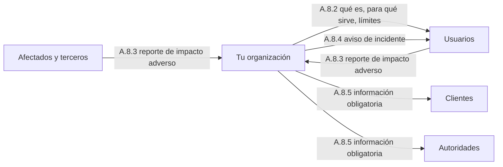
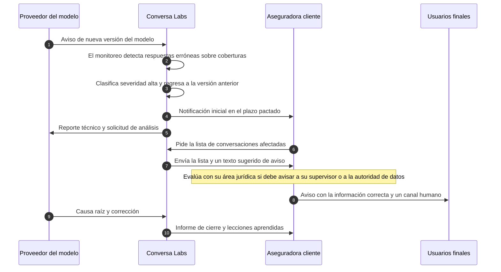

# A.8 · Información para las partes interesadas

A.8 · Información
:material-view-grid-outline: 4 controles
:material-clock-outline: 25 min de lectura

**El objetivo, en palabras simples:** que cada persona u organización que usa tu sistema de IA, lo contrata, lo supervisa o resulta afectada por él tenga la información suficiente para entender los riesgos e impactos que puede traerle, tanto los buenos como los malos.

**Lo que está en juego:** personas que no saben que conversan con una máquina, que no tienen dónde quejarse cuando el sistema las trata mal, que se enteran de un incidente por las redes sociales antes que por ti, y clientes o autoridades que piden documentos que nadie preparó.

!!! abstract "En una frase"
    A.8 convierte la transparencia en procesos concretos: qué le dices a quien usa la IA, cómo te pueden avisar de un daño, cómo avisas tú cuando algo falla y qué estás obligado a reportar, a quién y cuándo.

## Por qué importa este objetivo

Piensa en un medicamento. Trae un instructivo que explica para qué sirve, cómo tomarlo, qué efectos secundarios puede causar y cuándo suspenderlo. Existe un mecanismo para que pacientes y médicos reporten reacciones adversas. Si se descubre un problema en un lote, el laboratorio emite una alerta y retira el producto. Y la autoridad sanitaria recibe expedientes y reportes periódicos. Nadie consideraría responsable a un laboratorio que tuviera solo una de esas cuatro piezas.

A.8 pide lo mismo para los sistemas de IA, y sus cuatro controles se corresponden casi uno a uno con la analogía:

- **A.8.2** es el instructivo y la etiqueta: lo que el usuario necesita saber para usar bien el sistema, empezando por saber que es una IA.
- **A.8.3** es el buzón de reacciones adversas: un medio para que usuarios y terceros te avisen de impactos negativos.
- **A.8.4** es la alerta y el retiro del lote: un plan para comunicar incidentes a quienes resultan afectados.
- **A.8.5** es el expediente ante la autoridad: saber qué información debes entregar, a quién y en qué momento.

Los riesgos que aborda este objetivo son muy propios de la IA. El primero es la **opacidad**: un sistema puede equivocarse con un tono de total seguridad, y si el usuario no conoce sus límites confiará de más. El segundo es el sesgo de automatización (*automation bias*), la tendencia a aceptar lo que dice la máquina, que crece cuando la gente no sabe que puede (y conviene) cuestionar el resultado. El tercero es que muchos daños de la IA **solo los percibe quien los sufre**: un solicitante rechazado una y otra vez, una persona a la que el chatbot no entiende por su forma de escribir. Sin un canal externo, esos daños nunca llegan a tu evaluación de riesgos. Y el cuarto es el **costo de improvisar**: avisar tarde, a medias o con jerga técnica cuando ocurre un incidente destruye la confianza más rápido que el incidente mismo.

**Relación con las cláusulas.** A.8 aterriza varias exigencias del cuerpo de la norma. La cláusula [4.2](../clausulas/c4-contexto.md#c-4-2) te pide identificar a las partes interesadas y sus requisitos; A.8 decide qué información reciben. La [7.4](../clausulas/c7-apoyo.md#c-7-4) pide planificar la comunicación (qué, cuándo, con quién, cómo); A.8 la especializa para usuarios, afectados y autoridades. La [6.1.4](../clausulas/c6-planificacion.md#c-6-1-4) prevé que las conclusiones de tu evaluación de impacto (*AI system impact assessment*) puedan compartirse con partes interesadas cuando corresponda; A.8.2 y A.8.5 dicen cómo. Y lo que entra por A.8.3 alimenta el seguimiento de [9.1](../clausulas/c9-evaluacion-del-desempeno.md#c-9-1) y las acciones correctivas de [10.2](../clausulas/c10-mejora.md#c-10-2).

**Cómo cambia según tu rol.** Los cuatro controles aplican a los tres roles, pero el énfasis se mueve:

- **Si usas IA de terceros** (como Contadores Alameda con su chatbot Alma), tú das la cara ante tus clientes: dependes de la documentación de tu proveedor, pero traducirla a lenguaje claro y avisar al usuario final te corresponde a ti.
- **Si desarrollas IA** (como Monarca Crédito con su modelo de *score*), produces la información desde cero y tienes dos públicos: quienes operan el sistema (los analistas) y las personas sobre las que decide (los solicitantes).
- **Si provees IA a clientes** (como Conversa Labs), informas a tu cliente para que él, a su vez, informe a sus usuarios finales. Tu documentación se vuelve insumo del cumplimiento de otros, y por eso A.8 se cruza con [A.10.4](a10-terceros.md#a-10-4).

!!! info "Diferencias con ISO 27001"
    El Anexo A de ISO 27001 no tiene un tema equivalente. Hay piezas reutilizables: la gestión de incidentes (ISO 27001 A.5.24 a A.5.26), el contacto con autoridades (ISO 27001 A.5.5), la identificación de requisitos legales (ISO 27001 A.5.31) y el reporte de eventos por el personal (ISO 27001 A.6.8). Pero todas miran hacia dentro o hacia la seguridad de la información. A.8 mira hacia las personas que usan o sufren la IA y agrega temas que un SGSI no cubre: avisar que hay una IA, explicar sus límites, recibir reportes de trato injusto y comunicar incidentes que no son brechas de datos.

## Los controles de un vistazo

| Control | Qué pide, en una línea | Aplica a | Esfuerzo | Frente a ISO 27001 |
|---|---|---|---|---|
| [A.8.2 Documentación del sistema e información para usuarios](#a-8-2) | Decidir con criterios qué necesita saber cada tipo de usuario y dárselo de forma accesible y vigente | Usa · Desarrolla · Provee | Medio | Nuevo |
| [A.8.3 Reporte externo](#a-8-3) | Un canal para que usuarios y terceros reporten impactos adversos, con seguimiento | Usa · Desarrolla · Provee | Bajo | Nuevo (relacionado con 6.8) |
| [A.8.4 Comunicación de incidentes](#a-8-4) | Un plan documentado para avisar de incidentes a usuarios y, si aplica, a autoridades | Usa · Desarrolla · Provee | Medio | Similar (5.24, 5.26, 5.5) |
| [A.8.5 Información para las partes interesadas](#a-8-5) | Saber y documentar qué información sobre la IA debes reportar, a quién y cuándo | Usa · Desarrolla · Provee | Medio | Similar (5.31, 5.5) |

!!! note "Sobre los nombres de los controles"
    Son traducciones libres de referencia del autor; la redacción oficial puede variar.

El objetivo completo se entiende mejor como un conjunto de flujos de información en ambos sentidos:

## A.8.2 Documentación del sistema e información para usuarios {#a-8-2 .dx-control .obj-a8}

:material-cloud-download-outline: Usa IA de terceros
:material-code-braces: Desarrolla IA
:material-handshake-outline: Provee IA a clientes
:material-gauge: Esfuerzo medio
:material-star-four-points-outline: Nuevo frente a 27001

**Propósito.** Que nadie use un sistema de IA, ni dependa de sus resultados, a ciegas. Previene la confianza excesiva, el uso equivocado y el engaño de creer que se trata con una persona cuando no es así.

**En la práctica.** El control pide **decidir** qué información necesita cada tipo de usuario y **entregarla**. "Usuario" aquí es amplio: el analista que opera un modelo de crédito, el administrador que configura una plataforma y la persona que escribe a un chatbot por WhatsApp; una sola ficha técnica para todos no funciona. Te recomendamos pensar la información en tres bloques:

| Bloque | Qué puede incluir | En Alma, el chatbot de Contadores Alameda |
|---|---|---|
| **Saber con qué se trata** | Que es una IA; para qué sirve y para qué no; beneficios y daños posibles según la evaluación de impacto, sobre todo para grupos específicos; a quién contactar | "Soy Alma, asistente virtual con IA del despacho. Resuelvo dudas sobre fechas, trámites y citas; no doy asesoría fiscal personalizada." |
| **Usarlo bien** | Cómo interactuar; requisitos técnicos y limitaciones; precisión esperada; supervisión humana necesaria; cómo y cuándo anular el resultado o pedir a una persona; material de apoyo | "Escribe ASESOR en cualquier momento y te atiende una persona." |
| **Mantenerse al día** | Cambios que alteran el comportamiento, mantenimiento, ajustes a los beneficios prometidos, vida útil prevista | Aviso cuando la base de conocimiento cambia por ajustes al calendario fiscal |

La norma no exige informar todo a todos: pide **documentar los criterios** con los que decides qué se informa. Los más útiles son el uso previsto, el uso indebido razonablemente previsible, la pericia de quien usa el sistema y la magnitud del impacto. Regla práctica: a mayor impacto y menor pericia, información más visible, breve y temprana. Un analista lee un manual de veinte páginas; quien pregunta por su declaración anual en WhatsApp necesita dos líneas y una salida hacia un humano.

La información tiene que ser **accesible** (fácil de encontrar, en lenguaje claro, compatible con lectores de pantalla) y conviene **comprobar que llega y sigue vigente**: que el aviso aparece en cada conversación nueva y que la cifra de precisión publicada no es de hace tres versiones. No olvides el **contenido generado**: si una universidad en Perú produce imágenes de campaña con IA, o Contadores Alameda entrega a un cliente un resumen de junta hecho con su asistente de ofimática (IA-01), conviene etiquetarlo ("borrador elaborado con apoyo de IA y revisado por…"). Conversa Labs, por su parte, trae el aviso de interacción con IA activado por defecto y da a cada cliente textos sugeridos para sus canales.

Por rol: si **usas** IA de terceros, pide la documentación al proveedor y tradúcela; si **desarrollas**, escríbela a partir de la evaluación de impacto ([A.5.4](a5-evaluacion-de-impacto.md#a-5-4)) y la documentación técnica ([A.6.2.7](a6-ciclo-de-vida.md#a-6-2-7)); si **provees**, entrega una capa para tu cliente y plantillas para sus usuarios finales. El control **no** exige explicar las matemáticas del modelo ni revelar secretos industriales.

!!! success "Implementación mínima viable"
    - Aviso de interacción con IA visible al inicio de cada canal donde un sistema conversa con personas.
    - Ficha breve de uso por sistema para usuarios internos: propósito, límites y cuándo escalar.
    - Ruta probada y documentada para anular el resultado o pedir a una persona.
    - Tabla de criterios de qué se informa a cada tipo de usuario, aprobada por el dueño del sistema.
    - Revisión de la información cada vez que cambia la versión del sistema o del modelo.

!!! tip "Implementación madura"
    - Biblioteca versionada de avisos e instrucciones por canal, audiencia e idioma.
    - Pruebas de comprensión con usuarios reales: ¿entendieron que era IA?, ¿supieron pedir a una persona?
    - Indicadores: sesiones con aviso mostrado, tasa de escalamiento a humano, quejas de "no sabía que era un bot".
    - Revisión de accesibilidad con criterios reconocidos (por ejemplo, WCAG).
    - Página pública de transparencia por sistema y etiquetado automático del contenido generado.

=== ":material-folder-check-outline: Evidencia típica"

    - Capturas o configuraciones de los avisos de interacción con IA en cada canal.
    - Instrucciones de uso o fichas del sistema para usuarios internos y externos.
    - Criterios documentados de qué información recibe cada tipo de usuario.
    - Registro de actualizaciones de la información, con su detonante.
    - Resultados de pruebas de comprensión o de accesibilidad.

=== ":material-account-search-outline: Preguntas del auditor"

    1. ¿Cómo decidieron qué información recibe cada tipo de usuario? Muéstrame los criterios.
    2. Si hoy escribo a su chatbot, ¿en qué momento me entero de que es una IA? Hagamos la prueba.
    3. ¿Cómo pide una persona hablar con alguien del equipo y cuánto tarda en lograrlo?
    4. ¿Qué hallazgos de la evaluación de impacto se tradujeron en información para usuarios?
    5. ¿Cuándo se actualizó por última vez esta ficha y qué lo motivó?
    6. ¿Cómo comprueban que la información llega y se entiende, incluidas personas con discapacidad?

=== ":material-alert-outline: Errores comunes"

    - Esconder el aviso de IA en los términos y condiciones o en el aviso de privacidad.
    - Entregar documentación técnica a público no técnico, o lo contrario.
    - Publicar cifras de precisión sin fuente, sin fecha o de otra versión del modelo.
    - Ofrecer "hablar con un humano" cuando, fuera de horario, nadie responde.
    - No tener criterios escritos: la información depende de quien redactó el aviso.

=== ":material-scale-balance: ¿Se puede excluir?"

    **Podría justificarse si…** ningún sistema del alcance tiene personas que interactúen con él o consuman sus resultados, algo poco común. Ejemplo de redacción: "Se excluye A.8.2 porque el único sistema en alcance es un clasificador automático de registros técnicos cuyas salidas no consultan personas ni afectan decisiones sobre ellas."

    **No se justifica si…** hay chatbots, asistentes, sistemas que apoyan decisiones sobre personas o contenido generado que llega a terceros.

**Relaciones.** Cláusulas: [4.2](../clausulas/c4-contexto.md#c-4-2), [6.1.4](../clausulas/c6-planificacion.md#c-6-1-4), [7.4](../clausulas/c7-apoyo.md#c-7-4) · Controles: [A.5.4](a5-evaluacion-de-impacto.md#a-5-4), [A.6.2.7](a6-ciclo-de-vida.md#a-6-2-7), [A.8.3](#a-8-3), [A.9.3](a9-uso.md#a-9-3), [A.9.4](a9-uso.md#a-9-4), [A.10.4](a10-terceros.md#a-10-4) · ISO 27001: sin equivalente directo · Normas: ISO/IEC 22989 (conceptos de transparencia y explicabilidad) · **Anexo B:** la guía B.8.2 ofrece un repertorio amplio de temas sobre los que informar e insiste en documentar los criterios de selección, cuidar la accesibilidad y verificar que lo informado esté completo y al día.

## A.8.3 Reporte externo {#a-8-3 .dx-control .obj-a8}

:material-cloud-download-outline: Usa IA de terceros
:material-code-braces: Desarrolla IA
:material-handshake-outline: Provee IA a clientes
:material-gauge-low: Esfuerzo bajo
:material-star-four-points-outline: Nuevo frente a 27001

**Propósito.** Darle voz a quien está fuera de la organización. Muchos impactos adversos de la IA (un trato injusto, una respuesta ofensiva, una decisión que no cuadra) solo los percibe la persona afectada; sin un canal para reportarlos, nunca llegan a tus procesos de riesgo y mejora.

**En la práctica.** El monitoreo técnico ([A.6.2.6](a6-ciclo-de-vida.md#a-6-2-6)) detecta caídas, errores y desviaciones estadísticas, pero no se entera de que a una persona la rechazaron injustamente o de que el chatbot le respondió con un comentario discriminatorio. Este control pide ofrecer a usuarios y otras partes externas una forma de avisarte de esos impactos adversos; en nuestra lectura, también implica darles seguimiento real. Conviene distinguirlo de dos cosas parecidas:

| | [A.3.3](a3-organizacion-interna.md#a-3-3) Reporte de inquietudes | Atención a quejas tradicional | A.8.3 Reporte externo |
|---|---|---|---|
| ¿Quién reporta? | Personal y personas de la organización | Clientes | Usuarios, afectados que no son clientes, terceros, investigadores |
| ¿Sobre qué? | El papel de la organización respecto de la IA | Fallas del servicio, cobros, tiempos | Impactos adversos del sistema de IA: trato injusto, daño, información falsa, privacidad |
| ¿Qué se busca? | Proteger a quien alerta y corregir | Resolver el caso individual | Resolver el caso **y** aprender: alimentar riesgos, impacto y mejoras del sistema |

No necesitas un canal nuevo si ya tienes uno de quejas. Lo importante es que sea **visible donde está la IA**, que el registro permita **etiquetar** los casos relacionados con ella y que alguien que conozca el sistema los **analice**. Un buen diseño tiene cinco piezas: punto de entrada (formulario, correo, opción "reportar esta respuesta" en el chat), clasificación (¿es un impacto adverso?, ¿es ya un incidente?), responsable del análisis, respuesta a quien reportó y retroalimentación hacia las evaluaciones de riesgo e impacto. De ISO 27001 puedes reutilizar la mecánica del reporte de eventos (ISO 27001 A.6.8), aunque ese control está pensado para el personal y para eventos de seguridad, no para que externos reporten daños.

**Ejemplo: Monarca Crédito.** Como SOFOM, Monarca ya atiende reclamaciones. Si cuenta con su Unidad Especializada de Atención a Usuarios (UNE) y recibe casos que llegan vía Condusef, lo sensato es integrarse en vez de abrir un canal paralelo: agregar al registro de la UNE la categoría "relacionado con decisión automatizada", turnar esos casos también a Ciencia de Datos y al Oficial de Cumplimiento, y llevar al Comité de Modelos las tendencias del mes (por ejemplo, si los rechazos reclamados se concentran en ciertas entidades federativas). Las obligaciones concretas frente a Condusef dependen de la regulación financiera aplicable y conviene confirmarlas con el área jurídica; aquí solo se ilustra cómo encajar A.8.3 en lo que ya existe.

Por rol: si **usas** IA de terceros, el canal es tuyo aunque el sistema sea del proveedor; pacta cómo escalarle los casos. Si **provees**, acuerda con tu cliente quién atiende el primer nivel: el botón "reportar esta respuesta" de Conversa Labs envía cada reporte a ambos paneles. El control **no** exige una línea permanente ni modificar el modelo por cada reporte: exige poder recibir, atender y aprender.

!!! success "Implementación mínima viable"
    - Canal publicado (formulario o correo) y mencionado en el propio punto de contacto con la IA.
    - Categoría "IA" o "impacto adverso" en el registro de quejas o tickets que ya existe.
    - Responsable de clasificación, con criterio para escalar a incidente ([A.8.4](#a-8-4)).
    - Plazo interno para acusar recibo y responder a quien reporta.
    - Revisión periódica de los reportes como entrada a la evaluación de riesgos.

!!! tip "Implementación madura"
    - Opción de reporte dentro de la interfaz (botón o palabra clave en WhatsApp) que adjunta el contexto de la conversación.
    - Taxonomía de impactos adversos: sesgo, error factual, daño emocional, privacidad, seguridad.
    - Tablero de tendencias para el comité responsable o la dirección.
    - Opción anónima y acceso en varios idiomas o formatos accesibles.
    - Retroalimentación formal hacia la evaluación de impacto y el plan de tratamiento.

=== ":material-folder-check-outline: Evidencia típica"

    - Captura del canal publicado (sitio, app o mensaje del chatbot).
    - Procedimiento de atención de reportes externos sobre IA.
    - Registro de reportes recibidos, con clasificación, análisis, respuesta y cierre.
    - Reportes de tendencias revisados por el comité o la dirección.
    - Cambios en riesgos o en el sistema derivados de reportes.

=== ":material-account-search-outline: Preguntas del auditor"

    1. Si soy una persona afectada por una decisión del sistema, ¿dónde y cómo lo reporto? Muéstramelo.
    2. Enséñame los últimos cinco reportes relacionados con IA y cómo se cerraron.
    3. ¿Cómo distinguen un reporte de impacto adverso de una queja comercial?
    4. ¿Qué ocurre con un reporte que llega por redes sociales o por un canal no oficial?
    5. ¿Algún reporte ha modificado la evaluación de riesgos o de impacto? ¿Cuál?
    6. ¿Cómo se coordinan con su proveedor cuando el reporte es sobre su componente?

=== ":material-alert-outline: Errores comunes"

    - Confundirlo con A.3.3 y ofrecer solo un canal para el personal.
    - Un canal que existe pero nadie encuentra, porque solo aparece en el aviso de privacidad.
    - Cerrar todo como "queja atendida" sin revisar si hay un patrón.
    - No responder a quien reportó.
    - Depender del canal del proveedor sin acceso a los reportes de tus propios usuarios.

=== ":material-scale-balance: ¿Se puede excluir?"

    **Podría justificarse si…** el alcance solo incluye herramientas internas cuyos resultados no llegan a personas externas ni deciden sobre ellas. Ejemplo de redacción: "Se excluye A.8.3 porque el único sistema en alcance es un asistente de programación usado por el equipo de TI, que no interactúa con terceros ni produce resultados que los afecten; las inquietudes del personal se atienden mediante A.3.3."

    **No se justifica si…** hay usuarios externos o personas sujetas a decisiones apoyadas por IA, aunque el sistema sea de un proveedor.

**Relaciones.** Cláusulas: [4.2](../clausulas/c4-contexto.md#c-4-2), [9.1](../clausulas/c9-evaluacion-del-desempeno.md#c-9-1), [10.2](../clausulas/c10-mejora.md#c-10-2) · Controles: [A.3.3](a3-organizacion-interna.md#a-3-3), [A.5.4](a5-evaluacion-de-impacto.md#a-5-4), [A.6.2.6](a6-ciclo-de-vida.md#a-6-2-6), [A.8.4](#a-8-4) · ISO 27001: A.6.8 (solo la mecánica de reporte) · **Anexo B:** la guía B.8.3 es breve; recuerda que el monitoreo propio no alcanza y que conviene habilitar a usuarios y externos para reportar impactos adversos, con la injusticia como ejemplo.

## A.8.4 Comunicación de incidentes {#a-8-4 .dx-control .obj-a8}

:material-cloud-download-outline: Usa IA de terceros
:material-code-braces: Desarrolla IA
:material-handshake-outline: Provee IA a clientes
:material-gauge: Esfuerzo medio
:material-approximately-equal: Similar a 27001

**Propósito.** Que, cuando un sistema de IA falla de una forma que afecta a las personas, ellas se enteren a tiempo, por ti y con información útil para protegerse, y que también se entere cualquier autoridad a la que corresponda avisar.

**En la práctica.** El control pide un **plan documentado** para comunicar incidentes a los usuarios. La primera tarea es ampliar lo que entiendes por incidente. Además de los de seguridad y privacidad (una brecha, datos personales que aparecen en registros o en los datos de entrenamiento, un acceso indebido), existen incidentes **propios de la IA**: un chatbot que da información falsa a cientos de personas, una deriva del modelo (*drift*) que multiplica rechazos injustificados, una inyección de instrucciones (*prompt injection*) que lleva al asistente a revelar datos de otro cliente, un sesgo descubierto en una auditoría o un cambio de versión del modelo del proveedor que altera las respuestas.

El plan responde, por tipo de incidente, cuatro preguntas: **qué** se comunica (umbrales de severidad), **en qué plazo** (metas internas y los plazos que impongan contratos o leyes), **a quién**, incluidas qué autoridades y bajo qué condiciones, y **con qué detalle** (qué pasó, a quién afecta, qué datos o decisiones están involucrados, qué conviene que haga la persona, qué está haciendo la organización y cómo contactarla). Súmale canales, quién aprueba cada mensaje, plantillas y un registro de cada decisión, incluida la de **no** notificar con su justificación.

**Integración con el SGSI.** No hace falta un proceso aparte: conviene extender la gestión de incidentes que ya tengas (ISO 27001 A.5.24 a A.5.26, y el contacto con autoridades de ISO 27001 A.5.5). Reutilizas clasificación, equipo de respuesta, bitácora y lecciones aprendidas. Agregas categorías de incidentes de IA, una persona responsable del modelo en el equipo, acciones específicas (volver a una versión anterior, desactivar una función, revisar decisiones ya tomadas) y la coordinación con proveedores y clientes. Para incidentes con datos personales, ISO/IEC 27701 orienta la gestión desde la privacidad, y la ley local manda: en México, la LFPDPPP vigente prevé dar aviso inmediato de las vulneraciones de seguridad que afecten de forma significativa (art. 19)[^lfpdppp]; confirma con tu área jurídica a quién, cómo y con qué contenido. Para otros países, revisa [México y Latinoamérica](../integracion/contexto-mexico-latam.md) y [Reglamento de IA de la UE](../integracion/reglamento-ia-ue.md).

**Ejemplo: Conversa Labs.** Cuando la falla viaja por la cadena, la comunicación también. Así se ve un incidente en el asistente de una aseguradora cliente, tras una nueva versión del modelo fundacional:

La aseguradora es quien despliega el asistente frente a sus asegurados y quien les habla; Conversa le da los insumos y el proveedor del modelo responde por su componente. Ese reparto se pacta antes, en la matriz de [A.10.2](a10-terceros.md#a-10-2). El control **no** exige avisar a todos los usuarios de cada falla menor ni crear un comité nuevo: exige haber decidido de antemano cómo se comunica lo que sí importa.

!!! success "Implementación mínima viable"
    - Plan de comunicación de incidentes de IA, como anexo breve del procedimiento de incidentes del SGSI.
    - Categorías de incidentes de IA y criterios de severidad que detonan la comunicación.
    - Matriz de notificación: tipo de incidente, destinatario, plazo, canal y quién aprueba.
    - Plantillas de aviso y directorio de contactos (autoridades, clientes clave, proveedores).
    - Registro de cada notificación y de cada decisión de no notificar.

!!! tip "Implementación madura"
    - Simulacros de escritorio (*tabletop exercises*) con escenarios de IA, junto con proveedores y clientes.
    - Umbrales cuantitativos de severidad (personas afectadas, decisiones por revisar).
    - Cláusulas de notificación en ambos sentidos de la cadena de suministro.
    - Medición de tiempos de detección, notificación y cierre, revisada por la dirección.
    - Lecciones aprendidas que actualizan las evaluaciones de impacto y de riesgos.

=== ":material-folder-check-outline: Evidencia típica"

    - Plan de comunicación de incidentes aprobado, con matriz de notificación y plantillas.
    - Registro de incidentes de IA con las decisiones de comunicación y su justificación.
    - Copias de avisos enviados y acuses de recibo.
    - Resultados de simulacros y acciones derivadas.
    - Contratos con cláusulas de notificación con proveedores y clientes.

=== ":material-account-search-outline: Preguntas del auditor"

    1. ¿Qué consideran un incidente de IA, más allá de una brecha de datos?
    2. Muéstrame el último incidente y cómo decidieron si avisar a los usuarios.
    3. ¿De dónde salen los plazos de su plan: de un contrato, de la ley o de un criterio propio?
    4. ¿A qué autoridades notificarían y quién toma esa decisión?
    5. ¿Cómo se enteran de un incidente en el componente de su proveedor?
    6. ¿Han probado el plan? ¿Qué aprendieron?

=== ":material-alert-outline: Errores comunes"

    - Un plan solo de seguridad que no reconoce como incidente un sesgo o una ola de respuestas falsas.
    - Plazos copiados de otra jurisdicción o inventados, sin fuente.
    - Ignorar la cadena: no saber cómo avisa el proveedor ni a quién hay que avisar del lado del cliente.
    - Mensajes con jerga técnica que no le dicen a la persona qué hacer.
    - No dejar registro de la decisión de no notificar.

=== ":material-scale-balance: ¿Se puede excluir?"

    **Podría justificarse si…** prácticamente nunca. Caso límite: "Se excluye A.8.4 porque el único sistema en alcance es de uso interno, no trata datos personales ni tiene usuarios externos, y la comunicación de sus incidentes al personal se rige por el procedimiento general de incidentes." Aun así, muchos auditores esperarán verlo incluido e implementado de forma ligera.

    **No se justifica si…** hay usuarios externos, datos personales o decisiones sobre personas.

**Relaciones.** Cláusulas: [7.4](../clausulas/c7-apoyo.md#c-7-4), [8.1](../clausulas/c8-operacion.md#c-8-1), [10.2](../clausulas/c10-mejora.md#c-10-2) · Controles: [A.6.2.6](a6-ciclo-de-vida.md#a-6-2-6), [A.6.2.8](a6-ciclo-de-vida.md#a-6-2-8), [A.8.3](#a-8-3), [A.8.5](#a-8-5), [A.10.2](a10-terceros.md#a-10-2), [A.10.3](a10-terceros.md#a-10-3) · ISO 27001: A.5.24, A.5.26 y A.5.5 · Normas: ISO/IEC 27001, ISO/IEC 27701, serie ISO/IEC 27035 (gestión de incidentes) · **Anexo B:** la guía B.8.4 distingue incidentes propios de la IA de los de seguridad y privacidad, señala que contratos y regulación pueden fijar qué, cuándo, a quién y con qué detalle comunicar, admite integrarse a la gestión general de incidentes sin perder lo específico de la IA y remite a ISO/IEC 27001 e ISO/IEC 27701.

## A.8.5 Información para las partes interesadas {#a-8-5 .dx-control .obj-a8}

:material-cloud-download-outline: Usa IA de terceros
:material-code-braces: Desarrolla IA
:material-handshake-outline: Provee IA a clientes
:material-gauge: Esfuerzo medio
:material-approximately-equal: Similar a 27001

**Propósito.** Saber de antemano qué información sobre tus sistemas de IA estás obligado a entregar, a quién y cuándo, para no descubrirlo el día que llega el requerimiento y tener lista la documentación que lo respalda.

**En la práctica.** A.8.2 trata de lo que conviene que sepan los usuarios; A.8.5 trata de lo que **tienes que** reportar. El control pide determinar y documentar esas obligaciones. La forma más práctica es un **registro de obligaciones de reporte** organizado por jurisdicción y por parte interesada:

| Campo | Ejemplos |
|---|---|
| Quién recibe | Cliente corporativo, autoridad de protección de datos, supervisor del sector, autoridad investigadora |
| Fuente de la obligación | Ley, regulación sectorial, contrato, cuestionario de un cliente, requerimiento puntual |
| Qué información | Documentación técnica, riesgos identificados, resultados de evaluaciones de impacto, registros de eventos |
| Detonante y plazo | Anual, a solicitud, ante un incidente, antes de lanzar en un país |
| Responsable y aprobador | Quién prepara la información y quién autoriza compartirla |
| Evidencia de entrega | Acuse, folio, correo de envío |

La información que suelen pedir es la que ya produces en otros controles: la documentación técnica ([A.6.2.7](a6-ciclo-de-vida.md#a-6-2-7)), que puede abarcar qué datos se usaron para entrenar, validar y probar, por qué se eligieron ciertos algoritmos y qué arrojaron las pruebas; los riesgos ([6.1.2](../clausulas/c6-planificacion.md#c-6-1-2)); los resultados de las evaluaciones de impacto ([A.5.3](a5-evaluacion-de-impacto.md#a-5-3)); y los registros de eventos ([A.6.2.8](a6-ciclo-de-vida.md#a-6-2-8)). A.8.5 te obliga a preguntarte si esa documentación existe en una forma entregable para cuando alguien la pida.

**De dónde salen las obligaciones.** La fuente más frecuente son los **contratos**: si el banco cliente de Contadores Alameda, además de su cuestionario sobre gobierno de IA, pide en el contrato un informe anual de los sistemas de IA que tocan sus datos, eso ya es una obligación de reporte. Le siguen las **leyes de datos personales** y la **regulación sectorial**: si una autoridad financiera le requiere a Monarca Crédito información sobre cómo decide el crédito, tener lista la ficha del modelo, su validación y las pruebas de sesgo convierte una semana de urgencia en un día de trabajo. Luego, la **regulación específica de IA**: Conversa Labs analiza qué le toca por su cliente en España según el [Reglamento de IA de la UE](../integracion/reglamento-ia-ue.md), y para Colombia y Chile da seguimiento a iniciativas en curso (ver [México y Latinoamérica](../integracion/contexto-mexico-latam.md)) sin asumir obligaciones que todavía no existen. Por último, los **requerimientos de autoridades de procuración de justicia**: conviene un procedimiento que valide la solicitud, pase por revisión jurídica, entregue solo lo necesario y deje registro.

**Qué reutilizas de ISO 27001.** El registro de requisitos legales y contractuales (ISO 27001 A.5.31) y el contacto con autoridades (ISO 27001 A.5.5). Agregas las obligaciones propias de la IA, el contenido por entregar y la decisión de qué es confidencial. El control **no** exige publicar todo ni regalar tu propiedad intelectual: puedes compartir bajo confidencialidad o en versión resumida.

!!! success "Implementación mínima viable"
    - Registro de obligaciones de reporte sobre IA por jurisdicción y parte interesada, con fuente y responsable.
    - Revisión del registro al entrar a un país, firmar un cliente relevante o lanzar un sistema.
    - Procedimiento para atender requerimientos de autoridades: validación, revisión jurídica, mínimo necesario y registro.
    - Paquete documental por sistema listo para entregar (ficha, riesgos, resumen de la evaluación de impacto).
    - Directorio de contactos con las autoridades relevantes.

!!! tip "Implementación madura"
    - Registro integrado al de requisitos legales del SGSI, con vigilancia regulatoria periódica.
    - Calendario con alertas para los reportes periódicos.
    - Versiones pública, para clientes y para autoridades de la documentación, con criterios de confidencialidad.
    - Trazabilidad de cada entrega: qué versión, a quién y cuándo.
    - Revisión anual del registro por el área jurídica y la dueña o dueño del SGIA.

=== ":material-folder-check-outline: Evidencia típica"

    - Registro de obligaciones de reporte vigente.
    - Reportes entregados, con acuses o folios.
    - Procedimiento y bitácora de requerimientos de autoridades.
    - Evidencia de vigilancia regulatoria (boletines, análisis jurídicos).
    - Contactos con autoridades y minutas de reuniones.

=== ":material-account-search-outline: Preguntas del auditor"

    1. ¿Qué obligaciones de informar sobre sus sistemas de IA tienen y de dónde provienen?
    2. Muéstrame el registro y la última vez que se actualizó.
    3. Si mañana una autoridad pide la documentación técnica de este sistema, ¿qué entregan y en cuánto tiempo?
    4. ¿Quién autoriza qué información se comparte y cómo protegen la que es confidencial?
    5. ¿Qué cambió en el registro cuando firmaron con un cliente en otro país?
    6. ¿Cómo atenderían una solicitud de información de una autoridad investigadora?

=== ":material-alert-outline: Errores comunes"

    - Confundirlo con A.8.2 y documentar solo avisos a usuarios.
    - Registrar solo leyes y olvidar contratos y cuestionarios de clientes.
    - Afirmar "no tenemos obligaciones" sin un análisis documentado.
    - Copiar obligaciones de otra jurisdicción (por ejemplo, de la UE) para operaciones que no están sujetas a ella.
    - Tener el registro, pero no la documentación que habría que entregar.

=== ":material-scale-balance: ¿Se puede excluir?"

    **Podría justificarse si…** difícilmente: el control pide *determinar* las obligaciones, y aun si el resultado es que no hay ninguna, ese análisis documentado ya es la implementación. Si aun así se decide excluir, una redacción posible sería: "Se excluye A.8.5 porque el análisis jurídico de [fecha] no identificó obligaciones de reportar información sobre los sistemas de IA en alcance a clientes ni autoridades; se revisará anualmente." Lo recomendable es incluirlo y mantenerlo ligero.

    **No se justifica si…** tienes clientes que piden informes sobre IA, operas en un sector regulado o tienes operaciones en jurisdicciones con regulación de IA.

**Relaciones.** Cláusulas: [4.1](../clausulas/c4-contexto.md#c-4-1), [4.2](../clausulas/c4-contexto.md#c-4-2), [6.1.4](../clausulas/c6-planificacion.md#c-6-1-4), [7.5](../clausulas/c7-apoyo.md#c-7-5) · Controles: [A.5.3](a5-evaluacion-de-impacto.md#a-5-3), [A.6.2.7](a6-ciclo-de-vida.md#a-6-2-7), [A.6.2.8](a6-ciclo-de-vida.md#a-6-2-8), [A.8.4](#a-8-4), [A.10.4](a10-terceros.md#a-10-4) · ISO 27001: A.5.31 y A.5.5 · Normas: ISO/IEC 27001 · **Anexo B:** la guía B.8.5 explica que algunas jurisdicciones pueden exigir compartir información del sistema con autoridades, sugiere qué tipo de información podría pedirse y recuerda tener en cuenta los requisitos para entregar información a autoridades de procuración de justicia.

## Cómo se ve este objetivo en los casos prácticos

=== "Contadores Alameda"

    Contadores Alameda **usa** IA de terceros, pero ante sus cerca de 400 PyMEs cliente es quien da la cara. Para **A.8.2** redactó con BotNorte el saludo de Alma: "Hola, soy Alma, asistente virtual con inteligencia artificial del despacho. Te ayudo con fechas, estatus de trámites y citas. No doy asesoría fiscal personalizada: para eso escribe ASESOR y te atiende una persona". También preparó una ficha interna para el equipo de atención con los temas que Alma no debe tocar y con qué hacer si un cliente insiste. Para **A.8.3** agregó a Alma la palabra clave REPORTE y publicó un correo de contacto; la Líder de atención a clientes revisa los casos cada semana. Para **A.8.4** su plan distingue "Alma dio una fecha equivocada" (aviso directo a los clientes que la consultaron, con la fecha correcta) de "fuga de datos en BotNorte" (procedimiento de vulneraciones con la Coordinadora de cumplimiento y datos personales). Para **A.8.5** su registro de obligaciones empezó por el cuestionario del banco cliente.

=== "Monarca Crédito"

    Monarca **desarrolla** y **usa** su modelo de *score*, así que su información tiene dos públicos. Para los analistas de la banda gris hay un manual de uso del Score Monarca v3 con las limitaciones conocidas y los criterios para anular. Para los solicitantes, la app explica que la evaluación usa un modelo automatizado, presenta los principales motivos de un rechazo en lenguaje claro y ofrece pedir la revisión de una persona. Los reportes externos se integran al circuito de su UNE con la categoría "decisión automatizada". Su plan de incidentes incluye el escenario "deriva que eleva los rechazos", con revisión de las decisiones afectadas, y su registro de obligaciones contempla requerimientos de autoridades financieras y los cuestionarios de los bancos con los que busca aliarse.

=== "Conversa Labs"

    Conversa **provee** IA, así que su información tiene dos niveles: lo que entrega a cada cliente (ficha del sistema, límites del dominio, resultados de evaluaciones, guía de configuración) y lo que el cliente muestra a sus usuarios (aviso de IA activado por defecto, textos sugeridos, etiquetado de los mensajes generados). El botón "reportar esta respuesta" alimenta al mismo tiempo el panel del cliente y la cola del equipo de Confianza y Seguridad. Su plan de incidentes es el que muestra el diagrama de [A.8.4](#a-8-4), y su registro de obligaciones se organiza por país de sus clientes: México, Colombia, Chile y España. Para el cliente español, el análisis remite a [Reglamento de IA de la UE](../integracion/reglamento-ia-ue.md).

## Plantillas y recursos relacionados

- [Ficha del sistema de IA](../plantillas/index.md#ficha-del-sistema): base para la información a usuarios y clientes.
- [Registro de incidentes de IA](../plantillas/index.md#registro-de-incidentes): incluye la decisión de comunicar o no y su justificación.
- [Evaluación de impacto del sistema de IA](../plantillas/index.md#evaluacion-de-impacto): fuente de la información sobre beneficios y daños posibles.
- [Inventario de sistemas de IA](../plantillas/index.md#inventario-sistemas-ia): dónde anotar canales, avisos y obligaciones por sistema.
- Casos completos: [PyME que usa IA generativa](../casos-practicos/pyme-usa-ia-generativa.md), [fintech de *scoring*](../casos-practicos/fintech-scoring.md) y [empresa que desarrolla un chatbot](../casos-practicos/empresa-desarrolla-chatbot.md).
- Contexto regulatorio: [México y Latinoamérica](../integracion/contexto-mexico-latam.md) · [Reglamento de IA de la UE](../integracion/reglamento-ia-ue.md) · [Integración con ISO 27001](../integracion/con-iso27001.md).

[^lfpdppp]: Ley Federal de Protección de Datos Personales en Posesión de los Particulares, texto vigente publicado por la Cámara de Diputados: <https://www.diputados.gob.mx/LeyesBiblio/pdf/LFPDPPP.pdf> (consultado el 9 de octubre de 2026). Resumen propio; no es asesoría legal.
