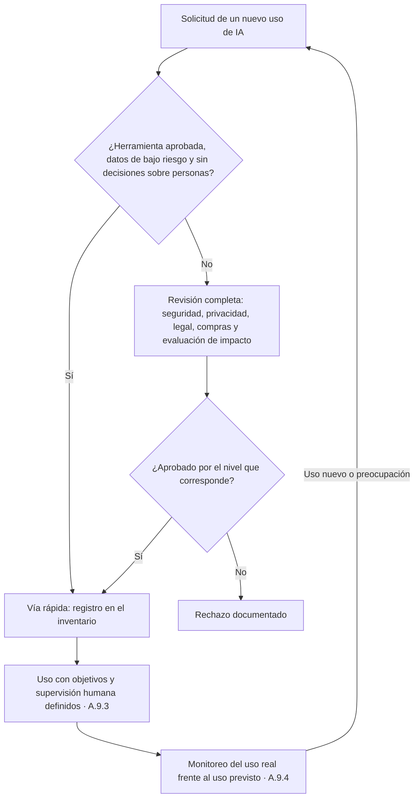

# A.9 · Uso de sistemas de IA

A.9 · Uso
:material-view-grid-outline: 3 controles
:material-clock-outline: 20 min de lectura

**El objetivo, en palabras simples:** que la organización use la IA a propósito y no por accidente: con un proceso para decidir qué usos se permiten, objetivos claros de uso responsable, personas que supervisan donde hace falta y apego a lo que cada sistema fue diseñado para hacer, todo conforme a sus propias políticas.

**Lo que está en juego:** la IA en la sombra que filtra datos de clientes, la supervisión humana de adorno que firma todo lo que propone el modelo y sistemas que terminan usándose para tareas para las que nunca se probaron.

!!! abstract "En una frase"
    A.9 es el reglamento interno de la IA: quién autoriza cada uso, qué significa usarla bien, dónde vigila una persona y hasta dónde llega cada sistema.

## Por qué importa este objetivo

Piensa en la flotilla de vehículos de una empresa. Antes de que alguien maneje un auto de la compañía hay un trámite: quién lo autoriza, qué licencia necesita, quién paga gasolina y mantenimiento. Hay reglas de manejo y alguien revisa que se cumplan. Y cada vehículo se usa para lo que fue hecho: nadie engancha una lancha a la camioneta de reparto solo porque "aguanta". Si cualquiera toma cualquier auto, para lo que sea y sin reglas, tarde o temprano habrá un choque y nadie sabrá quién respondía por él.

A.9 traslada esa lógica a la IA con tres controles: **A.9.2** es el trámite (cómo se decide y aprueba un uso), **A.9.3** son las reglas de manejo y el copiloto (objetivos de uso responsable y supervisión humana) y **A.9.4** es usar cada vehículo para lo que fue diseñado (el uso previsto).

Con la IA hay una peculiaridad: la flotilla llega sola. Herramientas gratuitas a un clic, funciones de IA que aparecen dentro del software que ya pagas, extensiones del navegador. Por eso los riesgos de este objetivo son muy cotidianos:

- **IA en la sombra** (*shadow AI*): personas que usan herramientas no autorizadas con datos de la organización. Es el detonante de Contadores Alameda: un colaborador pegó una nómina con datos personales en un chatbot gratuito.
- **Sesgo de automatización** (*automation bias*): la tendencia humana a aceptar lo que dice la máquina, sobre todo con prisa. Una revisión humana que nunca contradice al modelo no es supervisión: es un sello de goma.
- **Desvío de propósito** (*function creep*): un sistema validado para una cosa empieza a usarse para otra sin que nadie lo vuelva a evaluar.
- **Costos ocultos**: licencias que escalan con el uso, horas de las personas que supervisan, mantenimiento y reentrenamiento.

**Relación con las cláusulas.** A.9 lleva a la operación la política de IA ([5.2](../clausulas/c5-liderazgo.md#c-5-2)) y los objetivos de IA ([6.2](../clausulas/c6-planificacion.md#c-6-2), cuya nota remite expresamente a A.9.3). Se ejecuta dentro de la planificación y control operacional ([8.1](../clausulas/c8-operacion.md#c-8-1)), se apoya en la toma de conciencia ([7.3](../clausulas/c7-apoyo.md#c-7-3)) para que el personal conozca las reglas, y se nutre de la evaluación de impacto ([6.1.4](../clausulas/c6-planificacion.md#c-6-1-4)), que indica dónde hace falta supervisión humana.

**Cómo cambia según tu rol.** Los tres controles aplican a quien **usa** IA de terceros y a quien **desarrolla** IA, porque quien desarrolla casi siempre usa también lo que construye (Monarca Crédito decide créditos con su propio modelo). No llevan la insignia de proveedor porque, cuando provees, el uso lo hace tu cliente y a ti te toca informarle bien ([A.8.2](a8-informacion-partes-interesadas.md#a-8-2), [A.10.4](a10-terceros.md#a-10-4)). Pero casi todo proveedor también es usuario: Conversa Labs usa asistentes de programación y el modelo de su proveedor fundacional, y para esos usos A.9 le aplica de lleno.

!!! info "Diferencias con ISO 27001"
    La pieza reutilizable es el uso aceptable de la información y otros activos (ISO 27001 A.5.10): muchas organizaciones ya tienen una política de uso aceptable y un proceso de alta de software que puedes extender. A.9 agrega lo que el SGSI no pide: objetivos de uso responsable que van más allá de la seguridad (equidad, explicabilidad, accesibilidad), supervisión humana significativa y apego al uso previsto documentado de cada sistema.

## Los controles de un vistazo

| Control | Qué pide, en una línea | Aplica a | Esfuerzo | Frente a ISO 27001 |
|---|---|---|---|---|
| [A.9.2 Procesos para el uso responsable](#a-9-2) | Un proceso documentado para decidir y aprobar cada uso de IA, con costos, compras y requisitos legales a la vista | Usa · Desarrolla | Medio | Similar (5.10) |
| [A.9.3 Objetivos para el uso responsable](#a-9-3) | Objetivos medibles de uso responsable y puntos definidos de supervisión humana | Usa · Desarrolla | Bajo | Nuevo |
| [A.9.4 Uso previsto del sistema de IA](#a-9-4) | Usar cada sistema conforme a su uso previsto y su documentación, y escalar cuando algo preocupa | Usa · Desarrolla | Medio | Nuevo |

!!! note "Sobre los nombres de los controles"
    Son traducciones libres de referencia del autor; la redacción oficial puede variar.

Así se encadenan los tres controles en la vida de un caso de uso:

## A.9.2 Procesos para el uso responsable {#a-9-2 .dx-control .obj-a9}

:material-cloud-download-outline: Usa IA de terceros
:material-code-braces: Desarrolla IA
:material-gauge: Esfuerzo medio
:material-approximately-equal: Similar a 27001

**Propósito.** Que el uso de un sistema de IA sea una decisión tomada por quien corresponde, con la información necesaria, y no algo que simplemente sucede.

**En la práctica.** El control pide definir y documentar los procesos para usar la IA de forma responsable. En una organización real eso se traduce en dos piezas complementarias:

1. **Un proceso de alta de casos de uso de IA.** Cualquier área que quiera usar IA para algo nuevo, sea un sistema propio o comprado, llena una solicitud breve: qué problema resuelve, qué datos usará, a quién afecta el resultado y qué herramienta propone. Con eso se clasifica el caso y se definen las revisiones. En nuestra lectura, hay cuatro preguntas que nunca deberían faltar: **qué requisitos legales aplican** (datos personales, propiedad intelectual, regulación del sector); **por qué vía se adquiere** (catálogo de herramientas y proveedores aprobados, ver [A.10.3](a10-terceros.md#a-10-3)); **cuánto cuesta de verdad**, contando monitoreo, mantenimiento, reentrenamiento y las horas de quienes supervisan; y **quién aprueba** según el nivel del caso. Si el caso tiene impacto en personas, se dispara la evaluación de impacto ([A.5.2](a5-evaluacion-de-impacto.md#a-5-2)). Al aprobarse, entra al inventario con sus condiciones de uso.
2. **Una política de uso aceptable de IA generativa** para el personal: herramientas autorizadas, datos que nunca se introducen (datos personales de clientes, nóminas, información fiscal, secretos comerciales), revisión de todo resultado antes de usarlo, cuándo etiquetar contenido generado y cómo reportar un incidente. Puedes partir de la plantilla de [política de uso aceptable de IA generativa](../plantillas/index.md#uso-aceptable-ia-generativa).

**IA en la sombra.** Cuando un colaborador de Contadores Alameda pegó una nómina en un chatbot gratuito, la reacción instintiva fue prohibir; la eficaz fue **prohibir y ofrecer una alternativa**. El despacho ya pagaba la licencia empresarial de su suite de ofimática con asistente de IA (IA-01), cuyo contrato excluye el uso de sus datos para entrenar, y la política dirige ahí cualquier uso. Sumó el bloqueo de chatbots gratuitos desde la red de la oficina, una capacitación breve con el caso real anonimizado y un periodo para declarar sin sanción las herramientas que ya se usaban. Para descubrir lo no declarado conviene revisar gastos con tarjeta corporativa, registros del proxy y extensiones instaladas.

**Proporcionalidad.** El proceso **no** tiene que ser un comité para cada idea. Una cadena de tiendas en México que quiere usar el generador de imágenes ya autorizado para bocetos de campaña pasa por la vía rápida (revisar derechos de imagen y etiquetar); si quiere usar IA para priorizar candidatos en reclutamiento, pasa por revisión completa y evaluación de impacto. Un proceso demasiado pesado es la mejor fábrica de IA en la sombra.

**Qué reutilizas de ISO 27001.** La política de uso aceptable (ISO 27001 A.5.10) y la evaluación de servicios en la nube (ISO 27001 A.5.23). Agregas la clasificación por impacto en personas, el costo total y el vínculo con la evaluación de impacto.

!!! success "Implementación mínima viable"
    - Procedimiento de alta de casos de uso con formulario breve y niveles de revisión.
    - Matriz de aprobación: qué tipo de caso aprueba quién.
    - Catálogo de herramientas y proveedores de IA aprobados.
    - Política de uso aceptable de IA generativa comunicada y aceptada por el personal.
    - Registro de cada aprobación en el inventario, con su costo total estimado.

!!! tip "Implementación madura"
    - Flujo en la herramienta de tickets, conectado con compras y seguridad.
    - Descubrimiento periódico de IA en la sombra (proxy, gastos, extensiones, herramientas de control de acceso a la nube).
    - Revisión posterior a la implementación para comparar beneficio y costo reales.
    - Indicadores: tiempo de aprobación y usos descubiertos frente a usos registrados.
    - Baja formal de los casos que ya no se usan.

=== ":material-folder-check-outline: Evidencia típica"

    - Procedimiento de alta de casos de uso de IA y su formulario.
    - Solicitudes con su clasificación y aprobaciones registradas, incluidas las rechazadas.
    - Política de uso aceptable con acuses de lectura.
    - Catálogo de herramientas aprobadas y análisis de costos de los casos aprobados.
    - Reportes de detección de IA en la sombra y acciones tomadas.

=== ":material-account-search-outline: Preguntas del auditor"

    1. Si un área quiere usar mañana una herramienta nueva de IA, ¿qué tiene que hacer? Muéstrame un caso aprobado y uno rechazado.
    2. ¿Quién aprobó el uso de este sistema y con qué información?
    3. ¿Qué costos consideraron además de la licencia?
    4. ¿Cómo saben qué herramientas de IA usa realmente el personal?
    5. ¿Qué requisitos legales revisaron antes de aprobar?
    6. ¿Cómo se conecta este proceso con compras y con la evaluación de impacto?

=== ":material-alert-outline: Errores comunes"

    - Prohibir la IA generativa sin ofrecer una alternativa aprobada.
    - Un proceso tan lento que empuja a la gente a la IA en la sombra.
    - Aprobar la herramienta pero no el caso de uso: la misma herramienta sirve para algo trivial o para algo de alto impacto.
    - Considerar solo el precio de la licencia.
    - Aprobaciones de palabra, sin registro.

=== ":material-scale-balance: ¿Se puede excluir?"

    **Podría justificarse si…** muy difícilmente, porque hoy casi toda organización usa IA de alguna forma. Un caso límite sería un alcance limitado a la provisión de un sistema a clientes, con evidencia de que la organización no usa IA en sus procesos internos. Ejemplo de redacción: "Se excluye A.9.2 porque la organización no usa sistemas de IA en sus procesos internos y el uso del sistema provisto corresponde a los clientes, lo que se atiende en A.10.4."

    **No se justifica si…** el personal usa herramientas de IA generativa, aunque sean gratuitas o "de prueba".

**Relaciones.** Cláusulas: [5.2](../clausulas/c5-liderazgo.md#c-5-2), [6.1.4](../clausulas/c6-planificacion.md#c-6-1-4), [7.3](../clausulas/c7-apoyo.md#c-7-3), [8.1](../clausulas/c8-operacion.md#c-8-1) · Controles: [A.2.2](a2-politicas.md#a-2-2), [A.5.2](a5-evaluacion-de-impacto.md#a-5-2), [A.9.3](#a-9-3), [A.9.4](#a-9-4), [A.10.3](a10-terceros.md#a-10-3) · ISO 27001: A.5.10 y A.5.23 · **Anexo B:** la guía B.9.2 sugiere qué tipo de consideraciones (de gobierno, económicas, de abastecimiento y legales) conviene pesar antes de adoptar un sistema, venga de dentro o de fuera, y admite apoyarse en políticas que la organización ya tenga para otros activos.

## A.9.3 Objetivos para el uso responsable {#a-9-3 .dx-control .obj-a9}

:material-cloud-download-outline: Usa IA de terceros
:material-code-braces: Desarrolla IA
:material-gauge-low: Esfuerzo bajo
:material-star-four-points-outline: Nuevo frente a 27001

**Propósito.** Darle contenido concreto a la expresión "uso responsable" en cada sistema, y decidir de antemano dónde una persona revisa, corrige o detiene lo que hace la IA.

**En la práctica.** La norma pide identificar y documentar objetivos que orienten el uso responsable. Los temas típicos son conocidos (equidad, privacidad, transparencia y explicabilidad, rendición de cuentas, fiabilidad y robustez, seguridad, accesibilidad), pero un objetivo útil no es una palabra: es una palabra con indicador, meta y dueño. Para Monarca Crédito podrían verse así:

| Tema | Objetivo para el Score Monarca v3 | Indicador |
|---|---|---|
| Equidad | Que la tasa de aprobación no difiera de forma injustificada por sexo ni por entidad federativa | Brecha de aprobación entre grupos, revisada cada mes |
| Explicabilidad | Que todo rechazo lleve motivos comprensibles | Porcentaje de rechazos con motivos en lenguaje claro |
| Rendición de cuentas | Que cada decisión de la banda gris tenga un analista identificado | Decisiones con responsable registrado |
| Robustez | Detectar la deriva antes de que afecte decisiones | Índice de estabilidad de la población por variable |

Estos objetivos aterrizan los objetivos de IA de [6.2](../clausulas/c6-planificacion.md#c-6-2), complementan los de desarrollo responsable de [A.6.1.2](a6-ciclo-de-vida.md#a-6-1-2) y sirven también para decidir si una solución de terceros es aceptable antes de adoptarla.

**Supervisión humana significativa.** La otra mitad del control, y la más exigente, es decidir en qué puntos del ciclo de vida interviene una persona y con qué poder. En nuestra lectura, la supervisión humana (*human oversight*) es significativa cuando la persona tiene **autoridad real para anular** el resultado; cuenta con **información y tiempo** para formarse un juicio; está **capacitada** en el funcionamiento, las instrucciones y los límites del sistema; puede **reportar inquietudes** sobre resultados extraños o un desempeño que se degrada; y su labor **se mide**. Además, alguien vigila la exactitud en producción y la organización decide conscientemente dónde acepta la decisión automática. La evaluación de impacto ([A.5.4](a5-evaluacion-de-impacto.md#a-5-4)) es la base de esas decisiones, y si la documentación del proveedor exige supervisión humana, esa exigencia se vuelve tuya.

**El caso de la banda gris.** Score Monarca v3 aprueba en automático los casos claros, rechaza los claramente inviables y envía la banda gris a revisión humana. El Comité de Modelos documentó por qué acepta la decisión automática en los extremos y la condicionó a que todo solicitante rechazado pueda pedir la revisión de una persona, algo que se conecta con el derecho de oposición a ciertos tratamientos automatizados de la LFPDPPP vigente (art. 26, fr. II)[^lfpdppp]. En la banda gris, los analistas ven el *score*, los motivos principales y el expediente, y pueden decidir en contra del modelo dejando su razón. Para evitar el **sello de goma**, el Comité revisa cada mes la tasa de anulación por analista (casi cero indica que nadie revisa; un salto, que quizá el modelo se degradó), el tiempo por expediente y una muestra revisada por un segundo analista. Las anulaciones justificadas no se castigan: alimentan el reentrenamiento.

El control **no** exige revisar cada resultado: en el asistente de ofimática de Contadores Alameda basta con que quien redacta lea el texto antes de enviarlo, si la política así lo establece.

!!! success "Implementación mínima viable"
    - De 3 a 5 objetivos de uso responsable por sistema relevante, con indicador y responsable.
    - Mapa de puntos de supervisión humana por sistema: dónde, quién y con qué autoridad.
    - Criterio documentado de cuándo se acepta la decisión automatizada.
    - Capacitación registrada de quienes supervisan.
    - Canal para que los supervisores reporten inquietudes sobre resultados o desempeño.

!!! tip "Implementación madura"
    - Tablero de indicadores de los objetivos, revisado por un comité.
    - Métricas contra el sello de goma: tasa de anulación, concordancia entre revisores, tiempo por caso.
    - Muestreos de calidad y revisiones "a ciegas" periódicas.
    - Calibración de revisores con casos de referencia.
    - Cargas de trabajo revisadas para que la supervisión sea posible.

=== ":material-folder-check-outline: Evidencia típica"

    - Objetivos de uso responsable documentados, con indicadores y resultados.
    - Definición de los puntos de supervisión humana y de su autoridad.
    - Registros de anulaciones con su justificación.
    - Constancias de capacitación de supervisores.
    - Procedimiento de revisión a petición de la persona afectada.

=== ":material-account-search-outline: Preguntas del auditor"

    1. ¿Qué significa, en concreto, usar este sistema de forma responsable? ¿Cómo lo miden?
    2. ¿En qué punto interviene una persona y qué puede hacer si no está de acuerdo con el sistema?
    3. Muéstrame las anulaciones del último trimestre y sus motivos.
    4. ¿Cómo saben que los revisores no aprueban todo lo que propone el modelo?
    5. ¿Qué capacitación recibieron los supervisores?
    6. ¿Por qué consideran aceptable la decisión automática en este caso?

=== ":material-alert-outline: Errores comunes"

    - Objetivos copiados de una lista de principios, sin indicador ni dueño.
    - Supervisión nominal: revisores sin tiempo, sin información o sin autoridad para anular.
    - Medir a los revisores solo por productividad, lo que premia aprobar rápido.
    - Automatizar decisiones sobre personas sin pasar por la evaluación de impacto.
    - Ignorar los requisitos de supervisión que fija la documentación del proveedor.

=== ":material-scale-balance: ¿Se puede excluir?"

    **Podría justificarse si…** prácticamente nunca: quien usa o desarrolla IA necesita saber qué significa para él usarla bien. Lo que sí varía es la intensidad; un sistema de bajo impacto puede tener un solo objetivo y supervisión ligera. Caso límite de redacción: "Se excluye A.9.3 porque la organización no usa sistemas de IA en sus procesos; los objetivos de desarrollo responsable se gestionan en A.6.1.2." Espera que el auditor ponga a prueba esa premisa.

    **No se justifica si…** hay decisiones automatizadas o apoyadas por IA sobre personas.

**Relaciones.** Cláusulas: [6.1.4](../clausulas/c6-planificacion.md#c-6-1-4), [6.2](../clausulas/c6-planificacion.md#c-6-2), [7.2](../clausulas/c7-apoyo.md#c-7-2), [9.1](../clausulas/c9-evaluacion-del-desempeno.md#c-9-1) · Controles: [A.3.3](a3-organizacion-interna.md#a-3-3), [A.4.6](a4-recursos.md#a-4-6), [A.5.4](a5-evaluacion-de-impacto.md#a-5-4), [A.6.1.2](a6-ciclo-de-vida.md#a-6-1-2), [A.8.2](a8-informacion-partes-interesadas.md#a-8-2), [A.9.4](#a-9-4) · ISO 27001: sin equivalente directo · Normas: [Anexo C](../anexos-b-c-d.md) (menú de objetivos), ISO/IEC 23894 · **Anexo B:** la guía B.9.3 reconoce que lo que se considera responsable cambia con el contexto, sugiere temas para los objetivos y dedica buena parte a la supervisión humana: en qué etapas incorporarla, qué actividades puede abarcar y la necesidad de que quienes la ejercen estén capacitados.

## A.9.4 Uso previsto del sistema de IA {#a-9-4 .dx-control .obj-a9}

:material-cloud-download-outline: Usa IA de terceros
:material-code-braces: Desarrolla IA
:material-gauge: Esfuerzo medio
:material-star-four-points-outline: Nuevo frente a 27001

**Propósito.** Evitar que un sistema se use fuera de aquello para lo que fue diseñado, probado y documentado, que es justo donde sus errores se vuelven impredecibles.

**En la práctica.** Todo sistema de IA tiene un uso previsto (*intended use*): las tareas, la población, los datos y el contexto para los que se diseñó y validó. Fuera de ahí, su desempeño es una incógnita. El control pide asegurar que se use conforme a ese uso previsto y a la documentación que lo acompaña. En la práctica implica cuatro cosas:

1. **Desplegarlo como indican sus instrucciones**, con los recursos que requiere, incluida la supervisión humana de [A.9.3](#a-9-3). Si la documentación del proveedor dice "no usar para decisiones sin revisión humana", esa condición forma parte del uso previsto.
2. **Alimentarlo con datos parecidos a los documentados.** Un extractor de CFDI entrenado con facturas mexicanas no tiene por qué funcionar con facturas de proveedores extranjeros, y un modelo de *score* para microcréditos personales no se reutiliza para micronegocios sin validarlo (por eso Monarca trata su modelo de líneas de crédito, IA-02, como un sistema con validación propia). Vigilar las entradas fuera de distribución (*out-of-distribution*) es parte del trabajo.
3. **Monitorear la operación** ([A.6.2.6](a6-ciclo-de-vida.md#a-6-2-6)) para detectar usos y entradas que se salen de lo previsto, por ejemplo, revisando qué temas le preguntan realmente a un chatbot.
4. **Escalar cuando algo preocupa**, incluso si el sistema **funciona como debe**. Un hospital en Chile usa, conforme a las instrucciones del fabricante, una herramienta de apoyo al triaje, y su monitoreo muestra que subestima la urgencia en pacientes mayores. Usarla "bien" no basta: hay que comunicarlo al personal pertinente y al proveedor, y documentar la respuesta.

**Registros.** Conviene conservar registros de eventos y documentación de la operación que permitan demostrar que el sistema se usa según lo previsto o respaldar un escalamiento. El plazo depende del uso previsto, de tu política de retención y de los requisitos legales; con datos personales también aplica no guardar más de lo necesario, así que la retención se decide, no se deja al azar.

**El desvío de propósito.** El riesgo más común no es técnico: es que alguien encuentre un uso nuevo. Contadores Alameda configuró a Alma para preguntas frecuentes, estatus y citas; si un día se quiere que Alma "recomiende el régimen fiscal más conveniente", eso no es un ajuste de configuración sino un caso de uso nuevo que vuelve a pasar por [A.9.2](#a-9-2) y por evaluación de impacto.

Por rol: si **usas** IA de terceros, el uso previsto lo define sobre todo el proveedor; léelo y respétalo. Si **desarrollas**, lo defines tú en los requisitos ([A.6.2.2](a6-ciclo-de-vida.md#a-6-2-2)). El control **no** pide congelar la innovación ni guardar registros para siempre.

!!! success "Implementación mínima viable"
    - Declaración de uso previsto y de usos no permitidos por sistema, en el inventario o la ficha.
    - Instrucciones de uso disponibles para quienes operan el sistema.
    - Verificación, al desplegar, de que los datos de entrada coinciden con lo documentado.
    - Procedimiento para escalar inquietudes internamente y al proveedor.
    - Plazo de retención de registros definido y aplicado.

!!! tip "Implementación madura"
    - Controles técnicos contra usos fuera del dominio: validación de entradas, filtros de temas, detección de datos fuera de distribución.
    - Alertas automáticas ante cambios en el perfil de las entradas.
    - Revisión periódica del uso real frente al previsto, con resultados al comité.
    - Registro de escalamientos al proveedor con seguimiento hasta el cierre.

=== ":material-folder-check-outline: Evidencia típica"

    - Declaración de uso previsto por sistema.
    - Documentación e instrucciones del proveedor o del equipo de desarrollo.
    - Registros de operación y reportes de monitoreo.
    - Escalamientos al proveedor y sus respuestas.
    - Tabla de retención de registros aplicada al sistema.

=== ":material-account-search-outline: Preguntas del auditor"

    1. ¿Cuál es el uso previsto de este sistema y dónde está documentado?
    2. ¿Cómo evitan o detectan que se use para otra cosa?
    3. ¿Los datos con los que opera hoy se parecen a aquellos con los que se validó? ¿Cómo lo saben?
    4. ¿Han escalado alguna inquietud al proveedor? Muéstrame el caso y la respuesta.
    5. ¿Cuánto tiempo conservan los registros de operación y por qué ese plazo?
    6. ¿Qué pasó la última vez que alguien propuso un uso nuevo?

=== ":material-alert-outline: Errores comunes"

    - Un uso previsto tan vago ("apoyar al negocio") que nada queda fuera.
    - No leer la documentación del proveedor y desconocer sus restricciones.
    - Reutilizar un modelo en otra población o producto sin validarlo.
    - No conservar registros, o conservarlos sin plazo ni criterio.
    - Callar una preocupación porque "el sistema hace lo que dice el manual".

=== ":material-scale-balance: ¿Se puede excluir?"

    **Podría justificarse si…** prácticamente nunca para quien usa o desarrolla IA, porque todo sistema tiene un uso previsto que respetar. Caso límite de redacción: "Se excluye A.9.4 porque la organización no opera sistemas de IA propios ni de terceros; el uso del sistema que provee corresponde a sus clientes, a quienes se informa conforme a A.8.2 y A.10.4."

    **No se justifica si…** cualquier sistema en alcance tiene instrucciones, documentación del proveedor o requisitos de uso definidos.

**Relaciones.** Cláusulas: [4.1](../clausulas/c4-contexto.md#c-4-1), [8.1](../clausulas/c8-operacion.md#c-8-1) · Controles: [A.6.2.2](a6-ciclo-de-vida.md#a-6-2-2), [A.6.2.6](a6-ciclo-de-vida.md#a-6-2-6), [A.6.2.8](a6-ciclo-de-vida.md#a-6-2-8), [A.8.2](a8-informacion-partes-interesadas.md#a-8-2), [A.9.2](#a-9-2), [A.10.3](a10-terceros.md#a-10-3) · ISO 27001: sin equivalente directo · **Anexo B:** la guía B.9.4 vincula el uso previsto con las instrucciones del sistema, la supervisión humana y la coherencia de los datos de entrada; pide monitorear, comunicar inquietudes también a proveedores externos y conservar registros con plazos que dependen del uso, las políticas internas y la ley.

## Cómo se ve este objetivo en los casos prácticos

=== "Contadores Alameda"

    El incidente de la nómina pegada en un chatbot gratuito fue el punto de partida. Para **A.9.2**, el despacho publicó su política de uso aceptable de IA generativa, definió un formulario de una página para nuevos usos que revisan el Gerente de TI y la Coordinadora de cumplimiento y datos personales, y registró en su inventario los tres sistemas aprobados (IA-01, Alma e IA-03). Para **A.9.3**, fijó objetivos sencillos: cero datos personales en herramientas no aprobadas, al menos 98 % de respuestas correctas de Alma en el muestreo de la Líder de atención a clientes, con un umbral de 95 % que activa el traspaso de esos temas a una persona y revisión humana obligatoria de los CFDI que el módulo de captura extrae con baja confianza. Para **A.9.4**, documentó que Alma sirve para preguntas frecuentes, estatus y citas, y que cualquier tema de asesoría se transfiere a una persona.

=== "Monarca Crédito"

    Monarca **desarrolla** y **usa** su modelo, así que A.9 es central. Su Comité de Modelos funciona como el proceso de **A.9.2**: ningún modelo nuevo ni cambio de uso sale a producción sin su aprobación, que incluye costo de operación y revisión del Oficial de Cumplimiento y del Oficial de Privacidad. En **A.9.3**, la banda gris es su principal punto de supervisión humana, con métricas contra el sello de goma. En **A.9.4**, documentó que la API de detección de fraude (IA-03) genera alertas para revisión de un analista, como indica su proveedor, y no rechazos automáticos; usarla como filtro de rechazo sería salirse de su uso previsto.

=== "Conversa Labs"

    Aunque su rol principal es proveer, Conversa también **usa** IA: su equipo de ingeniería trabaja con asistentes de programación y la empresa consume el modelo fundacional de su proveedor. Para **A.9.2**, su política de uso aceptable prohíbe introducir datos o bases de conocimiento de clientes en herramientas no aprobadas y su proceso de alta pasa por la Responsable de Confianza y Seguridad. Para **A.9.4**, revisa que su uso del modelo fundacional se mantenga dentro de las políticas de uso del proveedor. La supervisión humana que ofrece a sus clientes (traspaso a agente humano) se documenta como parte del uso previsto de la plataforma y se comunica según [A.10.4](a10-terceros.md#a-10-4).

## Plantillas y recursos relacionados

- [Política de uso aceptable de IA generativa](../plantillas/index.md#uso-aceptable-ia-generativa): base para A.9.2 y para atajar la IA en la sombra.
- [Inventario de sistemas de IA](../plantillas/index.md#inventario-sistemas-ia): dónde registrar aprobaciones, uso previsto y puntos de supervisión.
- [Evaluación de impacto del sistema de IA](../plantillas/index.md#evaluacion-de-impacto): para decidir dónde se necesita supervisión humana.
- [Ficha del sistema de IA](../plantillas/index.md#ficha-del-sistema): declaración de uso previsto y usos no permitidos.
- [Política de IA](../plantillas/index.md#politica-de-ia) y [roles y responsabilidades (RACI)](../plantillas/index.md#raci-ia).
- Casos completos: [PyME que usa IA generativa](../casos-practicos/pyme-usa-ia-generativa.md), [fintech de *scoring*](../casos-practicos/fintech-scoring.md) y [empresa que desarrolla un chatbot](../casos-practicos/empresa-desarrolla-chatbot.md).
- Para profundizar: [principios de IA responsable](../fundamentos/principios-ia-responsable.md) y [riesgo frente a impacto](../fundamentos/riesgo-vs-impacto.md).

[^lfpdppp]: Ley Federal de Protección de Datos Personales en Posesión de los Particulares, texto vigente publicado por la Cámara de Diputados: <https://www.diputados.gob.mx/LeyesBiblio/pdf/LFPDPPP.pdf> (consultado el 9 de octubre de 2026). Resumen propio; no es asesoría legal.
