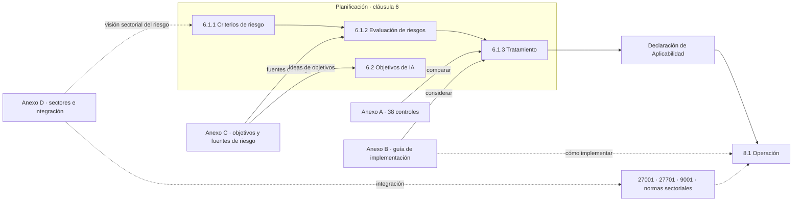

# Anexos B, C y D: cómo usarlos

:material-book-open-page-variant-outline: 1 anexo normativo · 2 informativos
:material-clock-outline: 17 min de lectura

!!! abstract "En una frase"
    El Anexo B te explica cómo suele ponerse en marcha cada control del Anexo A y, aunque está marcado como normativo, no te obliga a seguir cada recomendación; el Anexo C te da un punto de partida para tus objetivos de IA y tus fuentes de riesgo, y el Anexo D te recuerda que el SGIA vive dentro de un sector y junto a los sistemas de gestión que quizá ya tienes.

## Panorama: cuatro anexos, dos naturalezas

Después de las cláusulas 4 a 10, ISO/IEC 42001 trae cuatro anexos. Dos están marcados como **normativos** (*normative*): forman parte del contenido que necesitas para aplicar la norma. Los otros dos son **informativos** (*informative*): aportan contexto, ejemplos y relaciones con otras normas, pero no agregan requisitos.

| Anexo | Naturaleza | Qué contiene | Desde dónde lo invoca la norma | ¿Qué se audita? |
|---|---|---|---|---|
| **A** | Normativo | Catálogo de 38 controles de referencia agrupados en 9 temas (A.2 a A.10) | [6.1.3](clausulas/c6-planificacion.md#c-6-1-3): comparar tus controles con él y justificar inclusiones y exclusiones | La Declaración de Aplicabilidad (*Statement of Applicability*, SoA) y cada control que declares aplicable |
| **B** | Normativo | Guía de implementación de cada control, con la misma numeración (B.7.4 orienta a A.7.4) | 6.1.3 pide considerarla; [8.1](clausulas/c8-operacion.md#c-8-1) la menciona como apoyo para implementar | Que la tomaste en cuenta, no cada recomendación |
| **C** | Informativo | Objetivos organizacionales posibles y fuentes de riesgo relacionadas con la IA | Notas de [6.2](clausulas/c6-planificacion.md#c-6-2) y guía de A.6.1.2 y A.9.3 en el Anexo B | Nada como requisito propio; es un insumo |
| **D** | Informativo | Uso del SGIA en distintos sectores e integración con otras normas de sistemas de gestión | Nota de [6.1.1](clausulas/c6-planificacion.md#c-6-1-1) sobre la forma en que cada sector entiende el riesgo | Nada como requisito propio; orienta la integración |

El Anexo A tiene su propia sección ([Anexo A · Los 38 controles](anexo-a/index.md)); aquí nos ocupamos de los otros tres.

**¿Por qué importa la diferencia?** Porque define qué te pueden exigir: un hallazgo de auditoría tiene que apoyarse en un requisito (una cláusula, un control que declaraste aplicable, un procedimiento tuyo o una obligación legal o contractual), y algo que solo aparece en un anexo informativo no sostiene por sí mismo una no conformidad. También define cuánto esfuerzo merece cada anexo: al A le respondes control por control en la SoA; al B, con buenas decisiones de diseño; al C y al D, con un análisis de riesgos y una integración mejor pensados. Y te evita dos excesos: tratar todo como lista obligatoria o tratar todo como "opcional".

!!! tip "Analogía"
    Piensa en un mueble para armar. El Anexo A es la lista de piezas que debes revisar: si no usas una, explicas por qué. El Anexo B es el instructivo: viene en la caja, pero si sabes armarlo de otra forma igual de firme, nadie te obliga a seguir cada dibujo. El Anexo C es la hoja de consejos para pensar qué podría salir mal, y el D, la nota que te recuerda combinarlo con lo que ya tienes en casa.

### La naturaleza del Anexo B, con precisión {#naturaleza-anexo-b}

El Anexo B es el que más confusiones genera, así que vamos punto por punto, según lo que dice la propia norma:

1. **Está marcado como normativo**, igual que el Anexo A.
2. **Se presenta como guía de implementación** de cada control del Anexo A: su función es ayudarte a poner en marcha el control y a cumplir el objetivo del tema.
3. **No te pide rendir cuentas recomendación por recomendación.** Su introducción (B.1) aclara que no tienes que documentar ni justificar en la Declaración de Aplicabilidad si adoptas o descartas cada elemento de la guía. En la SoA se justifican **controles**, no sugerencias.
4. **Admite adaptación.** La misma introducción reconoce que la guía no siempre será adecuada o suficiente y te permite ampliarla, modificarla o definir tu propia forma de implementar el control, según tus requisitos y tu tratamiento de riesgos. La plantea como punto de partida.
5. **La cláusula 6.1.3 te pide tomarlo en cuenta** al implementar los controles que determinaste.

**Entonces, ¿por qué es normativo?** En las reglas de redacción de ISO, un anexo normativo contiene disposiciones que forman parte del documento; uno informativo solo ayuda a entenderlo o usarlo. En nuestra lectura, el Anexo B es normativo porque 6.1.3 lo convierte en un insumo obligado de tu proceso: se exige **considerarlo**, no **ejecutarlo al pie de la letra**. Compáralo con ISO/IEC 27001, cuya guía de controles vive en otra norma no certificable, ISO/IEC 27002; en ISO/IEC 42001 la guía quedó dentro del mismo documento.

### Cómo lo interpretan auditores y organismos de certificación {#anexo-b-auditoria}

Lo que sigue es **interpretación** basada en la práctica de auditoría de sistemas de gestión; puede variar entre organismos de certificación y entre auditores.

!!! auditor "Lo que mira el auditor"
    - **Lo usa como referencia de buena práctica** para entender la intención de cada control y preparar preguntas. Si tu forma de operar un modelo ([A.6.2.6](anexo-a/a6-ciclo-de-vida.md#a-6-2-6)) no dice nada sobre la deriva de los datos (*data drift*) en producción, es probable que te pregunte por qué.
    - **No puede exigir cada viñeta.** "No hiciste lo que sugiere el tercer punto de la guía" no es, por sí solo, una no conformidad defendible.
    - **Sí puede usarlo como argumento.** Si tu control no logra su objetivo y la guía señalaba justo la pieza que falta, puede levantar la no conformidad contra el control (por no ser eficaz) o contra 8.1, que pide vigilar la eficacia de los controles, y citar el Anexo B como apoyo.
    - **Puede pedir evidencia de que lo consideraste:** una referencia en tus procedimientos, una columna en la SoA o una nota de diseño.
    - **Las desviaciones sin explicación suelen terminar, como mínimo, en observación** u oportunidad de mejora. Apartarte es válido; lo que no se sostiene es no poder explicar cómo logras el mismo objetivo.

Desde 2025, ISO/IEC 42006 fija requisitos adicionales para los organismos que certifican sistemas de gestión de IA, como la competencia de su personal y el cálculo del tiempo de auditoría.[^42006] Regula al auditor, no a ti, y no cambia lo que ISO/IEC 42001 dice del Anexo B. Más en [cómo se certifica](auditoria/como-se-certifica.md).

## Anexo B: la guía de implementación, control por control {#anexo-b}

### La correspondencia B.x.y ↔ A.x.y

La numeración del Anexo B es un espejo de la del Anexo A: B.7.4 orienta la implementación de [A.7.4](anexo-a/a7-datos.md#a-7-4); B.6.2.6, la de [A.6.2.6](anexo-a/a6-ciclo-de-vida.md#a-6-2-6). B.1 es una introducción general, como A.1, y en cada tema la primera subsección (B.2.1, B.3.1…; en el tema 6, B.6.1.1 y B.6.2.1) recuerda el objetivo. Dentro de cada control la estructura se repite: primero el enunciado del control, luego la guía de implementación y, en algunos casos, un bloque de información adicional con referencias a otras normas.

| Tema | Sección del Anexo B | Controles que orienta | Qué tipo de orientación encontrarás | Guía en este sitio |
|---|---|---|---|---|
| Políticas | B.2 | A.2.2 a A.2.4 | Insumos para redactar la política, temas que puede cubrir, convivencia con otras políticas y quién la mantiene | [A.2 · Políticas](anexo-a/a2-politicas.md) |
| Organización interna | B.3 | A.3.2 y A.3.3 | Cómo repartir roles a partir de la política, los objetivos y los riesgos; qué cualidades necesita un canal para reportar inquietudes | [A.3 · Organización interna](anexo-a/a3-organizacion-interna.md) |
| Recursos | B.4 | A.4.2 a A.4.6 | Qué recursos inventariar (componentes, datos, herramientas, cómputo y personas) y qué información registrar de cada uno | [A.4 · Recursos](anexo-a/a4-recursos.md) |
| Evaluación de impactos | B.5 | A.5.2 a A.5.5 | Cuándo detonar una evaluación, cómo estructurarla, a quién considerar afectado y qué conservar | [A.5 · Evaluación de impactos](anexo-a/a5-evaluacion-de-impacto.md) |
| Ciclo de vida | B.6 | A.6.1.2 a A.6.2.8 | Llevar los objetivos de desarrollo responsable a cada etapa: diseño, pruebas, liberación, despliegue, monitoreo, documentación y registros | [A.6 · Ciclo de vida](anexo-a/a6-ciclo-de-vida.md) |
| Datos | B.7 | A.7.2 a A.7.6 | Gestión de datos, detalles de su adquisición, calidad y sesgo, procedencia y preparación | [A.7 · Datos](anexo-a/a7-datos.md) |
| Información para partes interesadas | B.8 | A.8.2 a A.8.5 | Qué informar a usuarios, cómo recibir reportes de efectos adversos, cómo comunicar incidentes y qué compartir con autoridades | [A.8 · Información para partes interesadas](anexo-a/a8-informacion-partes-interesadas.md) |
| Uso de sistemas de IA | B.9 | A.9.2 a A.9.4 | Procesos de uso responsable, ejemplos de objetivos de uso, el papel de la supervisión humana y el apego a la documentación del sistema | [A.9 · Uso](anexo-a/a9-uso.md) |
| Terceros y clientes | B.10 | A.10.2 a A.10.4 | Reparto de responsabilidades en la cadena de valor, incluidos los datos personales; qué pedir a proveedores y comunicar a clientes | [A.10 · Terceros y clientes](anexo-a/a10-terceros.md) |

!!! note "Sobre los nombres"
    Los nombres de temas y controles que usa esta guía son traducción libre de referencia del autor; la redacción oficial puede variar.

### Qué tipo de orientación da

Sin reproducir su contenido, el Anexo B combina cinco tipos de ayuda:

- **El porqué del control:** una o dos ideas sobre el riesgo que atiende.
- **Elementos a considerar**, casi siempre en listas abiertas que funcionan como menú, no como lista de verificación.
- **Ejemplos que aterrizan la idea:** amenazas propias de la IA, como el envenenamiento de datos (*data poisoning*) o la extracción de modelos; métricas elegidas según lo que cuesta un falso positivo frente a un falso negativo; el reparto de papeles cuando hay datos personales.
- **Referencias a otras normas** para profundizar, como ISO/IEC 22989, ISO/IEC 23053, la serie ISO/IEC 5259, ISO/IEC TR 24027, ISO/IEC 5338, ISO 37002, ISO/IEC 27001 e ISO/IEC 27701 (ver [familia de normas](fundamentos/familia-de-normas.md)).
- **Conexiones entre controles:** la guía de uso previsto se apoya en la de información para usuarios; la de proveedores, en la de documentación técnica. Te ayudan a ver los controles como sistema.

Su profundidad es desigual: la guía de operación y monitoreo ocupa varias páginas y la de reporte externo, un par de líneas. Además, no menciona la IA generativa, los agentes ni la inyección de instrucciones (*prompt injection*); si son parte de tu realidad, completa con otras fuentes.

### Cómo usarlo para diseñar controles

1. **Parte del riesgo, no del anexo.** Ten claro qué riesgo o requisito justifica el control; eso lo decidiste en [6.1.3](clausulas/c6-planificacion.md#c-6-1-3).
2. **Lee la sección del Anexo B como un menú** y marca cada idea: *adopto*, *adapto*, *no aplica* o *ya lo cubre otro control*.
3. **Complementa** con lo que la guía no trae, por ejemplo pruebas contra inyección de instrucciones en un asistente con generación aumentada por recuperación (RAG).
4. **Escribe con tus palabras y tus nombres:** tus sistemas, tus roles, tus herramientas.
5. **Deja rastro de la decisión.** Una línea ("Base: B.7.4, adaptado") en el procedimiento o una columna en la SoA basta para demostrar que lo consideraste.
6. **Define la evidencia** que mostrará que el control funciona.

Así se ve una **matriz de consideración** sencilla con casos de esta guía:

| Sistema y control | Idea de la guía, parafraseada | Decisión | Cómo quedó |
|---|---|---|---|
| Score Monarca v3 · [A.7.4](anexo-a/a7-datos.md#a-7-4) | Definir requisitos de calidad para los datos de entrenamiento, prueba y producción, y vigilar el efecto del sesgo | Adopto | Umbrales de completitud y vigencia para datos de buró y de la app; revisión de equidad en cada reentrenamiento |
| Conversa · [A.6.2.6](anexo-a/a6-ciclo-de-vida.md#a-6-2-6) | Vigilar errores y desempeño con datos reales y atender las amenazas propias de la IA | Adapto | Muestreo semanal de conversaciones, tablero de traspasos a agente humano y alertas por inyección de instrucciones |
| Alma, de Contadores Alameda · [A.4.5](anexo-a/a4-recursos.md#a-4-5) | Documentar dónde corre el sistema y qué recursos de cómputo usa | Adapto a su rol | Solo registra tipo de servicio, región de alojamiento declarada por BotNorte y modelo de lenguaje que usa |

### Cómo usarlo para preparar una auditoría

- **Conviértelo en guion de preguntas.** Por cada control de tu SoA, lee su sección del Anexo B y formula tres o cuatro preguntas como las haría un auditor: "¿cómo decides cuándo reentrenar?", "¿quién recibe los reportes de efectos adversos?". Si no puedes responder con evidencia, encontraste una brecha.
- **Prepara tus desviaciones:** una razón de una o dos líneas, ligada a tu riesgo, rol o contexto, por cada idea que descartaste o cambiaste.
- **Sigue las referencias cruzadas** y verifica que tu evidencia también esté conectada; por ejemplo, que los resultados de la evaluación de impacto lleguen a la información para usuarios.
- **Úsalo en tu auditoría interna** ([9.2](clausulas/c9-evaluacion-del-desempeno.md#c-9-2)), distinguiendo en el informe entre no conformidades (contra requisitos) y oportunidades de mejora (contra la guía). Más ideas en [preguntas del auditor](auditoria/preguntas-del-auditor.md).

!!! warning "Errores comunes con el Anexo B"
    - **Copiarlo como procedimiento.** Pegar la guía y cambiar "la organización" por el nombre de tu empresa produce documentos genéricos que nadie sigue y que un auditor detecta en minutos. Además, reproducir el texto de la norma en documentos que circulan puede chocar con la licencia de tu ejemplar.
    - **Ignorarlo** porque "solo es guía": 6.1.3 te pide considerarlo y es la mejor pista de lo que buscará el auditor.
    - **Justificar viñeta por viñeta en la SoA**, que solo justifica controles.
    - **Creer que es exhaustivo** o **aplicarlo igual a todos los roles**: buena parte de la guía del tema 6 está pensada para quien desarrolla.

## Anexo C: objetivos y fuentes de riesgo {#anexo-c}

El Anexo C es **informativo** y tiene dos partes: una lista de **objetivos organizacionales posibles** relacionados con la IA y una de **fuentes de riesgo** (*risk sources*). La norma lo presenta como algo que puedes considerar al gestionar riesgos, aclara que no es exhaustivo ni aplicable a todas las organizaciones y te deja a ti decidir qué objetivos y fuentes son pertinentes. Para profundizar, remite a ISO/IEC 23894.

### Los objetivos posibles

| Objetivo | Qué significa | Ejemplo | Controles relacionados |
|---|---|---|---|
| **Rendición de cuentas** (*accountability*) | Aunque una decisión se apoye en IA, debe quedar claro quién responde por ella | El Director de Riesgos de Monarca es dueño del Score Monarca v3 y el Comité de Modelos aprueba cada versión | [A.3.2](anexo-a/a3-organizacion-interna.md#a-3-2), [A.10.2](anexo-a/a10-terceros.md#a-10-2), [A.6.2.8](anexo-a/a6-ciclo-de-vida.md#a-6-2-8) |
| **Experiencia en IA** | Personas que combinen conocimiento técnico, del negocio y de riesgos | Contadores Alameda necesita a alguien que entienda los CFDI y los límites del módulo de captura | [A.4.6](anexo-a/a4-recursos.md#a-4-6), [7.2](clausulas/c7-apoyo.md#c-7-2) |
| **Datos de entrenamiento y prueba disponibles y de calidad** | Sin datos suficientes y representativos, el modelo aprende mal y las pruebas no demuestran nada | Monarca comprueba que los solicitantes de todas las entidades federativas estén representados antes de reentrenar | [A.7.2](anexo-a/a7-datos.md#a-7-2), [A.7.4](anexo-a/a7-datos.md#a-7-4), [A.4.3](anexo-a/a4-recursos.md#a-4-3) |
| **Impacto ambiental** | La IA consume energía, agua y equipo, pero también puede ahorrar recursos | Conversa usa un modelo pequeño para clasificar mensajes y reserva el grande para redactar | [A.4.5](anexo-a/a4-recursos.md#a-4-5), [A.5.5](anexo-a/a5-evaluacion-de-impacto.md#a-5-5), [4.1](clausulas/c4-contexto.md#c-4-1) |
| **Equidad** (*fairness*) | Evitar que el sistema trate peor, sin justificación, a ciertas personas o grupos | El Score Monarca se revisa por sexo, edad y entidad, y se vigila el código postal como variable sustituta | [A.5.4](anexo-a/a5-evaluacion-de-impacto.md#a-5-4), [A.6.2.4](anexo-a/a6-ciclo-de-vida.md#a-6-2-4), [A.7.4](anexo-a/a7-datos.md#a-7-4) |
| **Mantenibilidad** (*maintainability*) | Poder corregir o adaptar el sistema a tiempo y sin romper lo que funciona | Si cambia una fecha fiscal, la base de conocimiento de Alma se actualiza y se prueba en menos de 48 horas | [A.6.2.3](anexo-a/a6-ciclo-de-vida.md#a-6-2-3), [A.6.2.6](anexo-a/a6-ciclo-de-vida.md#a-6-2-6), [A.6.2.7](anexo-a/a6-ciclo-de-vida.md#a-6-2-7) |
| **Privacidad** | Proteger los datos personales que el sistema usa o produce y respetar los derechos de sus titulares | El despacho prohíbe pegar nóminas en chatbots no autorizados | [A.7.3](anexo-a/a7-datos.md#a-7-3), [A.7.5](anexo-a/a7-datos.md#a-7-5), [A.9.2](anexo-a/a9-uso.md#a-9-2), [A.5.4](anexo-a/a5-evaluacion-de-impacto.md#a-5-4) |
| **Robustez** (*robustness*) | Mantener el desempeño con datos distintos de los de entrenamiento | La captura de CFDI debe leer bien facturas escaneadas o fotografiadas con el celular | [A.6.2.4](anexo-a/a6-ciclo-de-vida.md#a-6-2-4), [A.6.2.6](anexo-a/a6-ciclo-de-vida.md#a-6-2-6), [A.7.4](anexo-a/a7-datos.md#a-7-4) |
| **Seguridad física o protección** (*safety*) | Que el sistema no ponga en peligro la vida, la salud, los bienes o el entorno | Una clínica ficticia que prioriza estudios con IA no descarta ningún caso sin lectura humana | [A.5.4](anexo-a/a5-evaluacion-de-impacto.md#a-5-4), [A.6.2.4](anexo-a/a6-ciclo-de-vida.md#a-6-2-4), [A.9.4](anexo-a/a9-uso.md#a-9-4) |
| **Seguridad de la información** (*security*) | Además de la seguridad clásica, amenazas propias de la IA como el envenenamiento de datos o la inversión del modelo | Conversa prueba si un documento de un cliente puede esconder instrucciones que alteren al asistente | [A.6.2.4](anexo-a/a6-ciclo-de-vida.md#a-6-2-4), [A.6.2.6](anexo-a/a6-ciclo-de-vida.md#a-6-2-6), [A.10.3](anexo-a/a10-terceros.md#a-10-3) e ISO/IEC 27001 |
| **Transparencia y explicabilidad** | Transparencia es informar qué hace el sistema y cómo lo gobiernas; explicabilidad es poder dar razones comprensibles de un resultado concreto | Alma avisa que es una IA; Monarca explica sus rechazos en lenguaje claro | [A.8.2](anexo-a/a8-informacion-partes-interesadas.md#a-8-2), [A.8.5](anexo-a/a8-informacion-partes-interesadas.md#a-8-5), [A.6.2.7](anexo-a/a6-ciclo-de-vida.md#a-6-2-7) |

### Las fuentes de riesgo

| Fuente de riesgo | Cómo se manifiesta | Ejemplo | Controles relacionados |
|---|---|---|---|
| **Complejidad del entorno** | Cuanto más variadas sean las situaciones, más difícil es anticipar el comportamiento | El asistente universitario de Conversa atiende a alumnos, padres y proveedores con modismos regionales | [A.6.2.2](anexo-a/a6-ciclo-de-vida.md#a-6-2-2), [A.6.2.4](anexo-a/a6-ciclo-de-vida.md#a-6-2-4), [A.9.4](anexo-a/a9-uso.md#a-9-4) |
| **Falta de transparencia y explicabilidad** | Sin poder informar ni explicar, pierdes confianza y te cuesta responder por tus decisiones | Ante una queja, Monarca solo puede decir "lo decidió el modelo" | [A.8.2](anexo-a/a8-informacion-partes-interesadas.md#a-8-2), [A.8.5](anexo-a/a8-informacion-partes-interesadas.md#a-8-5), [A.6.2.7](anexo-a/a6-ciclo-de-vida.md#a-6-2-7) |
| **Nivel de automatización** | Con menos intervención humana, un error pesa más sobre la seguridad o la equidad | Rechazo automático frente a la banda gris que revisan analistas en el Score Monarca | [A.9.3](anexo-a/a9-uso.md#a-9-3), [A.5.4](anexo-a/a5-evaluacion-de-impacto.md#a-5-4), [A.6.1.3](anexo-a/a6-ciclo-de-vida.md#a-6-1-3) |
| **Fuentes propias del aprendizaje automático** | Datos sesgados, mal recolectados o manipulados se vuelven errores sistemáticos | Aprobaciones históricas con criterios del pasado, o datos contaminados a propósito | [A.7.3](anexo-a/a7-datos.md#a-7-3), [A.7.4](anexo-a/a7-datos.md#a-7-4), [A.7.5](anexo-a/a7-datos.md#a-7-5), [A.7.6](anexo-a/a7-datos.md#a-7-6) |
| **Problemas de hardware** | Fallas de componentes o un modelo que se comporta distinto al cambiar de equipo | Al migrar de nube, Monarca detecta diferencias de puntaje por la precisión numérica del nuevo equipo | [A.4.5](anexo-a/a4-recursos.md#a-4-5), [A.6.2.4](anexo-a/a6-ciclo-de-vida.md#a-6-2-4), [A.6.2.5](anexo-a/a6-ciclo-de-vida.md#a-6-2-5) |
| **Problemas del ciclo de vida** | Fallas de diseño, despliegues apresurados, falta de mantenimiento o retiros mal hechos | Al dar de baja un chatbot, el despacho descubre que el proveedor conservaba conversaciones de clientes | [A.6.1.3](anexo-a/a6-ciclo-de-vida.md#a-6-1-3), [A.6.2.5](anexo-a/a6-ciclo-de-vida.md#a-6-2-5), [A.6.2.6](anexo-a/a6-ciclo-de-vida.md#a-6-2-6), [A.10.3](anexo-a/a10-terceros.md#a-10-3) |
| **Madurez tecnológica** | Lo nuevo tiene límites desconocidos; lo muy probado invita al exceso de confianza | Alucinaciones de la IA generativa, o dejar de revisar la captura de CFDI "porque siempre funciona" | [A.6.2.4](anexo-a/a6-ciclo-de-vida.md#a-6-2-4), [A.9.3](anexo-a/a9-uso.md#a-9-3), [A.4.6](anexo-a/a4-recursos.md#a-4-6) |

!!! info "No es exhaustivo"
    El propio Anexo C advierte que no pretende cubrirlo todo ni aplicar igual a todas las organizaciones. Tómalo como piso, no como techo: la dependencia de un proveedor de modelos o el uso indebido, por ejemplo, no aparecen en él.

### Cómo usarlo para construir tu catálogo de riesgos y tus objetivos de IA

**Para la evaluación de riesgos ([6.1.2](clausulas/c6-planificacion.md#c-6-1-2)):**

1. **Recorre las siete fuentes por cada sistema** como preguntas guía; la página de la cláusula 6 trae un [catálogo de fuentes de riesgo](clausulas/c6-planificacion.md#c-6-1-2) ya convertido en preguntas.
2. **Cruza fuentes con objetivos.** Redacta cada riesgo como "esta fuente puede afectar este objetivo en este sistema, con estas consecuencias": por el nivel de automatización, el rechazo automático puede tratar de forma injusta a solicitantes de ciertas entidades, con daño para ellos y para la reputación de Monarca. Así identificas riesgos que ayudan o estorban a tus objetivos de IA, como pide 6.1.2.
3. **Agrega lo que el anexo no trae:** dependencia de terceros, uso indebido, sesgo de automatización, cambios regulatorios y riesgos propios de la IA generativa.
4. **Conecta con la evaluación de impacto** ([6.1.4](clausulas/c6-planificacion.md#c-6-1-4)) para valorar mejor las consecuencias para personas y grupos.

**Para los objetivos de IA ([6.2](clausulas/c6-planificacion.md#c-6-2)):** elige los tres a cinco temas que más importan para cada sistema y vuélvelos medibles. La guía del Anexo B para [A.6.1.2](anexo-a/a6-ciclo-de-vida.md#a-6-1-2) y [A.9.3](anexo-a/a9-uso.md#a-9-3) remite justamente al Anexo C como fuente de ideas.

| Tema del Anexo C | Objetivo medible de ejemplo | Sistema |
|---|---|---|
| Equidad | Razón de tasas de aprobación entre grupos dentro de 0.80 a 1.25 en cada corte trimestral | Score Monarca v3 |
| Transparencia | 100 % de las conversaciones inician con el aviso de que se habla con una IA | Alma |
| Mantenibilidad | Cambios del calendario fiscal reflejados en la base de conocimiento en 48 horas o menos | Alma |
| Robustez | Exactitud de extracción de al menos 98 % en la muestra mensual, incluidas facturas escaneadas | Captura de CFDI (IA-03) |
| Seguridad de la información | Ningún ataque de inyección de instrucciones exitoso en la batería de pruebas previa a cada liberación | Conversa |

### Relación con ISO/IEC 23894

El Anexo C remite a ISO/IEC 23894, la guía de gestión de riesgos de IA de la familia, para profundizar en estos objetivos y fuentes.[^23894] Es una guía, no un requisito: no se certifica ni agrega obligaciones, pero te ayuda a diseñar tu metodología de [6.1.1](clausulas/c6-planificacion.md#c-6-1-1) a 6.1.3. Adapta a la IA el enfoque de ISO 31000, así que si ya gestionas riesgos con 31000 es el puente natural, y desarrolla los mismos temas con más detalle. Citarla es opcional, pero muestra que tu catálogo no salió de la nada.

## Anexo D: el SGIA en tu sector y junto a otras normas {#anexo-d}

El Anexo D también es **informativo** y hace dos cosas. Recuerda que el SGIA sirve a cualquier organización que desarrolle, provea o use IA, en cualquier sector, y da ejemplos. E insiste en una idea clave: un sistema de IA no está hecho solo de IA, sino también de software convencional, infraestructura, datos y personas. Por eso la seguridad, la privacidad o el impacto ambiental conviene gestionarlos de forma integral, no con un sistema para la IA y otro para lo demás; de ahí su llamado a integrar el SGIA con normas de gestión genéricas o sectoriales.

### Uso del SGIA en distintos sectores

Cada sector trae sus reglas, sus autoridades y su forma de entender el riesgo; la nota de 6.1.1 lo reconoce. Los ejemplos de esta tabla son **ficticios**.

| Sector | Qué agrega el sector | Ejemplo | En qué conviene poner el énfasis |
|---|---|---|---|
| **Salud** | Seguridad del paciente, datos sensibles de salud y regulación sanitaria (en México, Cofepris) | Una red de clínicas en Monterrey usa un modelo que prioriza estudios de rayos X para lectura urgente | Validación con población local, supervisión del radiólogo y consentimiento para datos sensibles |
| **Defensa y seguridad** | Alto impacto, confidencialidad estricta y adversarios activos | Un proveedor de análisis de imágenes satelitales trabaja para una dependencia de seguridad | Robustez frente a ataques adversarios, control humano de decisiones de alto impacto y límites de uso documentados |
| **Transporte** | Seguridad de personas, operación en tiempo real y seguridad funcional | Una línea de autobuses foráneos en el Bajío detecta fatiga del conductor con cámaras en cabina | Falsos negativos, desempeño de noche y con lluvia, privacidad de los conductores; buena referencia: ISO/IEC TR 5469, sobre seguridad funcional e IA[^5469] |
| **Finanzas** | Regulación financiera, protección al usuario (Condusef) y buró de crédito | Monarca Crédito y su Score Monarca v3 | Equidad, explicabilidad de rechazos, revisión humana y deriva; la LFPDPPP da derecho de oposición frente a tratamientos automatizados que evalúan, entre otros aspectos, la situación económica[^lfpdppp] |
| **Empleo** | Decisiones sobre oportunidades de vida y riesgo de discriminación | Una bolsa de trabajo en Saltillo ordena candidaturas con IA para sus clientes | Equidad, variables sustitutas como la escuela o la colonia y transparencia hacia candidatos; la misma disposición de la LFPDPPP menciona el rendimiento profesional, y en Perú el reglamento de la Ley 31814 trata como de riesgo alto las decisiones de contratación o despido[^peru] |
| **Energía** | Infraestructura crítica, continuidad y efectos ambientales | Una generadora solar en Sonora pronostica producción y demanda | Deriva por estacionalidad, ciberseguridad industrial y operación manual si el modelo falla |

### Integración con otras normas de sistemas de gestión

ISO/IEC 42001 comparte con ISO/IEC 27001, ISO 9001 y otras la **estructura armonizada** (*harmonized structure*): mismas cláusulas y muchos requisitos casi idénticos. Eso permite un sistema integrado con un solo control documental, un solo programa de auditoría interna y una sola revisión por la dirección. El Anexo D menciona tres normas genéricas y tres sectoriales:

| Norma | De qué trata | Qué aporta la combinación con ISO/IEC 42001 | Por dónde empezar |
|---|---|---|---|
| **ISO/IEC 27001** | Seguridad de la información (SGSI) | 27001 cuida que la información sea confidencial, íntegra y esté disponible; 42001 añade lo que 27001 no mira: consecuencias para personas y sociedad, ciclo de vida del modelo, calidad y procedencia de datos, transparencia | Metodología de riesgos común con criterios extra para IA y amenazas propias de la IA en el análisis de seguridad. Detalle en [Integración con ISO 27001](integracion/con-iso27001.md) |
| **ISO/IEC 27701** | Gestión de la privacidad | 27701 aporta los roles de responsable y encargado, los derechos de los titulares y controles de privacidad; 42001, una mirada de impacto más amplia, que incluye sesgo y explicabilidad | Coordinar la evaluación de impacto de IA con la EIPD y alinear aviso de privacidad, derechos ARCO y decisiones automatizadas. La edición 2025 de 27701 ya es una norma de sistema de gestión independiente[^27701] |
| **ISO 9001** | Gestión de la calidad | 9001 ordena diseño, proveedores externos, cambios y enfoque al cliente de forma neutral a la tecnología; 42001 agrega lo específico de la IA en esos mismos procesos | Extender tu proceso de diseño con criterios de datos, pruebas de desempeño y equidad y criterios de liberación |
| **ISO 22000** | Inocuidad de los alimentos | Cuando la IA participa en producción, preparación o logística de alimentos, 22000 cuida los peligros alimentarios y 42001, la confiabilidad del sistema que ayuda a controlarlos | Una empacadora de aguacate en Michoacán clasifica fruta con visión por computadora: si el sistema vigila un punto crítico, su validación alimenta el plan de inocuidad |
| **ISO 13485** | Calidad de dispositivos médicos con fines regulatorios | Si el software con IA es un dispositivo médico o parte de uno, 42001 complementa con datos, modelo, sesgo e impacto | Integrar la documentación de datos y la validación del modelo al expediente técnico del dispositivo |
| **IEC 62304** | Ciclo de vida del software de dispositivos médicos (no es norma de sistema de gestión) | 62304 ordena planificación, requisitos, verificación y mantenimiento del software; 42001 añade lo que cambia cuando el software aprende de datos | Relacionar las etapas del tema A.6 con las actividades de 62304 y tratar datos y modelos como elementos de configuración |

La lista no es cerrada: en nuestra experiencia también funcionan bien las combinaciones con ISO 31000, ISO 22301 o ISO 37301, aunque el Anexo D no las menciona.

!!! latam "En México y Latinoamérica"
    Muchas organizaciones de la región ya tienen ISO 9001 o ISO/IEC 27001; casi siempre conviene extender esos sistemas en lugar de levantar uno paralelo, y preguntar a tu organismo de certificación si puede auditarlos de forma combinada. En México, al 9 de octubre de 2026, el buscador de la entidad mexicana de acreditación (ema) mostraba dos organismos acreditados para certificar ISO/IEC 42001: NYCE y QSR.[^ema] Panorama regulatorio en [México y Latinoamérica](integracion/contexto-mexico-latam.md).

## Cómo se conectan los anexos con las cláusulas {#conexiones}

Cómo leer el diagrama:

- **6.1.2 se alimenta del Anexo C.** En nuestra lectura es la conexión más útil, aunque la norma no lo cita dentro de 6.1.2 sino en las notas de 6.2 y en la guía de A.6.1.2 y A.9.3; el propio Anexo C se presenta como insumo para gestionar riesgos.
- **6.1.3 compara con el Anexo A y considera el Anexo B.** Determinas los controles necesarios, los contrastas con los 38 de referencia y tomas en cuenta la guía; el resultado va a la SoA y se pone en marcha en [8.1](clausulas/c8-operacion.md#c-8-1).
- **El Anexo D orienta** cómo entender el riesgo según tu sector, lo que influye en tus criterios de [6.1.1](clausulas/c6-planificacion.md#c-6-1-1), y cómo integrar el SGIA con los sistemas que ya operas.

## Preguntas para tu organización

- [ ] ¿Tus procedimientos o tu SoA muestran qué sección del Anexo B consideraste para cada control incluido?
- [ ] ¿Puedes explicar en una o dos líneas por qué te apartaste de la guía cuando lo hiciste?
- [ ] ¿Tu catálogo de riesgos recorre todas las fuentes del Anexo C y añade las que faltan, como terceros, uso indebido y factores humanos?
- [ ] ¿Tus objetivos de IA son medibles y están conectados con los temas del Anexo C que importan para cada sistema?
- [ ] ¿Identificaste las reglas, autoridades y normas de tu sector que cambian tu forma de entender el riesgo?
- [ ] ¿Aprovechas los procesos de los sistemas de gestión que ya tienes en lugar de duplicarlos?

## Relación con otras páginas

- **Cláusulas:** [6.1.1](clausulas/c6-planificacion.md#c-6-1-1), [6.1.2](clausulas/c6-planificacion.md#c-6-1-2), [6.1.3](clausulas/c6-planificacion.md#c-6-1-3), [6.1.4](clausulas/c6-planificacion.md#c-6-1-4), [6.2](clausulas/c6-planificacion.md#c-6-2), [8.1](clausulas/c8-operacion.md#c-8-1) y [9.2](clausulas/c9-evaluacion-del-desempeno.md#c-9-2).
- **Anexo A:** [panorama de los 38 controles](anexo-a/index.md) y las páginas de cada tema enlazadas en la tabla del Anexo B.
- **Fundamentos:** [familia de normas](fundamentos/familia-de-normas.md), [riesgo frente a impacto](fundamentos/riesgo-vs-impacto.md) y [principios de IA responsable](fundamentos/principios-ia-responsable.md).
- **Integración:** [ISO 27001](integracion/con-iso27001.md), [NIST AI RMF](integracion/nist-ai-rmf.md) y [Reglamento de IA de la UE](integracion/reglamento-ia-ue.md).
- **Términos:** [glosario](glosario.md).

## Plantillas relacionadas

- [Declaración de Aplicabilidad](plantillas/index.md#declaracion-de-aplicabilidad): agrega una columna con la sección del Anexo B que consideraste.
- [Metodología y matriz de riesgos de IA](plantillas/index.md#evaluacion-de-riesgos): incluye el catálogo de fuentes de riesgo.
- [Procedimiento del ciclo de vida](plantillas/index.md#procedimiento-ciclo-de-vida): ejemplo de cómo citar la guía sin copiarla.

[^42006]: ISO/IEC 42006:2025, *Requirements for bodies providing audit and certification of artificial intelligence management systems*, publicada el 2025-07-07. Ficha del catálogo de ISO: <https://www.iso.org/standard/44546.html> (consultada en el espejo oficial committee.iso.org). Consultado el 2026-10-09.
[^23894]: ISO/IEC 23894:2023, *Guidance on risk management*, publicada el 2023-02-06. Ficha del catálogo de ISO: <https://www.iso.org/standard/77304.html>. Consultado el 2026-10-09.
[^5469]: ISO/IEC TR 5469:2024, *Artificial intelligence — Functional safety and AI systems*, informe técnico publicado según el catálogo del comité ISO/IEC JTC 1/SC 42: <https://committee.iso.org/committee/6794475/x/catalogue/p/1/u/0/w/0/d/0>. Consultado el 2026-10-09.
[^lfpdppp]: Ley Federal de Protección de Datos Personales en Posesión de los Particulares, publicada en el DOF el 20 de marzo de 2025, art. 26, fracción II. Texto vigente en la Cámara de Diputados: <https://www.diputados.gob.mx/LeyesBiblio/pdf/LFPDPPP.pdf>. Consultado el 2026-10-09.
[^peru]: Decreto Supremo N.° 115-2025-PCM, Reglamento de la Ley 31814, arts. 22 a 24, publicado en El Peruano el 9 de septiembre de 2025: <https://busquedas.elperuano.pe/dispositivo/NL/2436426-1>. Consultado el 2026-10-09.
[^27701]: ISO/IEC 27701:2025, segunda edición, publicada el 2025-10-14; las preguntas frecuentes de ISO la describen como norma de sistema de gestión independiente. Ficha: <https://www.iso.org/standard/85819.html>. Consultado el 2026-10-09.
[^ema]: Buscador público SAEMA de la entidad mexicana de acreditación, organismos de certificación de sistemas, programa ISO/IEC 42001:2023: <https://ema.mx/saema/ConsultaPublica/Acreditados/Busqueda/OCS>. Consultado el 2026-10-09.
