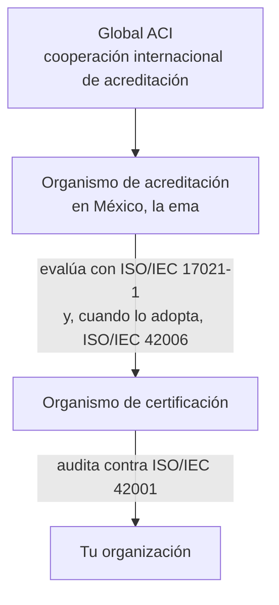
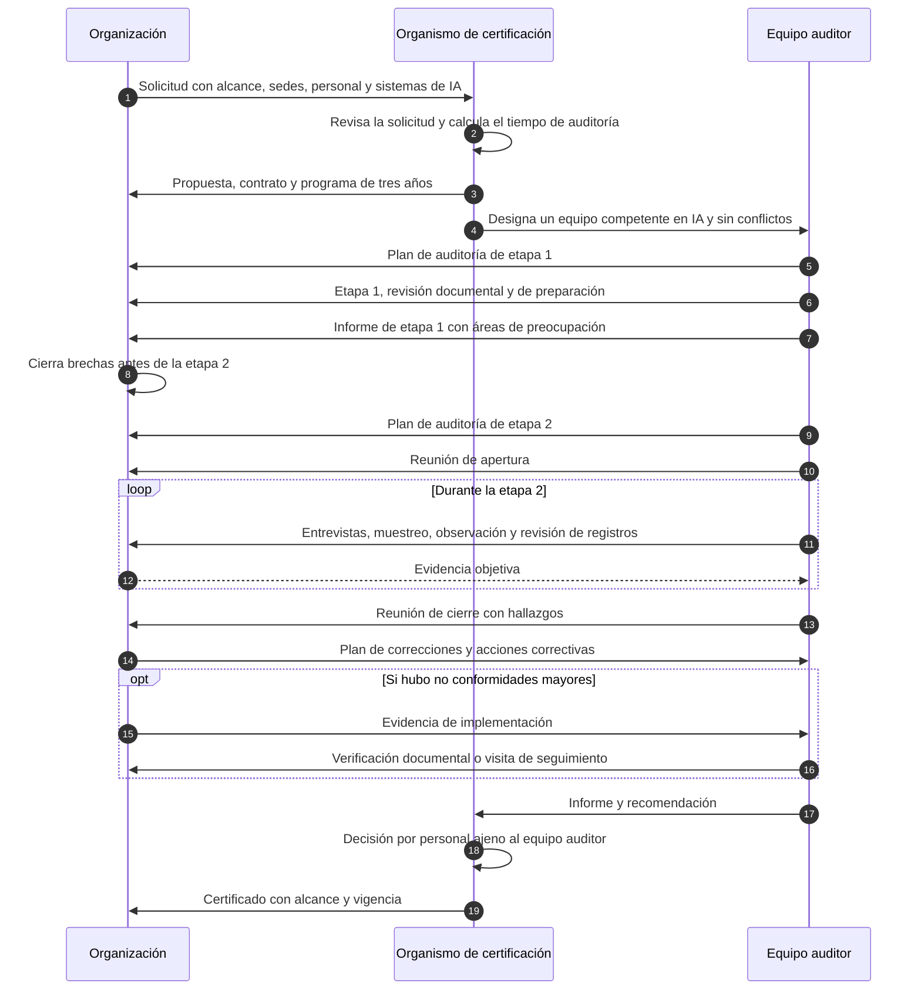
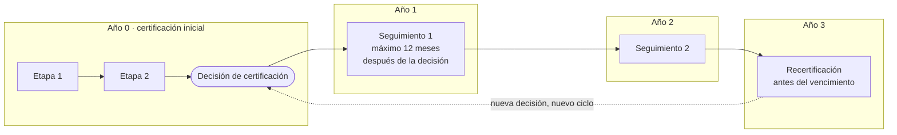

# Cómo se certifica

:material-clipboard-search-outline: Auditoría
:material-clock-outline: 20 min de lectura

!!! abstract "En una frase"
    Certificarte en ISO/IEC 42001 significa que un organismo de certificación (OC), de preferencia acreditado para esta norma, audita tu SGIA en dos etapas, decide si cumple y regresa cada año durante un ciclo de tres años para comprobar que el sistema sigue vivo, no solo que existió el día de la foto.

## Antes de empezar: qué se certifica y qué no

Un certificado ISO/IEC 42001 es la declaración de un tercero independiente de que tu sistema de gestión de IA, **dentro de un alcance definido**, cumple los requisitos de las cláusulas 4 a 10 y opera los controles que tu Declaración de Aplicabilidad (SoA) marca como aplicables. Nada más, y nada menos.

No certifica que un modelo sea preciso, justo o seguro; no certifica un producto; no equivale a cumplir una ley. Lo que dice es que existe un sistema que define criterios, evalúa riesgos e impactos, aplica controles, mide, detecta fallas y las corrige, y que ese sistema funciona. En [Mitos y realidades](../empieza-aqui/mitos-y-realidades.md) desarmamos las confusiones más comunes.

Conviene ubicar la certificación entre los tres tipos de auditoría que describe ISO 19011, la guía de referencia para auditar sistemas de gestión, cuya cuarta edición se publicó en 2026[^19011]:

| Tipo | Quién audita | Ejemplo en nuestro universo |
|---|---|---|
| Primera parte | La propia organización, o alguien contratado para hacerlo en su nombre | La [auditoría interna](../clausulas/c9-evaluacion-del-desempeno.md#c-9-2) que Contadores Alameda encarga a un auditor externo antes de pensar en certificarse |
| Segunda parte | Un cliente o alguien con interés directo audita a su proveedor | El banco cliente de Contadores Alameda que, además de su cuestionario, pide revisar evidencias en sitio |
| Tercera parte | Un organismo independiente, sin interés en el resultado | El OC que audita a Monarca Crédito y le emite el certificado |

### Es voluntaria

ISO/IEC 42001 es una norma voluntaria: la decisión de certificarte es de negocio. Si un contrato, una licitación o una regulación te la exige, esa obligación nace de afuera y no de la norma (revisa [México y Latinoamérica](../integracion/contexto-mexico-latam.md) y el [Reglamento de IA de la UE](../integracion/reglamento-ia-ue.md)). En nuestro universo de casos:

- **Monarca Crédito** busca el certificado para respaldar una ronda de inversión y alianzas con bancos.
- **Conversa Labs** lo quiere porque cada venta trae un cuestionario de IA y seguridad; el certificado no lo elimina, pero convierte muchas respuestas en "aquí está la evidencia auditada".
- **Contadores Alameda** decidirá después de un primer ciclo completo con auditoría interna y revisión por la dirección ([por qué](../empieza-aqui/necesito-iso42001.md#alinearte)).

!!! auditor "Lo que el certificado le dice a un tercero"
    En la reunión de cierre de una auditoría es común que alguien pregunte si "ya pueden decir que su IA está certificada". La respuesta honesta es no. Pueden decir que su **sistema de gestión de IA** está certificado para un alcance concreto. Si un cliente lee el certificado y entiende que el modelo no discrimina, el problema de reputación lo tendrás tú, no el OC.

## Acreditación frente a certificación

Son dos palabras que se usan como sinónimos y no lo son:

- **Certificación:** un OC audita a tu organización contra ISO/IEC 42001 y, si cumple, emite el certificado.
- **Acreditación:** un organismo de acreditación evalúa al OC (su imparcialidad, la competencia de sus auditores, sus métodos) y le reconoce formalmente la capacidad de certificar en un esquema determinado. En México ese papel lo cumple la entidad mexicana de acreditación (ema).

!!! tip "Analogía"
    Piensa en un laboratorio clínico. Cualquier laboratorio puede entregarte resultados en papel membretado; uno acreditado fue evaluado por un tercero que revisó sus métodos, sus equipos y la competencia de su personal. Ambos te dan un papel; solo uno trae detrás una revisión independiente de cómo se produjo ese papel. Con los certificados pasa lo mismo.

| Concepto | Quién lo hace | A quién | Con qué norma |
|---|---|---|---|
| Acreditación | Organismo de acreditación (ema, ANAB, UKAS…) | Al OC | ISO/IEC 17021-1, complementada por ISO/IEC 42006 para el esquema de IA |
| Certificación de sistemas de gestión | OC | A tu organización | ISO/IEC 42001 |
| Certificación de personas | Organismo certificador de personas | A auditores e implementadores | ISO/IEC 17024, cuya tercera edición se publicó en 2026[^17024] |

Dos aclaraciones que evitan malentendidos:

1. **Un auditor con credencial "Lead Auditor 42001" no certifica a tu empresa.** Esa credencial certifica a una persona; solo un OC certifica sistemas de gestión.
2. **Existen certificados no acreditados.** No son ilegales, pero detrás no hay un tercero que haya revisado al OC. Muchos bancos, aseguradoras y clientes corporativos piden expresamente un certificado emitido bajo acreditación. Antes de contratar, pregunta qué te va a pedir tu cliente.

!!! warning "Cuidado con los atajos"
    Desconfía de ofertas de "certificación en 30 días", de constancias que se entregan al terminar un curso y, sobre todo, de paquetes que incluyen implementación y certificación con la misma empresa. ISO/IEC 17021-1 le prohíbe al OC dar consultoría sobre el sistema de gestión que luego certificará; si la consultora y el OC están vinculados, el certificado pierde justo lo que lo hace valioso: la imparcialidad.

### El cambio de 2026 en el esquema internacional

Durante décadas, el reconocimiento internacional de las acreditaciones descansó en dos redes: IAF, para sistemas de gestión, e ILAC, para laboratorios. Desde el 1 de enero de 2026 dejaron de operar por separado y funcionan como **Global Accreditation Cooperation Incorporated (Global ACI)**, con un único acuerdo de reconocimiento multilateral (*Multilateral Recognition Arrangement*, MRA) que abarca lo que antes cubrían el acuerdo de IAF (MLA) y el de ILAC. Las acreditaciones existentes siguen reconocidas durante la transición[^globalaci]. ISO, por su parte, contabiliza en su encuesta anual los certificados emitidos por organismos acreditados por miembros de Global ACI y cargados en la base IAF CertSearch[^survey].

Hay un matiz importante para 42001. El último anexo de alcances del acuerdo de IAF que pudimos consultar, con corte a finales de 2024, **no incluía ISO/IEC 42001** como subalcance; sí incluía, por ejemplo, ISO/IEC 27001 con su norma complementaria ISO/IEC 27006[^mla]. No sabemos si el nuevo acuerdo de Global ACI ya lo incorporó. En la práctica:

- No des por hecho que un certificado 42001 acreditado tiene "reconocimiento internacional" en el mismo sentido que uno de ISO 9001 o ISO 27001.
- Pregunta al OC, y pide la respuesta por escrito, si su acreditación para 42001 está cubierta por el acuerdo multilateral vigente.
- Si vendes fuera de tu país, pregunta también a tu cliente qué acreditación reconoce.

## Las reglas para el organismo: ISO/IEC 17021-1 e ISO/IEC 42006

### ISO/IEC 17021-1, la base común

ISO/IEC 17021-1 es la norma que deben cumplir todos los OC que certifican sistemas de gestión, sea ISO 9001, ISO 27001 o ISO 42001. Fija, entre otras cosas, la exigencia de imparcialidad, la competencia del personal, la secuencia de la auditoría inicial en dos etapas, las auditorías de seguimiento y de recertificación, y la regla de que la decisión de certificar la tome personal distinto del que auditó. La edición vigente es la de 2015, que entró a revisión sistemática en octubre de 2025; al momento de nuestra consulta no había decisión publicada sobre si se confirma o se revisa, así que podría haber una nueva edición en los próximos años[^17021].

### ISO/IEC 42006, lo específico de la IA

ISO/IEC 42006:2025 se publicó el 7 de julio de 2025. Agrega requisitos a ISO/IEC 17021-1 para los OC que auditan y certifican un SGIA conforme a ISO/IEC 42001; **no la reemplaza, la complementa**, y puede usarse como documento de criterios para la acreditación o para evaluaciones entre pares[^42006]. Su índice oficial permite saber qué temas regula:

| Qué regula ISO/IEC 42006 | Qué significa para ti |
|---|---|
| Competencia del personal, con requisitos técnicos genéricos y específicos | Puedes esperar, y conviene exigir, que el equipo auditor entienda de IA, no solo de sistemas de gestión |
| Demostración del conocimiento y la experiencia del personal | Es razonable pedir al OC los perfiles de los auditores asignados |
| Determinación del tiempo de auditoría, con un anexo normativo de método y otro informativo con ejemplos de cálculo | Los días de auditoría no se inventan: el OC debe poder explicarte cómo los calculó |
| Uso de la auditoría remota | Parte de la auditoría puede hacerse a distancia, dentro de reglas |
| Auditoría inicial, actividades de seguimiento y recertificación | El ciclo es el de 17021-1, con consideraciones propias del SGIA |
| Plantilla informativa de documento de certificación | Orienta qué información aparece en tu certificado |

Fuentes secundarias coinciden en que, en la versión publicada, el cálculo del tiempo de auditoría depende sobre todo del **número de personas que hacen trabajo relacionado con la IA** y del **rol de la organización** frente a la IA, es decir, si la usa, la desarrolla o la provee[^scc]. Traducido a preparación: cuando el OC te envíe su cuestionario de solicitud, ten a la mano cuántas personas desarrollan, operan, supervisan o gestionan sistemas de IA, y qué rol tienes en cada sistema del inventario. Si subestimas esa cifra, el cálculo de días saldrá corto y el ajuste llegará a mitad del proceso.

!!! note "Lo que no sabemos y no vamos a inventar"
    Solo verificamos el índice y el alcance de ISO/IEC 42006. La fórmula concreta del tiempo de auditoría, los umbrales y los porcentajes que circulan en blogs no los pudimos contrastar con el texto oficial, así que no los repetimos aquí. Tampoco encontramos un plazo oficial para que los OC acreditados con el borrador pasen a la versión publicada. Pide al OC que te muestre su cálculo de días y que te diga si su acreditación ya incorpora ISO/IEC 42006.

## Cómo elegir organismo de certificación

Elegir OC es una decisión de tres años, como mínimo. Estos son los criterios que revisaríamos, en orden de importancia:

| Criterio | Qué preguntar | Señal de alerta |
|---|---|---|
| Acreditación específica para ISO/IEC 42001 | ¿Quién los acredita para 42001? ¿Me comparten el documento de acreditación con ese programa? | "Estamos acreditados en ISO 27001, es casi lo mismo" |
| Vigencia en el directorio del acreditador | Verifícalo tú en el directorio público, no en el folleto | Solo muestran el logotipo del acreditador |
| ISO/IEC 42006 | ¿Su acreditación ya incorpora 42006? Si no, ¿cuándo? | Respuestas vagas o desconocimiento de la norma |
| Competencia del equipo en IA | Perfiles de los auditores: formación y experiencia en aprendizaje automático, IA generativa, datos | Un solo auditor de 27001 sin formación en IA para un sistema de *scoring* |
| Experiencia en tu sector y rol | ¿Han auditado fintechs, empresas SaaS o despachos de servicios? | Ninguna experiencia en organizaciones que desarrollan IA, si tú la desarrollas |
| Transparencia en días y costos | ¿Cómo calcularon los días? ¿Qué pasa si cambia el alcance? | Una cifra cerrada sin haberte preguntado cuántas personas trabajan con IA |
| Imparcialidad | ¿Tienen o tuvieron relación de consultoría con nosotros o con nuestra consultora? | Paquetes de "implementación más certificación" |
| Reconocimiento ante tus clientes | ¿Su certificado lo aceptan los bancos, aseguradoras o clientes extranjeros con los que trabajamos? | No lo saben ni lo preguntan |
| Registro del certificado | ¿Cargan sus certificados en IAF CertSearch? | El certificado no se puede verificar en ninguna base pública |
| Integración con ISO 27001 | Si ya tienes un SGSI: ¿pueden hacer auditoría combinada o integrada? | Exigen dos procesos totalmente separados sin explicar por qué |
| Idioma y logística | ¿Auditan y entregan el informe en español? ¿Qué parte puede ser remota? | Auditores que necesitan intérprete para entrevistar a tu personal operativo |

### En México: la ema

Al 9 de octubre de 2026, el buscador público de la ema (SAEMA), en la categoría de organismos de certificación de sistemas, tenía el programa ISO/IEC 42001:2023 y devolvía **dos organismos acreditados**[^ema]:

- **Normalización y Certificación NYCE, S.C.**, con el programa 42001 vigente desde el 8 de diciembre de 2024.
- **International Quality Solution Register, S.A. de C.V. (QSR)**, con el programa 42001 vigente desde el 30 de julio de 2025.

En ambas fichas, la norma de acreditación es ISO/IEC 17021-1:2015 y no se menciona ISO/IEC 42006. Tres consejos prácticos:

- **Consulta el buscador, no la página descriptiva.** La página general de la ema que enumera las normas de sistemas de gestión no menciona 42001 y está desactualizada; manda el buscador por programa.
- **Verifica el directorio vigente antes de decidir.** La lista cambia: pueden sumarse organismos o modificarse alcances. Lo que aquí anotamos es una foto a la fecha de consulta.
- **No busques una NMX.** No encontramos una norma mexicana equivalente a ISO/IEC 42001; las acreditaciones de la ema se basan directamente en la norma internacional[^ema].

!!! latam "Si tu OC viene de fuera"
    En México y en el resto de la región también operan OC acreditados por organismos de otros países. Es válido contratarlos; lo importante es verificar en el directorio de *su* acreditador que el programa 42001 está vigente y confirmar que tus clientes aceptan esa acreditación.

### Fuera de México

Esto encontramos sobre otros acreditadores. Mencionarlos no es una recomendación, y la columna de la derecha te dice qué tan firme es cada dato[^otros]:

| Acreditador | País | Qué encontramos | Tipo de fuente |
|---|---|---|---|
| ANAB | EE. UU. | Tiene un programa para ISO/IEC 42001. SGS, DQS y BSI anunciaron su acreditación ANAB entre abril de 2025 y marzo de 2026 | Secundaria (comunicados de las empresas) |
| UKAS | Reino Unido | Otorgó su primera acreditación para SGIA a BSI tras un piloto; BSI dice estar acreditada también por RvA (Países Bajos) | Secundaria |
| SCC | Canadá | Hizo un piloto y acreditó a su primer organismo con el borrador de 42006; los nuevos solicitantes se evalúan con la versión publicada | Secundaria |
| JAS-ANZ | Australia y Nueva Zelanda | Opera un esquema para SGIA; Intertek SAI Global anunció ser el primer acreditado | Secundaria |
| ISMS-AC | Japón | Opera un esquema de evaluación de la conformidad de SGIA con ISO/IEC 42001 (JIS Q 42001:2025) | Primaria |
| DAkkS y ENAC | Alemania y España | No encontramos registro ni nota oficial de acreditaciones para 42001 | Sin dato verificable |

Para **Conversa Labs**, que tiene un cliente en España, la pregunta útil no es "¿qué OC es el mejor?", sino "¿qué acreditación acepta ese cliente?". Hazla antes de firmar con el OC.

!!! info "¿Cuántas organizaciones están certificadas en el mundo?"
    No existe una cifra oficial verificable. La encuesta anual de ISO (*ISO Survey*) se compila desde 2025 con datos de IAF CertSearch, pero la sección de esa base dedicada a la encuesta cubre datos hasta 2024, y no encontramos datos oficiales de 42001[^survey]. Circulan cifras en notas de prensa que no pudimos contrastar. Si necesitas el dato para un análisis, consulta IAF CertSearch directamente y anota la fecha.

## El ciclo de certificación, paso a paso

Así se ve la secuencia completa de una certificación inicial, desde la solicitud hasta el certificado:

### Solicitud, propuesta y programa

Todo empieza con un cuestionario del OC: alcance propuesto, sedes, número de personas, procesos subcontratados, otras certificaciones y, en el caso de 42001, qué sistemas de IA hay en el alcance, qué rol tienes en cada uno y cuántas personas trabajan con ellos. Con eso el OC calcula los días de auditoría y te envía una propuesta. Al firmar, recibes un **programa de auditoría** para el ciclo completo: qué se audita en la certificación inicial, en cada seguimiento y en la recertificación.

Lee el contrato con atención en tres puntos: qué cambios estás obligado a notificar (de alcance, de sedes, de propiedad, y en nuestra lectura también cambios significativos en sistemas de IA de alto impacto), en qué casos el OC puede hacer auditorías con poco aviso y cuáles son las reglas para usar la marca de certificación.

### Etapa 1: ¿estás listo?

La auditoría de etapa 1 responde a una pregunta: ¿vale la pena hacer la etapa 2? El equipo auditor revisa tu información documentada y tu nivel de preparación: que el alcance esté bien definido, que entiendas tu contexto y tus roles frente a la IA, que existan la política, la metodología de riesgos con sus criterios, el proceso de evaluación de impacto, la SoA y los objetivos, y que ya hayas hecho al menos una auditoría interna y una revisión por la dirección. También aprovecha para conocer tus sedes, tus sistemas y a tu gente, y para planear la etapa 2.

Puede hacerse en sitio, a distancia o de forma mixta. El resultado es un informe que señala **áreas de preocupación** (*areas of concern*): huecos que, si siguen ahí en la etapa 2, se convertirán en no conformidades. No es raro que la etapa 1 concluya que la organización no está lista y que la etapa 2 se reprograme.

!!! auditor "Lo que más retrasa una etapa 2"
    En campo, lo que con más frecuencia frena el paso a la etapa 2 no es un control sofisticado del Anexo A, sino lo básico: una auditoría interna que no cubrió todo el alcance, una revisión por la dirección sin conclusiones, evaluaciones de impacto que existen para un sistema pero no para los demás, o una SoA que excluye controles sin justificación ligada al riesgo.

### Entre etapas: cierre de brechas

El tiempo entre etapas lo acuerdas con el OC según el tamaño de las brechas. Lo habitual son algunas semanas; algunos OC fijan un máximo (con frecuencia, alrededor de seis meses) después del cual repiten la etapa 1. Usa ese tiempo para cerrar las áreas de preocupación **con evidencia de operación**, no solo con documentos nuevos: un procedimiento redactado la semana anterior a la etapa 2, sin registros de que se aplicó, sigue siendo una brecha.

### Etapa 2: ¿funciona?

La etapa 2 evalúa la implementación y la eficacia del SGIA, casi siempre en sitio y con la mayor parte del tiempo de auditoría. La estructura típica es:

1. **Reunión de apertura.** Se confirman alcance, plan, horarios, reglas de confidencialidad, acompañantes y la forma de comunicar hallazgos.
2. **Entrevistas, muestreo y observación.** El equipo entrevista a la alta dirección, al responsable del SGIA, a los dueños de los sistemas, a ciencia de datos, a compras y a quienes supervisan las salidas de la IA; toma muestras (evaluaciones de impacto, cambios, incidentes, decisiones revisadas por personas) y sigue hilos de trazabilidad de punta a punta. Las técnicas y preguntas están en [Preguntas del auditor](preguntas-del-auditor.md).
3. **Reuniones diarias de avance.** Un buen auditor no guarda sorpresas para el final: comenta cada día lo que va encontrando.
4. **Reunión de cierre.** Se presentan los hallazgos clasificados (no conformidades mayores, menores y oportunidades de mejora), la recomendación preliminar y los plazos para responder.

Después recibes el informe. Cómo se redacta un hallazgo y cómo responderlo lo explicamos en [Hallazgos de ejemplo](hallazgos-ejemplo.md).

### Decisión y certificado

El equipo auditor no certifica: **recomienda**. La decisión la toma personal del OC que no participó en la auditoría, después de revisar el informe, los hallazgos y tu respuesta. Si la decisión es favorable, recibes el certificado. ISO/IEC 42006 incluye una plantilla informativa para el documento de certificación[^42006]; en la práctica, el certificado identifica a la organización, la norma y su edición, el alcance, las sedes y las fechas.

### Seguimiento y recertificación

El ciclo de certificación dura tres años y **empieza con la decisión de certificación**, no con la etapa 2. Según la forma en que IAF y algunos OC citan ISO/IEC 17021-1, las auditorías de seguimiento se hacen al menos una vez por año calendario, salvo en el año de recertificación, y la primera no puede programarse más allá de 12 meses después de la decisión de certificación. La recertificación ocurre en el tercer año, antes del vencimiento[^ciclo]. La frase "el certificado vale tres años" que se repite en el mercado se deriva de ese ciclo[^ciclo].

Las auditorías de seguimiento son más cortas que la inicial y trabajan por muestreo, pero suelen revisar siempre lo mismo: auditoría interna y revisión por la dirección del periodo, atención de las no conformidades anteriores, quejas, cambios en el sistema y en el contexto, avance de los objetivos y uso correcto del certificado. Lo demás se rota para que, a lo largo del ciclo, se cubra todo el alcance.

La **recertificación** revisa el sistema completo y su desempeño durante el ciclo. Programa la auditoría con margen: la decisión de recertificación debe tomarse antes de que venza el certificado. Si se vence, algunos OC permiten restablecerlo en un plazo limitado con una auditoría de recertificación y otros te piden empezar de cero; pregúntalo al firmar.

Fuera del calendario pueden presentarse **auditorías especiales**: para ampliar el alcance (por ejemplo, cuando Conversa Labs agregue un nuevo producto de IA), o con poco aviso cuando el OC recibe quejas graves o se entera de cambios o incidentes significativos.

## Qué pasa con las no conformidades

Una no conformidad (NC) es el incumplimiento de un requisito: de la norma, de tus propios procedimientos o de lo que declaraste en la SoA. Los OC las clasifican en mayores y menores; muchos registran además oportunidades de mejora u observaciones.

| Tipo | Criterio profesional habitual | Qué te pedirán | Efecto en la certificación |
|---|---|---|---|
| NC mayor | Ausencia de un requisito, falla sistémica o falla que pone en duda que el SGIA logre sus resultados; también varias menores sobre el mismo requisito | Corrección, análisis de causa, acción correctiva **y evidencia de implementación** antes de decidir | No hay certificado mientras no se cierre; en seguimiento puede llevar a suspensión |
| NC menor | Falla aislada o parcial que no compromete la capacidad del sistema | Plan de corrección y acción correctiva aceptado por el OC | No impide la certificación; la eficacia se verifica en la siguiente auditoría |
| Oportunidad de mejora u observación | Algo que cumple pero podría fallar o mejorar | Nada obligatorio; conviene analizarla | Ninguno, aunque una observación ignorada puede volver como NC |

Los plazos **no son universales**: cada OC fija los suyos. Como práctica habitual, verás plazos de dos a cuatro semanas para enviar el plan de acciones y de uno a tres meses para demostrar el cierre de las mayores. Muchos OC aplican además un límite de alrededor de seis meses contados desde el último día de la etapa 2: si para entonces no pudieron verificar el cierre de las mayores, repiten la etapa 2 antes de recomendar la certificación. Confirma los plazos de tu OC por escrito antes de la auditoría.

!!! auditor "Corrección no es acción correctiva"
    Si el hallazgo dice que tres de diez evaluaciones de impacto no se actualizaron tras un cambio de modelo, actualizar esas tres es la **corrección**. La **acción correctiva** responde por qué el proceso permitió que pasara (¿el control de cambios no exige la evaluación?, ¿nadie avisa al responsable?) y cambia el proceso para que no se repita. Un plan que solo corrige la muestra no cierra una mayor. Ver el detalle en [Hallazgos de ejemplo](hallazgos-ejemplo.md).

## El alcance del certificado

El alcance es la frase más importante del certificado, porque dice qué cubre y qué no. En un SGIA conviene que deje claros tres elementos: **las actividades o servicios**, **los sistemas o productos de IA** y **el rol** de la organización frente a ellos, además de las sedes. Ejemplos con nuestro universo:

| Organización | Alcance razonable | Alcance engañoso |
|---|---|---|
| Contadores Alameda | Uso de sistemas de IA de terceros en la prestación de servicios contables, de nómina y de atención a clientes desde la oficina de Querétaro | "Gestión de inteligencia artificial", sin decir que solo usa IA de terceros |
| Monarca Crédito | Desarrollo, operación y uso de modelos de aprendizaje automático para originación y asignación de línea de microcréditos en la app, y uso de un servicio externo de detección de fraude | Solo "uso de IA para originación", omitiendo que desarrolla sus modelos |
| Conversa Labs | Diseño, desarrollo, operación y provisión como servicio de la plataforma Conversa de asistentes virtuales con IA generativa | Excluir la canalización de recuperación (RAG) o el traspaso a agente humano para "simplificar" la auditoría |

Reglas prácticas:

- **No se excluyen cláusulas.** Las cláusulas 4 a 10 aplican siempre. Lo que se justifica es la exclusión de controles del Anexo A en la SoA.
- **El alcance tiene que ser creíble.** Si dejas fuera justo el sistema que más afecta a personas, el auditor preguntará por qué, y tus clientes también.
- **Comunica con precisión.** "Nuestro sistema de gestión de IA está certificado en ISO/IEC 42001 para [alcance]" es correcto; un sello de certificación sobre la pantalla de tu chatbot sugiere una certificación de producto que no existe. Cada OC tiene reglas de uso de su marca: léelas.
- **Al revisar el certificado de un proveedor,** confirma que el alcance incluye el servicio que contratas, que está vigente, quién lo acreditó y si aparece en una base pública. Que BotNorte tuviera su propio certificado no cubriría a Contadores Alameda.

!!! latam "Una sola norma, varias portadas"
    El certificado hace referencia a ISO/IEC 42001:2023. En España, UNE publicó la versión en español como UNE-ISO/IEC 42001:2025, y en Europa existe la adopción EN ISO/IEC 42001:2026, que reproduce la norma internacional sin cambios[^adopciones]. Para un cliente europeo de Conversa Labs, el contenido de los requisitos es el mismo.

## Auditoría combinada o integrada con ISO 27001

Si ya tienes un SGSI certificado, lo natural es aprovecharlo. Hay dos modalidades que conviene distinguir:

- **Auditoría combinada.** Dos auditorías (ISO 27001 e ISO 42001) en las mismas fechas, con equipos que pueden compartir integrantes, pero con planes, criterios y, a menudo, informes separados.
- **Auditoría integrada.** Una sola auditoría de un sistema de gestión integrado: los elementos comunes (contexto, liderazgo, información documentada, competencia, auditoría interna, revisión por la dirección, acciones correctivas) se auditan una vez para ambas normas, y los específicos de cada una se auditan por separado.

La reducción de días por integración no es automática: depende de qué tan integrado esté **de verdad** tu sistema (una sola auditoría interna, una sola revisión por la dirección, una sola metodología de riesgos con criterios propios para IA) y la decide el OC con sus reglas. Así como ISO 27001 tiene su norma complementaria para OC (ISO/IEC 27006), 42001 tiene la suya en 42006: cada norma conserva su propio cálculo de tiempo.

| Elemento | Se puede auditar en común | Necesita tiempo propio de 42001 |
|---|---|---|
| Contexto, partes interesadas y alcance | Sí, si el análisis cubre ambos sistemas | Propósito previsto y roles frente a la IA (4.1) |
| Política y roles | Parcialmente | Política de IA y roles de IA |
| Riesgos | La metodología puede ser común | Consecuencias para individuos y sociedades; evaluación de impacto ([6.1.4](../clausulas/c6-planificacion.md#c-6-1-4)) |
| Controles | Proveedores, registros de eventos, incidentes (ISO 27001 A.5.19 y siguientes) | Ciclo de vida, datos, información a partes interesadas, uso responsable (A.5 a A.9) |
| Auditoría interna, revisión por la dirección, mejora | Sí, si son realmente únicas | Entradas y conclusiones específicas del SGIA |

Consejos que vienen de auditorías reales:

- **Alinea los ciclos.** Si tu certificado 27001 vence en un año y quieres 42001 ahora, pregunta al OC cómo sincronizar fechas; algunos ofrecen ajustar el ciclo de una de las dos normas.
- **Pide un equipo mixto.** Un auditor de 27001 con mucha experiencia puede pasar por alto la evaluación de impacto o la supervisión humana; un experto en IA sin experiencia en sistemas de gestión puede perderse en la técnica. Lo ideal es un equipo que combine ambos perfiles.
- **No fuerces la integración en papel.** Dos SoA, dos metodologías y dos revisiones por la dirección con una portada común no son un sistema integrado; el auditor lo notará en la primera entrevista.

Más detalle sobre cómo se cruzan ambas normas en [Integración con ISO 27001](../integracion/con-iso27001.md).

## Cómo prepararte para la etapa 1 y la etapa 2

La preparación completa, en formato de lista de verificación, está en el [Checklist de preparación](checklist-preparacion.md). Aquí va lo que el auditor te pedirá en cada etapa:

=== "Etapa 1"

    | Te pedirán | Qué revisan | Señal de alerta |
    |---|---|---|
    | Alcance documentado | Límites, sedes, sistemas de IA y rol en cada uno | Alcance genérico que no menciona sistemas ni rol |
    | Inventario de sistemas de IA | Que coincida con el alcance y con la realidad | Herramientas en uso que no aparecen en el inventario |
    | Contexto, partes interesadas y requisitos legales | Que incluyan los temas propios de la IA y las jurisdicciones donde operas | Copia del análisis de contexto del SGSI sin una sola línea sobre IA |
    | Política de IA y roles | Aprobación de la alta dirección, comunicación, responsables nombrados | Política firmada por TI, sin evidencia de comunicación |
    | Metodología y resultados de riesgos | Criterios de aceptación, consecuencias para personas y sociedades, plan de tratamiento aprobado y riesgos residuales aceptados | Matriz de riesgos solo de seguridad de la información |
    | Proceso y resultados de evaluación de impacto | Al menos los sistemas de mayor impacto evaluados | "La haremos antes de la etapa 2" |
    | Declaración de Aplicabilidad | 38 controles revisados, justificaciones ligadas al riesgo | Exclusiones con justificaciones genéricas |
    | Objetivos de IA | Medibles cuando sea factible, con plan y responsable | Objetivos que nadie mide |
    | Auditoría interna y revisión por la dirección | Un ciclo completo que cubra todo el alcance | Auditoría interna hecha por quien implementó el sistema |

=== "Etapa 2"

    | Te pedirán | Qué revisan | Señal de alerta |
    |---|---|---|
    | Registros de operación de varios meses | Que los procesos se aplican de forma constante; muchos OC esperan algunos meses de operación, con frecuencia alrededor de tres | Todos los registros fechados la semana anterior |
    | Evaluaciones de riesgo e impacto por sistema | Que se repiten ante cambios significativos y alimentan el tratamiento | La versión vigente del modelo no tiene evaluación |
    | Expediente de un sistema de punta a punta | Requisitos, datos, pruebas con criterios de aceptación, aprobación del despliegue, monitoreo | Pruebas sin criterio de aceptación definido antes |
    | Tableros y registros de eventos | Que existen, se revisan y las alertas se atienden | Alertas que llegan a un buzón que nadie lee |
    | Incidentes y su comunicación | Registro, análisis, comunicación a usuarios o clientes | "No hemos tenido incidentes" en un chatbot con miles de conversaciones |
    | Evaluación de proveedores de IA | Antes de contratar y tras cambios relevantes | Evaluación inicial y nada más |
    | Entrevistas al personal operativo | Que la supervisión humana y el uso responsable son reales | Respuestas memorizadas que no coinciden con los registros |

=== "Durante la auditoría"

    - Nombra un **guía** por área que conozca el sistema y pueda localizar evidencia en minutos.
    - Ten una sala o un canal con acceso a los repositorios; muchas auditorías se atrasan esperando permisos.
    - Responde lo que se pregunta y muestra la evidencia; si no sabes, di quién sabe y búscalo.
    - No escondas incidentes: un incidente bien gestionado demuestra que el sistema funciona; un registro vacío en un sistema con miles de interacciones despierta sospechas.
    - Anota cada hallazgo comentado en las reuniones diarias y aclara en el momento lo que creas que es un malentendido, con evidencia, no con argumentos.

!!! warning "Lo que no conviene hacer"
    - Crear documentos la noche anterior: las fechas de creación en el repositorio se ven, y un procedimiento sin registros de uso no demuestra nada.
    - Ensayar respuestas con el personal: el auditor contrasta lo que dice cada persona con los registros, y las respuestas aprendidas se notan.
    - Pedir al auditor que te diga cómo resolver un hallazgo: no puede darte consultoría; su papel es evaluar.

## Ejemplo: el primer ciclo de Monarca Crédito

??? example "Caso: Monarca Crédito — de la solicitud al primer seguimiento"
    | Momento | Qué pasa |
    |---|---|
    | Mes 0 | Monarca envía la solicitud: alcance con IA-01 (Score Monarca v3), IA-02 (asignación de línea) e IA-03 (API de fraude de un tercero); rol de productor y usuario en IA-01 e IA-02, y de cliente en IA-03; número de personas en ciencia de datos, riesgos, MLOps y analistas de la banda gris. El OC pide aclarar cuántos analistas supervisan decisiones, porque afecta el cálculo de días. |
    | Mes 1 | Propuesta con el cálculo de días explicado, perfiles de la auditora líder y de un experto técnico en aprendizaje automático, y programa de tres años. |
    | Mes 2 | Etapa 1. Áreas de preocupación: IA-02 no tiene evaluación de impacto propia ("deriva de IA-01", argumenta el equipo) y la SoA excluye [A.7.5](../anexo-a/a7-datos.md#a-7-5) con una justificación genérica. |
    | Meses 2 a 4 | El Comité de Modelos aprueba la evaluación de impacto de IA-02 y el registro de procedencia de datos entra en operación; la SoA se corrige. |
    | Mes 4 | Etapa 2: entrevistas al Director de Riesgos, al Líder de Ciencia de Datos, al Oficial de Privacidad y a tres analistas de la banda gris; trazabilidad de IA-01 desde requisitos hasta monitoreo; muestreo de reconsideraciones de clientes. Resultado: dos NC menores y tres oportunidades de mejora. |
    | Mes 4 y medio | Monarca envía el plan de acciones con análisis de causa; el OC lo acepta. |
    | Mes 5 | Decisión de certificación por un revisor del OC ajeno a la auditoría. Empieza el ciclo. |
    | Mes 16 | Primer seguimiento, dentro de los 12 meses posteriores a la decisión: verifica la eficacia de las acciones de las menores y revisa el cambio a Score Monarca v3.1. |
    | Mes 28 | Segundo seguimiento. |
    | Antes del mes 41 | Recertificación, programada con margen para que la decisión llegue antes del vencimiento. |

## Sigue leyendo

- [Preguntas del auditor](preguntas-del-auditor.md): la guía de entrevista por cláusula y por control.
- [Hallazgos de ejemplo](hallazgos-ejemplo.md): cómo se redactan y cómo se responden.
- [Checklist de preparación](checklist-preparacion.md): lo que debes tener listo, con calendario.
- [Auditoría interna (9.2)](../clausulas/c9-evaluacion-del-desempeno.md#c-9-2) y [Documentación requerida](../implementacion/documentacion-requerida.md).
- [Ruta de lectura para auditores](../empieza-aqui/rutas-de-lectura.md#ruta-auditor).

[^19011]: ISO 19011:2026, *Guidelines for auditing management systems*, 4.ª edición, publicada el 2026-05-27; retiró la edición de 2018. Ficha: <https://www.iso.org/standard/88984.html> (consultada en el espejo committee.iso.org). Consulta: 2026-10-09. Fuente primaria.
[^17024]: ISO/IEC 17024:2026, requisitos para organismos que certifican personas, 3.ª edición, publicada el 2026-03-31; retiró la edición de 2012. Ficha: <https://www.iso.org/standard/86291.html>. Consulta: 2026-10-09. Fuente primaria.
[^globalaci]: Comunicado de prensa sobre Global Accreditation Cooperation Incorporated: <https://ilac.org/wp-content/uploads/Press-Release-Global.pdf>; aviso de cese de operaciones de IAF desde el 1 de enero de 2026: <https://iaf.nu/en/news/iaf-and-iso-publish-joint-communique/>. Consulta: 2026-10-09. Fuente primaria.
[^survey]: ISO, *The ISO Survey*: <https://committee.iso.org/the-iso-survey.html>; soporte de IAF CertSearch sobre la cobertura de la encuesta (datos hasta 2024): <https://support.iafcertsearch.org/certification-bodies/overview/market-intelligence/iso-survey>. Consulta: 2026-10-09. Fuente primaria. Las cifras de organizaciones certificadas que circulan en notas de prensa no son verificables.
[^mla]: IAF, Anexo 1 del alcance del MLA, con corte a finales de 2024 (archivado): <https://iaf.nu/en/annex-1-scope-of-the-mla-2025/>. Consulta: 2026-10-09. Fuente primaria (evidencia negativa: 42001 no aparece). No sabemos si el MRA de Global ACI lo añadió en 2026.
[^17021]: ISO/IEC 17021-1:2015, ficha con su ciclo de vida (revisión sistemática iniciada el 2025-10-15 y cerrada el 2026-03-05, sin decisión publicada): <https://www.iso.org/standard/61651.html>. Consulta: 2026-10-09. Fuente primaria.
[^42006]: ISO/IEC 42006:2025, ficha <https://www.iso.org/standard/44546.html> (publicada el 2025-07-07; su sección de preguntas frecuentes aclara que complementa a ISO/IEC 17021-1) y vista previa oficial de IEC con alcance e índice: <https://webstore.iec.ch/en/publication/108460>. Consulta: 2026-10-09. Fuente primaria; solo verificamos alcance e índice, no el contenido de los anexos.
[^scc]: Standards Council of Canada, boletín sobre la transición a ISO/IEC 42006:2025: <https://scc-ccn.ca/accreditation/bulletins/transition-isoiec-420062025-bodies-providing-audit-and-certification>, y resúmenes de terceros. Consulta: 2026-10-09. Fuente secundaria: no pudimos abrir el boletín directamente.
[^ciclo]: Preguntas frecuentes de IAF que citan la cláusula 9.1.3.3 de ISO/IEC 17021-1: <https://iaffaq.com/files/the-first-surveillan_0zydrd5kt0fbmhentfrcxb/>; Bureau Veritas, proceso de certificación: <https://certification.bureauveritas.com/certification-process>. Consulta: 2026-10-09. Fuente secundaria: el texto oficial de 17021-1 es de pago y está en revisión.
[^ema]: ema, buscador público SAEMA, búsqueda por programa en organismos de certificación de sistemas: <https://ema.mx/saema/ConsultaPublica/Acreditados/Busqueda/OCS>; fichas de NYCE (<https://ema.mx/saema/ConsultaPublica/Acreditados/SeleccionarOrganismo/77>) y QSR (<https://ema.mx/saema/ConsultaPublica/Acreditados/SeleccionarOrganismo/74>). Consulta: 2026-10-09. Fuente primaria. Sobre la ausencia de una NMX equivalente: búsquedas en el DOF sin resultado y página de NYCE sobre 42001 (<https://nyce.org.mx/iso-iec-42001-sistemas-de-gestion-de-inteligencia-artificial-ia/>); evidencia negativa, no verificable de forma concluyente.
[^otros]: ANAB, página del programa ISO/IEC 42001 (no pudimos abrirla): <https://anab.ansi.org/accreditation/iso-iec-42001-artificial-intelligence-management-systems/>; comunicados de SGS (<https://www.sgs.com/en/news/2025/04/sgs-achieves-ansi-anab-accreditation-for-isoiec-42001>), DQS (<https://www.dqsglobal.com/en/about/newsroom/dqs-receives-anab-accreditation-for-iso-iec-42001>) y BSI (<https://www.bsigroup.com/en-US/insights-and-media/media-center/press-releases/2026/march/bsi-secures-anab-accreditation-to-certify-isoiec-42001/>); BSI sobre UKAS y RvA: <https://www.bsigroup.com/en-US/insights-and-media/media-center/press-releases/2025/november/bsi-becomes-the-first-certification-body-accredited-by-ukas-and-rva-to-deliver-certification-for-isoiec-42001/>; piloto de SCC según IAF News: <https://iaf.news/2025/09/30/pilot-first-pathway-to-ai-management-systems-accreditation-readiness/>; Intertek sobre JAS-ANZ: <https://www.intertek.com/news/2025/intertek-achieves-global-jas-anz-accreditation-for-isoiec-420012023-artificial-intelligence-management-system/>; todas fuente secundaria. ISMS-AC, esquema AIMS: <https://isms.jp/english/aims/about.html>, fuente primaria. Consulta: 2026-10-09.
[^adopciones]: UNE, nota de prensa sobre UNE-ISO/IEC 42001:2025: <https://www.une.org/salainformaciondocumentos/NP_Estandar_UNE_ISO_IA.pdf>; EVS (Estonia), EVS-EN ISO/IEC 42001:2026, adopción de EN ISO/IEC 42001:2026 basada en ISO/IEC 42001:2023: <https://www.evs.ee/en/evs-en-iso-iec-42001-2026>. Consulta: 2026-10-09. Fuente primaria.
