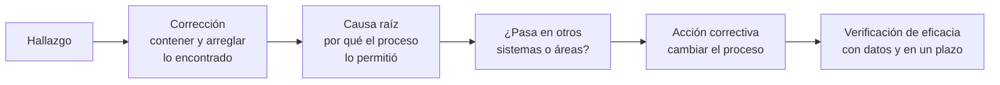

# Hallazgos de ejemplo

:material-clipboard-search-outline: Auditoría
:material-clock-outline: 20 min de lectura

!!! abstract "En una frase"
    Un buen hallazgo dice contra qué requisito se evaluó, qué evidencia objetiva se encontró y cuál es la brecha entre ambos, con tal precisión que otra persona pueda ir a la misma evidencia y llegar a la misma conclusión; todo lo demás (adjetivos, opiniones, recomendaciones) sobra.

## Qué es un hallazgo, y qué no

En el vocabulario de ISO 19011, un hallazgo es el resultado de comparar la evidencia reunida durante la auditoría con los criterios de auditoría. Puede mostrar conformidad o no conformidad, y puede dar pie a oportunidades de mejora. **No es** una impresión general ("el SGIA está verde"), ni un consejo ("deberían comprar tal herramienta"), ni un juicio sobre personas ("el equipo no sabe de sesgos").

### Las tres piezas

| Pieza | Responde a | Qué contiene | Ejemplo breve |
|---|---|---|---|
| **Criterio** | ¿Contra qué se evaluó? | El requisito de la norma (cláusula o control declarado aplicable) y, cuando existe, el documento interno que lo concreta: procedimiento, contrato, ficha del sistema | "6.1.4 y 8.4; procedimiento PR-RIA-04, sección 5" |
| **Evidencia objetiva** | ¿Qué se vio? | Hechos verificables: documentos y registros con identificador y fecha, tamaño de la muestra, cargos de las personas entrevistadas y lo que declararon, observaciones directas | "Registro de despliegue DEP-2026-011; única evaluación disponible: EI-SM-2024-01, de la versión 2" |
| **Declaración del hallazgo** | ¿Qué no se cumple? | La brecha entre criterio y evidencia, en una o dos oraciones | "No se realizó la evaluación de impacto de la versión 3 antes ni después del despliegue" |

En los informes de certificación se agrega una cuarta pieza, implícita o explícita: **por qué el hallazgo recibe esa clasificación**. Escribirla obliga al auditor a justificar su criterio y le permite a la organización entenderlo.

### Cualidades de un buen hallazgo

- **Trazable.** Lleva identificadores, fechas y tamaño de muestra ("3 de 10 cambios revisados"), de modo que cualquiera pueda ubicar la evidencia.
- **Verificable.** Se apoya en lo que el auditor vio o le mostraron, no en rumores ni en lo que "se sabe" de la organización. Lo que dice una persona en entrevista es evidencia, pero conviene corroborarlo.
- **Sin opiniones ni adjetivos.** "Deficiente", "grave" o "pésimo" no aportan; la gravedad se expresa con la clasificación y su justificación.
- **Centrado en el sistema, no en las personas.** Cargos, no nombres; procesos, no culpables.
- **Sin prescribir la solución.** El auditor de un OC no puede dar consultoría. Puede describir la brecha con claridad, pero la forma de cerrarla la decide la organización.
- **Proporcionado.** Una desviación en una muestra de cuarenta no se redacta como si el proceso entero estuviera roto.
- **Comprensible para la alta dirección.** Si la socia directora no entiende qué falla después de leerlo, el hallazgo no está terminado.

!!! auditor "La prueba del desconocido"
    Antes de cerrar el informe, relee cada hallazgo pensando en alguien que no estuvo en la auditoría. ¿Podría ir directo a la evidencia citada? ¿Llegaría a la misma conclusión? ¿Entendería por qué es mayor o menor? Si alguna respuesta es no, falta información o sobra opinión.

## Mayor, menor u oportunidad de mejora

ISO/IEC 17021-1 distingue, en esencia, entre la no conformidad que afecta la capacidad del sistema de gestión para lograr sus resultados previstos (mayor) y la que no la afecta (menor). Aplicar esa idea exige criterio profesional; estas son las señales que se usan con más frecuencia:

| Señal | Tiende a NC mayor | Tiende a NC menor |
|---|---|---|
| Presencia del requisito | El requisito no se aborda en absoluto, o el proceso existe en papel pero nunca se ha ejecutado | El requisito se aborda, pero con una falla parcial |
| Extensión | Falla sistémica: se repite en toda o casi toda la muestra, o en varias áreas | Falla aislada: uno o pocos casos en una muestra que en general cumple |
| Relevancia | Afecta un control que trata riesgos altos o el sistema de mayor impacto en personas | Afecta un elemento secundario o de bajo riesgo |
| Consecuencias | Ya hubo daño, o es probable, sin que el sistema lo detectara | Sin consecuencias observadas, o detectadas y contenidas |
| Acumulación | Varias menores sobre el mismo requisito que, juntas, muestran que el proceso no funciona | Desviaciones independientes entre sí |

Junto a las no conformidades, muchos OC registran **observaciones** u **oportunidades de mejora**: situaciones que hoy cumplen, pero que podrían dejar de hacerlo o que admiten una mejor solución. La terminología varía: algunos OC llaman "observación" a una posible no conformidad que no alcanzó a confirmarse, otros a una sugerencia, y algunos evitan emitir oportunidades de mejora para no rozar la consultoría. Pregunta cómo las usa tu OC.

!!! note "La clasificación se discute con evidencia"
    En la reunión de cierre puedes cuestionar la clasificación de un hallazgo, pero con evidencia que el auditor no haya visto, no con argumentos sobre lo injusto que te parece. La recomendación final la hace el equipo auditor y la decisión de certificación, el OC.

## Cómo leer los ejemplos

Todos los ejemplos usan el mismo formato: tipo, cláusula o control, criterio, evidencia, hallazgo y por qué es de ese tipo. Las empresas, los documentos y las cifras son ficticios y forman parte del [universo de casos](../casos-practicos/index.md) de esta guía. Los nombres de los controles son traducción libre de referencia.

## No conformidades mayores

!!! danger "NC mayor 1 · Monarca Crédito · Score Monarca v3 sin evaluación de impacto"
    | Campo | Contenido |
    |---|---|
    | **Tipo** | No conformidad mayor |
    | **Cláusula / control** | [6.1.4](../clausulas/c6-planificacion.md#c-6-1-4) y [8.4](../clausulas/c8-operacion.md#c-8-4) · [A.5.2](../anexo-a/a5-evaluacion-de-impacto.md#a-5-2) y [A.5.4](../anexo-a/a5-evaluacion-de-impacto.md#a-5-4) |
    | **Criterio** | ISO/IEC 42001, 6.1.4 y 8.4; controles A.5.2 y A.5.4, aplicables según la SoA v2.1. Procedimiento PR-RIA-04 v1.3, sección 5: toda versión nueva de un sistema de IA y todo cambio significativo (incorporar fuentes de datos o variables) requiere evaluación de impacto aprobada antes del despliegue. |
    | **Evidencia** | Score Monarca v3 está en producción desde el 16/03/2026 (registro de despliegue DEP-2026-011, aprobado en la minuta CM-2026-05 del Comité de Modelos). Según el documento de diseño DIS-SM3, sección 2, la v3 incorporó datos de uso de la app y de comportamiento transaccional. La única evaluación de impacto disponible es EI-SM-2024-01, que corresponde a la versión 2 y no contempla esas fuentes. El registro de riesgos RR-IA v4 no contiene riesgos para solicitantes asociados a las nuevas variables. En entrevista, el Director de Riesgos declaró que la evaluación de la v3 "quedó pendiente por la fecha de lanzamiento". |
    | **Hallazgo** | La organización no realizó la evaluación de impacto de Score Monarca v3, ni antes ni después de su despliegue, aunque su propio procedimiento califica el cambio como significativo. En consecuencia, los posibles impactos en solicitantes derivados de las nuevas fuentes de datos no se evaluaron ni se consideraron en la evaluación de riesgos. |
    | **Por qué es mayor** | El requisito está ausente para el sistema con mayor impacto en personas dentro del alcance, que aprueba o rechaza crédito de forma automática en dos de sus tres bandas. No es una omisión documental: el proceso no operó, y sin él el SGIA no puede identificar ni tratar efectos no deseados en individuos, que es uno de sus resultados previstos. |

!!! danger "NC mayor 2 · Contadores Alameda · Sin auditoría interna del SGIA"
    | Campo | Contenido |
    |---|---|
    | **Tipo** | No conformidad mayor |
    | **Cláusula / control** | [9.2](../clausulas/c9-evaluacion-del-desempeno.md#c-9-2) |
    | **Criterio** | ISO/IEC 42001, 9.2.1 y 9.2.2. Programa de auditoría interna PAI-2026, aprobado por la Socia directora, que prevé auditar todo el SGIA en el segundo trimestre de 2026. |
    | **Evidencia** | No se presentó informe de auditoría interna del SGIA. El documento que se mostró como tal, "Diagnóstico de brechas ISO 42001" del 10/02/2026, lo elaboró la consultora que implementó el SGIA; verifica la existencia de documentos de las cláusulas 4 a 6 y no contiene criterios, alcance, muestras, hallazgos ni revisión de controles del Anexo A. El Gerente de TI confirmó en entrevista que la auditoría programada "se movió para después de la certificación". La minuta de revisión por la dirección RD-2026-01 no incluye resultados de auditoría. |
    | **Hallazgo** | La organización no ha realizado auditorías internas del SGIA. El programa aprobado no se ejecutó y el diagnóstico presentado no reúne las características de una auditoría interna: carece de criterios y alcance definidos, no reporta resultados y lo elaboró quien implementó el sistema, lo que impide la objetividad. |
    | **Por qué es mayor** | Ausencia total de un requisito. Sin auditoría interna, la organización no tiene un mecanismo objetivo para saber si el SGIA cumple y funciona, y la revisión por la dirección pierde una de sus entradas. En una certificación inicial, la falta de un ciclo de auditoría interna impide recomendar la certificación. |

!!! danger "NC mayor 3 · Conversa Labs · Incidentes de IA sin plan ni comunicación a clientes"
    | Campo | Contenido |
    |---|---|
    | **Tipo** | No conformidad mayor |
    | **Cláusula / control** | [A.8.4](../anexo-a/a8-informacion-partes-interesadas.md#a-8-4) · relacionado con [8.1](../clausulas/c8-operacion.md#c-8-1) |
    | **Criterio** | Control A.8.4, aplicable según la SoA v1.4. Contrato marco de servicio con clientes, cláusula 12.3: notificar al cliente, en un máximo de 48 horas, los incidentes que afecten la calidad o la seguridad de las respuestas de su asistente. |
    | **Evidencia** | No existe un plan documentado para comunicar incidentes de IA; el procedimiento PR-SEG-07 cubre solo incidentes de seguridad de la información. El registro de incidentes muestra tres incidentes clasificados como de IA entre mayo y agosto de 2026: TS-212 (evasión de filtros que produjo respuestas ofensivas en el asistente de un comercio), TS-231 (montos de deducible desactualizados en el asistente de una aseguradora durante seis días) y TS-248 (inyección de instrucciones mediante un documento cargado a la base de conocimiento). Customer Success confirmó que solo TS-212 se comunicó al cliente, por correo informal y a los cuatro días; TS-231 y TS-248 no se comunicaron. |
    | **Hallazgo** | La organización no ha determinado ni documentado un plan para comunicar incidentes de IA a los usuarios de su sistema. De tres incidentes de IA registrados en el periodo, dos no se comunicaron a los clientes afectados y uno se comunicó fuera del plazo contractual; entre los no comunicados está el que entregó información incorrecta a asegurados durante seis días. |
    | **Por qué es mayor** | Un control declarado aplicable no está implementado, y su ausencia ya tuvo consecuencias: clientes que no pudieron actuar frente a información errónea que recibieron sus propios usuarios, en contra de un compromiso contractual. Compromete la capacidad del SGIA para cumplir los requisitos aplicables. |

!!! danger "NC mayor 4 · Conversa Labs · Liberaciones sin cumplir criterios de validación"
    | Campo | Contenido |
    |---|---|
    | **Tipo** | No conformidad mayor |
    | **Cláusula / control** | [A.6.2.4](../anexo-a/a6-ciclo-de-vida.md#a-6-2-4) y [A.6.2.5](../anexo-a/a6-ciclo-de-vida.md#a-6-2-5) |
    | **Criterio** | Controles A.6.2.4 y A.6.2.5. Procedimiento del ciclo de vida PR-CV-02 v2.0, sección 7: una versión del orquestador solo se libera si la evaluación automática arroja una tasa de respuestas sin sustento de 3 % o menos y la batería de pruebas adversarias no presenta fallas críticas, con la firma de la Responsable de Confianza y Seguridad; las excepciones requieren aprobación del CEO y registro. |
    | **Evidencia** | Se revisaron las cuatro liberaciones del orquestador en el periodo (v5.8 a v5.11). En v5.8 y v5.10, la tasa de respuestas sin sustento fue de 4.6 % y 5.1 %. En v5.9 y v5.11, la batería adversaria aparece como "pendiente" en el tablero de liberación. Las cuatro se desplegaron con la aprobación del CTO en el canal de despliegue, sin firma de la Responsable de Confianza y Seguridad y sin registro de excepción. El CTO declaró que "las fechas comprometidas con clientes tuvieron prioridad". En el registro de riesgos, la alucinación y la inyección de instrucciones están calificadas como riesgos altos. |
    | **Hallazgo** | Los criterios de verificación y validación definidos por la organización no se aplican como condición para liberar: cuatro de cuatro versiones revisadas se desplegaron sin cumplir los criterios de aceptación o sin ejecutar las pruebas requeridas, y sin seguir el proceso de excepción. |
    | **Por qué es mayor** | Falla sistémica (4 de 4) en el control que trata dos riesgos calificados como altos. Muestra que, en la práctica, el control no opera; no se trata de un descuido aislado. |

## No conformidades menores

!!! warning "NC menor 1 · Contadores Alameda · Copia obsoleta de la política de uso aceptable"
    | Campo | Contenido |
    |---|---|
    | **Tipo** | No conformidad menor |
    | **Cláusula / control** | [7.5](../clausulas/c7-apoyo.md#c-7-5) (7.5.3) |
    | **Criterio** | ISO/IEC 42001, 7.5.3. Procedimiento de control documental PR-DOC-01: la única versión válida es la publicada en la intranet; las versiones obsoletas se retiran de cualquier otro repositorio. |
    | **Evidencia** | En la carpeta compartida "Nómina 2026" está la Política de uso aceptable de IA generativa v1.0, sustituida por la v2.0 del 02/04/2026 que está publicada en la intranet. Dos de los cinco colaboradores de nómina entrevistados consultan esa copia. La v1.0 no contiene la lista de herramientas autorizadas ni la prohibición expresa de ingresar datos de nómina en servicios no autorizados. En contabilidad y atención a clientes, las personas entrevistadas consultan la versión vigente. |
    | **Hallazgo** | La distribución de la política de uso aceptable de IA generativa no está controlada: una versión obsoleta sigue disponible y en uso en el área de nómina. |
    | **Por qué es menor** | Falla localizada en un documento y un área; la versión vigente está publicada y comunicada en el resto de la organización, y no se encontró uso no autorizado derivado de la copia obsoleta. Conviene atenderla pronto, porque toca el riesgo de IA en la sombra que ya se materializó una vez. |

!!! warning "NC menor 2 · Contadores Alameda · BotNorte no reevaluado tras cambio de modelo"
    | Campo | Contenido |
    |---|---|
    | **Tipo** | No conformidad menor |
    | **Cláusula / control** | [A.10.3](../anexo-a/a10-terceros.md#a-10-3) |
    | **Criterio** | Control A.10.3. Procedimiento de gestión de proveedores de IA PR-PROV-02, sección 4.2: reevaluar al proveedor ante cambios relevantes del servicio, incluido el cambio del modelo de lenguaje subyacente. |
    | **Evidencia** | Correo de BotNorte del 18/06/2026 que informa el cambio del modelo de lenguaje que usa Alma a partir del 01/07/2026. No existe reevaluación posterior; la última evaluación, EP-BN-2025, es previa a la contratación. Los otros dos proveedores de IA del inventario (suite de ofimática y módulo de captura de CFDI) tienen evaluación anual vigente. El indicador mensual de exactitud de Alma en plazos fiscales de julio y agosto se mantuvo dentro del umbral. |
    | **Hallazgo** | La organización no reevaluó a BotNorte después del cambio de modelo que el proveedor notificó, como exige su procedimiento. |
    | **Por qué es menor** | Falla aislada (uno de tres proveedores) en un proceso que, en general, opera. El monitoreo de exactitud siguió funcionando tras el cambio y no mostró degradación, lo que limita el efecto. |

!!! warning "NC menor 3 · Monarca Crédito · Registros de anulación incompletos"
    | Campo | Contenido |
    |---|---|
    | **Tipo** | No conformidad menor |
    | **Cláusula / control** | [A.6.2.8](../anexo-a/a6-ciclo-de-vida.md#a-6-2-8) |
    | **Criterio** | Control A.6.2.8. Ficha del sistema FS-IA-01, sección 9: cada decisión de la banda gris registra analista, decisión final y, cuando difiere de la recomendación del modelo, el motivo de la anulación. |
    | **Evidencia** | Muestra de 40 decisiones de la banda gris de julio de 2026, elegida por el auditor. En 6 de ellas la decisión del analista difiere de la recomendación y el campo de motivo está vacío. Las 6 corresponden al periodo del 14 al 18/07/2026, cuando una actualización del formulario dejó ese campo como opcional (ticket TI-3381, corregido el 19/07/2026). Los registros incompletos no se completaron y no se analizó su efecto en el indicador de anulaciones de julio. |
    | **Hallazgo** | Los registros de eventos de la banda gris no contienen el motivo de anulación en 6 de 40 decisiones revisadas en las que el analista se apartó de la recomendación del modelo. |
    | **Por qué es menor** | Desviación acotada a cinco días, con causa técnica identificada y corregida; el resto de la muestra cumple. Sigue siendo no conformidad porque los registros afectados no se trataron ni se valoró su efecto en el monitoreo. |

!!! warning "NC menor 4 · Monarca Crédito · Analistas sin la competencia definida"
    | Campo | Contenido |
    |---|---|
    | **Tipo** | No conformidad menor |
    | **Cláusula / control** | [7.2](../clausulas/c7-apoyo.md#c-7-2) · relacionado con [A.4.6](../anexo-a/a4-recursos.md#a-4-6) |
    | **Criterio** | ISO/IEC 42001, 7.2. Perfil de puesto PP-RI-07, "Analista de crédito, banda gris": antes de operar, aprobar el curso interno de supervisión del modelo (lectura de motivos del *score*, sesgo de automatización, criterios de anulación). |
    | **Evidencia** | De 12 analistas de la banda gris, 2 contratados en agosto de 2026 operan desde el 25/08/2026 sin registro del curso ni de la evaluación en la plataforma de capacitación. Los otros 10 tienen curso y evaluación vigentes. La coordinadora indicó que el curso "se programará con la siguiente generación". Las decisiones de los dos analistas sí entran en la revisión semanal por muestreo que hace la coordinadora. |
    | **Hallazgo** | Dos analistas supervisan decisiones del modelo sin haber acreditado la competencia que la organización definió como requisito previo para operar. |
    | **Por qué es menor** | Afecta a 2 de 12 personas y existe un control compensatorio (la revisión semanal por muestreo). No compromete el sistema en su conjunto, aunque contradice un criterio propio para un control de supervisión humana. |

!!! warning "NC menor 5 · Conversa Labs · Base de conocimiento de un cliente sin eliminar"
    | Campo | Contenido |
    |---|---|
    | **Tipo** | No conformidad menor |
    | **Cláusula / control** | [8.1](../clausulas/c8-operacion.md#c-8-1) · [A.10.2](../anexo-a/a10-terceros.md#a-10-2) |
    | **Criterio** | ISO/IEC 42001, 8.1; control A.10.2. Anexo de tratamiento de datos del contrato marco y procedimiento de baja de clientes PR-CS-05: eliminar índices y documentos de la base de conocimiento de un cliente en un máximo de 30 días naturales desde la terminación. |
    | **Evidencia** | Seis clientes terminaron su contrato en el periodo. Para cinco hay constancia de eliminación dentro del plazo. Para una universidad que terminó el 31/05/2026, el índice vectorial y los documentos originales seguían en el entorno de producción el 14/08/2026, según consulta en consola hecha con la ingeniera de plataforma, 75 días después de la terminación. La tarea de baja estaba asignada a una persona que dejó la empresa en junio. La configuración revisada muestra aislamiento por cliente, de modo que esos datos no eran accesibles a otros clientes. |
    | **Hallazgo** | No se eliminó la base de conocimiento de un cliente terminado dentro del plazo fijado en el contrato y en el procedimiento de baja. |
    | **Por qué es menor** | Un caso de seis, con el proceso funcionando en los demás y sin exposición de los datos a terceros. Aun así, es un incumplimiento contractual que el propio proceso no detectó. |

## Observaciones y oportunidades de mejora

!!! tip "Oportunidad de mejora 1 · Contadores Alameda · Aviso de IA en conversaciones retomadas"
    | Campo | Contenido |
    |---|---|
    | **Tipo** | Oportunidad de mejora |
    | **Cláusula / control** | [A.8.2](../anexo-a/a8-informacion-partes-interesadas.md#a-8-2) |
    | **Criterio** | Control A.8.2. Ficha de Alma, sección "Información al usuario": Alma se identifica como asistente virtual al inicio de cada conversación. |
    | **Evidencia** | Prueba de recorrido por WhatsApp: al iniciar, Alma se presenta como asistente virtual y ofrece hablar con una persona. Al retomar la misma conversación 24 horas después, responde sin repetir el aviso. Dos de las cinco quejas del trimestre empiezan con "el asesor me dijo…". |
    | **Hallazgo** | Se cumple el criterio definido, pero en conversaciones retomadas el usuario puede no recordar que habla con una IA. Existe la oportunidad de reforzar el aviso al reanudar una conversación o cuando el tema sean plazos fiscales. |
    | **Por qué no es NC** | El criterio que fijó la organización se cumple y no hay un requisito que exija repetir el aviso. Las quejas sugieren un riesgo de confusión que conviene analizar. |

!!! tip "Oportunidad de mejora 2 · Monarca Crédito · Alertas de deriva que dependen de una persona"
    | Campo | Contenido |
    |---|---|
    | **Tipo** | Oportunidad de mejora |
    | **Cláusula / control** | [A.6.2.6](../anexo-a/a6-ciclo-de-vida.md#a-6-2-6) |
    | **Criterio** | Control A.6.2.6. Procedimiento de monitoreo PR-MON-01: las alertas de deriva se atienden en un máximo de cinco días hábiles. |
    | **Evidencia** | Las alertas de deriva de Score Monarca se envían solo al correo del Líder de Ciencia de Datos. Las siete alertas del semestre se atendieron en tres días hábiles o menos. Durante sus vacaciones de julio no hubo alertas, y no existe un suplente designado. |
    | **Hallazgo** | El monitoreo de deriva opera eficazmente, pero depende de una sola persona para recibir y atender las alertas. |
    | **Por qué no es NC** | El control cumplió su criterio durante todo el periodo. El riesgo es de continuidad: si la alerta llega cuando esa persona no está, nadie la verá. |

!!! tip "Oportunidad de mejora 3 · Conversa Labs · Revisión por la dirección sin conclusión explícita"
    | Campo | Contenido |
    |---|---|
    | **Tipo** | Oportunidad de mejora |
    | **Cláusula / control** | [9.3](../clausulas/c9-evaluacion-del-desempeno.md#c-9-3) |
    | **Criterio** | ISO/IEC 42001, 9.3. |
    | **Evidencia** | La minuta RD-CL-2026-01 cubre las entradas que pide la norma y registra cinco decisiones con responsable y fecha. No contiene una conclusión expresa sobre si el SGIA sigue siendo idóneo, adecuado y eficaz. Los 14 cuestionarios de gobierno de IA recibidos de clientes en el semestre no se presentaron como entrada. |
    | **Hallazgo** | La revisión por la dirección cumple, pero su utilidad mejoraría si dejara una conclusión explícita sobre el SGIA y si incorporara la retroalimentación de clientes que llega en los cuestionarios. |
    | **Por qué no es NC** | Las decisiones exigidas están registradas y la lista de entradas de 42001 no nombra la retroalimentación de partes interesadas. Es buena práctica, no un requisito expreso. |

!!! tip "Oportunidad de mejora 4 · Monarca Crédito · Reportes sobre IA invisibles en la línea de ética"
    | Campo | Contenido |
    |---|---|
    | **Tipo** | Oportunidad de mejora |
    | **Cláusula / control** | [A.3.3](../anexo-a/a3-organizacion-interna.md#a-3-3) |
    | **Criterio** | Control A.3.3. Política de la línea de ética, que incluye inquietudes sobre el uso de modelos. |
    | **Evidencia** | La línea de ética recibe reportes con protección contra represalias y el personal entrevistado (cinco personas de tres áreas) la conoce. Sus categorías no distinguen los reportes relacionados con IA; para identificarlos hubo que leer los 37 reportes del año, de los cuales cuatro trataban sobre modelos. |
    | **Hallazgo** | El canal de reporte de inquietudes funciona, pero no permite identificar ni analizar en el tiempo las inquietudes relacionadas con IA. |
    | **Por qué no es NC** | El control existe, se conoce y se atiende. Lo que falta es poder analizar tendencias para alimentar la revisión por la dirección. |

## Dos hallazgos mal redactados, y su corrección

!!! failure "Mal redactado 1"
    > "Durante la auditoría se observó que el equipo de ciencia de datos no tiene idea de qué es el sesgo y que la empresa no se toma en serio la ética de la IA. Se levanta no conformidad mayor."

    **Qué falla:** no cita criterio; no hay evidencia, solo una impresión; generaliza a todo un equipo y a "la empresa"; juzga a personas; la clasificación de mayor no está justificada.

!!! success "Versión corregida"
    | Campo | Contenido |
    |---|---|
    | **Tipo** | No conformidad menor |
    | **Cláusula / control** | [A.6.2.4](../anexo-a/a6-ciclo-de-vida.md#a-6-2-4) |
    | **Criterio** | Control A.6.2.4. Procedimiento de validación de modelos PR-VAL-03, sección 4: los reportes de validación incluyen métricas de desempeño y de equidad por sexo, grupo de edad y entidad federativa. |
    | **Evidencia** | El reporte de validación de IA-02, modelo de asignación de línea, versión 1.4 (VAL-IA02-14), presenta solo métricas globales, sin desagregar por segmento. Los dos últimos reportes de IA-01 sí incluyen las métricas por segmento. La científica de datos responsable de IA-02 declaró que el análisis por segmento "se hace solo para el modelo de originación". |
    | **Hallazgo** | La validación de la versión 1.4 del modelo de asignación de línea no incluyó las métricas de equidad por segmento que exige el procedimiento. |
    | **Por qué es menor** | Afecta a uno de los dos modelos desarrollados; el modelo de originación cumple el procedimiento. La causa probable, una interpretación equivocada del alcance del procedimiento, debe confirmarla la organización en su análisis de causa. |

!!! failure "Mal redactado 2"
    > "No conformidad menor: no hay evidencia de evaluación de proveedores. Se recomienda implementar una plataforma de gestión de terceros y contratar asesoría especializada para rediseñar el proceso."

    **Qué falla:** no dice qué proveedores ni qué muestra; "no hay evidencia" es ambiguo (¿no existe nada o falta una parte?); no cita criterio; prescribe una solución, y además una que implica comprar algo o contratar asesoría, lo que compromete la imparcialidad del auditor.

!!! success "Versión corregida"
    | Campo | Contenido |
    |---|---|
    | **Tipo** | No conformidad menor |
    | **Cláusula / control** | [A.10.3](../anexo-a/a10-terceros.md#a-10-3) |
    | **Criterio** | Control A.10.3. Procedimiento PR-PROV-01, sección 3: antes de contratar o renovar a un proveedor de IA se aplica el cuestionario CQ-IA, que cubre datos de entrenamiento, monitoreo de desempeño y aviso de cambios en el modelo. |
    | **Evidencia** | Expediente del proveedor de la API de detección de fraude (IA-03), renovado en abril de 2026: contiene el cuestionario de seguridad de la información y la evaluación de privacidad, pero no el cuestionario CQ-IA. Es el único proveedor de IA en el alcance. El contrato renovado no incluye cláusula de aviso de cambios en el modelo. |
    | **Hallazgo** | En la renovación del proveedor de detección de fraude no se aplicó el cuestionario de IA que exige el procedimiento, por lo que no se evaluaron los aspectos de datos, desempeño y cambios del modelo. |
    | **Por qué es menor** | El proveedor sí se evaluó en seguridad y privacidad, y su servicio aporta una señal entre varias para la decisión de originación. La evaluación está incompleta, no ausente. |

## Cómo responder a un hallazgo

La [cláusula 10.2](../clausulas/c10-mejora.md#c-10-2) pide reaccionar ante la no conformidad, evaluar si hay que eliminar su causa, implementar lo necesario, revisar la eficacia y conservar evidencia. Ante un OC, eso se traduce en una respuesta con cuatro piezas que no conviene mezclar:

| Pieza | Qué es | Pregunta que responde |
|---|---|---|
| **Corrección** | Lo que se hace de inmediato para contener y arreglar el caso concreto | ¿Qué hicimos con lo que se encontró? |
| **Análisis de causa raíz** | La razón por la que el proceso permitió la falla, con un método (cinco porqués, diagrama de Ishikawa) | ¿Por qué pasó y por qué nadie lo detectó? |
| **Acción correctiva** | El cambio al proceso, al control o al sistema que elimina la causa, extendido a casos similares | ¿Qué cambiamos para que no vuelva a pasar aquí ni en otro lado? |
| **Evidencia de eficacia** | Datos que muestran, después de un tiempo razonable, que la falla no se repitió | ¿Cómo sabemos que funcionó? |

??? example "Respuesta completa a la NC menor 2 (BotNorte no reevaluado)"
    - **Corrección.** Reevaluación de BotNorte con el cuestionario de IA, terminada el 05/10/2026; incluye las condiciones del nuevo modelo (retención de conversaciones, uso de datos para entrenamiento, aviso de cambios). Resultado: aceptable, con un compromiso de aviso previo de 30 días que se agregará al contrato.
    - **Causa raíz.** ¿Por qué no se reevaluó? Porque el correo de BotNorte llegó al buzón de facturación. ¿Por qué ahí? Porque es el contacto que figura en el contrato. ¿Por qué nadie del SGIA se enteró? Porque el procedimiento no define cómo se reciben y registran los avisos de cambio de los proveedores. Causa: no existe un canal definido para recibir avisos de cambio de proveedores de IA ni un disparador que conecte esos avisos con la reevaluación.
    - **Casos similares.** Se revisaron los avisos de los otros dos proveedores de IA de los últimos 12 meses: el proveedor del módulo de CFDI notificó una actualización del motor de extracción en marzo, tampoco registrada.
    - **Acción correctiva.** Buzón único de avisos de proveedores de IA, administrado por el Gerente de TI; cláusula contractual que obliga a los tres proveedores a usarlo; nuevo paso en PR-PROV-02 que registra cada aviso y decide en cinco días hábiles si procede reevaluar.
    - **Evidencia de eficacia.** En la siguiente auditoría de seguimiento: registro de avisos con su decisión y, por lo menos, un caso tratado de punta a punta. Indicador: avisos de cambio registrados y decididos en plazo, meta 100 %.

!!! warning "Errores frecuentes al responder"
    - **"Causa: error humano."** Siempre hay una persona involucrada; la pregunta es qué en el proceso hizo posible el error y por qué no se detectó.
    - **"Acción: recapacitar al personal."** Solo sirve si la causa fue realmente desconocimiento. Si el formulario permite omitir un campo, la capacitación no lo arregla.
    - **Corregir solo la muestra.** Si el auditor encontró 3 de 10, revisa los otros 90.
    - **Plazos de fantasía.** Comprometer en dos semanas lo que requiere un trimestre lleva a una segunda no conformidad por la misma causa.
    - **Cerrar sin verificar eficacia.** Una acción implementada no es una acción eficaz; el OC lo revisará en la siguiente visita.
    - **Discutir el hallazgo en la respuesta escrita.** Si no estabas de acuerdo, el momento era la reunión de cierre, con evidencia.

## Sigue leyendo

- [Preguntas del auditor](preguntas-del-auditor.md): de dónde salen estos hallazgos.
- [Cómo se certifica](como-se-certifica.md): plazos y efectos de las no conformidades en la certificación.
- [Checklist de preparación](checklist-preparacion.md) y plantilla de [checklist de auditoría interna](../plantillas/index.md#checklist-auditoria-interna).
- [Cláusula 10 · Mejora](../clausulas/c10-mejora.md#c-10-2) y [Auditoría interna](../clausulas/c9-evaluacion-del-desempeno.md#c-9-2).
