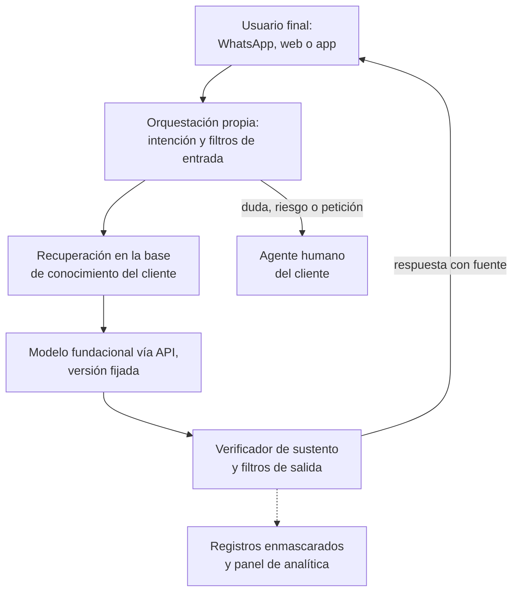
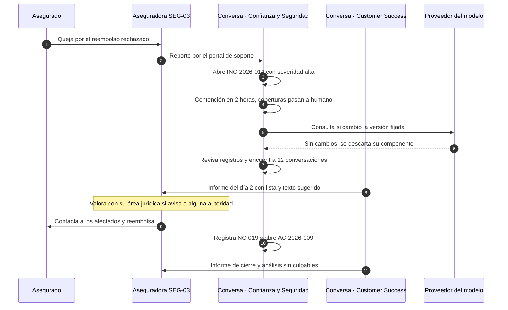
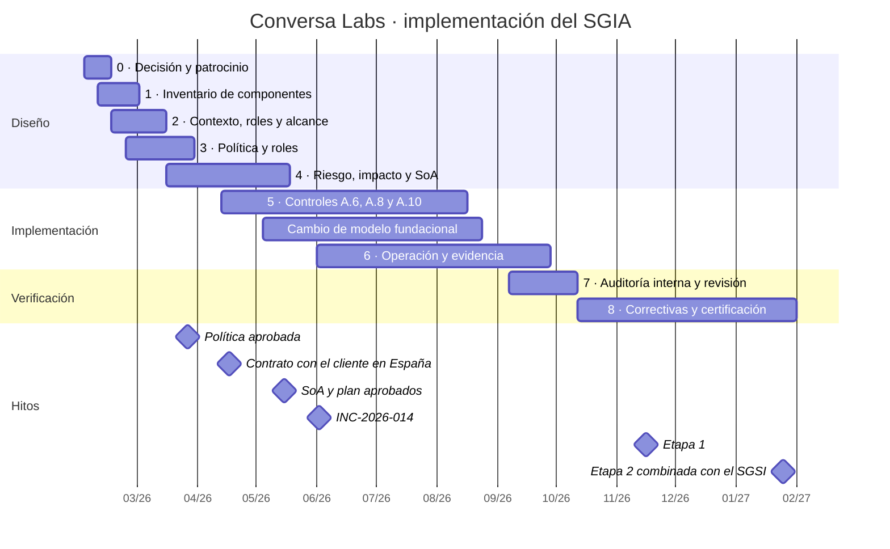

# Caso 3 · Conversa Labs: una empresa que desarrolla y vende un chatbot

:material-briefcase-outline: Caso práctico
:material-handshake-outline: Provee IA a clientes
:material-code-braces: Desarrolla IA
:material-cloud-download-outline: Usa IA de terceros
:material-clock-outline: 40 min de lectura

!!! note "Empresa ficticia"
    Conversa Labs, sus clientes, su proveedor de modelo, sus cifras y sus incidentes son inventados con fines didácticos; cualquier parecido con organizaciones reales es coincidencia. Las referencias a leyes ilustran el razonamiento y no constituyen asesoría legal ([aviso legal](../acerca-de.md#aviso-legal)).

!!! abstract "El caso en una frase"
    Una empresa de Guadalajara que vende asistentes virtuales con IA generativa descubre que, para un SGIA, su producto no es solo software: es una cadena de responsabilidades que va del proveedor del modelo fundacional al asegurado que pregunta por su póliza a las once de la noche, y que hay que documentar, repartir y comunicar eslabón por eslabón.

## Contexto y alcance

**La organización.** Conversa Labs, S.A. de C.V. es una empresa de software de Guadalajara, Jalisco, con 95 personas. Vende **Conversa**, una plataforma SaaS con la que sus clientes ponen en marcha asistentes virtuales con IA generativa para atender a sus propios clientes por WhatsApp, chat web o aplicación móvil. Tiene unos 70 clientes (16 aseguradoras, 21 universidades y 32 comercios) en México, Colombia y Chile, más un comercio en línea en España, su primer cliente en la Unión Europea. Atiende alrededor de 1.8 millones de conversaciones al mes.

**Cómo funciona.** Cada asistente combina un modelo de lenguaje de un proveedor de modelo fundacional (*foundation model*), consumido por API; generación aumentada por recuperación (*retrieval-augmented generation*, RAG) sobre la base de conocimiento que carga cada cliente; orquestación propia; filtros de seguridad (*guardrails*); traspaso a un agente humano del cliente, y un panel de analítica. Conversa **no entrena ni ajusta modelos con datos de sus clientes**: es un compromiso contractual, no una promesa de ventas.

**Personas clave.** El **CEO** (alta dirección) preside el **Comité de IA**, que integran también el **CTO** (dueño técnico de la plataforma), la **Responsable de Confianza y Seguridad** (*Trust & Safety*), dueña del SGIA y con autoridad para detener una liberación, y **Legal** (contratos, privacidad y regulación). Ese comité es la dirección designada que aprueba planes de tratamiento y acepta riesgos residuales ([6.1.3](../clausulas/c6-planificacion.md#c-6-1-3)). **Customer Success** comunica cambios e incidentes a los clientes.

**Detonantes.** A finales de 2025 coincidieron cuatro presiones: cada venta a aseguradoras y universidades traía un cuestionario de IA y dos clientes anunciaron auditorías de segunda parte; el prospecto español pidió evidencia de gobierno de la IA y de cómo se cumplirían las obligaciones de transparencia europeas; el proveedor del modelo anunció el retiro de la versión en producción, y la competencia presumía "IA responsable" sin evidencia.

**La decisión.** En febrero de 2026 el CEO aprobó certificarse en ISO/IEC 42001 **integrando el SGIA con su SGSI**, certificado en ISO/IEC 27001 desde hace tres años. La integración ahorró meses, pero no todo se reutiliza ([Integración con ISO 27001](../integracion/con-iso27001.md)):

| Pieza | Qué reutilizó del SGSI | Qué agregó para el SGIA |
|---|---|---|
| Riesgos | Herramienta, flujo de aprobación y calendario | Consecuencias para personas y sociedad ([6.1.1](../clausulas/c6-planificacion.md#c-6-1-1)) y evaluación de impacto ([6.1.4](../clausulas/c6-planificacion.md#c-6-1-4)) |
| Proveedores | Proceso de ISO 27001 A.5.19 a A.5.23 | Cuestionario de IA y nivel "crítico" para el modelo fundacional |
| Incidentes | Procedimiento de ISO 27001 A.5.24 a A.5.26 | Categorías de IA y plan de comunicación con clientes |
| Requisitos legales | Registro de ISO 27001 A.5.31 | Obligaciones de informar por país |
| Gobierno, documentos, auditoría y revisión | Comité trimestral, control documental, programa de auditoría y revisión por la dirección | Agenda propia de IA y una Declaración de Aplicabilidad de 38 controles |

**El alcance**, el mismo que se analiza en la [cláusula 4](../clausulas/c4-contexto.md#c-4-3):

> *"Diseño, desarrollo, operación y suministro de la plataforma SaaS Conversa de asistentes virtuales con IA generativa a clientes empresariales, incluida la integración con modelos fundacionales de terceros, desde Guadalajara, Jalisco."*

Qué quedó fuera y por qué:

- **El despliegue de cada cliente ante sus usuarios finales** (su aviso de privacidad, su equipo humano, sus decisiones de negocio): es responsabilidad del cliente, y la frontera se gestiona con contratos, matriz de responsabilidad y documentación ([A.10.2](../anexo-a/a10-terceros.md#a-10-2), [A.8.2](../anexo-a/a8-informacion-partes-interesadas.md#a-8-2)).
- **El entrenamiento del modelo fundacional:** lo hace el proveedor; Conversa lo controla como servicio externo ([8.1](../clausulas/c8-operacion.md#c-8-1)).
- **Las herramientas de IA de uso interno** (asistentes de programación, asistente de ofimática): se registran como herramientas del desarrollo ([A.4.4](../anexo-a/a4-recursos.md#a-4-4)) bajo la política de uso aceptable ([A.9.2](../anexo-a/a9-uso.md#a-9-2)), no como sistemas aparte. En nuestra lectura es defendible porque no producen resultados para usuarios finales; conviene comentarlo con el organismo de certificación.

Lo que **no** quedó fuera, aunque alguien lo propuso para "simplificar": la recuperación sobre bases de conocimiento y el traspaso a humano, el corazón del producto ([cómo se certifica](../auditoria/como-se-certifica.md)).

## Roles frente a la IA

Conversa es **cliente** hacia arriba, **productor** de lo que construye y **proveedor** hacia abajo. La tabla usa los roles de ISO/IEC 22989 a los que remite la cláusula [4.1](../clausulas/c4-contexto.md#c-4-1) (ver [Roles en la IA](../fundamentos/roles-en-la-ia.md)):

| Sistema o relación | Rol de Conversa | Otros actores | Datos personales (en nuestra lectura) |
|---|---|---|---|
| Plataforma Conversa | Proveedor y productor (orquestación, evaluación, filtros, operación) | Clientes que despliegan y aportan su base de conocimiento (socios) · Usuarios finales: usuarios y sujetos de IA | Encargado de conversaciones y bases de conocimiento; responsable de los datos de sus clientes y su personal |
| Modelo fundacional vía API | Cliente y usuario | Proveedor fundacional: proveedor de plataforma | El proveedor, subcontratado de Conversa |
| Despliegue para la aseguradora SEG-03 | Proveedor | Aseguradora: cliente y dueña del despliegue · Asegurados: usuarios y sujetos · Condusef, Comisión Nacional de Seguros y Fianzas y autoridad de datos: autoridades | Aseguradora responsable; Conversa encargado |
| Asistente del cliente en España | Proveedor | Cliente: responsable del despliegue (*deployer*) en el Reglamento de IA de la UE · Sus usuarios: sujetos | Cliente responsable; Conversa encargado |
| Herramientas internas | Cliente y usuario | Sus proveedores | Conversa responsable; nunca se ingresan datos de clientes |

Dos ideas ordenan el caso: **la responsabilidad no se terceriza** (si el modelo se equivoca, el asegurado reclama a la aseguradora y esta a Conversa) y **los roles de IA y de datos personales son ejes distintos**. La figura de Conversa ante el Reglamento de la UE se analiza [más abajo](#el-cliente-en-espana-transparencia-del-art-50).

## Inventario de sistemas de IA

Conversa inventaria **un solo sistema**, la plataforma, desglosado en perfiles por vertical, porque una aseguradora no es una tienda en línea (6.1.1 permite evaluar por grupos). Columnas de la [plantilla de inventario](../plantillas/index.md#inventario-sistemas-ia):

| ID | Sistema | Propósito | Rol | Origen | Proveedor | Tipo | Datos | ¿Datos personales? | ¿Decisiones sobre personas? | Nivel de riesgo | ¿Evaluación de impacto? | Dueño | Estado |
|---|---|---|---|---|---|---|---|---|---|---|---|---|---|
| IA-01 | Plataforma Conversa (núcleo multicliente) | Asistentes de atención, uno por cliente | Provee y desarrolla; cliente del modelo | Propio con modelo de tercero | Proveedor fundacional (API) | IA generativa con RAG | Bases de conocimiento y conversaciones | Sí, enmascarados en registros | No; informa | Alto | EIA-C01 (plataforma) | CTO | Producción |
| IA-01/SEG | Perfil seguros (16 aseguradoras; referencia SEG-03) | Coberturas, estatus de siniestros, orientación | Provee | Configuración de IA-01 | Igual | Igual | Condiciones por plan; póliza y siniestro por integración | Sí | No, pero influye en si la persona reclama | Alto | EIA-C02 completa | CTO, con Customer Success | Producción |
| IA-01/EDU | Perfil universidades | Trámites, becas, calendario | Provee | Configuración de IA-01 | Igual | Igual | Reglamentos y convocatorias | Sí; posibles aspirantes menores de edad | No, pero influye en postular a becas | Alto | EIA-C03 completa | CTO | Producción |
| IA-01/COM | Perfil comercios | Pedidos, devoluciones, horarios | Provee | Configuración de IA-01 | Igual | Igual | Catálogos y políticas | Sí | No | Medio | EIA-C04 intermedia | CTO | Producción |
| IA-01/UE | Comercio en España | Igual que COM, con controles de transparencia de la UE | Provee | Configuración de IA-01 | Igual | Igual | Igual que COM | Sí | No | Medio | Anexo de jurisdicción de EIA-C04 | CTO | Producción desde julio de 2026 |

De IA-01 cuelga su lista de componentes (AI-BOM): el modelo fundacional en versión fijada, un modelo pequeño para clasificar intenciones, la recuperación híbrida (palabras clave más vectores), el verificador de sustento, los filtros, un servicio de transcripción de notas de voz de otro proveedor y el panel de analítica ([A.4.2](../anexo-a/a4-recursos.md#a-4-2)).

## Riesgos principales

Conversa usa los criterios de la [cláusula 6](../clausulas/c6-planificacion.md#c-6-1-1): consecuencia en tres dimensiones (organización, individuos, sociedad) tomando **la peor**, probabilidad de 1 a 5 y matriz asimétrica de 5 × 5. Evalúa la plataforma y luego cada perfil por vertical:

| ID | Riesgo: causa → evento → consecuencia | O · I · S | P | Nivel | Tratamiento y controles | Residual | Acepta |
|---|---|---|---|---|---|---|---|
| R-C01 | Bases de conocimiento con documentos de varios planes y un verificador que no revisaba cifras → el asistente afirma coberturas, deducibles o plazos sin sustento → el asegurado gasta, no reclama o reclama tarde | 4 · 3 · 2 | 4 | 🟥 Crítico | Verificador por afirmación C-VER-01; filtro por plan y vigencia; regresión obligatoria ([A.6.2.4](../anexo-a/a6-ciclo-de-vida.md#a-6-2-4)); abstención y traspaso; fuente citada ([A.8.2](../anexo-a/a8-informacion-partes-interesadas.md#a-8-2)); el cliente resarce gastos razonables | 🟧 Alto (C4 · P2) | Comité de IA, revisión trimestral |
| R-C02 | El proveedor publica una versión o mueve un alias → el comportamiento cambia sin detección → más negativas o menos bloqueo de ataques en todos los clientes a la vez | 4 · 3 · 2 | 3 | 🟧 Alto | Versión fijada; verificación automática C-VER-02; batería ante cada versión; aviso previo contractual; despliegue gradual con reversa ([A.10.3](../anexo-a/a10-terceros.md#a-10-3)) | 🟨 Medio (C4 · P1) | Responsable del SGIA |
| R-C03 | Un usuario final aplica inyección de instrucciones (*prompt injection*), directa o escondida en un documento → obtiene datos de otro cliente o la instrucción de sistema | 4 · 4 · 2 | 3 | 🟧 Alto | Aislamiento por cliente en el índice; pruebas adversarias por versión; detección en producción ([A.6.2.6](../anexo-a/a6-ciclo-de-vida.md#a-6-2-6)); filtro de salida C-SEG-02 (CTO, dos ingenieros, marzo de 2027) | 🟨 Medio (C4 · P1) | Responsable del SGIA |
| R-C04 | Configuraciones del cliente o plantillas de WhatsApp omiten el saludo → la persona no sabe que conversa con una IA → engaño y, en España, posible incumplimiento del art. 50 | 4 · 2 · 2 | 2 | 🟧 Alto | Aviso no eliminable C-TRA-01 en la primera interacción de todo canal; indicador diario | 🟨 Medio (C4 · P1) | Responsable del SGIA |
| R-C05 | Un cliente usa el asistente fuera del dominio validado (dictaminar siniestros, consejo médico) → daño a sus usuarios | 3 · 4 · 3 | 3 | 🟧 Alto | Términos de uso con usos prohibidos; temas bloqueados que el cliente no puede activar; solicitudes rechazadas registradas ([A.10.4](../anexo-a/a10-terceros.md#a-10-4)) | 🟨 Medio (C4 · P1) | Responsable del SGIA |
| R-C06 | Conversaciones usadas fuera de su finalidad (entrenamiento, copia a herramientas no aprobadas, retención excesiva) → exposición de datos y ruptura del compromiso contractual | 4 · 4 · 2 | 2 | 🟧 Alto | No entrenamiento por contrato en ambos sentidos; ningún flujo técnico hacia entrenamiento; autorización expresa para evaluación; supresión automática ([A.7.2](../anexo-a/a7-datos.md#a-7-2)) | 🟨 Medio (C4 · P1) | Responsable del SGIA |
| R-C07 | *(Nuevo tras INC-2026-014)* Productos o versiones mezclados en bases multiproducto → se citan condiciones de otro plan o vencidas | 4 · 3 · 1 | 3 | 🟧 Alto | Metadatos de producto y vigencia; recuperación filtrada por plan; control de versiones ([A.7.5](../anexo-a/a7-datos.md#a-7-5)); preguntas trampa | 🟨 Medio (C4 · P1) | Responsable del SGIA |
| R-C08 | Variantes del español, notas de voz y baja alfabetización digital → más fallas y traspasos tardíos para chilenos, colombianos y personas mayores | 2 · 3 · 3 | 4 | 🟧 Alto | Métricas por país y canal; glosario regional; umbral de confianza de la transcripción; traspaso tras dos intentos fallidos | 🟨 Medio (C3 · P2) | Responsable del SGIA |

También registró una **oportunidad** (O-C01): atender siniestros de noche y en fin de semana con el estatus en tiempo real, medida con el tiempo de primera respuesta.

**R-C01 llegó a Crítico** tras [INC-2026-014](#inc-2026-014) y los criterios no aceptan un Crítico: la función de coberturas se suspendió para ese cliente hasta volver con restricciones. **R-C03 y R-C06 tienen dos sombreros**: son riesgos del SGSI y de IA ([Riesgo frente a impacto](../fundamentos/riesgo-vs-impacto.md)). Y cada riesgo dice quién lo controla (proveedor, cliente o Conversa), lo que alimenta la [matriz de responsabilidad](#matriz-de-responsabilidad-compartida).

## Evaluación de impacto completa

Conversa hace evaluaciones de impacto del sistema de IA (*AI system impact assessment*) de la plataforma (EIA-C01), de cada vertical y, por jurisdicción, como anexos. La más exigente es la de seguros: los asegurados deciden con dinero de por medio y muchos son personas mayores. La aseguradora, dueña del despliegue, participa en la consulta y usa el resultado como insumo de su propia evaluación. Sigue la estructura de [A.5.3](../anexo-a/a5-evaluacion-de-impacto.md#a-5-3) y la escala de severidad de [A.5](../anexo-a/a5-evaluacion-de-impacto.md) (gravedad + alcance + reversibilidad, de 3 a 12).

### Datos del sistema y disparador

| Campo | Contenido |
|---|---|
| Identificación | EIA-C02 v2.0 · IA-01/SEG · Despliegue de referencia: SEG-03, aseguradora mexicana de autos y daños con cerca de 400 000 asegurados |
| Versión evaluada | Orquestación 4.3; modelo del nuevo proveedor, versión fijada; configuración SEG-03 revisión 12 |
| Evaluaron | Responsable de Confianza y Seguridad (coordina), ingeniera de evaluación, Customer Success de seguros y Legal; por la aseguradora, su dueño del despliegue, su oficial de privacidad y su centro de contacto |
| Aprobó | Comité de IA, julio de 2026 |
| Disparadores | v1.0, marzo de 2026: primer ciclo del SGIA · v1.1, mayo: cambio de proveedor del modelo ([8.4](../clausulas/c8-operacion.md#c-8-4)) · v2.0, julio: INC-2026-014 |
| Cribado | Completa: influye en el acceso a un seguro, conversa con el público y atiende a personas mayores ([6.1.4](../clausulas/c6-planificacion.md#c-6-1-4)) |

### Uso previsto y uso indebido previsible

**Uso previsto.** Responder 24/7 por WhatsApp y chat web sobre coberturas **del plan identificado**, citando el documento; estatus de un siniestro ya reportado (solo lectura, tras un código de verificación enviado al número registrado); cómo reportar un siniestro y qué documentos reunir; talleres y citas. Ante duda, riesgo o petición, traspasa a una persona.

**Fuera del uso previsto.** Dictaminar si un siniestro procede, calcular indemnizaciones, cotizar, cancelar pólizas, dar consejo médico o legal y levantar reportes de siniestro (eso lo hace la cabina de la aseguradora).

**Uso indebido razonablemente previsible.** Tomar la respuesta como confirmación vinculante de cobertura; pedir consejo médico tras un accidente; consultar una póliza ajena con un número obtenido de algún modo; intentar inyección de instrucciones; que la aseguradora quiera desalentar reclamaciones o vender más a personas mayores; que los agentes copien sin verificar el resumen del asistente (sesgo de automatización, *automation bias*).

### Contexto técnico, social y jurisdicciones

**Técnico.** Recuperación por plan con metadatos de vigencia, verificador de sustento, integración de solo lectura con siniestros, modelo de tercero con versión fijada, transcripción de voz y registros enmascarados ([A.6.2.8](../anexo-a/a6-ciclo-de-vida.md#a-6-2-8)). Limitación de fondo: un modelo generativo puede producir texto convincente sin sustento.

**Social.** La gente escribe en momentos de estrés (un choque, un robo, una inundación) y la cultura de seguros es baja: deducible y coaseguro se confunden con facilidad. Cerca del 22 % de los asegurados de hogar tiene 65 años o más; muchos usan notas de voz y confían más en lo que "dice el sistema". Reclamar ante la unidad especializada de la aseguradora y luego ante la Condusef es un camino lento para quien ya gastó.

**Jurisdicciones.** México: LFPDPPP, protección a usuarios de servicios financieros y supervisión del sector asegurador, cuyas obligaciones concretas valora el área jurídica de la aseguradora. El perfil se reutiliza en dos aseguradoras colombianas con un anexo de jurisdicción ([México y Latinoamérica](../integracion/contexto-mexico-latam.md)).

### Partes afectadas y consulta

**Afectados:** asegurados titulares y beneficiarios; **personas mayores**, grupo con necesidades de protección; personas con discapacidad visual o auditiva; terceros en un siniestro que escriben al canal sin ser asegurados; agentes del centro de contacto, cuyo trabajo cambia, y el sector asegurador, cuya credibilidad se erosiona si los errores se repiten a escala.

**Consulta realizada:** dos talleres con agentes del centro de contacto; revisión de 600 conversaciones anonimizadas, con autorización expresa y por escrito de la aseguradora; ocho entrevistas telefónicas con asegurados de 65 años o más, organizadas por la aseguradora; las categorías de quejas de su unidad especializada, y una revisión de accesibilidad por una especialista externa.

### Impactos en individuos, grupos y sociedad

G · A · R son gravedad, alcance y reversibilidad. Si el grupo expuesto son personas mayores, la gravedad sube un nivel (regla de piso por vulnerabilidad de A.5).

| ID | Impacto | Signo | G · A · R inicial | Severidad | Medidas | Residual |
|---|---|---|---|---|---|---|
| I-01 | Información errónea sobre coberturas, deducibles o plazos (incluye personas mayores) | − | 4 · 2 · 2 = 8 | Alta | Verificador por afirmación; solo documentos del plan y versión vigentes; aviso de que la póliza manda; abstención y traspaso; la aseguradora resarce gastos razonables | 3 · 1 · 1 = 5, Media |
| I-02 | La persona cree que su siniestro ya quedó reportado, o no se reconoce una urgencia | − | 3 · 2 · 3 = 8 | Alta | Palabras de urgencia con traspaso inmediato; mensaje fijo "sin folio no hay reporte"; teléfono de cabina en cada respuesta sobre siniestros | 3 · 1 · 2 = 6, Media |
| I-03 | Datos de una póliza expuestos a un tercero o a otro cliente | − | 3 · 2 · 3 = 8 | Alta | Código de verificación; aislamiento por cliente; pruebas adversarias; enmascaramiento | 3 · 1 · 3 = 7, Media |
| I-04 | Peor servicio para quien no domina el canal | − | 3 · 3 · 1 = 7 | Media | Traspaso tras dos intentos fallidos; opción "llámame"; mensajes cortos; confirmación si la transcripción es dudosa | 3 · 2 · 1 = 6, Media |
| I-05 | Agentes que aceptan sin revisar el resumen del asistente | − | 2 · 2 · 2 = 6 | Media | El resumen marca lo no verificado; manual del panel | 2 · 1 · 1 = 4, Baja |
| I-06 | Cambios en el empleo del centro de contacto | − / + | 2 · 2 · 2 = 6 | Media | Diseño orientado a liberar agentes para casos complejos; la plantilla la decide el cliente | Media, decisión del cliente |
| P-01 | Respuesta inmediata de noche y en fin de semana | + | — | — | Tiempo de primera respuesta medido | Se mantiene |
| P-02 | Coberturas en lenguaje claro, con la fuente a la mano | + | — | — | Glosario aprobado por la aseguradora | Se mantiene |
| S-01 | Error repetido a escala en varias aseguradoras | − | 2 · 4 · 2 = 8 | Alta | Regresión por plataforma; casos similares en todos los clientes; plan de incidentes | 2 · 3 · 1 = 6, Media |
| S-02 | Consumo de cómputo | − | 1 · 2 · 2 = 5 | Media | Modelo pequeño para clasificar intenciones; respuestas acotadas | 1 · 2 · 1 = 4, Baja |

### Supervisión humana, decisión y comunicación

**Supervisión humana.** El asistente no decide nada sobre la póliza ni el siniestro. Cualquier persona puede escribir AGENTE (o tocar el botón); de noche, el traspaso va a la cabina de siniestros. Los agentes ven el resumen con lo no verificado marcado.

**Impactos residuales.** Todos en Media o Baja. I-01 es el más vigilado: depende de que la aseguradora mantenga sus documentos al día, algo que Conversa no controla.

**Decisión.** *Aprobada con condiciones*: coberturas solo con plan identificado y verificador activo; la procedencia de siniestros queda fuera de forma permanente; todo cambio significativo a la base exige regresión antes de publicarse.

**Comunicación.** La aseguradora recibe la evaluación completa bajo confidencialidad y una **ficha de impacto** para su propia evaluación; las demás aseguradoras, un resumen sin datos de SEG-03; el centro de confianza (*trust center*), un resumen general del vertical.

**Retención.** Cada versión se conserva mientras el vertical esté activo y cinco años después del último contrato de seguros ([7.5](../clausulas/c7-apoyo.md#c-7-5)).

**Próxima revisión.** Enero de 2027 (semestral, por severidad Media) o antes, ante una nueva versión del modelo, nuevas funciones (por ejemplo, cotizar) o un incidente relevante. Cada impacto negativo tiene su riesgo enlazado: I-01 y S-01 → R-C01 y R-C07; I-03 → R-C03; I-04 → R-C08.

## Información para usuarios finales y clientes (A.8)

A.8 y A.10 son el centro de gravedad del SGIA de Conversa. La dificultad de A.8 es que hay **dos niveles de usuarios**, el cliente que configura y el usuario final que conversa, y Conversa solo le habla directamente al primero.

### Qué recibe cada parte interesada (A.8.2 y A.6.2.7)

El criterio documentado: a mayor impacto y menor pericia, información más breve, visible y temprana.

| Parte interesada | Qué recibe | Cuándo |
|---|---|---|
| Usuarios finales (asegurados) | Aviso de que conversan con una IA; qué hace y qué no; cómo pedir a una persona y cómo reportar; la fuente de cada respuesta sobre coberturas | En la primera interacción de cada canal y en cada respuesta sensible |
| Dueño del despliegue del cliente | Ficha del asistente, límites del dominio, guía de configuración segura, guía para la base de conocimiento, reporte mensual de calidad, notas de versión | Al arrancar, en cada versión y cada mes |
| Agentes humanos del cliente | Manual del panel de traspaso: cómo leer el resumen y cuándo desconfiar de él | En su capacitación |
| Compras, riesgos, jurídico y TI del cliente | Paquete de debida diligencia (resúmenes de la SoA y de la evaluación de impacto, matriz, pruebas, subcontratados, certificado del SGSI) y guía de integración | En la venta y la integración |
| Autoridades | Expediente técnico bajo confidencialidad | Solo a solicitud |

La **ficha del asistente** sale de la misma fuente que la documentación técnica ([A.6.2.7](../anexo-a/a6-ciclo-de-vida.md#a-6-2-7)) y cambia con cada versión: usos previstos y fuera de alcance, modelo y versión, métricas fechadas del conjunto dorado, limitaciones conocidas (respuestas inventadas, notas de voz con ruido, modismos) y responsabilidades del cliente.

**El aviso de interacción con IA** viene activado y **no se puede eliminar** (control propio C-TRA-01). El cliente adapta el texto a su marca, pero tres elementos son fijos: que es una IA, qué no hace y cómo pedir a una persona. El texto base para seguros:

> "Hola, soy el asistente virtual de [Aseguradora]. Soy un sistema de inteligencia artificial: puedo orientarte sobre tu póliza y el estatus de tu siniestro, pero no autorizo coberturas ni pagos. Escribe AGENTE cuando quieras hablar con una persona."

El aviso también aparece cuando la empresa inicia la conversación con una plantilla de WhatsApp, el hueco que reveló R-C04. Para personas mayores, el asistente usa mensajes cortos, ofrece "¿quieres que te llamemos?" y repite la salida a una persona si nota confusión.

**Límites del dominio de uso.** La ficha distingue tres cosas, porque "no validado" no es lo mismo que "prohibido":

| Validado | No validado: requiere evaluación previa | Prohibido en los términos de uso |
|---|---|---|
| Atención informativa en español de México, Colombia, Chile y España: preguntas frecuentes, estatus, citas, orientación sobre trámites | Otros idiomas; menores sin acompañamiento; integraciones que escriben en los sistemas del cliente | Dictaminar coberturas, elegibilidad o siniestros; consejo médico, legal o financiero personalizado; ocultar que es una IA; campañas políticas o mensajes engañosos |

Y una frase sin letra chica: el desempeño depende de la calidad de la base de conocimiento que carga el cliente.

### Reporte externo de impactos adversos (A.8.3)

En el chat web hay un botón "reportar esta respuesta" y en WhatsApp, la palabra REPORTAR. Cada reporte llega **a dos lugares**: al panel del cliente, que atiende el primer nivel y responde a la persona, y a la cola de Confianza y Seguridad, que busca patrones. Entre julio y septiembre de 2026 llegaron 1 140 reportes: 58 % quejas comerciales (se turnan al cliente), 24 % errores factuales, 11 % "no me entendió", 5 % tono inapropiado y 2 % posibles fallas de seguridad o privacidad. Las tendencias van cada mes al Comité de IA y alimentan R-C01 y R-C08.

### Plan de comunicación de incidentes (A.8.4)

Es un anexo del procedimiento de incidentes del SGSI. Su matriz de notificación:

| Tipo de incidente | Conversa avisa a | Plazo contractual | El cliente avisa a | Aprueba en Conversa |
|---|---|---|---|---|
| Respuestas erróneas con efecto en usuarios | Cliente afectado | Aviso en 24 h; informe con alcance en 72 h; cierre en 15 días hábiles | Usuarios afectados y, si su jurídico lo decide, autoridades | Responsable de Confianza y Seguridad |
| Fuga entre clientes o inyección exitosa | Todos los clientes afectados | Aviso en 24 h | Titulares y autoridad de datos, según su ley | CEO, con Legal |
| Cambio de comportamiento por versión del modelo | Clientes del perfil y proveedor del modelo | 24 h si afecta a usuarios; si no, nota de versión | Según su evaluación | CTO |
| Incidente del proveedor | Clientes afectados | Según severidad, tras el aviso del proveedor | Según su evaluación | CTO y Legal |
| Error en el contenido del cliente | Cliente | 24 h | Usuarios afectados | Customer Success |

Con datos personales, Conversa actúa como encargado: avisa de inmediato al cliente responsable para que cumpla su propia obligación, que en México incluye avisar de las vulneraciones que afecten de forma significativa (art. 19 de la LFPDPPP)[^lfpdppp]. Toda decisión de **no** notificar se registra con su justificación. El plan se probó en un simulacro de escritorio con dos aseguradoras en agosto de 2026.

### INC-2026-014: la cobertura que no existía {#inc-2026-014}

En junio de 2026 el asistente de SEG-03 le afirmó a un asegurado que su plan de autos incluía auto sustituto por 15 días; no lo incluía. La historia completa (contención en dos horas, 60 días de registros revisados, 12 conversaciones afectadas, causa raíz y eficacia) está en el [ejemplo resuelto de la cláusula 10](../clausulas/c10-mejora.md#ejemplo-resuelto). Aquí interesa cómo viajó la responsabilidad. El flujo es distinto del de [A.8.4](../anexo-a/a8-informacion-partes-interesadas.md#a-8-4), donde la falla nace en una versión nueva del modelo: aquí el aviso llega del cliente y la causa estaba en la base de conocimiento y en la verificación de Conversa.

La acción correctiva **AC-2026-009** atacó tres causas: cargas significativas publicadas sin regresión; documentos de varios planes y versiones (incluidas condiciones vencidas) sin metadatos de producto ni vigencia, y un verificador que comprobaba conceptos, no cifras ni plazos. Sus seis acciones se cerraron a los 120 días: la verificación de eficacia de los 90 días encontró un deducible tomado de una versión vencida y obligó a añadir control de versiones. Para A.8 y A.10 dejó tres cosas: una **guía para clientes** sobre cómo cargar y mantener sus documentos; una **aclaración contractual** de que el contenido es del cliente aunque Customer Success lo cargue como servicio administrado, siempre con su aprobación, y un análisis sin culpables (*blameless postmortem*) compartido de forma anónima con las aseguradoras.

### Obligaciones de informar (A.8.5) {#obligaciones-de-informar-a8-5}

El registro extiende el de requisitos legales del SGSI y se revisa al firmar en un país nuevo:

| Destinatario | Fuente | Qué se entrega | Detonante | Responsable |
|---|---|---|---|---|
| Aseguradoras y universidades | Contratos | Reporte mensual de calidad, incidentes, subcontratados, acceso a auditorías de segunda parte | Mensual, ante incidente, anual | Customer Success |
| Clientes como responsables de datos | Leyes de datos personales y contratos de encargo | Apoyo con derechos de los titulares; avisos de vulneraciones | A solicitud o ante incidente | Legal |
| Cliente en España | Reglamento de IA de la UE (art. 50) y contrato | Cómo se informa de la interacción con IA y, si aplica, cómo se marca el contenido | Antes de cada cambio relevante | Legal y CTO |
| Autoridades | Requerimientos formales | Solo lo necesario, tras validación y revisión jurídica | A solicitud | Legal |

Para Colombia y Chile el registro anota proyectos de ley de IA que **todavía no son ley**; Legal les da seguimiento sin asumir obligaciones inexistentes ([México y Latinoamérica](../integracion/contexto-mexico-latam.md)).

## Responsabilidad compartida, proveedor y clientes (A.10)

### Matriz de responsabilidad compartida {#matriz-de-responsabilidad-compartida}

La versión resumida por capas, anexa a todos los contratos, está en [A.10.2](../anexo-a/a10-terceros.md#a-10-2). Esta es la versión detallada por actividad que acompaña a los contratos de seguros; cada fila tiene detrás una cláusula y una persona responsable en el RACI interno ([A.3.2](../anexo-a/a3-organizacion-interna.md#a-3-2)):

| Actividad | Proveedor del modelo fundacional | Conversa Labs | Cliente (aseguradora) | Dónde está escrito |
|---|---|---|---|---|
| Datos de entrenamiento del modelo base | Responde por ellos | Los evalúa como cliente | — | Términos del proveedor |
| No entrenar con datos de clientes | No entrena con lo enviado por API | No entrena ni ajusta; ningún flujo de registros hacia entrenamiento | Puede autorizar por escrito conversaciones anonimizadas solo para evaluar | Contrato del proveedor; contrato marco; formato de autorización |
| Contenido de la base de conocimiento | — | Ingesta, enmascaramiento, metadatos y diagnóstico; carga solo con aprobación del cliente | Exactitud, vigencia y derechos de uso | Anexo de servicio (aclarado por AC-2026-009) |
| Modelo y versión | Versiones fijas y aviso de retiros | Elige, fija, evalúa antes de adoptar y avisa con 30 días | Recibe notas de versión | Contrato del proveedor; anexo de servicio |
| Evaluación y pruebas | Evaluaciones de seguridad del modelo base | Conjunto dorado, batería adversaria y regresión | Acepta el desempeño en su dominio y aporta preguntas | Procedimiento de verificación; acta de aceptación |
| Configuración | — | Valores seguros por defecto; temas prohibidos bloqueados | Configura dentro de los límites | Guía de configuración; términos de uso |
| Aviso de interacción con IA | — | Activo y no eliminable; textos por país | Lo adapta a su marca | Términos de uso; anexo UE |
| Aviso de privacidad | — | Describe su tratamiento como encargado | Lo emite ante sus usuarios, con mención de la IA | Contrato de encargo |
| Supervisión humana | — | Traspaso y resumen para el agente | Equipo humano, horarios y tiempos | Anexo de servicio |
| Reportes de usuarios finales | — | Segundo nivel y patrones | Primer nivel y respuesta a quien reporta | Anexo de servicio |
| Incidentes | Avisa de fallas de su API o modelo | Contención, informes y plan de la plataforma | Reporta lo que detecta; decide medidas de negocio | Contratos en ambos sentidos |
| Comunicación a usuarios y autoridades | — | Insumos y textos sugeridos | Avisa a sus usuarios; evalúa avisos a su supervisor y a la autoridad de datos | Plan de A.8.4 |
| Evaluación de impacto | Documenta las limitaciones del modelo | EIA de plataforma y vertical; ficha de impacto | Evalúa su propio despliegue | Anexo de servicio |
| Resarcimiento por respuestas erróneas | — | Corrige y documenta | Resarce gastos razonables a sus asegurados | Anexo de servicio de seguros |

La matriz también deja claro lo que **nadie puede delegar**: Conversa no traslada al proveedor la evaluación en su caso de uso, ni la aseguradora a Conversa la relación con sus asegurados.

### Evaluación del proveedor del modelo fundacional (A.10.3)

El proveedor del modelo es el único de nivel **crítico**: es parte del producto y afecta a todos los clientes; el de transcripción de voz es de nivel reforzado. Con el cambio de proveedor, Conversa aplicó el cuestionario de IA de [A.10.3](../anexo-a/a10-terceros.md#a-10-3) al nuevo:

| Tema | Respuesta y evidencia | Decisión o control compensatorio |
|---|---|---|
| Uso de datos para entrenar | El contrato empresarial excluye entrenar con lo enviado por API | Cumple; alerta ante cambios de términos |
| Retención | Limitada, para vigilancia de abuso, con plazo definido | Se informa en la lista de subcontratados |
| Ubicación y subcontratados | Región acordada; lista pública con aviso de cambios | Acuerdo de procesamiento regional |
| Cambios de versión | Versiones fijas con fecha, aviso de retiro anticipado y alias móviles opcionales | Fijar siempre la versión; C-VER-02 |
| Incidentes | Notificación contractual y página de estado | Página de estado integrada al monitoreo |
| Documentación | Ficha del modelo, resumen de evaluaciones de seguridad, políticas de uso | Lo pertinente pasa a la ficha del asistente |
| Desempeño en el caso de uso | No lo garantiza | Conjunto dorado y batería propios |
| Certificaciones | ISO/IEC 27001 vigente; informe de auditoría bajo confidencialidad | Alcance del certificado verificado |

Seguimiento semestral y ante cada cambio de términos o de versión. El proveedor anterior sigue evaluado como contingencia para el perfil de comercios.

### Gestión de clientes (A.10.4)

**Arranque y contrato.** Un cuestionario levanta sector, país, usuarios (¿menores?, ¿personas mayores?), canales, regulación, integraciones y quién será el **dueño del despliegue**. El paquete contractual tiene contrato marco, anexo de servicio con plazos y matriz, contrato de encargo, términos de uso con usos permitidos y prohibidos y, cuando aplica, un anexo UE.

**El compromiso de no entrenar con datos de clientes** vive en cuatro lugares que dicen lo mismo, algo que verificó la revisión de [A.2.3](../anexo-a/a2-politicas.md#a-2-3): contrato, declaración pública de principios, procedimiento de datos ([A.7.2](../anexo-a/a7-datos.md#a-7-2)) y un control técnico, porque no existe flujo de registros hacia entrenamiento. Confianza y Seguridad revisa los flujos cada trimestre.

**Autorización expresa para conjuntos de evaluación.** Usar conversaciones reales en las pruebas exige un formato firmado por el dueño del despliegue: qué conversaciones (periodo y muestra), solo para evaluar, anonimizadas antes de salir del espacio del cliente, conservadas 12 meses y revocables. Han firmado 9 de los 70 clientes; SEG-03 autorizó las 600 conversaciones de su evaluación de impacto.

**Considerar no es obedecer.** El registro de solicitudes rechazadas o condicionadas también es evidencia:

| Solicitud | Decisión | Razón |
|---|---|---|
| Una aseguradora quería que el asistente dictaminara siniestros de cristales | Rechazada | Fuera del dominio validado (R-C05) |
| Un comercio quería quitar el aviso de IA "porque baja la conversión" | Rechazada; se permitió acortar el texto | C-TRA-01 (R-C04) |
| Una universidad pidió "entrenar el asistente con nuestras conversaciones" | Condicionada: no hay ajuste de modelos; se ofreció usarlas para evaluar, con autorización | Compromiso de no entrenar |

## Cambio de proveedor del modelo fundacional (8.1 a 8.4)

Entre mayo y agosto de 2026, por el retiro de la versión en uso, Conversa migró a otro proveedor. El paso a paso y su calendario de 16 semanas están en el [ejemplo resuelto de la cláusula 8](../clausulas/c8-operacion.md#ejemplo-resuelto). En resumen:

| Subcláusula | Qué hizo Conversa | Evidencia |
|---|---|---|
| [8.1](../clausulas/c8-operacion.md#c-8-1) | Lo clasificó como cambio significativo; debida diligencia; despliegue gradual (5 %, 25 %, 100 %) con reversa en menos de una hora | Ticket, cuestionario, contrato, bitácora |
| [8.2](../clausulas/c8-operacion.md#c-8-2) | Reevaluó riesgos con el conjunto dorado de 1 200 preguntas y la batería adversaria: el bloqueo de inyecciones bajó de 97 % a 91 % | Matriz nueva frente a la anterior |
| [8.3](../clausulas/c8-operacion.md#c-8-3) | Ajustó instrucciones de sistema, filtros y glosario regional: el bloqueo subió a 98 % | Plan con verificación de eficacia |
| [8.4](../clausulas/c8-operacion.md#c-8-4) | EIA-C02 v1.1: el modelo nuevo se niega más a hablar de salud; piloto más estricto con aseguradoras | Evaluación versionada |

También movió A.8 y A.10: aviso a clientes con 30 días de anticipación y ficha, matriz, subcontratados y anexo UE actualizados. Dos semanas después, el monitoreo detectó más negativas en un ambiente sin versión fijada: el proveedor había actualizado su alias. Se registró como **INC-2026-017**, cambio no intencionado: se contuvo, se fijó la versión y nació C-VER-02, que verifica en la canalización que ningún ambiente use un alias móvil.

## Evaluación de calidad y pruebas adversarias (A.6.2.4)

La verificación y validación tiene tres piezas, con criterios de liberación escritos antes de probar:

| Pieza | Contenido | Criterio de liberación |
|---|---|---|
| **Conjunto dorado** (*golden set*) | 1 200 preguntas sintéticas y anonimizadas (420 de seguros, 400 de universidades, 380 de comercio) etiquetadas por Customer Success y validadas por expertos de los clientes piloto, en variantes de México, Colombia y Chile; incluye preguntas sin respuesta en la base y, desde AC-2026-009, preguntas trampa entre planes y versiones | Fundamentadas ≥ 97 %; afirmaciones sin sustento ≤ 1 % y cero en cifras de cobertura; abstención correcta ≥ 95 %; brecha entre países ≤ 3 puntos |
| **Batería adversaria** | 650 ataques, 400 directos y 250 escondidos en documentos: revelar la instrucción de sistema, obtener datos de otro cliente, salir del dominio, contenido dañino, manipular el traspaso | Éxito global menor a 2 % y **cero** éxitos en las dos primeras categorías |
| **Regresión de cliente** | Subconjunto del vertical más preguntas propias del cliente | El panel bloquea la publicación de un cambio significativo hasta pasarla |

Se corren en cada liberación de la orquestación, ante cada versión del modelo y ante cada cambio significativo de una base; cada trimestre hay además un ejercicio de equipo rojo (*red team*). Resultados de la migración:

| Indicador | Proveedor anterior | Nuevo, antes de ajustes | Nuevo, después |
|---|---|---|---|
| Respuestas fundamentadas (seguros) | 97.2 % | 96.1 % | 97.6 % |
| Bloqueo de ataques de inyección | 97 % | 91 % | 98 % |
| Brecha Chile frente a México | 2.1 puntos | 5.4 puntos | 2.3 puntos |

El "cero éxitos" en fuga entre clientes no se negocia: en marzo de 2026 un ingeniero reportó de forma anónima que se pensaba liberar una función sin terminar esa batería, y la Responsable de Confianza y Seguridad detuvo la liberación ([A.3.3](../anexo-a/a3-organizacion-interna.md#a-3-3)).

## El cliente en España: transparencia del art. 50 {#el-cliente-en-espana-transparencia-del-art-50}

**Por qué alcanza a una empresa de Guadalajara.** El Reglamento (UE) 2024/1689 aplica a proveedores que ponen sistemas de IA en el mercado de la Unión aunque estén fuera de ella, y a proveedores y responsables del despliegue de terceros países cuando los resultados del sistema se usan en la Unión (art. 2)[^ue]. Las conversaciones del comercio español ocurren con personas en España.

**El calendario.** El Reglamento entró en vigor el 1 de agosto de 2024 y su aplicación general, que incluye la transparencia del art. 50, empezó el **2 de agosto de 2026**. El Reglamento (UE) 2026/1744 (Ómnibus Digital sobre IA) dio a los sistemas generativos comercializados antes de esa fecha hasta el **2 de diciembre de 2026** para el marcado del art. 50(2)[^ue].

**Qué analizó Legal**, con un despacho en España. En nuestra lectura del art. 50, el deber de diseñar el sistema para que la persona sepa que conversa con una IA, a más tardar en la primera interacción y de forma clara y accesible, recae en el proveedor; el apartado 2 trata del marcado legible por máquina del contenido sintético, texto incluido, con excepciones. Si Conversa es "proveedor" en el sentido del Reglamento frente a ese cliente, y si el marcado alcanza a sus respuestas, quedó como **análisis preliminar**. La decisión de negocio fue **diseñar para el escenario más exigente**:

- Aviso de IA no eliminable en la primera interacción de todos los canales, en español de España y con revisión de accesibilidad, desde la salida a producción en julio de 2026.
- Marcado legible por máquina en los metadatos de la API y del widget, programado para noviembre de 2026, antes del plazo de diciembre, tomando como referencia el código de buenas prácticas sobre marcado y etiquetado, que es voluntario[^codigo].
- Documentación para que el cliente respalde sus propias obligaciones como responsable del despliegue, sin conclusiones jurídicas en su nombre ([A.10.4](../anexo-a/a10-terceros.md#a-10-4)).
- Medidas de alfabetización en IA (art. 4) para el equipo que atiende a ese cliente.
- El análisis no ubicó este uso en las categorías de alto riesgo; se revisará si el cliente pide funciones nuevas.

!!! legal "ISO 42001 no es cumplimiento del Reglamento"
    El SGIA le dio a Conversa dónde documentar, decidir y evidenciar todo esto, pero un certificado ISO/IEC 42001 no da presunción de conformidad con el Reglamento de IA de la UE. Profundiza en [Reglamento de IA de la UE](../integracion/reglamento-ia-ue.md) y en los [roles del Reglamento](../fundamentos/roles-en-la-ia.md#reglamento-ue).

## Extracto de la Declaración de Aplicabilidad

Conversa **no excluyó ningún control** del Anexo A, porque provee, desarrolla y usa IA, pero acotó cuatro. Una propuesta de exclusión merece contarse: el CTO sugirió excluir A.9 "porque nosotros proveemos, no usamos"; se rechazó, porque el equipo usa asistentes de programación y la empresa consume el modelo de su proveedor ([A.9](../anexo-a/a9-uso.md)).

Los nombres de los controles son traducción libre de referencia del autor.

| Control | ¿Se incluye? | Justificación | Estado | ISO 27001 |
|---|---|---|---|---|
| [A.2.2](../anexo-a/a2-politicas.md#a-2-2) Política de IA | Sí | Política del CEO, de desarrollo responsable y principios públicos con el compromiso de no entrenar | Implementado | 5.1 |
| [A.3.2](../anexo-a/a3-organizacion-interna.md#a-3-2) Roles y responsabilidades de IA | Sí | Dueña del SGIA y CTO dueño de IA-01; el contrato pide al cliente un dueño del despliegue | Implementado | 5.2, 5.3 |
| [A.5.4](../anexo-a/a5-evaluacion-de-impacto.md#a-5-4) Evaluación del impacto en individuos o grupos | Sí | EIA-C01 a C04: personas mayores y aspirantes menores de edad. Trata R-C01 y R-C08 | Implementado | — |
| [A.6.2.4](../anexo-a/a6-ciclo-de-vida.md#a-6-2-4) Verificación y validación | Sí | Conjunto dorado, batería adversaria y regresión de cliente. Trata R-C01, R-C03 y R-C07 | Implementado | 8.29 |
| [A.6.2.6](../anexo-a/a6-ciclo-de-vida.md#a-6-2-6) Operación y monitoreo | Sí | Calidad por cliente, sesiones con aviso, versión fijada. Trata R-C02 | Implementado | 8.16 |
| [A.6.2.7](../anexo-a/a6-ciclo-de-vida.md#a-6-2-7) Documentación técnica | Sí | Ficha del asistente por versión y matriz de audiencias | Implementado | 5.37 |
| [A.7.2](../anexo-a/a7-datos.md#a-7-2) Datos para desarrollo y mejora | Sí, acotado | No entrena ni ajusta; aplica a conjuntos de evaluación y a la configuración de la recuperación. Trata R-C06 | Implementado | — |
| [A.7.3](../anexo-a/a7-datos.md#a-7-3) Adquisición de datos | Sí, acotado | No compra datos; aplica a documentos de clientes (derechos garantizados por contrato) y a datos sintéticos | Implementado | — |
| [A.7.5](../anexo-a/a7-datos.md#a-7-5) Procedencia de los datos | Sí | Metadatos por fragmento, con vigencia desde AC-2026-009. Trata R-C07 | Implementado | — |
| [A.8.2](../anexo-a/a8-informacion-partes-interesadas.md#a-8-2) Documentación del sistema e información para usuarios | Sí | Matriz por parte interesada, aviso de IA, límites del dominio. Trata R-C04 y R-C05 | Implementado | — |
| [A.8.3](../anexo-a/a8-informacion-partes-interesadas.md#a-8-3) Reporte externo | Sí | Botón y palabra REPORTAR hacia dos paneles | Implementado | 6.8 |
| [A.8.4](../anexo-a/a8-informacion-partes-interesadas.md#a-8-4) Comunicación de incidentes | Sí | Plan anexo al procedimiento del SGSI, con matriz de notificación | Implementado | 5.24, 5.26, 5.5 |
| [A.8.5](../anexo-a/a8-informacion-partes-interesadas.md#a-8-5) Información para las partes interesadas | Sí | Registro de obligaciones por país, incluida la UE | Implementado | 5.31, 5.5 |
| [A.9.3](../anexo-a/a9-uso.md#a-9-3) y [A.9.4](../anexo-a/a9-uso.md#a-9-4) Uso responsable y uso previsto | Sí, acotado | Usos internos: asistentes de programación y modelo dentro de las políticas del proveedor | Implementado | — |
| [A.10.2](../anexo-a/a10-terceros.md#a-10-2) Asignación de responsabilidades | Sí | Matriz por actividad anexa a cada contrato | Implementado | 5.19, 5.20, 5.23 |
| [A.10.3](../anexo-a/a10-terceros.md#a-10-3) Proveedores | Sí | Proveedor fundacional de nivel crítico; transcripción de voz, reforzado. Trata R-C02 | Implementado | 5.19 a 5.22 |
| [A.10.4](../anexo-a/a10-terceros.md#a-10-4) Clientes | Sí | Cuestionario de arranque, términos de uso, solicitudes rechazadas. Trata R-C05 | Implementado | 5.20 |
| C-VER-01 Verificador de sustento (propio) | Sí | Revisa cifras y plazos contra el documento del plan. Trata R-C01 | Implementado | — |
| C-TRA-01 Aviso de IA no eliminable (propio) | Sí | Trata R-C04; respalda el art. 50 en España | Implementado | — |
| C-SEG-02 Filtro de salida (propio) | Sí | Trata R-C03 | En implementación (marzo de 2027) | — |

## Objetivos e indicadores

Los objetivos conectan la política con los criterios de liberación ([6.2](../clausulas/c6-planificacion.md#c-6-2), [A.6.1.2](../anexo-a/a6-ciclo-de-vida.md#a-6-1-2)) y se revisan en el Comité de IA:

| ID | Objetivo | Indicador y fórmula | Meta | Frecuencia | Responsable |
|---|---|---|---|---|---|
| OBJ-C01 | Asistentes resistentes a la manipulación | Ataques exitosos ÷ ataques ejecutados en la batería; fugas entre clientes en producción | Menos de 2 % y cero fugas en 2027 | Trimestral | CTO |
| OBJ-C02 | Respuestas con sustento | Afirmaciones sin sustento ÷ afirmaciones revisadas en 400 conversaciones de seguros por semana | ≤ 0.5 % y cero en cifras de cobertura | Mensual | Responsable de Confianza y Seguridad |
| OBJ-C03 | Nadie conversa con Conversa sin saberlo | Sesiones nuevas con aviso ÷ sesiones nuevas | 100 % en todos los canales | Diaria, revisión mensual | CTO |
| OBJ-C04 | Clientes informados a tiempo | Incidentes altos o críticos notificados al cliente en 24 h ÷ total | 100 % | Trimestral | Customer Success |
| OBJ-C05 | Cambios de modelo bajo control | Versiones adoptadas con batería previa ÷ versiones adoptadas; ambientes con alias móvil | 100 % y cero | Trimestral | CTO |
| OBJ-C06 | Servicio parejo entre países | Diferencia máxima de respuestas correctas entre México, Colombia y Chile | ≤ 3 puntos porcentuales | Por liberación | Responsable de Confianza y Seguridad |

## Hoja de ruta del caso

Conversa tardó unos 12 meses, en el límite superior de la [estimación para un proveedor SaaS](../implementacion/hoja-de-ruta.md#variantes). El SGSI le ahorró tiempo en gobierno, documentos, proveedores e incidentes, pero la migración del modelo y el incidente de junio cayeron en plena implementación; a cambio, generaron justo la evidencia que un auditor quiere ver.

La firma con el cliente español disparó una revisión extraordinaria de la política ([A.2.4](../anexo-a/a2-politicas.md#a-2-4)) y nuevas evaluaciones de riesgo e impacto. La auditoría interna de septiembre la condujo un auditor externo, con una ingeniera de analítica como experta técnica, porque la dueña del SGIA no puede auditar su propio sistema ([9.2](../clausulas/c9-evaluacion-del-desempeno.md#c-9-2)). La revisión por la dirección de octubre ([9.3](../clausulas/c9-evaluacion-del-desempeno.md#c-9-3)) incluyó el cierre de AC-2026-009, los cambios del proveedor y las obligaciones del cliente en España. La etapa 2 se programó como auditoría combinada con la de seguimiento del SGSI.

## Qué le diría el auditor

!!! auditor "Lo que esperaríamos escuchar en la reunión de cierre de la etapa 2"
    **Fortalezas.** Una matriz de responsabilidad por actividad, anexa a cada contrato y respaldada por cláusulas. Un incidente real gestionado de punta a punta: contención, comunicación en dos niveles, causa raíz, casos similares y eficacia verificada a los 90 y 120 días. Un cambio de proveedor con trazabilidad de 8.1 a 8.4, incluido el alias. Un compromiso de no entrenar que se puede verificar.

    **Hallazgos probables.**

    1. **No conformidad menor (8.1 y [A.6.2.6](../anexo-a/a6-ciclo-de-vida.md#a-6-2-6)).** Tras INC-2026-017 la organización estableció una verificación automática para que ningún ambiente use un alias móvil del modelo. Sin embargo, el ambiente de pruebas donde tres clientes aprueban cambios a su base de conocimiento no la tiene y, durante la auditoría, consumía el alias móvil. Las regresiones aprobadas ahí no representan a producción, y la búsqueda de casos similares no cubrió todos los ambientes.
    2. **No conformidad menor ([A.8.2](../anexo-a/a8-informacion-partes-interesadas.md#a-8-2) y 7.5.2).** El procedimiento exige actualizar la ficha del asistente en cada cambio de versión del modelo. En una muestra de diez clientes, tres seguían con la ficha de la versión anterior seis semanas después de la migración.
    3. **Observación ([A.8.3](../anexo-a/a8-informacion-partes-interesadas.md#a-8-3)).** No hay plazo documentado para responder a quien reporta cuando el cliente no atiende el primer nivel; 37 reportes del trimestre llevaban más de 30 días sin respuesta a la persona.
    4. **Observación ([A.8.5](../anexo-a/a8-informacion-partes-interesadas.md#a-8-5)).** El análisis sobre el marcado del art. 50(2) sigue como preliminar y sin fecha de cierre, aunque el plazo transitorio vence el 2 de diciembre de 2026. Implementar el marcado reduce el riesgo, pero conviene que el registro refleje el estado real.

    **Recomendaciones.** Extender C-VER-02 a todos los ambientes; publicar la ficha desde la canalización de liberación; fijar en el anexo de servicio un plazo de respuesta a quien reporta, con escalamiento a Conversa; y poner fecha y responsable al análisis del art. 50(2). Más ejemplos de redacción en [Hallazgos de ejemplo](../auditoria/hallazgos-ejemplo.md).

## Lecciones para tu organización

- **Si provees IA, tu documentación es insumo del cumplimiento de otros.** Diséñala por tipo de parte interesada y versiónala con el modelo.
- **El aviso de IA es una decisión de producto, no un texto legal.** Hazlo imposible de quitar y mide cuántas sesiones lo muestran.
- **Una matriz de responsabilidad sin contrato es un dibujo.** Cada celda importante necesita una cláusula y una persona responsable.
- **Evalúa a tu proveedor de modelo aunque no puedas auditarlo:** lee sus términos, fija versiones y prueba en tu caso de uso.
- **Las bases de conocimiento de tus clientes son tu riesgo, aunque su contenido sea de ellos.** Pon puertas técnicas antes de publicar.
- **Busca casos similares en todos los clientes y en todos los ambientes.** En una plataforma, un defecto rara vez vive en un solo lugar.
- **Diseña para el escenario regulatorio más exigente** y deja las conclusiones jurídicas a quien corresponde.
- **Integra con tu SGSI sin copiar su lente:** incidentes, proveedores y requisitos legales se reutilizan; el impacto en personas es nuevo.

## Plantillas usadas en este caso

- [Política de IA](../plantillas/index.md#politica-de-ia)
- [Roles y responsabilidades (RACI)](../plantillas/index.md#raci-ia)
- [Inventario de sistemas de IA](../plantillas/index.md#inventario-sistemas-ia)
- [Metodología y matriz de riesgos de IA](../plantillas/index.md#evaluacion-de-riesgos)
- [Evaluación de impacto del sistema de IA](../plantillas/index.md#evaluacion-de-impacto)
- [Declaración de Aplicabilidad](../plantillas/index.md#declaracion-de-aplicabilidad)
- [Ficha del sistema de IA](../plantillas/index.md#ficha-del-sistema)
- [Registro de incidentes de IA](../plantillas/index.md#registro-de-incidentes)
- [Procedimiento del ciclo de vida](../plantillas/index.md#procedimiento-ciclo-de-vida)
- [Checklist de auditoría interna](../plantillas/index.md#checklist-auditoria-interna)

Otros casos: [PyME que usa IA generativa](pyme-usa-ia-generativa.md) y [fintech con *scoring* crediticio](fintech-scoring.md).

[^lfpdppp]: Ley Federal de Protección de Datos Personales en Posesión de los Particulares, texto vigente publicado por la Cámara de Diputados: <https://www.diputados.gob.mx/LeyesBiblio/pdf/LFPDPPP.pdf> (consultado el 9 de octubre de 2026). Resumen propio; no es asesoría legal.

[^ue]: Reglamento (UE) 2024/1689 (Reglamento de Inteligencia Artificial), arts. 2, 4, 50, 111 y 113: <https://eur-lex.europa.eu/eli/reg/2024/1689/oj/spa>; calendario vigente tras el Reglamento (UE) 2026/1744 ("Ómnibus Digital sobre IA"), publicado en el Diario Oficial de la UE el 24 de julio de 2026: <https://eur-lex.europa.eu/eli/reg/2026/1744/oj/eng>; resumen de la Comisión Europea: <https://digital-strategy.ec.europa.eu/en/policies/regulatory-framework-ai> (consultados el 9 de octubre de 2026). Resumen propio; no es asesoría legal.

[^codigo]: Comisión Europea, código de buenas prácticas sobre marcado y etiquetado de contenido generado por IA, versión final publicada el 10 de junio de 2026: <https://digital-strategy.ec.europa.eu/en/news/commission-publishes-code-practice-marking-and-labelling-ai-generated-content> (consultado el 9 de octubre de 2026).
