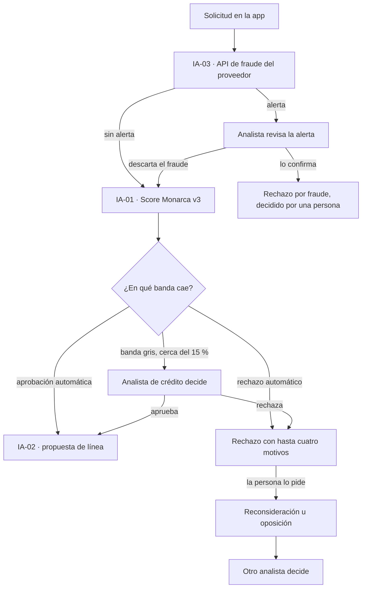
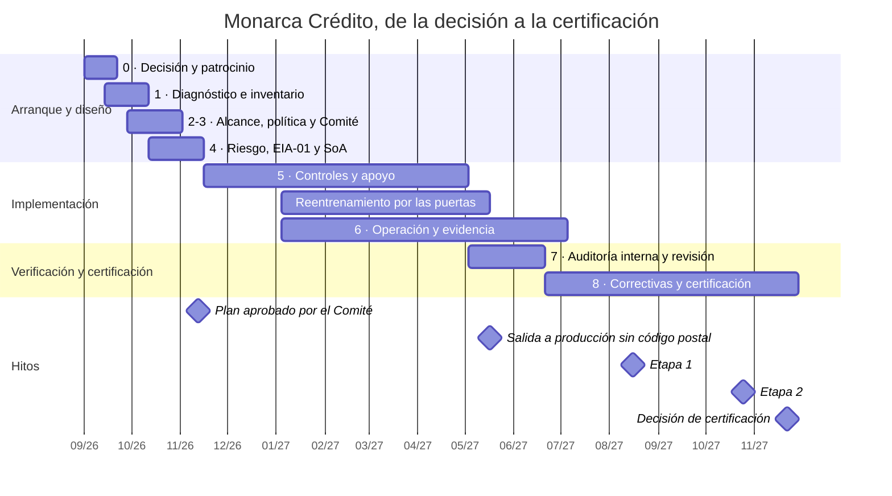

# Caso 2 · Monarca Crédito: una fintech que desarrolla un modelo de scoring crediticio

:material-briefcase-outline: Caso práctico
:material-code-braces: Desarrolla IA
:material-cloud-download-outline: Usa IA de terceros
:material-clock-outline: 35 min de lectura

!!! note "Empresa ficticia"
    Monarca Crédito, sus personas, sistemas, cifras y documentos son inventados con fines didácticos; cualquier parecido con organizaciones reales es coincidencia. Las referencias a leyes son un resumen propio y no constituyen asesoría legal.

!!! abstract "El caso en una frase"
    Una SOFOM que entrena su propio modelo para aprobar o rechazar microcréditos convierte su Comité de Modelos en el centro de un SGIA: mide la equidad por segmento, explica cada rechazo en lenguaje claro, cuida que la revisión humana de la banda gris sea real, ajusta sus avisos de privacidad a la nueva LFPDPPP y obtiene la certificación unos 15 meses después de decidirlo.

## Contexto y alcance

### La organización

Monarca Crédito es una sociedad financiera de objeto múltiple, entidad no regulada (SOFOM E.N.R.), con sede en la Ciudad de México. Otorga microcréditos personales y para micronegocios **100 % en su app**: la persona captura su solicitud, autoriza la consulta de su historial en el buró de crédito y recibe respuesta en minutos. Tiene 210 empleados, unos 350 000 clientes y recibe del orden de 40 000 solicitudes al mes.

El corazón del negocio es **Score Monarca v3** (IA-01), un modelo de aprendizaje automático (*machine learning*) con árboles potenciados por gradiente (*gradient boosting*) que estima la probabilidad de incumplimiento, definida como 90 días de atraso en los primeros 12 meses. Usa datos de la solicitud, el historial en buró (con autorización), el comportamiento transaccional y, con consentimiento, datos de uso de la app. Su salida tiene tres bandas: aprobación automática, rechazo automático y **banda gris** de revisión humana, que recibe cerca del 15 % de las solicitudes. Para las aprobadas, un modelo derivado (IA-02) propone el monto de la línea. Antes de todo, una API de detección de fraude de un proveedor externo (IA-03) revisa la solicitud.

| Persona | Papel en el SGIA |
|---|---|
| Director general | Patrocinador; preside el Comité de Modelos; firma las excepciones temporales que exigen los criterios |
| Director de Riesgos | Dueño de Score Monarca v3 y de IA-02; firma la salida a producción |
| Líder de Ciencia de Datos | Desarrolla y monitorea los modelos; presenta ante el Comité, con voz y sin voto |
| Oficial de Cumplimiento | **Responsable del SGIA**; dueña de IA-03; puede suspender un despliegue mientras el Comité resuelve |
| Oficial de Privacidad | Aviso de privacidad, consentimientos, derechos ARCO y de oposición; coordina la EIPD |
| Analista de riesgo de modelos | Validación independiente; no participa en el desarrollo |
| Analistas de crédito (12) | Supervisión humana en la banda gris, revisión de alertas de fraude y reconsideraciones |
| Comité de Modelos | Dirección designada del SGIA: aprueba modelos, cambios y evaluaciones de impacto, y acepta riesgos residuales |

### Detonantes y decisión de certificar

Tres cosas coincidieron en el verano de 2026:

1. **La ronda de inversión.** La debida diligencia de un fondo preguntó quién aprueba los modelos, cómo saben que no discriminan y qué pasa cuando fallan. La respuesta honesta era "el Director de Riesgos contesta 'adelante' a un correo".
2. **Las alianzas con bancos.** Dos bancos con los que Monarca negocia fondeo y originación conjunta enviaron cuestionarios de riesgo de modelos e IA; uno incluyó en el borrador de contrato la obligación de informar al solicitante cuando lo evalúa un modelo automatizado.
3. **Señales internas.** Quejas por rechazos con un mensaje genérico ("no cumples con nuestras políticas"), un reporte en la línea ética (una analista notó que la banda gris casi no recibía solicitudes de algunos estados del sur) y el descubrimiento de que el área de cobranza usaba el score para priorizar llamadas.

Monarca ya tenía un Comité de Modelos, pero era de nombre: sesionaba de forma irregular, sin criterios escritos ni seguimiento de acuerdos, y muchas versiones se aprobaban por correo (el [ejemplo resuelto de la cláusula 5](../clausulas/c5-liderazgo.md#ejemplo-resuelto) cuenta cómo se formalizó). La dirección decidió **certificar**, no solo alinearse: inversionistas y bancos necesitaban evidencia revisada por un tercero, no una autoevaluación. Es el perfil que en [¿Necesito ISO 42001?](../empieza-aqui/necesito-iso42001.md#certificarte) aparece como "certificarte tiene sentido".

### Alcance del SGIA

El alcance aprobado ([4.3](../clausulas/c4-contexto.md#c-4-3)) dice:

> *"Desarrollo, validación, operación y monitoreo de modelos de IA para la originación y asignación de línea de microcréditos personales y para micronegocios otorgados por medio de la app de Monarca Crédito, y uso de servicios de IA de terceros para la detección de fraude en la originación, desde la Ciudad de México y la infraestructura en la nube que los soporta."*

Cubre sus dos roles y no esquiva el sistema de mayor impacto. Lo que quedó fuera, y por qué:

| Fuera del alcance | Justificación | Cuándo se revisa |
|---|---|---|
| Herramientas de IA generativa de productividad (ofimática, asistente de programación) | No deciden sobre personas; se gobiernan con la política de uso aceptable, que aplica a toda la empresa, y con los controles de seguridad existentes. Están en el inventario marcadas "fuera del alcance". | Segundo ciclo de certificación |
| Modelo de cobranza preventiva | Está en diseño y no ha pasado la Puerta 1. Entrará como cambio planificado ([6.3](../clausulas/c6-planificacion.md#c-6-3)), con su propia evaluación de impacto | Antes de su Puerta 1 |
| Motor de reglas de prevención de lavado de dinero (PLD) | Se revisó en el inventario: son reglas deterministas escritas por personas, no un sistema de IA | Si se le incorpora aprendizaje automático |

### Gobierno: el Comité de Modelos

El estatuto del Comité, aprobado por la dirección general, lo convierte en la **dirección designada** que pide [6.1.3](../clausulas/c6-planificacion.md#c-6-1-3):

| Elemento | Definición |
|---|---|
| Preside | Director general |
| Con voto | Director de Riesgos, Oficial de Cumplimiento, Oficial de Privacidad, directora de Producto |
| Con voz, sin voto | Líder de Ciencia de Datos (presenta los modelos), auditoría interna (observa) y la gerente de Operaciones de Crédito (coordina a los analistas de la banda gris) |
| Facultades | Aprobar modelos nuevos y cambios significativos; fijar los umbrales de la banda gris; aprobar evaluaciones de impacto; aceptar residuales dentro de los límites del consejo; escalar lo que los supere |
| Frecuencia | Mensual, más sesiones extraordinarias ante incidentes o deriva (*drift*) relevante |
| Insumos fijos | Informe de validación, tablero de desempeño, deriva y equidad, quejas y reconsideraciones, estado del plan de tratamiento |

El consejo de administración fijó el apetito de riesgo: ninguna diferencia injustificada en las tasas de aprobación por sexo, edad o entidad federativa, ninguna variable que actúe como sustituta de esas características, y toda persona rechazada recibe motivos comprensibles y una vía de reconsideración. Esa frase se volvió la columna vertebral de la [política de IA](../anexo-a/a2-politicas.md#a-2-2).

## Roles frente a la IA

Monarca no tiene un rol: tiene uno **por sistema**, como explica [Roles en la IA](../fundamentos/roles-en-la-ia.md).

| Sistema | Rol de Monarca (ISO/IEC 22989) | Otros actores | Rol de Monarca en datos personales (en nuestra lectura) | Perfil en la guía |
|---|---|---|---|---|
| IA-01 · Score Monarca v3 | Productor (diseña, desarrolla, evalúa, opera y gobierna) y usuario (decide con él) | Sociedad de información crediticia: socio, como proveedor de datos · Solicitantes: sujetos de IA y titulares · Condusef y autoridad de datos personales: autoridades pertinentes | Responsable; el proveedor de nube actúa como encargado | Desarrolla IA |
| IA-02 · Asignación de línea | Productor y usuario | Clientes aprobados: sujetos de IA | Responsable | Desarrolla IA |
| IA-03 · API de fraude | Cliente y usuario | Proveedor externo: proveedor y productor · Solicitantes: sujetos de IA | Responsable; el proveedor, encargado mientras use los datos solo para prestarle el servicio | Usa IA de terceros |

Tres lecturas que el equipo dejó por escrito en su análisis de contexto ([4.1](../clausulas/c4-contexto.md#c-4-1)):

- **El rechazado también cuenta.** La persona a la que la app rechazó nunca llegó a ser clienta, pero es sujeto de IA y titular de datos. Muchos de los impactos de este caso recaen en ella.
- **Dentro de "productor" hay muchos subroles:** analistas que saben qué variables tienen sentido (expertos del dominio), Ciencia de Datos (desarrollo), la analista de riesgo de modelos (evaluación), MLOps (operación) y el Comité (gobernanza).
- **El rol puede cambiar con el negocio.** Si una alianza llevara a ofrecer el score como servicio a un banco, Monarca se volvería **proveedor** de IA, con nuevas obligaciones ([A.10.4](../anexo-a/a10-terceros.md#a-10-4) y, si el banco opera en Europa, el Reglamento de IA de la UE). Por eso la exclusión de A.10.4 tiene un disparador de revisión.

Con el proveedor de la API de fraude la frontera es fina: si quisiera usar los datos de Monarca para mejorar su modelo y venderlo a otros clientes, dejaría de ser un encargado puro. El contrato limita ese uso y la Oficial de Privacidad revisa cualquier cambio.

## Inventario de sistemas de IA

El inventario sigue las columnas de la [plantilla de Excel](../plantillas/index.md#inventario-sistemas-ia). Lo presentamos transpuesto para que se lea en pantalla:

| Campo | IA-01 | IA-02 | IA-03 |
|---|---|---|---|
| Sistema | Score Monarca v3 | Asignación de línea de crédito | API de detección de fraude en originación |
| Propósito y uso previsto | Estimar la probabilidad de incumplimiento y clasificar cada solicitud en tres bandas | Proponer el monto de la línea para solicitudes aprobadas | Señalar solicitudes con indicios de fraude para revisión de un analista |
| Rol | Productor y usuario | Productor y usuario | Cliente y usuario |
| Origen | Desarrollo propio | Desarrollo propio, derivado de IA-01 | Proveedor externo vía API |
| Proveedor o equipo | Ciencia de Datos; nube pública | Ciencia de Datos; nube pública | Proveedor externo (crítico) |
| Tipo de IA | Aprendizaje automático predictivo | Aprendizaje automático predictivo | Aprendizaje automático (caja negra para Monarca) |
| Datos | Solicitud, buró de crédito, transacciones, uso de la app (con consentimiento); entrenamiento con HIST-SOL v7 | Datos de IA-01 y el score | Datos de la solicitud y del dispositivo enviados al proveedor |
| ¿Datos personales? | Sí, incluidos financieros y patrimoniales | Sí | Sí |
| ¿Decisiones sobre personas? | Sí: aprueba o rechaza en automático fuera de la banda gris | Sí: fija montos dentro de límites de política | Influye: genera alertas que revisa una persona |
| Nivel de riesgo | Alto | Alto | Alto |
| ¿Evaluación de impacto? | Sí, completa (EIA-01) | Sí, completa (EIA-02) | Sí, intermedia (EIA-03) |
| Dueño | Director de Riesgos | Director de Riesgos | Oficial de Cumplimiento |
| Estado | En producción | En producción | En producción |

## Riesgos principales

Los criterios de riesgo de IA ([6.1.1](../clausulas/c6-planificacion.md#c-6-1-1)) son los de la guía: escalas de consecuencia para la organización, los individuos y la sociedad; la consecuencia que cuenta es **la peor de las tres**; una matriz 5 × 5 asimétrica que pesa más la consecuencia; y una tabla de aceptación en la que el Comité de Modelos acepta los residuales Altos y nada Crítico se acepta de forma permanente. Entre sus líneas rojas está usar datos personales para una finalidad no informada en el aviso de privacidad. La evaluación (ER-2026-02) usó como insumo la evaluación de impacto EIA-01, descrita más abajo.

**Identificación** (causa → evento → consecuencia):

- **R-01 Variables sustitutas.** El código postal se correlaciona con región e ingreso → el modelo rechaza de forma desproporcionada a solicitantes de ciertas entidades → se niega crédito a grupos enteros.
- **R-02 Deriva económica.** Cambios en inflación y empleo → los solicitantes dejan de parecerse a los de entrenamiento → morosidad y rechazos injustos.
- **R-03 Rechazos sin explicación.** El rechazo automático muestra un mensaje genérico → la persona no puede entender ni impugnar la decisión → quejas ante la Condusef.
- **R-04 Datos fuera de finalidad.** Dos variables de uso de la app se recolectaron para otra finalidad del aviso de privacidad → se usan en el modelo sin una base adecuada → posible incumplimiento de la LFPDPPP y afectación a la privacidad.
- **R-05 Sesgo de automatización** (*automation bias*). Por carga de trabajo, los analistas confirman casi siempre la sugerencia del modelo → la supervisión humana de la banda gris se vuelve ineficaz.
- **R-06 API de fraude opaca.** El modelo del proveedor se entrenó con otras poblaciones y Monarca no ve su lógica → marca de forma desproporcionada a solicitantes de algunos estados → retrasos y rechazos injustificados, y dependencia de un tercero.
- **R-07 Uso del score fuera de su propósito.** El score queda disponible en el almacén de datos → cobranza o mercadotecnia lo usan para otros fines (ya ocurrió con la priorización de llamadas) → presión de cobranza sobre personas con score bajo y tratamiento de datos fuera de finalidad.
- **R-08 Líneas excesivas.** IA-02 hereda los datos y posibles sesgos de IA-01 → asigna líneas por encima de la capacidad de pago de algunas personas → sobreendeudamiento y morosidad.
- **O-01 Oportunidad.** Los datos de uso de la app, con consentimiento, podrían permitir aprobar a personas sin historial en buró de crédito, ligado al objetivo de inclusión financiera.

**Análisis, evaluación y tratamiento** (O · I · S = consecuencia para organización, individuos y sociedad; C = la peor; P = probabilidad). En esta guía, los nombres de los controles del Anexo A son traducción libre de referencia del autor.

| ID | O · I · S | C · P · nivel | Opción | Controles del Anexo A | Controles propios | Residual | Dueño |
|---|---|---|---|---|---|---|---|
| R-01 | 4 · 4 · 3 | C4 · P3 · 🟧 Alto | Reducir | [A.7.4](../anexo-a/a7-datos.md#a-7-4), [A.7.6](../anexo-a/a7-datos.md#a-7-6), [A.6.2.4](../anexo-a/a6-ciclo-de-vida.md#a-6-2-4), [A.5.4](../anexo-a/a5-evaluacion-de-impacto.md#a-5-4) | C-MOD-01 prueba de variables sustitutas en cada reentrenamiento | C4 · P1 · 🟨 Medio | Director de Riesgos |
| R-02 | 4 · 3 · 2 | C4 · P4 · 🟥 Crítico | Reducir | [A.6.2.6](../anexo-a/a6-ciclo-de-vida.md#a-6-2-6), [A.6.2.8](../anexo-a/a6-ciclo-de-vida.md#a-6-2-8), [A.6.2.5](../anexo-a/a6-ciclo-de-vida.md#a-6-2-5) | C-MON-02 interruptor: si el PSI supera 0.25, todo pasa a la banda gris | C3 · P2 · 🟨 Medio | Líder de Ciencia de Datos |
| R-03 | 3 · 4 · 2 | C4 · P4 · 🟥 Crítico | Reducir | [A.8.2](../anexo-a/a8-informacion-partes-interesadas.md#a-8-2), [A.8.3](../anexo-a/a8-informacion-partes-interesadas.md#a-8-3), [A.6.2.7](../anexo-a/a6-ciclo-de-vida.md#a-6-2-7) | C-EXP-01 motivos en lenguaje claro probados con usuarios | C2 · P3 · 🟨 Medio | Oficial de Cumplimiento |
| R-04 | 4 · 3 · 1 | C4 · P2 · 🟧 Alto | Evitar | [A.7.3](../anexo-a/a7-datos.md#a-7-3), [A.7.5](../anexo-a/a7-datos.md#a-7-5), [A.4.3](../anexo-a/a4-recursos.md#a-4-3), [A.2.3](../anexo-a/a2-politicas.md#a-2-3) | Retiro de las dos variables | C4 · P1 · 🟨 Medio | Oficial de Privacidad |
| R-05 | 3 · 4 · 2 | C4 · P3 · 🟧 Alto | Reducir | [A.9.3](../anexo-a/a9-uso.md#a-9-3), [A.4.6](../anexo-a/a4-recursos.md#a-4-6), [A.6.2.6](../anexo-a/a6-ciclo-de-vida.md#a-6-2-6) | C-HUM-01: el 5 % de la banda gris se presenta sin el score | C4 · P2 · 🟧 Alto (aceptación temporal) | Director de Riesgos |
| R-06 | 3 · 3 · 2 | C3 · P4 · 🟧 Alto | Reducir y compartir | [A.10.3](../anexo-a/a10-terceros.md#a-10-3), [A.10.2](../anexo-a/a10-terceros.md#a-10-2), [A.9.4](../anexo-a/a9-uso.md#a-9-4), [A.6.2.6](../anexo-a/a6-ciclo-de-vida.md#a-6-2-6) | C-PRV-01 tasa de alertas por entidad cada mes y cláusulas de acción correctiva | C3 · P2 · 🟨 Medio | Oficial de Cumplimiento |
| R-07 | 4 · 3 · 2 | C4 · P3 · 🟧 Alto | Evitar el uso y reducir | [A.9.4](../anexo-a/a9-uso.md#a-9-4), [A.9.2](../anexo-a/a9-uso.md#a-9-2), [A.7.3](../anexo-a/a7-datos.md#a-7-3) | C-USO-01 catálogo de usos autorizados y acceso restringido al score (ISO 27001 A.5.15) | C4 · P1 · 🟨 Medio | Director de Riesgos |
| R-08 | 3 · 4 · 3 | C4 · P3 · 🟧 Alto | Reducir | [A.5.4](../anexo-a/a5-evaluacion-de-impacto.md#a-5-4), [A.6.2.4](../anexo-a/a6-ciclo-de-vida.md#a-6-2-4), [A.6.2.6](../anexo-a/a6-ciclo-de-vida.md#a-6-2-6) | C-LIN-01 tope de pago mensual frente al ingreso verificado y monto máximo por política | C4 · P1 · 🟨 Medio | Director de Riesgos |

La evidencia que sostuvo las calificaciones fue concreta: una razón de aprobación de 0.74 en dos entidades del sur (R-01); la versión anterior del modelo perdió desempeño en seis meses sin que nadie lo notara (R-02); el 100 % de los rechazos tenía mensaje genérico y ya había quejas (R-03); los analistas cambiaban la sugerencia del modelo en menos del 2 % de los casos (R-05); y cobranza ya había usado el score para priorizar llamadas (R-07), uso que se detuvo hasta evaluarlo.

**Medidas inmediatas.** Como R-02 y R-03 eran Críticos, los criterios exigían actuar de inmediato. Mientras se implementaban los controles, el Comité ordenó un seguimiento semanal de la morosidad por cosecha (*vintage*), habilitó desde ese mes un medio de reconsideración para todo rechazo automático y amplió la banda gris para solicitantes con poco historial crediticio.

**Oportunidad O-01.** La opción fue **aprovechar**: un piloto con 5 000 solicitudes de personas sin historial en buró, condicionado a que R-01 y R-04 estuvieran tratados.

**Aprobación.** En su sesión de noviembre de 2026, el Comité de Modelos aprobó el plan de tratamiento, aceptó los residuales Medios de R-01 a R-04 y de R-06 a R-08, y aceptó de forma **temporal** el residual Alto de R-05 por seis meses, con revisión trimestral, mientras se capacitaba a los analistas. Como marcan los criterios, informó a la dirección general. El acta lista cada riesgo, su residual y sus condiciones. El análisis paso a paso de los cinco primeros riesgos está en el [ejemplo resuelto de la cláusula 6](../clausulas/c6-planificacion.md#ejemplo-resuelto); las filas coinciden con la [matriz de riesgos en Excel](../plantillas/index.md#evaluacion-de-riesgos).

## Los cuatro frentes críticos

La mayoría de los controles de Monarca se concentran en cuatro frentes. Cada uno combina controles del Anexo A, controles propios y decisiones documentadas del Comité.

### 1. Sesgo y equidad

**De dónde viene el sesgo.** El modelo aprende del pasado, y el pasado de Monarca tiene tres problemas: solo conoce el resultado de pago de quienes **fueron aprobados** por la política anterior (sesgo de selección); el 70 % de sus clientes históricos vive en la Ciudad de México, el Estado de México, Jalisco y Nuevo León, mientras la empresa crece en Chiapas, Oaxaca y Guerrero; y hay pocas mujeres con micronegocio rural en los datos. La ficha del conjunto HIST-SOL v7 registra los tres sesgos ([A.4.3](../anexo-a/a4-recursos.md#a-4-3), [A.7.3](../anexo-a/a7-datos.md#a-7-3)).

**Variables sustitutas** (*proxy variables*). Score Monarca v3 no usa sexo, edad ni estado civil como variables de entrada. Pero una variable inocente puede funcionar como sustituta de otra prohibida. La historia del código postal muestra cómo se decide:

1. En noviembre de 2026, la validación independiente de una actualización detectó que el código postal pesaba demasiado y que la razón de aprobación era de 0.74 en dos entidades. El Comité condicionó la aprobación: reducir la granularidad del código postal y presentar en tres meses un análisis de equidad actualizado.
2. En febrero de 2027, el análisis mostró que, aun agregado por zonas, el código postal mantenía buena parte de la brecha. El Comité decidió **excluirlo** y usar la entidad federativa y los indicadores públicos por municipio solo para monitorear equidad y representatividad, nunca como entradas del modelo.
3. El control propio **C-MOD-01** repite en cada reentrenamiento tres pruebas: correlación de cada variable con sexo, edad y entidad; un modelo auxiliar que intenta adivinar la entidad o el grupo de edad a partir de las entradas (si lo logra con facilidad, hay sustitutas); y una prueba de sensibilidad: si cambiar solo una variable sospechosa mueve a la persona de banda, el modelo no se libera.

En el tercer trimestre de 2027 apareció otra sustituta: la **antigüedad en el buró**, que se correlaciona con la edad y castigaba a jóvenes de 18 a 25 años. Lo veremos en el [tablero de monitoreo](#tablero-de-deriva-y-equidad).

**Métricas por segmento.** Monarca mide por sexo, rango de edad, entidad federativa y tipo de solicitante (con y sin historial en buró), aunque esas variables no entren al modelo. Sexo y fecha de nacimiento se obtienen de la identificación oficial que ya se pide para abrir la cuenta, y el aviso de privacidad incluye la finalidad de monitorear la equidad de los modelos.

| Métrica | Qué responde | Umbral o uso |
|---|---|---|
| Razón de aprobación (tasa del grupo ÷ tasa del grupo de referencia) | ¿Se aprueba de forma muy distinta a grupos comparables? | Objetivo entre 0.80 y 1.25; alerta temprana por debajo de 0.85 |
| Tasa de falsos rechazos, en validación | ¿A quién rechaza el modelo que sí habría pagado? | Brecha entre grupos documentada y explicada en cada liberación |
| Calibración por segmento | ¿Una probabilidad de 10 % significa lo mismo para todos? | Diferencia máxima entre probabilidad estimada y observada por grupo |
| Distribución de bandas por segmento | ¿Algún grupo cae mucho más en rechazo automático? | Revisión mensual en el tablero |
| Tasa de anulación por segmento | ¿Los analistas corrigen más al modelo en algún grupo? | Señal de que el modelo falla ahí |

La referencia de 0.80 viene de la llamada regla de los cuatro quintos (*four-fifths rule*), de origen estadounidense; no es un estándar legal mexicano. Monarca la usa como referencia y fijó una alerta más exigente, de 0.85, porque EIA-01 calificó como alta la severidad de negar crédito a grupos con menos acceso al financiamiento. Cuando un segmento no cumple, el Comité decide si ajustar datos, modelo o umbrales y deja escrito por qué el resultado final es aceptable.

**Representatividad por entidad.** Cada entidad necesita al menos 2 000 casos en entrenamiento o se marca como "poco representada". Las solicitudes de esas entidades no reciben rechazo automático: van a la banda gris hasta que haya evidencia suficiente ([A.7.4](../anexo-a/a7-datos.md#a-7-4)).

### 2. Explicabilidad, motivos de rechazo y reconsideración

**Una decisión de diseño temprana.** El registro de arquitectura ADR-007 explica por qué se eligieron árboles con *gradient boosting* en lugar de una red neuronal: el desempeño era comparable y permite calcular, para cada decisión, valores de contribución por variable. Esa capacidad se volvió requisito: entregar **hasta cuatro motivos** comprensibles por rechazo.

**Del cálculo a la frase.** Las contribuciones más negativas se traducen con un catálogo de unos 25 motivos aprobado por Cumplimiento. Cada motivo dice qué pasó y qué puede hacer la persona:

| Factor técnico | Lo que ve el solicitante | Qué puede hacer |
|---|---|---|
| Atrasos recientes en el buró | "Tienes atrasos recientes en pagos reportados al buró de crédito." | Regularizar pagos y volver a solicitar; pedir revisión si el reporte es incorrecto |
| Relación pago / ingreso alta | "El pago mensual del monto que pediste es alto frente al ingreso que declaraste." | Solicitar un monto menor o comprobar ingresos adicionales |
| Varias consultas recientes | "Tienes varias solicitudes de crédito recientes en otras instituciones." | Esperar unas semanas o pedir revisión |
| Historial corto | "Tu historial de crédito es corto." | Pedir revisión con estados de cuenta o comprobantes de ventas |

El catálogo tiene reglas: nunca mencionar variables que no están en el modelo, nunca usar "políticas internas" como motivo y nunca culpar a la persona por datos que no controla. El control propio **C-EXP-01** exige probar los textos con usuarios: en la primera ronda, 30 personas de la Ciudad de México y el Estado de México explicaron con sus palabras qué entendían, con una meta de comprensión de 80 %. Una prueba de fidelidad verifica que los motivos mostrados correspondan de verdad a las variables que más pesaron ([A.6.2.4](../anexo-a/a6-ciclo-de-vida.md#a-6-2-4)).

**Reconsideración.** Toda persona rechazada puede pedir, desde la pantalla del rechazo, que una persona revise su solicitud. La atiende un analista distinto del que intervino (si lo hubo), que puede pedir documentos como estados de cuenta o comprobantes de ventas, y responde en un máximo de 5 días hábiles. Las reclamaciones que llegan por la Unidad Especializada de Atención a Usuarios (UNE) o por la Condusef se registran con la categoría "decisión automatizada" y se turnan a Ciencia de Datos y a Cumplimiento ([A.8.3](../anexo-a/a8-informacion-partes-interesadas.md#a-8-3)). Cada decisión queda registrada con la versión del modelo, las variables, el score, la banda, los motivos y, si la hubo, la intervención del analista ([A.6.2.8](../anexo-a/a6-ciclo-de-vida.md#a-6-2-8)): así se responde una queja con hechos.

!!! latam "En México y Latinoamérica"
    La declaración de ética para la IA que presentaron la Secihti y la ATDT, basada en los Principios de Chapultepec, incluye la idea de que una decisión que no puede explicarse no debería automatizarse[^chapultepec]. Es una guía no vinculante, pero coincide con lo que Monarca decidió por su cuenta: sin motivos comprensibles, no hay rechazo automático.

### 3. Datos personales: la nueva LFPDPPP

Monarca es **responsable** de los datos de sus solicitantes. La Ley Federal de Protección de Datos Personales en Posesión de los Particulares vigente se publicó en el DOF el 20 de marzo de 2025 y entró en vigor al día siguiente[^lfpdppp]. Cuatro de sus piezas moldearon el SGIA:

| Pieza de la ley | Qué hizo Monarca |
|---|---|
| **Consentimiento expreso para datos financieros o patrimoniales** (art. 7) | Ingresos, deudas, historial y comportamiento transaccional se tratan con consentimiento expreso, recabado en la app con una casilla no premarcada. El consentimiento para datos de uso de la app es aparte y opcional: si la persona no lo da, el modelo usa una variante sin esas variables, y la ausencia de esos datos nunca empeora su resultado. |
| **Finalidades del aviso de privacidad** (arts. 15 y 16) | El aviso integral y el simplificado de la app distinguen las finalidades: evaluar la solicitud con modelos automatizados, desarrollar y mejorar modelos de riesgo, monitorear su equidad y prevenir fraude con apoyo de un tercero. El art. 15 no menciona de forma expresa las decisiones automatizadas; Monarca las incluye por transparencia y porque se lo pide un banco aliado. |
| **Derecho de oposición a tratamientos automatizados** (art. 26, fr. II) | La ley permite oponerse a un tratamiento automatizado que, sin intervención humana, evalúe aspectos como la situación económica, la fiabilidad o el comportamiento de la persona, cuando le produzca efectos jurídicos no deseados o afecte de forma significativa sus intereses, derechos o libertades. Monarca tiene un procedimiento: quien se opone sale del flujo automático y su solicitud la resuelve un analista con facultad real para decidir. |
| **Línea roja de finalidad** | R-04 nació aquí: dos variables de uso de la app (frecuencia de cambio de dispositivo y horario habitual de uso) se recolectaban para seguridad de la cuenta y habían entrado al modelo. Se **retiraron** en lugar de buscar una justificación a posteriori. |

Dos matices que el área jurídica dejó anotados. Primero, en nuestra lectura, lo que el art. 26, fr. II, permite evitar es la evaluación **sin intervención humana**; el analista puede ver el score como un insumo más, siempre que pueda decidir en contra. La ley prevé una excepción cuando el tratamiento es necesario para cumplir una obligación legal, que, también en nuestra lectura, no cubre la decisión de crédito en sí. Segundo, el Reglamento de 2011 ya preveía informar al titular cuando una decisión se toma sin valoración de una persona y permitirle pedir reconsideración; que siga aplicando bajo la ley nueva es discutible, pero Monarca decidió cumplir ese estándar de todos modos[^reglamento2011].

**EIPD y evaluación de impacto: dos documentos que se hablan.** El equipo de privacidad, coordinado por el Oficial de Privacidad, lleva la evaluación de impacto en la protección de datos (EIPD) de Score Monarca v3; el Comité de Modelos aprueba la evaluación de impacto del sistema de IA (*AI system impact assessment*), EIA-01. Comparten la descripción del sistema y el mapa de datos, usan el mismo identificador y se remiten entre sí: la EIPD profundiza en licitud, transferencias y conservación; EIA-01, en equidad, exclusión y efectos sociales ([A.5](../anexo-a/a5-evaluacion-de-impacto.md)).

**Antes de cada entrenamiento**, un control de [A.7.3](../anexo-a/a7-datos.md#a-7-3) verifica que la finalidad "desarrollo y mejora de modelos de riesgo" esté en el aviso vigente y que los consentimientos sigan válidos. En desarrollo se usan datos seudonimizados, nunca la base de producción completa.

### 4. Supervisión humana en la banda gris

**El diseño.** La banda gris recibe cerca del 15 % de las solicitudes, alrededor de 300 por día hábil, que atienden 12 analistas en menos de 24 horas. Los analistas ven el score, los motivos principales y el expediente, y tienen **autoridad expresa para anular** al modelo, con la obligación de registrar su razón. Las anulaciones justificadas no se castigan: alimentan el reentrenamiento. Además del 15 % "natural", la banda gris recibe las solicitudes de entidades poco representadas, las oposiciones del art. 26, fr. II, y las alertas de fraude de IA-03, que nunca rechazan por sí solas ([A.9.4](../anexo-a/a9-uso.md#a-9-4)).

**El riesgo.** Una supervisión que firma todo no supervisa nada. En 2026 los analistas cambiaban la sugerencia del modelo en menos del 2 % de los casos: sesgo de automatización (R-05).

**Los controles.**

- **C-HUM-01.** El 5 % de los expedientes de la banda gris se presenta **sin el score**. Después se compara qué tanto coinciden los analistas con la recomendación del modelo cuando la ven y cuando no. Si con score coinciden casi siempre y sin score deciden distinto con frecuencia, el score los está arrastrando; si la coincidencia es parecida en ambos casos, están decidiendo por su cuenta.
- **Métricas por analista**, revisadas cada mes por el Comité: tasa de anulación (rango esperado de 6 % a 20 %; casi cero indica que nadie revisa, un salto puede indicar que el modelo se degradó), tiempo por expediente y una muestra revisada por un segundo analista.
- **Capacitación** ([A.4.6](../anexo-a/a4-recursos.md#a-4-6), [7.2](../clausulas/c7-apoyo.md#c-7-2)): cómo leer el score y sus motivos, cuándo desconfiar de él y una prueba práctica con casos.
- **Capacidad**: si la banda gris supera el 15 % por más de dos semanas, se activan analistas temporales capacitados y se informa a las personas el nuevo plazo de respuesta.

En el segundo trimestre de 2027 la tasa de anulación subió a 11 %. En el tercero cayó a 4 %, y la causa no fue el modelo: una nueva pantalla mostraba **preseleccionada** la opción de aceptar la recomendación. Fue una no conformidad, y su historia está en el [tablero de monitoreo](#tablero-de-deriva-y-equidad).

## Evaluación de impacto completa: EIA-01 de Score Monarca v3

La evaluación sigue la estructura de la [plantilla de evaluación de impacto](../plantillas/index.md#evaluacion-de-impacto) y la escala de severidad de [A.5](../anexo-a/a5-evaluacion-de-impacto.md): gravedad, alcance y reversibilidad de 1 a 4, sumadas, con pisos por gravedad y por vulnerabilidad. Los requisitos están en [6.1.4](../clausulas/c6-planificacion.md#c-6-1-4) y [8.4](../clausulas/c8-operacion.md#c-8-4).

**§1 Datos del sistema**

| Campo | Contenido |
|---|---|
| Sistema y versión | IA-01 · Score Monarca v3; la versión 1.2 de la evaluación cubre la liberación de mayo de 2027, sin código postal |
| Dueño | Director de Riesgos |
| Evaluadores | Oficial de Cumplimiento (coordina), Líder de Ciencia de Datos, Oficial de Privacidad, analista de riesgo de modelos y dos analistas de la banda gris |
| Aprobación | Comité de Modelos (severidad Alta) |
| Documentos vinculados | EIPD de Score Monarca v3, ER-2026-02, ficha del modelo, fichas de HIST-SOL v7, EIA-02 (IA-02) y EIA-03 (IA-03) |

**§2 Disparador.** Entrada del sistema al alcance del SGIA y una actualización significativa: reentrenamiento con cambio de variables (retiro del código postal y de dos variables de la app). Según [8.4](../clausulas/c8-operacion.md#c-8-4), toda futura recalibración que cambie variables, umbrales o población vuelve a dispararla.

**§3 Uso previsto y uso indebido previsible.** *Uso previsto:* estimar la probabilidad de incumplimiento de solicitantes de microcrédito personal o para micronegocio en la app y clasificarlos en tres bandas, con revisión humana en la banda gris y reconsideración a petición. *Usos indebidos previsibles:*

- **Priorizar la cobranza con el score**, para presionar más a quien tiene peor puntaje. No es hipotético: ya ocurrió (R-07).
- Usarlo para segmentar ofertas de mercadotecnia o fijar tasas, finalidades no evaluadas.
- Aplicarlo a una población distinta (micronegocios rurales, otro país) sin validarlo.
- Que los analistas lo traten como veredicto y no como recomendación.

**§4 Contexto técnico y social.** *Técnico:* modelo de *gradient boosting* en nube pública con plataforma de MLOps; depende de la respuesta del buró y de una API de fraude de terceros; IA-02 hereda sus salidas; recalibración anual o antes si el monitoreo lo exige. *Social:* clientela 100 % digital, muchos con poco o ningún historial crediticio; micronegocios con ingresos informales y sin comprobantes (el 18 % de los ingresos declarados faltaba, concentrado en micronegocios); brecha digital en adultos mayores y zonas rurales; brechas de acceso al crédito formal por región y entre mujeres y hombres, que el equipo documentó con fuentes públicas de inclusión financiera; y la alternativa real para quien es rechazado: prestamistas informales o aplicaciones de préstamo abusivas.

**§5 Jurisdicciones y requisitos.** Solo México. Protección de datos personales (LFPDPPP; la autoridad sancionadora que designa la ley es la Secretaría Anticorrupción y Buen Gobierno[^lfpdppp]), protección al usuario de servicios financieros (Condusef y UNE), la regulación de sociedades de información crediticia para la consulta al buró y los contratos con bancos aliados. No hay una ley mexicana de IA aprobada a la fecha de consulta; hay iniciativas en el Congreso[^leyia], que el SGIA vigila en su registro de requisitos ([4.2](../clausulas/c4-contexto.md#c-4-2)). Si Monarca operara en Europa, esta sección cambiaría por completo (ver [más abajo](#y-si-monarca-vendiera-en-la-union-europea)).

**§6 Partes afectadas y grupos vulnerables.** Solicitantes aprobados, rechazados y en banda gris; familias y empleados de los micronegocios; clientes que reciben una línea; analistas, cuya carga y responsabilidad dependen del diseño; personal de cobranza; y, en conjunto, las regiones donde Monarca presta. Grupos que EIA-01 analiza por separado: **mujeres con micronegocio**, **adultos mayores** y **solicitantes del sur del país**. En la versión 1.2 se añadieron los **jóvenes de 18 a 25 años con expediente delgado** (*thin file*).

**§7 Consulta realizada.** Entrevistas a los analistas de la banda gris; un grupo focal con clientas y clientes con micronegocio; revisión de 18 meses de quejas de la UNE y de las que llegaron vía Condusef; el reporte de la línea ética sobre solicitudes del sur; y la revisión de una especialista externa en equidad algorítmica.

**§8 Impactos en individuos y grupos** (G = gravedad, A = alcance, R = reversibilidad)

| ID | Impacto | Grupo | Tipo | G · A · R | Severidad | Riesgo |
|---|---|---|---|---|---|---|
| I-01 | Rechazo por dónde vive, no por cómo paga (código postal como sustituto) | Solicitantes del sur | Negativo | 3 · 3 · 2 | 8 · Alta | R-01 |
| I-02 | Menor aprobación por ingresos informales mal capturados y pocos casos en entrenamiento | Mujeres con micronegocio | Negativo | 3 · 3 · 2 | 8 · Alta | R-01 |
| I-03 | Poca huella digital y dificultad para entender motivos o pedir revisión en la app | Adultos mayores | Negativo | 4 · 2 · 2 (piso por vulnerabilidad) | 8 · Alta | R-03 |
| I-04 | Rechazo sin explicación ni vía para impugnarlo | Todos los rechazados en automático | Negativo | 3 · 3 · 3 | 9 · Alta | R-03 |
| I-05 | Decisiones con datos que la persona no esperaba que se usaran | Clientes que dieron datos de la app | Negativo | 2 · 3 · 2 | 7 · Media | R-04 |
| I-06 | Revisión humana solo aparente en la banda gris | Solicitantes en banda gris | Negativo | 3 · 3 · 2 | 8 · Alta | R-05 |
| I-07 | Presión de cobranza basada en el score | Clientes con score bajo, a menudo de menores ingresos | Negativo | 3 · 3 · 2 | 8 · Alta | R-07 |
| I-08 | Rechazos injustos o aprobaciones riesgosas cuando cambia la economía | Todos | Negativo | 3 · 3 · 2 | 8 · Alta | R-02 |
| I-09 | Antigüedad en buró como sustituta de la edad (añadido en v1.2) | Jóvenes con expediente delgado | Negativo | 3 · 3 · 2 | 8 · Alta | R-01 |
| I-10 | Acceso a crédito formal para personas sin historial en buró | Personas sin historial, micronegocios | Positivo | Miles de personas al año | Alto | O-01 |
| I-11 | Respuesta en minutos y criterios homogéneos, con menos discrecionalidad individual | Todos | Positivo | Toda la clientela | Medio | — |

**§9 Impactos sociales**

| ID | Impacto | Tipo | G · A · R | Severidad | Riesgo |
|---|---|---|---|---|---|
| S-01 | Exclusión financiera regional que refuerza la desigualdad entre el norte y el sur | Negativo | 3 · 4 · 2 | 9 · Alta | R-01 |
| S-02 | Desplazamiento hacia prestamistas informales o aplicaciones abusivas tras rechazos injustos | Negativo | 3 · 3 · 3 | 9 · Alta | R-01, R-03 |
| S-03 | Inclusión financiera de micronegocios, con efecto en empleo local | Positivo | — | Alto | O-01 |
| S-04 | Confianza en el crédito digital: la transparencia la eleva; un caso de discriminación la dañaría para todo el sector | Positivo o negativo | — | Medio | R-03 |
| S-05 | Huella ambiental de entrenamiento e inferencia (modelo de árboles, cómputo modesto) | Negativo | 1 · 1 · 1 | 3 · Baja | — |

**§10 Mitigaciones y supervisión humana.** Exclusión del código postal y C-MOD-01 (I-01, I-09); imputación por segmento con indicador de "dato faltante" y aceptación de comprobantes alternativos en la reconsideración (I-02); motivos en lenguaje claro y canal telefónico asistido para pedir revisión (I-03, I-04); retiro de variables y control de finalidad (I-05); C-HUM-01, métricas por analista y capacitación (I-06); C-USO-01 y prohibición expresa en la política (I-07); C-MON-02 y tablero mensual (I-08); entidades poco representadas a banda gris; reconsideración con respuesta en 5 días hábiles. La supervisión humana se ejerce en tres puntos: la banda gris, la revisión de alertas de fraude y la reconsideración.

**§11 Impactos residuales y decisión**

| Impacto | Residual | Comentario |
|---|---|---|
| I-01, I-02, I-09 | 3 · 2 · 1 = 6 · Media | Se monitorea cada mes por segmento |
| I-03 | 4 · 1 · 1 = 6, sube a **Alta** por el piso de gravedad | Aceptado con condiciones: canal telefónico asistido y revisión trimestral de los indicadores por edad |
| I-04 | 2 · 3 · 1 = 6 · Media | Depende de que la reconsideración funcione en plazo |
| I-05, I-07 | 2 · 2 · 1 = 5 · Media | Controles de finalidad y de acceso |
| I-06, I-08 | 3 · 2 · 1 = 6 · Media | Sujetos a C-HUM-01 y C-MON-02 |
| S-01, S-02 | 3 · 3 · 1 = 7 · Media | Revisión trimestral en el tablero de equidad |

**Decisión:** aprobado **con condiciones** por el Comité de Modelos. Las condiciones son la reconsideración operando antes de la liberación, el piloto O-01 solo con R-01 y R-04 tratados, y la revisión trimestral de los impactos Altos.

**§12 Comunicación, retención y próxima revisión.** *Comunicación:* a solicitantes, el aviso de decisión automatizada, los motivos y una página "Cómo evaluamos tu solicitud"; a bancos aliados, un resumen ejecutivo bajo confidencialidad, junto con el extracto de la SoA; a inversionistas, el mismo resumen en el cuarto de datos; internamente, a analistas, cobranza y mercadotecnia; a autoridades, disponible ante requerimiento. *Retención:* durante la vida del sistema y cinco años más, o el plazo mayor que exija la regulación aplicable. *Próxima revisión:* completa cada año y antes de cualquier cambio significativo; los impactos Altos se revisan cada trimestre en el tablero.

| Versión | Fecha | Cambio |
|---|---|---|
| 1.0 | Noviembre de 2026 | Primera evaluación, aprobada junto con el plan de tratamiento |
| 1.1 | Febrero de 2027 | Exclusión del código postal, diseño del piloto O-01, medidas para adultos mayores |
| 1.2 | Octubre de 2027 | Jóvenes con expediente delgado (I-09), tras el tablero del tercer trimestre |
| 2.0 | Prevista | Antes de desplegar la recalibración Score Monarca v3.1 |

## Extracto de la Declaración de Aplicabilidad

La Declaración de Aplicabilidad (*Statement of Applicability*, SoA) de Monarca incluye **37 de los 38 controles** del Anexo A y siete controles propios. Este extracto muestra el estado en su versión 2, de julio de 2027, cuando se pidió la certificación; en el [ejemplo de la cláusula 6](../clausulas/c6-planificacion.md#ejemplo-resuelto) está la de noviembre de 2026, cuando varios controles seguían en implementación.

| Control | ¿Se incluye? | Justificación | Vínculos | Estado |
|---|---|---|---|---|
| [A.2.2](../anexo-a/a2-politicas.md#a-2-2) Política de IA | Sí | Traduce el apetito del consejo en principios para solicitantes: equidad, explicación, revisión humana y reconsideración | R-01, R-03 | Implementado |
| [A.3.2](../anexo-a/a3-organizacion-interna.md#a-3-2) Roles y responsabilidades de IA | Sí | Estatuto del Comité, RACI por sistema y validación separada del desarrollo | Todos | Implementado |
| [A.3.3](../anexo-a/a3-organizacion-interna.md#a-3-3) Reporte de inquietudes | Sí | Línea ética con categoría "modelos y uso de datos"; su primer reporte detonó el análisis por entidad | R-01 | Implementado |
| [A.4.6](../anexo-a/a4-recursos.md#a-4-6) Recursos humanos | Sí | Analistas capacitados contra el sesgo de automatización; validadora independiente | R-05 | Implementado |
| [A.5.4](../anexo-a/a5-evaluacion-de-impacto.md#a-5-4) Evaluación del impacto en individuos o grupos | Sí | El score decide sobre acceso a crédito; EIA-01 identifica grupos con posible desventaja | R-01, R-03, R-08 | Implementado para IA-01 y IA-03; EIA-02 en elaboración |
| [A.5.5](../anexo-a/a5-evaluacion-de-impacto.md#a-5-5) Evaluación de impactos sociales | Sí | Riesgo de exclusión financiera regional (S-01) | R-01 | Implementado |
| [A.6.2.3](../anexo-a/a6-ciclo-de-vida.md#a-6-2-3) Documentación del diseño y desarrollo | Sí, acotado para IA-03 | Completo para IA-01 e IA-02 (ADR, ficha del modelo); para IA-03 el diseño es del proveedor y Monarca documenta la integración, gestionada con A.10.3 | R-03, R-06 | Implementado |
| [A.6.2.4](../anexo-a/a6-ciclo-de-vida.md#a-6-2-4) Verificación y validación | Sí | Liberación condicionada a métricas de desempeño y equidad por segmento, con validación independiente | R-01, R-02, R-08 | Implementado |
| [A.6.2.6](../anexo-a/a6-ciclo-de-vida.md#a-6-2-6) Operación y monitoreo | Sí | Tablero mensual de PSI, equidad y anulaciones; para IA-03, tasa de alertas por entidad | R-02, R-05, R-06 | Implementado |
| [A.6.2.8](../anexo-a/a6-ciclo-de-vida.md#a-6-2-8) Registro de eventos | Sí | Registro por decisión que sostiene reconsideraciones y quejas | R-03 | Implementado |
| [A.7.3](../anexo-a/a7-datos.md#a-7-3) Adquisición de datos | Sí | Base y consentimiento documentados por fuente: solicitud, buró, transacciones y app | R-04; LFPDPPP | Implementado |
| [A.7.4](../anexo-a/a7-datos.md#a-7-4) Calidad de los datos | Sí | Umbrales: hasta 5 % de faltantes en variables obligatorias, buró con menos de 30 días, al menos 2 000 casos por entidad | R-01 | Implementado |
| [A.7.5](../anexo-a/a7-datos.md#a-7-5) Procedencia de los datos | Sí para IA-01; **no** para IA-02 | Cada versión de IA-01 queda ligada a versiones exactas de los datos. Para IA-02 se excluyó con "hereda los datos de IA-01", justificación que la etapa 1 calificó de genérica (se corrigió en la versión 3) | R-04 | En implementación |
| [A.8.2](../anexo-a/a8-informacion-partes-interesadas.md#a-8-2) Documentación del sistema e información para usuarios | Sí | Aviso de decisión automatizada, motivos de rechazo y manual de analistas; además lo exige el contrato con un banco aliado | R-03; contrato | Implementado |
| [A.8.3](../anexo-a/a8-informacion-partes-interesadas.md#a-8-3) Reporte externo | Sí | Categoría "decisión automatizada" en la UNE y canal de reconsideración | R-03 | Implementado |
| [A.9.4](../anexo-a/a9-uso.md#a-9-4) Uso previsto del sistema de IA | Sí | Catálogo de usos autorizados del score; IA-03 solo genera alertas para revisión | R-06, R-07 | Implementado |
| [A.10.3](../anexo-a/a10-terceros.md#a-10-3) Proveedores | Sí | La API de fraude es crítica: evaluación anual, monitoreo por entidad y acciones correctivas exigidas | R-06 | Implementado |
| [A.10.4](../anexo-a/a10-terceros.md#a-10-4) Clientes | **No** | Monarca no provee IA a clientes; los solicitantes son sujetos del sistema, cubiertos con A.5.4 y A.8.2. ER-2026-02 no lo requiere y ningún contrato ni ley lo exige. Se reevaluará si el score se ofrece como servicio a bancos | — | No aplica |
| C-MOD-01, C-MON-02, C-EXP-01, C-HUM-01 (propios) | Sí | Variables sustitutas, interruptor por deriva, motivos probados con usuarios y revisión sin score | R-01, R-02, R-03, R-05 | Implementados |
| C-PRV-01, C-USO-01, C-LIN-01 (propios) | Sí | Monitoreo del proveedor, usos autorizados del score y topes de línea | R-06, R-07, R-08 | Implementados |

Fíjate en dos detalles. La exclusión de A.10.4 no dice "no aplica": explica por qué, cita la evaluación de riesgos, descarta requisitos externos y fija un **disparador de revisión**. Y "acotado" no es una forma elegante de excluir: A.6.2.3 aplica a IA-03 en lo que Monarca sí controla (la integración), y lo demás se cubre con A.10.3.

## Ciclo de vida y monitoreo

### Puertas de aprobación

Cada versión de un modelo recorre cinco puertas ([A.6.1.3](../anexo-a/a6-ciclo-de-vida.md#a-6-1-3)); el diagrama está en [A.6](../anexo-a/a6-ciclo-de-vida.md#a-6-1-3) y la plantilla en el [procedimiento del ciclo de vida](../plantillas/index.md#procedimiento-ciclo-de-vida).

| Puerta | Evidencia de entrada | Quién decide | Registro |
|---|---|---|---|
| 0 · Caso de negocio | Propósito, uso previsto y tamizaje de impacto | Director de Riesgos | Ficha de iniciativa |
| 1 · Diseño y datos | Requisitos, EIA inicial, fichas de datos y plan de pruebas | Comité de Modelos | Acta |
| 2 · Criterios de liberación | Informe de validación independiente: discriminación, calibración, equidad por segmento, fidelidad de motivos, C-MOD-01 | Comité de Modelos | Acta con condiciones |
| 3 · Salida a producción | Cuatro semanas en sombra (*shadow deployment*), canario (*canary release*) al 10 % y prueba del regreso a la versión anterior | Director de Riesgos | Firma en el registro de modelos |
| 4 · Revisión a 90 días | Tablero de desempeño y equidad en producción | Comité de Modelos | Acta |

El reentrenamiento sin código postal fue el primer cambio que recorrió las cinco puertas: Puerta 2 en marzo de 2027, sombra y canario en abril y salida a producción en mayo. Así se cumplió una recomendación de la [hoja de ruta](../implementacion/hoja-de-ruta.md#variantes): que al menos un cambio de versión pase por el nuevo proceso antes de la auditoría de certificación. ¿Qué cambio es significativo? Un reentrenamiento con la misma especificación es cambio estándar con validación; agregar o quitar variables, mover umbrales o atender una población nueva es significativo y dispara reevaluación de riesgos e impacto ([8.2](../clausulas/c8-operacion.md#c-8-2), [8.4](../clausulas/c8-operacion.md#c-8-4)).

### Tablero de deriva y equidad

El Comité revisa cada mes un tablero ([9.1](../clausulas/c9-evaluacion-del-desempeno.md#c-9-1)) y cada trimestre eleva conclusiones a la dirección general. Después de la lección del tercer trimestre, **cada umbral tiene una reacción predefinida**:

| Indicador | Verde | Ámbar | Rojo y reacción predefinida |
|---|---|---|---|
| Índice de estabilidad poblacional (*population stability index*, PSI) de los scores | < 0.10 | 0.10 a 0.25 | > 0.25: C-MON-02 suspende las decisiones automáticas y todo pasa a la banda gris, con plan de contingencia de analistas |
| PSI de variables clave | < 0.10 | 0.10 a 0.25 | > 0.25: análisis de causa en 10 días y decisión del Comité |
| Área bajo la curva ROC (AUC) de la última cosecha observable | ≥ 0.72 | — | < 0.72: plan de recalibración; < 0.70: se suspende la aprobación automática |
| Razón de aprobación por sexo, edad y entidad | ≥ 0.85 | 0.80 a 0.85 | < 0.80: casos del grupo afectado que caerían en rechazo automático pasan a la banda gris en 7 días |
| Tasa de anulación en la banda gris | 6 % a 20 % | — | Fuera del rango: revisión del flujo, entrevistas y muestra con segundo analista |
| Quejas por decisiones automatizadas por cada 10 000 solicitudes | ≤ 4.0 | — | > 4.0: revisión de motivos y de los casos reclamados |

**Qué pasó en el tercer trimestre de 2027.** Una campaña en redes sociales atrajo a muchos jóvenes con expediente delgado. El PSI de "ingreso declarado" llegó a 0.27, el AUC bajó a 0.71, la razón de aprobación de 18 a 25 años frente a 26 a 55 cayó a 0.78, la tasa de anulación bajó a 4 % por la pantalla preseleccionada y las quejas subieron a 4.6. El PSI de los scores quedó en 0.19, así que el interruptor no se activó, pero la suma de señales llevó a una revisión por la dirección extraordinaria en octubre: recalibrar como cambio significativo (será Score Monarca v3.1), enviar temporalmente a la banda gris a los jóvenes con expediente delgado, quitar la preselección y abrir una no conformidad ([10.2](../clausulas/c10-mejora.md#c-10-2)). El detalle completo está en el [ejemplo resuelto de la cláusula 9](../clausulas/c9-evaluacion-del-desempeno.md#ejemplo-resuelto).

## Objetivos e indicadores

Los objetivos de IA ([6.2](../clausulas/c6-planificacion.md#c-6-2)) bajan los principios de la política a números, y los de desarrollo responsable ([A.6.1.2](../anexo-a/a6-ciclo-de-vida.md#a-6-1-2)) se volvieron criterios de liberación.

| ID | Objetivo | Indicador y fórmula | Meta | Frecuencia | Responsable |
|---|---|---|---|---|---|
| OBJ-01 | Mantener un desempeño estable del score | AUC de la última cosecha observable; PSI de los scores | AUC ≥ 0.72 y PSI < 0.10 en cada cierre mensual de 2027 | Mensual | Líder de Ciencia de Datos |
| OBJ-02 | Equidad en la aprobación | Tasa de aprobación del grupo ÷ tasa del grupo de referencia, por sexo, edad y entidad | Entre 0.80 y 1.25 en cada revisión trimestral; alerta por debajo de 0.85 | Mensual; se evalúa por trimestre | Director de Riesgos |
| OBJ-03 | Rechazos explicados y comprensibles | Rechazos automáticos con motivos ÷ rechazos automáticos; comprensión en pruebas con usuarios; quejas por decisiones automatizadas por cada 10 000 solicitudes | 100 %; ≥ 80 %; ≤ 4.0 | Mensual; prueba semestral | Oficial de Cumplimiento |
| OBJ-04 | Supervisión humana efectiva | Anulaciones ÷ expedientes revisados en la banda gris; anulaciones con motivo ÷ anulaciones; expedientes resueltos en menos de 24 horas ÷ total | Entre 6 % y 20 %; 100 %; ≥ 95 % | Mensual | Director de Riesgos, con Operaciones de Crédito |
| OBJ-05 | Reconsideración y oposición atendidas por personas | Solicitudes resueltas en 5 días hábiles o menos ÷ solicitudes recibidas | 100 % | Mensual | Oficial de Cumplimiento y Oficial de Privacidad |
| OBJ-06 | Inclusión de personas sin historial (O-01) | Aprobadas en el piloto ÷ 5 000; incumplimiento a 90 días del piloto frente a la cartera con historial | ≥ 30 % de aprobación con incumplimiento no mayor a la cartera con historial más 2 puntos porcentuales, medido a seis meses | Al cierre del piloto | Director de Riesgos |

Junto a ellos viven dos objetivos del propio SGIA: obtener la certificación antes del cierre de 2027 y cerrar en plazo al menos el 90 % de las acciones correctivas.

## Hoja de ruta del caso

Monarca siguió las fases de la [hoja de ruta de implementación](../implementacion/hoja-de-ruta.md). Tardó unos diez meses en estar lista para pedir la auditoría, dentro de nuestra estimación para organizaciones que desarrollan IA, y unos 15 en obtener la decisión de certificación.

| Fase | Qué hizo Monarca | Duración |
|---|---|---|
| [0](../implementacion/hoja-de-ruta.md#fase-0) Decisión | El consejo fija el apetito de riesgo; el director general nombra a la Oficial de Cumplimiento responsable del SGIA | 3 semanas |
| [1](../implementacion/hoja-de-ruta.md#fase-1) Diagnóstico | Inventario de IA-01 a IA-03; descarte del motor de PLD; brechas frente a la norma | 4 semanas |
| [2](../implementacion/hoja-de-ruta.md#fase-2) y [3](../implementacion/hoja-de-ruta.md#fase-3) Contexto y liderazgo | Alcance, estatuto del Comité, política de IA de tres páginas, línea ética ampliada | 5 semanas |
| [4](../implementacion/hoja-de-ruta.md#fase-4) Riesgo e impacto | Criterios, ER-2026-02, EIA-01, SoA versión 1; aprobación en noviembre de 2026 | 5 semanas |
| [5](../implementacion/hoja-de-ruta.md#fase-5) Controles | C-EXP-01, reconsideración, C-MON-02, C-HUM-01, procedencia de datos, capacitación; reentrenamiento por las cinco puertas | Unos 6 meses |
| [6](../implementacion/hoja-de-ruta.md#fase-6) Operación | Tablero mensual; piloto O-01 desde junio de 2027 | Continua |
| [7](../implementacion/hoja-de-ruta.md#fase-7) Verificación | Auditoría interna en mayo de 2027, con una científica de datos de otro equipo como experta técnica; primera revisión por la dirección en junio | 7 semanas |
| [8](../implementacion/hoja-de-ruta.md#fase-8) Certificación | Solicitud en junio de 2027, etapa 1 en agosto, etapa 2 a finales de octubre, decisión en noviembre | Unos 5 meses |

**La ruta con el organismo de certificación** fue la que describe [Cómo se certifica](../auditoria/como-se-certifica.md). En la solicitud, el organismo pidió aclarar cuántos analistas supervisan decisiones, porque afecta el cálculo de días de auditoría. La etapa 1 dejó dos áreas de preocupación: IA-02 no tenía evaluación de impacto propia (el equipo argumentaba que "deriva de IA-01") y A.7.5 estaba excluido para IA-02 con una justificación genérica. Entre ambas etapas, el Comité aprobó EIA-02, el registro de procedencia entró en operación y la SoA pasó a su versión 3. La etapa 2 coincidió con la revisión extraordinaria de octubre: la auditora vio un problema detectado, analizado y en corrección, que es justo lo que se espera de un sistema de gestión.

**Para qué le sirve el certificado.** En la ronda de inversión, el certificado, la política, el extracto de la SoA y el resumen de EIA-01 entraron al cuarto de datos y respondieron la mitad del cuestionario de debida diligencia. Con los bancos no eliminó los cuestionarios, pero cambió las respuestas por "aquí está la evidencia auditada". Una advertencia del área jurídica: el certificado cubre un sistema de gestión con un alcance definido; anunciar "IA certificada" sería engañoso. Después vienen el primer seguimiento, dentro de los 12 meses siguientes a la decisión, que revisará el cambio a v3.1; el segundo seguimiento y la recertificación al cierre del ciclo de tres años.

## ¿Y si Monarca vendiera en la Unión Europea?

Supón dos escenarios: Monarca ofrece microcréditos en España con Score Monarca, o licencia el score a un banco europeo. En ambos, el [Reglamento de IA de la UE](../integracion/reglamento-ia-ue.md) entra en juego aunque Monarca esté en México, porque se aplica también a proveedores de fuera de la Unión cuando sus sistemas se comercializan allí o sus resultados se usan allí.

- **Clasificación.** El Reglamento incluye entre los usos de **alto riesgo** de su Anexo III los sistemas destinados a evaluar la solvencia de personas físicas o a fijar su calificación crediticia, con una excepción para los que detectan fraude financiero. Score Monarca entraría en alto riesgo y, muy probablemente, también IA-02; IA-03, en nuestra lectura, quedaría en la excepción, aunque conviene confirmarlo.
- **Roles.** Al desarrollar el score y ponerlo en servicio con su nombre, Monarca sería **proveedor**; si además presta en España, también **responsable del despliegue** (*deployer*). En el escenario de la licencia, el banco sería el responsable del despliegue y Monarca su proveedor, y A.10.4 dejaría de estar excluido en la SoA.

| Obligación del proveedor en el Reglamento | Lo que Monarca ya tiene por su SGIA | Brecha principal |
|---|---|---|
| Gestión de riesgos (art. 9) | Criterios, ER-2026-02, EIA-01 | Centrar el análisis en salud, seguridad y derechos fundamentales, con pruebas definidas |
| Datos y su gobernanza (art. 10) | A.7, fichas de datos, representatividad | Representatividad respecto de la población europea; protección de datos europea |
| Documentación técnica y registros (arts. 11 y 12) | Ficha del modelo, ADR, registro por decisión | Contenido mínimo prescrito por el Reglamento |
| Transparencia hacia el responsable del despliegue y supervisión humana (arts. 13 y 14) | Manual de analistas, banda gris, C-HUM-01 | Instrucciones de uso formales para un tercero que despliega |
| Precisión, solidez y ciberseguridad (art. 15) | OBJ-01, C-MON-02, controles de seguridad | Métricas declaradas y pruebas de solidez documentadas |
| Sistema de gestión de la calidad (art. 17) | El SGIA certificado | ISO/IEC 42001 ayuda, pero no equivale ni da presunción de conformidad por sí sola |
| Evaluación de la conformidad, declaración UE, marcado CE y registro (arts. 43, 47, 48 y 49) | — | Todo nuevo |
| Vigilancia poscomercialización e incidentes graves (arts. 72 y 73) | Tablero, plan de incidentes | Plan formal y notificación a autoridades |
| Representante autorizado en la UE (art. 22) | — | Nuevo |

Del lado del despliegue habría más: las obligaciones del art. 26, la evaluación de impacto en los derechos fundamentales del art. 27 (que, en nuestra lectura, alcanza a quienes despliegan sistemas de calificación crediticia), el derecho de las personas afectadas a obtener una explicación de ciertas decisiones (art. 86) y las reglas del Reglamento General de Protección de Datos (RGPD) sobre decisiones automatizadas (art. 22 de ese reglamento). La buena noticia: buena parte del andamiaje ya existe. La mala: el Reglamento pide productos concretos (documentación, marcado, registro) que una certificación de sistema de gestión no entrega. Los plazos de aplicación y el estado de las normas armonizadas están en la [página del Reglamento](../integracion/reglamento-ia-ue.md); antes de decidir, conviene asesoría jurídica europea.

## Qué le diría el auditor

!!! auditor "Lo que vio la auditora líder en la etapa 2"
    **Fortalezas**

    - Un Comité de Modelos con estatuto, actas trazables y una decisión incómoda documentada y cumplida: condicionar y después excluir el código postal pese a que mejoraba la predicción.
    - EIA-01 con consulta real (clientes con micronegocio, analistas, especialista externa), versiones y vínculo explícito con el registro de riesgos.
    - Un tablero que detectó a tiempo la deriva y la erosión de la supervisión humana, con reacciones predefinidas y una no conformidad abierta por la propia organización.
    - Segregación efectiva entre quien desarrolla y quien valida, y un canal de reconsideración que opera con métricas.

    **Hallazgos**

    - **NC menor (6.1.3 y 8.3).** La aceptación temporal del residual Alto de R-05, aprobada en noviembre de 2026 por seis meses, venció en mayo de 2027. No hay acta ni registro de una nueva decisión de la dirección designada; el registro de riesgos sigue mostrando "Temporal" sin fecha. El riesgo siguió operando sin una aceptación vigente.
    - **NC menor (8.1 y A.6.2.8, incluido en la SoA).** El procedimiento de la banda gris exige registrar el motivo de toda anulación. En una muestra de 25 anulaciones de septiembre de 2027, cuatro no tienen motivo registrado.
    - **Oportunidad de mejora (C-EXP-01).** La prueba de comprensión de motivos se hizo con 30 personas de la Ciudad de México y el Estado de México; no incluyó adultos mayores ni solicitantes del sur, dos grupos que EIA-01 identifica como vulnerables.
    - **Oportunidad de mejora (A.10.3).** El contrato con el proveedor de la API de fraude no obliga a avisar antes de cambiar su modelo, y el monitoreo de alertas se desglosa por entidad, pero no por edad.
    - **Oportunidad de mejora (A.7.4).** Dos entidades siguen por debajo de 2 000 casos. La banda gris las protege, pero no hay un plan con fecha para cerrar la brecha de datos.

    **Recomendaciones:** ligar cada aceptación temporal a un recordatorio automático en el registro de riesgos; hacer obligatorio el campo de motivo en la pantalla; repetir la prueba de motivos con los grupos de EIA-01. Monarca envió su plan de acciones con análisis de causa dos semanas después, y el organismo lo aceptó. Más ejemplos de redacción en [Hallazgos de ejemplo](../auditoria/hallazgos-ejemplo.md).

## Lecciones para tu organización

- **El sesgo vive en variables inocentes.** No usar sexo ni edad no basta: código postal, indicadores municipales y antigüedad en buró pueden hacer el mismo trabajo. Prueba las sustitutas en cada reentrenamiento, no una sola vez.
- **Mide por segmento aunque no uses la variable.** Para saber si tratas peor a las mujeres necesitas saber quién es mujer, con una finalidad informada en el aviso de privacidad.
- **Cada umbral necesita una reacción escrita.** Un indicador en rojo sin acción predefinida es decoración; Monarca lo aprendió con la razón por edad.
- **La supervisión humana se diseña y se mide.** Autoridad para anular, tiempo suficiente, revisiones sin score y métricas por analista. Una pantalla con una casilla preseleccionada puede desactivarla sin que nadie lo note.
- **Explicar es un requisito de diseño, no un texto legal.** La elección del modelo (ADR-007), el catálogo de motivos y las pruebas con usuarios reales se decidieron antes de liberar.
- **La LFPDPPP y la norma se refuerzan.** Finalidades claras, consentimiento expreso para datos financieros y la vía de oposición del art. 26, fr. II, encajan con A.7, A.8 y A.9; la EIPD y la evaluación de impacto se complementan, no se sustituyen.
- **Tus terceros también deciden por ti.** La API de fraude solo genera alertas, se monitorea por segmento y tiene cláusulas de acción correctiva.
- **Certificar es el principio del ciclo.** El certificado abrió la ronda y las alianzas, pero el trabajo que lo sostiene está en el tablero de cada mes.

Si tu organización solo usa IA de terceros, compara con el [caso de Contadores Alameda](pyme-usa-ia-generativa.md); si provees IA a clientes, con el de [Conversa Labs](empresa-desarrolla-chatbot.md).

## Plantillas usadas en este caso

- [Inventario de sistemas de IA (Excel)](../plantillas/index.md#inventario-sistemas-ia): IA-01 a IA-03 y lo que quedó fuera del alcance.
- [Metodología y matriz de riesgos de IA (Excel)](../plantillas/index.md#evaluacion-de-riesgos): las filas de R-01 a R-05 vienen como ejemplo.
- [Evaluación de impacto del sistema de IA](../plantillas/index.md#evaluacion-de-impacto): estructura de EIA-01.
- [Declaración de Aplicabilidad de 38 controles (Excel/CSV)](../plantillas/index.md#declaracion-de-aplicabilidad).
- [Política de IA](../plantillas/index.md#politica-de-ia) y [roles y responsabilidades (RACI)](../plantillas/index.md#raci-ia).
- [Ficha del sistema de IA](../plantillas/index.md#ficha-del-sistema) y [procedimiento del ciclo de vida](../plantillas/index.md#procedimiento-ciclo-de-vida): puertas y criterios de liberación.
- [Registro de incidentes de IA](../plantillas/index.md#registro-de-incidentes) y [checklist de auditoría interna](../plantillas/index.md#checklist-auditoria-interna).

[^lfpdppp]: Ley Federal de Protección de Datos Personales en Posesión de los Particulares (DOF, 20 de marzo de 2025; en vigor desde el 21 de marzo de 2025), artículos 2 (fr. XV), 7, 15, 16 y 26 (fr. II). Texto vigente publicado por la Cámara de Diputados: <https://www.diputados.gob.mx/LeyesBiblio/pdf/LFPDPPP.pdf> (consultado el 9 de octubre de 2026). Resumen propio; no es asesoría legal.

[^reglamento2011]: Reglamento de la LFPDPPP (DOF, 21 de diciembre de 2011), art. 112: <https://www.diputados.gob.mx/LeyesBiblio/regley/Reg_LFPDPPP.pdf> (consultado el 9 de octubre de 2026). A esa fecha no se había publicado un reglamento de la ley de 2025; que el de 2011 siga aplicando en lo que no contradiga a la ley nueva es una interpretación, no una norma expresa.

[^chapultepec]: Secihti y ATDT, "Declaración de ética y buenas prácticas para el uso y desarrollo de la IA", basada en los Principios de Chapultepec y presentada el 29 de enero de 2026 como guía no vinculante: <https://secihti.mx/wp-content/uploads/2026/05/Principios_de_chapultepec_Bilingue_web.pdf> (consultado el 9 de octubre de 2026).

[^leyia]: Plan de trabajo de la comisión del Senado sobre IA (16 de octubre de 2025): <https://comunicacionsocial.senado.gob.mx/informacion/comunicados/13261-comision-del-senado-impulsa-ley-general-para-regular-y-fomentar-el-uso-de-la-inteligencia-artificial>; iniciativa del Grupo Parlamentario del PAN en el Senado (SIL, 29 de septiembre de 2026): <http://sil.gobernacion.gob.mx/Archivos/Documentos/2026/09/asun_5145594_20260929_1788971726.pdf>. Consultados el 9 de octubre de 2026. Que ninguna ley de IA se haya publicado en el DOF a esa fecha es una verificación negativa. Panorama completo en [Contexto México y Latinoamérica](../integracion/contexto-mexico-latam.md).
