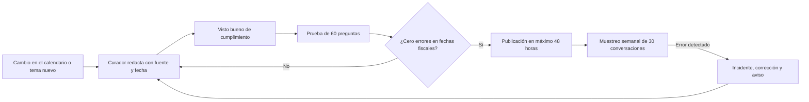
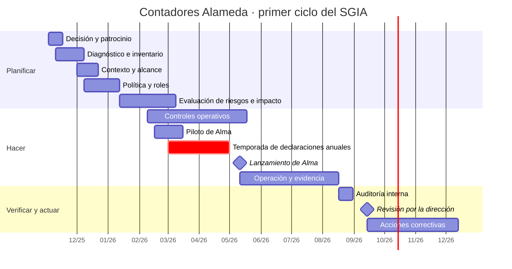

# Caso 1 · Contadores Alameda: una PyME que usa IA generativa

:material-briefcase-outline: Caso práctico
:material-cloud-download-outline: Usa IA de terceros
:material-clock-outline: 30 min de lectura

!!! note "Empresa ficticia"
    Contadores Alameda, BotNorte y las personas, cifras, folios y documentos de este caso son inventados con fines didácticos; cualquier parecido con organizaciones reales es coincidencia. Las decisiones del despacho son una forma razonable de aplicar ISO/IEC 42001, no la única: cuando una interpretación es discutible, lo señalamos. Los nombres de los controles del Anexo A son traducción libre de referencia del autor.

!!! abstract "El caso en una frase"
    Un despacho contable de Querétaro que nunca ha entrenado un modelo descubre que la IA ya vive en su correo, en su software contable, en su WhatsApp y en las cuentas personales de su gente, y en unos diez meses arma un sistema de gestión de IA (SGIA) del tamaño de sus 58 personas: una veintena de documentos breves, roles acumulados con contrapesos, hojas de cálculo y el esfuerzo concentrado donde está el riesgo, su chatbot Alma.

## Contexto y alcance

### La organización

Contadores Alameda, S.C. lleva la contabilidad, la nómina y el cumplimiento fiscal de unas 400 PyMEs de Querétaro y del Bajío: talleres, consultorios, restaurantes y distribuidoras, muchas de ellas personas físicas con actividad empresarial. Tiene 58 colaboradores: 7 en dirección y gerencias, 33 contadores y especialistas de nómina, 8 en atención a clientes, 3 en TI y 7 en áreas de apoyo. Usa una suite de ofimática en la nube con licencia empresarial, un software contable de un proveedor nacional, WhatsApp como canal principal con los clientes y Alma, un chatbot que acababa de contratar como software como servicio (*software as a service*, SaaS) a BotNorte, una empresa de Monterrey, y que todavía no abría a sus clientes. Nadie ahí se describiría como "una empresa de IA".

### Dos detonantes en el mismo trimestre

| Detonante | Qué pasó | Qué dejó al descubierto |
|---|---|---|
| El cuestionario del banco | Un banco al que el despacho presta servicios de nómina añadió a su cuestionario anual de proveedores una sección sobre gobierno de IA: qué sistemas usan, quién los aprueba, cómo evalúan proveedores, cómo capacitan y cómo avisan a quien conversa con una IA. | El despacho no podía demostrar nada. Tenía buenas intenciones y ningún registro. |
| La nómina en un chatbot gratuito | Un colaborador pegó una nómina completa (nombres, RFC, CURP, salarios) en un chatbot gratuito para "darle formato". Su supervisora lo detectó días después. | IA en la sombra (*shadow AI*): herramientas no autorizadas con datos de clientes, sin contrato ni aviso de privacidad que lo cubriera. |

La nómina quedó registrada como el primer incidente del SGIA (INC-2025-01). Como el despacho trata esos datos por cuenta de la PyME cliente, la coordinadora de cumplimiento y datos personales documentó qué se compartió, le avisó sin demora y evaluó con ella si hubo una vulneración significativa en los términos de la nueva LFPDPPP[^lfpdppp] (ver [México y Latinoamérica](../integracion/contexto-mexico-latam.md#ejemplo-alameda)). La lección de fondo la desarrolla la [cláusula 10.2](../clausulas/c10-mejora.md#c-10-2): "recordar la política" no es una acción correctiva.

### La decisión: alinearse primero, decidir la certificación después

En noviembre de 2025 la socia directora firmó una minuta de una página con tres decisiones:

1. Implementar un SGIA conforme a ISO/IEC 42001 con alcance acotado y designar al gerente de TI como responsable.
2. **No contratar todavía la auditoría de certificación.** El despacho no tiene un sistema de gestión de seguridad de la información (SGSI) ISO 27001 en el cual apoyarse, sus recursos son limitados y el banco pedía evidencia, no un certificado. Es la ruta de [alinearse sin certificar, por ahora](../empieza-aqui/necesito-iso42001.md#alinearte).
3. Decidir sobre la certificación en la revisión por la dirección que cierre el primer ciclo, con criterios fijados de antemano (ver [La decisión del primer año](#la-decision-del-primer-ano)).

Alinearse no significó hacer la mitad: el despacho implementó las cláusulas 4 a 10 y una Declaración de Aplicabilidad (*Statement of Applicability*, SoA); solo pospuso la auditoría externa. Por eso dice "operamos un sistema de gestión de IA alineado con ISO/IEC 42001" y nunca "estamos certificados" (ver [Cómo se certifica](../auditoria/como-se-certifica.md)).

### El alcance del SGIA

> *Uso de sistemas de IA de terceros en la prestación de servicios contables, de nómina y de atención a clientes desde la oficina de Querétaro.*

| Dentro del alcance | Fuera del alcance, y por qué |
|---|---|
| IA-01, IA-02 (Alma) e IA-03, descritos en el [inventario](#inventario-de-sistemas-de-ia) | Un módulo de conciliación bancaria con IA en cotización: entrará como cambio planificado ([6.3](../clausulas/c6-planificacion.md#c-6-3)) cuando se contrate |
| Los procesos de contabilidad, nómina y atención, y las 58 personas que los operan o apoyan | El desarrollo de modelos, que el despacho no hace; si un día ajusta uno propio, tendrá que ampliar el alcance ([10.1](../clausulas/c10-mejora.md#c-10-1)) |
| Las interfaces con BotNorte, el fabricante de la suite y el proveedor del software contable | Nada más. Los chatbots gratuitos no quedan "fuera": quedan prohibidos y vigilados dentro del alcance |

El documento de alcance ([4.3](../clausulas/c4-contexto.md#c-4-3)) anexa el inventario, una nota sobre la curaduría de la base de conocimiento de Alma y el análisis de contexto ([4.1](../clausulas/c4-contexto.md#c-4-1)), que el [ejemplo resuelto de la cláusula 4](../clausulas/c4-contexto.md#ejemplo-resuelto) desarrolla paso a paso.

### Un SGIA a la medida de 58 personas

La norma no fija un tamaño mínimo de equipo ni de documentación; pide coherencia entre lo que planeas y lo que haces.

**Roles acumulados, con contrapesos.** No hay un "oficial de IA" de tiempo completo:

| Persona | Sombreros en el SGIA | Contrapeso | Dedicación aproximada |
|---|---|---|---|
| Socia directora | Alta dirección: aprueba política y SoA, acepta riesgos residuales, preside comité y revisión por la dirección | Sus decisiones quedan en minuta ante la asamblea de socios | 2 a 3 horas al mes |
| Gerente de TI | Responsable del SGIA, de la seguridad y de las compras de TI; dueño de IA-01 | Sus excepciones las autoriza la socia directora; no audita el SGIA que diseñó | 2 días por semana en el proyecto; cerca de 1 en operación |
| Coordinadora de cumplimiento y datos personales | Privacidad; conduce las evaluaciones de impacto; recibe el canal de inquietudes; aprueba los cambios a la base de conocimiento de Alma | Un par externo revisó su primera evaluación; el canal tiene ruta alterna a la socia directora | 3 a 4 horas por semana |
| Líder de atención a clientes | Dueña de Alma; supervisa escalamientos; coordina el muestreo semanal | La exactitud de Alma la califica un contador, no ella | 4 a 5 horas por semana |

Completan el cuadro el gerente del área contable (dueño de IA-03), tres contadores senior que curan la base de conocimiento de Alma, un consultor que acompañó la implementación y un auditor externo distinto para la auditoría interna. Un **comité de IA** de 45 minutos se reúne cada mes; cada tercera sesión revisa a fondo indicadores, riesgos y requisitos legales. La revisión por la dirección formal es semestral, dentro de la junta de socios ([9.3](../clausulas/c9-evaluacion-del-desempeno.md#c-9-3)).

**Pocos documentos, pero que se usan.** Una veintena de piezas; ninguna pasa de seis páginas:

| Documento o registro | Extensión | Qué cubre |
|---|---|---|
| Alcance y contexto; política de IA; política de uso aceptable con semáforo; matriz RACI | 3 y 4 páginas; 1 y 1 hoja | Cláusulas [4](../clausulas/c4-contexto.md) y [5](../clausulas/c5-liderazgo.md), [A.2](../anexo-a/a2-politicas.md), [A.3.2](../anexo-a/a3-organizacion-interna.md#a-3-2), [A.9.2](../anexo-a/a9-uso.md#a-9-2) |
| Metodología de riesgos e impacto: criterios, matriz y cribado | 6 páginas | [6.1.1](../clausulas/c6-planificacion.md#c-6-1-1), [A.5.2](../anexo-a/a5-evaluacion-de-impacto.md#a-5-2) |
| Inventario, registro de riesgos con plan de tratamiento, SoA y registro de incidentes | Hojas de cálculo | 4.1, 6.1.2, 6.1.3, 8.2, 8.3, 10.2 |
| Evaluaciones de impacto EIA-01, EIA-02 y EIA-03 | 2, 6 y 2 páginas | [6.1.4](../clausulas/c6-planificacion.md#c-6-1-4), [8.4](../clausulas/c8-operacion.md#c-8-4) |
| Procedimiento de operación de Alma (PR-ALMA-01), formulario de alta de nuevos usos y plan de incidentes | 5, 1 y 2 páginas | [8.1](../clausulas/c8-operacion.md#c-8-1), [A.6.2.5](../anexo-a/a6-ciclo-de-vida.md#a-6-2-5), [A.6.2.6](../anexo-a/a6-ciclo-de-vida.md#a-6-2-6), [A.8.4](../anexo-a/a8-informacion-partes-interesadas.md#a-8-4) |
| Matriz de responsabilidades y adenda con BotNorte; cuestionario de proveedores | 1, 3 y 2 páginas | [A.10](../anexo-a/a10-terceros.md) |
| Competencias y toma de conciencia; fichas de objetivos; auditoría interna y minutas | Variable | [7.2](../clausulas/c7-apoyo.md#c-7-2), [6.2](../clausulas/c6-planificacion.md#c-6-2), [9](../clausulas/c9-evaluacion-del-desempeno.md) |

**Herramientas sencillas.** Las plantillas de esta guía en hoja de cálculo; el repositorio de la propia suite, con historial de versiones y permisos; sus formularios para el canal de inquietudes y el alta de nuevos usos; las funciones de prevención de fuga de datos (*data loss prevention*, DLP) y la bitácora de auditoría que ya venían en la licencia; el panel de BotNorte con exportación mensual de conversaciones. Sin herramienta GRC y sin consultor de planta.

## Roles frente a la IA

El despacho no desarrolla ni provee IA en el sentido de ISO/IEC 22989: la contrata y la usa. Pero "usar" tiene matices según el sistema, y la cláusula [4.1](../clausulas/c4-contexto.md#c-4-1) pide dejarlos escritos (conceptos en [Roles en la IA](../fundamentos/roles-en-la-ia.md)).

| Sistema | Rol de Contadores Alameda (ISO/IEC 22989) | Otros actores y su rol | Rol en datos personales |
|---|---|---|---|
| IA-01 · Asistente de ofimática | Cliente; sus 58 colaboradores son usuarios | Fabricante de la suite: proveedor y productor | Responsable de los datos de sus clientes y de su personal; encargado de los datos de nómina de los trabajadores de sus clientes |
| IA-02 · Alma | Cliente de BotNorte que despliega a Alma frente a sus clientes y cura su base de conocimiento | BotNorte: proveedor del servicio · Proveedor del modelo: proveedor de plataforma frente a BotNorte · Integrador de la agenda: socio · PyMEs que escriben: usuarias y sujetos de IA | Responsable de los datos de las conversaciones; BotNorte es encargado y el proveedor del modelo interviene como su subcontratista |
| IA-03 · Captura de CFDI | Cliente y usuario | Proveedor del software contable: proveedor · Personas en las facturas: titulares de datos · SAT: autoridad | Encargado de los datos de los CFDI de sus clientes |
| Chatbots gratuitos | Ninguno reconocido: uso sin contrato | Proveedores sin relación con el despacho | En nuestra lectura, el despacho, como encargado, compartió datos fuera de las instrucciones de su cliente |

!!! question "¿Curar la base de conocimiento hace al despacho algo más que cliente?"
    El equipo concluyó que su rol principal frente a Alma es el de cliente, pero que la curaduría lo acerca al de proveedor de datos, una variante del socio de IA. Lo documentó y asumió las consecuencias: controles de calidad y procedencia ([A.7.4](../anexo-a/a7-datos.md#a-7-4), [A.7.5](../anexo-a/a7-datos.md#a-7-5)), un control propio de curaduría (CA-01) y transparencia hacia sus clientes ([A.8.2](../anexo-a/a8-informacion-partes-interesadas.md#a-8-2)). En nuestra lectura es razonable; otro equipo podría clasificarlo distinto. Lo importante es que la decisión esté escrita y tenga dueño.

La matriz de responsabilidades de Alma ([A.10.2](../anexo-a/a10-terceros.md#a-10-2)) cabe en una página. BotNorte responde por la plataforma y su disponibilidad, por la relación con el proveedor del modelo (con aviso de 15 días antes de cualquier cambio de versión), por exportar cada mes las conversaciones con datos enmascarados y por notificar incidentes en 24 horas; como encargado, no entrena modelos con los datos del despacho. El despacho responde por la base de conocimiento, los avisos de IA y de privacidad, la atención humana, la revisión de muestras y la comunicación con sus clientes. Recuerda la advertencia de [6.1.3](../clausulas/c6-planificacion.md#c-6-1-3): repartir tareas traslada costos, no la rendición de cuentas. Si Alma se equivoca, el cliente le reclama al despacho, no a BotNorte.

## Inventario de sistemas de IA

El inventario se armó en unas cuatro semanas con una encuesta anónima de cinco preguntas, la revisión de licencias y gastos con tarjeta corporativa y las notas de versión de los proveedores. La sorpresa fue IA-03: nadie lo veía como IA hasta que el gerente de TI leyó las notas de versión del software contable ([A.4.2](../anexo-a/a4-recursos.md#a-4-2)). La encuesta confirmó que varias personas usaban chatbots gratuitos para resumir documentos de clientes. Las filas siguen las columnas de la [plantilla de inventario](../plantillas/index.md#inventario-sistemas-ia):

| Campo | IA-01 · Asistente de ofimática | IA-02 · Alma, chatbot de WhatsApp | IA-03 · Captura de CFDI | Chatbots gratuitos con cuentas personales | Transcripción de videollamadas |
|---|---|---|---|---|---|
| Propósito y uso previsto | Redactar correos, resumir juntas, analizar hojas de cálculo | Responder preguntas frecuentes sobre fechas generales de obligaciones fiscales, informar estatus de trámites y agendar citas; sin asesoría personalizada | Extraer datos de facturas para la contabilidad | Ninguno autorizado | Por definir |
| Rol | Cliente y usuario | Cliente que despliega y cura | Cliente y usuario | Ninguno reconocido | Cliente |
| Origen | Proveedor externo (SaaS) | Proveedor externo (SaaS) | Módulo dentro de otro producto | IA no autorizada detectada | Función de un producto contratado |
| Proveedor | Fabricante de la suite | BotNorte, con un modelo de un tercero | Proveedor nacional del software contable | Varios | Fabricante de la plataforma |
| Tipo de IA | IA generativa (LLM) | IA generativa (LLM) con base de conocimiento | Visión por computadora y extracción de texto | IA generativa (LLM) | Voz a texto e IA generativa |
| Datos | Correos, documentos, hojas de cálculo | Base de conocimiento; mensajes y teléfono de clientes; hoja de estatus; agenda | Facturas en XML y PDF | Lo que se pegó, incluida una nómina | Audio de juntas |
| ¿Datos personales? | Sí | Sí | Sí | Sí | Sí |
| ¿Influye en decisiones sobre personas? | No | Sí: el cliente decide cuándo declarar con lo que Alma le dice | No | No aplica | No |
| Nivel de riesgo | Medio | Alto | Medio | No aplica: uso prohibido | Sin evaluar |
| ¿Evaluación de impacto? | Breve (EIA-01) | Completa (EIA-02) | Breve (EIA-03) | No aplica | Antes de reactivarla |
| Dueño | Gerente de TI | Líder de atención a clientes | Gerente del área contable | Gerente de TI | Gerente de TI |
| Estado | En producción | En producción desde mayo de 2026 | En producción | Bloqueado y vigilado con DLP | Suspendido |

El "nivel de riesgo" del inventario clasifica al sistema por su exposición, para fijar la profundidad y frecuencia de sus evaluaciones; no es la calificación de un riesgo concreto del registro. La transcripción se desactivó al descubrirla y sigue pendiente de evaluar: cuando la auditoría interna preguntó por ella, el registro mostraba exactamente eso.

## Riesgos principales

El despacho adoptó los criterios que propone la [cláusula 6.1.1](../clausulas/c6-planificacion.md#c-6-1-1): consecuencia de 1 a 5 para la organización (O), los individuos (I) y la sociedad (S), tomando la peor; probabilidad (P) de 1 a 5, y una matriz asimétrica que pesa más la consecuencia. Escribió ejemplos ancla propios: un "4" para individuos es que un cliente pague recargos por una fecha equivocada; un "4" para la organización, perder a un cliente corporativo o recibir una reclamación formal del banco. Evaluó juntos IA-01 e IA-03, herramientas internas con revisión humana, y a Alma por separado, porque cambian el canal y las personas afectadas ([6.1.2](../clausulas/c6-planificacion.md#c-6-1-2)).

| ID · Sistema | Riesgo: causa → evento → consecuencia | O | I | S | P | Nivel inherente |
|---|---|---|---|---|---|---|
| R-01 · IA-01 y uso general | Hábito de "resolverlo rápido" y chatbots gratuitos a un clic → alguien pega nóminas o datos fiscales en una herramienta no autorizada → exposición de datos de trabajadores de los clientes e incumplimiento de confidencialidad | 4 | 4 | 1 | 5 | 🟥 Crítico |
| R-02 · Alma | Base de conocimiento desfasada del calendario fiscal, o un modelo que completa con una fecha plausible → Alma da una fecha límite equivocada → el cliente paga recargos y reclama al despacho | 3 | 4 | 2 | 4 | 🟥 Crítico |
| R-03 · Alma | Aviso de IA que pasa inadvertido → clientes, sobre todo mayores, creen hablar con su contador → toman una respuesta general como asesoría personal | 3 | 3 | 2 | 4 | 🟧 Alto |
| R-04 · Alma | Costumbre de mandar todo por WhatsApp → clientes envían su contraseña del SAT (CIEC), archivos de su e.firma o identificaciones → esos datos quedan en registros de terceros, con riesgo de suplantación fiscal | 4 | 4 | 1 | 3 | 🟧 Alto |
| R-05 · Alma | BotNorte depende de un modelo de un tercero → cambio de versión sin aviso o caída en temporada alta → respuestas distintas a las probadas o clientes sin atención | 3 | 3 | 1 | 3 | 🟧 Alto |
| R-06 · IA-03 | Facturas escaneadas con mala calidad o catálogos desactualizados → extracción errónea de RFC, montos o uso del CFDI → contabilidad y declaraciones del cliente con datos incorrectos | 3 | 3 | 1 | 4 | 🟧 Alto |
| R-07 · IA-01 | Confianza excesiva en el asistente → un resumen con montos equivocados llega al cliente sin revisión → el cliente decide con datos falsos | 3 | 2 | 1 | 3 | 🟧 Alto |
| R-08 · IA-01 | Métricas de uso disponibles por persona → se usan para evaluar productividad → trato injusto y vigilancia excesiva del personal | 2 | 3 | 1 | 2 | 🟨 Medio |

| ID | Opción | Controles del Anexo A | Controles propios y medidas | Residual | Acepta |
|---|---|---|---|---|---|
| R-01 | Reducir | [A.2.2](../anexo-a/a2-politicas.md#a-2-2), [A.9.2](../anexo-a/a9-uso.md#a-9-2), [A.3.3](../anexo-a/a3-organizacion-interna.md#a-3-3), [A.4.6](../anexo-a/a4-recursos.md#a-4-6) | Uso aceptable con semáforo; IA-01 como alternativa autorizada; CA-02 (bloqueo y alertas DLP por RFC, CURP y nóminas); periodo para declarar sin sanción lo que ya se usaba | C4 · P2 → 🟧 Alto | Socia directora, temporal por seis meses con revisión trimestral |
| R-02 | Reducir | [A.6.2.5](../anexo-a/a6-ciclo-de-vida.md#a-6-2-5), [A.6.2.6](../anexo-a/a6-ciclo-de-vida.md#a-6-2-6), [A.7.4](../anexo-a/a7-datos.md#a-7-4), [A.9.4](../anexo-a/a9-uso.md#a-9-4) | CA-01 (curaduría y prueba de 60 preguntas); CA-03 (abstención y traspaso); fecha de actualización visible; el despacho absorbe recargos causados por Alma | C3 · P2 → 🟨 Medio | Gerente de TI, informando a la socia directora |
| R-03 | Reducir | [A.8.2](../anexo-a/a8-informacion-partes-interesadas.md#a-8-2), [A.5.4](../anexo-a/a5-evaluacion-de-impacto.md#a-5-4) | Saludo que se presenta como IA y ofrece una persona; recordatorio en respuestas sobre plazos; aviso de privacidad actualizado | C3 · P2 → 🟨 Medio | Gerente de TI |
| R-04 | Reducir | [A.10.2](../anexo-a/a10-terceros.md#a-10-2), [A.10.3](../anexo-a/a10-terceros.md#a-10-3), [A.6.2.8](../anexo-a/a6-ciclo-de-vida.md#a-6-2-8) | Advertencia de no enviar contraseñas; enmascaramiento de RFC, CURP y contraseñas en registros; conservación corta; adenda de encargado | C4 · P1 → 🟨 Medio | Gerente de TI, con visto bueno de la coordinadora |
| R-05 | Reducir y compartir | [A.10.3](../anexo-a/a10-terceros.md#a-10-3), [A.6.2.6](../anexo-a/a6-ciclo-de-vida.md#a-6-2-6) | Aviso previo ante cambio de modelo, acuerdo de nivel de servicio (*service level agreement*, SLA) y reportes de disponibilidad; prueba de aceptación ante cualquier cambio; mensaje de contingencia | C3 · P2 → 🟨 Medio | Gerente de TI |
| R-06 | Reducir | [A.7.4](../anexo-a/a7-datos.md#a-7-4), [A.9.3](../anexo-a/a9-uso.md#a-9-3) | XML preferido sobre PDF; revisión humana de capturas de baja confianza; muestreo mensual de 2 % contra el XML | C3 · P2 → 🟨 Medio | Gerente de TI, a propuesta del gerente del área contable |
| R-07 | Reducir | [A.9.2](../anexo-a/a9-uso.md#a-9-2), [A.8.2](../anexo-a/a8-informacion-partes-interesadas.md#a-8-2) | Revisión obligatoria antes de enviar; etiqueta "borrador elaborado con apoyo de IA y revisado por…" | C2 · P2 → 🟩 Bajo | Gerente de TI, dueño de IA-01 |
| R-08 | Evitar | [A.5.4](../anexo-a/a5-evaluacion-de-impacto.md#a-5-4), [A.2.2](../anexo-a/a2-politicas.md#a-2-2) | La política prohíbe usar esas métricas para evaluar desempeño | C3 · P1 → 🟩 Bajo | Gerente de TI, dueño de IA-01 |

Dos calificaciones marcaron el proyecto. **R-01 salió Crítico**, y para los criterios del despacho eso exige respuesta inmediata: el bloqueo de chatbots gratuitos se activó antes de terminar el inventario. **R-02 también salió Crítico**, con evidencia propia (Alma falló 4 de 60 preguntas sobre fechas en la primera prueba de aceptación), así que no se abrió a todos los clientes hasta recalificar el residual con los resultados del piloto.

El residual de R-01 sigue en Alto porque el vector que queda (fotografiar una nómina con un celular personal) no se bloquea desde la red. La socia directora lo aceptó de forma temporal y condicionada, como permiten los criterios de [6.1.3](../clausulas/c6-planificacion.md#c-6-1-3). El registro incluye además una oportunidad, **O-01**: Alma atiende fuera de horario y libera al equipo de atención de lo repetitivo; se sigue con el porcentaje de consultas resueltas sin traspaso y el tiempo de primera respuesta.

### CA-01: el control que más trabaja

Ningún control del Anexo A describe lo necesario para que la base de conocimiento de Alma no envejezca, así que el despacho diseñó uno propio. Cada respuesta lleva responsable, fuente (calendario fiscal oficial o criterio interno) y fecha de revisión; la coordinadora la valida cada mes, y cada semana en temporada de declaraciones anuales:

## Evaluación de impacto completa: Alma (EIA-02)

Antes de cada evaluación de impacto del sistema de IA (*AI system impact assessment*), el despacho aplicó a sus tres sistemas el cribado de su procedimiento ([A.5.2](../anexo-a/a5-evaluacion-de-impacto.md#a-5-2)). **IA-01** recibió una evaluación breve, centrada en lo que se escribe en las instrucciones (*prompts*) y en los trabajadores: de ahí salió la decisión de R-08. **IA-03** también quedó en evaluación breve, con severidad media por el efecto de un error de extracción en la contabilidad del cliente. **Alma** conversa con el público, da información con consecuencias fiscales y muchos usuarios no saben que hablan con una IA. El cribado pedía al menos una evaluación intermedia; el despacho la hizo completa porque entre sus usuarios hay adultos mayores y porque recibe datos que nadie les pidió enviar.

Lo que sigue resume el documento de seis páginas, en su versión vigente. La severidad usa la [escala que propone esta guía](../anexo-a/a5-evaluacion-de-impacto.md#una-escala-de-severidad-para-dejar-de-discutir-en-abstracto): gravedad (G), alcance (A) y reversibilidad (R) de 1 a 4; la suma da baja (3–4), media (5–7), alta (8–9) o crítica (10–12), y la gravedad sube un nivel si el grupo expuesto necesita protección especial.

### 1. Identificación y versiones

| Campo | Contenido |
|---|---|
| Folio y sistema | EIA-02 · IA-02 Alma, con el modelo que BotNorte declaró en julio de 2026 |
| Conduce y participan | Coordinadora de cumplimiento; líder de atención (dueña), gerente de TI y un contador curador; un par externo revisó la versión 1.0 |
| Aprueba | Socia directora, porque la versión 1.0 tuvo un impacto de severidad alta |
| Vínculos | Riesgos R-02 a R-05; evaluación de impacto en la protección de datos (EIPD) de Alma; [ficha del sistema](../plantillas/index.md#ficha-del-sistema); PR-ALMA-01 |

| Versión | Fecha | Disparador | Qué cambió |
|---|---|---|---|
| 1.0 | Febrero de 2026 | Sistema nuevo, antes del piloto | Primera evaluación; el impacto I-03, de severidad alta, obligó a pactar el enmascaramiento con BotNorte antes del piloto |
| 1.1 | Marzo de 2026 | Piloto: 7 de 20 clientes, 5 de ellos mayores de 60 años, no notaron que hablaban con un asistente virtual | Saludo reforzado, recordatorio en respuestas sobre plazos y palabra clave para pedir una persona; I-02 revalorada con el piso por vulnerabilidad |
| 1.2 | Julio de 2026 | BotNorte avisó un cambio de modelo que además habilitaba notas de voz | Prueba de aceptación repetida; nuevo impacto positivo I-P3; el audio, como dato nuevo, se analizó en la EIPD |

### 2. Uso previsto y uso indebido previsible

**Uso previsto.** Alma responde por WhatsApp preguntas frecuentes sobre fechas generales de obligaciones fiscales, informa el estatus de trámites (constancia de situación fiscal, opinión de cumplimiento, altas ante el IMSS) y agenda citas, con base en la información que cura el despacho. No da asesoría personalizada ni calcula impuestos: lo que excede ese alcance lo pasa a un contador ([A.9.4](../anexo-a/a9-uso.md#a-9-4)).

**Uso indebido previsible**, según la experiencia del equipo de atención:

- Clientes que piden asesoría ("¿me conviene cambiar de régimen?") o envían su CIEC, su e.firma o su identificación "para que el despacho ya los tenga".
- Trabajadores de las PyMEs cliente que escriben por su recibo de nómina, o alguien con el teléfono de un cliente que pregunta por un trámite ajeno.
- Personal del despacho que remite a Alma consultas que debería atender, para ahorrarse trabajo en temporada.
- La tentación futura de pedirle que recomiende un régimen fiscal: sería un caso de uso nuevo, no un ajuste ([A.9](../anexo-a/a9-uso.md)).

### 3. Contexto técnico, social y jurisdicciones

**Técnico.** SaaS sobre un modelo de lenguaje de un tercero; BotNorte indexa la base de conocimiento, un integrador conecta la agenda y el estatus sale de una hoja que atención actualiza a diario. El despacho no ve el modelo por dentro: lo que necesita saber lo pide con el cuestionario de proveedores ([A.10.3](../anexo-a/a10-terceros.md#a-10-3)). Unas 1 800 conversaciones al mes.

**Social.** Usuarios con poca formación fiscal que confían en "lo que dijo el despacho" sin distinguir si respondió una persona o un sistema; muchos adultos mayores prefieren mandar notas de voz. Los picos coinciden con la temporada de declaraciones anuales (marzo y abril), cuando un error cuesta más.

**Jurisdicciones.** Solo México. Aplica la LFPDPPP: el despacho es responsable de los datos de las conversaciones, BotNorte es encargado y, por ser un medio electrónico, el aviso de privacidad simplificado va en el primer mensaje con enlace al integral. En nuestra lectura, el derecho de oposición frente a tratamientos automatizados no se activa, porque Alma no evalúa aspectos personales ni decide sobre nadie. No se identificó una ley de IA aplicable (ver [México y Latinoamérica](../integracion/contexto-mexico-latam.md#mexico)). El contrato con el banco no es una jurisdicción, pero quedó registrado como requisito externo ([A.8.5](../anexo-a/a8-informacion-partes-interesadas.md#a-8-5)).

### 4. Personas y grupos afectados, y consulta

- **Dueños y administradores de las PyMEs cliente**, usuarios directos que necesitan información exacta para no pagar recargos.
- **Adultos mayores al frente de micronegocios**, con menos familiaridad con asistentes virtuales: grupo con necesidad especial de protección.
- **Personas con baja alfabetización digital o discapacidad visual**, que escriben con dificultad o usan lector de pantalla.
- **Trabajadores de las PyMEs cliente**: no son usuarios previstos, pero algunos escriben y sus datos de nómina viajan en mensajes de sus patrones.
- **Contadores y equipo de atención del despacho**, cuyo trabajo cambia (sección 8).

La consulta incluyó un piloto de tres semanas con 20 clientes, 8 de ellos mayores de 60 años, y entrevista telefónica a 8; un taller con atención y los curadores, que aportó la lista de usos indebidos; la revisión de las conversaciones del trimestre anterior, de donde salieron las 30 preguntas que la base debía cubrir; el cuestionario de IA a BotNorte, y la revisión de un par externo. De ahí salieron el aviso reforzado, la fecha de actualización visible y la petición de aceptar notas de voz.

### 5. Impactos en individuos y grupos

| ID | Impacto | Signo | G | A | R | Puntaje y severidad | Riesgo vinculado |
|---|---|---|---|---|---|---|---|
| I-01 | Fecha o plazo fiscal equivocado: recargos o declaración fuera de tiempo | − | 2 | 2 | 2 | 6 · Media | R-02 |
| I-02 | No darse cuenta de que es una IA y tomar la respuesta como asesoría del contador | − | 3 (2 + piso) | 2 | 2 | 7 · Media | R-03 |
| I-03 | Exposición de contraseñas del SAT, e.firma o identificaciones enviadas por mensaje | − | 3 | 2 | 3 | 8 · Alta | R-04 |
| I-04 | Estatus de un trámite revelado a quien no está autorizado | − | 2 | 1 | 2 | 5 · Media | R-04 |
| I-05 | Atención inaccesible para quien no escribe con soltura | − | 3 (2 + piso) | 2 | 1 | 6 · Media | Ninguno: se trató como requisito de diseño |
| I-06 | Respuesta fuera del uso previsto que suena a asesoría | − | 2 | 2 | 2 | 6 · Media | R-03 |
| I-P1 | Respuesta inmediata sobre fechas, estatus y citas, también fuera de horario | + | — | — | — | Magnitud media | O-01 |
| I-P2 | Menos espera para hablar con una persona, porque atención deja lo repetitivo | + | — | — | — | Magnitud media | O-01 |
| I-P3 | Notas de voz para quien prefiere hablar (versión 1.2) | + | — | — | — | Magnitud media para adultos mayores | — |

Cada impacto negativo relevante pasó al registro de riesgos con referencia cruzada ("EIA-02 § 5, I-01 → R-02") y su severidad alimentó la columna de individuos.

### 6. Impactos sociales

| ID | Impacto | Signo | Valoración |
|---|---|---|---|
| S-01 | Error multiplicado: una respuesta equivocada sobre un vencimiento general puede llegar a decenas de clientes en un día de temporada | − | Media (2 · 2 · 2); se trata junto con I-01 |
| S-02 | Micronegocios con acceso fácil a fechas generales cumplen a tiempo | + | Positivo moderado; se seguirá con las quejas por recargos |
| S-03 | La automatización podría usarse para recortar al equipo de atención | − | No significativo, por decisión de la socia directora (sección 8) |
| S-04 | Cómputo del modelo por cada conversación | − | No significativo al volumen del despacho; BotNorte no publica datos de consumo; se le pidieron por escrito |

Conclusión firmada: impacto social bajo, con medidas asignadas a S-01 y S-04, como propone la redacción sugerida en [A.5.5](../anexo-a/a5-evaluacion-de-impacto.md#a-5-5).

### 7. Medidas y supervisión humana

| Medida | Atiende |
|---|---|
| Saludo que se presenta como asistente virtual con IA, aclara qué no hace y ofrece una persona con la palabra ASESOR; recordatorio "confirma con tu contador" en respuestas sobre plazos ([A.8.2](../anexo-a/a8-informacion-partes-interesadas.md#a-8-2)) | I-02, I-06 |
| Fechas solo desde la base de conocimiento, con la leyenda "actualizado al…"; si el dato no está, Alma transfiere (CA-03); el vencimiento propio de cada cliente siempre lo responde una persona | I-01, I-06, S-01 |
| Curaduría con visto bueno y prueba de 60 preguntas; cambios del calendario publicados en 48 horas (CA-01) | I-01, S-01 |
| Estatus solo al número registrado como contacto autorizado y con número de cliente | I-04 |
| Advertencia de no enviar contraseñas; enmascaramiento en registros; si llega una, se elimina y se pide al cliente cambiarla | I-03 |
| Notas de voz y teléfono del despacho visible en cada traspaso | I-05 |
| Muestreo semanal de 30 conversaciones calificadas por un contador, revisión de toda conversación con queja y palabra REPORTE ([A.6.2.6](../anexo-a/a6-ciclo-de-vida.md#a-6-2-6), [A.8.3](../anexo-a/a8-informacion-partes-interesadas.md#a-8-3)) | Todos |
| Si un error de Alma causa recargos, el despacho los absorbe | I-01 |

**Supervisión humana.** Alma no decide nada por el cliente. Una persona interviene en el traspaso, en la revisión de escalamientos, en el muestreo semanal y con un interruptor: si la exactitud mensual baja de 95 % o hay un incidente sobre plazos, la líder de atención apaga ese tema en el panel de BotNorte y Alma transfiere esas preguntas. Si Alma se cae, un mensaje automático da horario y teléfono; si un error se repite, se avisa a quienes lo consultaron, como prevé el plan de [A.8.4](../anexo-a/a8-informacion-partes-interesadas.md#a-8-4).

### 8. Efectos en el personal

Las 8 personas de atención pasaron de contestar lo repetitivo a supervisar a Alma y atender lo que escala. La socia directora decidió que nadie perdería su empleo por Alma: el tiempo liberado se reasignó al seguimiento de trámites. Hubo taller con BotNorte, una sesión sobre alucinaciones y una guía de curaduría para los tres contadores (ver el [ejemplo de la cláusula 7](../clausulas/c7-apoyo.md#ejemplo-resuelto)).

### 9. Impactos residuales y decisión

Con las medidas, los residuales quedaron así: I-01, I-04 e I-06 en severidad baja (4 puntos); I-02 e I-05 en media (5 puntos), porque el piso por vulnerabilidad se mantiene mientras haya adultos mayores entre los usuarios; I-03 en media (6 puntos).

**Decisión:** aprobada para operar, con condiciones. Alma no amplía temas sin nueva evaluación; la exactitud se mide cada mes, con el interruptor en 95 %; cada trimestre se encuesta si los clientes saben que hablan con una IA. La evaluación se repite antes de ampliar Alma a los trabajadores de los clientes, darle temas de asesoría, aceptar un nuevo cambio de modelo o un tipo de dato nuevo, y después de cualquier incidente grave ([8.4](../clausulas/c8-operacion.md#c-8-4)). Firmaron la socia directora, la dueña del sistema y el responsable del SGIA.

### 10. Comunicación, retención y próxima revisión

- **Comunicación:** resumen de dos páginas para el banco cliente; página "Cómo funciona Alma" en el sitio del despacho, en lenguaje claro; aviso de privacidad que menciona a Alma y a BotNorte; ficha interna para atención con los temas que Alma no toca.
- **Retención:** cada versión se conserva mientras Alma opere y cinco años después de su retiro, el plazo que el despacho ya usa para expedientes de clientes ([A.5.3](../anexo-a/a5-evaluacion-de-impacto.md#a-5-3)). Las personas consultadas aparecen por su rol.
- **Próxima revisión:** julio de 2027, o antes si ocurre un disparador.

## Extracto de la Declaración de Aplicabilidad

La versión 1.1 de la SoA declara **27 controles del Anexo A incluidos** (4 con alcance acotado), **11 excluidos** con justificación y **3 controles propios**. Usar IA de terceros no equivale a excluir en automático los controles de ciclo de vida y datos: la base de conocimiento de Alma mantiene varios de ellos vivos ([6.1.3](../clausulas/c6-planificacion.md#c-6-1-3)).

| Control | ¿Se incluye? | Justificación | Estado |
|---|---|---|---|
| [A.2.2](../anexo-a/a2-politicas.md#a-2-2) Política de IA | Sí | Base del SGIA; trata R-01 y R-08; el banco la pidió | Implementado |
| [A.4.3](../anexo-a/a4-recursos.md#a-4-3) Recursos de datos | Sí, ligero | La base de conocimiento de Alma es un recurso que aporta el despacho: ficha de media página con dueña, fuentes y fecha | Implementado |
| [A.4.4](../anexo-a/a4-recursos.md#a-4-4) y [A.4.5](../anexo-a/a4-recursos.md#a-4-5) Herramientas; sistema y cómputo | No | No construye, entrena ni hospeda modelos; herramientas e infraestructura son de los proveedores (A.10.3). El tipo de servicio, la región de alojamiento y el modelo que declara BotNorte se registran en el inventario (A.4.2). Ninguna ley ni contrato lo exige | Excluido |
| [A.5.2](../anexo-a/a5-evaluacion-de-impacto.md#a-5-2) a [A.5.5](../anexo-a/a5-evaluacion-de-impacto.md#a-5-5) Evaluación de impacto | Sí | Las cláusulas 6.1.4 y 8.4 ya lo exigen; cribado de dos niveles | Implementado |
| [A.6.1.2](../anexo-a/a6-ciclo-de-vida.md#a-6-1-2) y [A.6.1.3](../anexo-a/a6-ciclo-de-vida.md#a-6-1-3) Desarrollo responsable | No | No diseña ni desarrolla IA; los objetivos de uso responsable viven en A.9.3 y la curaduría, en CA-01 | Excluido |
| [A.6.2.2](../anexo-a/a6-ciclo-de-vida.md#a-6-2-2), [A.6.2.3](../anexo-a/a6-ciclo-de-vida.md#a-6-2-3) y [A.6.2.4](../anexo-a/a6-ciclo-de-vida.md#a-6-2-4) Requisitos, diseño, verificación y validación | No | No especifica, diseña ni prueba modelos. Lo que sí le toca (configurar a Alma y comprobar que funciona en su contexto) se cubre con la ficha del sistema y la prueba de aceptación dentro de A.6.2.5; lo que exige al proveedor, con A.10.3. Se reevaluará si construye flujos propios o ajusta un modelo | Excluido |
| [A.6.2.5](../anexo-a/a6-ciclo-de-vida.md#a-6-2-5) Despliegue | Sí | Lista de salida de Alma (base revisada, aviso de IA, aviso de privacidad, traspaso probado, piloto, aprobación de la socia directora) y configuración de IA-01; trata R-02 y R-03 | Implementado |
| [A.6.2.6](../anexo-a/a6-ciclo-de-vida.md#a-6-2-6) Operación y monitoreo | Sí | Muestreo de Alma y de CFDI, alertas DLP; trata R-01, R-02 y R-06 | Implementado; ver NC-01 |
| [A.6.2.7](../anexo-a/a6-ciclo-de-vida.md#a-6-2-7) Documentación técnica | No | No la produce: la recibe de sus proveedores (A.10.3) y la resguarda como información de origen externo ([7.5](../clausulas/c7-apoyo.md#c-7-5)); la información para clientes va por A.8.2 | Excluido |
| [A.6.2.8](../anexo-a/a6-ciclo-de-vida.md#a-6-2-8) Registro de eventos | Sí, acotado | Los registros viven en los proveedores: exportación mensual de BotNorte con datos enmascarados y bitácora de la suite | Implementado |
| [A.7.2](../anexo-a/a7-datos.md#a-7-2), [A.7.3](../anexo-a/a7-datos.md#a-7-3) y [A.7.6](../anexo-a/a7-datos.md#a-7-6) Datos para desarrollo, adquisición y preparación | No | No entrena ni ajusta modelos, no adquiere conjuntos de datos y no prepara datos (BotNorte indexa la base). La procedencia del contenido propio se cubre en A.7.5 | Excluido |
| [A.7.4](../anexo-a/a7-datos.md#a-7-4) Calidad de los datos | Sí | Requisitos para la base de conocimiento (fuente, fecha, revisión mensual y semanal en temporada) y para los CFDI; trata R-02 y R-06 | Implementado |
| [A.7.5](../anexo-a/a7-datos.md#a-7-5) Procedencia de los datos | Sí, acotado | Solo la base de conocimiento: versión, responsable y fuente de cada respuesta | Implementado |
| [A.8.2](../anexo-a/a8-informacion-partes-interesadas.md#a-8-2) Información para usuarios | Sí | Saludo de Alma, recordatorio en plazos, etiqueta de contenidos de IA-01; trata R-03 y R-07 | Implementado |
| [A.9.2](../anexo-a/a9-uso.md#a-9-2) Uso responsable | Sí | Ningún uso se activa sin el formulario de alta y su registro en el inventario; trata R-01 y R-07 | Implementado |
| [A.10.3](../anexo-a/a10-terceros.md#a-10-3) Proveedores | Sí | Su control más importante: cuestionario de IA a sus tres proveedores y adenda con BotNorte; trata R-04 a R-06 | En implementación; ver NC-02 |
| [A.10.4](../anexo-a/a10-terceros.md#a-10-4) Clientes | Sí, acotado, desde la versión 1.1 | Ofrece a sus clientes un canal donde interviene una IA y al menos un cliente plantea por escrito expectativas sobre su uso de IA. Se acota a Alma y a los requisitos de IA de los contratos | Implementado |
| CA-01 · CA-02 · CA-03 (propios) | Sí | Curaduría de la base de conocimiento; bloqueo de IA no autorizada con alertas DLP; abstención de Alma cuando el dato no está en la base | Implementados |

!!! question "¿Por qué A.10.4 pasó de excluido a incluido?"
    En la versión 1.0, el gerente de TI lo excluyó con el argumento que verás en ese control: el despacho no suministra sistemas de IA, usa los de terceros para prestar servicios contables. Al contestar el cuestionario del banco cambió de opinión. Una exclusión se sostiene solo si la evaluación de riesgos no pide el control **y** ningún requisito externo lo exige, y el banco acababa de poner por escrito lo que espera del uso de IA en los servicios que contrata. Además, aunque Alma sea de BotNorte, ante sus clientes quien ofrece ese canal es el despacho. En nuestra lectura ambas posiciones son defendibles, pero la segunda resiste mejor la pregunta de un auditor. El cambio costó poco: registrar las expectativas de IA que los clientes han planteado, la cláusula de uso de IA del contrato de servicios y la comunicación de los límites de Alma que ya existía.

!!! info "Otra lectura de A.6.2.2"
    Incluir [A.6.2.2](../anexo-a/a6-ciclo-de-vida.md#a-6-2-2) acotado a la configuración de Alma (temas permitidos, tono, escalamiento) es igual de válido, porque el despacho sí especificó requisitos al contratarla. Lo que un auditor no aceptaría es que esos requisitos no existieran o no se verificaran: aquí viven en la ficha del sistema y se comprueban en la prueba de aceptación.

## Objetivos e indicadores

Los objetivos conectan la política ("informamos con exactitud y transparencia") con algo medible ([6.2](../clausulas/c6-planificacion.md#c-6-2), [A.9.3](../anexo-a/a9-uso.md#a-9-3)):

| ID | Objetivo | Indicador y fórmula | Meta | Frecuencia | Responsable |
|---|---|---|---|---|---|
| OBJ-01 | Exactitud de Alma sobre fechas y obligaciones fiscales en 2026 y 2027 | Respuestas con plazo correcto ÷ respuestas sobre plazos revisadas, en 30 conversaciones al azar por semana (unas 120 al mes) más todas las que terminaron en queja | ≥ 98 %; bajo 95 %, interruptor | Semanal; consolidado mensual | Líder de atención mide; gerente de TI analiza |
| OBJ-02 | Ningún dato de clientes en herramientas de IA no autorizadas | Casos confirmados (alertas DLP verificadas y reportes del canal) | 0 por trimestre | Trimestral | Gerente de TI |
| OBJ-03 | Que los clientes sepan que Alma es una IA | (a) Conversaciones nuevas con aviso ÷ conversaciones nuevas; (b) encuestados que identifican a Alma como asistente virtual ÷ encuestados (30 por trimestre, al menos 10 mayores de 60) | (a) 100 %; (b) ≥ 90 % | Mensual y trimestral | Líder de atención |
| OBJ-04 | Reflejar a tiempo cada cambio del calendario fiscal | Cambios publicados en 48 horas o menos ÷ cambios identificados | 100 % | Mensual | Coordinadora de cumplimiento |
| OBJ-05 | Captura de CFDI confiable | Campos correctos ÷ campos revisados en el muestreo de 2 % contra el XML; capturas de baja confianza revisadas ÷ capturas de baja confianza | ≥ 97 % y 100 % | Mensual | Gerente del área contable |
| OBJ-06 | Personal que conoce y aplica la política | Personas con política firmada y capacitación anual ÷ plantilla; porcentaje que reporta en el simulacro | 100 % y ≥ 85 % | Semestral | Gerente de TI |

**Primeros resultados.** OBJ-01: 98.6 % en junio, 97.9 % en julio (con una muestra incompleta; ver NC-01) y 99.1 % en agosto. OBJ-03 (b): 83 % en la primera encuesta y 93 % en la segunda, tras reforzar el aviso. OBJ-06: las 58 personas firmaron la política; en el simulacro reportó el 71 % en la primera ronda y el 89 % en la segunda. La ficha completa de OBJ-01 está en [9.1](../clausulas/c9-evaluacion-del-desempeno.md#c-9-1).

## Hoja de ruta del caso

La ruta sigue las fases de la [hoja de ruta de implementación](../implementacion/hoja-de-ruta.md#variantes). Del arranque a la primera revisión por la dirección pasaron unos diez meses, algo más que la estimación para una PyME, porque el despacho decidió no lanzar a Alma en plena temporada de declaraciones anuales.

| Fase | Cuándo | Entregables clave |
|---|---|---|
| 0 · Decisión y patrocinio | Noviembre de 2025 | Minuta de la socia directora; responsable designado |
| 1 · Diagnóstico e inventario | Noviembre y diciembre de 2025 | Encuesta e inventario; medida urgente: uso aceptable y bloqueo de chatbots gratuitos |
| 2 · Contexto, roles y alcance | Diciembre de 2025 | Matriz de contexto, partes interesadas, roles y alcance |
| 3 · Liderazgo, política y roles | Diciembre de 2025 y enero de 2026 | Política de IA, RACI, comité mensual, canal de inquietudes, arranque de la toma de conciencia |
| 4 · Riesgo, impacto y SoA | Enero a marzo de 2026 | Criterios, riesgos, EIA-01 a EIA-03, SoA 1.0 y 1.1, plan aprobado, respuesta al banco |
| 5 · Controles operativos | Febrero a mayo de 2026 | Adenda con BotNorte, cuestionarios a proveedores, aviso de privacidad, PR-ALMA-01, piloto, DLP |
| 6 · Operación y evidencia | Mayo a agosto de 2026 | Alma en producción; muestreos, indicadores e incidentes |
| 7 · Auditoría interna y revisión por la dirección | Agosto y septiembre de 2026 | Informe de auditoría y minuta de revisión |
| 8 · Acciones correctivas y decisión | Septiembre a diciembre de 2026 | Cierre de hallazgos; decisión sobre la certificación |

### Lo que pasó en la operación

- **El piloto cambió el diseño.** Tras fallar 4 de 60 preguntas en la primera prueba de aceptación nació CA-03; la segunda prueba salió limpia y el piloto produjo la versión 1.1 de EIA-02.
- **Una respuesta al banco con evidencia.** En marzo de 2026 el despacho entregó política, inventario, evaluación de proveedores, registros de capacitación, un extracto de la SoA y el resumen de EIA-02. Al prepararla descubrió que su política no hablaba de avisar a los clientes cuando conversan con una IA ([A.2.4](../anexo-a/a2-politicas.md#a-2-4)) y que A.10.4 merecía otra mirada. En junio el banco revisó evidencia en la oficina: una auditoría de segunda parte.
- **El aviso previo funcionó.** BotNorte anunció el cambio de modelo con 15 días de anticipación; la prueba repetida encontró un cambio de tono y un error en la agenda, corregidos a tiempo.
- **El muestreo atrapó un error sin daño.** En julio detectó que Alma daba la fecha general de un pago mensual sin advertir que ese mes el vencimiento se recorría al siguiente día hábil. La fecha dada era anterior a la real, así que nadie pagó recargos; se corrigió en 24 horas y CA-01 ahora revisa los días inhábiles.
- **La IA en la sombra se volvió visible.** En seis meses hubo 11 alertas de DLP, 2 de ellas intentos reales de personal de nuevo ingreso (desde entonces el semáforo está en la inducción), y el canal recibió 7 reportes, 3 de ellos sobre respuestas incorrectas de Alma.

### La decisión del primer año {#la-decision-del-primer-ano}

En la revisión por la dirección de septiembre de 2026 la socia directora analizó indicadores, resultados de la auditoría interna, estado del plan de tratamiento, incidentes y la retroalimentación del banco; la lista de entradas de 9.3 no menciona expresamente estas dos últimas, pero incluirlas es buena práctica. Decidió mantener la alineación sin certificar durante el primer semestre de 2027, aprobar la contratación de una persona de medio tiempo para revisar conversaciones de Alma en temporada y volver a decidir en marzo de 2027 con cuatro criterios escritos: si el banco u otro cliente exige el certificado por contrato; si los hallazgos están cerrados y hay un segundo ciclo de indicadores; cuánto cotizan dos organismos de certificación sobre el mismo alcance, y si el despacho implementará también un SGSI ISO 27001, que otros bancos empiezan a pedir, en cuyo caso convendría un sistema integrado ([Integración con ISO 27001](../integracion/con-iso27001.md)).

## Qué le diría el auditor

!!! auditor "La primera auditoría interna, en agosto de 2026"
    La hizo en dos días un auditor externo distinto del consultor que acompañó la implementación ([9.2](../clausulas/c9-evaluacion-del-desempeno.md#c-9-2)). Además de entrevistas y muestreo de registros, hizo una prueba de recorrido: conversó con Alma como cliente, pidió asesoría, mandó una contraseña inventada y preguntó por el trámite de otra empresa.

    **Fortalezas:** un inventario que encontró lo que no se veía (la IA dentro del software contable y los chatbots no autorizados); una evaluación de impacto con consulta real que cambió el diseño y se repitió ante un cambio del proveedor; una prueba de aceptación que funciona como criterio de liberación y que ya detuvo una publicación; una SoA con exclusiones argumentadas y revisadas.

    | Folio y tipo | Requisito | Evidencia | Brecha |
    |---|---|---|---|
    | NC-01 · No conformidad menor | [9.1](../clausulas/c9-evaluacion-del-desempeno.md#c-9-1) y [A.6.2.6](../anexo-a/a6-ciclo-de-vida.md#a-6-2-6); PR-ALMA-01, sección 5 (muestreo semanal de 30 conversaciones) | En los registros de las semanas 23 a 34 de 2026 faltan las semanas 28, 29 y 32, que coinciden con las vacaciones de la líder de atención; el procedimiento no designa suplente | El monitoreo planificado no se hizo en 3 de 12 semanas; el indicador de julio se calculó con unas 90 conversaciones en vez de 120 |
    | NC-02 · No conformidad menor | [A.10.3](../anexo-a/a10-terceros.md#a-10-3) y [8.1](../clausulas/c8-operacion.md#c-8-1) (control de servicios externos) | El cuestionario del proveedor del software contable, recibido en febrero, deja sin respuesta la pregunta sobre subcontratistas que intervienen en la extracción; hay una solicitud de aclaración de marzo y ningún seguimiento ni riesgo registrado | La evaluación del proveedor quedó incompleta y no se escaló |
    | OBS-01 · Observación | [6.1.3](../clausulas/c6-planificacion.md#c-6-1-3) y criterios de aceptación | El registro de riesgos marca la aceptación del residual Alto de R-01 como temporal por seis meses, pero la minuta que la aprueba solo dice "de forma temporal", sin fecha de vencimiento ni condiciones | Una aceptación temporal puede volverse permanente sin revisión |
    | OBS-02 · Observación | [A.5.4](../anexo-a/a5-evaluacion-de-impacto.md#a-5-4) y decisión de EIA-01 | El reporte mensual de TI muestra las métricas de uso de IA-01 con el nombre de cada persona, aunque la política prohíbe usarlas para evaluar desempeño | El control depende solo de la buena voluntad |

    Son no conformidades menores porque son fallas puntuales de ejecución que no comprometen la capacidad del SGIA para lograr sus resultados (ver [Hallazgos de ejemplo](../auditoria/hallazgos-ejemplo.md#no-conformidades-menores)).

    **Recomendaciones:** suplente para cada actividad periódica; un tablero de pendientes con proveedores revisado en el comité mensual; fecha de vencimiento y condiciones en toda aceptación temporal; seudonimizar las métricas de uso; fijar fecha para evaluar o retirar la transcripción de videollamadas.

Si el despacho decide certificarse, un auditor del organismo de certificación preguntaría además por la competencia e independencia documentadas del auditor interno, por la revisión de la aceptación temporal de R-01 al cumplirse los seis meses y por si las exclusiones de A.6 siguen siendo ciertas: por ejemplo, si el despacho empezó a construir flujos propios en el panel de BotNorte. Más preguntas típicas en [Preguntas del auditor](../auditoria/preguntas-del-auditor.md).

## Lecciones para tu organización

- **Usar IA de terceros no te deja fuera.** El riesgo de Alma no estaba en el modelo de BotNorte, sino en lo que el despacho le daba y en cómo la presentaba a sus clientes.
- **Empieza por la IA en la sombra, y ofrece una alternativa.** Prohibir sin una herramienta autorizada solo mueve el problema a los celulares personales.
- **Un piloto pequeño es la mejor consulta.** Veinte clientes revelaron lo que ningún taller interno habría visto.
- **El contrato con el proveedor es un control.** El aviso previo ante cambios de modelo convirtió una sorpresa en un cambio planificado.
- **Proporcional no es superficial.** Una veintena de documentos breves, roles acumulados con contrapesos y hojas de cálculo bastan, si se usan y dejan evidencia.
- **Las exclusiones se argumentan y se revisan.** La SoA es un documento vivo: A.10.4 cambió cuando cambió la información.
- **Mide lo que sí controlas:** la exactitud de lo que reciben tus clientes, el uso que hace tu gente y el desempeño de tus proveedores.
- **Alinearse no es hacer la mitad.** El despacho operó el SGIA completo y solo pospuso la auditoría externa, con criterios claros para decidirla.

## Plantillas usadas en este caso

- [Política de IA](../plantillas/index.md#politica-de-ia) y [Política de uso aceptable de IA generativa](../plantillas/index.md#uso-aceptable-ia-generativa), la primera pieza implementada.
- [Roles y responsabilidades (RACI)](../plantillas/index.md#raci-ia), con notas para PyMEs que acumulan roles.
- [Inventario de sistemas de IA (Excel)](../plantillas/index.md#inventario-sistemas-ia), que trae como ejemplo los sistemas de este caso.
- [Metodología y matriz de riesgos de IA](../plantillas/index.md#evaluacion-de-riesgos) y [Evaluación de impacto del sistema de IA](../plantillas/index.md#evaluacion-de-impacto).
- [Declaración de Aplicabilidad](../plantillas/index.md#declaracion-de-aplicabilidad) y [Ficha del sistema de IA](../plantillas/index.md#ficha-del-sistema), donde viven los requisitos de Alma.
- [Registro de incidentes de IA](../plantillas/index.md#registro-de-incidentes) y [Checklist de auditoría interna](../plantillas/index.md#checklist-auditoria-interna).

No usó el procedimiento del ciclo de vida, pensado para quien desarrolla o provee IA: su lista de salida y su prueba de aceptación caben en PR-ALMA-01.

[^lfpdppp]: Ley Federal de Protección de Datos Personales en Posesión de los Particulares, publicada en el Diario Oficial de la Federación el 20 de marzo de 2025 y en vigor desde el 21 de marzo de 2025; su art. 19 se refiere al aviso de vulneraciones que afecten de forma significativa. Texto vigente en el sitio de la Cámara de Diputados: <https://www.diputados.gob.mx/LeyesBiblio/pdf/LFPDPPP.pdf>, consultado el 9 de octubre de 2026.
