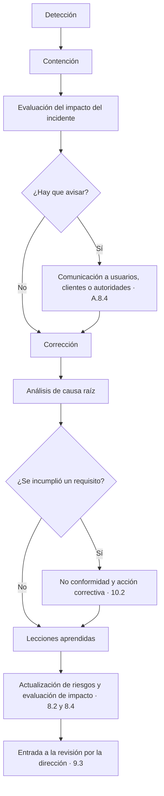

# Cláusula 10 · Mejora

:material-file-document-check-outline: Requisito certificable
:material-cloud-download-outline: Usa IA de terceros
:material-code-braces: Desarrolla IA
:material-handshake-outline: Provee IA a clientes
:material-clock-outline: 17 min de lectura

!!! abstract "En una frase"
    La cláusula 10 cierra el ciclo: cuando algo falla, reaccionas, averiguas por qué pasó, evitas que se repita aquí y en otros sistemas, y usas lo aprendido para que el SGIA sea cada vez más útil.

## Propósito

Es la fase **Actuar** del ciclo PHVA. Todo lo que mediste, auditaste y revisaste en la [cláusula 9](c9-evaluacion-del-desempeno.md) sirve de poco si no cambia nada. La cláusula 10 tiene dos caras: una reactiva (tratar las no conformidades para que no se repitan) y otra proactiva (mejorar aunque nada haya fallado).

En IA, la parte reactiva tiene un reto especial: muchas fallas no se parecen a las de seguridad de la información. Un asistente que inventa una cobertura de seguro no sufrió un ataque ni perdió datos; hizo lo que hacen los modelos de lenguaje cuando el proceso que los rodea no los contiene. Si solo corriges la respuesta equivocada, la siguiente llegará mañana con otra forma.

!!! tip "Analogía"
    Aparece una mancha de humedad en el techo. Pintar encima es la **corrección**: el síntoma desaparece hoy. Encontrar la tubería rota y cambiarla es la **acción correctiva**: atacas la causa. Revisar las demás tuberías del edificio que se instalaron igual es buscar **no conformidades similares**. Y cambiar el plan de mantenimiento para que el impermeabilizante se revise cada año es **mejorar el sistema**. Muchas organizaciones se quedan en la pintura.

## Qué pide, explicado

### 10.1 Mejora continua {#c-10-1}

La norma pide mejorar de manera continua tres cualidades del SGIA. Suenan parecido, pero miden cosas distintas:

| Cualidad | Pregunta | Señal de que falla | Mejora posible |
|---|---|---|---|
| **Idoneidad** (*suitability*) | ¿El SGIA sigue correspondiendo a lo que la organización es y hace hoy? | Contadores Alameda empieza a ajustar un modelo propio para clasificar gastos de sus clientes: ahora también desarrolla IA, pero su alcance y sus procesos solo contemplan el uso de IA de terceros | Ampliar el alcance e incorporar procesos de ciclo de vida y datos (A.6, A.7) |
| **Adecuación** (*adequacy*) | ¿Alcanza? ¿Cubre lo suficiente en extensión y profundidad? | Monarca monitorea la equidad de Score Monarca v3, pero no la del modelo de asignación de línea, que deriva de él | Extender indicadores y evaluaciones de impacto a IA-02 |
| **Eficacia** (*effectiveness*) | ¿Logra los resultados planificados? | Alameda tiene política de uso aceptable y capacitación, pero la herramienta de prevención de fuga de datos sigue detectando nóminas pegadas en chatbots gratuitos | Ofrecer una alternativa autorizada, bloquear servicios no aprobados y rehacer la capacitación con casos reales |

En nuestra lectura, la forma más fácil de recordarlas es esta: idóneo es que **encaja**, adecuado es que **alcanza** y eficaz es que **funciona**. Un SGIA puede encajar y alcanzar, y aun así no funcionar.

Las mejoras salen de la cláusula 9; de incidentes y no conformidades; de los reportes del personal ([A.3.3](../anexo-a/a3-organizacion-interna.md#a-3-3); en esta guía, los nombres de los controles son traducción libre de referencia) y de los usuarios externos ([A.8.3](../anexo-a/a8-informacion-partes-interesadas.md#a-8-3)); de incidentes públicos de otras organizaciones, y de técnicas nuevas, como un mejor método para medir sesgo. Te recomendamos llevar una **cartera de mejoras** con origen, beneficio esperado, responsable y estado, que llegue a la revisión por la dirección ([9.3](c9-evaluacion-del-desempeno.md#c-9-3)). Bajar de 30 a 10 días el tiempo para cerrar una evaluación de impacto también es mejorar.

### 10.2 No conformidad y acción correctiva {#c-10-2}

Cuando aparece una no conformidad (*nonconformity*), la norma espera una secuencia que, contada a nuestra manera, es así:

1. **Reaccionar:** controlar el problema, corregirlo en lo que haga falta y hacerse cargo de sus consecuencias.
2. **Decidir si hay que eliminar la causa** para que no se repita ni aparezca en otro lado. Para decidirlo, analizas lo ocurrido, buscas sus causas y revisas si hay casos parecidos, ya presentes o posibles.
3. **Ejecutar** las acciones necesarias.
4. **Comprobar que funcionaron.**
5. **Ajustar el SGIA** si el problema lo exige.

Las acciones deben ser proporcionales a los efectos (no se investiga igual una firma faltante que una decisión de crédito discriminatoria) y debe quedar evidencia de qué pasó, qué se hizo y con qué resultado.

#### Incidente de IA, no conformidad y riesgo

Tres conceptos que se mezclan con frecuencia. ISO/IEC 42001 define la no conformidad (incumplir un requisito), pero no define *incidente de IA*, así que te proponemos una definición operativa:

| Concepto | Qué es | Ejemplo en Contadores Alameda | Dónde se gestiona |
|---|---|---|---|
| **Riesgo** | Algo que podría pasar y afectaría objetivos, personas o sociedad | Que Alma informe un plazo fiscal equivocado | Evaluación y tratamiento de riesgos ([6.1.2](c6-planificacion.md#c-6-1-2), [8.2](c8-operacion.md#c-8-2)) |
| **Incidente de IA** | Algo que ya pasó: el sistema se comportó de forma no prevista y causó o pudo causar daño | Alma dio a un cliente una fecha posterior al vencimiento y el cliente pagó recargos | Gestión de incidentes y su comunicación ([A.8.4](../anexo-a/a8-informacion-partes-interesadas.md#a-8-4)) |
| **No conformidad** | Incumplimiento de un requisito de la norma, de tu política o procedimiento, de un contrato o de la ley | El procedimiento exigía validar la base de conocimiento de Alma cada mes y nadie lo hacía desde noviembre | Esta subcláusula |

Cómo se relacionan:

- Un riesgo que se materializa se vuelve incidente.
- Un incidente **puede o no** revelar una no conformidad. Si un control no operó como debía, la hay. Si todo funcionó según lo diseñado y aun así ocurrió (por ejemplo, un riesgo residual aceptado), no hay no conformidad, pero sí hay que revisar riesgos e impacto.
- Una no conformidad puede existir sin incidente: un sistema desplegado sin evaluación de impacto incumple aunque nunca haya dañado a nadie. La mayoría se encuentran así, en auditorías.

#### El flujo de un incidente de IA

Puedes integrar este flujo en tu proceso general de incidentes, como el de tu SGSI, si contempla lo propio de la IA: hay incidentes graves sin brecha de seguridad alguna.

#### Reaccionar: contener, corregir y hacerse cargo

- **Detección.** Llega por el monitoreo ([A.6.2.6](../anexo-a/a6-ciclo-de-vida.md#a-6-2-6)), por reportes de usuarios, del personal, del proveedor o de un cliente.
- **Contención.** Detén el daño antes de entenderlo del todo: modo degradado, desvío a revisión humana, desactivar una función o volver a la versión anterior. Estos interruptores se preparan antes del incidente.
- **Evaluación del impacto del incidente.** No es rehacer la evaluación formal de [6.1.4](c6-planificacion.md#c-6-1-4), sino dimensionar: cuántas personas, qué daño, desde cuándo. Los registros de eventos ([A.6.2.8](../anexo-a/a6-ciclo-de-vida.md#a-6-2-8)) lo hacen posible; sin ellos, solo especulas.
- **Comunicación.** [A.8.4](../anexo-a/a8-informacion-partes-interesadas.md#a-8-4) te pide tener definido de antemano cómo avisarás a quienes usan el sistema; la guía del Anexo B sugiere considerar además si hay que avisar a autoridades, en qué plazo y con qué detalle, según contratos y regulación. Si hay datos personales involucrados, revisa tus obligaciones frente a los titulares conforme a la legislación aplicable ([México y Latinoamérica](../integracion/contexto-mexico-latam.md)).
- **Corrección y consecuencias.** Arregla el efecto concreto (la respuesta, la decisión, el dato) y atiende a los afectados: contactarlos, revertir decisiones, compensar cuando corresponda.

#### Análisis de causa raíz aplicado a un fallo de IA

Ejemplo: Alma, el chatbot de WhatsApp de Contadores Alameda, informó a un cliente un vencimiento posterior al real; el cliente pagó tarde y con recargos.

**Los cinco porqués**

1. ¿Por qué el cliente pagó tarde? Porque Alma le dio una fecha límite equivocada.
2. ¿Por qué Alma dio esa fecha? Porque la base de conocimiento conservaba el calendario del año anterior, cuando ese vencimiento cayó en día inhábil y se recorrió al siguiente día hábil; este año no ocurría, y el modelo repitió la fecha vieja.
3. ¿Por qué seguía el calendario anterior? Porque nadie actualizó la base de conocimiento en enero.
4. ¿Por qué nadie la actualizó? Porque el procedimiento decía que se validaba cada mes, pero no asignaba responsable ni fecha; en la práctica dependía de la memoria de la Líder de atención a clientes.
5. ¿Por qué no asignaba responsable? Porque se redactó cuando Alma se veía como un proyecto de TI ya terminado, y el proceso de alta de sistemas de IA ([A.9.2](../anexo-a/a9-uso.md#a-9-2)) no exige planear la operación del contenido que la organización aporta.

**Causa raíz:** la incorporación de sistemas de IA de terceros no contempla la operación continua del contenido propio.

Los cinco porqués empujan a una sola cadena causal, y las fallas de IA casi siempre tienen varias. Conviene complementarlos con un diagrama de Ishikawa (espina de pescado) con categorías adaptadas:

| Categoría | Causas posibles en el caso de Alma | ¿Confirmada? |
|---|---|---|
| Datos y contenido | Calendario vencido; dos documentos con fechas contradictorias | Sí |
| Modelo | Ante contexto ambiguo, el modelo completa con una fecha plausible en lugar de abstenerse | Sí |
| Proceso | Sin responsable, control de cambios ni validación de la base de conocimiento | Sí, causa raíz |
| Personas y supervisión | Nadie revisaba muestras de conversaciones sobre plazos | Sí |
| Proveedor | BotNorte cambió la versión del modelo en febrero sin avisar | No influyó, pero se documenta |
| Medición | No existía indicador de exactitud de Alma | Sí: por eso el problema duró semanas |

#### Buscar casos similares

Esta pregunta es la que más rinde en IA. En Alameda llevó a revisar todo lo que depende de datos que caducan: los catálogos del SAT que usa el módulo de captura de CFDI (IA-03) y las tablas que el personal consulta con el asistente de ofimática (IA-01). Resultó que nadie verificaba que el proveedor del módulo de CFDI actualizara sus catálogos a tiempo; se pactó un compromiso contractual y una verificación trimestral ([A.10.3](../anexo-a/a10-terceros.md#a-10-3)).

#### Verificar la eficacia y ajustar el SGIA

Una acción correctiva (*corrective action*) no se cierra cuando se implementa, sino cuando se comprueba que funcionó. Define el criterio de eficacia al abrirla y deja pasar tiempo suficiente para que el problema pudiera repetirse. Si la causa está en el diseño del sistema de gestión, la acción toca el SGIA: un procedimiento nuevo, un rol con más responsabilidades, un control en la Declaración de Aplicabilidad, un riesgo nuevo en la matriz. Esos cambios se planifican como pide [6.3](c6-planificacion.md#c-6-3).

#### Registro de ejemplo completo

El siguiente registro es un ejemplo hipotético con Contadores Alameda, independiente de la línea de tiempo de su [caso práctico](../casos-practicos/pyme-usa-ia-generativa.md).

| Campo | Contenido |
|---|---|
| Folio y fuente | NC-004 · queja de un cliente por WhatsApp, vinculada al incidente INC-011 |
| Requisito incumplido | Procedimiento de operación de Alma (validación mensual de la base de conocimiento), que implementa controles declarados aplicables: [A.6.2.6](../anexo-a/a6-ciclo-de-vida.md#a-6-2-6) y [A.7.4](../anexo-a/a7-datos.md#a-7-4) |
| Descripción | Alma informó a 14 clientes un vencimiento posterior al real; uno pagó con recargos. La base de conocimiento no se validaba desde noviembre |
| Severidad | Alta: daño económico a clientes y riesgo reputacional |
| Contención | El mismo día, Alma deja de responder sobre plazos y transfiere a una persona |
| Corrección y consecuencias | Base de conocimiento corregida y validada por la Coordinadora de cumplimiento; se contacta a los 14 clientes; el despacho absorbe los recargos del cliente afectado |
| Análisis de causa | Cinco porqués e Ishikawa. Causa raíz: la incorporación de sistemas de IA de terceros no contempla la operación del contenido propio |
| Casos similares | Revisión de IA-01 e IA-03; falta de verificación de catálogos del SAT en IA-03 |
| Acciones correctivas | 1) Dueño y calendario mensual de validación (Líder de atención a clientes, 15 días). 2) Visto bueno de cumplimiento antes de publicar cambios (Coordinadora de cumplimiento, 15 días). 3) Indicador de exactitud con muestreo (Gerente de TI, 30 días). 4) Alma se abstiene y transfiere si no encuentra el dato (BotNorte, 30 días). 5) Procedimiento de alta con plan de operación del contenido (Gerente de TI, 45 días). 6) Verificación trimestral de catálogos con el proveedor de IA-03 (Gerente de TI, 60 días) |
| Criterio de eficacia | Tres meses seguidos con exactitud ≥ 98 % en la muestra y cero quejas por plazos |
| Verificación | Tres meses posteriores: 99 %, 98.3 % y 99.2 %; sin quejas. Eficaz |
| Cambios al SGIA | Nuevo riesgo en la matriz; evaluación de impacto de Alma actualizada; procedimiento de alta en su versión 2 |
| Cierre | Aprobado por el Gerente de TI y presentado en la revisión por la dirección |

## Cómo se aplica según tu rol

=== "Si usas IA de terceros"

    **Contadores Alameda** no puede corregir el modelo, pero sí casi todo lo que lo rodea: el contenido que le da, la configuración, la supervisión, el contrato y la decisión de seguir o no con el proveedor.

    - Exige por contrato que el proveedor avise de incidentes y de cambios de versión del modelo, con plazos ([A.10.3](../anexo-a/a10-terceros.md#a-10-3)). Sin eso, tu flujo de incidentes empieza tarde.
    - Muchas no conformidades serán de uso, no de tecnología. El colaborador que pegó una nómina en un chatbot gratuito protagonizó un incidente con datos personales y una no conformidad a la política de uso aceptable. Corrección: documentar qué se compartió y valorar el aviso a los titulares. Acción correctiva: no basta con "recordar la política"; ofrece una alternativa con licencia empresarial, bloquea servicios no autorizados y revisa si otras áreas hacen lo mismo.
    - Si la causa raíz está en el proveedor, tu acción puede ser exigirle un cambio, añadir un control compensatorio propio o, en último caso, cambiar de proveedor.

=== "Si desarrollas IA"

    **Monarca Crédito** controla el modelo y, por eso, tiene más formas de corregir.

    - Corrección típica: volver a la versión anterior desde el registro de modelos y reprocesar las decisiones afectadas. Si el incidente fue un sesgo, identifica a los solicitantes rechazados en la ventana afectada y ofréceles reconsideración.
    - El análisis de causa raíz casi siempre cruza equipos: datos, ingeniería de variables, validación y producto, como la pantalla que preseleccionaba la aceptación en el [ejemplo de la cláusula 9](c9-evaluacion-del-desempeno.md#ejemplo-resuelto).
    - Busca casos similares en los modelos derivados: lo que falla en IA-01 probablemente afecta a IA-02, que hereda sus datos.
    - Si la acción correctiva implica reentrenar, el Comité de Modelos la aprueba como cambio significativo, con nueva validación y evaluación de impacto ([8.4](c8-operacion.md#c-8-4)).

=== "Si provees IA a clientes"

    **Conversa Labs** atiende incidentes que se multiplican por el número de clientes.

    - Un defecto de la orquestación puede aparecer en decenas de bases de conocimiento: la búsqueda de casos similares abarca toda la plataforma, no un solo cliente.
    - La comunicación tiene dos capas: Conversa avisa al cliente según el contrato, y el cliente avisa a sus usuarios finales, porque es quien despliega frente a ellos ([A.8.4](../anexo-a/a8-informacion-partes-interesadas.md#a-8-4), [A.10.2](../anexo-a/a10-terceros.md#a-10-2)). Plazos, contenido y responsables se pactan antes.
    - Si la causa está en el proveedor del modelo fundacional (por ejemplo, una versión nueva que cambia el comportamiento), la acción correctiva incluye pruebas de regresión antes de aceptar cada versión.
    - Un análisis posterior sin culpables (*blameless postmortem*) compartido con los clientes genera confianza en lugar de restarla.

!!! info "Diferencias con ISO 27001"
    - **Misma estructura y mismo orden.** ISO/IEC 27001:2022 y 42001 siguen la estructura armonizada vigente: 10.1 es mejora continua y 10.2 es no conformidad y acción correctiva. En la edición anterior de ISO 27001 el orden era el inverso, por eso todavía circulan procedimientos con la numeración cambiada.
    - **Lo que dispara una no conformidad.** En un SGSI suele nacer de incidentes de seguridad o de controles que fallan. En un SGIA también aparece por efectos en personas sin brecha alguna: una alucinación, un sesgo, una supervisión humana que se volvió trámite.
    - **Incidentes.** Los controles de incidentes de ISO 27001 (ISO 27001 A.5.24 a A.5.28) se enfocan en seguridad de la información. La guía de 42001 admite integrar la respuesta a incidentes de IA en ese proceso, siempre que atienda sus particularidades.
    - **Un solo registro.** Con ambos sistemas, usa un registro común de no conformidades con un campo que indique a cuál aplica.

## Preguntas para tu organización

- [ ] ¿Distingues en tus registros entre riesgo, incidente de IA y no conformidad?
- [ ] ¿Tu definición de incidente de IA incluye daños sin brecha de seguridad, como alucinaciones o sesgos?
- [ ] ¿Tus sistemas de IA tienen interruptores de contención preparados: modo degradado, desvío a una persona, reversión de versión?
- [ ] ¿Tu plan de comunicación de incidentes dice a quién avisar, en qué plazo y con qué contenido, incluidos clientes y autoridades cuando aplique?
- [ ] ¿Tus análisis de causa raíz llegan a causas de proceso, o se quedan en "error humano"?
- [ ] ¿Buscas sistemáticamente el mismo problema en otros sistemas de IA y otros clientes?
- [ ] ¿Defines el criterio de eficacia al abrir la acción correctiva?
- [ ] ¿Las lecciones aprendidas actualizan la evaluación de riesgos y de impacto?
- [ ] ¿Llevas una cartera de mejoras que no dependa solo de las fallas?

## Qué evidencia espera ver un auditor

| Evidencia | Ejemplo | Señal de alerta |
|---|---|---|
| Procedimiento de no conformidades y acciones correctivas | Flujo, responsables, criterios de severidad, plazos | Procedimiento genérico copiado, sin mención a la IA |
| Registro de no conformidades | Folios con causa, acciones, eficacia y cierre | Registro vacío o solo con hallazgos del organismo de certificación |
| Análisis de causa raíz | Cinco porqués, Ishikawa, análisis posteriores | "Error humano" como causa; "capacitar" como única acción |
| Registro de incidentes de IA | Impacto, contención y comunicación de cada incidente | Solo incidentes de seguridad; ninguno de calidad o sesgo |
| Verificación de eficacia | Datos posteriores que demuestran que no se repitió | Acciones cerradas el mismo día en que se implementan |
| Actualizaciones derivadas y cartera de mejoras | Riesgos e impactos modificados a raíz de incidentes; iniciativas con responsable | Incidentes que no cambian nada; ninguna mejora fuera de las correcciones |

!!! warning "Errores comunes"
    - Cerrar como "error humano" con la acción "capacitar al personal". Si una persona pudo equivocarse así, el proceso lo permitió.
    - Corregir la respuesta equivocada sin investigar por qué el sistema la produjo.
    - Cerrar acciones correctivas al implementarlas, sin verificar su eficacia.
    - Tratar cada incidente de forma aislada, sin buscar el mismo patrón en otros sistemas o clientes.
    - Esconder no conformidades para "llegar limpios" a la auditoría: un registro vacío genera más preguntas que uno lleno y bien gestionado.
    - Gestionar incidentes de IA solo desde seguridad de la información, sin quienes entienden el modelo ni quienes atienden a los afectados.

## Ejemplo resuelto

??? example "Caso: Conversa Labs — el asistente que inventó una cobertura"
    **Qué pasó (incidente INC-2026-014).** Una aseguradora mexicana usa Conversa como asistente de atención a sus asegurados. Uno preguntó si su póliza de auto incluía auto sustituto mientras su vehículo estaba en el taller. El asistente respondió con seguridad que sí, por 15 días. Su plan no la incluía; otro plan de la misma aseguradora sí, pero por 10 días. El asegurado rentó un auto, le rechazaron el reembolso y se quejó con la aseguradora, advirtiendo que acudiría a la Condusef.

    **Detección y contención (día 1).** La aseguradora reportó el caso por el portal de soporte. La Responsable de *Trust & Safety* lo clasificó como incidente de severidad alta y, en dos horas, activó una regla de contención: para ese cliente, toda pregunta sobre coberturas se transfiere a un agente humano.

    **Evaluación del impacto (días 1 y 2).** Con los registros de eventos ([A.6.2.8](../anexo-a/a6-ciclo-de-vida.md#a-6-2-8)) el equipo revisó los últimos 60 días: en 9 conversaciones el asistente afirmó la cobertura a quien no la tenía y 2 asegurados actuaron con base en ello. Otras 3 conversaciones citaban deducibles de otro plan.

    **Comunicación (día 2).** Conforme a su plan ([A.8.4](../anexo-a/a8-informacion-partes-interesadas.md#a-8-4)) y al contrato, Conversa entregó a la aseguradora un informe con las 12 conversaciones afectadas, la contención aplicada y los siguientes pasos. La aseguradora, que despliega el asistente frente a sus asegurados, contactó a los afectados, reembolsó a los dos que rentaron auto y valoró con su área legal si debía reportar algo.

    **Corrección (días 2 a 5).** Los documentos de la base de conocimiento se etiquetaron por producto y se reindexaron. Las respuestas sobre coberturas volvieron con una restricción: el asistente pregunta primero el plan y solo cita documentos de ese plan.

    **Causa raíz.** El modelo no "se volvió loco": recuperó las condiciones reales de otro plan y, a partir de ellas, completó una respuesta con un plazo que no aparece en ningún documento. Es una alucinación construida sobre un contexto equivocado. El verificador de sustento solo comprobó que el concepto "auto sustituto" apareciera en algún documento recuperado; no revisaba cifras ni plazos, ni si el documento correspondía al plan del asegurado. ¿Por qué no se detectó antes? Tres semanas atrás, Customer Success cargó desde el panel de autoservicio las condiciones de dos planes nuevos. El procedimiento de verificación y validación ([A.6.2.4](../anexo-a/a6-ciclo-de-vida.md#a-6-2-4)) exige repetir la batería de evaluación del cliente cuando su base de conocimiento cambia de forma significativa. No se hizo: el panel no la disparaba y la definición de cambio significativo no mencionaba cargas masivas. Además, la batería de seguros no comparaba coberturas entre planes.

    **La no conformidad.** NC-019 al procedimiento de verificación y validación, atendida con la acción correctiva AC-2026-009: un cambio significativo en la base de conocimiento se publicó sin la evaluación de regresión requerida. El incidente fue el síntoma; la no conformidad es del proceso.

    | N.º | Acción correctiva | Responsable | Plazo |
    |---|---|---|---|
    | 1 | El panel bloquea la publicación de cambios relevantes a la base de conocimiento hasta que pase la evaluación de regresión | CTO | 30 días |
    | 2 | Metadatos de producto obligatorios en clientes multiproducto; la recuperación filtra por el plan del usuario | CTO | 45 días |
    | 3 | El verificador de sustento valida cada afirmación, incluidas cifras y plazos, contra los documentos del plan identificado | CTO | 45 días |
    | 4 | Preguntas trampa entre planes en la batería de todos los clientes de seguros, y equivalentes para universidades y comercios con varios productos | *Trust & Safety* | 30 días |
    | 5 | Definición de cambio significativo que incluye cargas masivas y productos nuevos; capacitación a Customer Success | *Trust & Safety* | 30 días |
    | 6 | Guía para clientes sobre integrar los datos de la póliza ([A.8.2](../anexo-a/a8-informacion-partes-interesadas.md#a-8-2)) y aclaración contractual de quién cura el contenido ([A.10.2](../anexo-a/a10-terceros.md#a-10-2)) | Legal y Customer Success | 60 días |

    **Casos similares.** La revisión de toda la plataforma encontró dos universidades con becas de distintos programas mezcladas en la misma base de conocimiento. Se les aplicaron las acciones 2 y 4 antes de que hubiera un incidente.

    **Eficacia.** Criterio fijado al abrir la acción: 90 días sin afirmaciones de cobertura ajenas al plan correcto, en una muestra semanal de 400 conversaciones, y evidencia de evaluación en cada cambio significativo. A los 90 días apareció un caso: un deducible del plan correcto, pero de una versión anterior de las condiciones. La acción se declaró eficaz solo en parte y se agregó control de versiones de documentos; a los 120 días, sin casos, se cerró.

    **Cambios al SGIA y lecciones.** Nuevo riesgo en la matriz (confusión entre productos en bases de conocimiento multiproducto) con su tratamiento; evaluación de impacto del vertical de seguros actualizada; el análisis sin culpables se presentó en la revisión por la dirección y se compartió, anonimizado, con los clientes de seguros.

## Relación con otras cláusulas, controles y normas

- [9.1](c9-evaluacion-del-desempeno.md#c-9-1), [9.2](c9-evaluacion-del-desempeno.md#c-9-2) y [9.3](c9-evaluacion-del-desempeno.md#c-9-3): fuentes de no conformidades y oportunidades; la revisión por la dirección decide las mejoras.
- [6.1.2](c6-planificacion.md#c-6-1-2), [6.1.4](c6-planificacion.md#c-6-1-4), [8.2](c8-operacion.md#c-8-2) y [8.4](c8-operacion.md#c-8-4): conviene que toda lección aprendida se refleje en riesgos e impactos.
- [8.1](c8-operacion.md#c-8-1): la operación también pide considerar acciones correctivas cuando los controles no logran lo esperado.
- [6.3](c6-planificacion.md#c-6-3) y [7.5](c7-apoyo.md#c-7-5): cambios planificados al SGIA y evidencia documentada.
- Controles: [A.3.3](../anexo-a/a3-organizacion-interna.md#a-3-3), [A.6.2.4](../anexo-a/a6-ciclo-de-vida.md#a-6-2-4), [A.6.2.6](../anexo-a/a6-ciclo-de-vida.md#a-6-2-6), [A.6.2.8](../anexo-a/a6-ciclo-de-vida.md#a-6-2-8), [A.8.3](../anexo-a/a8-informacion-partes-interesadas.md#a-8-3), [A.8.4](../anexo-a/a8-informacion-partes-interesadas.md#a-8-4), [A.10.2](../anexo-a/a10-terceros.md#a-10-2), [A.10.3](../anexo-a/a10-terceros.md#a-10-3) y [A.10.4](../anexo-a/a10-terceros.md#a-10-4).
- Normas: un proceso común de incidentes y acciones correctivas en [Integración con ISO 27001](../integracion/con-iso27001.md); el resto de la familia en [La familia de normas de IA](../fundamentos/familia-de-normas.md).
- Auditoría: cómo se redacta una no conformidad en [Hallazgos de ejemplo](../auditoria/hallazgos-ejemplo.md); qué se pregunta en [Preguntas del auditor](../auditoria/preguntas-del-auditor.md).

## Plantillas relacionadas

- [Registro de incidentes de IA](../plantillas/index.md#registro-de-incidentes)
- [Checklist de auditoría interna](../plantillas/index.md#checklist-auditoria-interna)
- [Metodología y matriz de riesgos de IA](../plantillas/index.md#evaluacion-de-riesgos)
- [Evaluación de impacto del sistema de IA](../plantillas/index.md#evaluacion-de-impacto)
- [Procedimiento del ciclo de vida](../plantillas/index.md#procedimiento-ciclo-de-vida)
