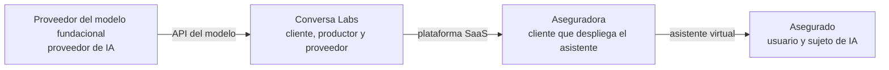
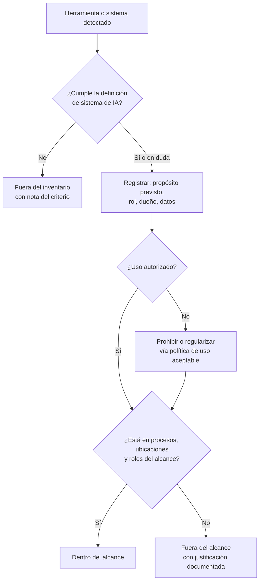

# Cláusula 4 · Contexto de la organización

:material-file-document-check-outline: Requisito certificable
:material-cloud-download-outline: Usa IA de terceros
:material-code-braces: Desarrolla IA
:material-handshake-outline: Provee IA a clientes
:material-clock-outline: 25 min de lectura

!!! abstract "En una frase"
    Antes de gestionar la IA tienes que saber en qué entorno te mueves, qué sistemas de IA tienes, para qué sirve cada uno, qué papel juegas frente a ellos y quién espera algo de ti; con esas respuestas defines el alcance del SGIA, y todo lo demás se apoya en esa decisión.

## Propósito

La cláusula 4 evita que el sistema de gestión se construya en el vacío. En muchos SGSI el análisis de contexto es un FODA (fortalezas, oportunidades, debilidades y amenazas) que se archiva y nadie vuelve a abrir; en ISO/IEC 42001 eso sale caro, porque el contexto tiene consecuencias directas: el **propósito previsto** de cada sistema define qué riesgos e impactos evaluarás en la [cláusula 6](c6-planificacion.md); tus **roles** (si usas, desarrollas u ofreces IA) determinan qué controles del Anexo A te aplican y con qué intensidad; las **partes interesadas** te dicen qué obligaciones cubrirá el SGIA, incluidas las de personas que ni siquiera son tus clientes; y el **alcance** fija dónde mirará el auditor y qué podrás decir públicamente que está certificado.

Si esta cláusula falla, el error se propaga a todo lo demás.

!!! tip "Analogía"
    Un buen arquitecto no dibuja planos sin estudiar el terreno: el suelo, el clima, el reglamento de construcción del municipio, quién va a vivir ahí y a qué vecinos les dará sombra el edificio. La cláusula 4 es ese estudio del terreno para tu SGIA, y el alcance es el polígono del predio: lo que queda dentro es lo que construyes y lo que el inspector revisará.

## Qué pide, explicado

### 4.1 Entender la organización y su contexto {#c-4-1}

La subcláusula 4.1 reúne cuatro encargos que conviene tratar por separado, porque producen evidencias distintas: identificar las cuestiones externas e internas que ayudan o estorban al SGIA, decidir si el cambio climático es pertinente, tener en cuenta el propósito previsto de cada sistema de IA y determinar tus roles frente a ellos.

#### Cuestiones externas e internas

Una nota de la norma da categorías de ejemplo; aquí las aterrizamos con casos de la región. No es una lista cerrada: identifica las que de verdad mueven la aguja en tu caso.

| Cuestión | Ejemplos en México y Latinoamérica |
|---|---|
| **Externa:** leyes aplicables, incluidas las que prohíben ciertos usos de IA | Leyes de datos personales (la nueva LFPDPPP en México, la Ley 1581 en Colombia, la LGPD en Brasil); protección al consumidor; el [Reglamento de IA de la UE](../integracion/reglamento-ia-ue.md) si tienes clientes o usuarios allá; iniciativas legislativas de IA en la región |
| **Externa:** criterios de reguladores | Disposiciones y criterios de autoridades financieras (CNBV, Banxico, Condusef) sobre crédito, transparencia y atención a usuarios; reglas del SAT para comprobantes que un sistema de captura de CFDI tiene que respetar; orientaciones de autoridades de protección de datos sobre el uso de IA |
| **Externa:** incentivos y consecuencias | Cuestionarios de bancos y corporativos sobre gobierno de IA; inversionistas que revisan el gobierno de modelos; crisis en redes cuando un bot se equivoca |
| **Externa:** cultura, valores y ética | Expectativa de trato humano; desconfianza hacia los bots en trámites delicados; WhatsApp como canal principal; variantes regionales del español; personas mayores o hablantes de lenguas indígenas |
| **Externa:** competencia y tendencias | Fintechs que aprueban crédito en minutos; despachos que ofrecen contabilidad automatizada; software que activa funciones de IA sin preguntar |
| **Externa:** dependencia tecnológica | Pocos proveedores de modelos fundacionales, casi todos extranjeros; cambios unilaterales de términos o de versiones; precios en dólares; datos procesados fuera del país |
| **Interna:** gobierno y estructura | Consejo o asamblea activos; un SGSI o programa de privacidad con el cual integrarse |
| **Interna:** obligaciones contractuales | Clientes que prohíben usar sus datos para entrenar modelos; cláusulas de confidencialidad con bancos; niveles de servicio del proveedor del chatbot; plazos para notificar incidentes |
| **Interna:** capacidades, cultura y datos | Talento en ciencia de datos; conocimiento de IA en la plantilla; uso no autorizado de herramientas gratuitas, la llamada IA en la sombra (*shadow AI*); calidad y consentimientos de los datos |

La dependencia tecnológica no aparece en la nota de la norma, pero en nuestra experiencia es de las más relevantes en la región. La norma no prescribe formato. Funciona una matriz con la cuestión, si es oportunidad o amenaza y **cómo se atiende en el SGIA** (un riesgo en 6.1, un objetivo en 6.2, un control). Si una cuestión no lleva a ningún lado, o no era relevante o está mal aprovechada. Como la [revisión por la dirección](c9-evaluacion-del-desempeno.md#c-9-3) tiene que considerar los cambios en estas cuestiones, revisa la matriz al menos una vez al año y ante cambios grandes (una ley nueva, un cliente relevante, otro proveedor de modelos).

!!! auditor "Lo que mira el auditor"
    No evalúa si tu análisis es bonito, sino si es coherente. Elige una cuestión, por ejemplo "los clientes bancarios piden evidencias de gobierno de IA", y busca su rastro en partes interesadas, riesgos, objetivos y controles. Una cuestión que no deja huella es señal de que el análisis se hizo solo para cumplir.

#### El propósito previsto de cada sistema

El propósito previsto (*intended purpose*) responde con precisión a "¿para qué existe este sistema?": qué tarea hace, para quién, sobre quién, en qué contexto, con cuánta autonomía y, muy importante, **para qué no está pensado**. Está en el contexto porque el riesgo de la IA depende más del uso que de la tecnología: un mismo modelo de lenguaje es inofensivo resumiendo juntas internas, delicado respondiendo a clientes sobre fechas de declaraciones (un error puede costarles una multa) y crítico si preclasifica solicitudes de crédito.

Bien redactado se ve así: *"Alma responde preguntas frecuentes de los clientes de Contadores Alameda sobre fechas generales de obligaciones fiscales, estatus de trámites y agenda de citas, por WhatsApp, con base en la información curada por el despacho. No da asesoría fiscal personalizada ni calcula impuestos; lo que excede ese alcance lo deriva a un contador."* Mal redactado: *"Atender clientes con IA"*.

El propósito previsto reaparece en la evaluación de impacto ([6.1.4](c6-planificacion.md#c-6-1-4)), que además pide considerar el uso indebido previsible; en los requisitos del sistema ([A.6.2.2](../anexo-a/a6-ciclo-de-vida.md#a-6-2-2)); y en el control de uso previsto ([A.9.4](../anexo-a/a9-uso.md#a-9-4)). Los nombres de los controles que citamos en esta guía son traducciones libres de referencia.

#### Los roles de la organización

Este es el añadido más importante frente a otras normas de gestión: tienes que **determinar tus roles** respecto de tus sistemas de IA. Una nota de la norma remite a la clasificación de ISO/IEC 22989 (la norma de conceptos y terminología de IA) y menciona que el [NIST AI RMF](../integracion/nist-ai-rmf.md) también describe tipos de actores y cómo se vinculan con cada etapa del ciclo de vida. La misma nota advierte que tus roles pueden decidir si un requisito o control te aplica y en qué medida.

| Rol según ISO/IEC 22989 | Quiénes caben aquí | Ejemplos en el universo de esta guía |
|---|---|---|
| Cliente de IA (*AI customer*), incluido el usuario (*AI user*) | Quien adquiere un sistema de IA o lo usa | Contadores Alameda con sus tres sistemas; Monarca con la API de fraude de un tercero; las aseguradoras que contratan Conversa |
| Productor de IA (*AI producer*) | Quienes diseñan, desarrollan, prueban y evalúan, despliegan u operan sistemas de IA; también expertos del dominio, especialistas en factores humanos, evaluadores de impacto, quienes compran sistemas y quienes ejercen gobernanza y supervisión | Monarca Crédito con Score Monarca v3; Conversa Labs con su orquestación, evaluaciones y filtros |
| Proveedor de IA (*AI provider*) | Quien ofrece plataformas de IA o productos y servicios que incorporan IA | Conversa Labs con su plataforma; BotNorte frente a Contadores Alameda; el proveedor del modelo fundacional frente a Conversa |
| Socio de IA (*AI partner*) | Integradores de sistemas y proveedores de datos | La sociedad de información crediticia que entrega historiales a Monarca; un integrador que conecta a Alma con la agenda del despacho |
| Sujeto de IA (*AI subject*) | Personas cuyos datos procesa el sistema y otras afectadas por sus resultados | Los solicitantes de crédito de Monarca; los clientes del despacho que conversan con Alma; los asegurados que chatean con el asistente de su aseguradora |
| Autoridades pertinentes | Quienes diseñan políticas públicas y quienes regulan o supervisan | Condusef y demás autoridades financieras; autoridades de protección de datos; autoridades de supervisión de IA en la UE para el cliente español de Conversa |

Tres ideas para usar bien esta tabla:

1. **Casi siempre tienes varios roles, distintos por sistema.** Monarca es productora y usuaria de su *scoring* y cliente de la API de fraude: determina roles sistema por sistema.
2. **El rol cambia el peso de los controles.** Al productor le pesan el ciclo de vida ([A.6](../anexo-a/a6-ciclo-de-vida.md)) y los datos ([A.7](../anexo-a/a7-datos.md)); al cliente, los proveedores ([A.10.3](../anexo-a/a10-terceros.md#a-10-3)) y el uso responsable ([A.9](../anexo-a/a9-uso.md)); al proveedor, la información para clientes y usuarios ([A.8](../anexo-a/a8-informacion-partes-interesadas.md)).
3. **Esta guía simplifica a tres perfiles:** *usa IA de terceros* (cliente o usuario), *desarrolla IA* (productor) y *provee IA a clientes* (proveedor). Profundiza en [Roles en la IA](../fundamentos/roles-en-la-ia.md) o ubícate con el [selector de rol](../herramientas/selector-de-rol.md).

Los roles se encadenan: una misma organización suele ser cliente hacia arriba y proveedor hacia abajo.

Una nota de 4.1 recuerda que también cuentan los roles que asignan otras reglas. En **datos personales**, la ley mexicana distingue entre *responsable* (decide sobre el tratamiento) y *encargado* (trata datos por cuenta de otro), como también lo hace ISO/IEC 29100; un despacho que procesa la nómina de sus clientes suele ser encargado. Y las **leyes de IA** tienen sus figuras: el Reglamento de IA de la UE habla de proveedor, responsable del despliegue, importador y distribuidor, que no coinciden uno a uno con ISO/IEC 22989. Aclara en qué sentido usas palabras como "proveedor".

#### El cambio climático

ISO/IEC 42001:2023 ya trae integrada en su texto la consideración sobre cambio climático que ISO incorporó a sus normas de sistemas de gestión: en 4.1 y en una nota de 4.2. Otras normas, como ISO 9001 e ISO/IEC 27001, la recibieron después mediante enmiendas publicadas en febrero de 2024; 42001 no necesitó una enmienda aparte[^clima]. En la práctica, tienes que **determinar si el cambio climático es una cuestión pertinente** para tu SGIA. No se pide un estudio de huella de carbono, sino una decisión razonada y documentada, sea cual sea la conclusión.

En IA la pregunta tiene un sentido muy práctico, porque la IA consume cómputo, y el cómputo, energía y agua. Puedes mirarla en dos direcciones:

- **Cómo te afecta el clima:** fenómenos extremos que interrumpen centros de datos u oficinas; clientes o inversionistas que piden información de emisiones; energía más cara. El Bajío, y Querétaro en particular, se ha vuelto un polo de centros de datos en una región con presión sobre el agua.
- **Cómo afecta tu IA al clima:** entrenar modelos grandes consume mucha energía, y servir millones de consultas de un modelo de lenguaje también. Un modelo de árboles de decisión, en cambio, se entrena en minutos.

Si **usas IA de terceros**, tu palanca es limitada (considerar la sostenibilidad de los proveedores al comprar, evitar usos masivos sin valor) y es frecuente concluir que la cuestión es pertinente en grado bajo; si **desarrollas IA**, conviene medir el cómputo de entrenamiento y elegir modelos proporcionales al problema; si **provees IA**, medir el volumen de inferencia (por ejemplo, *tokens* procesados) te prepara para cuando tus clientes pregunten. La determinación conecta con el objetivo de impacto ambiental que sugiere el [Anexo C](../anexos-b-c-d.md), con la documentación de recursos de cómputo ([A.4.5](../anexo-a/a4-recursos.md#a-4-5)) y con la nota de 4.2, que recuerda que las partes interesadas también pueden exigirte cosas vinculadas con el clima.

!!! question "¿Y si concluyo que no es pertinente?"
    Es válido si está razonado; lo que no es válido es omitir la pregunta. Algunos organismos de certificación piden ver la determinación por escrito, aunque sea un párrafo, y que se revise si cambian las condiciones (por ejemplo, si empiezas a entrenar modelos propios).

### 4.2 Necesidades y expectativas de las partes interesadas {#c-4-2}

Esta subcláusula se resume en tres preguntas encadenadas: ¿qué partes interesadas son relevantes para el SGIA?, ¿qué requisitos suyos son pertinentes?, y ¿cuáles de esos requisitos atenderás por medio del SGIA?

Para la norma, parte interesada es cualquier persona u organización que puede afectar tus decisiones o actividades, verse afectada por ellas o **percibir** que lo está. Esa última palabra pesa en IA: una persona que cree que un chatbot la discriminó es parte interesada aunque técnicamente no haya ocurrido.

| Parte interesada | Expectativas típicas | Cómo puede entrar al SGIA |
|---|---|---|
| Alta dirección y socios | Aprovechar la IA sin sorpresas | Objetivos de IA, apetito de riesgo |
| Colaboradores | Reglas claras, capacitación, saber cómo cambia su trabajo | Política de uso aceptable, toma de conciencia ([7.3](c7-apoyo.md#c-7-3)), canal de inquietudes ([A.3.3](../anexo-a/a3-organizacion-interna.md#a-3-3)) |
| Clientes empresariales | Evidencias de gobierno, que no entrenes con sus datos, aviso oportuno de incidentes | Contratos, [A.10.4](../anexo-a/a10-terceros.md#a-10-4), [A.8.4](../anexo-a/a8-informacion-partes-interesadas.md#a-8-4) |
| Usuarios finales | Saber que hablan con una IA, respuestas correctas, poder pasar con un humano | [A.8.2](../anexo-a/a8-informacion-partes-interesadas.md#a-8-2), [A.9.4](../anexo-a/a9-uso.md#a-9-4) |
| Sujetos de IA que no son clientes | No ser discriminados, entender decisiones, ejercer derechos ARCO, poder impugnar | Evaluación de impacto ([A.5.4](../anexo-a/a5-evaluacion-de-impacto.md#a-5-4)), transparencia ([A.8](../anexo-a/a8-informacion-partes-interesadas.md)) |
| Proveedores de IA | Uso conforme a sus términos, reporte de fallas | [A.10.3](../anexo-a/a10-terceros.md#a-10-3) |
| Reguladores y autoridades | Cumplimiento de leyes de datos, de consumo y sectoriales | Requisitos legales que alimentan [6.1](c6-planificacion.md#c-6-1) |
| Inversionistas | Gobierno de modelos, a veces información climática | Revisión por la dirección, reportes |
| Sociedad y grupos en situación de vulnerabilidad | Que la IA no amplifique exclusiones | Evaluación de impactos sociales ([A.5.5](../anexo-a/a5-evaluacion-de-impacto.md#a-5-5)) |

#### Los sujetos de IA que no son tus clientes

Aquí está una novedad de fondo frente a ISO 27001. En un SGIA hay personas afectadas por tus sistemas que **no tienen contrato contigo y a menudo ni saben que hay una IA de por medio**: la solicitante que la app de Monarca rechazó y nunca llegó a ser clienta; los trabajadores de las PyMEs que atiende Contadores Alameda, cuya nómina pasa por procesos asistidos por IA; el asegurado que chatea con el asistente de su aseguradora, que no es cliente de Conversa Labs pero lee respuestas que dependen de ella.

Estas personas no van a llenar tu encuesta de satisfacción. Sus expectativas tienes que inferirlas de la ley (derechos ARCO, no discriminación), de las quejas que llegan por la Condusef o las redes sociales, de las organizaciones que las representan y, sobre todo, de tu [evaluación de impacto](../fundamentos/riesgo-vs-impacto.md).

#### Qué requisitos se atienden en el SGIA

No toda expectativa se vuelve requisito del sistema: que un cliente quiera precios más bajos no es asunto del SGIA; que exija que no entrenes con sus datos, sí. La norma pide que **decidas** cuáles atiendes, y te recomendamos dejar el porqué por escrito. Un registro útil incluye la parte interesada y su tipo, el requisito y su fuente (ley, contrato, expectativa declarada o inferida), si se atiende en el SGIA y cómo, quién responde y cuándo se revisó.

### 4.3 Alcance del SGIA {#c-4-3}

El alcance es la frontera del sistema: dice a qué partes de la organización, a qué sistemas de IA y a qué actividades se aplican los requisitos. Para fijarlo tienes que tomar en cuenta las cuestiones de 4.1 y los requisitos de 4.2, y el resultado debe quedar como información documentada. La norma subraya que es el alcance lo que delimita dónde aplica todo lo demás, desde el liderazgo hasta los controles y los objetivos.

Un alcance sólido responde a varias dimensiones: **qué sistemas de IA** (idealmente con una lista anexa), **qué roles** (usas, desarrollas o provees), **qué procesos, productos o servicios**, **qué ubicaciones y entidades** (incluida la infraestructura en la nube), **qué etapas del ciclo de vida** y **qué interfaces y dependencias** con terceros. A diferencia de ISO 27001, la subcláusula 4.3 de ISO/IEC 42001 no menciona de forma explícita las interfaces y dependencias; aun así, te recomendamos documentarlas, porque en IA casi todo depende de un tercero y el auditor preguntará dónde termina tu responsabilidad y empieza la del proveedor.

#### Por qué conviene un inventario de sistemas de IA

En nuestra lectura, la norma no exige un documento llamado "inventario de sistemas de IA". Pero sin él es casi imposible demostrar que consideraste el propósito y los roles de cada sistema (4.1), justificar qué quedó dentro y fuera del alcance (4.3), documentar los recursos ([A.4.2](../anexo-a/a4-recursos.md#a-4-2)) y evaluar riesgos por sistema ([6.1](c6-planificacion.md#c-6-1)). Casi siempre hay más IA de la que la dirección cree. Busca en cinco lugares: la **IA en la sombra** (chatbots gratuitos, extensiones del navegador); la **IA incluida en software que ya pagas** (ofimática, CRM, mesa de ayuda, software contable, videollamadas), a menudo activada por defecto; los **desarrollos internos**, incluidos prototipos que "se quedaron" en producción; la **IA en servicios subcontratados**, como un centro de contacto externo; y los **pilotos** sin dueño formal.

Para decidir qué cuenta, apóyate en la definición de ISO/IEC 22989: en esencia, un sistema diseñado para generar resultados como contenido, predicciones, recomendaciones o decisiones a partir de objetivos que fijan personas. Habrá casos grises (reglas fijas en una hoja de cálculo, un reconocimiento óptico de caracteres tradicional); ante la duda, inclúyelo en el inventario y decide por separado si entra al alcance.

Como mínimo, registra por sistema: propósito previsto, rol, proveedor o equipo desarrollador, datos que usa (¿personales?), sujetos afectados, dueño de negocio y decisión de alcance justificada.

#### Cómo redactar el alcance: malos y buenos ejemplos

El enunciado de alcance es breve, porque es lo que aparece en el certificado; conviene acompañarlo de un documento de alcance con la lista de sistemas, roles, ubicaciones, interfaces y justificaciones.

| Redacción problemática | Qué falla |
|---|---|
| "Toda la inteligencia artificial de la empresa." | No dice qué sistemas, qué rol ni qué procesos; nadie puede verificar si algo está dentro o fuera |
| "El chatbot." | No dice qué hace la organización con él: ¿lo usa, lo desarrolla, lo vende? |
| "Sistema de gestión de IA conforme a ISO/IEC 42001." | Es circular: describe el certificado, no la frontera |
| "Uso de la herramienta X por el área de marketing." | Depende de una marca que puede cambiar mañana y suele dejar fuera, sin justificarlo, sistemas más críticos |
| Una fintech que deja fuera su modelo de originación de crédito | Excluye justo el sistema de mayor impacto en personas; el certificado engañaría a quien lo lea |

Estos son los alcances de las tres empresas de la guía, con lo que los hace funcionar:

=== "Contadores Alameda"

    *"Uso de sistemas de IA de terceros en la prestación de servicios contables, de nómina y de atención a clientes desde la oficina de Querétaro."*

    Deja claros el rol, los procesos y la ubicación. Le añadiríamos un anexo con IA-01 a IA-03 y una nota sobre la curaduría de la información de Alma.

=== "Monarca Crédito"

    *"Desarrollo, validación, operación y monitoreo de modelos de IA para la originación y asignación de línea de microcréditos personales y para micronegocios otorgados por medio de la app de Monarca Crédito, y uso de servicios de IA de terceros para la detección de fraude en la originación, desde la Ciudad de México y la infraestructura en la nube que los soporta."*

    Cubre sus roles y el ciclo de vida completo, y no esquiva el sistema de mayor impacto.

=== "Conversa Labs"

    *"Diseño, desarrollo, operación y suministro de la plataforma SaaS Conversa de asistentes virtuales con IA generativa a clientes empresariales, incluida la integración con modelos fundacionales de terceros, desde Guadalajara, Jalisco."*

    Refleja sus tres roles. El documento de alcance aclara que el despliegue frente a los usuarios finales es responsabilidad de cada cliente, con una interfaz gestionada por contratos y documentación ([A.10.2](../anexo-a/a10-terceros.md#a-10-2), [A.8.2](../anexo-a/a8-informacion-partes-interesadas.md#a-8-2)).

!!! auditor "Lo que mira el auditor en el alcance"
    Lo compara con la realidad: el sitio web que presume "IA certificada" en un producto fuera del alcance, los sistemas de mayor riesgo que quedaron fuera sin justificación creíble, o un desarrollo propio dentro del alcance con los controles de ciclo de vida excluidos en la Declaración de Aplicabilidad.

Ojo: el alcance delimita **dónde** aplica el sistema, no **qué requisitos** cumples. En nuestra lectura, como en ISO 27001, las cláusulas 4 a 10 no se excluyen; lo que se decide por riesgo son los controles del Anexo A, en la Declaración de Aplicabilidad ([6.1.3](c6-planificacion.md#c-6-1-3)).

### 4.4 El sistema de gestión de IA {#c-4-4}

La subcláusula 4.4 da sentido a todas las demás: la organización tiene que poner en marcha su SGIA, con los procesos que necesita y la forma en que se relacionan, mantenerlo funcionando, mejorarlo de manera continua y documentarlo. Es un requisito "paraguas" que se demuestra con la evidencia de las cláusulas 5 a 10, no con un documento aparte.

Aun así, ayuda tener un **mapa de procesos del SGIA** con dueños e interacciones: contexto e inventario; riesgos de IA; evaluación de impacto; ciclo de vida o adquisición; proveedores y clientes; incidentes e inquietudes; competencia y comunicación; auditoría, revisión y mejora. El inventario alimenta riesgos e impactos, estos alimentan la operación, los incidentes regresan a los riesgos y la revisión por la dirección vuelve al contexto.

Si ya tienes ISO 27001, ISO 9001 o un programa de privacidad, integra en lugar de duplicar; el [Anexo D](../anexos-b-c-d.md) y [Integración con ISO 27001](../integracion/con-iso27001.md) te orientan.

## Cómo se aplica según tu rol

=== "Si usas IA de terceros"

    - **Inventario primero:** tu mayor riesgo es no saber qué IA usa tu gente. Lo que encuentres alimenta tu [política de uso aceptable](../plantillas/index.md#uso-aceptable-ia-generativa).
    - **Revisa si despliegas la IA frente a tus clientes**, como Contadores Alameda con Alma: eso trae responsabilidades de transparencia.
    - **Alcance:** describe el uso y los procesos donde ocurre; no prometas un control sobre el modelo que no tienes.

=== "Si desarrollas IA"

    - **Propósito previsto por modelo**, escrito antes de desarrollar; es la base de tu evaluación de impacto.
    - **Roles múltiples:** productor, usuario de tus propios modelos y cliente de proveedores de datos o herramientas.
    - **Los sujetos de IA son parte interesada central:** solicitantes, candidatos, pacientes, estudiantes.
    - **Clima:** mide el cómputo de entrenamiento; para modelos tabulares suele ser pequeño, para modelos grandes no.

=== "Si provees IA a clientes"

    - **Documenta las tres caras:** proveedor frente a tus clientes, productor de tu producto y cliente de quien te da el modelo fundacional.
    - **Fija la frontera de responsabilidades** entre lo que haces tú y lo que hacen tus clientes al desplegar tu producto.
    - **Las leyes de los países de tus clientes son cuestión externa**, aunque operes desde México.
    - **Los compromisos contractuales son cuestión interna:** si prometes no entrenar con datos de clientes, eso tiene que estar en el contexto y en los controles.

!!! info "Diferencias con ISO 27001"
    - **4.1** comparte la base (cuestiones externas e internas) y, como la edición vigente de ISO 27001 con su enmienda climática, también la determinación sobre el clima. Lo nuevo es tomar en cuenta para qué sirve cada sistema de IA (su **propósito previsto**) y **determinar tus roles**, con la remisión a ISO/IEC 22989 y a los roles de datos personales.
    - **4.2** es prácticamente equivalente a la versión 2022 de ISO 27001, incluida la decisión de qué requisitos atiende el sistema; el cambio está en el círculo de partes interesadas, que los sujetos de IA amplían.
    - **4.3** no menciona de forma explícita las interfaces y dependencias, y añade que el alcance delimita la aplicación de todos los requisitos, controles y objetivos.
    - **4.4** hace explícito que el sistema se documenta; en nuestra lectura eso no exige un "manual del SGIA", pero sí poder mostrar por escrito cómo está armado.

## Preguntas para tu organización

- [ ] ¿Tenemos un inventario de sistemas de IA que incluya la IA en la sombra y la IA del software que ya pagamos?
- [ ] ¿Cada sistema tiene un propósito previsto escrito, incluidos los usos para los que no está pensado?
- [ ] ¿Determinamos nuestro rol (o roles) frente a cada sistema, con ISO/IEC 22989 como referencia?
- [ ] ¿Identificamos las leyes y criterios regulatorios aplicables, incluidos los de los países de nuestros clientes?
- [ ] ¿Documentamos una decisión razonada sobre la pertinencia del cambio climático?
- [ ] ¿Nuestras partes interesadas incluyen a los sujetos de IA que no son clientes?
- [ ] ¿Decidimos qué requisitos atenderá el SGIA y por qué otros no?
- [ ] ¿El alcance menciona roles, procesos y ubicaciones, y tiene una lista anexa de sistemas?
- [ ] ¿Justificamos por escrito los sistemas que quedaron fuera y documentamos las interfaces con terceros?
- [ ] ¿Revisamos contexto y alcance ante cambios importantes, y no solo una vez al año?

## Qué evidencia espera ver un auditor

| Evidencia | Ejemplo | Señal de alerta |
|---|---|---|
| Análisis de contexto | Matriz con cuestiones propias de la IA vinculadas a riesgos y objetivos, y la determinación sobre el clima | Un FODA genérico sin cuestiones de IA; la pregunta climática ausente |
| Propósito previsto y roles por sistema | Ficha de cada sistema con usos previstos y no previstos, y roles según ISO/IEC 22989 y de datos personales | Propósitos de una línea; un rol único para toda la empresa que no coincide con lo que hace |
| Registro de partes interesadas | Incluye sujetos de IA y la decisión de qué se atiende en el SGIA | Solo aparecen clientes, empleados y "gobierno" |
| Inventario de sistemas de IA | Lista con dueño, datos, rol y decisión de alcance | No incluye la IA embebida en el software contratado |
| Alcance documentado | Enunciado breve más documento de alcance con sistemas, ubicaciones e interfaces | No coincide con lo que la empresa anuncia en su sitio web |

!!! warning "Errores comunes"
    - Reutilizar el análisis de contexto del SGSI sin agregar una sola cuestión propia de la IA.
    - Declarar "solo usamos IA de terceros" cuando la organización cura la información que alimenta al chatbot o ajusta las instrucciones del modelo: ahí hay decisiones de diseño con consecuencias.
    - Olvidar a los sujetos de IA que no son clientes, que son quienes más se pueden ver afectados.
    - Redactar el alcance con nombres comerciales de herramientas que cambian cada año, o dejar fuera el sistema de mayor impacto para facilitar la certificación.
    - Hacer el inventario una vez y no actualizarlo cuando se contrata o activa una herramienta.
    - Confundir el alcance (dónde aplica el sistema) con la Declaración de Aplicabilidad (qué controles se seleccionan).

## Ejemplo resuelto

!!! example "Caso: Contadores Alameda — contexto, roles y alcance"
    **Punto de partida.** Contadores Alameda, S.C. (Querétaro, 58 colaboradores, unas 400 PyMEs cliente) implementa un SGIA por dos detonantes: el cuestionario sobre gobierno de IA de un banco cliente y un colaborador que pegó una nómina en un chatbot gratuito. La socia directora encarga el proyecto al gerente de TI, responsable del SGIA, con la coordinadora de cumplimiento y datos personales y la líder de atención a clientes.

    **Paso 1. Inventario.** Con una encuesta breve al personal y una revisión de licencias encuentran cinco usos de IA:

    | ID | Sistema | Decisión |
    |---|---|---|
    | IA-01 | Asistente de IA generativa de la suite de ofimática en la nube (licencia empresarial) | Dentro del alcance |
    | IA-02 | Alma, chatbot de WhatsApp contratado como SaaS a BotNorte, con preguntas frecuentes curadas por el despacho | Dentro del alcance |
    | IA-03 | Captura automática de CFDI con IA en el software contable | Dentro del alcance |
    | — | Chatbots gratuitos usados por cuenta propia | Se prohíben en la política de uso aceptable; IA-01 queda como alternativa |
    | — | Transcripción automática de la plataforma de videollamadas | Se desactiva hasta evaluarla |

    **Paso 2. Propósito previsto y roles.** Redactan el propósito de cada sistema y determinan roles:

    | Sistema | Rol según ISO/IEC 22989 | Rol en datos personales |
    |---|---|---|
    | IA-01 | Cliente y usuario | Responsable de los datos de sus clientes; encargado de los datos de nómina de los trabajadores de sus clientes |
    | IA-02 | Cliente de BotNorte, que despliega a Alma frente a sus clientes | Responsable de los datos de contacto de sus clientes; BotNorte actúa como encargado |
    | IA-03 | Cliente y usuario | Encargado de los datos de los CFDI de sus clientes |

    ¿Curar las preguntas frecuentes de Alma lo hace algo más que usuario? El equipo concluye que su rol principal es el de cliente, pero que la curaduría lo acerca al de proveedor de datos del sistema; lo documenta y asume controles de calidad sobre esa información y de transparencia hacia sus clientes. En nuestra lectura es razonable; otro equipo podría clasificarlo distinto, y lo importante es dejar escritas la decisión y sus consecuencias.

    **Paso 3. Cuestiones externas e internas.** Externas: la nueva LFPDPPP, la exigencia de los bancos cliente, el calendario fiscal del SAT (del que depende la exactitud de Alma) y la dependencia de BotNorte, que a su vez depende de un modelo de un tercero. Internas: la cultura de "resolverlo rápido" que llevó a los chatbots gratuitos, las cláusulas de confidencialidad con clientes y un programa de datos personales aprovechable. Cada cuestión se vincula a algo: "exactitud de Alma sobre plazos fiscales" se vuelve un riesgo para 6.1 y un objetivo medible.

    **Paso 4. Cambio climático.** Lo determinan pertinente en grado bajo: no entrenan modelos y su consumo de cómputo depende de proveedores. Acuerdan preguntar por información de sostenibilidad al evaluar proveedores de IA y revisar la decisión si algún banco cliente empieza a pedir datos de emisiones.

    **Paso 5. Partes interesadas.** Además de socios, colaboradores y clientes, el registro incluye al banco cliente, a BotNorte y al proveedor del software contable, a la autoridad de protección de datos y al SAT, y a un grupo que casi se les olvida: **los trabajadores de las PyMEs cliente**, cuyos datos de nómina pasan por procesos con IA. Para ellos, el requisito atendido es que sus datos no salgan a herramientas no autorizadas.

    **Paso 6. Alcance.** El enunciado queda: *"Uso de sistemas de IA de terceros en la prestación de servicios contables, de nómina y de atención a clientes desde la oficina de Querétaro."* El documento de alcance anexa IA-01 a IA-03, la nota sobre la curaduría de Alma, las interfaces con BotNorte y con el proveedor del software contable, y una exclusión justificada: un módulo de conciliación bancaria con IA que se está cotizando queda fuera hasta que se contrate, momento en que se gestionará como cambio planificado ([6.3](c6-planificacion.md#c-6-3)).

    **Resultado.** En cerca de un mes el despacho tiene matriz de contexto, inventario con fichas, registro de partes interesadas y alcance documentado. Cuando el auditor pregunta por la transcripción de videollamadas, el gerente de TI muestra el registro: detectada, desactivada y pendiente de evaluación. Esa trazabilidad es justo lo que busca la cláusula 4.

## Relación con otras cláusulas, controles y normas

- **Cláusulas:** el contexto alimenta los riesgos y oportunidades ([6.1.1](c6-planificacion.md#c-6-1-1)), la evaluación de riesgos ([6.1.2](c6-planificacion.md#c-6-1-2)) y la de impacto ([6.1.4](c6-planificacion.md#c-6-1-4)); la política de IA tiene que ser adecuada al propósito de la organización ([5.2](c5-liderazgo.md#c-5-2)); la comunicación con partes interesadas se planifica en [7.4](c7-apoyo.md#c-7-4); los procesos externos se controlan en [8.1](c8-operacion.md#c-8-1); y la revisión por la dirección considera los cambios de contexto ([9.3](c9-evaluacion-del-desempeno.md#c-9-3)).
- **Controles del Anexo A:** recursos ([A.4.2](../anexo-a/a4-recursos.md#a-4-2)) y cómputo ([A.4.5](../anexo-a/a4-recursos.md#a-4-5)); impacto en individuos y sociedades ([A.5.4](../anexo-a/a5-evaluacion-de-impacto.md#a-5-4), [A.5.5](../anexo-a/a5-evaluacion-de-impacto.md#a-5-5)); requisitos y especificación ([A.6.2.2](../anexo-a/a6-ciclo-de-vida.md#a-6-2-2)); uso previsto ([A.9.4](../anexo-a/a9-uso.md#a-9-4)); responsabilidades con terceros ([A.10.2](../anexo-a/a10-terceros.md#a-10-2)), proveedores ([A.10.3](../anexo-a/a10-terceros.md#a-10-3)) y clientes ([A.10.4](../anexo-a/a10-terceros.md#a-10-4)).
- **Normas y marcos:** ISO/IEC 22989 (conceptos y roles), ISO/IEC 29100 (roles de privacidad) e ISO/IEC 23894 (riesgos de IA), en [La familia de normas de IA](../fundamentos/familia-de-normas.md); además, [NIST AI RMF](../integracion/nist-ai-rmf.md), [México y Latinoamérica](../integracion/contexto-mexico-latam.md) y [Reglamento de IA de la UE](../integracion/reglamento-ia-ue.md).
- **Fundamentos:** [Roles en la IA](../fundamentos/roles-en-la-ia.md) y [Riesgo frente a impacto](../fundamentos/riesgo-vs-impacto.md).

## Plantillas relacionadas

- [Inventario de sistemas de IA (Excel)](../plantillas/index.md#inventario-sistemas-ia)
- [Ficha del sistema de IA](../plantillas/index.md#ficha-del-sistema)
- [Evaluación de impacto del sistema de IA](../plantillas/index.md#evaluacion-de-impacto)
- [Política de uso aceptable de IA generativa](../plantillas/index.md#uso-aceptable-ia-generativa)
- [Roles y responsabilidades (RACI)](../plantillas/index.md#raci-ia)

[^clima]: Comunicado conjunto de ISO e IAF sobre las enmiendas de acción climática a las normas de sistemas de gestión (22 de febrero de 2024), que lista las normas enmendadas; ISO/IEC 42001 no figura entre ellas porque su edición 2023 ya incluye ese texto. <https://iaf.nu/iaf_system/uploads/documents/Joint_ISO-IAF_Communique_re_Climate_Change_Amds_to_ISO_MSS_Feb_2024_Final.pdf>, consultado el 9 de octubre de 2026.
