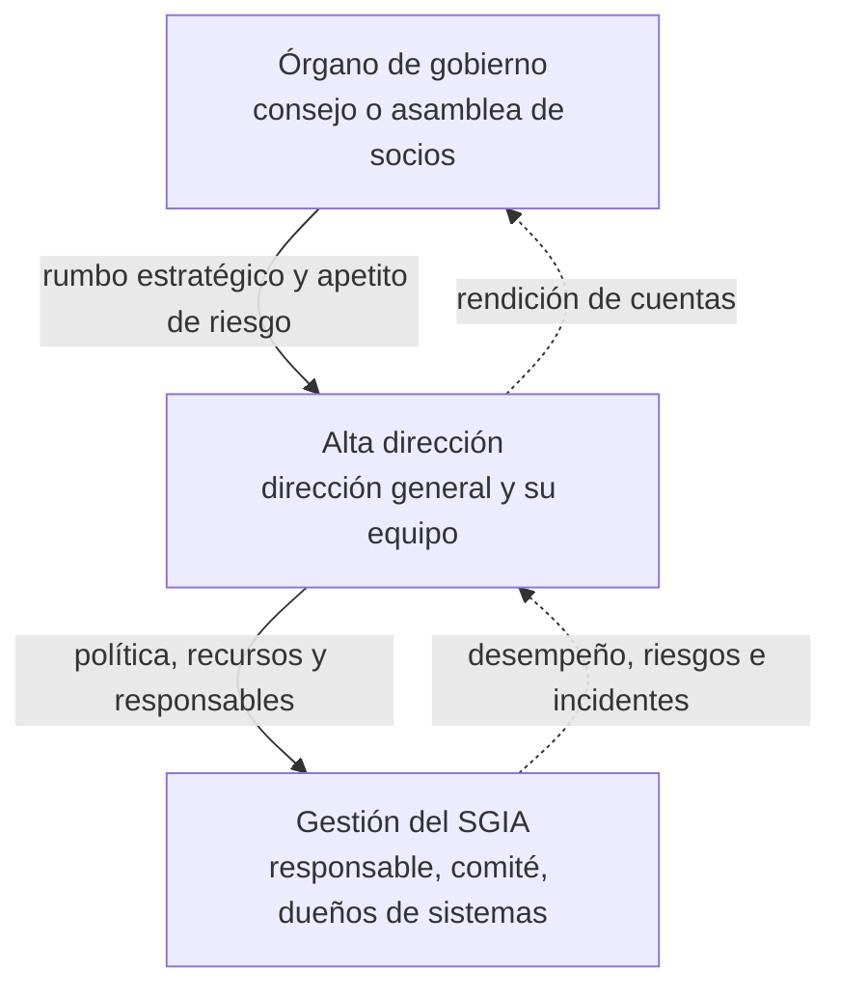

# Cláusula 5 · Liderazgo

<div class="dx-page-meta" markdown>
<span class="dx-badge dx-badge--tipo">:material-file-document-check-outline: Requisito certificable</span>
<span class="dx-badge dx-badge--rol-usa">:material-cloud-download-outline: Usa IA de terceros</span>
<span class="dx-badge dx-badge--rol-desarrolla">:material-code-braces: Desarrolla IA</span>
<span class="dx-badge dx-badge--rol-provee">:material-handshake-outline: Provee IA a clientes</span>
<span class="dx-badge dx-badge--tiempo">:material-clock-outline: 22 min de lectura</span>
</div>

!!! abstract "En una frase"
    La alta dirección tiene que hacerse cargo del SGIA de forma visible: fijar el rumbo con una política de IA, poner recursos, integrar el sistema en el negocio y nombrar a alguien con autoridad real para que funcione y le rinda cuentas.

## Propósito

Las decisiones importantes sobre IA no son técnicas. Decidir si un modelo puede rechazar solicitudes de crédito sin que una persona las revise, si el personal puede usar herramientas gratuitas con datos de clientes o si se lanza una función de IA generativa antes de terminar las pruebas son decisiones de negocio, con consecuencias legales, de reputación y sobre personas. Si nadie con autoridad las toma, las terminan tomando, por omisión, el equipo técnico o el área que contrató la herramienta.

La cláusula 5 existe para evitar eso. Pide tres cosas: que la alta dirección se comprometa con hechos (5.1), que deje por escrito hacia dónde va la organización en materia de IA (5.2) y que asigne quién hace funcionar el sistema y quién le informa cómo va (5.3). Sin esta cláusula, el SGIA se convierte en un expediente que alguien de TI mantiene para la auditoría.

!!! tip "Analogía"
    La alta dirección es al SGIA lo que el dueño a una obra. No pone ladrillos ni calcula estructuras, pero decide qué se construye, con qué presupuesto y qué riesgos acepta. Cuando el dueño no aparece, el arquitecto termina decidiendo cosas que no le corresponden, y cuando algo sale mal nadie tenía la autoridad para haberlo evitado.

## Qué pide, explicado

### 5.1 Liderazgo y compromiso {#c-5-1}

La norma enumera una serie de formas en que la alta dirección (*top management*) demuestra liderazgo y compromiso con el SGIA. Son las mismas que en otras normas de sistemas de gestión, pero en IA tienen un matiz especial porque los riesgos salen de la organización y alcanzan a personas que no tienen relación con ella. Las agrupamos en cuatro bloques, con nuestras palabras:

- **Rumbo:** que existan una política y objetivos de IA, y que sean compatibles con la estrategia de la organización.
- **Medios:** que los requisitos del SGIA se integren en los procesos de negocio y que haya recursos suficientes.
- **Personas:** que se comunique por qué importa gestionar bien la IA y cumplir el sistema; que se dirija y apoye a quienes contribuyen a él; que se respalde a otros mandos para que ejerzan liderazgo en sus propias áreas.
- **Resultados:** que el sistema logre lo que se propone y que se impulse la mejora continua.

La norma añade dos aclaraciones en notas. La primera: cuando habla del "negocio", se refiere en sentido amplio a las actividades centrales de la organización, así que la cláusula aplica igual a organismos públicos, universidades u organizaciones sin fines de lucro. La segunda, muy propia de la IA: la manera en que la dirección decide usar, desarrollar y gobernar sistemas de IA, y la cultura de responsabilidad que fomenta y modela con su ejemplo, es en sí misma una demostración de compromiso.

#### Evidencias reales, no firmas

El error más común es creer que el liderazgo se demuestra con la firma del director general en la política. La firma es necesaria, pero no prueba nada; lo que convence a un auditor (y a tus clientes) son decisiones y conductas:

| Lo que se espera de la dirección | Evidencia real | Evidencia de cartón |
|---|---|---|
| Política y objetivos alineados con la estrategia | Acta donde se discuten los objetivos de IA junto con el plan de negocio | Política firmada que nadie en la dirección sabe explicar |
| Integración en los procesos del negocio | Compras no contrata IA sin evaluación previa; producto no lanza funciones de IA sin evaluación de impacto | El SGIA vive en una carpeta de TI |
| Recursos | Presupuesto para pruebas de sesgo, capacitación o licencias empresariales; horas asignadas al responsable | "Hazlo en tus ratos libres" |
| Comunicación de la importancia | La directora explica en la junta mensual por qué no se pegan datos de clientes en chatbots gratuitos | Un comunicado genérico que TI envía "en nombre de la dirección" |
| Logro de resultados | La dirección revisa indicadores del SGIA y pide acciones cuando no se cumplen | Revisión por la dirección que solo "toma nota" |
| Respaldo a las personas | Respaldo al responsable del SGIA cuando frena un despliegue; reconocimiento a quien reporta una falla de un modelo | Quien levanta la mano es ignorado o señalado |
| Mejora continua | Decisiones de mejora en actas, con responsable y seguimiento | Las mismas observaciones de auditoría año tras año |
| Liderazgo de otros mandos | Directores de área con metas relacionadas con IA responsable en su evaluación de desempeño | Solo TI tiene responsabilidades de IA |

En la auditoría de certificación, el auditor suele entrevistar a la alta dirección: ¿cuáles son los principales riesgos de IA?, ¿qué decisiones ha tomado sobre IA este año?, ¿cómo sabe si el SGIA funciona? Responder con ejemplos concretos es la mejor evidencia de 5.1.

#### Gobierno corporativo y SGIA: órgano de gobierno frente a alta dirección

Conviene distinguir dos niveles que a veces se confunden:

| Nivel | Quién es | Qué le toca en IA |
|---|---|---|
| Órgano de gobierno (*governing body*) | Consejo de administración, asamblea de socios, junta de gobierno | Rinde cuentas en última instancia; fija la dirección estratégica y el apetito de riesgo; supervisa a la dirección. ISO/IEC 38507 orienta a estos órganos sobre las implicaciones de gobernar el uso de la IA |
| Alta dirección (*top management*) | La persona o el grupo que dirige y controla la organización al nivel más alto: dirección general y su equipo | Es a quien ISO/IEC 42001 dirige los requisitos de la cláusula 5: política, recursos, roles, revisión |
| Gestión del SGIA | Responsable del SGIA, comité de IA o de modelos, dueños de sistemas | Operan el sistema, coordinan y reportan |

ISO/IEC 42001 no le pide nada directamente al consejo, aunque la guía del Anexo B sugiere que las políticas que este fija informen la política de IA. Un SGIA maduro conecta ambos niveles: la dirección rinde cuentas al consejo sobre los riesgos de IA más relevantes, igual que con los financieros o de ciberseguridad.



En una PyME los niveles suelen colapsar: en Contadores Alameda la socia directora forma parte de la asamblea de socios y es la alta dirección. No pasa nada, siempre que las decisiones queden registradas. Si tu empresa sigue un código de mejores prácticas corporativas, como el que promueve el Consejo Coordinador Empresarial en México, el SGIA encaja en sus comités de riesgos o de auditoría.

### 5.2 Política de IA {#c-5-2}

La alta dirección tiene que establecer una política de IA. La cláusula 5.2 fija lo mínimo que debe tener y cómo se debe manejar:

| Aspecto | Lo que pide 5.2, en nuestras palabras |
|---|---|
| Pertinencia | Que corresponda al propósito de la organización (no una política copiada de otra empresa) |
| Objetivos | Que sirva de marco para fijar los objetivos de IA de [6.2](c6-planificacion.md#c-6-2) |
| Compromiso de cumplimiento | Que comprometa a cumplir los requisitos aplicables (legales, contractuales y otros que la organización asuma) |
| Compromiso de mejora | Que comprometa a mejorar el SGIA de forma continua |
| Forma | Que esté documentada y haga referencia a otras políticas de la organización cuando sea pertinente |
| Difusión | Que se comunique dentro de la organización y esté disponible para las partes interesadas, según corresponda |

Una nota de 5.2 remite a ISO/IEC 38507 para las consideraciones al desarrollar políticas de IA.

#### Lo que agrega el control A.2.2

La cláusula 5.2 es el piso. El control [A.2.2 Política de IA](../anexo-a/a2-politicas.md#a-2-2) del Anexo A pide dejar por escrito una política que rija cómo la organización desarrolla o usa sistemas de IA, y su guía de implementación en el Anexo B sugiere ir más allá del mínimo. (Los nombres de los controles que usamos son traducciones libres de referencia.)

- **Insumos para redactarla:** lo que la organización quiere lograr y cómo es (su estrategia, sus valores, su cultura y cuánto riesgo está dispuesta a asumir); lo que la rodea (las obligaciones legales y contractuales, el panorama de riesgos en que opera); y lo que sus sistemas pueden provocar (qué tan riesgosos son y cómo pueden afectar a las partes interesadas).
- **Contenidos adicionales:** los principios que orientan todas tus actividades de IA y un mecanismo para tramitar las excepciones y las desviaciones respecto de la política.
- **Temas específicos:** orientación (o referencias a otras políticas) sobre aspectos como los recursos y activos de IA, las evaluaciones de impacto o el desarrollo de sistemas.

Los otros dos controles del mismo tema completan el cuadro: [A.2.3](../anexo-a/a2-politicas.md#a-2-3) pide identificar qué otras políticas (seguridad, privacidad, calidad, compras, ética) se cruzan con la IA, y [A.2.4](../anexo-a/a2-politicas.md#a-2-4) pide revisar la política a intervalos planificados y cuando haga falta.

!!! note "Recuerda cómo funciona el Anexo B"
    Aunque el Anexo B está marcado como normativo, sus recomendaciones son guía: no tienes que justificar en la Declaración de Aplicabilidad si sigues cada una, y puedes adaptarlas. Lo que se audita es el control A.2.2 (casi todas las organizaciones lo seleccionan) y, sin excepción, 5.2.

#### Un esqueleto práctico de política de IA

Una política de IA eficaz cabe en dos a cuatro páginas. Te proponemos esta estructura:

1. **Propósito y alcance:** a qué sistemas, actividades y roles aplica.
2. **Postura de la organización frente a la IA:** para qué la usamos, para qué no y, si aplica, usos prohibidos.
3. **Principios:** por ejemplo, supervisión humana proporcional al riesgo, transparencia, equidad, privacidad, seguridad y rendición de cuentas (ver [Principios de IA responsable](../fundamentos/principios-ia-responsable.md)).
4. **Compromisos:** cumplir los requisitos aplicables y mejorar continuamente el SGIA.
5. **Marco para los objetivos de IA:** qué tipo de objetivos se fijarán y quién los aprueba.
6. **Responsabilidades a alto nivel:** quién es responsable del SGIA y dónde está el detalle (la matriz RACI).
7. **Reglas por tema o referencias:** uso aceptable de IA generativa, adquisición de herramientas, desarrollo, evaluación de impacto, datos.
8. **Excepciones y desviaciones:** quién las autoriza, cómo se registran, cuánto duran.
9. **Relación con otras políticas:** seguridad, privacidad y aviso de privacidad, ética, compras.
10. **Aprobación, comunicación y revisión:** quién la aprueba, cómo se difunde y cada cuánto se revisa.

!!! tip "Política de IA frente a política de uso aceptable"
    La política de IA es la constitución: fija principios, compromisos y responsables. La de uso aceptable de IA generativa es el reglamento de tránsito: qué herramientas usar, con qué datos y qué no hacer. Mezclarlas produce un documento demasiado largo para la dirección y demasiado abstracto para el personal.

**¿Y "disponible para las partes interesadas, según corresponda"?** No tienes que publicarla completa en internet, pero sí poder compartirla con quien tenga un interés legítimo: Conversa Labs publica un resumen para sus clientes, Monarca la incluye en el cuarto de datos para inversionistas y Contadores Alameda la adjunta al cuestionario del banco.

### 5.3 Roles, responsabilidades y autoridades {#c-5-3}

La alta dirección tiene que asegurarse de que las responsabilidades y autoridades de los roles relevantes estén asignadas y se comuniquen dentro de la organización. Además, la norma exige dos asignaciones concretas: alguien con responsabilidad y autoridad para **asegurar que el SGIA cumpla con los requisitos de la norma**, y alguien para **informar a la alta dirección sobre el desempeño del sistema**. Pueden ser la misma persona.

Fíjate en la palabra *autoridad*. Un responsable del SGIA sin autoridad para detener un despliegue, exigir una evaluación de impacto o escalar un riesgo directamente a la dirección es un adorno. Cuando lo nombres, deja por escrito qué puede decidir, qué puede detener y a quién reporta.

#### Roles del SGIA (5.3) frente a roles de IA (A.3.2)

La cláusula 5.3 y el control [A.3.2](../anexo-a/a3-organizacion-interna.md#a-3-2) del Anexo A, sobre roles y responsabilidades de IA, se parecen, pero responden a preguntas distintas:

| | Cláusula 5.3 | Control A.3.2 |
|---|---|---|
| Pregunta que responde | ¿Quién hace funcionar el sistema de gestión? | ¿Quién responde por cada aspecto de los sistemas de IA, desde que se conciben hasta que se retiran? |
| Ejemplos de roles | Responsable del SGIA, quien reporta el desempeño, dueños de los procesos del SGIA, auditoría interna | Dueño de cada sistema; responsables de supervisión humana, calidad de datos, evaluaciones de impacto, privacidad, seguridad, relación con proveedores, desarrollo y desempeño del sistema, cumplimiento legal y gestión de riesgos |
| Naturaleza | Requisito de cláusula: aplica siempre | Control del Anexo A: se selecciona por riesgo (en la práctica, casi nadie lo excluye) |
| Evidencia típica | Nombramiento, descripción de puesto, organigrama del SGIA | Matriz RACI por sistema y por actividad |

La guía del Anexo B para A.3.2 sugiere asignar roles tomando en cuenta la política, los objetivos y los riesgos identificados, y definir las responsabilidades con el detalle suficiente para que cada persona sepa qué le toca. Una matriz RACI por sistema de IA resuelve ambos requisitos a la vez.

#### Comités de IA o de modelos

Muchas organizaciones crean un comité para gobernar la IA. La norma no lo exige, pero suele ser una buena forma de cumplir 5.1 y 5.3 cuando hay varias áreas involucradas. Para que funcione:

- **Que tenga un estatuto** (*charter*) aprobado por la dirección: propósito, integrantes, facultades, quórum, frecuencia y a quién reporta.
- **Que decida, no que solo opine:** aprobar casos de uso, autorizar despliegues y cambios significativos, aceptar riesgos residuales dentro de límites delegados y escalar los demás. La norma pide que la dirección designada apruebe el plan de tratamiento y acepte los riesgos residuales ([6.1.3](c6-planificacion.md#c-6-1-3)); el comité puede ser ese mecanismo si tiene la delegación formal.
- **Que sea multidisciplinario y pequeño:** negocio, riesgos, cumplimiento, privacidad, tecnología y datos. Cinco a siete personas con voto suelen bastar.
- **Que cuide la independencia:** quien desarrolla un modelo puede presentarlo, pero conviene que no tenga voto para aprobarlo.
- **Que deje actas con decisiones**, responsables y fechas, no solo una lista de asistentes.
- **Que se apoye en lo que ya existe.** En entidades financieras, la práctica de gestión de riesgo de modelos y los comités de riesgos son un punto de partida natural; no hace falta crear una estructura paralela.

#### El riesgo de "delegar el SGIA en TI"

Es la tentación más común: "la IA es tecnología, que la lleve TI". Casi siempre sale mal, por varias razones:

- **Los riesgos de la IA son de negocio, legales y sobre personas**, no solo técnicos. Decidir si un modelo de crédito discrimina por entidad federativa requiere a riesgos, cumplimiento y negocio.
- **TI no tiene autoridad sobre los procesos de negocio.** Si recursos humanos contrata un filtro de currículums con IA, TI no puede impedirlo ni evaluar su impacto en candidatos.
- **Buena parte de la IA entra por las áreas usuarias**, contratada como servicio o activada en software existente, fuera de la vista de TI.
- **Conflicto de intereses:** si TI implementa las herramientas y además evalúa sus riesgos, se audita a sí misma.
- **La dirección se desconecta:** si el SGIA "es de TI", deja de sentirlo suyo, y la cláusula 5 se cae.

TI sí puede tener el rol de responsable del SGIA, siempre que cuente con un mandato transversal por escrito, línea directa con la alta dirección, dueños de negocio para cada sistema y apoyo de cumplimiento y privacidad. Así lo hace Contadores Alameda: el gerente de TI es responsable del SGIA, pero la socia directora preside la revisión trimestral y la coordinadora de cumplimiento comparte las evaluaciones de impacto.

#### En PyMEs, ¿quién puede ser responsable?

En una organización pequeña nadie tiene tiempo completo para el SGIA, y no hace falta. Estas son las opciones más comunes:

| Perfil | Ventajas | Cuidados |
|---|---|---|
| Socio o socia directora | Autoridad indiscutible; decisiones rápidas | Poco tiempo; conviene apoyarse en alguien que opere el día a día |
| Gerente de TI | Conoce las herramientas y a los proveedores | Riesgo de sesgo técnico; necesita mandato transversal y respaldo de negocio |
| Responsable de cumplimiento o de datos personales | Experiencia en requisitos legales, avisos de privacidad, derechos ARCO | Puede necesitar apoyo técnico para entender los sistemas |
| Coordinador de un sistema de gestión existente (ISO 27001 o ISO 9001) | Ya domina auditorías, documentación y acciones correctivas | Necesita formarse en temas propios de la IA |
| Consultor externo | Experiencia y método | En nuestra lectura, puede apoyar la operación, pero la responsabilidad y la autoridad que pide 5.3 tienen que recaer en alguien de la organización |

Criterios para elegir: autoridad real, tiempo asignado (aunque sea un porcentaje de la jornada), conocimiento del negocio, cierta independencia respecto del sistema más riesgoso y acceso directo a la dirección.

## Cómo se aplica según tu rol

=== "Si usas IA de terceros"

    - **La política se centra en el uso y la adquisición:** herramientas aprobadas, datos que no pueden salir, cómo pedir una herramienta nueva y quién autoriza excepciones.
    - **El liderazgo se ve en decisiones concretas:** pagar licencias empresariales en lugar de tolerar herramientas gratuitas, prohibir con claridad ciertos usos, respaldar la capacitación.
    - **Roles:** un responsable del SGIA y un dueño de negocio por herramienta. En vez de un comité formal, puede bastar un punto fijo en la junta mensual de dirección, con acta.

=== "Si desarrollas IA"

    - **La política incluye principios de desarrollo:** equidad, explicabilidad, supervisión humana, calidad de datos, criterios para pasar un modelo a producción.
    - **La dirección define el apetito de riesgo** para decisiones automatizadas: qué puede decidir un modelo solo y qué requiere revisión humana.
    - **Roles:** dueño de negocio de cada modelo, equipo de desarrollo, validación independiente y un comité de modelos con facultades reales; quien construye el modelo no lo aprueba.

=== "Si provees IA a clientes"

    - **La política tiene una versión pública** o compartible con clientes, coherente con lo que prometen los contratos (por ejemplo, no entrenar con datos de clientes).
    - **La dirección arbitra entre la presión comercial y la IA responsable:** decide si una función se lanza o espera a terminar sus pruebas, y lo deja registrado.
    - **Roles:** una dueña del SGIA con autoridad frente a producto y ventas (en Conversa Labs, la Responsable de Confianza y Seguridad) y un canal claro con Customer Success y Legal para incidentes con clientes.

!!! info "Diferencias con ISO 27001"
    - **5.1** tiene prácticamente la misma estructura que en ISO 27001; la diferencia está en la sustancia: en IA el compromiso de la dirección incluye decisiones éticas y sobre impactos en personas, no solo sobre confidencialidad, integridad y disponibilidad. La nota sobre la cultura de responsabilidad es propia de ISO/IEC 42001.
    - **5.2** se parece a la política de seguridad de ISO 27001 (marco para objetivos, compromisos de cumplimiento y de mejora), y añade de forma explícita la referencia a otras políticas de la organización. El contenido se enriquece con los controles A.2.2 a A.2.4.
    - **5.3** pide las mismas dos asignaciones que ISO 27001. Lo nuevo está en el control A.3.2, que exige roles para aspectos propios de la IA (supervisión humana, evaluaciones de impacto, calidad de datos), y en A.3.3, que pide un canal para reportar inquietudes sobre la IA.
    - Si ya tienes un SGSI, puedes usar el mismo comité, siempre que participen negocio, cumplimiento y privacidad, no solo seguridad.

## Preguntas para tu organización

- [ ] ¿La alta dirección puede explicar, sin leer, cuáles son los principales riesgos de IA de la organización?
- [ ] ¿Hay actas con decisiones de la dirección sobre IA (aprobar, condicionar o rechazar un caso de uso; asignar presupuesto)?
- [ ] ¿Los requisitos del SGIA están integrados en compras, desarrollo de productos, recursos humanos y atención a clientes?
- [ ] ¿El SGIA tiene presupuesto y horas asignadas, y no solo buena voluntad?
- [ ] ¿La política de IA cumple los mínimos de 5.2 y fue escrita para nuestra organización, no copiada?
- [ ] ¿La política se comunicó al personal y podemos compartirla con clientes, inversionistas o reguladores?
- [ ] ¿Hay un responsable del SGIA nombrado por escrito, con autoridad para detener despliegues y escalar riesgos?
- [ ] ¿Está claro quién informa a la alta dirección sobre el desempeño del SGIA y con qué frecuencia?
- [ ] ¿Cada sistema de IA tiene un dueño de negocio, además del responsable técnico?
- [ ] Si tenemos comité de IA o de modelos, ¿tiene estatuto, facultades, actas con decisiones e independencia frente a quien desarrolla?
- [ ] ¿El órgano de gobierno (consejo o asamblea) recibe información sobre los riesgos de IA más relevantes?

## Qué evidencia espera ver un auditor

| Evidencia | Ejemplo | Señal de alerta |
|---|---|---|
| Política de IA aprobada | Documento de dos a cuatro páginas con los elementos de 5.2, fecha de aprobación y versión | Política genérica descargada de internet, o firmada por alguien que no es alta dirección |
| Comunicación de la política | Registro de capacitación, mensaje de la dirección, acuse de lectura | Nadie en las entrevistas sabe que existe |
| Decisiones de la dirección sobre IA | Actas de la revisión por la dirección o del comité con decisiones, responsables y fechas | Actas que solo dicen "se presentó el avance del SGIA" |
| Recursos asignados | Presupuesto aprobado, plan de capacitación, tiempo asignado al responsable | El responsable del SGIA lo hace "cuando puede" |
| Nombramiento del responsable del SGIA | Carta o descripción de puesto con responsabilidades y autoridades | Nombramiento sin facultades, o persona sin acceso a la dirección |
| Matriz de roles de IA | RACI por sistema y por actividad del ciclo de vida | Roles definidos en abstracto, sin nombres, o que no coinciden con lo que pasa |
| Estatuto y actas del comité (si existe) | Estatuto aprobado; actas con aprobaciones, condiciones y rechazos | Comité que nunca rechaza ni condiciona nada |

!!! warning "Errores comunes"
    - Creer que la firma del director general en la política es la evidencia del liderazgo.
    - Delegar el SGIA completo en TI sin dueños de negocio ni respaldo de la dirección.
    - Nombrar un responsable sin autoridad, sin tiempo o sin acceso a la alta dirección.
    - Copiar una política de IA de otra organización, con principios que nadie aplica.
    - Mezclar en un solo documento la política de IA y las reglas de uso aceptable.
    - Crear un comité de quince personas que se reúne poco y nunca decide.
    - Permitir que quien desarrolla un modelo sea quien lo aprueba.
    - No informar nunca al consejo o a la asamblea sobre los riesgos de IA más relevantes.

## Ejemplo resuelto

!!! example "Caso: Monarca Crédito y su Comité de Modelos"
    **Punto de partida.** Monarca Crédito, SOFOM E.N.R. de la Ciudad de México (210 empleados, unos 350 000 clientes), otorga microcréditos en su app con Score Monarca v3, un modelo de *gradient boosting* que manda cada solicitud a aprobación automática, rechazo automático o banda gris de revisión humana. Hasta hace poco, los modelos se aprobaban por correo: el líder de ciencia de datos enviaba resultados y el director de riesgos respondía "adelante". La debida diligencia de un fondo de inversión y las pláticas con bancos aliados dejaron claro que eso no bastaba.

    **Paso 1. Rumbo desde arriba.** El director general presenta al consejo de administración la decisión de implementar un SGIA y certificarlo. El consejo fija el apetito de riesgo para decisiones automatizadas: no se aceptan diferencias injustificadas en las tasas de aprobación por sexo, edad o entidad federativa, ni variables que actúen como sustitutas de esas características, y toda persona rechazada recibirá motivos comprensibles y una vía de reconsideración. El acuerdo queda en el acta del consejo y alimenta la política de IA.

    **Paso 2. Política de IA.** La dirección general aprueba una política de tres páginas con los mínimos de 5.2 y, siguiendo la guía de A.2.2, principios (equidad, explicabilidad, supervisión humana proporcional al riesgo, privacidad), un proceso de excepciones y referencias a las políticas de privacidad y seguridad y al código de ética. Se comunica a todo el personal y se incluye en el cuarto de datos para inversionistas.

    **Paso 3. Roles (5.3 y A.3.2).** El director general nombra a la oficial de cumplimiento responsable del SGIA, con autoridad para suspender un despliegue mientras el comité resuelve y reporte trimestral a la dirección general. Una matriz RACI por sistema define que el director de riesgos es dueño de negocio de Score Monarca v3; el líder de ciencia de datos, responsable del desarrollo; el oficial de privacidad, de las evaluaciones en materia de datos personales; y un analista de riesgo de modelos ajeno al desarrollo, de la validación independiente.

    **Paso 4. El Comité de Modelos.** Su estatuto, aprobado por la dirección general, establece:

    | Elemento | Definición |
    |---|---|
    | Preside | Director general |
    | Integrantes con voto | Director de riesgos, oficial de cumplimiento, oficial de privacidad, directora de producto |
    | Con voz, sin voto | Líder de ciencia de datos (presenta los modelos) y auditoría interna (observa) |
    | Facultades | Aprobar modelos nuevos y cambios significativos; fijar umbrales de la banda gris; aceptar riesgos residuales dentro de los límites del consejo; escalar al consejo lo que los supere |
    | Frecuencia | Mensual, con sesiones extraordinarias ante incidentes o deriva relevante |
    | Insumos fijos | Informe de validación, métricas de desempeño y de equidad por sexo, edad y entidad federativa, quejas y reconsideraciones, reporte de deriva |

    El flujo de aprobación de un modelo queda así:

    ```mermaid
    sequenceDiagram
      participant CD as Ciencia de Datos
      participant VI as Validación independiente
      participant CM as Comité de Modelos
      participant DG as Dirección General
      participant CA as Consejo de Administración
      CD->>VI: Expediente del modelo con pruebas de desempeño, sesgo y explicabilidad
      VI->>CM: Informe de validación con hallazgos
      CM->>CM: Revisa riesgos, impacto y apetito de riesgo
      alt Riesgo residual dentro del límite delegado
        CM->>DG: Recomienda aprobar con condiciones
        DG-->>CM: Aprueba y acepta el riesgo residual
      else Riesgo residual por encima del límite
        CM->>CA: Escala con recomendación
        CA-->>DG: Resuelve y fija condiciones
      end
      CM->>CD: Condiciones y monitoreo exigidos
    ```

    **Paso 5. La primera decisión difícil.** En su segunda sesión, el comité revisa una actualización de Score Monarca v3. La validación independiente detecta que la tasa de aprobación automática es notablemente menor en dos entidades federativas, y que el código postal pesa demasiado en el modelo. El líder de ciencia de datos argumenta que la variable mejora la predicción. El comité **condiciona** la aprobación: reducir la granularidad del código postal, ampliar la banda gris para solicitantes con poco historial crediticio, redactar motivos de rechazo en lenguaje claro y presentar en tres meses un análisis de equidad actualizado. El director general acepta el riesgo residual dentro del límite del consejo y lo firma en el acta.

    **Paso 6. Informe al consejo.** Cada trimestre, la responsable del SGIA prepara un informe de una página para el consejo: estado de los modelos, indicadores de equidad, reconsideraciones atendidas, incidentes y decisiones del comité.

    **Lo que vio el auditor.** En la auditoría de certificación, el auditor entrevistó al director general, que explicó sin notas por qué se condicionó la actualización del modelo. Revisó el acta, verificó que las condiciones se cumplieron en el plazo y comprobó que el líder de ciencia de datos no tenía voto. Su conclusión: la evidencia de liderazgo no estaba en la firma de la política, sino en una decisión incómoda tomada, documentada y cumplida.

## Relación con otras cláusulas, controles y normas

- **Cláusulas:** la política responde al contexto ([4.1](c4-contexto.md#c-4-1)) y se aplica dentro del alcance ([4.3](c4-contexto.md#c-4-3)); es el marco de los objetivos de IA ([6.2](c6-planificacion.md#c-6-2)); la dirección designada aprueba el tratamiento de riesgos ([6.1.3](c6-planificacion.md#c-6-1-3)); los recursos se concretan en [7.1](c7-apoyo.md#c-7-1) y la toma de conciencia sobre la política en [7.3](c7-apoyo.md#c-7-3); la revisión por la dirección ([9.3](c9-evaluacion-del-desempeno.md#c-9-3)) es donde el liderazgo se ejerce formalmente, y la mejora continua se cierra en [10.1](c10-mejora.md#c-10-1).
- **Controles del Anexo A:** política de IA ([A.2.2](../anexo-a/a2-politicas.md#a-2-2)), alineación con otras políticas ([A.2.3](../anexo-a/a2-politicas.md#a-2-3)), revisión de la política ([A.2.4](../anexo-a/a2-politicas.md#a-2-4)), roles y responsabilidades de IA ([A.3.2](../anexo-a/a3-organizacion-interna.md#a-3-2)), reporte de inquietudes ([A.3.3](../anexo-a/a3-organizacion-interna.md#a-3-3)), recursos humanos ([A.4.6](../anexo-a/a4-recursos.md#a-4-6)) y objetivos para el desarrollo y el uso responsable ([A.6.1.2](../anexo-a/a6-ciclo-de-vida.md#a-6-1-2), [A.9.3](../anexo-a/a9-uso.md#a-9-3)).
- **Normas:** ISO/IEC 38507 (gobernanza del uso de la IA en las organizaciones) e ISO/IEC 38500 (gobernanza de las tecnologías de la información); consulta [La familia de normas de IA](../fundamentos/familia-de-normas.md). Si ya tienes un SGSI, revisa [Integración con ISO 27001](../integracion/con-iso27001.md).
- **Casos prácticos:** el caso completo de Monarca está en [Fintech con scoring crediticio](../casos-practicos/fintech-scoring.md).

## Plantillas relacionadas

- [Política de IA](../plantillas/index.md#politica-de-ia)
- [Política de uso aceptable de IA generativa](../plantillas/index.md#uso-aceptable-ia-generativa)
- [Roles y responsabilidades (RACI)](../plantillas/index.md#raci-ia)
- [Inventario de sistemas de IA (Excel)](../plantillas/index.md#inventario-sistemas-ia)
