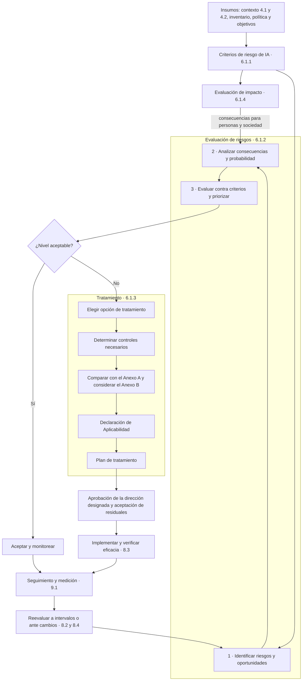

# Cláusula 6 · Planificación

:material-file-document-check-outline: Requisito certificable
:material-cloud-download-outline: Usa IA de terceros
:material-code-braces: Desarrolla IA
:material-handshake-outline: Provee IA a clientes
:material-clock-outline: 30 min de lectura

!!! abstract "En una frase"
    En la cláusula 6 fijas las reglas para medir el riesgo y decides qué puede salir mal (o bien) con tu IA, a quién afectaría, qué tan grave sería, qué harás al respecto y cómo sabrás si lo lograste. De aquí salen la matriz de riesgos, la evaluación de impacto, la Declaración de Aplicabilidad y los objetivos de IA.

## Propósito

Las cláusulas 4 y 5 responden dónde estás parado y quién manda. La cláusula 6 convierte esas respuestas en **decisiones**: qué riesgos atiendes primero, con qué controles, cuáles aceptas de forma consciente y qué metas te pones. La operación ([cláusula 8](c8-operacion.md)), la medición ([cláusula 9](c9-evaluacion-del-desempeno.md)) y la mejora ([cláusula 10](c10-mejora.md)) dependen de lo que aquí se decida.

Sin planificación basada en riesgos, los controles de IA se adoptan por moda, por miedo ("prohibamos la IA generativa") o copiando una lista de verificación. La cláusula 6 obliga a que cada control tenga una razón rastreable: un riesgo, un impacto, un requisito legal o un objetivo. Y agrega algo que otras normas de sistemas de gestión no piden: mirar **lo que le puede pasar a las personas y a la sociedad**, no solo a la organización.

Al terminar tendrás criterios de riesgo aprobados, evaluaciones de riesgos e impacto, un plan de tratamiento con residuales aceptados, la Declaración de Aplicabilidad y objetivos de IA con su plan.

!!! tip "Analogía"
    Una constructora que va a levantar un puente hace dos estudios: uno de **riesgos del proyecto** (sobrecostos, retrasos, fallas estructurales) y una **manifestación de impacto** que mira hacia afuera (vecinos, río, tráfico, comercio). Luego elige medidas: unas del reglamento de construcción (tu Anexo A), otras diseñadas para ese terreno, y deja por escrito qué normas técnicas aplican y por qué alguna no (tu Declaración de Aplicabilidad). Al final, el director de obra firma que acepta los riesgos que quedan. La cláusula 6 pide lo mismo para sistemas de IA.

## Qué pide, explicado

### 6.1 Acciones frente a riesgos y oportunidades {#c-6-1}

La subcláusula 6.1 tiene cuatro piezas que funcionan como engranes:

| Subcláusula | Pregunta que responde | Producto principal | Se repite en |
|---|---|---|---|
| [6.1.1](#c-6-1-1) | ¿Con qué reglas medimos el riesgo? ¿Qué riesgos tiene el propio SGIA? | Criterios de riesgo de IA; riesgos y oportunidades del SGIA | [9.3](c9-evaluacion-del-desempeno.md#c-9-3) |
| [6.1.2](#c-6-1-2) | ¿Qué puede pasar con cada sistema y qué tan grave es? | Metodología y resultados de la evaluación de riesgos | [8.2](c8-operacion.md#c-8-2) |
| [6.1.3](#c-6-1-3) | ¿Qué vamos a hacer al respecto? | Plan de tratamiento, Declaración de Aplicabilidad, aceptación de residuales | [8.3](c8-operacion.md#c-8-3) |
| [6.1.4](#c-6-1-4) | ¿A quién afecta fuera de la organización? | Proceso y registros de evaluación de impacto | [8.4](c8-operacion.md#c-8-4) |

Regla práctica: **la cláusula 6 diseña el proceso y lo ejecuta por primera vez; la cláusula 8 lo repite** a intervalos planificados o ante cambios significativos.

### 6.1.1 Generalidades y criterios de riesgo {#c-6-1-1}

#### Dos niveles de riesgo

La primera parte de 6.1.1 es la de cualquier norma con estructura armonizada: con base en el contexto ([4.1](c4-contexto.md#c-4-1)) y las partes interesadas ([4.2](c4-contexto.md#c-4-2)), identificas riesgos y oportunidades del **propio sistema de gestión**, planificas acciones, decides cómo integrarlas y medir su eficacia, y guardas evidencia. Lo particular de ISO/IEC 42001 es que también pide considerar el **dominio y contexto de aplicación** de cada sistema de IA y su **uso previsto**. Conviven así dos niveles:

| | Riesgos y oportunidades del SGIA | Riesgos de los sistemas de IA |
|---|---|---|
| **Objeto** | El sistema de gestión | Cada sistema de IA o grupo de sistemas |
| **Riesgos típicos** | Rotación del responsable; falta de presupuesto; áreas que usan IA sin avisar (IA en la sombra) | Sesgo contra un grupo; respuestas inventadas (*hallucinations*); fuga de datos en instrucciones (*prompts*); deriva (*drift*) del modelo |
| **Oportunidades típicas** | Reutilizar el comité y la estructura documental del SGSI; usar la certificación para cerrar alianzas | Aprobar créditos a personas sin historial con datos alternativos; reducir tiempos de atención |
| **Dónde se registra** | Registro del SGIA o plan anual del sistema de gestión | Registro por sistema, conectado con la evaluación de impacto y la SoA |

Puedes llevar ambos en la misma herramienta, pero que los riesgos del SGIA no queden huérfanos: es común que solo exista el registro por sistema.

#### Criterios de riesgo de IA: las reglas del juego

La pieza más subestimada de 6.1.1 son los **criterios de riesgo de IA** (*AI risk criteria*), que deben servir para separar lo aceptable de lo inaceptable, evaluar riesgos, decidir su tratamiento y valorar impactos. Si son vagos, todo lo demás será subjetivo. Unos criterios completos tienen:

1. **Escalas de consecuencia** con tres dimensiones: organización, individuos y sociedad.
2. **Escala de probabilidad**, para usarla cuando aplique.
3. **Matriz** que combine ambas en un nivel de riesgo.
4. **Umbrales de aceptación** y plazos de tratamiento.
5. **Autoridad de aceptación**: quién acepta cada nivel residual.
6. **Líneas rojas**: lo que nunca se acepta, sin importar la calificación.

##### Escalas de consecuencia en tres dimensiones

Ejemplo de escala de cinco niveles; ajusta los descriptores a tu tamaño y sector, pero que sean **observables** en las tres dimensiones:

| Nivel | Organización | Individuos | Sociedad |
|---|---|---|---|
| **1 · Insignificante** | Sin pérdida relevante ni atención externa | Molestia que se corrige en el momento | Sin efecto perceptible |
| **2 · Menor** | Pérdida absorbible por el área; queja aislada | Error que la persona corrige sola en días, sin costo | Efecto local y aislado |
| **3 · Moderada** | Reasignar presupuesto; requerimiento de una autoridad; quejas repetidas | Afectación a derechos u oportunidades reversible con esfuerzo (un rechazo de crédito injusto corregido en reconsideración) | Afecta a un segmento identificable de forma reversible |
| **4 · Mayor** | Sanción; pérdida de un cliente clave o de una alianza; prensa nacional negativa | Daño significativo y difícil de revertir: discriminación sistemática, exposición de datos sensibles, pérdida de ingresos | Refuerza desigualdades o daña la confianza en un sector (exclusión financiera de una región) |
| **5 · Severa** | Amenaza la continuidad del negocio o la licencia para operar | Daño grave o irreversible a la vida, la salud, la libertad o el patrimonio, sobre todo de grupos vulnerables | Efecto sistémico o duradero: desinformación masiva, servicios esenciales o procesos democráticos afectados |

Dos recomendaciones: **toma el peor de los tres valores, no el promedio** (promediar esconde el daño a personas) y **escribe ejemplos ancla de tu negocio** en cada celda: un "3" en una fintech no se parece a un "3" en un despacho contable.

##### Probabilidad "cuando aplique"

La norma pide estimar una probabilidad realista **cuando corresponda**, porque en IA hay riesgos cuya probabilidad no se puede estimar con honestidad (un ataque nuevo, un modelo fundacional que cambia de versión sin aviso). Tienes tres caminos: frecuencia medida cuando hay datos (en sistemas de alto volumen, exprésala **por número de decisiones o interacciones**, no solo por año); plausibilidad cualitativa cuando no los hay; y, para impactos graves, un criterio basado solo en la consecuencia (por ejemplo, "toda consecuencia 5 se trata como mínimo como Alto", que es lo que hace la fila superior de la matriz).

| Nivel | Descriptor | Guía de frecuencia (ejemplo) |
|---|---|---|
| 1 · Rara | No se espera en la vida del sistema | Menos de una vez en cinco años o de 1 en 1 000 000 de decisiones |
| 2 · Improbable | Ha ocurrido en otras organizaciones, no en la nuestra | Una vez cada dos a cinco años |
| 3 · Posible | Antecedentes internos aislados | Una vez al año |
| 4 · Probable | Se observa varias veces al año o en las pruebas | Trimestral o más de 1 en 10 000 decisiones |
| 5 · Casi segura | Ya está ocurriendo de forma recurrente | Mensual o más de 1 en 1 000 decisiones |

##### Matriz 5 × 5 y criterio de aceptación

| Consecuencia ↓ · Probabilidad → | 1 · Rara | 2 · Improbable | 3 · Posible | 4 · Probable | 5 · Casi segura |
|---|---|---|---|---|---|
| **5 · Severa** | 🟧 Alto | 🟧 Alto | 🟥 Crítico | 🟥 Crítico | 🟥 Crítico |
| **4 · Mayor** | 🟨 Medio | 🟧 Alto | 🟧 Alto | 🟥 Crítico | 🟥 Crítico |
| **3 · Moderada** | 🟩 Bajo | 🟨 Medio | 🟧 Alto | 🟧 Alto | 🟥 Crítico |
| **2 · Menor** | 🟩 Bajo | 🟩 Bajo | 🟨 Medio | 🟨 Medio | 🟧 Alto |
| **1 · Insignificante** | 🟩 Bajo | 🟩 Bajo | 🟩 Bajo | 🟨 Medio | 🟨 Medio |

La matriz es **asimétrica**: pesa más la consecuencia, coherente con un apetito bajo para daños a personas. Otras son válidas si puedes explicarlas.

| Nivel | Decisión | Plazo | Quién acepta el residual | Revisión |
|---|---|---|---|---|
| 🟩 **Bajo** | Aceptable con controles existentes | Sin plan | Dueño del sistema de IA | Anual |
| 🟨 **Medio** | Aceptable con monitoreo; tratar si el costo es razonable | 6 meses, si se trata | Responsable del SGIA | Semestral |
| 🟧 **Alto** | No aceptable sin tratamiento | Plan en 30 días; ejecución en 90 | Comité de IA o dirección designada, informando a la alta dirección | Trimestral |
| 🟥 **Crítico** | Inaceptable: no se lanza o se suspende la función | Inmediato | Sin aceptación permanente; excepción temporal solo con firma de la dirección general y medidas compensatorias | Mensual |

Completa con **líneas rojas** que no pasan por la matriz: incumplir deliberadamente una ley aplicable, desplegar un uso de IA prohibido en alguna jurisdicción donde operas o usar datos personales para una finalidad no informada en el aviso de privacidad.

##### Apetito de riesgo

Los umbrales de aceptación traducen el **apetito de riesgo** (*risk appetite*): cuánto riesgo, y de qué tipo, está dispuesta a asumir la organización para obtener lo que busca con la IA. Una nota de la norma remite a ISO/IEC 38507 (gobernanza de la IA) e ISO/IEC 23894 (gestión de riesgos de IA) para pensarlo; ambas se describen en [La familia de normas de IA](../fundamentos/familia-de-normas.md). Conviene que la alta dirección ([5.1](c5-liderazgo.md#c-5-1)) apruebe una declaración breve y diferenciada: apetito muy bajo para daños a individuos e incumplimientos legales, bajo para riesgos reputacionales frente a clientes y moderado para riesgos de productividad en herramientas internas. Si los criterios contradicen la política de IA ([5.2](c5-liderazgo.md#c-5-2)), el auditor lo notará.

##### Por sistema o por grupos de sistemas

Una nota de 6.1.1 permite determinar riesgos y oportunidades por sistema o por **grupos de sistemas**. Agrupa cuando comparten propósito, tipo de datos, rol de la organización y personas afectadas; separa cuando alguno de esos factores cambia. Contadores Alameda puede evaluar juntos su asistente de ofimática y su módulo de captura de CFDI, pero no a "Alma", su chatbot de WhatsApp para clientes. Monarca Crédito evalúa Score Monarca v3 de forma individual. Conversa Labs evalúa la plataforma completa y además usa perfiles por sector de cliente.

Otra nota admite usar la definición de riesgo de tu sector (por ejemplo, la Guía ISO/IEC 51 para seguridad física).

!!! latam "En México y Latinoamérica"
    Si ya tienes una metodología institucional (riesgo operativo en una entidad financiera, prevención de lavado de dinero, SGSI), te recomendamos **alinear las escalas** para que el consejo compare un "Alto" de IA con un "Alto" operativo, y añadir las dimensiones de individuos y sociedad, que casi nunca están en las matrices heredadas.

### 6.1.2 Evaluación de los riesgos de IA {#c-6-1-2}

La norma pide contar con un proceso documentado para evaluar los riesgos de IA, alineado con la política y los objetivos de IA. Tiene las tres etapas clásicas, con matices propios de la IA.

#### El proceso paso a paso

**Paso 0. Insumos.** Inventario de sistemas, contexto y rol frente a cada sistema (4.1), requisitos de partes interesadas (4.2), política y objetivos de IA, criterios de 6.1.1 y, cuando exista, la evaluación de impacto ([6.1.4](#c-6-1-4)).

**Paso 1. Identificar.** Recorre el ciclo de vida completo, de diseño a retiro, con un catálogo de fuentes de riesgo, y redacta cada riesgo con estructura fija: *debido a* [causa], *podría ocurrir* [evento], *lo que provocaría* [consecuencia] *para* [quién]. Por ejemplo: "Debido a que las preguntas frecuentes de Alma no siguen el calendario fiscal, podría dar una fecha límite equivocada, lo que provocaría recargos al cliente".

La norma pide identificar riesgos que **ayudan o impiden** lograr los objetivos de IA. Es decir, también se identifican oportunidades: eventos inciertos que favorecen un objetivo. Para Monarca Crédito, evaluar con datos de uso de la app a personas sin historial en buró de crédito es una oportunidad ligada a su objetivo de inclusión financiera: se gestiona para aprovecharla.

**Paso 2. Analizar.** Estima la **consecuencia en las tres dimensiones**; una nota de la norma permite apoyarse en la evaluación de impacto para ello, y en nuestra opinión es la mejor fuente para las columnas de individuos y sociedad. Estima la **probabilidad realista**, cuando aplique, considerando los controles existentes, y obtén el **nivel** con la matriz. La norma no exige calcular un nivel inherente (sin controles), pero ayuda a mostrar el valor de los controles.

**Paso 3. Evaluar y priorizar.** Compara cada nivel con los criterios y ordena los riesgos que necesitan tratamiento. Esa lista entra a [6.1.3](#c-6-1-3).

**Paso 4. Documentar y repetir.** La cláusula 6.1.2 pide documentar el **proceso**; [8.2](c8-operacion.md#c-8-2) pide conservar los **resultados** de cada evaluación, que se repite a intervalos planificados y ante cambios significativos.

#### Resultados consistentes, válidos y comparables

Evaluaciones repetidas deben dar resultados **consistentes, válidos y comparables**. Es el requisito que más hallazgos genera, porque la calificación suele depender de quién llena la matriz.

| Atributo | En la práctica | Cómo lograrlo |
|---|---|---|
| **Consistente** | Dos evaluadores con la misma información llegan al mismo nivel | Guía de calificación con ejemplos ancla; calibración; plantilla única |
| **Válido** | La calificación refleja la realidad, no la intuición | Evidencia por calificación: métricas, pruebas, incidentes, quejas, evaluación de impacto |
| **Comparable** | Se comparan riesgos entre sistemas y en el tiempo | Mismas escalas para todos; criterios versionados |

Tres herramientas que funcionan:

1. **Catálogo de fuentes de riesgo** basado en el Anexo C (informativo), convertido en preguntas guía y ampliado:

    | Fuente de riesgo | Pregunta guía | Ejemplo |
    |---|---|---|
    | Complejidad del entorno | ¿Qué tan variadas e impredecibles son las situaciones que enfrenta? | Asistente universitario que atiende a alumnos, padres y proveedores |
    | Falta de transparencia y explicabilidad | ¿Podemos explicar un resultado a quien lo necesita? | Rechazo de crédito sin motivos comprensibles |
    | Nivel de automatización | ¿Qué decide el sistema sin intervención humana? | Rechazo automático de solicitudes |
    | Aprendizaje automático | ¿Los datos son suficientes, representativos y están protegidos contra manipulación? | Datos históricos con sesgos pasados |
    | Hardware y plataforma | ¿Un cambio de infraestructura altera resultados? | Migrar el modelo a otra nube |
    | Ciclo de vida | ¿Hay fallas posibles en diseño, mantenimiento o retiro? | Base de conocimiento desactualizada |
    | Madurez tecnológica | ¿Desconocemos sus límites, o nos confiamos por "probada"? | Alucinaciones de la IA generativa |
    | Terceros *(añadida)* | ¿Qué depende de un proveedor que no controlamos? | Cambio de versión del modelo de lenguaje |
    | Uso indebido y factores humanos *(añadida)* | ¿Cómo podría usarse para algo no previsto o generar confianza excesiva? | Nóminas pegadas en un chatbot gratuito |

2. **Guía de calificación** breve, con ejemplos ancla y reglas como "sin evidencia, se califica con el nivel más alto plausible".
3. **Calibración entre evaluadores**: tres o cuatro personas califican por separado los mismos cinco riesgos de prueba, discuten las diferencias de más de un nivel y ajustan la guía. Repítela cada año o cuando entren evaluadores nuevos.

#### El proceso completo

### 6.1.3 Tratamiento de riesgos de IA {#c-6-1-3}

El tratamiento te lleva de "este riesgo es Alto" a "esto haremos, con qué controles, quién y cuándo, y esto aceptamos que quede".

#### Opciones de tratamiento

| Opción | Ejemplo en IA |
|---|---|
| **Evitar** la actividad | No lanzar el rechazo automático; retirar una función del asistente |
| **Reducir** probabilidad o consecuencia | Pruebas de equidad antes de cada versión; filtros de contenido; aviso de interacción con IA |
| **Compartir** con un tercero | Cláusulas con el proveedor del modelo; seguro de responsabilidad profesional |
| **Retener** de forma informada | Aceptar un riesgo Medio con monitoreo trimestral |
| **Aprovechar** (oportunidades) | Piloto controlado de datos alternativos |

Ojo con "compartir": trasladas costos, no la rendición de cuentas. Si Alma se equivoca, el cliente le reclama a Contadores Alameda, no a BotNorte.

#### Determinar controles y compararlos con el Anexo A

El orden importa. La norma no pide empezar por el Anexo A y marcar casillas: pide **determinar primero los controles necesarios** para las opciones elegidas y **luego compararlos con el Anexo A** para confirmar que no omitiste ninguno. En la práctica:

1. **Diseña desde el riesgo**: ¿qué tendría que pasar para bajar su consecuencia o su probabilidad?
2. **Contrasta con los 38 controles** de referencia (A.2 a A.10): ¿alguno es relevante para tus riesgos, objetivos o requisitos externos y se te escapó?
3. **Añade controles propios**. El Anexo A no es exhaustivo: puedes diseñarlos o tomarlos de ISO/IEC 27001, ISO/IEC 27701, el [NIST AI RMF](../integracion/nist-ai-rmf.md) o buenas prácticas técnicas (pruebas contra inyección de instrucciones o *prompt injection*, interruptores automáticos por deriva).
4. **Considera el Anexo B** al implementarlos.

En esta guía, los nombres de los controles del Anexo A son traducción libre de referencia del autor, no el texto oficial.

!!! question "¿El Anexo B es obligatorio o no?"
    Es la confusión más frecuente. El Anexo B está marcado como **normativo** y 6.1.3 pide **considerar** su orientación. Pero el propio Anexo B aclara que no tienes que documentar ni justificar en la SoA si sigues cada recomendación, y que puedes ampliarla, modificarla o implementar el control a tu manera. En nuestra lectura, lo obligatorio es haberlo tomado en cuenta: basta con que tus procedimientos citen la sección del Anexo B que usaste como base y puedas explicar por qué te apartaste cuando lo hiciste.

#### La Declaración de Aplicabilidad (SoA)

La **Declaración de Aplicabilidad** (*Statement of Applicability*, SoA) lista los controles necesarios (los del Anexo A elegidos y los propios) y justifica por qué cada control del Anexo A se incluye o se excluye. Una exclusión puede justificarse cuando la evaluación de riesgos no hace necesario el control **y** ningún requisito externo aplicable (ley, contrato) lo exige. Una nota permite excluir objetivos de control completos, en general o para sistemas específicos.

Conviene que cada fila indique el control (los propios, con un prefijo distinto como "C-ORG-01"), si se incluye y para qué sistemas, la justificación, el estado, la evidencia y el dueño.

!!! note "Estado de implementación"
    A diferencia de ISO/IEC 27001, el texto de 6.1.3 de ISO/IEC 42001 no menciona expresamente que la SoA indique si cada control está implementado. En nuestra lectura, incluirlo es buena práctica: facilita el seguimiento del plan de tratamiento, y algunos organismos de certificación lo piden.

**La justificación es lo primero que lee el auditor:**

| Justificación débil | Por qué falla | Justificación sólida |
|---|---|---|
| "Aplica." | No dice por qué ni para qué sistemas | "Incluido para Score Monarca v3: trata R-01 (variables sustitutas) y R-02 (deriva); apoya el objetivo OBJ-02 de equidad." |
| "Requerido por la norma." | Los controles se eligen por riesgo, no en bloque | "Incluido: el contrato con un banco aliado exige informar al solicitante que lo evalúa un modelo automatizado; además trata R-03." |
| "No aplica." | Una exclusión sin razón es sospechosa | "A.7.3 excluido: no adquirimos datos para entrenar ni mejorar modelos; lo hace el proveedor, gestionado con A.10.3. La evaluación ER-2026-01 no lo requiere y ningún contrato ni ley lo exige. Se revisará si contratamos ajuste fino." |
| "A.5 no aplica: ya hacemos evaluaciones de privacidad." | La evaluación de impacto de 6.1.4 es requisito y abarca más que privacidad | "Incluido: las evaluaciones de privacidad se integran como un capítulo de la evaluación de impacto, que además cubre equidad, acceso a servicios e impactos sociales." |

Extracto de la SoA de Contadores Alameda: usar IA de terceros no equivale a excluir en automático los controles de ciclo de vida y datos.

| Control | ¿Se incluye? | Justificación | Estado |
|---|---|---|---|
| [A.6.2.2](../anexo-a/a6-ciclo-de-vida.md#a-6-2-2) Requisitos y especificación | Sí, para Alma | No desarrolla modelos, pero define la configuración de Alma (temas permitidos, tono, escalamiento a humano). Trata R-02 (respuestas erróneas sobre plazos). | Implementado |
| [A.7.4](../anexo-a/a7-datos.md#a-7-4) Calidad de los datos | Sí, para Alma | La base de preguntas frecuentes determina las respuestas de Alma; se revisa cada mes contra el calendario fiscal. Trata R-02. | En implementación |
| [A.7.3](../anexo-a/a7-datos.md#a-7-3) Adquisición de datos | No | No adquiere datos para entrenar modelos; los proveedores se evalúan con A.10.3. Sin riesgo ni requisito externo que lo exija. | No aplica |

#### Plan de tratamiento

El **plan de tratamiento de riesgos** (*risk treatment plan*) puede ser una pestaña del registro de riesgos, siempre que indique opción, controles, responsable, recursos, fecha, residual esperado y cómo se verificará la eficacia. Ejemplo de Conversa Labs:

| Riesgo | Opción | Controles | Responsable y recursos | Fecha | Residual | Verificación |
|---|---|---|---|---|---|---|
| R-C03: un usuario final manipula al asistente con inyección de instrucciones y obtiene información de otro cliente | Reducir | Aislamiento por cliente en el índice de recuperación; pruebas adversarias por versión ([A.6.2.4](../anexo-a/a6-ciclo-de-vida.md#a-6-2-4)); detección en producción ([A.6.2.6](../anexo-a/a6-ciclo-de-vida.md#a-6-2-6)); filtro de salida propio C-SEG-02 | CTO; 2 ingenieros por 6 semanas | Marzo de 2027 | 🟨 Medio | Éxito de ataques menor a 2 % en la batería trimestral; cero fugas entre clientes |

#### Aprobación, residuales y comunicación

La **dirección designada** (*designated management*) debe aprobar el plan y aceptar los **riesgos residuales** (*residual risks*). No tiene que ser la alta dirección: puede ser un comité de IA o de modelos, siempre que la designación esté documentada (en los criterios y en los roles de [5.3](c5-liderazgo.md#c-5-3)). Una aceptación sólida es **explícita** (lista riesgos y niveles, no "se aprueba la matriz"), **informada**, **acorde a la autoridad** de quien firma y, para niveles altos, **temporal**.

Los controles necesarios deben alinearse con los objetivos de IA ([6.2](#c-6-2)), estar documentados, comunicarse internamente y, cuando corresponda, estar disponibles para partes interesadas (Monarca Crédito comparte con bancos aliados un extracto de su SoA). Conserva evidencia del proceso de tratamiento.

### 6.1.4 Evaluación de impacto del sistema de IA {#c-6-1-4}

Aquí aparece la pieza más novedosa de la norma: **evaluar el impacto del sistema de IA** (*AI system impact assessment*), una evaluación que mira hacia afuera. La evaluación de riesgos pregunta qué puede pasar y qué tan grave sería; la de impacto pregunta cómo cambia la vida de personas, grupos y sociedades porque el sistema existe y se usa así, incluidos los efectos positivos. La diferencia se desarrolla en [Riesgo frente a impacto](../fundamentos/riesgo-vs-impacto.md).

#### Qué pide la norma

- Tener un **proceso** para valorar qué consecuencias puede traer a individuos, grupos y sociedades el desarrollo, suministro o uso de la IA.
- Que cada evaluación cubra cómo se despliega el sistema, para qué está pensado y cómo podría usarse mal de forma **razonablemente previsible** (*reasonably foreseeable misuse*).
- Que considere el **contexto técnico y social** y las **jurisdicciones** aplicables.
- **Documentar** los resultados y, cuando corresponda, ponerlos a disposición de partes interesadas en la forma que la organización defina.
- **Usar los resultados** en la evaluación de riesgos.

Los controles [A.5.2](../anexo-a/a5-evaluacion-de-impacto.md#a-5-2) (proceso), [A.5.3](../anexo-a/a5-evaluacion-de-impacto.md#a-5-3) (documentación), [A.5.4](../anexo-a/a5-evaluacion-de-impacto.md#a-5-4) (individuos o grupos) y [A.5.5](../anexo-a/a5-evaluacion-de-impacto.md#a-5-5) (impactos sociales) lo aterrizan. Para el método existe una norma dedicada, ISO/IEC 42005 (ver [La familia de normas de IA](../fundamentos/familia-de-normas.md)).

#### ¿Cuándo hay que hacerla?

La cláusula 6.1.4 pide el proceso y [8.4](c8-operacion.md#c-8-4) pide ejecutarlo a intervalos planificados y ante cambios significativos. En nuestra lectura, **todo sistema dentro del alcance debe pasar por el proceso**, aunque sea en versión breve; lo que varía es la profundidad. Un tamizaje inicial ayuda a decidirla:

| Pregunta de tamizaje | Si es "sí" |
|---|---|
| ¿Influye en el acceso de personas a crédito, empleo, educación, salud, seguros o servicios públicos? | Evaluación completa |
| ¿Decide sin intervención humana o con una mínima? | Evaluación completa |
| ¿Procesa datos sensibles o de menores u otros grupos vulnerables? | Evaluación completa |
| ¿Interactúa con el público o genera contenido para terceros? | Al menos evaluación intermedia |
| ¿Es una herramienta interna sin decisiones sobre personas? | Evaluación breve documentada |

Repítela, como mínimo, cuando cambie el propósito o la población atendida, se reduzca la supervisión humana, entren datos de un tipo nuevo, el sistema llegue a otra jurisdicción o haya un incidente relevante.

#### Qué considerar

- **Despliegue y uso previsto:** dónde, por qué canal y frente a quién opera (no es lo mismo un asistente interno que uno en WhatsApp).
- **Uso indebido previsible:** usar el puntaje de crédito para presionar la cobranza; pedir un diagnóstico médico al asistente de una aseguradora.
- **Contexto técnico:** dependencia de terceros, automatización, calidad de datos, explicabilidad.
- **Contexto social:** qué tan capaces son los afectados de defenderse de un error (microempresarios con poca educación financiera, adultos mayores, estudiantes menores de edad), brechas digitales, idioma, desigualdades regionales.
- **Jurisdicciones:** protección de datos, protección al consumidor y regulación de IA de cada país donde opera el sistema; ver [Reglamento de IA de la UE](../integracion/reglamento-ia-ue.md) y [México y Latinoamérica](../integracion/contexto-mexico-latam.md).

#### Documentación, disponibilidad y vínculo con el riesgo

Documenta sistema y versión, usos previstos e indebidos, grupos afectados, impactos y severidad, supervisión humana, medidas, quién evaluó y aprobó, y próxima revisión; conserva cada versión el tiempo que definas. "Disponible cuando corresponda" no significa publicarlo todo: puede ser un resumen público o una versión para clientes bajo confidencialidad. Lo que sí necesitas es una decisión documentada sobre qué compartes y con quién.

La conexión con 6.1.2 debe ser visible: cada impacto negativo relevante se vuelve un riesgo con referencia cruzada ("EIA-01 § 4.2 → R-01"), su severidad alimenta las columnas de individuos y sociedad, sus medidas se vuelven controles candidatos y todo disparador de una nueva evaluación de impacto dispara también una reevaluación de riesgos.

!!! legal "No sustituye a evaluaciones exigidas por ley"
    Esta evaluación no reemplaza las que una ley pueda exigir (por ejemplo, de protección de datos en algunas jurisdicciones). Una nota de 6.1.4 reconoce que ciertos contextos piden evaluaciones especializadas de seguridad física, privacidad o seguridad de la información. Lo recomendable es integrarlas y referenciarlas, no duplicarlas.

### 6.2 Objetivos de IA y planificación para lograrlos {#c-6-2}

La organización debe fijar **objetivos de IA** en las funciones y niveles pertinentes. Piensa en tres preguntas de calidad: **¿está bien anclado?** (coherente con la política de IA y con los requisitos aplicables), **¿se puede seguir?** (medible cuando sea factible, monitoreado y actualizado) y **¿la gente lo conoce?** (comunicado y documentado). La fórmula SMART (específico, medible, alcanzable, relevante y con tiempo) ayuda a llegar ahí:

| Caso | Objetivo débil | Objetivo SMART |
|---|---|---|
| Contadores Alameda | "Que Alma conteste bien." | "Mantener en 98 % o más la exactitud de Alma sobre fechas y obligaciones fiscales, medida cada mes por un contador en 200 conversaciones." |
| Monarca Crédito | "Eliminar el sesgo del modelo." | "Mantener la razón entre tasas de aprobación de mujeres y hombres, y entre grupos de edad, dentro del rango interno de 0.80 a 1.25 en cada revisión trimestral de Score Monarca v3." |
| Conversa Labs | "Que el asistente sea seguro." | "Que el éxito de ataques de inyección de instrucciones en la batería trimestral sea menor a 2 % y que no haya fugas de información entre clientes en 2027." |

Los **objetivos del SGIA** ("certificar en 2027", "cerrar a tiempo el 90 % de las acciones correctivas") conviven con los de **desarrollo y uso responsable** de cada sistema. Las notas de 6.2 remiten a los controles de A.6.1 (en especial [A.6.1.2](../anexo-a/a6-ciclo-de-vida.md#a-6-1-2), metas de desarrollo responsable para quien desarrolla), a [A.9.3](../anexo-a/a9-uso.md#a-9-3) (metas de uso responsable para quien usa) y al Anexo C, que propone temas como equidad, privacidad, robustez, transparencia y explicabilidad, rendición de cuentas o impacto ambiental (ver [Anexos B, C y D](../anexos-b-c-d.md)). Los objetivos más útiles conectan tres capas: la política dice "trato justo", el objetivo fija "0.80 a 1.25" y el monitoreo de [9.1](c9-evaluacion-del-desempeno.md#c-9-1) lo mide.

Para cada objetivo hay que planificar qué se hará, con qué recursos, quién responde, para cuándo y cómo se evaluará:

| Objetivo | Qué se hará | Recursos | Responsable | Fecha | Cómo se evaluará |
|---|---|---|---|---|---|
| Exactitud de Alma ≥ 98 % | Calendario de actualización de preguntas frecuentes; revisión mensual de 200 conversaciones; corrección en 48 horas | 6 horas al mes de un contador; tablero del proveedor | Líder de atención a clientes | Primera medición en enero de 2027 | Porcentaje correcto en la muestra, reportado a la revisión por la dirección |

### 6.3 Planificación de los cambios {#c-6-3}

Cuando la organización decide cambiar el SGIA, el cambio se hace **de forma planificada**. Distingue tres cosas que suelen mezclarse: cambios al **SGIA** (alcance, procesos, roles, metodología: 6.3), cambios a un **sistema de IA** (control operativo en [8.1](c8-operacion.md#c-8-1) y ciclo de vida en [A.6](../anexo-a/a6-ciclo-de-vida.md)) y **disparadores de reevaluación** de riesgos e impacto ([8.2](c8-operacion.md#c-8-2) y [8.4](c8-operacion.md#c-8-4)). Muchos cambios son de los tres tipos a la vez.

Te recomendamos una ficha corta por cambio: propósito y posibles consecuencias, qué documentos, controles, riesgos y entradas de la SoA se tocan, recursos, responsables, calendario, comunicación y criterios de éxito.

| Cambio | Ejemplo | Qué se planifica |
|---|---|---|
| Cambiar de proveedor de modelo de lenguaje | Conversa Labs migra a otro modelo fundacional por costos | Evaluación del proveedor ([A.10.3](../anexo-a/a10-terceros.md#a-10-3)); reevaluación de riesgos e impacto; pruebas de regresión ([A.6.2.4](../anexo-a/a6-ciclo-de-vida.md#a-6-2-4)); contratos y responsabilidad compartida ([A.10.2](../anexo-a/a10-terceros.md#a-10-2)); aviso a clientes ([A.10.4](../anexo-a/a10-terceros.md#a-10-4)); SoA y documentación técnica |
| Añadir un sistema al alcance | Monarca Crédito incorpora un modelo de cobranza preventiva | Alcance ([4.3](c4-contexto.md#c-4-3)) e inventario; evaluación de impacto completa; evaluación de riesgos; SoA; objetivos; programa de auditoría interna |
| Fusionar el SGIA con el SGSI | Contadores Alameda integra ambos en un solo manual | Metodología de riesgos única con dimensiones de IA; comité y revisión por la dirección conjuntos; control documental unificado; transición sin perder trazabilidad; auditorías combinadas con el organismo de certificación |

## Cómo se aplica según tu rol

=== "Si usas IA de terceros"

    **Contadores Alameda** no entrena modelos, pero decide cómo usa la IA y frente a quién.

    - **Criterios con ejemplos ancla propios:** un "4" para individuos es que un cliente pague recargos por una fecha equivocada; un "4" para la organización, perder a un cliente corporativo o recibir una reclamación formal del banco cliente.
    - **Riesgos principales:** fuga de datos personales y fiscales en instrucciones; respuestas erróneas de Alma sobre plazos; clientes que no saben que hablan con una IA; dependencia de BotNorte; errores de extracción de CFDI.
    - **Tratamiento:** política de uso aceptable y capacitación; verificar que la licencia empresarial no use sus datos para entrenar modelos; revisión mensual de preguntas frecuentes; aviso de IA en Alma con opción de hablar con una persona; cláusulas con BotNorte; muestreo de CFDI capturados.
    - **Evaluación de impacto:** breve para las herramientas internas; intermedia para Alma, pensando en microempresarios que confían en la fecha que les dio el chatbot.
    - **Proveedor:** si BotNorte no entrega documentación técnica ni resultados de pruebas, ese silencio es un riesgo más.

=== "Si desarrollas IA"

    **Monarca Crédito** es productor y usuario de Score Monarca v3.

    - **Criterios integrados** con su riesgo de modelo y operativo; el **Comité de Modelos** es la dirección designada que aprueba planes y acepta residuales Altos.
    - **Evaluación por sistema:** el modelo de asignación de línea (IA-02) tiene su propia evaluación de impacto: una línea excesiva puede sobreendeudar a una persona.
    - **Fuentes de riesgo dominantes:** datos históricos sesgados y variables sustitutas (*proxy variables*) como el código postal, el rechazo automático y la deriva por cambios económicos.
    - **Controles:** mucho peso en [A.6](../anexo-a/a6-ciclo-de-vida.md) y [A.7](../anexo-a/a7-datos.md), más controles propios como un interruptor automático por deriva. Los objetivos de desarrollo responsable se vuelven criterios de liberación de cada versión.
    - **Cambios:** cada reentrenamiento significativo dispara reevaluación de riesgos e impacto; conviene definir de antemano qué es "significativo".

=== "Si provees IA a clientes"

    **Conversa Labs** vende una plataforma que otros despliegan frente a sus propios usuarios.

    - **Dos niveles de evaluación:** la plataforma (orquestación, recuperación aumentada, filtros, traspaso a humano) y perfiles por sector: una aseguradora no es una tienda en línea.
    - **Responsabilidad compartida:** cada riesgo indica si lo controla Conversa, el cliente o el proveedor del modelo fundacional. Los clientes evalúan el impacto de su despliegue con insumos de Conversa (ficha del sistema, limitaciones, resultados de pruebas).
    - **Uso indebido previsible:** clientes que configuran el asistente para dar asesoría médica o legal; usuarios que intentan extraer datos de otros clientes.
    - **Jurisdicciones:** México, Colombia, Chile y España; para el cliente español se revisan las obligaciones de transparencia del [Reglamento de IA de la UE](../integracion/reglamento-ia-ue.md) que correspondan a cada parte.
    - **Disponibilidad:** un centro de confianza con resumen de controles, de la SoA y de la evaluación de impacto.

!!! info "Diferencias con ISO 27001"
    - **Objeto del riesgo:** ISO/IEC 27001 gira en torno a que la información pierda confidencialidad, integridad o disponibilidad; ISO/IEC 42001 analiza qué les pasaría a la organización, **a las personas y a la sociedad**. Una matriz copiada del SGSI no cumple.
    - **Sin equivalente en ISO/IEC 27001:** probabilidad "cuando aplique", criterios que también sirven para valorar impactos y la evaluación de impacto (6.1.4, 8.4 y controles A.5).
    - **Quién aprueba:** en nuestra lectura, en ISO/IEC 27001 son los dueños de riesgo; en ISO/IEC 42001, la dirección designada (tener dueños de riesgo sigue siendo buena práctica).
    - **Oportunidades:** ISO/IEC 42001 pide identificar riesgos que ayudan o impiden los objetivos de IA.
    - **SoA:** existe en ambas, con 38 controles de referencia en ISO/IEC 42001 frente a 93 en ISO/IEC 27001; en ISO/IEC 42001 no se menciona expresamente el estado de implementación.
    - **Guía de controles:** en ISO/IEC 42001 es el Anexo B, normativo y dentro de la misma norma; en el mundo 27001 es una norma aparte, ISO/IEC 27002.
    - **Objetivos** ligados al uso y desarrollo responsable; **cambios** (6.3) prácticamente igual. Si ya tienes un SGSI, reutiliza herramienta de riesgos, formato de SoA y comité: ver [Integración con ISO 27001](../integracion/con-iso27001.md).

## Preguntas para tu organización

- [ ] ¿Tenemos criterios de riesgo de IA aprobados con escalas para la organización, los individuos y la sociedad?
- [ ] ¿Está escrito quién acepta cada nivel de riesgo residual, y coincide con la realidad?
- [ ] ¿La alta dirección expresó un apetito de riesgo para la IA, aunque sea en una página?
- [ ] ¿Identificamos riesgos y oportunidades del propio SGIA, no solo de los sistemas?
- [ ] ¿Dos personas calificarían igual el mismo riesgo con nuestra guía? ¿Lo probamos?
- [ ] ¿Determinamos controles desde los riesgos y luego comparamos con el Anexo A, o al revés?
- [ ] ¿Cada exclusión de la SoA explica por qué el riesgo no la requiere y que ninguna ley ni contrato la exige?
- [ ] ¿La dirección designada aprobó el plan y aceptó de forma explícita los residuales?
- [ ] ¿Todo sistema en el alcance pasó por la evaluación de impacto, con profundidad proporcional, considerando uso indebido y jurisdicciones?
- [ ] ¿Los resultados de impacto aparecen, con referencia cruzada, en el registro de riesgos?
- [ ] ¿Nuestros objetivos de IA son medibles y tienen responsable, fecha y forma de evaluación?
- [ ] ¿El último cambio importante al SGIA quedó planificado y documentado?

## Qué evidencia espera ver un auditor

| Evidencia | Ejemplo | Señal de alerta |
|---|---|---|
| Criterios de riesgo de IA | Metodología aprobada con escalas en tres dimensiones, matriz, umbrales y autoridad de aceptación | Matriz de riesgos idéntica a la del SGSI, solo con confidencialidad, integridad y disponibilidad; sin columnas de individuos ni sociedad; sin versión ni aprobación |
| Riesgos y oportunidades del SGIA | Registro con acciones y verificación de eficacia | Solo riesgos por sistema; nada sobre recursos, competencias o IA en la sombra |
| Evaluación de riesgos | Procedimiento, guía de calificación, calibración y registro por sistema con evidencia | Cada área usa su propia escala; riesgos genéricos ("sesgo", "alucinación") idénticos para todos los sistemas; evaluación anterior al último cambio significativo |
| Plan de tratamiento | Acciones con responsable, recursos, fecha y verificación | Acciones vencidas sin seguimiento; "aceptar" como tratamiento de riesgos Críticos |
| Declaración de Aplicabilidad | Documento versionado con 38 controles más los propios | SoA con 38 controles "aplica" sin justificación; exclusión de A.5 sin evaluación de impacto; "N/A" como justificación; faltan los controles propios del plan; no coincide con lo que se observa |
| Aceptación de residuales | Acta que lista riesgos, niveles y condiciones | "Se aprueba la matriz"; firma sin la autoridad que marcan los criterios; Altos aceptados sin fecha de revisión |
| Evaluaciones de impacto | Procedimiento con tamizaje y disparadores; una evaluación firmada por sistema o grupo | Es una evaluación de privacidad renombrada; no considera uso indebido ni grupos afectados; sus resultados no aparecen en el registro de riesgos |
| Objetivos de IA | Tabla con indicadores, responsables, fechas y resultados | Objetivos no medibles ("ser éticos"); meses sin seguimiento |
| Planificación de cambios | Fichas de cambio con impacto en documentos y SoA | Cambio de proveedor de modelo o del alcance sin rastro de planificación ni reevaluación |

!!! auditor "Lo que mira el auditor"
    Suele hacer una **prueba de trazabilidad**: de un control de la SoA al riesgo que trata, la evaluación de impacto que lo originó, el plan, la aceptación del residual y la evidencia de operación; y de vuelta desde un riesgo Alto. Si el hilo se rompe, hay hallazgo. Más en [Preguntas del auditor](../auditoria/preguntas-del-auditor.md) y [Hallazgos de ejemplo](../auditoria/hallazgos-ejemplo.md).

!!! warning "Errores comunes"
    - Reciclar la matriz del SGSI sin individuos ni sociedad, o promediar las consecuencias.
    - Empezar por el Anexo A y marcar casillas en lugar de partir de los riesgos.
    - Tratar la evaluación de impacto como opcional, cuando 6.1.4 es requisito.
    - Excluir controles "porque no desarrollamos IA" sin revisar lo que sí se hace (configurar, curar bases de conocimiento, desplegar frente a clientes).
    - Tratar el Anexo B como lista obligatoria o, al revés, ignorarlo.
    - Evaluaciones de una sola vez que no se actualizan cuando el sistema cambia.

Más en [Errores frecuentes](../implementacion/errores-frecuentes.md).

## Ejemplo resuelto

???+ example "Caso: Monarca Crédito — Riesgos y SoA de Score Monarca v3"
    **Contexto.** El Director de Riesgos, dueño del modelo, reúne a la Líder de Ciencia de Datos, los oficiales de Cumplimiento y de Privacidad y dos analistas de la banda gris, con los criterios de esta página. Su insumo es la evaluación de impacto EIA-01: grupos potencialmente afectados (mujeres con micronegocio, adultos mayores, solicitantes del sur del país) y un uso indebido previsible (priorizar cobranza con el score).

    **Identificación.**

    - **R-01 Variables sustitutas.** Debido a que el código postal se correlaciona con región e ingreso, el modelo podría rechazar de forma desproporcionada a solicitantes de ciertas entidades, lo que provocaría negación de crédito a grupos enteros.
    - **R-02 Deriva económica.** Debido a cambios en inflación y empleo, los solicitantes podrían dejar de parecerse a los de entrenamiento, lo que provocaría morosidad y rechazos injustos.
    - **R-03 Rechazos sin explicación.** Debido a que el rechazo automático muestra un mensaje genérico, los solicitantes no pueden entender ni impugnar la decisión, lo que provocaría quejas ante la Condusef.
    - **R-04 Datos fuera de finalidad.** Debido a que algunas variables de uso de la app se recolectaron para otra finalidad del aviso de privacidad, podrían usarse en el modelo sin una base adecuada, lo que provocaría un posible incumplimiento de la LFPDPPP y afectaría la privacidad de los clientes.
    - **R-05 Sesgo de automatización** (*automation bias*). Debido a la carga de trabajo, los analistas podrían confirmar casi siempre la sugerencia del modelo, lo que volvería ineficaz la supervisión humana.
    - **O-01 Oportunidad.** Los datos de uso de la app, con consentimiento, podrían permitir aprobar a personas sin historial en buró de crédito.

    **Análisis, evaluación y tratamiento** (C = peor de las tres dimensiones):

    | ID | Org. · Ind. · Soc. | C | P | Nivel | Evidencia | Controles del Anexo A | Propios | Residual |
    |---|---|---|---|---|---|---|---|---|
    | R-01 | 4 · 4 · 3 | 4 | 3 | 🟧 Alto | Razón de aprobación de 0.74 en dos entidades | [A.7.4](../anexo-a/a7-datos.md#a-7-4), [A.7.6](../anexo-a/a7-datos.md#a-7-6) (transformar el código postal), [A.6.2.4](../anexo-a/a6-ciclo-de-vida.md#a-6-2-4), [A.5.4](../anexo-a/a5-evaluacion-de-impacto.md#a-5-4) | C-MOD-01 prueba de variables sustitutas por reentrenamiento | C4 · P1 · 🟨 Medio |
    | R-02 | 4 · 3 · 2 | 4 | 4 | 🟥 Crítico | La versión anterior perdió desempeño en seis meses; sin monitoreo de deriva | [A.6.2.6](../anexo-a/a6-ciclo-de-vida.md#a-6-2-6), [A.6.2.8](../anexo-a/a6-ciclo-de-vida.md#a-6-2-8), [A.6.2.5](../anexo-a/a6-ciclo-de-vida.md#a-6-2-5) | C-MON-02 interruptor: si el índice de estabilidad poblacional supera 0.25, todo pasa a la banda gris | C3 · P2 · 🟨 Medio |
    | R-03 | 3 · 4 · 2 | 4 | 4 | 🟥 Crítico | 100 % de rechazos con mensaje genérico; quejas recibidas | [A.8.2](../anexo-a/a8-informacion-partes-interesadas.md#a-8-2), [A.8.3](../anexo-a/a8-informacion-partes-interesadas.md#a-8-3), [A.6.2.7](../anexo-a/a6-ciclo-de-vida.md#a-6-2-7) | C-EXP-01 motivos en lenguaje claro probados con usuarios | C2 · P3 · 🟨 Medio |
    | R-04 | 4 · 3 · 1 | 4 | 2 | 🟧 Alto | Dos variables con finalidad dudosa | [A.7.3](../anexo-a/a7-datos.md#a-7-3), [A.7.5](../anexo-a/a7-datos.md#a-7-5), [A.4.3](../anexo-a/a4-recursos.md#a-4-3), [A.2.3](../anexo-a/a2-politicas.md#a-2-3) | Retiro de las dos variables (evitar) | C4 · P1 · 🟨 Medio |
    | R-05 | 3 · 4 · 2 | 4 | 3 | 🟧 Alto | Analistas cambian la sugerencia en menos de 2 % de los casos | [A.9.3](../anexo-a/a9-uso.md#a-9-3), [A.4.6](../anexo-a/a4-recursos.md#a-4-6), [A.6.2.6](../anexo-a/a6-ciclo-de-vida.md#a-6-2-6) | C-HUM-01: 5 % de la banda gris se presenta sin el score | C4 · P2 · 🟧 Alto |

    Como R-02 y R-03 son Críticos, los criterios exigen actuar de inmediato: mientras se implementan los controles, el Comité ordena un seguimiento semanal de morosidad por cosecha y habilita desde ya un medio de reconsideración para todo rechazo automático.

    Para O-01 la opción es **aprovechar**: piloto con 5 000 solicitudes, condicionado a que R-01 y R-04 estén tratados.

    **Aprobación.** En su sesión de noviembre de 2026, el Comité de Modelos aprueba el plan, acepta los residuales Medios de R-01 a R-04 y acepta temporalmente el residual Alto de R-05 por seis meses, con revisión trimestral, mientras se capacita a los analistas. Como marcan los criterios, informa a la dirección general. El acta lista cada riesgo, su residual y sus condiciones.

    **Extracto de la SoA.**

    | Control | ¿Se incluye? | Justificación | Vínculos | Estado |
    |---|---|---|---|---|
    | A.5.4 Evaluación del impacto en individuos o grupos | Sí | El score decide sobre acceso a crédito; EIA-01 identifica grupos con posible desventaja | R-01, R-03 | Implementado |
    | A.6.2.4 Verificación y validación | Sí | Liberación de cada versión condicionada a métricas de desempeño y equidad por segmento | R-01, R-02 | En implementación |
    | A.7.3 Adquisición de datos | Sí | Base y consentimiento documentados por fuente (solicitud, buró, transacciones, app) | R-04; legislación de datos personales | En implementación |
    | A.8.2 Documentación del sistema e información para usuarios | Sí | Aviso de decisión automatizada y motivos de rechazo; además lo exige el contrato con un banco aliado | R-03; contrato | En implementación |
    | A.10.3 Proveedores | Sí | La API de fraude (IA-03) es de un tercero; evaluación anual y cláusulas de cambios | R-06 | Implementado |
    | A.10.4 Clientes | No | Monarca no provee IA a clientes; los solicitantes son sujetos del sistema, cubiertos con A.5.4 y A.8.2. La evaluación ER-2026-02 no lo requiere y ningún contrato ni ley lo exige. Se reevaluará si el score se ofrece como servicio a bancos | — | No aplica |
    | C-MON-02 Interruptor por deriva (propio) | Sí | Limita la consecuencia de R-02 mientras se investiga la deriva | R-02 | En implementación |

    **Qué revisaría el auditor:** que la razón de 0.74 sea reproducible, que el acta fije la fecha límite de R-05, que C-MON-02 figure en la SoA y que la exclusión de A.10.4 tenga un disparador de revisión. El caso completo está en [Fintech con scoring crediticio](../casos-practicos/fintech-scoring.md).

## Relación con otras cláusulas, controles y normas

- **Insumos:** contexto y rol ([4.1](c4-contexto.md#c-4-1)), partes interesadas ([4.2](c4-contexto.md#c-4-2)), alcance ([4.3](c4-contexto.md#c-4-3)), liderazgo y apetito ([5.1](c5-liderazgo.md#c-5-1)), política ([5.2](c5-liderazgo.md#c-5-2)) y roles ([5.3](c5-liderazgo.md#c-5-3)).
- **Apoyo:** competencia de los evaluadores ([7.2](c7-apoyo.md#c-7-2)), comunicación ([7.4](c7-apoyo.md#c-7-4)) e información documentada ([7.5](c7-apoyo.md#c-7-5)).
- **Ejecución y mejora:** [8.1](c8-operacion.md#c-8-1), [8.2](c8-operacion.md#c-8-2), [8.3](c8-operacion.md#c-8-3), [8.4](c8-operacion.md#c-8-4), seguimiento ([9.1](c9-evaluacion-del-desempeno.md#c-9-1)), revisión por la dirección ([9.3](c9-evaluacion-del-desempeno.md#c-9-3)) y acción correctiva cuando un control falla ([10.2](c10-mejora.md#c-10-2)).
- **Controles:** [A.5.2](../anexo-a/a5-evaluacion-de-impacto.md#a-5-2) a [A.5.5](../anexo-a/a5-evaluacion-de-impacto.md#a-5-5), [A.6.1.2](../anexo-a/a6-ciclo-de-vida.md#a-6-1-2), [A.9.3](../anexo-a/a9-uso.md#a-9-3), [A.2.2](../anexo-a/a2-politicas.md#a-2-2) y el panorama del [Anexo A](../anexo-a/index.md); guía, objetivos, fuentes de riesgo y sectores en [Anexos B, C y D](../anexos-b-c-d.md).
- **Normas:** ISO/IEC 23894, ISO/IEC 38507, ISO/IEC 42005, ISO 31000, ISO/IEC 27001 e ISO/IEC 27701 en [La familia de normas de IA](../fundamentos/familia-de-normas.md); ver también [Integración con ISO 27001](../integracion/con-iso27001.md), [NIST AI RMF](../integracion/nist-ai-rmf.md), [Riesgo frente a impacto](../fundamentos/riesgo-vs-impacto.md) y [Roles en la IA](../fundamentos/roles-en-la-ia.md).

## Plantillas relacionadas

- [Metodología y matriz de riesgos de IA (Excel)](../plantillas/index.md#evaluacion-de-riesgos): escalas, matriz, aceptación y plan de tratamiento.
- [Evaluación de impacto del sistema de IA](../plantillas/index.md#evaluacion-de-impacto): tamizaje y formato completo.
- [Declaración de Aplicabilidad de 38 controles (Excel/CSV)](../plantillas/index.md#declaracion-de-aplicabilidad).
- [Inventario de sistemas de IA (Excel)](../plantillas/index.md#inventario-sistemas-ia) y [Ficha del sistema de IA](../plantillas/index.md#ficha-del-sistema): insumos de ambas evaluaciones.
