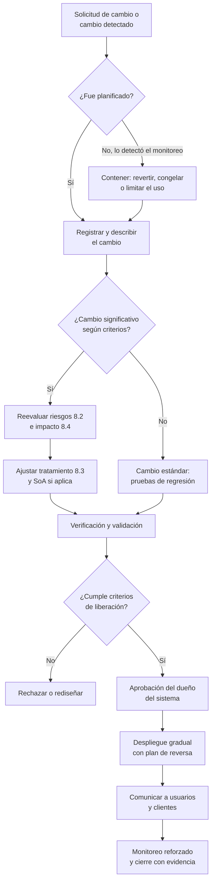
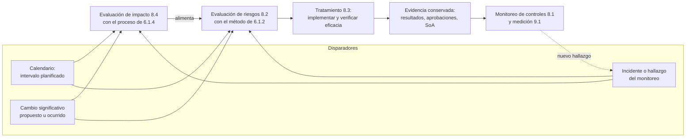

# Cláusula 8 · Operación

:material-file-document-check-outline: Requisito certificable
:material-cloud-download-outline: Usa IA de terceros
:material-code-braces: Desarrolla IA
:material-handshake-outline: Provee IA a clientes
:material-clock-outline: 20 min de lectura

!!! abstract "En una frase"
    La cláusula 8 convierte en rutina lo que diseñaste en la cláusula 6: los controles funcionan todos los días, los cambios se gestionan antes de que sorprendan, los proveedores de IA están bajo control y las evaluaciones de riesgo e impacto se repiten cuando toca, dejando evidencia de cada vuelta.

## Propósito

Los sistemas de IA no se quedan quietos. Un modelo que era justo el día del lanzamiento puede degradarse cuando cambia la economía; un proveedor puede actualizar el modelo detrás de la misma API sin avisar; un área puede empezar a usar el chatbot para algo que nadie evaluó. Una evaluación de riesgos hecha una sola vez, al arrancar, envejece rápido.

La cláusula 6 define **cómo** se evalúan y tratan los riesgos y los impactos. La cláusula 8 exige **hacerlo de verdad**, una y otra vez, cuando lo marca el calendario o cuando algo cambia, y conservar los resultados.

!!! tip "Analogía"
    La cláusula 6 es el esquema de vacunación: qué vacunas, a qué edad, con qué criterios. La cláusula 8 es ir a la clínica, ponértelas y que te sellen la cartilla. Y si hay un brote o viajas a otro país (un cambio significativo), te toca un refuerzo fuera de calendario. Al auditor no le basta ver el esquema: quiere la cartilla sellada.

| | Cláusula 6 · Planificación | Cláusula 8 · Operación |
|---|---|---|
| **Verbo** | Definir, diseñar | Ejecutar, repetir, conservar |
| **Riesgos** | Metodología y criterios ([6.1.2](c6-planificacion.md#c-6-1-2)) | Evaluaciones hechas, con fecha y resultados ([8.2](#c-8-2)) |
| **Tratamiento** | Opciones, controles, SoA y plan ([6.1.3](c6-planificacion.md#c-6-1-3)) | Plan implementado y eficacia comprobada ([8.3](#c-8-3)) |
| **Impacto** | Proceso de evaluación de impacto ([6.1.4](c6-planificacion.md#c-6-1-4)) | Evaluaciones realizadas por sistema y por cambio ([8.4](#c-8-4)) |
| **Cambios** | Cambios al propio SGIA ([6.3](c6-planificacion.md#c-6-3)) | Cambios en procesos y sistemas en operación ([8.1](#c-8-1)) |
| **Evidencia típica** | Procedimientos, metodologías, criterios | Registros, reportes, actas, tickets, bitácoras |
| **Pregunta del auditor** | "¿Cómo lo deciden?" | "Muéstrame las últimas tres veces que lo hicieron" |

La fila de cambios es interpretación nuestra: leemos 6.3 como cambios al sistema de gestión (nuevo alcance, nueva estructura de roles) y 8.1 como cambios en lo que opera dentro de él (un modelo, un proveedor, un proceso).

## Qué pide, explicado

### 8.1 Planificación y control operacional {#c-8-1}

Esta subcláusula pide preparar, poner en marcha y vigilar los procesos con los que la organización cumple su SGIA y ejecuta lo que decidió en la cláusula 6. Lo desglosamos en cinco piezas.

#### Criterios de proceso y control conforme a ellos

Un criterio es una regla verificable que dice cuándo un proceso se hizo bien. Algunos ejemplos:

- Ningún sistema de IA entra a producción sin estar en el inventario y sin evaluación de impacto aprobada.
- Toda respuesta nueva en la base de conocimiento de un chatbot necesita fuente oficial y aprobación de un experto.
- Un modelo de crédito no se despliega si la diferencia de tasas de aprobación entre grupos supera el umbral fijado.
- Ninguna versión de un asistente se libera si no pasa la batería de pruebas de inyección de instrucciones (*prompt injection*).

Controlar el proceso significa comprobar que esos criterios se cumplen cada vez: puertas automáticas en la canalización de despliegue (*pipeline*), listas de verificación, aprobaciones registradas.

#### Implementar los controles determinados en 6.1.3

La Declaración de Aplicabilidad (SoA) no es una lista de deseos. Los controles elegidos que tienen que ver con la operación, sobre todo los del ciclo de vida de desarrollo y de uso, deben estar funcionando: despliegue ([A.6.2.5](../anexo-a/a6-ciclo-de-vida.md#a-6-2-5)), operación y monitoreo ([A.6.2.6](../anexo-a/a6-ciclo-de-vida.md#a-6-2-6)), registro de eventos ([A.6.2.8](../anexo-a/a6-ciclo-de-vida.md#a-6-2-8)), calidad de datos ([A.7.4](../anexo-a/a7-datos.md#a-7-4)), uso responsable ([A.9.2](../anexo-a/a9-uso.md#a-9-2)) y uso previsto ([A.9.4](../anexo-a/a9-uso.md#a-9-4)), entre otros. (Los nombres de los controles son traducción libre de referencia).

#### Monitorear la eficacia de los controles

Este es un añadido importante frente a ISO 27001: 42001 pide en la propia cláusula 8 vigilar si esos controles **logran lo que se esperaba** y, si no, considerar acciones correctivas ([10.2](c10-mejora.md#c-10-2)). Un control que existe pero no funciona es solo decoración.

| Control | Indicador de eficacia | Si no se cumple |
|---|---|---|
| Monitoreo de un modelo de crédito ([A.6.2.6](../anexo-a/a6-ciclo-de-vida.md#a-6-2-6)) | Estabilidad de la población y de las variables clave dentro del umbral | Análisis de deriva (*drift*) y posible reentrenamiento |
| Supervisión humana en la banda gris ([A.9.3](../anexo-a/a9-uso.md#a-9-3)) | Porcentaje de anulaciones con justificación documentada | Refuerzo de capacitación y revisión del flujo |
| Aviso de interacción con IA ([A.8.2](../anexo-a/a8-informacion-partes-interesadas.md#a-8-2)) | Conversaciones que muestran el aviso | Corrección inmediata con el proveedor del chatbot |
| Filtros contra inyección de instrucciones | Tasa de bloqueo en la batería adversaria | Bloquear la liberación |
| Gestión de proveedores ([A.10.3](../anexo-a/a10-terceros.md#a-10-3)) | Proveedores críticos evaluados en el año | Escalamiento a la dirección |

#### Información documentada suficiente y control de cambios

La norma pide suficiente información documentada para poder confiar en que cada proceso se hizo según lo previsto: tickets, aprobaciones, bitácoras de despliegue. Además, los **cambios que planeas** deben pasar por control, y los que **ocurren sin querer** deben analizarse para entender qué provocaron y mitigar sus efectos adversos.

En IA, los cambios no intencionados son el pan de cada día:

- El proveedor actualiza el modelo detrás de la misma API y cambian el tono, la calidad o los temas que el modelo se niega a contestar.
- Deriva de datos o de concepto: los clientes, la economía o el lenguaje cambian, y el modelo envejece.
- Un área empieza a usar el sistema para un propósito no previsto.
- El proveedor cambia sus términos, por ejemplo para usar tus datos en entrenamiento.

El siguiente flujo resume una gestión de cambios proporcionada para sistemas de IA:

#### Procesos, productos y servicios externos

Lo que hace un tercero y es relevante para el SGIA también debe estar bajo control. La responsabilidad no se terceriza: si tu chatbot usa el modelo de otro, sus fallas son tu problema frente a tus clientes. Esta pieza se apoya en [A.10.2](../anexo-a/a10-terceros.md#a-10-2) y [A.10.3](../anexo-a/a10-terceros.md#a-10-3).

| Servicio externo | Riesgo típico | Control operacional |
|---|---|---|
| Modelo fundacional vía API | Cambios de versión, retención de datos, disponibilidad | Fijar la versión, cláusula de aviso previo, pruebas de regresión, proveedor alterno |
| Chatbot o IA como servicio (SaaS) | Configuración opaca; depende a su vez del modelo de otro | Debida diligencia, documentación del proveedor, niveles de servicio, derecho a recibir informes |
| API de detección de fraude u otra "caja negra" | Falsos positivos concentrados en ciertos grupos | Monitorear tasas por segmento, revisión humana de rechazos |
| Datos de terceros | Licencia, procedencia, calidad | Contrato con procedencia documentada ([A.7.3](../anexo-a/a7-datos.md#a-7-3), [A.7.5](../anexo-a/a7-datos.md#a-7-5)) |
| Servicios de etiquetado | Calidad y confidencialidad | Guía de etiquetado, muestreo de calidad, acuerdo de confidencialidad |

!!! success "Implementación mínima viable"
    - Criterios de liberación escritos para cada sistema de IA.
    - Un registro de cambios (aunque sea una hoja de cálculo) con clasificación de significativo o estándar.
    - Contratos con proveedores de IA revisados con una lista de verificación.
    - Tres a cinco indicadores de eficacia de los controles más críticos, revisados cada mes.

!!! tip "Implementación madura"
    - Puertas automáticas en la canalización que bloquean liberaciones sin pruebas ni aprobación.
    - Versiones de modelos y datos fijadas y trazables en un registro de modelos.
    - Monitoreo continuo de deriva, calidad y comportamiento del proveedor, con alertas.
    - Revisiones periódicas de proveedores críticos y planes de salida probados.

### 8.2 Evaluación de riesgos de IA {#c-8-2}

La organización debe ejecutar evaluaciones de riesgos de IA, con el método que definió en [6.1.2](c6-planificacion.md#c-6-1-2), **a intervalos planificados** y **cuando se proponen o se producen cambios significativos**, y conservar los resultados de cada una.

Tres claves:

- **Intervalos planificados.** La norma no dice cada cuánto; te recomendamos ligarlo al nivel de riesgo del sistema (ver la tabla de abajo).
- **"Se proponen o se producen".** Hay que evaluar *antes* de un cambio que planeas y *después* de uno que ocurrió sin tu permiso, como una actualización silenciosa del proveedor.
- **Conservar todas.** El historial permite comparar resultados, algo que [6.1.2](c6-planificacion.md#c-6-1-2) exige al pedir resultados consistentes y comparables.

Una propuesta de frecuencias, que debes ajustar a tus criterios de riesgo:

| Nivel del sistema | Reevaluación de riesgos | Reevaluación de impacto | Ejemplo |
|---|---|---|---|
| Alto: decide sobre personas o su dinero | Semestral | Anual y antes de cada cambio significativo | Score Monarca v3 |
| Medio: informa a clientes o al público | Anual | Anual | Alma, el chatbot de WhatsApp |
| Bajo: apoyo interno con revisión humana | Anual o con la revisión del SGIA | Cada dos años | Resumen de juntas con IA-01 |

#### ¿Qué es un "cambio significativo" en IA?

La norma no lo define; te toca a ti fijar el criterio en tu metodología. Estos ejemplos sirven de punto de partida:

| Cambio | Ejemplo | ¿Reevaluar riesgos (8.2)? | ¿Reevaluar impacto (8.4)? |
|---|---|---|---|
| Reentrenar el modelo | Score Monarca v3 reentrenado con datos del último año | Sí | Sí, si cambian variables, umbrales o población; si es rutinario con la misma especificación, puede bastar la validación (lectura nuestra) |
| Cambiar de modelo fundacional | Conversa migra a otro proveedor | Sí | Sí |
| Nuevo uso o propósito | Alma empieza a responder dudas de nómina a trabajadores de los clientes | Sí | Sí |
| Nuevo segmento de población | Monarca abre créditos a micronegocios rurales | Sí | Sí |
| Nueva jurisdicción | Conversa firma su primer cliente en España | Sí | Sí |
| Más automatización | Eliminar la banda gris de revisión humana | Sí | Sí |
| Nueva fuente de datos | Incorporar datos de uso de la app al modelo | Sí | Sí |
| Nuevas capacidades | El asistente ahora agenda citas o ejecuta acciones | Sí | Según el caso |
| Incidente grave | Alma da un plazo fiscal equivocado a decenas de clientes | Sí | Sí |
| No significativo | Corregir una errata en la base de conocimiento; cambiar el color del widget | No: cambio estándar | No |

El ciclo completo de la operación se ve así:

### 8.3 Tratamiento de riesgos de IA {#c-8-3}

La organización debe **implementar** el plan de tratamiento que formuló según [6.1.3](c6-planificacion.md#c-6-1-3) y **verificar que funciona**. Además:

- Si una nueva evaluación encuentra riesgos que requieren tratamiento, se les aplica el mismo proceso de 6.1.3.
- Si una opción de tratamiento no resultó eficaz, se revisa, se vuelve a validar y se actualiza el plan.
- Se conservan los resultados de los tratamientos.

La diferencia entre *implementado* y *eficaz* es el corazón de esta subcláusula:

| Riesgo | Tratamiento implementado | Cómo se verifica la eficacia |
|---|---|---|
| Alma inventa plazos fiscales | Respuestas limitadas a la base de conocimiento curada, aviso de confirmar con el contador y traspaso a persona | Muestreo de 30 conversaciones por semana (unas 120 al mes) sobre plazos; meta de errores cercana a cero |
| Sesgo por código postal en Score Monarca v3 | Variable excluida y pruebas de equidad en cada validación | Métricas de equidad por entidad federativa en producción, cada mes |
| Inyección de instrucciones a través de documentos del RAG | Filtros y separación entre instrucciones y contenido | Batería adversaria en cada versión y ejercicio de equipo rojo (*red team*) periódico |

Para demostrarlo, conviene que el seguimiento del plan registre, por cada acción: riesgo, acción, responsable, fecha compromiso, estado, evidencia de implementación, evidencia de eficacia, riesgo residual resultante y fecha de aceptación. Una hoja de cálculo bien llevada basta; lo que no basta es una columna de "cerrado" sin nada detrás.

Cuando el tratamiento cambia, revisa también la aceptación del riesgo residual por la dirección designada (6.1.3) y actualiza la SoA si entran o salen controles.

### 8.4 Evaluación de impacto del sistema de IA {#c-8-4}

La organización debe ejecutar evaluaciones de impacto del sistema de IA, con el proceso de [6.1.4](c6-planificacion.md#c-6-1-4), **a intervalos planificados** o **ante cambios significativos**, y conservar los resultados de todas.

Puntos prácticos:

- **Otra perspectiva.** La evaluación de riesgos mira consecuencias para la organización, las personas y la sociedad; la de impacto se concentra en personas, grupos y sociedad. Ver [Riesgo frente a impacto](../fundamentos/riesgo-vs-impacto.md).
- **Alimenta a 8.2.** Los resultados del impacto entran a la evaluación de riesgos, como pide 6.1.4. En la práctica, un mismo ticket de cambio puede disparar ambas.
- **Matiz de redacción.** En nuestra lectura, 8.4 habla de cambios significativos que *se proponen*, mientras que 8.2 cubre también los que *ya ocurrieron*. Aun así, te recomendamos reevaluar el impacto cuando un cambio te tomó por sorpresa.
- **Conservación.** La guía de [A.5.3](../anexo-a/a5-evaluacion-de-impacto.md#a-5-3) sugiere conservar los resultados por un periodo definido.
- **Quién participa.** Además del evaluador, alguien que conozca el dominio y, de preferencia, la voz de los grupos afectados (quejas, encuestas, reconsideraciones). Ver [A.5.2](../anexo-a/a5-evaluacion-de-impacto.md#a-5-2), [A.5.4](../anexo-a/a5-evaluacion-de-impacto.md#a-5-4) y [A.5.5](../anexo-a/a5-evaluacion-de-impacto.md#a-5-5).

!!! latam "En México y Latinoamérica"
    Buenas fuentes para reevaluar el impacto: quejas de clientes (para entidades financieras, también las que llegan por Condusef), solicitudes de derechos ARCO relacionadas con decisiones automatizadas y reclamaciones en redes sociales o en WhatsApp. Si además realizas evaluaciones de impacto en protección de datos, coordínalas para no duplicar trabajo. Revisa [México y Latinoamérica](../integracion/contexto-mexico-latam.md) para el marco aplicable.

## Cómo se aplica según tu rol

=== "Si usas IA de terceros"

    **Contadores Alameda** (despacho contable en Querétaro).

    - **8.1:** criterio de que ningún uso nuevo de IA se activa sin alta en el inventario y aprobación ([A.9.2](../anexo-a/a9-uso.md#a-9-2)); la base de conocimiento de Alma con doble revisión; muestreo de CFDI capturados por IA-03. El contrato con BotNorte exige aviso previo si cambia el modelo de lenguaje que usa. Si la suite de ofimática activa por defecto una función nueva de IA, se trata como cambio no intencionado y se revisa la configuración.
    - **8.2:** evaluación anual, más disparadores: que BotNorte cambie de modelo, que una reforma fiscal cambie plazos que Alma responde o que se quiera ampliar Alma a nuevas consultas.
    - **8.3:** tras el incidente de la nómina, el tratamiento fue bloquear chatbots no autorizados en la red y reforzar la concientización; la eficacia se verifica con una revisión trimestral del tráfico web.
    - **8.4:** el impacto clave es que un cliente PyME reciba un plazo equivocado y pague una multa. Se reevalúa antes de ampliar Alma a trabajadores de los clientes, porque cambia la población y entran datos personales.

=== "Si desarrollas IA"

    **Monarca Crédito** (SOFOM E.N.R. con modelo de *scoring* propio).

    - **8.1:** el Comité de Modelos funciona como comité de cambios con criterios de liberación (poder discriminante, equidad, explicabilidad de motivos de rechazo). Se monitorea la deriva de variables y la tasa de anulaciones en la banda gris. La API de fraude del proveedor (IA-03) se vigila por segmento.
    - **8.2:** evaluación semestral de Score Monarca v3. Un reentrenamiento con la misma especificación es cambio estándar con validación; agregar variables o cambiar umbrales es significativo.
    - **8.3:** la regla de reconsideración humana para rechazos se verifica con el porcentaje de reconsideraciones que terminan en aprobación.
    - **8.4:** impactos en solicitantes (exclusión financiera, sesgo regional); se reevalúa antes de lanzar créditos para micronegocios rurales.

=== "Si provees IA a clientes"

    **Conversa Labs** (plataforma SaaS de asistentes con IA generativa).

    - **8.1:** cada versión pasa por baterías de evaluación de calidad y pruebas adversarias; los cambios que el cliente hace en su propia base de conocimiento son responsabilidad suya, pero Conversa le da herramientas para probarlos. El proveedor del modelo fundacional es el servicio externo más crítico.
    - **8.2:** se evalúa la plataforma y, aparte, los grupos de clientes por sector. Disparadores: nuevo modelo, nueva capacidad (por ejemplo, que el asistente cotice pólizas), nuevo sector o nuevo país.
    - **8.3:** la eficacia de los filtros de seguridad (*guardrails*) se mide en cada liberación.
    - **8.4:** responsabilidad compartida ([A.10.2](../anexo-a/a10-terceros.md#a-10-2), [A.10.4](../anexo-a/a10-terceros.md#a-10-4)): Conversa evalúa el impacto de la plataforma y da a cada cliente insumos para la suya. Para el cliente en España, ver el [Reglamento de IA de la UE](../integracion/reglamento-ia-ue.md).

!!! info "Diferencias con ISO 27001"
    - **8.1** comparte la base con ISO 27001:2022 (criterios, información documentada, cambios, procesos externos), pero 42001 añade un bloque explícito: implementar los controles de 6.1.3 ligados a la operación y **monitorear su eficacia**, con referencia a los Anexos A y B.
    - **8.2** es paralela a la de ISO 27001, pero el riesgo considera consecuencias para personas y sociedades, no solo para la información.
    - **8.3** va más allá que su par de ISO 27001: además de implementar el plan, pide verificar su eficacia y dice qué hacer con riesgos nuevos y con opciones de tratamiento que no funcionaron.
    - **8.4** no tiene equivalente en ISO 27001.
    - Los **cambios no intencionados** (deriva, actualizaciones silenciosas del proveedor) son mucho más frecuentes en IA que en TI tradicional.
    - Los **servicios externos** abarcan modelos, datos y etiquetado, y se valoran también por su alineación con el enfoque de IA responsable ([A.10.3](../anexo-a/a10-terceros.md#a-10-3)).

## Preguntas para tu organización

- [ ] ¿Tenemos criterios verificables para liberar, cambiar y retirar sistemas de IA?
- [ ] ¿Cada control operativo de la SoA está funcionando y tiene un indicador de eficacia?
- [ ] ¿Definimos por escrito qué es un "cambio significativo" para nuestros sistemas?
- [ ] ¿Detectaríamos si el proveedor cambia el modelo detrás de la API sin avisar?
- [ ] ¿Nuestros contratos con proveedores de IA exigen aviso previo de cambios y prohíben usar nuestros datos para entrenar, si así lo necesitamos?
- [ ] ¿Las evaluaciones de riesgo e impacto tienen frecuencia definida según el nivel de riesgo, y se cumplen?
- [ ] ¿Podemos mostrar las últimas evaluaciones de cada sistema, con fecha y versión?
- [ ] ¿Verificamos que los tratamientos funcionan, no solo que se implementaron?
- [ ] ¿Cuando un tratamiento falla, actualizamos el plan y la aceptación del riesgo residual?
- [ ] ¿Los incidentes y hallazgos de monitoreo disparan reevaluaciones?

## Qué evidencia espera ver un auditor

| Evidencia | Ejemplo | Señal de alerta |
|---|---|---|
| Criterios de proceso | Criterios de liberación documentados y aplicados | Despliegues sin evidencia de pruebas ni aprobación |
| Controles en operación | Registros de monitoreo, bitácoras, reportes de pruebas | Controles "aplicables" en la SoA sin ninguna evidencia de operación |
| Eficacia de controles | Tablero de indicadores con acciones cuando se salen de rango | Indicadores en rojo durante meses sin acción |
| Gestión de cambios | Tickets con clasificación, análisis, aprobación y reversa | Cambios de modelo o de proveedor sin registro |
| Control de proveedores | Debida diligencia, contratos con cláusulas de IA, revisiones periódicas | Se usa una API de IA sin contrato revisado ni documentación |
| Evaluaciones de riesgo (8.2) | Matrices fechadas y versionadas; disparadores registrados | Una sola evaluación del año de implementación |
| Tratamiento (8.3) | Plan con estado, responsables y evidencia de eficacia | Acciones "cerradas" sin verificar si funcionaron |
| Evaluaciones de impacto (8.4) | Evaluaciones actualizadas tras cambios relevantes | Un sistema cambió de población y la evaluación es la original |

!!! auditor "Lo que mira el auditor"
    La técnica favorita aquí es el **muestreo hacia atrás**: el auditor elige un cambio real (una nueva versión de modelo, un proveedor nuevo) y pide ver el ticket, la clasificación, la reevaluación de riesgos e impacto, las pruebas, la aprobación y la comunicación. Si algún eslabón falta, hay hallazgo.

!!! warning "Errores comunes"
    - Hacer la evaluación de riesgos para la certificación y no volver a tocarla.
    - No definir qué es un cambio significativo, de modo que nada lo es.
    - Usar el alias "última versión" del modelo del proveedor y enterarse de los cambios por las quejas de los clientes.
    - Confundir "implementado" con "eficaz" en el plan de tratamiento.
    - Reevaluar riesgos tras un cambio, pero olvidar el impacto.
    - Tratar a los proveedores de IA como cualquier proveedor de software, sin preguntar por datos, versiones ni documentación.

## Ejemplo resuelto

!!! example "Caso: Conversa Labs — cambio de proveedor del modelo fundacional"
    **Contexto.** El proveedor actual anunció el retiro programado de la versión del modelo que usa Conversa. El CTO propone migrar a otro proveedor con mejor costo y menor latencia. La Responsable de Confianza y Seguridad, dueña del SGIA, abre el proceso.

    **1. Registro y clasificación (8.1).** Se abre un ticket de cambio. Según los criterios de Conversa, cambiar de modelo fundacional es un cambio significativo: exige reevaluar riesgos e impacto y la aprobación conjunta del CEO, el CTO y Confianza y Seguridad.

    **2. Debida diligencia del nuevo proveedor (8.1 y A.10.3).** Legal y Confianza y Seguridad revisan: si el proveedor usa los datos enviados por API para entrenar (Conversa prometió a sus clientes que no); cuánto tiempo retiene entradas y salidas; dónde procesa y con qué subprocesadores; qué documentación entrega sobre limitaciones y evaluaciones de seguridad; cómo avisa de nuevas versiones y de retiros de versiones; cómo notifica incidentes. El nuevo proveedor acepta por contrato no entrenar con los datos y avisar con anticipación de cualquier cambio de versión.

    **3. Reevaluación de riesgos (8.2).** Se corre la batería de evaluación con 1200 preguntas sintéticas y anonimizadas por sector, aprobadas por los clientes piloto:

    | Riesgo | Proveedor actual | Nuevo proveedor (antes de tratar) |
    |---|---|---|
    | Respuestas inventadas sobre coberturas de pólizas | Medio | Medio |
    | Errores con modismos de Chile y Colombia | Bajo | Medio |
    | Susceptibilidad a inyección de instrucciones (bloqueo) | Medio (97 %) | Alto (91 %) |
    | Procesamiento de datos en otra región | Bajo | Medio |
    | Dependencia de un solo proveedor | Alto | Medio (se construye una capa multiproveedor) |

    **4. Reevaluación de impacto (8.4).** Los grupos más sensibles son los asegurados que consultan coberturas: una respuesta equivocada puede llevarlos a no presentar una reclamación. También se detecta que el nuevo modelo se niega más a hablar de temas de salud, lo que reduce el acceso a información legítima. Conclusión: piloto más estricto con aseguradoras y documentación actualizada para el cliente en España.

    **5. Tratamiento (8.3).** Ajuste de instrucciones de sistema y filtros; glosario regional en el RAG; versión del modelo fijada, nunca "la última"; acuerdo de procesamiento en la región requerida; despliegue gradual (5 % del tráfico de un comercio y una universidad, luego 25 %, luego 100 %) con reversa en menos de una hora; aviso a los clientes con 30 días de anticipación, notas de versión y documentación actualizada ([A.8.2](../anexo-a/a8-informacion-partes-interesadas.md#a-8-2), [A.10.4](../anexo-a/a10-terceros.md#a-10-4)). Se actualizan el inventario, la ficha del sistema y los recursos documentados ([A.4.4](../anexo-a/a4-recursos.md#a-4-4)).

    El calendario quedó así:

    | Semanas | Fase | Responsable |
    |---|---|---|
    | 1 a 3 | Debida diligencia y negociación del contrato | Legal y Confianza y Seguridad |
    | 2 a 5 | Evaluaciones de riesgo e impacto; batería de pruebas | Confianza y Seguridad y CTO |
    | 5 a 7 | Ajustes de tratamiento y nueva corrida de pruebas | Equipo de ingeniería |
    | 5 | Aviso a clientes, 30 días antes de iniciar el despliegue | Customer Success |
    | 10 a 12 | Despliegue gradual por cliente | CTO |
    | 16 | Revisión posterior a la implementación | Dueña del SGIA |

    **6. Verificación de eficacia.** Tras el ajuste, el bloqueo de inyecciones sube a 98 % y los errores con modismos bajan al nivel previo. Treinta días después de la migración completa, la tasa de traspaso a agente humano y las quejas se mantienen estables. El riesgo residual se presenta y se acepta formalmente.

    **7. El cambio que nadie planeó.** Dos semanas después de completar la migración, el monitoreo detecta más negativas a responder en un ambiente donde la versión no quedó fijada: el proveedor actualizó su alias. Se trata como cambio no intencionado (8.1): se contiene, se fija la versión y se agrega una verificación automática a la canalización.

    **Evidencia conservada.** Ticket y clasificación, cuestionario de debida diligencia y contrato, evaluación de riesgos nueva frente a la anterior, evaluación de impacto actualizada, reportes de pruebas, aprobaciones, avisos a clientes, revisión posterior a la implementación y registro del incidente del alias.

## Relación con otras cláusulas, controles y normas

- **Planificación:** 8.2, 8.3 y 8.4 ejecutan lo definido en [6.1.2](c6-planificacion.md#c-6-1-2), [6.1.3](c6-planificacion.md#c-6-1-3) y [6.1.4](c6-planificacion.md#c-6-1-4); los cambios al SGIA mismo van por [6.3](c6-planificacion.md#c-6-3).
- **Apoyo:** los resultados se controlan como información documentada ([7.5](c7-apoyo.md#c-7-5)) y los cambios se comunican según la matriz de [7.4](c7-apoyo.md#c-7-4).
- **Evaluación y mejora:** los indicadores de eficacia alimentan [9.1](c9-evaluacion-del-desempeno.md#c-9-1); conviene llevar a [9.3](c9-evaluacion-del-desempeno.md#c-9-3) el estado de las evaluaciones y del plan de tratamiento; los controles ineficaces pueden terminar en [10.2](c10-mejora.md#c-10-2).
- **Controles:** ciclo de vida [A.6.2.4](../anexo-a/a6-ciclo-de-vida.md#a-6-2-4), [A.6.2.5](../anexo-a/a6-ciclo-de-vida.md#a-6-2-5), [A.6.2.6](../anexo-a/a6-ciclo-de-vida.md#a-6-2-6) y [A.6.2.8](../anexo-a/a6-ciclo-de-vida.md#a-6-2-8); impacto [A.5.2](../anexo-a/a5-evaluacion-de-impacto.md#a-5-2) a [A.5.5](../anexo-a/a5-evaluacion-de-impacto.md#a-5-5); incidentes [A.8.4](../anexo-a/a8-informacion-partes-interesadas.md#a-8-4); uso previsto [A.9.4](../anexo-a/a9-uso.md#a-9-4); terceros [A.10.2](../anexo-a/a10-terceros.md#a-10-2), [A.10.3](../anexo-a/a10-terceros.md#a-10-3) y [A.10.4](../anexo-a/a10-terceros.md#a-10-4).
- **Normas y marcos:** ISO/IEC 23894 para la gestión de riesgos de IA ([familia de normas](../fundamentos/familia-de-normas.md)); la función de gestión del [NIST AI RMF](../integracion/nist-ai-rmf.md); [integración con ISO 27001](../integracion/con-iso27001.md).
- **Casos completos:** [PyME que usa IA generativa](../casos-practicos/pyme-usa-ia-generativa.md), [fintech con *scoring*](../casos-practicos/fintech-scoring.md) y [empresa que desarrolla un chatbot](../casos-practicos/empresa-desarrolla-chatbot.md).

## Plantillas relacionadas

- [Metodología y matriz de riesgos de IA](../plantillas/index.md#evaluacion-de-riesgos)
- [Evaluación de impacto del sistema de IA](../plantillas/index.md#evaluacion-de-impacto)
- [Declaración de Aplicabilidad (SoA)](../plantillas/index.md#declaracion-de-aplicabilidad)
- [Procedimiento del ciclo de vida](../plantillas/index.md#procedimiento-ciclo-de-vida)
- [Registro de incidentes de IA](../plantillas/index.md#registro-de-incidentes)
- [Ficha del sistema de IA](../plantillas/index.md#ficha-del-sistema)
- [Inventario de sistemas de IA](../plantillas/index.md#inventario-sistemas-ia)
