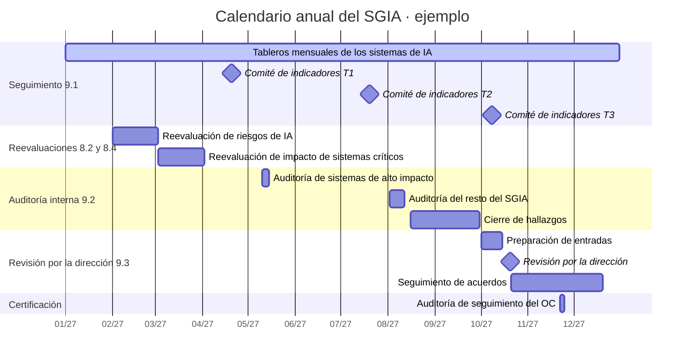

# Cláusula 9 · Evaluación del desempeño

<div class="dx-page-meta" markdown>
<span class="dx-badge dx-badge--tipo">:material-file-document-check-outline: Requisito certificable</span>
<span class="dx-badge dx-badge--rol-usa">:material-cloud-download-outline: Usa IA de terceros</span>
<span class="dx-badge dx-badge--rol-desarrolla">:material-code-braces: Desarrolla IA</span>
<span class="dx-badge dx-badge--rol-provee">:material-handshake-outline: Provee IA a clientes</span>
<span class="dx-badge dx-badge--tiempo">:material-clock-outline: 22 min de lectura</span>
</div>

!!! abstract "En una frase"
    La cláusula 9 te pide demostrar con datos que tu SGIA funciona y que tus sistemas de IA se comportan como prometiste: defines qué medir, lo auditas con ojos objetivos y la alta dirección decide con esa información.

## Propósito

Hasta la cláusula 8 construiste y pusiste a operar el SGIA. La cláusula 9 es la fase **Verificar** del ciclo PHVA: la pregunta deja de ser "¿lo hicimos?" y pasa a ser "¿funciona?".

En IA esa pregunta es más urgente que en otras disciplinas porque los sistemas se degradan en silencio. Un modelo de crédito que hoy trata parejo a todos los grupos puede dejar de hacerlo mañana porque cambió el perfil de quienes solicitan; un asistente que hoy responde bien puede empezar a inventar porque alguien cargó un documento contradictorio en su base de conocimiento. Nadie tocó el código y el sistema ya no es el que aprobaste. Si no mides, te enteras por una queja ante la Condusef o por una captura de pantalla en redes.

La cláusula tiene tres piezas que se alimentan entre sí: **9.1** (¿cómo vamos, en números?), **9.2** (¿lo que decimos que hacemos se cumple y sirve?) y **9.3** (¿qué decidimos con todo esto?).

!!! tip "Analogía"
    Piensa en tu salud. El glucómetro y la báscula de todos los días son 9.1: datos frecuentes y baratos que tú mismo registras. El chequeo anual con un médico que no eres tú es 9.2: alguien con criterio y distancia revisa si tus números cuentan la historia completa. La plática en familia para decidir si cambian la dieta y cuánto se gasta en el gimnasio es 9.3: ahí se toman las decisiones y se asignan recursos. Sin la báscula, el médico adivina; sin la plática familiar, el diagnóstico se queda en un papel.

## Qué pide, explicado

### 9.1 Seguimiento, medición, análisis y evaluación {#c-9-1}

En nuestras palabras, 9.1 te obliga a tomar cuatro decisiones explícitas y a guardar evidencia de lo que resulte:

1. **Qué vas a vigilar y medir**: no todo, sino lo que te dice si el SGIA y los sistemas de IA cumplen su propósito.
2. **Con qué método**, de modo que el resultado sea confiable. Una cifra que cambia según quién la calcula no sirve para decidir.
3. **Cada cuánto se mide.**
4. **Cada cuánto se analiza y se evalúa.** Un tablero puede actualizarse cada hora y discutirse en comité una vez al mes.

Con esos resultados documentados, la organización valora el desempeño del SGIA y su eficacia, es decir, si logra lo que planificó. El *seguimiento* (*monitoring*) observa el estado de algo; la *medición* (*measurement*) le asigna un valor. En México se dice mucho "monitoreo" para lo primero.

#### Dos sentidos de "desempeño"

La norma usa *desempeño* (*performance*) en dos planos y lo aclara en su propia definición (3.11): puede referirse al sistema de gestión o a los resultados que logran los sistemas de IA. En nuestra lectura, conviene que 9.1 cubra ambos, porque los objetivos de IA ([6.2](c6-planificacion.md#c-6-2)) suelen expresarse como métricas de los sistemas y porque el control de operación y monitoreo ([A.6.2.6](../anexo-a/a6-ciclo-de-vida.md#a-6-2-6); en esta guía, los nombres de los controles son traducción libre de referencia) produce justamente esos datos.

- **Desempeño del SGIA:** ¿el sistema de gestión hace lo que prometió? Evaluaciones de impacto a tiempo, acciones correctivas cerradas, personal capacitado, objetivos cumplidos.
- **Desempeño y efectos de los sistemas de IA:** ¿cada sistema funciona según su uso previsto y sin causar daño? Precisión, deriva, equidad, alucinaciones, anulaciones humanas, quejas.

#### Indicadores de ejemplo

Un KPI te dice si logras lo que te propusiste; un KRI te avisa que un riesgo se acerca a la zona que no estás dispuesto a aceptar. Las cifras son ilustrativas: conviene que tus umbrales salgan de tus criterios de riesgo ([6.1.1](c6-planificacion.md#c-6-1-1)) y de tus objetivos.

| Indicador | Tipo | Fórmula | Frecuencia y fuente | Umbral de ejemplo |
|---|---|---|---|---|
| **Del sistema de gestión** | | | | |
| Cumplimiento del programa de evaluaciones de impacto | KPI | Evaluaciones completadas en fecha ÷ programadas o detonadas por cambios | Trimestral · inventario y registro de evaluaciones | ≥ 95 %; menos de 80 % se escala a la dirección |
| Acciones correctivas cerradas a tiempo | KPI | Cerradas con eficacia verificada antes de su fecha ÷ las que vencían en el periodo | Mensual · registro de no conformidades | ≥ 90 % |
| Cobertura de capacitación en IA | KPI | Personas con rol en el SGIA y capacitación vigente ÷ personas con rol | Trimestral · plataforma de capacitación | ≥ 95 % |
| IA fuera del inventario | KRI | Herramientas de IA detectadas en uso sin registro | Trimestral · tarjetas corporativas, filtro web, compras | Ninguna con más de 30 días sin registrar |
| **De los sistemas de IA** | | | | |
| Precisión o poder predictivo | KPI | Clasificador: AUC en muestra etiquetada reciente. Extracción: campos correctos ÷ campos extraídos | Mensual · muestra fuera de tiempo, correcciones manuales | Caída de más de 3 puntos frente a la línea base |
| Tasa de alucinación medida | KRI | Respuestas con alguna afirmación sin sustento en las fuentes autorizadas ÷ respuestas revisadas | Semanal · muestreo de conversaciones con rúbrica | ≤ 2 %; desde 5 % se trata como incidente |
| Deriva de datos (*data drift*) | KRI | Índice de estabilidad poblacional (*population stability index*, PSI) de variables clave y de la salida | Mensual · plataforma de MLOps | < 0.10 estable; 0.10 a 0.25 vigilar; > 0.25 actuar |
| Brecha de equidad entre grupos | KRI | Tasa de resultado favorable del grupo menos favorecido ÷ la del más favorecido | Trimestral · decisiones con el atributo, obtenido lícitamente | Cociente ≥ 0.80 como alerta |
| Tasa de anulación humana (*override rate*) | KPI / KRI | Decisiones de la IA modificadas por el supervisor ÷ decisiones que revisó | Mensual · bitácora de revisión | Banda esperada, p. ej., 5 % a 20 % |
| Quejas atribuibles a la IA | KRI | Quejas relacionadas con la IA por cada 10 000 interacciones o decisiones | Mensual · CRM, canal de reporte externo | Dos meses seguidos al alza disparan análisis |

Tres advertencias:

- Los cortes de PSI son una regla práctica muy difundida en riesgo de crédito, no un valor de la norma. El 0.80 viene de la llamada regla de los cuatro quintos, una heurística estadounidense del ámbito laboral: úsalo como alerta, no como frontera legal.
- La tasa de anulación se lee en dos sentidos. Casi cero puede significar que los analistas firman sin mirar (sesgo de automatización, *automation bias*); demasiado alta, que el modelo no sirve o nadie confía en él.
- Un promedio esconde problemas: 1 % de alucinaciones global puede ser 8 % en preguntas sobre coberturas, que son justo las que dañan.

#### Métodos que den resultados válidos

- **Ficha por indicador con definiciones estables.** Escribe qué cuenta como "alucinación" o como "queja atribuible a la IA" y qué población entra al cálculo. Si cambias la definición, marca el corte en la serie.
- **Muestras de tamaño razonable.** Para estimar una tasa cercana a 3 % con ±1.5 puntos de margen y 95 % de confianza necesitas unos 500 casos; con 50 al mes solo sabes que "no es una catástrofe". Estratifica por canal, cliente, banda de *score* o tipo de pregunta.
- **Evaluadores calibrados.** Si la medición depende de juicio humano, usa una rúbrica, entrena a los revisores y revisa por duplicado una fracción de la muestra. Si un modelo de IA hace de evaluador automático, compáralo antes contra revisión humana.
- **Indicadores adelantados y rezagados.** En crédito, el incumplimiento se conoce meses después (análisis por cosechas); mientras tanto, vigila deriva, distribución de *scores* y tasa de aprobación.
- **Separación de funciones y responsables con nombre.** Conviene que quien construyó el modelo no sea el único que reporta su desempeño. ISO 27001 pide definir quién mide y quién analiza; 42001 no lo enumera en 9.1, pero sin dueño los indicadores mueren en dos trimestres ([5.3](c5-liderazgo.md#c-5-3)).

??? example "Ficha de indicador: exactitud de Alma en plazos fiscales (Contadores Alameda)"
    - **Para qué sirve:** evitar que el chatbot de WhatsApp cause recargos a clientes por informar plazos equivocados.
    - **Definición:** es incorrecta cualquier fecha u obligación que no coincida con el calendario fiscal que la Coordinadora de cumplimiento validó para ese mes.
    - **Fórmula y muestra:** respuestas con plazo correcto ÷ respuestas sobre plazos revisadas; 120 conversaciones al mes elegidas al azar, más todas las que terminaron en queja.
    - **Frecuencia:** medición mensual; análisis trimestral.
    - **Umbral:** ≥ 98 %. Por debajo de 95 %, Alma deja de responder sobre plazos y transfiere a una persona.
    - **Responsables:** Líder de atención a clientes (mide) y Gerente de TI (analiza y reporta).

### 9.2 Auditoría interna {#c-9-2}

#### 9.2.1 Generalidades

La auditoría interna (*internal audit*) existe para que la organización se entere de sus fallas antes que el organismo de certificación (OC). Se hace a intervalos planificados y responde dos preguntas. La primera es de **conformidad**: ¿el SGIA cumple lo que la propia organización definió y lo que pide ISO/IEC 42001? La segunda es de **eficacia**: ¿está implementado y se mantiene, o solo existe en documentos? Que exista un procedimiento de monitoreo de deriva es conformidad documental; que las alertas se atiendan en plazo es eficacia.

#### 9.2.2 Programa de auditoría interna

El programa de auditoría (*audit programme*) dice cuántas auditorías habrá, de qué, cada cuándo, con qué métodos, quién las hace y cómo se informan. Al diseñarlo se toman en cuenta la importancia de los procesos y lo que encontraron auditorías previas. Cada auditoría tiene objetivos, criterios y alcance; los auditores se eligen para que el proceso sea objetivo e imparcial, y los resultados llegan a la dirección que corresponde. Todo con evidencia documentada.

**Un programa basado en riesgo.**

| Área auditable | Frecuencia sugerida |
|---|---|
| Sistemas de IA de alto impacto en personas (crédito, empleo, salud, coberturas de seguros) | Cada 6 meses o tras cambios significativos |
| Procesos centrales: riesgos, impacto, tratamiento, incidentes, acciones correctivas, proveedores | Anual |
| Sistemas de bajo impacto (asistentes de productividad) | Al menos una vez en el ciclo de certificación, por muestreo |
| Áreas con hallazgos previos o incidentes recientes | En la siguiente auditoría, sin excepción |

En la práctica, antes de certificar, los OC esperan ver un ciclo completo de auditoría interna que cubra las cláusulas 4 a 10 y los controles aplicables de tu Declaración de Aplicabilidad, seguido de una revisión por la dirección (ver [Cómo se certifica](../auditoria/como-se-certifica.md)).

**Competencia del auditor interno.** Auditar un SGIA exige dos conocimientos que pocas veces vienen juntos: **sistemas de gestión y técnica de auditoría** (muestrear, entrevistar, redactar hallazgos; la guía general es ISO 19011) e **IA suficiente para hacer buenas preguntas** (entrenamiento frente a inferencia, precisión, deriva, sesgo, cómo funciona un asistente con RAG, qué es una inyección de instrucciones o *prompt injection*). Si no los tienes en una persona, forma un equipo: auditor líder de sistemas de gestión más un experto técnico en IA ajeno al sistema auditado, con su competencia documentada ([7.2](c7-apoyo.md#c-7-2)).

**Objetividad e imparcialidad.** Nadie audita su propio trabajo: el Líder de Ciencia de Datos de Monarca no audita la validación de su equipo, y el Gerente de TI que diseñó el SGIA de Contadores Alameda no puede ser su único auditor. La norma no exige independencia total, sino un proceso objetivo e imparcial. Opciones para una PyME:

- **Auditor externo contratado.** Sigue siendo auditoría interna (de primera parte) aunque la ejecute un tercero en nombre de la organización. Te recomendamos que no sea la misma consultoría que te ayudó a implementar el SGIA.
- **Intercambio entre áreas**, con capacitación previa: cumplimiento audita a TI y viceversa.
- **Intercambio entre organizaciones** que no compiten, con convenio de confidencialidad y cuidado de los datos personales que se verán.

**Técnicas para auditar IA.**

| Técnica | Cómo se ve en la práctica |
|---|---|
| Muestreo de evaluaciones de impacto | Tomar 5 de 20 y comprobar que se hicieron antes del despliegue, que consideran el uso indebido previsible, que alimentaron la evaluación de riesgos y que se repitieron tras cambios ([A.5.2](../anexo-a/a5-evaluacion-de-impacto.md#a-5-2)) |
| Trazabilidad de punta a punta de un modelo | Seguir un sistema desde sus requisitos ([A.6.2.2](../anexo-a/a6-ciclo-de-vida.md#a-6-2-2)), datos, pruebas con criterios de aceptación ([A.6.2.4](../anexo-a/a6-ciclo-de-vida.md#a-6-2-4)) y aprobación del despliegue hasta el monitoreo con umbrales ([A.6.2.6](../anexo-a/a6-ciclo-de-vida.md#a-6-2-6)) y los incidentes |
| Revisión de registros de eventos | Pedir los registros de un día que elige el auditor; verificar que contienen lo que promete la ficha del sistema ([A.6.2.8](../anexo-a/a6-ciclo-de-vida.md#a-6-2-8)) y que las salidas fuera de rango se atendieron |
| Entrevistas a supervisores humanos | Preguntar a los analistas qué hacen cuando no coinciden con el modelo, cuánto tiempo tienen por caso y si alguien les reclama por anular; contrastar con la tasa de anulación |
| Recálculo y prueba de recorrido | Recalcular una brecha de equidad con los datos fuente; conversar con el chatbot como cliente para ver si avisa que es IA y si transfiere a una persona cuando debe |

**Plan de auditoría de ejemplo: Monarca Crédito, dos días.** Objetivo: verificar conformidad y eficacia del SGIA aplicado a Score Monarca v3 (IA-01). Criterios: ISO/IEC 42001, política de IA, metodología de riesgos, procedimiento del ciclo de vida y Declaración de Aplicabilidad. Alcance: 6.1, 8.2 a 8.4, 9.1 y 10.2, y los controles de A.5, A.6.2, A.7, A.8 y A.9 aplicados a IA-01. Equipo: auditora líder externa y una científica de datos del área de cobranza como experta técnica.

| Momento | Actividad | Personas auditadas |
|---|---|---|
| Día 1 · mañana | Apertura; criterios de riesgo, evaluación y plan de tratamiento; muestreo de evaluaciones de impacto | Director de Riesgos, Oficial de Cumplimiento, Oficial de Privacidad |
| Día 1 · tarde | Trazabilidad de requisitos a aprobación del Comité de Modelos; tablero de deriva y equidad con recálculo | Líder de Ciencia de Datos, equipo de MLOps |
| Día 2 · mañana | Registros de eventos de un día al azar; entrevistas a tres analistas de la banda gris | MLOps, analistas de crédito |
| Día 2 · tarde | Reconsideraciones y quejas; incidentes y acciones correctivas; cierre | Atención a clientes, Oficial de Cumplimiento |

Para preparar la tuya, usa el [checklist de preparación](../auditoria/checklist-preparacion.md) y la plantilla de [checklist de auditoría interna](../plantillas/index.md#checklist-auditoria-interna). Para redactar hallazgos con evidencia y clasificación, revisa los [hallazgos de ejemplo](../auditoria/hallazgos-ejemplo.md).

### 9.3 Revisión por la dirección {#c-9-3}

#### 9.3.1 Generalidades

En la revisión por la dirección (*management review*), la alta dirección examina el SGIA a intervalos planificados para confirmar que sigue siendo idóneo, adecuado y eficaz (en [10.1](c10-mejora.md#c-10-1) explicamos cada palabra con ejemplos). Dos aclaraciones:

- **Es de la alta dirección, no del responsable del SGIA.** El Gerente de TI de Contadores Alameda prepara la información, pero quien revisa y decide es la socia directora. Sin dirección no hay revisión: hay una junta de seguimiento.
- **No tiene que ser una reunión aparte.** Puede integrarse al comité de riesgos o al consejo si la agenda cubre lo necesario y la minuta registra decisiones. Muchas organizaciones con ISO 27001 la hacen junto con la revisión del SGSI.

#### 9.3.2 Entradas

La norma fija un mínimo de temas. Dicho con nuestras palabras y en otro orden: la evolución del desempeño (no conformidades y acciones correctivas, resultados de medición, resultados de auditoría); en qué quedaron los acuerdos anteriores; qué cambió afuera y adentro de la organización; qué cambió en lo que esperan las partes interesadas; y qué oportunidades de mejora hay.

**Lo que conviene agregar aunque la lista no lo diga:**

| Entrada adicional | Por qué conviene | De dónde sale |
|---|---|---|
| Resultados de la evaluación de riesgos y estado del plan de tratamiento | La dirección aprueba el plan y acepta los riesgos residuales (6.1.3); revisar su avance sostiene esa aprobación | [8.2](c8-operacion.md#c-8-2), [8.3](c8-operacion.md#c-8-3) |
| Resultados de las evaluaciones de impacto | Muestran efectos en personas y sociedad que no aparecen en indicadores financieros | [8.4](c8-operacion.md#c-8-4) |
| Retroalimentación de partes interesadas | Quejas, reportes externos, cuestionarios de clientes y bancos | [A.8.3](../anexo-a/a8-informacion-partes-interesadas.md#a-8-3), [A.3.3](../anexo-a/a3-organizacion-interna.md#a-3-3) |
| Incidentes de IA y su comunicación | La evidencia más directa de que algo no funciona | [A.8.4](../anexo-a/a8-informacion-partes-interesadas.md#a-8-4), [10.2](c10-mejora.md#c-10-2) |
| Cambios regulatorios | Las reglas de IA y de datos personales cambian rápido en la región y en la UE | [México y Latinoamérica](../integracion/contexto-mexico-latam.md), [Reglamento de IA de la UE](../integracion/reglamento-ia-ue.md) |

Suma también el cumplimiento de los objetivos de IA ([6.2](c6-planificacion.md#c-6-2)), el desempeño de los proveedores de IA ([A.10.3](../anexo-a/a10-terceros.md#a-10-3)) y la suficiencia de recursos ([7.1](c7-apoyo.md#c-7-1)).

!!! note "Una diferencia con ISO 27001 que conviene leer con cuidado"
    La lista de entradas de ISO/IEC 27001:2022 nombra de forma expresa la retroalimentación de las partes interesadas y los resultados de la evaluación de riesgos junto con el estado del plan de tratamiento; la de 42001 no. En nuestra lectura, eso no invita a omitirlos: la dirección aprueba el plan y acepta los riesgos residuales, y 8.2 y 8.3 generan esa información, así que llevarla a la revisión es la forma más simple de demostrar que la dirección está al tanto. Algunos auditores con formación en 27001 la esperarán por costumbre; otros no la exigirán. Incluirla evita la discusión.

#### 9.3.3 Resultados

La revisión tiene que terminar en decisiones —qué oportunidades de mejora se aprovechan y qué cambios necesita el SGIA— con evidencia documentada. Una buena minuta registra una conclusión explícita sobre idoneidad, adecuación y eficacia; decisiones con responsable, fecha y recursos; riesgos residuales aceptados y su vigencia; cambios a política, objetivos, alcance o Declaración de Aplicabilidad; y decisiones sobre sistemas concretos: seguir, limitar, reentrenar o retirar.

**Agenda de ejemplo (dos horas)**

| # | Tema | Presenta | Tiempo |
|---|---|---|---|
| 1 | Estado de acuerdos anteriores; cambios de contexto, regulatorios y de partes interesadas | Responsable del SGIA, Cumplimiento | 25 min |
| 2 | Tablero de indicadores del SGIA y de los sistemas de IA, con tendencias | Dueños de sistemas | 25 min |
| 3 | Incidentes, no conformidades, acciones correctivas y resultados de auditoría | Responsable del SGIA, auditor interno | 25 min |
| 4 | Riesgos, evaluaciones de impacto, plan de tratamiento y riesgos residuales por aceptar | Dueños de los riesgos | 20 min |
| 5 | Retroalimentación de clientes, usuarios y proveedores | Atención a clientes | 10 min |
| 6 | Oportunidades de mejora, recursos y decisiones | Alta dirección | 15 min |

**Estructura de minuta**

```text
MINUTA DE REVISIÓN POR LA DIRECCIÓN DEL SGIA
Fecha · medio · número de sesión · asistentes (nombre y cargo)
1. Entradas revisadas (enlace o anexo de cada una)
2. Conclusión: idóneo / adecuado / eficaz (sí, con ajustes, en parte) y fundamento
3. Decisiones: N.º | decisión | responsable | fecha | recursos aprobados
4. Riesgos residuales aceptados (riesgo, nivel, vigencia)
5. Cambios al SGIA (política, objetivos, alcance, SoA, procesos)
6. Fecha de la próxima revisión · aprobación de la alta dirección
```

### El año del SGIA en un vistazo

Las tres piezas, junto con las reevaluaciones de [8.2](c8-operacion.md#c-8-2) y [8.4](c8-operacion.md#c-8-4), forman un calendario. El orden importa: la auditoría interna y el cierre de sus hallazgos alimentan la revisión por la dirección, y conviene que esta ocurra antes de la auditoría del OC.



Las reevaluaciones también se disparan fuera de calendario ante cambios significativos, incidentes graves o un indicador que cruza su umbral.

## Cómo se aplica según tu rol

=== "Si usas IA de terceros"

    **Contadores Alameda** no ve el modelo por dentro, así que mide lo que sí controla: lo que reciben sus clientes y lo que hace su personal con la IA.

    - **9.1:** exactitud de Alma en plazos fiscales (ver la ficha de arriba), quejas por WhatsApp relacionadas con el chatbot, campos de CFDI corregidos a mano en IA-03 y alertas de la herramienta de prevención de fuga de datos (*data loss prevention*, DLP) por RFC, CURP o nóminas pegados en instrucciones. A BotNorte le pide reportes de disponibilidad y aviso de cada cambio de versión del modelo.
    - **9.2:** con 58 personas no hay área de auditoría. Conviene contratar a un auditor externo que no haya participado en la implementación y pedirle una prueba de recorrido con Alma como si fuera cliente.
    - **9.3:** la socia directora preside una revisión semestral dentro de la junta de socios. Entrada obligada: el cuestionario del banco cliente y qué tanto puede responder ya el SGIA con evidencia.

=== "Si desarrollas IA"

    **Monarca Crédito** controla datos, modelo y decisiones, y eso eleva lo que espera el auditor.

    - **9.1:** poder predictivo por cosecha, deriva, brechas de equidad por sexo, edad y entidad federativa, tasa de anulación en la banda gris, tiempo de respuesta a reconsideraciones y quejas en la unidad especializada de atención a usuarios. El Comité de Modelos analiza cada mes y eleva conclusiones cada trimestre.
    - **9.2:** la auditoría interna corporativa conduce, con una científica de datos de otro equipo como experta técnica. IA-02 se audita junto con IA-01, porque hereda sus datos y sus posibles sesgos.
    - **9.3:** la dirección general y el Comité de Modelos revisan una vez al año, más una sesión extraordinaria si un indicador de equidad cruza su umbral.

=== "Si provees IA a clientes"

    **Conversa Labs** mide su plataforma y lo que ve cada cliente.

    - **9.1:** tasa de alucinación por cliente y por tipo de pregunta, respuestas con cita a la base de conocimiento, bloqueos de los filtros de seguridad, resultado de las pruebas de inyección de instrucciones por versión e incidentes por cliente. Cada cliente recibe un reporte mensual de calidad ([A.8.2](../anexo-a/a8-informacion-partes-interesadas.md#a-8-2), [A.10.4](../anexo-a/a10-terceros.md#a-10-4)).
    - **9.2:** además, recibe auditorías de segunda parte de aseguradoras y universidades; un buen programa interno deja lista la evidencia. La Responsable de *Trust & Safety* es dueña del SGIA, así que no puede auditarlo: conviene un auditor externo o alguien de ingeniería ajeno a la orquestación.
    - **9.3:** el CEO y el CTO encabezan la revisión. Conviene no omitir los cambios del proveedor del modelo fundacional, la retroalimentación de Customer Success y las obligaciones derivadas del cliente en España ([Reglamento de IA de la UE](../integracion/reglamento-ia-ue.md)).

!!! info "Diferencias con ISO 27001"
    - **Misma arquitectura.** 9.1, 9.2.1, 9.2.2 y 9.3.1 a 9.3.3 siguen la estructura armonizada, igual que ISO/IEC 27001:2022. Un solo programa de auditoría y una sola revisión por la dirección pueden cubrir ambos sistemas.
    - **El "quién" en 9.1** y **las entradas de 9.3.2:** ISO 27001 los nombra de forma más explícita (quién mide y analiza; retroalimentación de partes interesadas, riesgos y plan de tratamiento). En 42001 conviene incluirlos igual.
    - **Qué se mide.** En un SGSI, sobre todo la eficacia de controles de seguridad. En un SGIA, además, el comportamiento de los sistemas y sus efectos en personas.
    - **Competencia del auditor.** Sin nociones de IA, un auditor de 27001 puede verificar documentos, pero difícilmente juzgará si la validación de un modelo es suficiente.

## Preguntas para tu organización

- [ ] ¿Tienes indicadores para ambos planos: el SGIA y cada sistema de IA relevante?
- [ ] ¿Cada indicador tiene definición, fórmula, fuente, frecuencia, umbral y responsable?
- [ ] ¿Sabes qué pasa si un indicador cruza su umbral mañana, y quién actúa?
- [ ] ¿Tus muestras son lo bastante grandes y están estratificadas para ver problemas en grupos pequeños?
- [ ] ¿Tu programa de auditoría visita más seguido los sistemas de mayor impacto y las áreas con hallazgos previos?
- [ ] ¿Tus auditores internos entienden de IA y no auditan su propio trabajo?
- [ ] ¿La auditoría prueba la operación (registros, recálculos, entrevistas) o solo revisa documentos?
- [ ] ¿La revisión por la dirección incluye riesgos, impactos, incidentes y retroalimentación, aunque la lista de 42001 no los nombre?

## Qué evidencia espera ver un auditor

| Evidencia | Ejemplo | Señal de alerta |
|---|---|---|
| Catálogo de indicadores | Fichas con definición, fórmula, umbral y responsable | Solo métricas del SGIA y ninguna de los sistemas |
| Resultados y análisis | Tableros, reportes de muestreo, minutas del comité | Indicadores en rojo sin acción; definiciones que cambian sin registro |
| Programa de auditoría interna | Plan de varios años con prioridades y cobertura de cláusulas y controles | Programa idéntico cada año, sin relación con riesgos ni hallazgos |
| Planes e informes de auditoría | Objetivo, criterios, alcance, muestras, hallazgos con evidencia | Cero hallazgos en todas las auditorías |
| Competencia e imparcialidad de auditores | Capacitación en ISO 42001 y en IA, declaración de no conflicto | El responsable del SGIA audita su propio sistema |
| Minutas de revisión y seguimiento | Entradas, conclusiones, decisiones con recursos, bitácora de acuerdos | Presentación sin decisiones; acuerdos que reaparecen idénticos |

!!! warning "Errores comunes"
    - Medir solo lo fácil (capacitaciones, documentos aprobados) y nada del comportamiento real de los sistemas de IA.
    - Confiar en la métrica del proveedor sin ninguna verificación propia.
    - Tableros con cuarenta indicadores decorativos en lugar de ocho bien definidos.
    - Nombrar como auditor interno al responsable del SGIA o al equipo que desarrolló el modelo.
    - Convertir la revisión por la dirección en un informe por correo sin que nadie decida nada.
    - Copiar la agenda de 27001 sin entradas propias de IA o, al revés, quitar riesgos y retroalimentación porque 42001 no los lista.

## Ejemplo resuelto

??? example "Caso: Monarca Crédito — tablero trimestral de equidad y deriva y revisión por la dirección"
    **Contexto.** Score Monarca v3 (IA-01) clasifica solicitudes en aprobación automática, rechazo automático y banda gris de revisión humana. El Comité de Modelos revisa el tablero cada mes y cada trimestre eleva conclusiones.

    | Indicador del tercer trimestre | T2 | T3 | Umbral | Estado |
    |---|---|---|---|---|
    | AUC en la última cosecha observable | 0.74 | 0.71 | ≥ 0.72 | Rojo |
    | PSI de la distribución de *scores* | 0.06 | 0.19 | < 0.10; rojo desde 0.25 | Ámbar |
    | PSI de "ingreso declarado" | 0.08 | 0.27 | < 0.10; rojo desde 0.25 | Rojo |
    | Cociente de aprobación mujeres ÷ hombres | 0.93 | 0.91 | ≥ 0.85 | Verde |
    | Cociente de aprobación 18 a 25 años ÷ 26 a 55 años | 0.86 | 0.78 | ≥ 0.85 | Rojo |
    | Tasa de anulación en la banda gris | 11 % | 4 % | 6 % a 20 % | Ámbar |
    | Quejas por decisiones automatizadas por 10 000 solicitudes | 3.1 | 4.6 | ≤ 4.0 | Rojo |

    Monarca fijó un cociente mínimo de 0.85, más exigente que la referencia de 0.80, porque su evaluación de impacto calificó como alta la severidad de negar crédito a grupos con menos acceso a financiamiento.

    **El análisis del Comité de Modelos.** Al cruzar los indicadores apareció una historia coherente:

    1. Una campaña en redes sociales atrajo a muchos jóvenes con expediente delgado (poco o ningún historial en buró). Eso explica la deriva del ingreso declarado y de los *scores*.
    2. El modelo castiga la poca antigüedad crediticia, que se correlaciona con la edad y funciona como variable sustituta (*proxy*). Por eso cayó el cociente de 18 a 25 años aunque la edad no sea variable del modelo.
    3. La tasa de anulación cayó cuando una nueva pantalla para analistas empezó a mostrar preseleccionada la opción de aceptar la recomendación. En entrevistas, dos analistas reconocieron que casi nunca la cambiaban. Es sesgo de automatización: la supervisión humana dejó de operar como se diseñó y se abrió una no conformidad ([10.2](c10-mejora.md#c-10-2)).
    4. Las quejas subieron por rechazos automáticos de jóvenes sin un motivo comprensible.

    **La revisión por la dirección de octubre** incluyó, además de las entradas mínimas, el estado del plan de tratamiento, la reevaluación de impacto de IA-01, la auditoría interna de mayo (que ya había observado que el umbral de equidad por edad no tenía una reacción predefinida) y un punto sobre consentimientos para datos de la app, a cargo del Oficial de Privacidad. Extracto de la minuta:

    | N.º | Decisión | Responsable | Plazo |
    |---|---|---|---|
    | 1 | Recalibrar el modelo con datos de los últimos 12 meses como cambio significativo: nueva evaluación de impacto y validación independiente antes de desplegar; se aprueba un científico de datos externo por dos meses | Director de Riesgos | 90 días |
    | 2 | Medida temporal: solicitantes de 18 a 25 años con expediente delgado que caerían en rechazo automático pasan a la banda gris; dos analistas adicionales | Líder de Ciencia de Datos | 7 días |
    | 3 | Quitar la preselección de la pantalla y capacitar a los analistas en sesgo de automatización | Director de Riesgos | 30 días |
    | 4 | Aceptar el riesgo residual de un AUC de 0.71 por 90 días con monitoreo semanal; si baja de 0.70, se suspende la aprobación automática | Director de Riesgos | Vigencia de 90 días |
    | 5 | Nuevo indicador de aprobación por antigüedad en buró y motivos de rechazo más claros para el solicitante | Oficial de Cumplimiento | 60 días |
    | 6 | Revisar avisos de privacidad y consentimientos sobre datos de uso de la app frente a la legislación vigente | Oficial de Privacidad | 45 días |

    **Conclusión.** El SGIA se declaró idóneo y adecuado, pero eficaz solo en parte: el monitoreo detectó el problema a tiempo; en cambio, el umbral de equidad por edad no tenía reacción predefinida y la supervisión humana se erosionó dos meses sin que nadie lo notara.

    **Lo que miraría un auditor.** Que el hilo sea continuo: tablero, minuta del comité, minuta de la dirección, acciones con evidencia, no conformidad en el registro y nueva evaluación de impacto antes del redespliegue. Si falta un eslabón, la historia se cae.

## Relación con otras cláusulas, controles y normas

- [6.1.1](c6-planificacion.md#c-6-1-1) y [6.2](c6-planificacion.md#c-6-2): criterios de riesgo y objetivos de IA, fuente de umbrales e indicadores.
- [8.1](c8-operacion.md#c-8-1) a [8.4](c8-operacion.md#c-8-4): operación y reevaluaciones, que producen buena parte de los datos de 9.1.
- [5.3](c5-liderazgo.md#c-5-3), [7.2](c7-apoyo.md#c-7-2) y [7.5](c7-apoyo.md#c-7-5): quién informa del desempeño, competencia de los auditores y evidencia documentada.
- [10.1](c10-mejora.md#c-10-1) y [10.2](c10-mejora.md#c-10-2): lo que se decide en 9.3 y se encuentra en 9.2 se vuelve mejora y acción correctiva.
- Controles: [A.2.4](../anexo-a/a2-politicas.md#a-2-4), [A.5.2](../anexo-a/a5-evaluacion-de-impacto.md#a-5-2), [A.6.2.4](../anexo-a/a6-ciclo-de-vida.md#a-6-2-4), [A.6.2.6](../anexo-a/a6-ciclo-de-vida.md#a-6-2-6), [A.6.2.8](../anexo-a/a6-ciclo-de-vida.md#a-6-2-8), [A.8.3](../anexo-a/a8-informacion-partes-interesadas.md#a-8-3), [A.8.4](../anexo-a/a8-informacion-partes-interesadas.md#a-8-4), [A.9.4](../anexo-a/a9-uso.md#a-9-4) y [A.10.3](../anexo-a/a10-terceros.md#a-10-3).
- Normas: ISO 19011 (auditoría de sistemas de gestión) e ISO/IEC 23894 (riesgos de IA) en [La familia de normas de IA](../fundamentos/familia-de-normas.md); la función de medición en [NIST AI RMF](../integracion/nist-ai-rmf.md); auditoría y revisión unificadas con un SGSI en [Integración con ISO 27001](../integracion/con-iso27001.md).
- Auditoría: [Cómo se certifica](../auditoria/como-se-certifica.md), [Preguntas del auditor](../auditoria/preguntas-del-auditor.md) y [Hallazgos de ejemplo](../auditoria/hallazgos-ejemplo.md).

## Plantillas relacionadas

- [Checklist de auditoría interna](../plantillas/index.md#checklist-auditoria-interna)
- [Registro de incidentes de IA](../plantillas/index.md#registro-de-incidentes)
- [Ficha del sistema de IA](../plantillas/index.md#ficha-del-sistema), con los umbrales de monitoreo de cada sistema
- [Metodología y matriz de riesgos de IA](../plantillas/index.md#evaluacion-de-riesgos)
- [Evaluación de impacto del sistema de IA](../plantillas/index.md#evaluacion-de-impacto)
- [Inventario de sistemas de IA](../plantillas/index.md#inventario-sistemas-ia)
