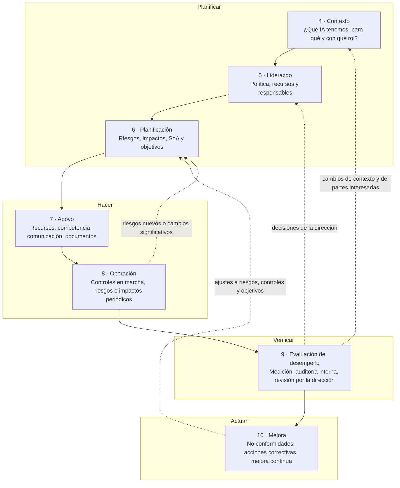

# Las cláusulas 4 a 10

:material-file-document-check-outline: Requisito certificable
:material-cloud-download-outline: Usa IA de terceros
:material-code-braces: Desarrolla IA
:material-handshake-outline: Provee IA a clientes
:material-clock-outline: 9 min de lectura

!!! abstract "En una frase"
    Las cláusulas 4 a 10 describen el sistema de gestión que tu organización tiene que tener funcionando para gobernar la IA que usa, desarrolla o provee; son la parte que el auditor revisa completa, sin importar tu tamaño ni tu rol.

## Qué son las cláusulas con requisitos

ISO/IEC 42001 tiene diez cláusulas y cuatro anexos, y no todas sus partes pesan lo mismo: las tres primeras cláusulas preparan el terreno, de la 4 a la 10 están las obligaciones del sistema de gestión y los anexos aportan controles, guía y contexto.

| Parte de la norma | Qué contiene | ¿Cómo la trata el auditor? |
|---|---|---|
| Cláusulas 1 a 3 | Objeto y campo de aplicación, referencias normativas y términos. ISO/IEC 22989 es referencia normativa, así que sus definiciones de IA, de ciclo de vida y de roles cuentan para interpretar la norma. | No contienen requisitos, pero el auditor usa su vocabulario para leer todo lo demás. |
| **Cláusulas 4 a 10** | Lo que el SGIA tiene que cumplir: contexto, liderazgo, planificación, apoyo, operación, evaluación del desempeño y mejora. | **Las audita todas.** En nuestra lectura, y como ocurre en ISO 27001, no hay forma de declarar conformidad dejando fuera alguna de ellas. |
| Anexo A (normativo) | 38 controles de referencia agrupados en nueve temas, de A.2 a A.10. | Los revisa a través de tu Declaración de Aplicabilidad (*Statement of Applicability*, SoA): incluyes los que tus riesgos piden y justificas los que excluyes. Puedes añadir controles propios. |
| Anexo B (normativo) | Guía de implementación para cada control del Anexo A. | Aunque está marcado como normativo, funciona como orientación: no tienes que justificar en la SoA si sigues o no cada recomendación, y puedes adaptarla. |
| Anexo C (informativo) | Ejemplos de objetivos organizacionales y de fuentes de riesgo propios de la IA. | No se audita como tal; es un insumo muy útil para [6.1](c6-planificacion.md#c-6-1) y [6.2](c6-planificacion.md#c-6-2). |
| Anexo D (informativo) | Uso del SGIA en distintos sectores e integración con otras normas de gestión. | No se audita. |

Encontrarás más detalle de los anexos en [Anexo A](../anexo-a/index.md) y en [Anexos B, C y D](../anexos-b-c-d.md).

!!! tip "El orden de las cláusulas no es el orden de implementación"
    La propia norma aclara que la secuencia en que presenta los requisitos no indica ni su importancia ni el orden en que debes implementarlos. En la práctica casi todas las organizaciones arrancan por el contexto y el inventario de sistemas de IA (cláusula 4), pero avanzan en paralelo con la política (5.2) y la metodología de riesgos (6.1). La [hoja de ruta](../implementacion/hoja-de-ruta.md) propone una secuencia realista.

## La estructura armonizada: el mismo esqueleto que ISO 27001 e ISO 9001

ISO/IEC 42001 está escrita sobre la **estructura armonizada** (*harmonized structure*), la plantilla común que ISO usa para sus normas de sistemas de gestión. Quizá la conozcas como "Anexo SL" (el anexo de las directivas de ISO que la contiene) o por su nombre anterior, "estructura de alto nivel". Esto significa que la numeración, los títulos de las cláusulas y buena parte del texto base son los mismos que en ISO/IEC 27001:2022, ISO 9001, ISO 14001 o ISO 22301.

¿Qué ganas con eso?

- **Si ya tienes ISO 27001 o ISO 9001**, una parte importante del SGIA ya existe: control de documentos, auditoría interna, revisión por la dirección, acciones correctivas, gestión de competencias. No tienes que construirla de nuevo, sino extenderla. La página [Integración con ISO 27001](../integracion/con-iso27001.md) lo explica en detalle.
- **Si es tu primer sistema de gestión**, aprender la estructura una vez te sirve para cualquier otra norma que adoptes después.
- **En la auditoría**, la estructura común permite auditorías combinadas, con ahorro de días.

Sobre ese esqueleto común, ISO/IEC 42001 agrega lo que es propio de la IA: el propósito previsto de los sistemas y los roles de la organización (4.1), criterios de riesgo de IA (6.1.1), una evaluación de riesgos que mira consecuencias para individuos y sociedades (6.1.2), una evaluación de impacto de los sistemas de IA sobre personas y sociedades (6.1.4 y 8.4) y la ejecución periódica de riesgos e impactos en la operación (8.2 a 8.4). Ahí está el verdadero trabajo nuevo.

## Cómo se encadenan las cláusulas

Las siete cláusulas no son una lista de pendientes independientes: forman un ciclo. Lo que descubres en el contexto alimenta la planificación; lo que mides en la evaluación regresa a la dirección y a la mejora, y la mejora vuelve a tocar el contexto y los riesgos. Una lectura habitual las agrupa en las fases del ciclo PHVA (Planificar, Hacer, Verificar, Actuar), con el liderazgo como eje que atraviesa todo.

Las flechas punteadas son la retroalimentación que convierte un conjunto de documentos en un sistema vivo. Si un chatbot empieza a dar respuestas erróneas (operación), el incidente se analiza (mejora), obliga a reevaluar el riesgo (planificación) y puede terminar en un cambio de política o de alcance que revisa la dirección.

Si prefieres verlo como imagen, la página [¿Qué es un SGIA?](../fundamentos/que-es-un-sgia.md) incluye una infografía del ciclo PHVA aplicado a la IA.

## Resumen por cláusula

La siguiente tabla te da una vista rápida. El esfuerzo es una estimación del autor para una organización mediana que parte de cero en gobierno de IA; si ya tienes ISO 27001, réstale bastante a las cláusulas 7, 9 y 10.

| Cláusula | Qué pide, en una línea | Documentos y registros clave | Esfuerzo | Frente a ISO 27001 |
|---|---|---|---|---|
| [4 · Contexto](c4-contexto.md) | Entender tu entorno, tus sistemas de IA, su propósito, tu rol frente a ellos y quién espera algo de ti; con eso, fijar el alcance. | Análisis de contexto, registro de partes interesadas y requisitos, alcance documentado, inventario de sistemas de IA (recomendado). | Medio | Similar, con dos añadidos de peso: propósito previsto y roles. |
| [5 · Liderazgo](c5-liderazgo.md) | Que la alta dirección se haga cargo: política de IA, recursos, integración en el negocio y responsables con autoridad. | Política de IA aprobada, nombramientos o RACI, actas con decisiones de la dirección. | Bajo a medio | Muy similar; el contenido de la política se enriquece con A.2. |
| [6 · Planificación](c6-planificacion.md) | Definir criterios de riesgo de IA, evaluar y tratar riesgos, evaluar impactos en personas y sociedad, producir la SoA y fijar objetivos. | Criterios y metodología de riesgo, matriz de riesgos, plan de tratamiento, SoA, evaluaciones de impacto, objetivos de IA. | Alto | La más distinta: riesgo para individuos y sociedades y evaluación de impacto separada. |
| [7 · Apoyo](c7-apoyo.md) | Asegurar recursos, competencia, toma de conciencia, comunicación e información documentada. | Perfiles y evidencias de competencia, plan de concientización, plan de comunicación, control documental. | Medio | Casi equivalente; los recursos propios de la IA se detallan en A.4. |
| [8 · Operación](c8-operacion.md) | Operar los procesos y controles planificados, y repetir las evaluaciones de riesgo e impacto cuando toca o cuando algo cambia. | Criterios operativos, registros de controles en marcha, resultados periódicos de riesgo e impacto, seguimiento del plan de tratamiento. | Alto | Misma estructura, más exigente: añade 8.4 y pide vigilar la eficacia de los controles. |
| [9 · Evaluación del desempeño](c9-evaluacion-del-desempeno.md) | Medir, auditar internamente y revisar el sistema en la dirección. | Indicadores y resultados, programa e informes de auditoría interna, actas de revisión por la dirección. | Medio | Similar; la lista de entradas de la revisión cambia un poco. |
| [10 · Mejora](c10-mejora.md) | Corregir no conformidades, atacar sus causas y mejorar el sistema de forma continua. | Registro de no conformidades y acciones correctivas, evidencias de eficacia. | Bajo a medio | Equivalente. |

## Las siete cláusulas

-   :material-map-search-outline:{ .lg .middle } **4 · Contexto de la organización**

    ---

    Entorno, propósito previsto de cada sistema, roles según ISO/IEC 22989, partes interesadas, cambio climático y alcance del SGIA.

    [:octicons-arrow-right-24: Ir a la cláusula 4](c4-contexto.md)

-   :material-account-tie-outline:{ .lg .middle } **5 · Liderazgo**

    ---

    Cómo demuestra compromiso la alta dirección, qué lleva la política de IA y quién responde por el sistema.

    [:octicons-arrow-right-24: Ir a la cláusula 5](c5-liderazgo.md)

-   :material-clipboard-list-outline:{ .lg .middle } **6 · Planificación**

    ---

    Criterios de riesgo, evaluación y tratamiento de riesgos de IA, evaluación de impacto, SoA, objetivos y cambios.

    [:octicons-arrow-right-24: Ir a la cláusula 6](c6-planificacion.md)

-   :material-account-group-outline:{ .lg .middle } **7 · Apoyo**

    ---

    Recursos, competencia, toma de conciencia, comunicación e información documentada.

    [:octicons-arrow-right-24: Ir a la cláusula 7](c7-apoyo.md)

-   :material-cog-outline:{ .lg .middle } **8 · Operación**

    ---

    Control operacional y ejecución periódica de las evaluaciones de riesgo y de impacto.

    [:octicons-arrow-right-24: Ir a la cláusula 8](c8-operacion.md)

-   :material-chart-line:{ .lg .middle } **9 · Evaluación del desempeño**

    ---

    Seguimiento y medición, auditoría interna y revisión por la dirección.

    [:octicons-arrow-right-24: Ir a la cláusula 9](c9-evaluacion-del-desempeno.md)

-   :material-autorenew:{ .lg .middle } **10 · Mejora**

    ---

    No conformidades, acciones correctivas y mejora continua del SGIA.

    [:octicons-arrow-right-24: Ir a la cláusula 10](c10-mejora.md)

## Cómo leer una página de cláusula

Todas las páginas de cláusula siguen el mismo formato de doce bloques, para que encuentres lo que buscas sin releer todo:

1. **Encabezado con insignias:** tipo de requisito, roles a los que aplica y tiempo de lectura.
2. **En una frase:** la idea central, para cuando solo tienes un minuto.
3. **Propósito:** qué problema resuelve la cláusula, a veces con una analogía.
4. **Qué pide, explicado:** una subsección por subcláusula, con nuestras palabras, tablas y diagramas. No reproducimos el texto de la norma; para eso necesitas la norma oficial.
5. **Cómo se aplica según tu rol:** pestañas para quien usa IA de terceros, quien la desarrolla y quien la provee a clientes.
6. **Diferencias con ISO 27001:** qué cambia si ya tienes un SGSI.
7. **Preguntas para tu organización:** una lista de verificación para tu diagnóstico.
8. **Qué evidencia espera ver un auditor:** evidencias, ejemplos y señales de alerta.
9. **Errores comunes:** lo que vemos fallar una y otra vez.
10. **Ejemplo resuelto:** una de las tres empresas ficticias de la guía (Contadores Alameda, Monarca Crédito o Conversa Labs) resolviendo la cláusula paso a paso.
11. **Relación con otras cláusulas, controles y normas:** enlaces para seguir el hilo.
12. **Plantillas relacionadas:** las plantillas que te ayudan a producir la evidencia.

!!! note "Cómo leer las palabras de obligación"
    En esta guía usamos "debe" solo cuando describimos lo que pide la norma. Cuando la recomendación es nuestra, decimos "conviene" o "te recomendamos". Y cuando una interpretación es discutible, lo señalamos con frases como "en nuestra lectura" o "algunos organismos de certificación".

!!! info "Un término que verás en todas las páginas: información documentada"
    La norma no habla de "documentos" y "registros", sino de **información documentada** (*documented information*). Cuando pide *mantenerla*, piensa en un documento vivo que se actualiza (una política, un procedimiento, el alcance). Cuando pide *conservarla*, piensa en un registro que prueba que algo ocurrió (el resultado de una evaluación de riesgos, un acta). La página [Documentación requerida](../implementacion/documentacion-requerida.md) reúne todos los casos.

## Por dónde empezar

Si es tu primera vez con la norma, lee las cláusulas en orden: la 4 y la 5 tienen pocos requisitos y te dan el marco para entender la 6, que es la más densa. Si vienes de ISO 27001, puedes ir directo a la 4 (por los roles), la 6 y la 8, y revisar las demás solo en sus diferencias. Si tu perfil es directivo, empieza por la [cláusula 5](c5-liderazgo.md) y la [revisión por la dirección](c9-evaluacion-del-desempeno.md#c-9-3).

También puedes seguir una de las [rutas de lectura](../empieza-aqui/rutas-de-lectura.md): la [ruta GRC](../empieza-aqui/rutas-de-lectura.md#ruta-grc), la [ruta de datos](../empieza-aqui/rutas-de-lectura.md#ruta-datos), la [ruta directiva](../empieza-aqui/rutas-de-lectura.md#ruta-directivo) o la [ruta del auditor](../empieza-aqui/rutas-de-lectura.md#ruta-auditor).
