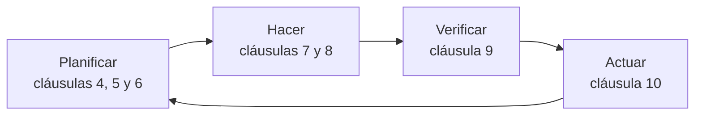

# ISO 42001 en 5 minutos

:material-compass-outline: Introducción
:material-cloud-download-outline: Usa IA de terceros
:material-code-braces: Desarrolla IA
:material-handshake-outline: Provee IA a clientes
:material-clock-outline: 6 min de lectura

!!! abstract "En una frase"
    ISO/IEC 42001:2023 explica cómo montar un sistema de gestión para gobernar la inteligencia artificial que tu organización usa, desarrolla u ofrece: quién decide, cómo se evalúan riesgos e impactos, qué controles se aplican y cómo se corrige el rumbo. Además, un tercero independiente puede certificarlo.

## Qué es y para qué sirve

ISO/IEC 42001 es una norma de **sistema de gestión**, de la misma familia que ISO 9001 (calidad) o ISO 27001 (seguridad de la información). No revisa un modelo de IA en particular: revisa la manera en que tu organización toma decisiones, asigna responsables, controla y mejora todo lo que tiene que ver con la IA. Al conjunto de políticas, procesos, roles y controles que resulta se le llama sistema de gestión de IA (SGIA; en inglés, *AI management system*).

!!! tip "Analogía"
    Una cocina con buenas prácticas de higiene no garantiza que cada platillo quede delicioso, pero sí que hay reglas claras, alguien a cargo, revisiones periódicas y una forma de reaccionar cuando algo sale mal. ISO 42001 hace eso con la IA: no promete que tu modelo nunca se equivoque, sino que gestionas de forma sistemática lo que puede fallar.

Tres rasgos la definen:

- **Es certificable.** Un organismo de certificación (OC) puede auditar tu SGIA contra los requisitos de las cláusulas 4 a 10 y contra los controles que declaraste aplicables, y emitir un certificado sujeto a auditorías de seguimiento. Los detalles están en [Cómo se certifica](../auditoria/como-se-certifica.md).
- **Sirve para cualquier organización que tenga IA en juego**: la que la usa (un despacho contable con un chatbot contratado), la que la desarrolla (una fintech con su propio modelo de *scoring*) y la que la ofrece a otros (una empresa que vende asistentes virtuales). El tamaño, el sector o si eres pública o privada no te dejan fuera.
- **Es voluntaria.** Como cualquier norma ISO, se vuelve exigible cuando un cliente, un contrato o una licitación la piden.

## Cómo está organizada

| Parte | Qué contiene | ¿Cuenta para la certificación? |
|---|---|---|
| Cláusulas 1 a 3 | Alcance, referencias normativas y términos. ISO/IEC 22989 (conceptos y terminología de IA) es referencia normativa: sus definiciones se usan como parte de la norma. | No tienen requisitos que auditar. |
| Cláusulas 4 a 10 | Los requisitos del sistema de gestión, con la misma estructura armonizada de ISO 27001, ISO 9001 y otras. | Sí, todos. |
| Anexo A (normativo) | 38 controles de referencia agrupados en 9 objetivos, de A.2 a A.10. | Sí, a través de tu Declaración de Aplicabilidad. |
| Anexo B (normativo) | Guía de implementación para cada control del Anexo A. | Es normativo, pero flexible: no tienes que justificar si sigues cada recomendación y puedes adaptarla. |
| Anexo C (informativo) | Ejemplos de objetivos para la IA (equidad, privacidad, transparencia, robustez…) y de fuentes de riesgo. | No; sirve de inspiración. |
| Anexo D (informativo) | Uso del SGIA en distintos sectores e integración con otras normas de sistemas de gestión. | No. |

Los nueve objetivos del Anexo A, con el color que los identifica en toda la guía (los nombres son traducción libre de referencia):

A.2 · Políticas
A.3 · Organización interna
A.4 · Recursos
A.5 · Evaluación de impactos
A.6 · Ciclo de vida
A.7 · Datos
A.8 · Información
A.9 · Uso de la IA
A.10 · Terceros y clientes

### La norma en una línea por cláusula

| Cláusula | En una línea | El toque de IA |
|---|---|---|
| [4 · Contexto](../clausulas/c4-contexto.md) | Entiende tu entorno, a quién le importa tu IA y hasta dónde llega el SGIA. | Decidir qué papel juegas frente a cada sistema y para qué está pensado. |
| [5 · Liderazgo](../clausulas/c5-liderazgo.md) | La alta dirección se compromete, aprueba una política de IA y nombra responsables. | Una política propia de IA, conectada con las demás. |
| [6 · Planificación](../clausulas/c6-planificacion.md) | Criterios de riesgo, evaluación y tratamiento de riesgos, objetivos y cambios planificados. | Evaluar el impacto de cada sistema de IA y considerar riesgos para personas y sociedad. |
| [7 · Apoyo](../clausulas/c7-apoyo.md) | Recursos, competencias, conciencia, comunicación y control de documentos. | Equipos multidisciplinarios: datos, negocio, legal y ética. |
| [8 · Operación](../clausulas/c8-operacion.md) | Haz lo que planeaste y repite las evaluaciones cuando toque o cuando algo cambie. | Un modelo nuevo del proveedor o un cambio de uso obligan a reevaluar. |
| [9 · Evaluación del desempeño](../clausulas/c9-evaluacion-del-desempeno.md) | Mide, audita por dentro y revisa resultados con la dirección. | Conviene medir también cómo se comportan los sistemas: errores, quejas, deriva. |
| [10 · Mejora](../clausulas/c10-mejora.md) | Corrige no conformidades, ataca sus causas y mejora de forma continua. | Un sesgo detectado o una respuesta inventada con consecuencias pueden detonar acciones correctivas. |

## Cinco ideas que lo explican casi todo

1. **Tu rol importa.** La cláusula 4 te pide determinar qué papel juegas frente a cada sistema de IA, tomando como referencia los roles de ISO/IEC 22989: proveedor, productor, cliente (que incluye al usuario), socio, sujeto de IA y autoridades. Una misma empresa puede tener varios: Conversa Labs desarrolla su orquestación, vende su plataforma y, a la vez, es cliente de un proveedor de modelos. Más en [Roles en la IA](../fundamentos/roles-en-la-ia.md).
2. **Riesgo e impacto no son lo mismo.** La evaluación de riesgos ([6.1.2](../clausulas/c6-planificacion.md#c-6-1-2)) mira qué puede impedir que logres tus objetivos y considera consecuencias para la organización, para las personas y para la sociedad. La evaluación de impacto de cada sistema de IA (*AI system impact assessment*, [6.1.4](../clausulas/c6-planificacion.md#c-6-1-4)) mira hacia afuera, a quienes el sistema puede afectar, y sus resultados alimentan la de riesgos. Más en [Riesgo frente a impacto](../fundamentos/riesgo-vs-impacto.md).
3. **La Declaración de Aplicabilidad es el puente.** Después de decidir cómo tratar tus riesgos, comparas los controles que necesitas contra los 38 del Anexo A y documentas cuáles aplican y por qué excluyes los demás en la Declaración de Aplicabilidad (*Statement of Applicability*, SoA). No estás obligado a implementar los 38.
4. **Todo gira en un ciclo PHVA.** Planificas (cláusulas 4 a 6), haces (7 y 8), verificas (9) y actúas para mejorar (10). Luego, vuelta a empezar.
5. **Se integra con ISO 27001.** Comparten estructura, así que la auditoría interna, la revisión por la dirección, el control de documentos y las acciones correctivas pueden ser los mismos. Lo nuevo es lo propio de la IA: impacto, ciclo de vida, datos, transparencia y roles. Más en [Integración con ISO 27001](../integracion/con-iso27001.md).

## Lo que ISO 42001 no es

!!! failure "Cuatro malentendidos que conviene desactivar desde el principio"
    - **No es una certificación de producto.** El certificado dice que tu sistema de gestión cumple con la norma; no dice que un modelo sea seguro, preciso o justo.
    - **No sustituye a la ley.** Ni el [Reglamento de IA de la UE](../integracion/reglamento-ia-ue.md) ni las leyes de protección de datos personales se cumplen por tener el certificado, aunque el SGIA te ayuda a ordenar la evidencia que esas leyes piden.
    - **No es una lista de verificación técnica.** No fija métricas de equidad, umbrales de precisión ni herramientas: te pide definir tus propios criterios y demostrar que los aplicas.
    - **No es un asunto exclusivo de TI.** La dirección, el área legal, el negocio y quienes atienden a clientes tienen decisiones que tomar.

## Sigue leyendo

-   :material-sign-direction:{ .lg .middle } **¿Necesito ISO 42001?**

    ---

    Un árbol de decisión para saber si te conviene certificarte, alinearte sin certificar o empezar con algo más ligero.

    [:octicons-arrow-right-24: Decidir](necesito-iso42001.md)

-   :material-head-question-outline:{ .lg .middle } **Mitos y realidades**

    ---

    Quince ideas equivocadas que se repiten en juntas y seminarios en línea, con su matiz correcto.

    [:octicons-arrow-right-24: Ver los mitos](mitos-y-realidades.md)

-   :material-map-marker-path:{ .lg .middle } **Rutas de lectura**

    ---

    Recorridos según tu perfil: GRC, datos e IA, dirección, auditoría o estudiante.

    [:octicons-arrow-right-24: Elegir mi ruta](rutas-de-lectura.md)

-   :material-book-open-page-variant-outline:{ .lg .middle } **¿Qué es un SGIA?**

    ---

    El concepto de sistema de gestión aplicado a la IA, con calma y con ejemplos.

    [:octicons-arrow-right-24: Ir a Fundamentos](../fundamentos/que-es-un-sgia.md)

## ¿Y ahora qué?

1. **Mide dónde estás.** El [autodiagnóstico](../herramientas/autodiagnostico.md) te da una foto rápida de tu preparación.
2. **Haz una lista de tu IA.** Anota cada sistema que ya usas, incluidas las funciones de IA escondidas en herramientas que ya pagas. La [plantilla de inventario](../plantillas/index.md#inventario-sistemas-ia) te ayuda.
3. **Elige tu recorrido.** Ve a las [rutas de lectura](rutas-de-lectura.md) y sigue la de tu perfil.
