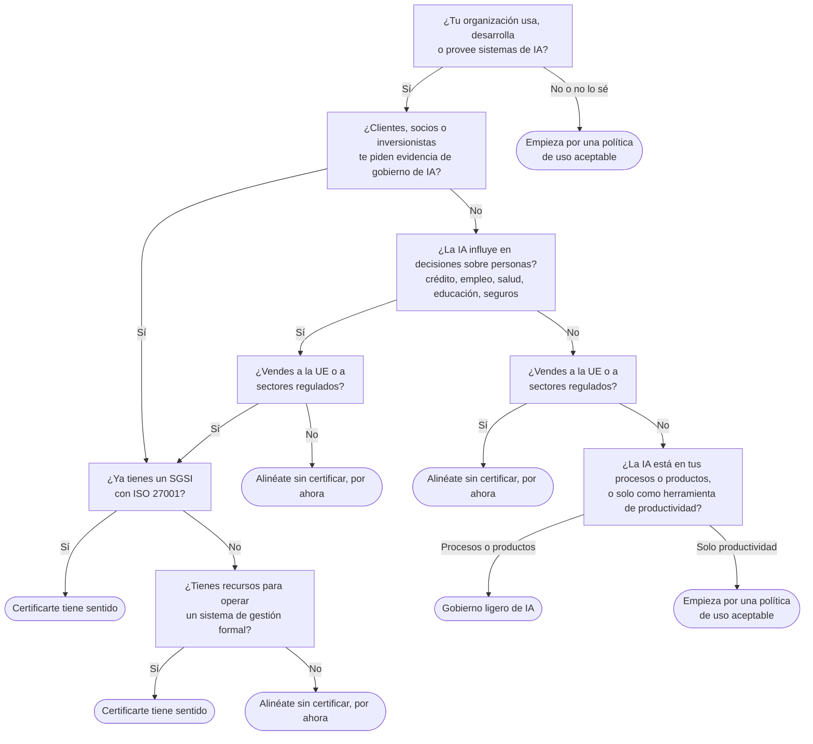

# ¿Necesito ISO 42001?

:material-sign-direction: Árbol de decisión
:material-cloud-download-outline: Usa IA de terceros
:material-code-braces: Desarrolla IA
:material-handshake-outline: Provee IA a clientes
:material-clock-outline: 11 min de lectura

!!! abstract "En una frase"
    Casi cualquier organización que usa IA necesita algo de gobierno; la pregunta útil no es si ISO 42001 "te aplica", sino cuánto de ella te conviene adoptar hoy y si vale la pena pasar por una certificación.

ISO 42001 es voluntaria y está pensada para organizaciones de cualquier tamaño. Eso no significa que todas deban certificarse mañana. Hay empresas para las que el certificado abre puertas, otras que ganan más adoptando el marco sin auditoría externa y otras que, por ahora, solo necesitan reglas claras para que su gente use bien las herramientas de IA generativa.

El árbol que sigue es una **heurística del autor**, no un dictamen. Si dudas entre dos ramas, toma la más prudente y revisa tu respuesta cada vez que cambie tu uso de la IA o lo que te piden tus clientes.

## El árbol de decisión

??? note "Descripción textual del árbol"
    1. **¿Usas, desarrollas o provees IA?** Si no, o si no lo sabes, empieza por una política de uso aceptable y un inventario rápido: la IA suele llegar escondida dentro de herramientas que ya pagas.
    2. **¿Clientes, socios o inversionistas te piden evidencia de gobierno de IA?** Si te la piden, pasa directo a la pregunta sobre ISO 27001 (paso 5).
    3. **Si nadie te la pide: ¿la IA influye en decisiones sobre personas**, como crédito, empleo, salud, educación o seguros? Si influye y además vendes a la Unión Europea o a sectores regulados, pasa a la pregunta sobre ISO 27001. Si influye pero no tienes ninguna de esas presiones, alinéate sin certificar por ahora.
    4. **Si no influye en decisiones sobre personas:** cuando vendes a la UE o a sectores regulados, alinéate sin certificar. Si tampoco es el caso, depende de dónde está la IA: dentro de procesos o productos te conviene un gobierno ligero; solo como herramienta de productividad, una política de uso aceptable.
    5. **¿Ya tienes un SGSI con ISO 27001?** Si lo tienes, certificarte tiene sentido. Si no, depende de si cuentas con recursos para operar un sistema de gestión formal: con recursos, certificarte tiene sentido; sin ellos, alinéate sin certificar por ahora.

## Los cuatro resultados, explicados

### Certificarte tiene sentido {#certificarte}

Implementas el SGIA completo (cláusulas 4 a 10 y una Declaración de Aplicabilidad con los controles que necesitas) sobre un alcance bien definido y te sometes a la auditoría de un organismo de certificación. Es la opción con más esfuerzo y la que más pesa ante terceros.

- **Monarca Crédito** decide de forma automática si aprueba o rechaza microcréditos con su modelo Score Monarca v3, y deja una banda gris para revisión humana. Sus decisiones afectan a cientos de miles de solicitantes, opera en un sector regulado y quiere respaldar una ronda de inversión y alianzas con bancos. Para ella, el certificado es una pieza de negocio.
- **Conversa Labs** vende asistentes virtuales con IA generativa a aseguradoras, universidades y comercios, y tiene un cliente en España. Cada venta trae un cuestionario de seguridad y de IA. El certificado no la exime de contestarlos, pero convierte muchas respuestas en "aquí está la evidencia auditada".

**Primer paso:** define el alcance y arma el inventario de sistemas; después sigue la [hoja de ruta](../implementacion/hoja-de-ruta.md).

### Alinéate sin certificar, por ahora {#alinearte}

Adoptas la lógica del SGIA (política, roles, inventario, evaluaciones de riesgo e impacto, controles clave, auditoría interna) sin contratar todavía la auditoría externa. Dejas la puerta abierta para certificarte cuando la presión del mercado o tu madurez lo justifiquen.

**Contadores Alameda** es un buen ejemplo. Es un despacho de 58 personas que solo usa IA de terceros, pero un banco cliente le envió un cuestionario sobre gobierno de IA. Si, como suponemos aquí, no tiene un SGSI certificado y sus recursos son limitados, en nuestra lectura su ruta razonable es implementar el SGIA con un alcance acotado (el uso de IA de terceros en sus servicios contables, de nómina y de atención desde la oficina de Querétaro), responder el cuestionario con evidencia real (política, inventario, evaluación de su proveedor BotNorte, registros de capacitación) y decidir sobre la certificación después de completar un primer ciclo con auditoría interna y revisión por la dirección.

!!! warning "Cuida cómo lo comunicas"
    Decir "seguimos las prácticas de ISO 42001" es honesto. Decir "cumplimos con ISO 42001" sin una evaluación independiente crea expectativas que quizá no puedas respaldar ante un cliente o un auditor.

### Gobierno ligero de IA {#gobierno-ligero}

Tienes IA dentro de procesos o productos, pero no decide sobre personas y nadie te pide evidencia formal. Te conviene un juego mínimo de piezas: inventario, un responsable por sistema, una política de IA breve, una revisión sencilla de riesgos antes de adoptar cada herramienta, una evaluación básica de proveedores y un canal para reportar problemas.

Piensa en una distribuidora de refacciones que usa un modelo de pronóstico de demanda dentro de su ERP y un chatbot de WhatsApp para cotizaciones. Con las [plantillas](../plantillas/index.md) de esta guía puede armar su gobierno ligero con su propio personal, sin crear un área nueva.

**Cuándo subir de nivel:** el día que la IA empiece a calificar, priorizar o rechazar a personas, o que un cliente importante pregunte cómo gobiernas tu IA.

### Empieza por una política de uso aceptable {#uso-aceptable}

Si no sabes qué IA se usa en tu organización, o solo se usan asistentes de IA generativa para redactar y resumir, el primer entregable es una política de uso aceptable de IA generativa: herramientas aprobadas, datos que nunca se pegan en un chatbot (datos personales, información fiscal de clientes, secretos comerciales), revisión humana de lo que produce la IA y a quién avisar cuando algo sale mal. Acompáñala de una capacitación corta y del inventario.

Este resultado no es exclusivo de quien está empezando. En Contadores Alameda, un colaborador pegó una nómina con datos personales en un chatbot gratuito: IA en la sombra (*shadow AI*). Aunque el despacho vaya rumbo a un SGIA completo, esta política es su primera tarea. Encuéntrala en las [plantillas](../plantillas/index.md#uso-aceptable-ia-generativa).

## Beneficios reales (y los que no lo son)

!!! success "Lo que sí puedes esperar"
    - Responder cuestionarios de clientes, bancos y socios con evidencia, no con promesas.
    - Saber dónde está tu IA y quién responde por cada sistema.
    - Decisiones más defendibles: si un cliente o la Condusef preguntan por qué se rechazó una solicitud, hay un rastro.
    - Detectar problemas en la evaluación de impacto antes de que lleguen a tus clientes.
    - Una base ordenada para cumplir las leyes que ya aplican y las que vengan.
    - Si ya tienes ISO 27001, un sistema integrado en lugar de dos paralelos.

!!! failure "Lo que no deberías esperar"
    - Cumplimiento legal automático.
    - Que tus modelos sean justos o precisos solo por tener el certificado.
    - Ventas inmediatas: el certificado habilita conversaciones, no las cierra.
    - Que tu proveedor de IA quede cubierto por tu certificado, ni tú por el suyo.

## Costos y esfuerzo

No damos cifras de precios: los honorarios de certificación y de consultoría varían mucho según el país, el alcance y el número de sistemas. Pide varias cotizaciones y compáralas con el mismo alcance. Lo que sí podemos decirte es dónde se va el esfuerzo:

| Rubro | Qué implica | Qué lo hace crecer |
|---|---|---|
| Tiempo de tu gente | Dirección, responsable del SGIA, dueños de cada sistema, legal y datos personales. Suele ser el costo más grande. | Muchos sistemas en el alcance y muchas áreas involucradas. |
| Documentación | Política, inventario, metodología de riesgos, evaluaciones de impacto, SoA, procedimientos y registros. | No tener ningún sistema de gestión previo. |
| Cambios técnicos | Registro de eventos, monitoreo, pruebas, trazabilidad de datos y de versiones. | Desarrollar o proveer IA. |
| Capacitación | Conciencia para todos y competencias específicas para quien opera la IA. | Rotación alta y muchos usuarios de IA. |
| Auditoría interna | Auditores independientes y con conocimiento suficiente de IA. | No tener auditores internos con ese perfil. |
| Certificación | Auditoría inicial en dos etapas, auditorías de seguimiento y recertificación. | Alcance amplio, varias sedes, muchos sistemas. |
| Apoyo externo (opcional) | Diagnóstico de brechas, acompañamiento, capacitación. | Poca madurez de partida. |

El esfuerzo cambia mucho según tu rol. Elige la pestaña que te describe:

=== "Si usas IA de terceros"

    El esfuerzo se concentra en gobierno, proveedores, uso responsable e información a quienes atiendes. En nuestra clasificación, unos 24 de los 38 controles suelen pesar para este perfil; los de desarrollo del ciclo de vida y de datos de entrenamiento pesan mucho menos. En nuestra estimación, Contadores Alameda puede operar su SGIA con su Gerente de TI como responsable a tiempo parcial y un pequeño comité.

=== "Si desarrollas IA"

    Es el perfil más exigente: prácticamente todos los controles te tocan (37 de 38 en nuestra clasificación) y hay trabajo técnico real en validación, monitoreo de deriva (*drift*), pruebas de sesgo y trazabilidad de datos. Monarca Crédito parte con ventaja porque ya tiene un Comité de Modelos que revisa y aprueba sus modelos.

=== "Si provees IA a clientes"

    Casi todos los controles suelen pesar (35 de 38 en nuestra clasificación), con énfasis en la documentación para clientes, la responsabilidad compartida, la comunicación de incidentes y las pruebas antes de cada liberación. Conversa Labs, además, tiene que coordinarse con su proveedor de modelo fundacional y con cada cliente.

Lo que reduce el esfuerzo: tener un SGSI con ISO 27001 o un programa de privacidad maduro, un inventario de sistemas al día, un alcance acotado y prácticas de gestión de riesgo de modelos que ya funcionen.

## Señales de que te conviene, y de que todavía no

!!! success "Señales de que te conviene"
    - Te llegan cuestionarios sobre IA en compras, renovaciones o licitaciones.
    - Tu IA aprueba, rechaza, prioriza o califica a personas.
    - Vendes a clientes en la Unión Europea o a sectores regulados: banca, seguros, salud, educación, gobierno.
    - Ya tienes ISO 27001 y los mismos clientes empiezan a preguntar por IA.
    - Inversionistas o socios piden una revisión del gobierno de tu IA.
    - Tienes más de un puñado de sistemas de IA y nadie sabe bien cuántos son.

!!! warning "Señales de que todavía no"
    - No sabes qué sistemas de IA usas: empieza por el inventario.
    - La dirección no quiere dedicar tiempo ni tomar decisiones sobre riesgos.
    - Buscas el certificado solo como sello para tu sitio web, sin operar el sistema.
    - Tu estrategia de IA va a cambiar por completo en los próximos meses.
    - No hay nadie que pueda dedicarle horas de forma continua.

## ¿Y la regulación?

!!! legal "Esta página no da fechas a propósito"
    Las leyes y sus plazos cambian. Para conocer obligaciones y calendarios, consulta [Reglamento de IA de la UE](../integracion/reglamento-ia-ue.md) y [México y Latinoamérica](../integracion/contexto-mexico-latam.md), donde cada dato lleva su fuente y fecha de consulta. Recuerda: la certificación en ISO 42001 no equivale a cumplir una ley, pero un SGIA te ayuda a producir la evidencia que esas leyes suelen pedir, como inventarios, gestión de riesgos, documentación, supervisión humana y transparencia.

!!! latam "En México y Latinoamérica"
    Con o sin una ley específica de IA en tu país, la IA ya está sujeta a reglas vigentes: protección de datos personales (en México, la LFPDPPP, con su aviso de privacidad y derechos ARCO), protección a usuarios de servicios financieros, normas laborales, de consumo y sectoriales. Un SGIA te ayuda a demostrar cómo las respetas cuando la IA entra en tus procesos.

## Tu siguiente paso

-   :material-clipboard-check-outline:{ .lg .middle } **Autodiagnóstico**

    ---

    Contesta unas preguntas y obtén una foto de tu preparación por área.

    [:octicons-arrow-right-24: Hacer el autodiagnóstico](../herramientas/autodiagnostico.md)

-   :material-account-group-outline:{ .lg .middle } **Selector de rol**

    ---

    Responde seis preguntas, identifica tu rol frente a la IA y descubre qué controles pesan más para ti.

    [:octicons-arrow-right-24: Abrir el selector](../herramientas/selector-de-rol.md)

-   :material-routes:{ .lg .middle } **Hoja de ruta**

    ---

    Si ya decidiste avanzar, estas son las fases de una implementación.

    [:octicons-arrow-right-24: Ver la hoja de ruta](../implementacion/hoja-de-ruta.md)

