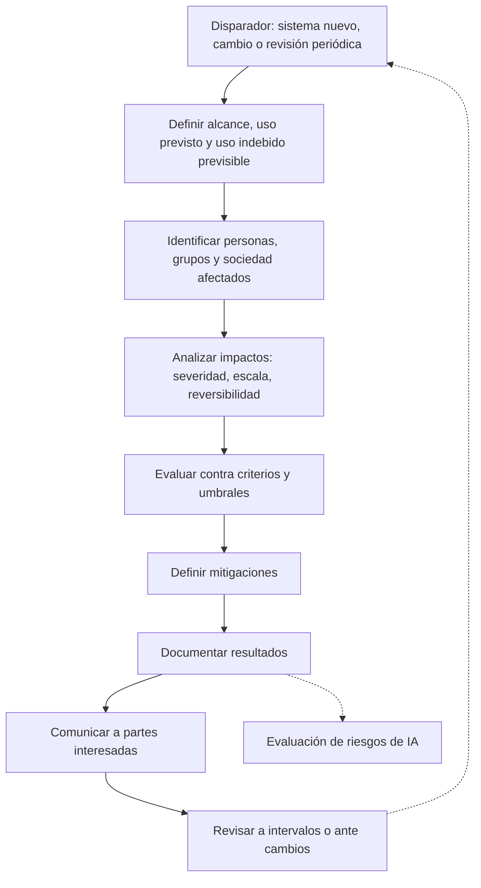

# Riesgo frente a impacto

:material-school-outline: Fundamentos
:material-clock-outline: 15 min de lectura

!!! abstract "En una frase"
    ISO/IEC 42001 pide dos evaluaciones hermanas pero distintas: la **evaluación de riesgos de IA** pone en el centro a la organización y sus objetivos, mientras que la **evaluación de impacto del sistema de IA** pone en el centro a las personas, los grupos y la sociedad que reciben los efectos del sistema; los resultados de la segunda alimentan a la primera.

## Por qué la norma pide dos evaluaciones

Si vienes de ISO 27001, estás acostumbrado a una sola evaluación de riesgos: qué amenazas pueden afectar la confidencialidad, integridad o disponibilidad de la información, y qué tan grave sería para la organización. Ese enfoque funciona bien cuando el daño principal lo sufre la propia empresa.

Con la IA, el daño muchas veces cae **fuera** de la organización. A una persona le niegan un crédito por una variable que no debería pesar; un contribuyente recibe por WhatsApp una fecha de vencimiento equivocada y paga recargos; un estudiante en crisis conversa con un asistente que no sabe canalizarlo. Si solo preguntas "¿qué le pasa a la empresa?", ese daño únicamente aparece en tu matriz cuando se convierte en multa, demanda o escándalo. La evaluación de impacto te obliga a mirar primero a la persona, aunque a la empresa no le pase nada.

!!! tip "Analogía: la obra y la manifestación de impacto ambiental"
    Una constructora que planea un desarrollo en las afueras de Mérida hace dos análisis. El **análisis de riesgos del proyecto** pregunta qué puede descarrilar la obra: sobrecostos, retrasos, permisos, accidentes. La **manifestación de impacto ambiental** pregunta otra cosa: qué le pasará al acuífero, a los cenotes, a la fauna y a los vecinos.

    Son dos documentos con dos protagonistas distintos, pero no viven separados: si la manifestación concluye que el proyecto puede contaminar el acuífero, eso se vuelve un riesgo enorme para el proyecto (negativa de permisos, protestas, rediseño). En ISO 42001 pasa exactamente lo mismo.

## La evaluación de riesgos de IA (6.1.2 · 8.2)

**Quién está en el centro:** la organización y sus objetivos de IA. En el lenguaje ISO, un riesgo es el efecto de la incertidumbre sobre lo que te propones lograr; puede ser negativo (amenaza) o positivo (oportunidad).

**Qué pide la norma, en pocas palabras** ([6.1.2](../clausulas/c6-planificacion.md#c-6-1-2)):

- Un proceso coherente con tu política y tus objetivos de IA, diseñado para que, si lo repites, dé resultados consistentes y comparables. No vale que cada analista califique "a su criterio".
- Identificar los riesgos que favorecen o estorban el logro de tus objetivos de IA.
- Analizarlos: qué consecuencias tendrían **para la organización, para las personas y para la sociedad**, qué tan probable es que ocurran (cuando tenga sentido estimarlo) y qué nivel de riesgo resulta.
- Evaluarlos contra los **criterios de riesgo de IA** que fijaste en [6.1.1](../clausulas/c6-planificacion.md#c-6-1-1) y priorizarlos para su tratamiento.
- Conservar información documentada del proceso.

Fíjate en el segundo punto del análisis: aunque la organización está en el centro, la norma te pide considerar consecuencias para individuos y sociedades. Esa es la gran diferencia frente a ISO 27001, y es justo donde se conecta con la evaluación de impacto.

**Cuándo se hace:** a intervalos planificados y cada vez que se propone o se produce un cambio significativo ([8.2](../clausulas/c8-operacion.md#c-8-2)), por ejemplo, una nueva versión del modelo, un nuevo proveedor o un nuevo uso.

**Quién participa:** el responsable del SGIA coordina; los dueños de cada sistema aportan el conocimiento técnico y de negocio; intervienen seguridad de la información, privacidad, cumplimiento, legal y las áreas de negocio. La **aceptación de los riesgos residuales** y el plan de tratamiento los aprueba la dirección designada ([6.1.3](../clausulas/c6-planificacion.md#c-6-1-3)).

**Qué produce:** un registro o matriz de riesgos de IA priorizado, que alimenta el tratamiento ([6.1.3](../clausulas/c6-planificacion.md#c-6-1-3) y [8.3](../clausulas/c8-operacion.md#c-8-3)): opciones de tratamiento, controles, Declaración de Aplicabilidad, plan de tratamiento y aceptación formal de lo que queda.

## La evaluación de impacto del sistema de IA (6.1.4 · 8.4 · A.5)

**Quién está en el centro:** las personas y los grupos que reciben los efectos del sistema (solicitantes, usuarios, clientes de tus clientes, trabajadores, terceros que nunca usaron el sistema) y la sociedad en su conjunto.

**Qué pide la norma, en pocas palabras** ([6.1.4](../clausulas/c6-planificacion.md#c-6-1-4)):

- Un proceso definido para valorar qué consecuencias puede tener el sistema para personas, grupos y sociedades, derivadas de su desarrollo, de su suministro a otros o de su uso.
- Mirar no solo el **uso previsto**, sino también cómo se despliega y el **uso indebido previsible** (*foreseeable misuse*): lo que alguien podría hacer con el sistema aunque no fuera la intención.
- Tomar en cuenta el contexto técnico y social concreto donde opera el sistema y las jurisdicciones aplicables.
- Documentar el resultado y, cuando corresponda, ponerlo a disposición de las partes interesadas pertinentes.
- **Considerar sus resultados en la evaluación de riesgos.**

Los controles del tema [A.5](../anexo-a/a5-evaluacion-de-impacto.md) aterrizan este requisito: un proceso ([A.5.2](../anexo-a/a5-evaluacion-de-impacto.md#a-5-2)), su documentación y conservación ([A.5.3](../anexo-a/a5-evaluacion-de-impacto.md#a-5-3)), y la valoración de impactos en individuos o grupos ([A.5.4](../anexo-a/a5-evaluacion-de-impacto.md#a-5-4)) y en la sociedad ([A.5.5](../anexo-a/a5-evaluacion-de-impacto.md#a-5-5)). Los nombres de los controles en esta guía son traducción libre de referencia.

**Qué se examina.** La guía del Anexo B sugiere varias áreas; en nuestras palabras, conviene revisar al menos:

- **Oportunidades de vida y situación jurídica:** acceso a crédito, empleo, educación, vivienda, servicios públicos.
- **Trato justo:** si ciertos grupos reciben resultados sistemáticamente peores.
- **Privacidad y seguridad** de las personas y de sus datos.
- **Salud, integridad física y bienestar emocional.**
- **Dinero de las personas:** cobros indebidos, recargos, pérdidas.
- **Transparencia y capacidad de impugnar:** si la persona sabe que hubo IA de por medio y puede pedir una revisión.
- **Accesibilidad:** si el sistema excluye a personas con discapacidad, adultos mayores o con baja alfabetización digital.
- **Efectos colectivos:** medio ambiente, desinformación, mercado laboral, inclusión financiera, confianza en las instituciones.

La norma pone especial atención en grupos con necesidades de protección particulares, como niñas, niños y adolescentes, personas con discapacidad, personas mayores y trabajadores. Y no olvides los **impactos positivos**: también se documentan, porque ayudan a decidir si un sistema vale la pena.

**Cuándo se hace:** a intervalos planificados y cuando se proponen cambios significativos ([8.4](../clausulas/c8-operacion.md#c-8-4)). En la práctica, los disparadores típicos son: un sistema nuevo, un cambio en el propósito o en el contexto de uso, más automatización (por ejemplo, quitar la revisión humana), datos más sensibles o una nueva jurisdicción.

**Quién participa:** un equipo multidisciplinario. Además del dueño del sistema, conviene sumar a privacidad, legal, atención a clientes, alguien con conocimiento del dominio y, para sistemas de alto impacto, la voz de las personas afectadas o de expertos externos.

**Qué produce:** un informe de evaluación de impacto conservado durante un periodo definido, medidas de mitigación, información que después se comunica a usuarios y afectados (tema [A.8](../anexo-a/a8-informacion-partes-interesadas.md)) y un insumo directo para la evaluación de riesgos.

<figure class="dx-infografia">
--8<-- "docs/assets/infografias/riesgo-vs-impacto.svg"
<figcaption>Las dos evaluaciones de ISO/IEC 42001 lado a lado: qué protege cada una, a quién mira, qué produce y dónde está en la norma. Toca un número para ir al requisito.</figcaption>
</figure>

??? note "Descripción textual de la infografía"
    La infografía tiene dos columnas.

    **Evaluación de riesgos de IA** (izquierda): en el centro están la organización y sus objetivos de IA. Protege la capacidad de lograr esos objetivos y de cumplir obligaciones. Considera consecuencias para la organización, las personas y la sociedad, junto con probabilidad y nivel de riesgo. Su pregunta guía es qué puede impedir o ayudar a lograr los objetivos y qué tan grave es. Produce riesgos priorizados que llevan a tratamiento, controles y Declaración de Aplicabilidad. En la norma: 6.1.2 y 8.2.

    **Evaluación de impacto del sistema de IA** (derecha): en el centro están las personas, los grupos y la sociedad. Protege derechos, oportunidades, bienestar y seguridad de quienes reciben los efectos. Considera desarrollo, suministro, uso previsto y uso indebido previsible, en su contexto. Su pregunta guía es a quién puede beneficiar o perjudicar el sistema, de qué forma y cuánto. Produce impactos documentados, mitigaciones y un insumo para evaluar riesgos. En la norma: 6.1.4, 8.4 y el tema A.5 del Anexo A.

    Una flecha va de la columna de impacto a la de riesgos con la leyenda: los resultados del impacto alimentan la evaluación de riesgos.

## Tabla comparativa

| Dimensión | Evaluación de riesgos de IA | Evaluación de impacto del sistema de IA |
|---|---|---|
| Pregunta central | ¿Qué puede afectar el logro de nuestros objetivos de IA? | ¿Qué le puede pasar a quienes reciben los efectos del sistema? |
| Quién está en el centro | La organización | Personas, grupos y sociedad |
| Consecuencias que mira | Para la organización, los individuos y la sociedad | Para individuos, grupos y sociedad (positivas y negativas) |
| Probabilidad | Se estima cuando aplica, para obtener un nivel de riesgo | Puede usarse, pero pesan mucho la severidad, la escala y la reversibilidad |
| Criterios | Criterios de riesgo de IA (6.1.1): aceptable o no | Los mismos criterios, más umbrales de impacto que conviene definir |
| Unidad de análisis | Por sistema, por grupo de sistemas o por proceso | Normalmente por sistema y por uso concreto |
| Cuándo | Intervalos planificados y cambios significativos (8.2) | Intervalos planificados y cambios significativos (8.4) |
| Quién decide | Dirección designada aprueba tratamiento y riesgo residual | Dueño del sistema con equipo multidisciplinario; sus conclusiones suben a riesgos |
| Salida principal | Registro de riesgos, plan de tratamiento, SoA | Informe de impacto, mitigaciones, información para usuarios |
| Requisitos | [6.1.2](../clausulas/c6-planificacion.md#c-6-1-2), [8.2](../clausulas/c8-operacion.md#c-8-2) | [6.1.4](../clausulas/c6-planificacion.md#c-6-1-4), [8.4](../clausulas/c8-operacion.md#c-8-4), [A.5](../anexo-a/a5-evaluacion-de-impacto.md) |
| Norma de apoyo | ISO/IEC 23894 | ISO/IEC 42005 |
| Analogía | Análisis de riesgos del proyecto | Manifestación de impacto ambiental |

## Cómo la de impacto alimenta la de riesgos

La norma lo pide de forma explícita en 6.1.4, y una nota de 6.1.2 sugiere que, al valorar consecuencias, puedes apoyarte en la evaluación de impacto. En la práctica, la conexión funciona en cinco pasos:

1. **Cada impacto relevante entra como consecuencia.** Si el informe de impacto concluye que un grupo de personas puede perder acceso a crédito, eso se convierte en la columna "consecuencias para individuos y sociedad" de uno o varios riesgos.
2. **Las escalas se traducen.** Conviene que tu metodología diga cómo se traduce un impacto "alto" en personas a un nivel de consecuencia en la matriz de riesgos. Sin esa tabla de equivalencias, cada quien lo interpreta distinto y pierdes la comparabilidad que pide 6.1.2.
3. **Las mitigaciones se vuelven opciones de tratamiento.** Lo que el equipo de impacto propone (revisión humana, explicaciones, cambiar una variable) entra al plan de tratamiento y, si es un control, a la Declaración de Aplicabilidad.
4. **Algunos impactos no se negocian.** En nuestra lectura, conviene que tus criterios de riesgo digan expresamente que ciertos impactos graves e irreversibles en personas no son aceptables, por baja que sea su probabilidad. Así evitas que una matriz de probabilidad por consecuencia "diluya" un daño serio.
5. **El flujo también regresa.** Un tratamiento de riesgo puede generar impactos nuevos: pedir más datos para combatir el fraude, por ejemplo, aumenta el impacto en privacidad. Cuando eso pasa, toca volver a la evaluación de impacto.

Así se ve el flujo típico de una evaluación de impacto:

## Ejemplo paralelo: un mismo hallazgo, dos miradas

Monarca Crédito prepara la versión 3 de su modelo **Score Monarca**, que decide automáticamente si aprueba o rechaza microcréditos y manda los casos dudosos a una banda gris de revisión humana. En las pruebas de validación aparece un hallazgo (los números son ficticios, como la empresa):

!!! example "El hallazgo"
    Los solicitantes de ciertos códigos postales rurales del sur del país son rechazados automáticamente **2.3 veces más** que solicitantes urbanos con un historial de pagos similar. El análisis muestra que el código postal está funcionando como **variable sustituta** (*proxy*) del nivel socioeconómico y del origen regional, no del comportamiento de pago.

Veamos cómo se registra el mismo hallazgo en cada evaluación:

=== "Visto como impacto (A.5.4 · A.5.5)"

    - **¿A quién afecta?** A solicitantes de zonas rurales del sur, muchos de ellos dueños de micronegocios, y de forma indirecta a sus familias.
    - **¿Qué les pasa?** Se les niega crédito formal por dónde viven, no por cómo pagan. Algunos terminan recurriendo a prestamistas informales o a aplicaciones de préstamo abusivas, con costos mucho mayores.
    - **¿Pueden defenderse?** Hoy no: el rechazo automático solo dice "no cumples con nuestras políticas" y no hay una vía clara para pedir revisión.
    - **Efecto colectivo:** frena la inclusión financiera en regiones que ya tienen poco acceso a crédito formal.
    - **Severidad:** alta (afecta oportunidades económicas). **Escala:** miles de solicitudes al mes. **Reversibilidad:** parcial.
    - **Mitigaciones propuestas:** retirar el código postal o sustituirlo por variables menos sesgadas; enviar a la banda gris los casos de esas regiones mientras se corrige; dar motivos de rechazo comprensibles; abrir un canal de reconsideración; monitorear la tasa de aprobación por región.

=== "Visto como riesgo (6.1.2 · 8.2)"

    - **Objetivo afectado:** el objetivo de IA de equidad ("la brecha de aprobación entre regiones con perfil de riesgo similar no supera el umbral acordado") y el objetivo de negocio de crecer en mercados desatendidos.
    - **Consecuencias para la organización:** quejas ante la Condusef, posibles señalamientos por discriminación, daño reputacional, observaciones en la debida diligencia de inversionistas y bancos aliados, y pérdida de buenos clientes rechazados por error.
    - **Consecuencias para individuos y sociedad:** las que documentó la evaluación de impacto (se referencian, no se reescriben).
    - **Probabilidad:** casi cierta, porque el efecto ya se observa en validación.
    - **Nivel:** alto; **no aceptable** según los criterios de riesgo de IA.
    - **Tratamiento:** ajustar el modelo y sus criterios de validación ([A.6.2.4](../anexo-a/a6-ciclo-de-vida.md#a-6-2-4)), revisar la calidad y representatividad de los datos ([A.7.4](../anexo-a/a7-datos.md#a-7-4)), reforzar la supervisión humana en la banda gris ([A.9.3](../anexo-a/a9-uso.md#a-9-3)), informar motivos de rechazo ([A.8.2](../anexo-a/a8-informacion-partes-interesadas.md#a-8-2)) y monitorear la equidad en producción ([A.6.2.6](../anexo-a/a6-ciclo-de-vida.md#a-6-2-6)).
    - **Riesgo residual:** tras revalidar, el Director de Riesgos lo presenta al Comité de Modelos para su aceptación formal.

La lección: con una sola evaluación de riesgos "clásica", el modelo habría pasado. Su capacidad para distinguir buenos de malos pagadores era excelente y el registro solo tenía "riesgo de crédito" y "riesgo de modelo". Fue la pregunta "¿a quién le pasa qué?" la que hizo visible el riesgo.

## Relación con la EIPD de privacidad

La **evaluación de impacto en la protección de datos personales** (EIPD, *data protection impact assessment*) es pariente cercana. Ambas miran hacia afuera, hacia las personas. Pero tienen alcances distintos:

| | EIPD (privacidad) | Evaluación de impacto del sistema de IA |
|---|---|---|
| Qué la detona | Un tratamiento de datos personales con riesgo relevante | Un sistema de IA, aunque no trate datos personales |
| Qué protege | Los derechos de los titulares sobre sus datos | Un abanico más amplio: equidad, seguridad, autonomía, dinero, efectos sociales y ambientales |
| Ejemplo que solo cubre una | El análisis del flujo de datos de nómina en un sistema sin IA | El chatbot que da plazos fiscales equivocados sin tratar datos personales |

Te recomendamos **no duplicar**: usa una sola evaluación con módulos, donde la EIPD sea el capítulo de privacidad de la evaluación de impacto de IA (o al revés, según qué proceso esté más maduro en tu organización). La propia guía de la norma invita a revisar si las evaluaciones por disciplina que ya haces cubren lo suficiente los aspectos propios de la IA.

!!! legal "Nota legal"
    Si una EIPD es obligatoria o solo recomendable depende de la legislación aplicable. En la Unión Europea, el RGPD la exige para tratamientos que probablemente impliquen un alto riesgo. En México y el resto de Latinoamérica, revisa la ley de datos personales vigente y su normativa secundaria; lo resumimos en [México y Latinoamérica](../integracion/contexto-mexico-latam.md).

## Relación con la evaluación de riesgos de ISO 27001

Si ya tienes un SGSI, tienes media metodología hecha. La evaluación de riesgos de ISO 27001 se centra en la pérdida de confidencialidad, integridad y disponibilidad de la información; la de ISO 42001 se centra en los objetivos de IA y amplía las consecuencias a personas y sociedad. Conviene:

- **Reutilizar** escalas, herramienta, registro, flujo de aprobación y calendario.
- **Agregar campos:** sistema de IA afectado, objetivo de IA en juego, consecuencias para personas y sociedad, fuente de riesgo (las del Anexo C son buena referencia) y la clave de la evaluación de impacto relacionada.
- **Cuidar el vocabulario:** en muchos SGSI se le dice "impacto" a la columna de consecuencia de la matriz. En un sistema integrado, eso se confunde fácilmente con la evaluación de impacto que pide 6.1.4. Llama a esa columna "consecuencia".

!!! example "Caso: Conversa Labs — un riesgo con dos sombreros"
    La **inyección de instrucciones** (*prompt injection*) contra el asistente Conversa aparece en ambos registros. Como riesgo de seguridad de la información (ISO 27001), preocupa que un atacante extraiga la base de conocimiento confidencial de una aseguradora cliente. Como riesgo de IA (ISO 42001), preocupa además que el asistente dé a los asegurados respuestas dañinas o engañosas, lo que también se documenta como impacto en las personas usuarias finales. Un solo escenario, dos lentes, controles compartidos.

Profundizamos la integración en [Integración con ISO 27001](../integracion/con-iso27001.md).

## Normas de apoyo: ISO/IEC 23894 e ISO/IEC 42005

ISO/IEC 42001 dice *qué* debes hacer, pero no entra en el detalle de *cómo*. Dos normas de la misma familia ayudan:

- **ISO/IEC 23894** es una guía de gestión de riesgos de IA que adapta los principios y el proceso de ISO 31000 al mundo de la IA. El Anexo C de 42001 remite a ella para profundizar en objetivos y fuentes de riesgo.
- **ISO/IEC 42005** está dedicada a la evaluación de impacto de sistemas de IA: cómo organizarla, qué considerar y qué documentar.

Ninguna de las dos es certificable; son guías para hacer mejor lo que 42001 exige. Las ubicamos en el mapa completo en [La familia de normas de IA](familia-de-normas.md).

!!! warning "Errores comunes"
    - **Una sola matriz donde "impacto" es solo una columna.** Eso no cumple con la evaluación de impacto de 6.1.4, y el auditor lo notará.
    - **Hacerla una vez al lanzar el sistema** y nunca volver a ella, aunque cambien el modelo, los datos o el uso.
    - **Que la haga una sola área.** Solo TI ve fallas técnicas; solo legal ve multas. Hace falta el equipo completo.
    - **Mirar únicamente el uso previsto** e ignorar el uso indebido previsible.
    - **Documentar solo lo negativo.** Los beneficios también cuentan para decidir.
    - **Que sus conclusiones no cambien nada.** Si el informe de impacto no deja huella en el registro de riesgos, en el diseño o en la información a usuarios, es un trámite.

## Preguntas para tu organización

- [ ] ¿Tenemos un proceso de evaluación de impacto separado del de riesgos, con su propio formato y responsables?
- [ ] ¿Sabemos quiénes son las personas y grupos afectados por cada sistema de IA, incluso los que nunca lo usan directamente?
- [ ] ¿Nuestra metodología dice cómo se traduce un impacto en personas a un nivel de consecuencia en la matriz de riesgos?
- [ ] ¿Nuestros criterios de riesgo establecen qué impactos en personas no aceptamos bajo ninguna probabilidad?
- [ ] ¿Revisamos las evaluaciones cuando cambia el modelo, los datos, el proveedor o el uso?
- [ ] ¿Podemos mostrar un caso en que una evaluación de impacto cambió una decisión de diseño o de uso?
- [ ] ¿Aprovechamos la EIPD y el análisis de riesgos del SGSI en lugar de duplicar esfuerzos?

## Plantillas relacionadas

- [Metodología y matriz de riesgos de IA](../plantillas/index.md#evaluacion-de-riesgos)
- [Evaluación de impacto del sistema de IA](../plantillas/index.md#evaluacion-de-impacto)
- Para el detalle de cada requisito: [Cláusula 6 · Planificación](../clausulas/c6-planificacion.md), [Cláusula 8 · Operación](../clausulas/c8-operacion.md) y [A.5 · Evaluación de impactos](../anexo-a/a5-evaluacion-de-impacto.md).
- Para ver el caso completo de Monarca Crédito: [Fintech con scoring crediticio](../casos-practicos/fintech-scoring.md).
