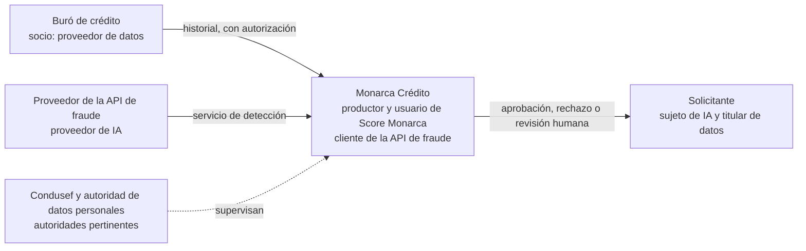

# Roles en la IA

:material-school-outline: Fundamentos
:material-clock-outline: 14 min de lectura

!!! abstract "En una frase"
    Antes de elegir controles, ISO/IEC 42001 te pide contestar, sistema por sistema, una pregunta sencilla: ¿qué papel juego frente a esta IA? ¿La construyo, la ofrezco, la uso, le aporto piezas, me afecta o la regulo? La respuesta cambia buena parte de lo que se espera de ti.

## Por qué la norma pregunta quién eres

Un mismo modelo de lenguaje pasa por muchas manos: alguien lo entrena, otro lo ofrece por API, una tercera empresa lo integra en un chatbot, un despacho lo contrata para atender a sus clientes y, al final, una persona recibe una respuesta que puede costarle una multa. Cada eslabón controla cosas distintas y responde por cosas distintas.

Por eso la cláusula [4.1](../clausulas/c4-contexto.md#c-4-1) te pide determinar tus **roles** frente a los sistemas de IA de tu alcance. Una nota remite a la clasificación de ISO/IEC 22989, la norma de conceptos y terminología de IA (su apartado 5.19 describe a las partes interesadas), menciona que el [NIST AI RMF](../integracion/nist-ai-rmf.md) también describe actores del ciclo de vida y aclara lo esencial: tus roles pueden decidir si un requisito o un control te aplica y con qué profundidad.

ISO/IEC 22989 no es lectura opcional: es la **única referencia normativa** de ISO/IEC 42001 y se cita con fecha, así que aplica su edición de 2022[^ref22989]. Un auditor esperará ese vocabulario o una equivalencia clara con el tuyo.

!!! tip "Analogía: una torre de departamentos en Zapopan"
    La **desarrolladora** vende los departamentos (proveedor); **arquitectos y constructora** diseñan, levantan y prueban (productor); **quien compra** habita sin tirar muros de carga (cliente y usuario); **la empresa de elevadores y la concretera** aportan piezas (socios); **los vecinos** no compraron nada, pero pierden sol y ganan tráfico (sujetos); **el municipio y Protección Civil** dan licencias e inspeccionan (autoridades). Si el edificio se cuartea, se revisa qué le tocaba a cada quien: los roles lo dejan escrito **antes** del problema.

## Los seis roles de un vistazo

<figure class="dx-infografia">
--8<-- "docs/assets/infografias/roles-ia.svg"
<figcaption>Los seis roles de ISO/IEC 22989 alrededor de un sistema de IA y las obligaciones que más pesan en cada rol. Toca un rol para leer su explicación o un tema del Anexo A para ir a sus controles.</figcaption>
</figure>

??? note "Descripción textual de la infografía"
    Al centro, un círculo con la leyenda "Sistema de IA". Alrededor, los seis roles con flechas: el **productor** (arriba a la izquierda) lo construye y opera; el **proveedor** (arriba al centro) lo pone a disposición y entrega el producto o servicio al **cliente** (arriba a la derecha), que lo usa; el **socio** (abajo a la izquierda) lo integra o le aporta datos; al **sujeto** (abajo a la derecha) le afectan sus resultados; y las **autoridades** (abajo al centro) fijan reglas y supervisan, con una línea punteada.

    Una franja inferior, "Cómo cambian las obligaciones", muestra cuatro columnas: cliente, uso responsable (A.9 y A.10.3); productor, ciclo de vida y datos (A.6 y A.7); proveedor, información y clientes (A.8 y A.10.4); socio, reparto de responsabilidades y procedencia de datos (A.10.2 y A.7.5). Una nota indica que sujetos y autoridades no se certifican como rol, pero elevan la exigencia de evaluación de impacto (A.5) y de transparencia (A.8).

¿Quieres ubicarte rápido? El [selector de rol](../herramientas/selector-de-rol.md) te hace seis preguntas y te sugiere roles y controles.

## Cada rol, explicado

### Proveedor de IA (*AI provider*) {#rol-proveedor}

Ofrece a otros productos o servicios que funcionan con uno o más sistemas de IA. Hay dos variantes:

- **Proveedor de plataformas de IA** (*AI platform provider*): da la base sobre la que otros construyen, como modelos fundacionales por API o servicios de entrenamiento en la nube. Su cliente típico es otra empresa que desarrollará encima.
- **Proveedor de productos o servicios de IA** (*AI product or service provider*): entrega algo listo para usarse, como un chatbot de WhatsApp por suscripción o un módulo que captura CFDI.

En nuestro universo, el proveedor del modelo fundacional lo es de plataforma frente a Conversa Labs y BotNorte; BotNorte, de servicio frente a Contadores Alameda; y Conversa Labs, de producto frente a sus clientes. Lo que distingue a este rol: **otros dependen de lo que les cuentas** sobre para qué sirve el sistema y en qué falla.

### Productor de IA (*AI producer*) {#rol-productor}

Diseña, desarrolla, prueba y pone en operación sistemas de IA. Productor y proveedor suelen coincidir, pero no siempre: una aseguradora que construye su propio modelo antifraude es productora sin proveer a nadie. La nota de 4.1 enumera diez subroles; se entienden mejor por función:

| Función | Subroles | Cómo se ve en Monarca Crédito |
|---|---|---|
| Concebir | diseñador, experto del dominio, profesional de factores humanos | Analistas de crédito que saben qué variables tienen sentido; pantalla de la banda gris pensada para que nadie apruebe "en automático" |
| Construir y liberar | desarrollador (*AI developer*), implementador | Ciencia de Datos entrena Score Monarca v3; el equipo de plataforma lo libera |
| Comprobar | probador y evaluador, evaluador de impacto | Validación por alguien que no construyó el modelo; evaluación de impacto sobre solicitantes |
| Operar | operador | Monitoreo de deriva y de tasas de aprobación |
| Adquirir y gobernar | comprador, profesional de gobernanza y supervisión | Compras contrata la API de fraude; el Comité de Modelos aprueba cada versión |

Que el experto del dominio, el evaluador de impacto y el comprador estén aquí dice mucho: desarrollar IA no es tarea solo de ingenieros.

!!! warning "Implementador no es lo mismo que responsable del despliegue"
    El implementador de ISO/IEC 22989 es un subrol técnico del productor: quien instala el sistema y lo pone en producción. El "responsable del despliegue" del Reglamento de IA de la UE es la organización que usa un sistema bajo su propia autoridad, algo mucho más cercano al cliente. Ver [más abajo](#reglamento-ue).

### Cliente de IA (*AI customer*) y usuario de IA (*AI user*) {#rol-cliente}

El **cliente** adquiere o adopta un producto o servicio de IA, para usarlo él mismo o ponerlo en manos de otros; el **usuario** interactúa con el sistema para obtener sus resultados. Contadores Alameda es cliente de su suite de ofimática con IA, y sus 58 colaboradores son los usuarios.

Es el rol más común en Latinoamérica y el más subestimado: "no hacemos IA, solo la usamos". Pero usar IA implica decisiones propias (para qué, con qué datos, quién revisa los resultados, a quién se compra) que el proveedor no toma por ti.

!!! example "El cliente que también despliega"
    Contadores Alameda contrata a Alma como servicio, pero el despacho la pone a conversar con sus ~400 PyMEs cliente y cura las preguntas frecuentes que la alimentan. En nuestra lectura, sigue siendo cliente frente a BotNorte, pero asume tareas extra: avisar que se conversa con una IA ([A.8.2](../anexo-a/a8-informacion-partes-interesadas.md#a-8-2)), mantener al día la base de conocimiento y vigilar que Alma no conteste fuera de su uso previsto ([A.9.4](../anexo-a/a9-uso.md#a-9-4)). Hay quien llamaría a esa curaduría un rol de socio o de productor; lo importante es que tenga dueño.

### Socio de IA (*AI partner*) {#rol-socio}

Presta servicios alrededor de un sistema de IA sin ser quien lo produce, lo ofrece o lo usa:

- **Integrador de sistemas de IA** (*AI system integrator*): conecta componentes de IA con los sistemas de una organización, como la consultora de Bogotá que enlaza un modelo de lenguaje con el CRM de una cadena de farmacias.
- **Proveedor de datos** (*data provider*): suministra datos para entrenar, evaluar u operar la IA de otros, como el buró de crédito que entrega historiales a Monarca con autorización de cada solicitante, o la universidad que carga sus trámites en Conversa.

Lo que aporta se vuelve parte del sistema; por eso pesan el reparto de responsabilidades por escrito ([A.10.2](../anexo-a/a10-terceros.md#a-10-2)) y la procedencia de los datos ([A.7.5](../anexo-a/a7-datos.md#a-7-5)).

### Sujeto de IA (*AI subject*) {#rol-sujeto}

Es quien resulta afectado por un sistema de IA. Se distingue al **titular de los datos** (*data subject*), cuyos datos procesa el sistema, de **otros sujetos** que reciben las consecuencias sin que sus datos pasen por el modelo:

- El solicitante de un microcrédito en la app de Monarca es titular: sus datos alimentan el modelo.
- Los empleados de un micronegocio al que se le negó crédito no están en ningún conjunto de datos, pero pagan las consecuencias.
- La PyME que recibe de Alma una fecha equivocada para declarar y paga recargos es afectada aunque no supiera que hablaba con una IA.

El sujeto no es un rol que una organización elija ni tiene obligaciones en el SGIA de otro. Su peso va en la dirección contraria: es **la razón de ser** de la evaluación de impacto ([6.1.4](../clausulas/c6-planificacion.md#c-6-1-4), [A.5.4](../anexo-a/a5-evaluacion-de-impacto.md#a-5-4)). Si no identificas a tus sujetos, no puedes evaluar cómo los afectas.

### Autoridades pertinentes (*relevant authorities*) {#rol-autoridad}

Son los **formuladores de políticas** (*policy makers*), como un congreso, y los **reguladores** (*regulators*), que vigilan y sancionan en su materia. En México no hay una ley general de IA, pero ya intervienen autoridades sectoriales: la Condusef con usuarios de servicios financieros, el SAT con comprobantes fiscales y, con la nueva LFPDPPP, la Secretaría Anticorrupción y Buen Gobierno en datos personales[^lfpdppp]. El panorama, que cambia rápido, está en [Contexto en México y Latinoamérica](../integracion/contexto-mexico-latam.md).

Sus requisitos entran como partes interesadas ([4.2](../clausulas/c4-contexto.md#c-4-2)) y sus necesidades de información por [A.8.5](../anexo-a/a8-informacion-partes-interesadas.md#a-8-5). Y una autoridad puede tener otros roles: en Perú, el reglamento de la Ley 31814 obliga a las entidades públicas que desarrollan IA a usar la NTP-ISO/IEC 42001:2025[^pe], así que un ministerio puede ser autoridad y productor de su propio chatbot de trámites.

## Varios roles a la vez, y distintos por sistema

Un rol describe la relación entre **tu organización y un sistema concreto**, no a la empresa entera. Puedes ser productor de un sistema y cliente de otro, y ocupar varios roles en el mismo. Así se ve la red alrededor del modelo de Monarca Crédito:

### Los roles de las tres empresas de esta guía

| Empresa y sistema | Rol de la empresa | Otros actores | Perfil en esta guía |
|---|---|---|---|
| **Contadores Alameda** · IA-01 asistente de IA generativa en ofimática | Cliente; sus colaboradores son usuarios | Fabricante de la suite: proveedor y productor | Usa IA de terceros |
| **Contadores Alameda** · IA-02 chatbot Alma | Cliente que despliega frente a sus clientes y cura la base de conocimiento | BotNorte: proveedor de servicio · Proveedor del modelo: proveedor de plataforma frente a BotNorte · PyMEs que escriben: usuarias y sujetos | Usa IA de terceros, con curaduría |
| **Contadores Alameda** · IA-03 captura de CFDI | Cliente y usuario | Proveedor del software contable: proveedor · Personas físicas en las facturas: titulares de datos · SAT: autoridad en comprobantes | Usa IA de terceros |
| **Monarca Crédito** · IA-01 Score Monarca v3 | Productor y usuario | Buró de crédito: socio · Solicitantes: sujetos y titulares · Condusef y autoridad de datos: autoridades | Desarrolla IA |
| **Monarca Crédito** · IA-02 asignación de línea | Productor y usuario | Clientes aprobados: sujetos | Desarrolla IA |
| **Monarca Crédito** · IA-03 API de fraude | Cliente y usuario | Proveedor externo: proveedor y productor · Solicitantes: sujetos | Usa IA de terceros |
| **Conversa Labs** · plataforma Conversa | Proveedor y productor (orquestación, evaluaciones, filtros) | Aseguradoras, universidades y comercios: clientes que despliegan y socios que aportan su base de conocimiento · Usuarios finales: sujetos | Provee y desarrolla IA |
| **Conversa Labs** · modelo fundacional vía API | Cliente | Proveedor fundacional: proveedor de plataforma | Usa IA de terceros |
| **Conversa Labs** · asistente del cliente en España | Proveedor frente a ese cliente | El cliente: cliente de IA y, en el Reglamento de la UE, responsable del despliegue · Sus usuarios: sujetos | Provee IA a clientes |

Tres lecciones: **nadie tiene un solo rol**; **un mismo producto genera configuraciones distintas** (el asistente del cliente español arrastra obligaciones que el de una universidad chilena no tiene); y **los tres perfiles de esta guía simplifican**: *usa IA de terceros* (cliente o usuario), *desarrolla IA* (productor) y *provee IA a clientes* (proveedor). El socio suele caer en alguno de ellos, y sujeto y autoridad no son roles con los que una organización se certifique.

## Cómo cambian las obligaciones según el rol

Las cláusulas 4 a 10 aplican completas a cualquier organización. Lo que cambia es qué controles del Anexo A necesitas y con qué profundidad (lo decide tu evaluación de riesgos y se justifica en la Declaración de Aplicabilidad, [6.1.3](../clausulas/c6-planificacion.md#c-6-1-3)), qué controlas directamente y qué por contrato, y a quién debes informar.

En la clasificación orientativa de esta guía (los nombres de controles son traducción libre de referencia), 21 de los 38 controles aplican a los tres perfiles; 13, casi todo el ciclo de vida técnico y los datos para desarrollo, se asocian a quien desarrolla o provee; los tres de uso responsable ([A.9](../anexo-a/a9-uso.md)), a quien usa sistemas propios o ajenos; y [A.10.4](../anexo-a/a10-terceros.md#a-10-4), solo a quien provee. Puedes filtrarlos en la [matriz del Anexo A](../anexo-a/index.md).

=== "Cliente o usuario"

    :material-cloud-download-outline: Usa IA de terceros

    **Lo central:** decidir con criterio qué IA se usa, para qué, con qué datos y con qué supervisión, y elegir bien al proveedor.

    **Controles que más pesan:** [A.9.2](../anexo-a/a9-uso.md#a-9-2) Procesos para el uso responsable · [A.9.3](../anexo-a/a9-uso.md#a-9-3) Objetivos para el uso responsable · [A.9.4](../anexo-a/a9-uso.md#a-9-4) Uso previsto · [A.10.3](../anexo-a/a10-terceros.md#a-10-3) Proveedores · [A.5.2](../anexo-a/a5-evaluacion-de-impacto.md#a-5-2) Proceso de evaluación de impacto · [A.8.2](../anexo-a/a8-informacion-partes-interesadas.md#a-8-2) Información para usuarios · [A.6.2.6](../anexo-a/a6-ciclo-de-vida.md#a-6-2-6) Operación y monitoreo · [A.2.2](../anexo-a/a2-politicas.md#a-2-2) Política de IA.

    Lo que no controlas (el modelo) lo gestionas con contratos, cuestionarios al proveedor y pruebas propias, como las preguntas de control que Contadores Alameda le hace a Alma cada mes.

=== "Productor"

    :material-code-braces: Desarrolla IA

    **Lo central:** controlar cada etapa del ciclo de vida y los datos, con criterios definidos antes de liberar.

    **Controles que más pesan:** [A.6.1.2](../anexo-a/a6-ciclo-de-vida.md#a-6-1-2) Objetivos para el desarrollo responsable · [A.6.1.3](../anexo-a/a6-ciclo-de-vida.md#a-6-1-3) Procesos de diseño y desarrollo · [A.6.2.4](../anexo-a/a6-ciclo-de-vida.md#a-6-2-4) Verificación y validación · [A.6.2.6](../anexo-a/a6-ciclo-de-vida.md#a-6-2-6) Operación y monitoreo · [A.7.2](../anexo-a/a7-datos.md#a-7-2) Datos para desarrollo y mejora · [A.7.4](../anexo-a/a7-datos.md#a-7-4) Calidad de los datos · [A.7.5](../anexo-a/a7-datos.md#a-7-5) Procedencia de los datos · [A.5.4](../anexo-a/a5-evaluacion-de-impacto.md#a-5-4) Impacto en individuos o grupos.

    Ojo con el **productor accidental**: si ajustas un modelo, diseñas instrucciones de sistema, construyes un flujo de RAG o encadenas agentes, ya produces, aunque el modelo base sea ajeno.

=== "Proveedor"

    :material-handshake-outline: Provee IA a clientes

    **Lo central:** que tus clientes y sus usuarios entiendan qué compran, qué límites tiene y qué les toca a ellos.

    **Controles que más pesan:** [A.10.4](../anexo-a/a10-terceros.md#a-10-4) Clientes · [A.10.2](../anexo-a/a10-terceros.md#a-10-2) Asignación de responsabilidades · [A.8.2](../anexo-a/a8-informacion-partes-interesadas.md#a-8-2) Información para usuarios · [A.8.4](../anexo-a/a8-informacion-partes-interesadas.md#a-8-4) Comunicación de incidentes · [A.8.5](../anexo-a/a8-informacion-partes-interesadas.md#a-8-5) Información para las partes interesadas · [A.6.2.7](../anexo-a/a6-ciclo-de-vida.md#a-6-2-7) Documentación técnica · [A.5.5](../anexo-a/a5-evaluacion-de-impacto.md#a-5-5) Impactos sociales.

    En la práctica: matriz de responsabilidad compartida anexa al contrato, ficha del sistema y plan para avisar incidentes, como los que Conversa Labs entrega a cada aseguradora.

=== "Socio"

    **Lo central:** calidad, procedencia y derechos de uso de lo que entregas, con un reparto de responsabilidades por escrito.

    **Controles que más pesan:** [A.10.2](../anexo-a/a10-terceros.md#a-10-2) Asignación de responsabilidades · [A.10.3](../anexo-a/a10-terceros.md#a-10-3) Proveedores · [A.7.3](../anexo-a/a7-datos.md#a-7-3) Adquisición de datos · [A.7.5](../anexo-a/a7-datos.md#a-7-5) Procedencia de los datos · [A.4.3](../anexo-a/a4-recursos.md#a-4-3) Recursos de datos.

=== "Sujetos y autoridades"

    No son perfiles que se certifiquen, pero cambian la intensidad de lo demás. **Si tus sistemas deciden algo relevante sobre personas** (crédito, empleo, salud, educación, seguros), sube la exigencia de [A.5.4](../anexo-a/a5-evaluacion-de-impacto.md#a-5-4), [A.9.3](../anexo-a/a9-uso.md#a-9-3) (supervisión humana), [A.8.3](../anexo-a/a8-informacion-partes-interesadas.md#a-8-3) (reporte de afectados) y [A.6.2.4](../anexo-a/a6-ciclo-de-vida.md#a-6-2-4) (pruebas de sesgo). **Si eres una autoridad**, ISO/IEC 42001 te orienta sobre qué pedir a tus regulados, y te pesan [A.8.5](../anexo-a/a8-informacion-partes-interesadas.md#a-8-5), [A.5.5](../anexo-a/a5-evaluacion-de-impacto.md#a-5-5) y [A.2.2](../anexo-a/a2-politicas.md#a-2-2).

!!! note "Selección orientativa"
    Las listas de controles que más pesan son una lectura del autor, la misma del [selector de rol](../herramientas/selector-de-rol.md). Que un control no aparezca en tu lista no te permite excluirlo sin más: toda exclusión se justifica en la Declaración de Aplicabilidad.

!!! auditor "Lo que mira el auditor"
    - **Coherencia entre roles y Declaración de Aplicabilidad.** Si dices que solo usas IA de terceros, pero tu equipo configura RAG o ajusta modelos, esperará ver [A.6](../anexo-a/a6-ciclo-de-vida.md) y [A.7](../anexo-a/a7-datos.md) aplicados a esas actividades.
    - **Roles por sistema.** Buscará el rol de la organización en cada fila del inventario.
    - **Contratos que reflejen el reparto.** Comparará lo que dices del proveedor con lo que firmó contigo ([A.10.2](../anexo-a/a10-terceros.md#a-10-2)).

## Roles de IA y roles de datos personales

Otra nota de 4.1 recuerda que tus roles también dependen de las obligaciones ligadas a los datos que tratas, como los personales (remite a ISO/IEC 29100), y de leyes específicas de IA. En México las figuras son el **responsable** (decide sobre el tratamiento) y el **encargado** (trata datos a nombre del responsable); ISO/IEC 29100 distingue igual (*PII controller* y *PII processor*). Son ejes independientes:

| Situación | Rol de IA | Rol en datos personales (en nuestra lectura) |
|---|---|---|
| Contadores Alameda usa el asistente de ofimática con datos de su personal | Cliente y usuario | Responsable |
| Contadores Alameda procesa con IA la nómina de una PyME cliente | Cliente y usuario | Encargado; la PyME es responsable |
| Monarca evalúa solicitudes con Score Monarca | Productor y usuario | Responsable |
| Conversa Labs procesa las conversaciones de los asegurados de una aseguradora | Proveedor y productor | Normalmente encargado; la aseguradora es responsable |

Cruzar los ejes ayuda a reaccionar bien. Cuando un colaborador de Contadores Alameda pegó una nómina en un chatbot gratuito, para el SGIA fue uso no autorizado de IA; para la privacidad, en nuestra lectura, el despacho, como encargado, compartió datos con un tercero fuera de las instrucciones de su cliente.

También importa para las decisiones automatizadas: la LFPDPPP permite al titular oponerse a tratamientos automatizados que, sin intervención humana, evalúen aspectos como su situación económica o su fiabilidad y le causen efectos jurídicos no deseados o lo afecten de forma significativa[^lfpdppp]. Para Monarca, eso conecta la banda de rechazo automático con la supervisión humana ([A.9.3](../anexo-a/a9-uso.md#a-9-3)) y con un canal para pedir reconsideración ([A.8.3](../anexo-a/a8-informacion-partes-interesadas.md#a-8-3)).

!!! latam "En México y Latinoamérica"
    Si ya tienes un programa de datos personales (aviso de privacidad, derechos ARCO, contratos con encargados), no lo dupliques: agrégale la pregunta "¿qué sistemas de IA tocan estos datos y con qué rol?". El Anexo B sugiere considerar para estos casos controles de privacidad como los de ISO/IEC 27701 (ver [La familia de normas de IA](familia-de-normas.md)).

## Los términos del Reglamento de IA de la UE {#reglamento-ue}

El Reglamento de IA de la UE define sus propios operadores, entre ellos el **proveedor** y el **responsable del despliegue** (*deployer*), con consecuencias jurídicas propias y **sin equivalencia uno a uno** con ISO/IEC 22989. Como orientación general, quien desarrolla un sistema y lo pone en el mercado con su nombre suele ser proveedor (en ISO/IEC 22989, productor y proveedor a la vez), y quien usa un sistema bajo su autoridad suele ser responsable del despliegue (algo cercano al cliente). El Reglamento alcanza también a operadores fuera de la Unión cuando los resultados del sistema se usan en ella[^ue].

Para Conversa Labs, su cliente en España es responsable del despliegue, y la posición de Conversa requiere un análisis jurídico propio que ISO/IEC 42001 no sustituye. Lo desarrollamos en [Reglamento de IA de la UE](../integracion/reglamento-ia-ue.md).

!!! legal "Nota legal"
    Determinar tu figura bajo una ley de IA o de datos personales es una decisión jurídica que conviene tomar con asesoría especializada (ver [aviso legal](../acerca-de.md#aviso-legal)).

## Cómo documentar tus roles

No necesitas un documento nuevo: anota tu rol y los de los demás actores en el **inventario de sistemas de IA** (ver [Plantillas](../plantillas/index.md)), da nombre a los subroles en la **matriz de responsabilidades** ([A.3.2](../anexo-a/a3-organizacion-interna.md#a-3-2)) y verifica que los **contratos** ([A.10.2](../anexo-a/a10-terceros.md#a-10-2)) digan lo mismo.

!!! warning "Errores comunes"
    - **Declarar un solo rol para toda la empresa.** Los roles se determinan por sistema.
    - **Creer que "solo usar" exime de todo.** El cliente tiene decisiones y controles propios.
    - **No reconocer al productor accidental** que configura RAG o ajusta modelos.
    - **Olvidar a los sujetos que no son clientes** en la evaluación de impacto.
    - **Mezclar los términos del Reglamento de la UE** con los de ISO/IEC 22989.
    - **Dejar los roles en el análisis de contexto** sin reflejarlos en la Declaración de Aplicabilidad ni en los contratos.

## Preguntas para tu organización

- [ ] ¿Tenemos por escrito nuestro rol o roles en cada sistema de IA del alcance?
- [ ] ¿Sabemos quién es el proveedor, el productor y los socios de cada sistema que usamos?
- [ ] ¿Hay curaduría, configuración o ajuste que nos vuelva productores sin haberlo reconocido?
- [ ] ¿Identificamos a los sujetos de IA, incluidos los que no son clientes?
- [ ] ¿Cruzamos nuestro rol de IA con nuestro rol de responsable o encargado de datos personales?
- [ ] Si algún sistema se usa en la Unión Europea, ¿analizamos nuestra figura bajo su Reglamento de IA?

## Para seguir leyendo

-   :material-account-question-outline:{ .lg .middle } **Selector de rol**

    ---

    Seis preguntas para identificar tus roles y los controles que más te pesan.

    [:octicons-arrow-right-24: Ir](../herramientas/selector-de-rol.md)

-   :material-map-search-outline:{ .lg .middle } **Cláusula 4 · Contexto**

    ---

    Dónde pide la norma determinar roles, propósito previsto y alcance.

    [:octicons-arrow-right-24: Ir](../clausulas/c4-contexto.md)

-   :material-handshake-outline:{ .lg .middle } **A.10 · Relaciones con terceros**

    ---

    Cómo repartir responsabilidades con proveedores, socios y clientes.

    [:octicons-arrow-right-24: Ir](../anexo-a/a10-terceros.md)

-   :material-book-multiple-outline:{ .lg .middle } **La familia de normas de IA**

    ---

    ISO/IEC 22989 y las demás normas que rodean a ISO/IEC 42001.

    [:octicons-arrow-right-24: Ir](familia-de-normas.md)

[^ref22989]: ISO/IEC 42001:2023, cláusula 2, en la vista previa oficial de IEC, <https://webstore.iec.ch/en/publication/90574>; ficha de ISO/IEC 22989:2022 (publicada el 19 de julio de 2022), <https://www.iso.org/standard/74296.html>. Ambas consultadas el 9 de octubre de 2026. Ese día, una enmienda de ISO/IEC 22989 sobre IA generativa estaba en etapa final (50.00) y sin publicar; en nuestra lectura, al ser una referencia con fecha, no cambia por sí sola lo que exige ISO/IEC 42001.

[^lfpdppp]: Ley Federal de Protección de Datos Personales en Posesión de los Particulares (DOF, 20 de marzo de 2025), artículo 2, fracción XV, y artículo 26, fracción II. <https://www.diputados.gob.mx/LeyesBiblio/pdf/LFPDPPP.pdf>, consultada el 9 de octubre de 2026.

[^pe]: Decreto Supremo N.° 115-2025-PCM, Reglamento de la Ley 31814 (El Peruano, 9 de septiembre de 2025), artículo 28.2. <https://busquedas.elperuano.pe/dispositivo/NL/2436426-1>, consultado el 9 de octubre de 2026.

[^ue]: Reglamento (UE) 2024/1689, artículo 2, apartado 1, versión en español: <https://eur-lex.europa.eu/eli/reg/2024/1689/oj/spa>, consultada el 9 de octubre de 2026.
