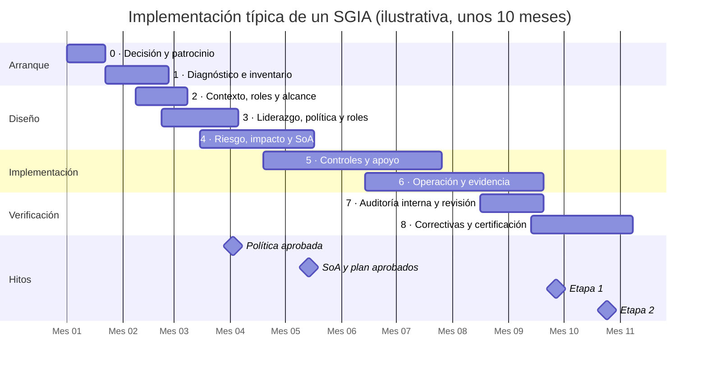

# Hoja de ruta de implementación

:material-map-marker-path: Implementación
:material-cloud-download-outline: Usa IA de terceros
:material-code-braces: Desarrolla IA
:material-handshake-outline: Provee IA a clientes
:material-clock-outline: 24 min de lectura

!!! abstract "En una frase"
    Implementar ISO/IEC 42001 es recorrer nueve fases, desde que la dirección decide hasta la auditoría de certificación; lo difícil no es redactar documentos, sino lograr que el sistema de gestión opere el tiempo suficiente para dejar evidencia de que funciona.

La norma no impone un orden de implementación: la secuencia en que presenta sus cláusulas no indica prioridad. Esta hoja de ruta propone una secuencia que funciona en la práctica: primero entender qué IA tienes y en qué terreno juegas, luego fijar reglas y responsables, después elegir controles con base en riesgos e impactos, implementarlos, operarlos y, al final, verificarlos.

Antes de empezar, tres advertencias:

- **Las fases se traslapan.** El inventario de sistemas sigue creciendo mientras defines el alcance, y la política se redacta en paralelo con la metodología de riesgos. El diagrama de Gantt de más abajo muestra esos traslapes.
- **Es un ciclo, no una línea.** El sistema de gestión de IA (SGIA) sigue el ciclo PHVA: lo que aprendas en la operación (fase 6) y en la auditoría interna (fase 7) regresa a la evaluación de riesgos (fase 4). El primer ciclo es el más pesado; los siguientes son de mantenimiento.
- **Proporcionalidad.** Una PyME de 58 personas no necesita la misma profundidad que una fintech con 350 000 clientes. Cada fase indica qué ajustar según tu tamaño y tu rol.

Los nombres de los controles del Anexo A que aparecen en esta página son traducción libre de referencia, no el texto oficial de la norma.

## La ruta de un vistazo {#vistazo}

| Fase | Pregunta que responde | Cláusulas y controles | Entregable estrella |
|---|---|---|---|
| [0 · Decisión y patrocinio](#fase-0) | ¿Vamos en serio y con qué recursos? | [5.1](../clausulas/c5-liderazgo.md#c-5-1), [7.1](../clausulas/c7-apoyo.md#c-7-1) | Acta de arranque con patrocinador y presupuesto |
| [1 · Diagnóstico e inventario](#fase-1) | ¿Qué IA tenemos realmente? | [4.1](../clausulas/c4-contexto.md#c-4-1), [A.4.2](../anexo-a/a4-recursos.md#a-4-2) | Inventario de sistemas de IA |
| [2 · Contexto, roles y alcance](#fase-2) | ¿Dónde aplica el SGIA y qué papel jugamos? | [4.1 a 4.4](../clausulas/c4-contexto.md) | Documento de alcance aprobado |
| [3 · Liderazgo, política y roles](#fase-3) | ¿Cuáles son las reglas y quién responde? | [5](../clausulas/c5-liderazgo.md), [A.2](../anexo-a/a2-politicas.md), [A.3](../anexo-a/a3-organizacion-interna.md) | Política de IA aprobada y comunicada |
| [4 · Riesgo, impacto y SoA](#fase-4) | ¿Qué puede salir mal, a quién afecta y qué controles necesitamos? | [6.1](../clausulas/c6-planificacion.md#c-6-1), [6.2](../clausulas/c6-planificacion.md#c-6-2), [A.5](../anexo-a/a5-evaluacion-de-impacto.md) | Declaración de Aplicabilidad y plan de tratamiento |
| [5 · Controles y apoyo](#fase-5) | ¿Cómo ponemos los controles a funcionar? | [7](../clausulas/c7-apoyo.md), A.4 y A.6 a A.10 | Controles con dueño, procedimiento y evidencia |
| [6 · Operación y evidencia](#fase-6) | ¿El sistema opera y deja huella? | [8](../clausulas/c8-operacion.md), [9.1](../clausulas/c9-evaluacion-del-desempeno.md#c-9-1) | Registros e indicadores con análisis |
| [7 · Auditoría interna y revisión](#fase-7) | ¿Funciona, y la dirección lo sabe? | [9.2](../clausulas/c9-evaluacion-del-desempeno.md#c-9-2), [9.3](../clausulas/c9-evaluacion-del-desempeno.md#c-9-3) | Informe de auditoría y acta de revisión |
| [8 · Correctivas y certificación](#fase-8) | ¿Corregimos de raíz y estamos listos para el auditor externo? | [10](../clausulas/c10-mejora.md), etapas 1 y 2 | Registro de acciones correctivas cerradas |

### Una implementación típica en el tiempo {#gantt}

El siguiente diagrama muestra una implementación de unos diez meses para una organización de complejidad media. Cada barra es una fase; los rombos son hitos.

!!! warning "Las duraciones son orientativas"
    Los plazos de esta página son una **estimación del autor**, basada en su experiencia con otros sistemas de gestión y en el esfuerzo que exige cada requisito de ISO 42001. No provienen de un estudio ni de una encuesta. Como referencia, desde la decisión hasta la auditoría de certificación: **de 6 a 9 meses** para una PyME que solo usa IA de terceros y **de 9 a 14 meses** para una organización que desarrolla sus propios modelos. Tu plazo real dependerá de los [factores que alargan o acortan](#factores) el proyecto.

## Fase 0 · Decisión y patrocinio {#fase-0}

**Objetivo.** Que la alta dirección tome una decisión consciente: por qué adoptar un SGIA, si se buscará la certificación o solo alinearse con la norma, quién lo va a encabezar y con qué recursos. Sin esta fase, el proyecto queda como iniciativa del área de TI o de cumplimiento y se apaga en la primera temporada de cierre.

**Actividades**

1. **Escribir el caso de negocio a partir del detonante real.** Puede ser un cuestionario de gobierno de IA que envió un banco cliente (Contadores Alameda), una ronda de inversión y alianzas con bancos (Monarca Crédito), exigencias de clientes en Europa (Conversa Labs) o un incidente. Pon en una columna lo que se gana (contratos, confianza, orden interno) y en otra lo que se evita (reclamaciones ante la Condusef, multas, daño a la reputación, fuga de datos).
2. **Decidir si se certifica o solo se alinea.** Las dos opciones son válidas; la diferencia está en el costo de las auditorías externas y en la disciplina que impone tener un calendario. La página [¿Necesito ISO 42001?](../empieza-aqui/necesito-iso42001.md) te ayuda a decidir.
3. **Hacer un autodiagnóstico rápido** con la herramienta de [autodiagnóstico](../herramientas/autodiagnostico.md) para dimensionar la distancia antes de comprometer fechas.
4. **Nombrar a dos personas:** un patrocinador en la alta dirección y un responsable del SGIA con tiempo asignado por escrito y acceso directo a la dirección ([5.3](../clausulas/c5-liderazgo.md#c-5-3)).
5. **Aprobar un presupuesto preliminar:** horas internas, capacitación, herramientas, consultoría si hace falta, auditoría interna y organismo de certificación.
6. **Arrancar formalmente** con una sesión de inicio en la que participen las áreas clave y en la que se presente el calendario.

**Entregables**

| Entregable | Para qué sirve | Referencia |
|---|---|---|
| Caso de negocio (una o dos páginas) | Justifica la inversión y da insumos para la política | [5.1](../clausulas/c5-liderazgo.md#c-5-1) |
| Acta de arranque o nombramiento | Deja constancia de quién encabeza y con qué autoridad | [5.1](../clausulas/c5-liderazgo.md#c-5-1), [5.3](../clausulas/c5-liderazgo.md#c-5-3) |
| Plan de proyecto preliminar | Fases, fechas meta y responsables | — |
| Presupuesto aprobado | Recursos para establecer y operar el SGIA | [7.1](../clausulas/c7-apoyo.md#c-7-1) |

**Responsables típicos.** La alta dirección (director general, socia directora o CEO) decide; finanzas valida el presupuesto; el responsable designado del SGIA prepara el caso.

**Duración orientativa.** De 2 a 4 semanas.

!!! success "Listo cuando…"
    - [ ] Hay un patrocinador con nombre en la alta dirección.
    - [ ] El responsable del SGIA tiene un porcentaje de dedicación escrito, no "en sus ratos libres".
    - [ ] Está decidido si habrá certificación y hay una fecha meta tentativa.
    - [ ] El presupuesto del primer año está aprobado.

!!! tip "Evidencia que te servirá meses después"
    El acta de arranque firmada por la dirección, con el presupuesto y los nombramientos, es una de las primeras evidencias de liderazgo y compromiso que verá el auditor externo. Guárdala desde el primer día en el repositorio del SGIA.

## Fase 1 · Diagnóstico e inventario de sistemas de IA {#fase-1}

**Objetivo.** Saber qué IA existe realmente en la organización, no solo la que conoce TI, y qué tan lejos estás de lo que pide la norma.

**Actividades**

1. **Levantar el inventario** de todos los sistemas de IA: los que desarrollas, los que compras como servicio, los que vienen integrados en software que ya usas (funciones de IA que el proveedor activó en una actualización) y las herramientas de uso libre.
2. **Buscar la IA en la sombra (*shadow AI*)**, es decir, el uso de herramientas de IA sin autorización ni control. Combina varias técnicas, porque ninguna basta sola:
    - Una encuesta breve y anónima con un mensaje claro de "amnistía": el objetivo es conocer, no castigar.
    - Revisión de gastos: tarjetas corporativas, reembolsos y suscripciones con nombres de herramientas de IA.
    - Registros técnicos: tráfico hacia servicios de IA en el *proxy* o el *firewall*, extensiones instaladas en los navegadores y aplicaciones conectadas a las cuentas corporativas de correo y ofimática.
    - Revisión de contratos y notas de versión de los proveedores de software, que cada vez más agregan funciones de IA.
    - Entrevistas por área. Atención a clientes, recursos humanos, mercadotecnia y finanzas suelen ser las que más experimentan.
3. **Llenar una ficha mínima por sistema:** propósito previsto, rol de la organización, dueño de negocio, proveedor o equipo desarrollador, datos que usa (¿personales?, ¿fiscales?, ¿financieros?), personas afectadas, etapa del ciclo de vida y una criticidad preliminar.
4. **Decidir el destino de cada hallazgo de IA en la sombra:** adoptarlo formalmente, sustituirlo por una herramienta aprobada o prohibirlo.
5. **Hacer el análisis de brechas (*gap analysis*)** contra las cláusulas 4 a 10 y los 38 controles, e identificar lo que ya existe y se puede reutilizar: políticas de seguridad y privacidad, aviso de privacidad, evaluaciones de impacto en la protección de datos, gestión de proveedores, control documental, gestión de incidentes.

**Entregables**

| Entregable | Para qué sirve | Referencia |
|---|---|---|
| Inventario de sistemas de IA, versión 0 | Base para el alcance, los riesgos y las evaluaciones de impacto | [4.1](../clausulas/c4-contexto.md#c-4-1), [A.4.2](../anexo-a/a4-recursos.md#a-4-2) |
| Registro de IA en la sombra con decisión por hallazgo | Evita que lo no autorizado quede fuera del radar | [A.9.2](../anexo-a/a9-uso.md#a-9-2) |
| Informe de brechas priorizado | Dimensiona el trabajo de las fases siguientes | — |
| Mapa de documentación reutilizable | Evita reinventar lo que ya existe | [7.5](../clausulas/c7-apoyo.md#c-7-5) |

**Responsables típicos.** El responsable del SGIA coordina; participan TI e infraestructura, seguridad de la información, privacidad, compras y los dueños de los procesos de negocio.

**Duración orientativa.** De 3 a 6 semanas, según el tamaño y la dispersión de la organización.

!!! success "Listo cuando…"
    - [ ] Cada sistema del inventario tiene dueño de negocio y un propósito escrito en lenguaje claro.
    - [ ] Buscaste IA en la sombra con al menos dos técnicas distintas, no solo preguntándole a TI.
    - [ ] Las brechas están priorizadas y tienen una estimación gruesa de esfuerzo.

!!! example "Contadores Alameda: lo que apareció en el inventario"
    El despacho pensaba en dos sistemas: el asistente de IA generativa de su suite de ofimática y Alma, el chatbot de WhatsApp. El inventario obligó a contar también el módulo de captura de CFDI de su software contable, que muchos veían como "una función más del sistema" y no como IA. La encuesta anónima confirmó lo que el incidente de la nómina ya sugería: varias personas usaban chatbots gratuitos para resumir documentos de clientes. La decisión fue sustituir ese uso por el asistente con licencia empresarial y dejarlo por escrito en la política de uso aceptable.

## Fase 2 · Contexto, roles y alcance {#fase-2}

**Objetivo.** Fijar el terreno del SGIA: el entorno en el que operas, lo que esperan de ti las partes interesadas, el papel que juegas frente a cada sistema de IA y las fronteras del sistema de gestión ([cláusula 4](../clausulas/c4-contexto.md)).

**Actividades**

1. **Analizar el contexto** ([4.1](../clausulas/c4-contexto.md#c-4-1)). Hacia afuera: leyes de datos personales, regulación de tu sector, criterios de autoridades (por ejemplo, la Condusef si das servicios financieros), el Reglamento de IA de la UE si tienes clientes allá, la competencia y lo que la sociedad espera. Hacia adentro: estrategia, gobierno, contratos y capacidades. La cláusula 4.1 también te pide decidir si el cambio climático es un tema pertinente para tu SGIA; para quien entrena modelos grandes, el consumo energético del cómputo suele ser la puerta de entrada.
2. **Determinar el propósito previsto y el rol de la organización frente a cada sistema**: proveedor, productor, cliente, socio. Rara vez es uno solo. La página [Roles en la IA](../fundamentos/roles-en-la-ia.md) explica cómo hacerlo.
3. **Identificar a las partes interesadas y sus requisitos** ([4.2](../clausulas/c4-contexto.md#c-4-2)): clientes, solicitantes de crédito, usuarios finales, reguladores, inversionistas, proveedores de IA, personal. Decide cuáles de esos requisitos atenderá el SGIA.
4. **Definir el alcance** ([4.3](../clausulas/c4-contexto.md#c-4-3)): sistemas, roles, procesos, ubicaciones, interfaces y dependencias con terceros, y las exclusiones con su justificación. Prepara un enunciado corto (es lo que aparece en el certificado) y un documento de alcance más completo.
5. **Dibujar el mapa de procesos del SGIA** y cómo se conectan entre sí y con los procesos de negocio ([4.4](../clausulas/c4-contexto.md#c-4-4)).

**Entregables**

| Entregable | Para qué sirve | Referencia |
|---|---|---|
| Análisis de contexto | Explica qué factores internos y externos condicionan al SGIA | [4.1](../clausulas/c4-contexto.md#c-4-1) |
| Matriz de roles por sistema | Determina qué requisitos y controles pesan más en cada caso | [4.1](../clausulas/c4-contexto.md#c-4-1) |
| Registro de partes interesadas y requisitos | Conecta expectativas externas con decisiones del SGIA | [4.2](../clausulas/c4-contexto.md#c-4-2) |
| Enunciado y documento de alcance | Información documentada obligatoria; fija la frontera | [4.3](../clausulas/c4-contexto.md#c-4-3) |
| Mapa de procesos del SGIA | Muestra cómo funciona el sistema como un todo | [4.4](../clausulas/c4-contexto.md#c-4-4) |

**Responsables típicos.** El responsable del SGIA conduce; legal y cumplimiento, privacidad y los dueños de los sistemas aportan; la alta dirección aprueba el alcance.

**Duración orientativa.** De 2 a 4 semanas. Suele arrancar antes de que termine la fase 1.

!!! success "Listo cuando…"
    - [ ] La alta dirección aprobó el alcance.
    - [ ] Cada sistema del inventario está dentro o fuera del alcance, con la razón escrita.
    - [ ] El rol de la organización está determinado sistema por sistema, no "en general".

!!! warning "No recortes el alcance para que la auditoría sea fácil"
    Dejar fuera el sistema más delicado (el modelo de *scoring*, el chatbot que habla con clientes) hace más corta la auditoría, pero vacía de valor al certificado: tus clientes e inversionistas leerán el alcance. Si necesitas avanzar por etapas, documenta el plan de ampliación. Más en [Errores frecuentes](errores-frecuentes.md#estrategia).

## Fase 3 · Liderazgo, política y roles {#fase-3}

**Objetivo.** Que la dirección fije las reglas del juego y que cada responsabilidad importante tenga nombre y apellido ([cláusula 5](../clausulas/c5-liderazgo.md), [A.2](../anexo-a/a2-politicas.md) y [A.3](../anexo-a/a3-organizacion-interna.md)).

**Actividades**

1. **Redactar la política de IA** ([5.2](../clausulas/c5-liderazgo.md#c-5-2), [A.2.2](../anexo-a/a2-politicas.md#a-2-2)): propósito y principios, marco para fijar objetivos de IA, compromisos de cumplir los requisitos aplicables y de mejorar el SGIA, reglas según la actividad (usar, desarrollar o proveer IA) y usos que la organización no permitirá.
2. **Revisar las políticas que ya tocan a la IA** ([A.2.3](../anexo-a/a2-politicas.md#a-2-3)): seguridad de la información, privacidad y aviso de privacidad, código de ética, compras, recursos humanos y gestión documental. Ajústalas o haz referencias cruzadas.
3. **Emitir una política de uso aceptable de IA generativa** para el personal: herramientas autorizadas, datos que nunca se ingresan, verificación humana de los resultados. Es la respuesta más rápida a la IA en la sombra que encontraste en la fase 1.
4. **Definir cuándo y cómo se revisará la política** ([A.2.4](../anexo-a/a2-politicas.md#a-2-4)): una periodicidad y una lista de cambios que obligan a revisarla antes de tiempo.
5. **Asignar roles y responsabilidades** ([5.3](../clausulas/c5-liderazgo.md#c-5-3), [A.3.2](../anexo-a/a3-organizacion-interna.md#a-3-2)) con una matriz RACI. Decide si creas un comité de IA o si sus funciones se integran en un comité existente (de riesgos, de seguridad o, en el caso de Monarca Crédito, el Comité de Modelos).
6. **Habilitar el canal de reporte de inquietudes** ([A.3.3](../anexo-a/a3-organizacion-interna.md#a-3-3)). Si ya tienes una línea de denuncia, amplía su alcance a la IA y confirma que protege contra represalias.
7. **Comunicar la política** y obtener acuse de lectura del personal en el alcance.

**Entregables**

| Entregable | Para qué sirve | Referencia |
|---|---|---|
| Política de IA aprobada | Marco de todo el SGIA; información documentada obligatoria | [5.2](../clausulas/c5-liderazgo.md#c-5-2), [A.2.2](../anexo-a/a2-politicas.md#a-2-2) |
| Política de uso aceptable de IA generativa | Reglas concretas para el personal | [A.9.2](../anexo-a/a9-uso.md#a-9-2), [7.3](../clausulas/c7-apoyo.md#c-7-3) |
| Matriz de cruce con otras políticas | Muestra la coherencia del marco normativo interno | [A.2.3](../anexo-a/a2-politicas.md#a-2-3) |
| Matriz RACI y nombramientos | Evita huecos y duplicidades | [5.3](../clausulas/c5-liderazgo.md#c-5-3), [A.3.2](../anexo-a/a3-organizacion-interna.md#a-3-2) |
| Acta de constitución del comité de IA | Da un foro a las decisiones difíciles | [5.1](../clausulas/c5-liderazgo.md#c-5-1) |
| Procedimiento del canal de inquietudes | Permite levantar la mano sin miedo | [A.3.3](../anexo-a/a3-organizacion-interna.md#a-3-3) |
| Evidencia de comunicación | Acuses, publicación en la intranet, sesiones informativas | [5.2](../clausulas/c5-liderazgo.md#c-5-2), [7.4](../clausulas/c7-apoyo.md#c-7-4) |

**Responsables típicos.** La alta dirección aprueba; el responsable del SGIA redacta; legal, recursos humanos, cumplimiento y privacidad revisan.

**Duración orientativa.** De 3 a 6 semanas. Lo que más tarda no es escribir, sino los ciclos de revisión y aprobación.

!!! success "Listo cuando…"
    - [ ] La política está aprobada por la alta dirección, publicada y comunicada con evidencia.
    - [ ] Las actividades críticas (aceptar riesgos, evaluar impactos, supervisar sistemas, gestionar proveedores de IA) tienen responsable designado.
    - [ ] El canal de inquietudes funciona y el personal sabe que existe.

## Fase 4 · Riesgo, impacto y Declaración de Aplicabilidad {#fase-4}

**Objetivo.** Diseñar los procesos de evaluación de riesgos y de evaluación de impacto, ejecutarlos por primera vez y convertir sus resultados en una selección justificada de controles ([6.1](../clausulas/c6-planificacion.md#c-6-1), [6.2](../clausulas/c6-planificacion.md#c-6-2) y [A.5](../anexo-a/a5-evaluacion-de-impacto.md)). Es el corazón técnico del SGIA.

**Actividades**

1. **Fijar los criterios de riesgo de IA** ([6.1.1](../clausulas/c6-planificacion.md#c-6-1-1)): escalas de consecuencia que contemplen a la organización, a las personas y a la sociedad; escala de probabilidad; niveles de riesgo; qué se considera aceptable y quién puede aceptar cada nivel.
2. **Documentar la metodología de evaluación de riesgos** ([6.1.2](../clausulas/c6-planificacion.md#c-6-1-2)) de forma que dos personas distintas, con la misma información, lleguen a resultados parecidos.
3. **Definir el proceso de evaluación de impacto del sistema de IA** (*AI system impact assessment*) ([6.1.4](../clausulas/c6-planificacion.md#c-6-1-4), [A.5.2](../anexo-a/a5-evaluacion-de-impacto.md#a-5-2)): qué la dispara, quién participa, qué profundidad corresponde según la criticidad y cómo se documentan los resultados.
4. **Ejecutar las evaluaciones de impacto** de los sistemas prioritarios. Considera el uso previsto, el uso indebido previsible, el contexto social y las jurisdicciones donde opera el sistema ([A.5.4](../anexo-a/a5-evaluacion-de-impacto.md#a-5-4), [A.5.5](../anexo-a/a5-evaluacion-de-impacto.md#a-5-5)).
5. **Ejecutar la evaluación de riesgos** usando los resultados de impacto como insumo. La norma pide que la evaluación de impacto alimente a la de riesgos, así que te conviene hacerla antes o en paralelo. La página [Riesgo frente a impacto](../fundamentos/riesgo-vs-impacto.md) explica cómo se conectan.
6. **Decidir el tratamiento** ([6.1.3](../clausulas/c6-planificacion.md#c-6-1-3)): elegir opciones, determinar los controles necesarios, compararlos con el Anexo A para no omitir ninguno, añadir controles propios si hacen falta y tomar en cuenta la guía del [Anexo B](../anexos-b-c-d.md).
7. **Elaborar la Declaración de Aplicabilidad** (*Statement of Applicability*, SoA): los 38 controles, cada uno marcado como incluido o excluido, con su justificación.
8. **Formular el plan de tratamiento** con responsables y fechas, y obtener la aprobación de la dirección designada, incluida la aceptación formal de los riesgos residuales.
9. **Fijar objetivos de IA** ([6.2](../clausulas/c6-planificacion.md#c-6-2)) medibles cuando sea posible, con su plan: qué se hará, con qué recursos, quién responde, para cuándo y cómo se evaluará.

**Entregables**

| Entregable | Para qué sirve | Referencia |
|---|---|---|
| Criterios y metodología de riesgos de IA | Hacen la evaluación repetible y comparable | [6.1.1](../clausulas/c6-planificacion.md#c-6-1-1), [6.1.2](../clausulas/c6-planificacion.md#c-6-1-2) |
| Procedimiento de evaluación de impacto | Dice cuándo y cómo se mira hacia afuera | [6.1.4](../clausulas/c6-planificacion.md#c-6-1-4), [A.5.2](../anexo-a/a5-evaluacion-de-impacto.md#a-5-2) |
| Evaluaciones de impacto por sistema | Registran consecuencias para personas, grupos y sociedad | [A.5.3](../anexo-a/a5-evaluacion-de-impacto.md#a-5-3) a [A.5.5](../anexo-a/a5-evaluacion-de-impacto.md#a-5-5) |
| Matriz de riesgos de IA | Prioriza qué tratar primero | [6.1.2](../clausulas/c6-planificacion.md#c-6-1-2) |
| Declaración de Aplicabilidad | Justifica qué controles aplican y cuáles no | [6.1.3](../clausulas/c6-planificacion.md#c-6-1-3) |
| Plan de tratamiento aprobado y aceptación de residuales | Convierte el análisis en compromisos con fecha | [6.1.3](../clausulas/c6-planificacion.md#c-6-1-3) |
| Objetivos de IA y su plan | Dan dirección medible al SGIA | [6.2](../clausulas/c6-planificacion.md#c-6-2) |

**Responsables típicos.** El responsable del SGIA conduce. Participan los dueños de los sistemas, ciencia de datos (si existe), privacidad, legal y expertos del negocio, como contadores o analistas de crédito. La dirección designada aprueba el plan y acepta los residuales.

**Duración orientativa.** De 6 a 10 semanas. Más si desarrollas modelos y la evaluación de impacto exige análisis de sesgo con datos reales.

!!! success "Listo cuando…"
    - [ ] Cada sistema en el alcance tiene evaluación de impacto y evaluación de riesgos, con fecha y responsable.
    - [ ] Los impactos relevantes se reflejan como riesgos en la matriz, con referencia cruzada entre ambos documentos.
    - [ ] La SoA cubre los 38 controles, cada uno con justificación propia y, si se incluye, ligado a riesgos o requisitos.
    - [ ] El plan de tratamiento y los riesgos residuales están aprobados por quien tiene autoridad para hacerlo.

!!! tip "La primera SoA es la versión 1, no la definitiva"
    No esperes la SoA perfecta para avanzar a la fase 5. Lo que aprendas al implementar y operar los controles cambiará algunas decisiones; para eso existe el control de versiones.

## Fase 5 · Controles operativos y procesos de apoyo {#fase-5}

**Objetivo.** Poner a funcionar los controles incluidos en la SoA y los habilitadores de la [cláusula 7](../clausulas/c7-apoyo.md): recursos, competencia, toma de conciencia, comunicación e información documentada. Es la fase más larga y la que involucra a más áreas.

**Actividades por frente de trabajo**

| Frente | Qué implica | Para quién pesa más |
|---|---|---|
| Recursos ([A.4](../anexo-a/a4-recursos.md)) | Completar la ficha de cada sistema con datos, herramientas, cómputo y personas | Todos; más quien desarrolla |
| Ciclo de vida ([A.6](../anexo-a/a6-ciclo-de-vida.md)) | Procedimiento con etapas y puertas de aprobación; requisitos, diseño, verificación y validación, despliegue, operación y monitoreo, documentación técnica y registro de eventos | Quien desarrolla o provee; quien usa, sobre todo en despliegue, monitoreo y bitácoras |
| Datos ([A.7](../anexo-a/a7-datos.md)) | Requisitos de calidad, procedencia, adquisición y preparación de datos | Quien desarrolla; quien usa, si alimenta bases de conocimiento |
| Información a partes interesadas ([A.8](../anexo-a/a8-informacion-partes-interesadas.md)) | Aviso de interacción con IA, información para usuarios, canal de reporte externo, plan de comunicación de incidentes, obligaciones de reporte | Todos; crítico para quien provee |
| Uso ([A.9](../anexo-a/a9-uso.md)) | Proceso de alta de nuevos usos, objetivos de uso responsable, supervisión humana, uso conforme al previsto | Quien usa IA o decide con ella |
| Terceros ([A.10](../anexo-a/a10-terceros.md)) | Matriz de responsabilidad compartida, evaluación de proveedores de IA, cláusulas contractuales, necesidades de clientes | Todos; la parte de clientes, sobre todo para quien provee |
| Apoyo ([7](../clausulas/c7-apoyo.md)) | Competencias por rol, campaña de concientización, matriz de comunicación, control documental | Todos |
| Cambios ([6.3](../clausulas/c6-planificacion.md#c-6-3)) | Cómo se planifican los cambios al propio SGIA | Todos |

Para cada control incluido, define cuatro cosas: quién es el dueño, cómo se ejecuta, qué evidencia deja y cómo sabrás si funciona. Si no puedes responder la tercera pregunta, el control todavía no está listo para una auditoría. La organización del repositorio y el control de versiones de los artefactos se explican en [Documentación requerida](documentacion-requerida.md#repositorio).

**Entregables**

| Entregable | Para qué sirve | Referencia |
|---|---|---|
| Fichas de los sistemas de IA | Reúnen recursos, uso previsto, límites y supervisión | [A.4.2](../anexo-a/a4-recursos.md#a-4-2), [A.6.2.7](../anexo-a/a6-ciclo-de-vida.md#a-6-2-7) |
| Procedimiento del ciclo de vida | Define etapas, puertas y criterios de liberación | [A.6.1.3](../anexo-a/a6-ciclo-de-vida.md#a-6-1-3) |
| Procedimientos de gestión de datos | Calidad, procedencia y preparación | [A.7.2](../anexo-a/a7-datos.md#a-7-2) a [A.7.6](../anexo-a/a7-datos.md#a-7-6) |
| Aviso de IA e información para usuarios | Transparencia hacia quien interactúa con el sistema | [A.8.2](../anexo-a/a8-informacion-partes-interesadas.md#a-8-2) |
| Plan de comunicación de incidentes | Saber a quién avisar, cómo y cuándo | [A.8.4](../anexo-a/a8-informacion-partes-interesadas.md#a-8-4) |
| Evaluaciones de proveedores de IA y cláusulas contractuales | Responsabilidades claras con terceros | [A.10.2](../anexo-a/a10-terceros.md#a-10-2), [A.10.3](../anexo-a/a10-terceros.md#a-10-3) |
| Matriz de competencias y plan de capacitación | Personas preparadas para su rol | [7.2](../clausulas/c7-apoyo.md#c-7-2), [A.4.6](../anexo-a/a4-recursos.md#a-4-6) |
| Matriz de comunicación | Qué se comunica, a quién, cuándo y cómo | [7.4](../clausulas/c7-apoyo.md#c-7-4) |
| Procedimiento de información documentada | Versiones, accesos y retención | [7.5](../clausulas/c7-apoyo.md#c-7-5) |

**Responsables típicos.** Los dueños de cada control ejecutan; ciencia de datos e ingeniería, compras, legal, recursos humanos y comunicación participan según el frente; el responsable del SGIA coordina y da seguimiento.

**Duración orientativa.** De 8 a 16 semanas, con varios frentes en paralelo.

!!! success "Listo cuando…"
    - [ ] Cada control incluido en la SoA tiene dueño, un procedimiento (por breve que sea) y al menos una evidencia de que ya se ejecutó.
    - [ ] La capacitación inicial por rol se impartió y se midió si funcionó, más allá de la asistencia.
    - [ ] Los contratos o anexos con los proveedores críticos de IA ya reflejan las responsabilidades acordadas.

## Fase 6 · Operación y generación de evidencia {#fase-6}

**Objetivo.** Dejar que el SGIA opere como parte del día a día y acumule los registros que prueban que funciona ([cláusula 8](../clausulas/c8-operacion.md) y [9.1](../clausulas/c9-evaluacion-del-desempeno.md#c-9-1)). Un auditor no certifica intenciones: certifica lo que puede comprobar con evidencia.

**Actividades**

1. **Operar los procesos con los criterios definidos** ([8.1](../clausulas/c8-operacion.md#c-8-1)) y vigilar si los controles logran lo que se esperaba; si no, considerar acciones correctivas.
2. **Gestionar los cambios.** Los planificados (una nueva versión del modelo, una actualización de la base de conocimiento, un cambio de proveedor) se controlan antes de ejecutarse; los no previstos (un proveedor cambia el modelo de fondo sin avisar) se analizan para mitigar sus efectos.
3. **Controlar a los proveedores y servicios externos** que influyen en el SGIA, con seguimiento periódico y no solo al contratar.
4. **Repetir las evaluaciones** de riesgos ([8.2](../clausulas/c8-operacion.md#c-8-2)) y de impacto ([8.4](../clausulas/c8-operacion.md#c-8-4)) según el calendario o ante cambios significativos, ejecutar el plan de tratamiento y verificar que funcione ([8.3](../clausulas/c8-operacion.md#c-8-3)).
5. **Medir y analizar** ([9.1](../clausulas/c9-evaluacion-del-desempeno.md#c-9-1)): qué se mide, con qué método, cada cuánto y quién analiza. Algunos ejemplos: porcentaje de sistemas con evaluación de impacto vigente; tasa de respuestas incorrectas de Alma en un muestreo mensual; diferencia en tasas de aprobación entre grupos en Score Monarca v3; tiempo de atención de incidentes en Conversa; porcentaje de personal capacitado.
6. **Registrar incidentes, reportes de los canales internos y externos** y la forma en que se atendieron.

**Entregables**

| Entregable | Para qué sirve | Referencia |
|---|---|---|
| Registros de operación de los controles | Prueban que los procesos se ejecutaron según lo planificado | [8.1](../clausulas/c8-operacion.md#c-8-1) |
| Evaluaciones de riesgo e impacto actualizadas | Muestran que el análisis sigue vivo | [8.2](../clausulas/c8-operacion.md#c-8-2), [8.4](../clausulas/c8-operacion.md#c-8-4) |
| Registros del tratamiento y de su eficacia | Muestran que el plan avanza y funciona | [8.3](../clausulas/c8-operacion.md#c-8-3) |
| Tablero de indicadores con análisis | Evidencia de seguimiento y medición | [9.1](../clausulas/c9-evaluacion-del-desempeno.md#c-9-1) |
| Registro de incidentes y reportes externos | Trazabilidad de lo que salió mal y cómo se respondió | [A.8.3](../anexo-a/a8-informacion-partes-interesadas.md#a-8-3), [A.8.4](../anexo-a/a8-informacion-partes-interesadas.md#a-8-4) |
| Registros de cambios | Prueban que los cambios se gestionan | [6.3](../clausulas/c6-planificacion.md#c-6-3), [8.1](../clausulas/c8-operacion.md#c-8-1) |

**Responsables típicos.** Los dueños de los sistemas y de los controles generan los registros; operación y soporte los alimentan; el responsable del SGIA analiza y reporta a la dirección.

**Duración orientativa.** En nuestra estimación, al menos de 2 a 3 meses de operación antes de la auditoría de certificación. Corre en paralelo con el final de la fase 5 y con la fase 7. Algunos organismos de certificación piden un periodo mínimo de operación con registros: pregúntale al tuyo desde la fase 0.

!!! success "Listo cuando…"
    - [ ] Completaste al menos un ciclo de medición con análisis y conclusiones, no solo con datos.
    - [ ] Hay registros fechados de varios controles a lo largo del periodo, no todos de la semana anterior a la auditoría.
    - [ ] Al menos un cambio pasó por el proceso definido, con su reevaluación cuando correspondía.

## Fase 7 · Auditoría interna y revisión por la dirección {#fase-7}

**Objetivo.** Comprobar con independencia que el SGIA cumple con la norma y con tus propias reglas, y que funciona; después, que la alta dirección lo revise y decida ([9.2](../clausulas/c9-evaluacion-del-desempeno.md#c-9-2) y [9.3](../clausulas/c9-evaluacion-del-desempeno.md#c-9-3)).

**Actividades**

1. **Armar el programa de auditoría interna:** frecuencia, métodos, responsables y forma de reportar, dando más atención a los procesos más importantes y a lo que falló en auditorías anteriores.
2. **Elegir auditores objetivos e imparciales.** Nadie audita su propio trabajo. En una PyME suele convenir un auditor externo o un intercambio con otra área; en cualquier caso, el auditor necesita entender de IA lo suficiente para hacer preguntas incómodas.
3. **Auditar todo el alcance antes de la primera certificación:** cláusulas 4 a 10, controles incluidos en la SoA y justificación de los excluidos. El [checklist de auditoría interna](../plantillas/index.md#checklist-auditoria-interna) te da un punto de partida.
4. **Reportar los resultados** a la dirección que corresponda, con hallazgos clasificados.
5. **Celebrar la revisión por la dirección** con los insumos que pide la norma: estado de los acuerdos anteriores, cambios en el contexto y en las expectativas de las partes interesadas, desempeño del SGIA (con tendencias de no conformidades, mediciones y auditorías) y oportunidades de mejora. Te recomendamos sumar los resultados de las evaluaciones de riesgo e impacto, el avance del plan de tratamiento, los incidentes y la retroalimentación de partes interesadas: a diferencia de ISO 27001, la lista de 42001 no los nombra, pero la operación los genera y la dirección los necesita para decidir.
6. **Levantar un acta con decisiones** de mejora y de cambios al SGIA, con responsables y fechas.

**Entregables**

| Entregable | Para qué sirve | Referencia |
|---|---|---|
| Programa de auditoría interna | Planifica las auditorías del ciclo | [9.2](../clausulas/c9-evaluacion-del-desempeno.md#c-9-2) |
| Plan e informe de auditoría con hallazgos | Evidencia de la auditoría y sus resultados | [9.2](../clausulas/c9-evaluacion-del-desempeno.md#c-9-2) |
| Acta de revisión por la dirección | Evidencia de las decisiones de la dirección | [9.3](../clausulas/c9-evaluacion-del-desempeno.md#c-9-3) |

**Responsables típicos.** Auditor interno (propio y capacitado, o externo); alta dirección; responsable del SGIA como organizador y presentador.

**Duración orientativa.** De 3 a 5 semanas entre la auditoría (de una a tres semanas, según el tamaño) y la revisión por la dirección.

!!! success "Listo cuando…"
    - [ ] La auditoría cubrió todo el alcance y todos los controles incluidos en la SoA.
    - [ ] Ningún auditor revisó su propio trabajo.
    - [ ] El acta de revisión contiene decisiones concretas, no solo "se presentó el informe".

## Fase 8 · Acciones correctivas y preparación para la certificación {#fase-8}

**Objetivo.** Corregir de raíz lo que falló y superar la auditoría externa, que se hace en dos etapas ([cláusula 10](../clausulas/c10-mejora.md) y [Cómo se certifica](../auditoria/como-se-certifica.md)).

**Actividades**

1. **Tratar cada no conformidad** ([10.2](../clausulas/c10-mejora.md#c-10-2)): contenerla y corregirla, atender sus consecuencias, analizar la causa, buscar casos parecidos en otros sistemas o áreas, implementar la acción, verificar después si funcionó y ajustar el SGIA si hace falta.
2. **Elegir el organismo de certificación (OC).** Verifica que esté acreditado para ISO/IEC 42001, pide propuestas y pregunta por la experiencia de sus auditores en IA y en tu sector.
3. **Auditoría de etapa 1.** El auditor revisa la documentación, el alcance, tu comprensión del contexto y tu grado de preparación, y confirma que la auditoría interna y la revisión por la dirección ya están planificadas o realizadas. Como resultado, señala áreas de preocupación y planifica la etapa 2.
4. **Atender las observaciones de la etapa 1** en el intervalo entre ambas etapas, que suele ser de algunas semanas.
5. **Auditoría de etapa 2.** El auditor evalúa si el SGIA está implementado y si es eficaz: entrevista a los dueños de los sistemas, a quienes supervisan las decisiones de la IA y al personal; muestrea registros y observa la operación.
6. **Presentar el plan de acción** para las no conformidades de la etapa 2. Por lo general, las mayores tienen que quedar corregidas, con evidencia, antes de la decisión de certificación; para las menores basta un plan aceptado por el OC.
7. **Recibir la decisión de certificación** y pasar al ciclo de auditorías de seguimiento. Los detalles están en [Cómo se certifica](../auditoria/como-se-certifica.md).

**Entregables**

| Entregable | Para qué sirve | Referencia |
|---|---|---|
| Registro de no conformidades y acciones correctivas | Información documentada obligatoria de la mejora | [10.2](../clausulas/c10-mejora.md#c-10-2) |
| Evidencias de cierre y de verificación de eficacia | Prueban que la acción eliminó la causa | [10.2](../clausulas/c10-mejora.md#c-10-2) |
| Carpeta de evidencias por cláusula y control | Permite encontrar todo en minutos durante la auditoría | [7.5](../clausulas/c7-apoyo.md#c-7-5) |
| Informes de etapas 1 y 2 y planes de acción | Cierran el proceso con el OC | [Cómo se certifica](../auditoria/como-se-certifica.md) |

**Responsables típicos.** El responsable del SGIA coordina; los dueños de las acciones las ejecutan; la alta dirección participa en las reuniones de apertura y cierre y en su propia entrevista.

**Duración orientativa.** De 6 a 10 semanas, incluidas ambas etapas; depende mucho de la agenda del OC.

!!! success "Listo cuando…"
    - [ ] Las no conformidades de la auditoría interna tienen análisis de causa y su acción está en curso o cerrada.
    - [ ] Las personas clave explican su papel con sus propias palabras, sin leer un guion.
    - [ ] Cualquier evidencia se encuentra en minutos.
    - [ ] Repasaste las [preguntas del auditor](../auditoria/preguntas-del-auditor.md) y el [checklist de preparación](../auditoria/checklist-preparacion.md).

## Variantes según tu organización {#variantes}

La ruta es la misma para todos; lo que cambia es el peso de cada fase. Estas son las cuatro variantes más comunes, con los casos de esta guía.

=== "PyME que usa IA de terceros"

    **Contadores Alameda** (despacho contable en Querétaro, 58 personas) · **6 a 9 meses** en nuestra estimación.

    - **Fases que pesan más:** la 1, por la IA en la sombra; la 3, por la política de uso aceptable; y la 5 en [A.8](../anexo-a/a8-informacion-partes-interesadas.md) (aviso de que Alma es una IA y qué hacer si se equivoca), [A.9](../anexo-a/a9-uso.md) (uso conforme al previsto) y [A.10](../anexo-a/a10-terceros.md) (BotNorte, el proveedor del software contable y el fabricante de la suite de ofimática).
    - **Fases que se aligeran:** la 4, porque son pocos sistemas y la evaluación de impacto más exigente es la de Alma; y la 5, porque varios controles de desarrollo de A.6 y A.7 suelen ser candidatos a exclusión justificada. Ojo: no todos. La base de conocimiento de Alma es un recurso de datos que el despacho cura, así que la calidad de los datos ([A.7.4](../anexo-a/a7-datos.md#a-7-4)), el despliegue ([A.6.2.5](../anexo-a/a6-ciclo-de-vida.md#a-6-2-5)), la operación y el monitoreo ([A.6.2.6](../anexo-a/a6-ciclo-de-vida.md#a-6-2-6)) y el registro de eventos ([A.6.2.8](../anexo-a/a6-ciclo-de-vida.md#a-6-2-8)) siguen aplicando.
    - **Equipo:** la Socia directora como patrocinadora; el Gerente de TI como responsable del SGIA, con una dedicación definida (por ejemplo, dos días por semana durante el proyecto); la Coordinadora de cumplimiento y datos personales; la Líder de atención a clientes como dueña de Alma. La auditoría interna, contratada a un externo.
    - **Atajo:** el cuestionario del banco cliente se puede responder con los entregables de las fases 2 a 4 mucho antes de la certificación.

    Caso completo: [PyME que usa IA generativa](../casos-practicos/pyme-usa-ia-generativa.md).

=== "Organización que desarrolla IA"

    **Monarca Crédito** (fintech de microcréditos, 210 personas) · **9 a 14 meses** en nuestra estimación.

    - **Fases que pesan más:** la 4, porque la evaluación de impacto de Score Monarca v3 sobre los solicitantes exige análisis de sesgo por sexo, edad y entidad federativa, revisión de variables sustitutas como el código postal y motivos de rechazo comprensibles; la 5, porque A.6 y A.7 aplican casi completos (datos de buró de crédito, transaccionales y de uso de la app con consentimiento) y conviene una validación independiente; y la 6, porque el monitoreo de deriva necesita meses de datos para ser concluyente.
    - **Lo que se puede aprovechar:** las prácticas de gestión de riesgo de modelos, cumplimiento y privacidad que ya existan, y el Comité de Modelos como órgano de gobierno del SGIA.
    - **No olvidar el otro rol:** Monarca también es cliente de una API de detección de fraude; ese sistema se gestiona como el de cualquier usuario de IA de terceros, con énfasis en [A.10.3](../anexo-a/a10-terceros.md#a-10-3).
    - **Riesgo de calendario:** conviene que al menos un cambio de versión del modelo pase por el nuevo proceso de ciclo de vida antes de la etapa 2. Si el siguiente reentrenamiento está programado después, considera adelantar uno menor.

    Caso completo: [Fintech con scoring crediticio](../casos-practicos/fintech-scoring.md).

=== "Proveedor SaaS de IA"

    **Conversa Labs** (plataforma de asistentes virtuales, 95 personas) · **8 a 12 meses** en nuestra estimación.

    - **Fases que pesan más:** la 2, porque el alcance combina tres roles (proveedor, productor y cliente del proveedor del modelo fundacional) y conviene que marque con precisión dónde termina su responsabilidad y empieza la de sus clientes; la 4, porque además de su propia evaluación de impacto conviene dar a los clientes insumos para las suyas; y la 5, por las evaluaciones de calidad y las pruebas adversarias de inyección de instrucciones ([A.6.2.4](../anexo-a/a6-ciclo-de-vida.md#a-6-2-4)), los datos de clientes en la generación aumentada por recuperación (RAG) ([A.7](../anexo-a/a7-datos.md)), la documentación y la comunicación de incidentes para clientes ([A.8](../anexo-a/a8-informacion-partes-interesadas.md)) y la responsabilidad compartida ([A.10.2](../anexo-a/a10-terceros.md#a-10-2), [A.10.4](../anexo-a/a10-terceros.md#a-10-4)).
    - **Particularidad:** su cliente en España trae obligaciones de transparencia del marco europeo; revisa [Reglamento de IA de la UE](../integracion/reglamento-ia-ue.md).
    - **Atajo:** la documentación para clientes cumple una doble función, porque es evidencia de A.8 y material para responder cuestionarios de debida diligencia de prospectos.

    Caso completo: [Empresa que desarrolla un chatbot](../casos-practicos/empresa-desarrolla-chatbot.md).

=== "Con SGSI ISO 27001 vigente"

    Si ya tienes un SGSI certificado en ISO 27001, la estructura armonizada compartida te ahorra mucho trabajo. En nuestra estimación, un SGSI maduro puede recortar entre una cuarta parte y un tercio del calendario.

    - **Fases que se acortan:** la 0 (el gobierno y el comité ya existen); la 3 (la política de IA se alinea con la de seguridad y la matriz RACI se amplía); la 5 en los procesos de la cláusula 7 (control documental, competencias, comunicación) y en proveedores e incidentes, que se extienden a partir de lo que ya tienes para ISO 27001 A.5.19 a A.5.23 y ISO 27001 A.5.24 a A.5.26; y las fases 7 y 8, porque el programa de auditoría, la revisión por la dirección y las acciones correctivas pueden integrarse.
    - **Fases que no se acortan:** la 1 (el inventario de IA es nuevo); la 4 (la evaluación de impacto no tiene equivalente en ISO 27001, y los criterios de riesgo tienen que mirar a personas y sociedad, no solo confidencialidad, integridad y disponibilidad); los controles de A.5, A.6 y A.7; y una SoA propia de 38 controles.
    - **Pregunta a tu OC** si puede auditar ambos sistemas de forma combinada.

    Más detalle en [Integración con ISO 27001](../integracion/con-iso27001.md).

## Factores que alargan o acortan el proyecto {#factores}

!!! failure "Alargan"
    - Muchos sistemas en el alcance o sistemas con alto impacto en personas (crédito, empleo, salud, seguros).
    - Desarrollar o ajustar modelos propios.
    - Datos personales sensibles o de menores.
    - Operar en varias jurisdicciones, sobre todo con clientes en la Unión Europea.
    - Un responsable del SGIA sin tiempo asignado o sin acceso a la dirección.
    - Documentación técnica inexistente: nadie sabe con qué datos se entrenó el modelo en producción.
    - Proveedores de IA que no comparten información sobre sus modelos.
    - Un alcance que cambia a mitad del proyecto.
    - Ciclos de aprobación lentos o comités que se reúnen cada trimestre.
    - Querer documentar todo antes de operar algo.

!!! success "Acortan"
    - Un SGSI o un sistema de gestión de calidad vigente.
    - Un alcance acotado y estable desde la fase 2.
    - Un inventario de sistemas o de aplicaciones que ya existía.
    - Prácticas de MLOps maduras: registro de modelos, versionado de datos, canalizaciones de evaluación.
    - Una cultura de gestión de riesgos, como la de riesgo de modelos en entidades financieras.
    - Un patrocinador que desbloquea decisiones en días, no en meses.
    - Plantillas adaptadas en lugar de documentos desde cero.
    - Un auditor interno o asesor con experiencia en sistemas de gestión y en IA.
    - Decisiones de exclusión tomadas pronto y con criterio claro.

## Plantillas para cada fase {#plantillas}

-   :material-database-search-outline:{ .lg .middle } **Inventario de sistemas de IA**

    ---

    Fase 1. Ficha mínima de cada sistema, con rol, datos, personas afectadas y criticidad.

    [:octicons-arrow-right-24: Ir a la plantilla](../plantillas/index.md#inventario-sistemas-ia)

-   :material-file-sign:{ .lg .middle } **Política de IA**

    ---

    Fase 3. Política marco aprobada por la alta dirección.

    [:octicons-arrow-right-24: Ir a la plantilla](../plantillas/index.md#politica-de-ia)

-   :material-chat-alert-outline:{ .lg .middle } **Uso aceptable de IA generativa**

    ---

    Fase 3. Reglas para el personal contra la IA en la sombra.

    [:octicons-arrow-right-24: Ir a la plantilla](../plantillas/index.md#uso-aceptable-ia-generativa)

-   :material-account-group-outline:{ .lg .middle } **Matriz RACI de IA**

    ---

    Fase 3. Quién decide, quién ejecuta, quién es consultado y quién es informado.

    [:octicons-arrow-right-24: Ir a la plantilla](../plantillas/index.md#raci-ia)

-   :material-alert-decagram-outline:{ .lg .middle } **Metodología y matriz de riesgos**

    ---

    Fase 4. Criterios, escalas y registro de riesgos de IA.

    [:octicons-arrow-right-24: Ir a la plantilla](../plantillas/index.md#evaluacion-de-riesgos)

-   :material-account-heart-outline:{ .lg .middle } **Evaluación de impacto**

    ---

    Fase 4. Consecuencias para personas, grupos y sociedad.

    [:octicons-arrow-right-24: Ir a la plantilla](../plantillas/index.md#evaluacion-de-impacto)

-   :material-table-check:{ .lg .middle } **Declaración de Aplicabilidad**

    ---

    Fase 4. Los 38 controles con su decisión y justificación.

    [:octicons-arrow-right-24: Ir a la plantilla](../plantillas/index.md#declaracion-de-aplicabilidad)

-   :material-card-account-details-outline:{ .lg .middle } **Ficha del sistema de IA**

    ---

    Fase 5. La tarjeta de identidad de cada sistema.

    [:octicons-arrow-right-24: Ir a la plantilla](../plantillas/index.md#ficha-del-sistema)

-   :material-sync:{ .lg .middle } **Procedimiento del ciclo de vida**

    ---

    Fase 5. Etapas, puertas de aprobación y cambios significativos.

    [:octicons-arrow-right-24: Ir a la plantilla](../plantillas/index.md#procedimiento-ciclo-de-vida)

-   :material-alarm-light-outline:{ .lg .middle } **Registro de incidentes de IA**

    ---

    Fases 5 y 6. Gestión, comunicación y aprendizaje de incidentes.

    [:octicons-arrow-right-24: Ir a la plantilla](../plantillas/index.md#registro-de-incidentes)

-   :material-clipboard-check-outline:{ .lg .middle } **Checklist de auditoría interna**

    ---

    Fase 7. Preguntas guía por cláusula y por control.

    [:octicons-arrow-right-24: Ir a la plantilla](../plantillas/index.md#checklist-auditoria-interna)

## Para seguir

- [Documentación requerida](documentacion-requerida.md): qué documentos y registros produce cada fase y cómo organizarlos.
- [Errores frecuentes](errores-frecuentes.md): las trampas más comunes de cada fase y cómo esquivarlas.
- [Cómo se certifica](../auditoria/como-se-certifica.md) y [Checklist de preparación](../auditoria/checklist-preparacion.md): lo que viene después de la fase 8.
