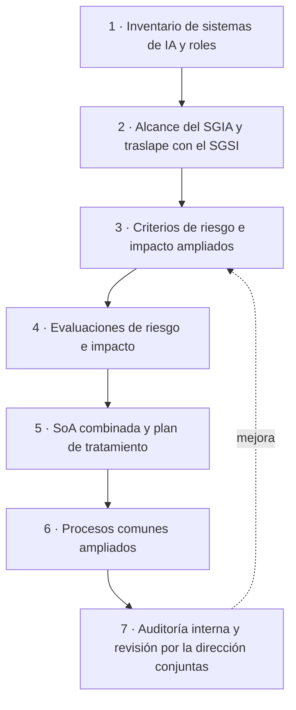

# Integración con ISO 27001

:material-link-variant: Integración
:material-clock-outline: 25 min de lectura

!!! abstract "En una frase"
    Si ya tienes un SGSI con ISO/IEC 27001:2022, conservas el esqueleto completo del sistema de gestión (documentos, auditoría, revisión por la dirección, acciones correctivas), adaptas varias piezas clave (contexto, riesgo, Declaración de Aplicabilidad, proveedores, registros e incidentes) y construyes desde cero lo propio de la IA: evaluación de impacto, objetivos de uso responsable, gestión de datos, transparencia, uso previsto y supervisión humana.

## Para quién es esta página

Para ti, que coordinas un sistema de gestión de seguridad de la información (SGSI) con ISO/IEC 27001:2022 y te acaban de pedir "lo mismo, pero para IA": un banco cliente mandó un cuestionario sobre gobierno de IA, el consejo quiere un sello para un producto con IA generativa o descubriste que medio equipo usa chatbots gratuitos con datos de clientes.

La buena noticia: no empiezas en cero. Las dos normas comparten la **estructura armonizada** (*harmonized structure*) de ISO, así que la mayor parte del "motor" del SGSI sirve para el sistema de gestión de IA (SGIA). La advertencia: lo que cambia no es cosmético. En ISO/IEC 42001 el riesgo ya no gira solo en torno a la información; también importa **qué les pasa a las personas y a la sociedad** cuando un sistema de IA se equivoca, discrimina o se usa para algo que no debía.

Para ubicarte en el tiempo: ISO/IEC 27001:2022 se publicó el 25 de octubre de 2022 y recibió una enmienda sobre acción climática el 23 de febrero de 2024[^iso27001]; ISO/IEC 42001:2023 se publicó el 18 de diciembre de 2023 y, al 9 de octubre de 2026, no tiene enmiendas ni revisión en curso[^iso42001].

!!! tip "¿Aún no tienes SGSI?"
    Esta página da por hecho que ya conoces ISO 27001. Si todavía no tienes un SGSI y quieres construir ambos sistemas a la vez, te servirá el proyecto hermano de esta guía, el [ISO 27001 Toolkit en español](https://github.com/adriangzmncrz-arch/iso27001-toolkit-es), con plantillas y explicaciones del SGSI. Te recomendamos diseñar desde el inicio un sistema integrado en lugar de dos sistemas paralelos.

A lo largo de la página nombramos controles de ambas normas. Para no confundirlos (el número A.5.2, por ejemplo, existe en las dos), los de ISO 27001 siempre llevan "27001" al lado; en las tablas aparecen en una columna propia y sin la "A.". Los nombres de los controles de ISO/IEC 42001 que usamos son traducción libre de referencia, no el texto oficial.

## El mapa en tres zonas

<figure class="dx-infografia">
--8<-- "docs/assets/infografias/iso27001-vs-iso42001.svg"
<figcaption>Lo que compartes, lo que adaptas y lo que construyes nuevo al pasar de un SGSI con ISO 27001:2022 a un SGIA con ISO/IEC 42001. La barra inferior resume nuestra clasificación de los 38 controles.</figcaption>
</figure>

??? note "Descripción textual de la infografía"
    Tres columnas. **Compartido (reutilizas tu SGSI):** estructura armonizada de las cláusulas 4 a 10; información documentada (7.5); competencia y toma de conciencia (7.2 y 7.3); comunicación (7.4); planificación de cambios (6.3); auditoría interna (9.2); revisión por la dirección (9.3); mejora y acción correctiva (10.1 y 10.2). Ejemplo: un solo programa de auditoría con criterios de ambas normas.

    **Se adapta (amplías lo que existe):** contexto con propósito previsto y roles (4.1 y 4.2); riesgo que mira personas y sociedad, no solo confidencialidad, integridad y disponibilidad (6.1.1, 6.1.2 y 8.2); Declaración de Aplicabilidad con otros 38 controles (6.1.3); política de IA (5.2 y A.2); proveedores de IA (A.10.2 y A.10.3); registros de eventos (A.6.2.8); incidentes de IA (A.8.4); inventario y recursos (A.4). Ejemplo: la matriz de riesgos agrega consecuencias para personas y sociedad.

    **Nuevo (construyes desde cero):** evaluación de impacto (6.1.4, 8.4 y A.5); desarrollo y uso responsable (A.6.1.2 y A.9.3); datos para IA (A.7.2 a A.7.6); transparencia a usuarios (A.8.2 y A.8.3); uso previsto (A.9.4); supervisión humana (A.9.3, A.6.1.3 y A.4.6); documentación técnica (A.6.2.7); información a clientes (A.10.4). Ejemplo: aviso en el chatbot de que la persona conversa con una IA.

    Abajo, una barra con los 38 controles según nuestra clasificación frente al Anexo A de ISO 27001:2022: 2 equivalentes, 19 similares y 17 nuevos.

Las zonas no son compartimentos estancos: la auditoría interna es "compartida" como proceso, pero el auditor necesita criterios nuevos para revisar una validación de modelo. Úsalas como brújula, no como clasificación rígida.

## Zona 1 · Lo compartido: el motor del sistema de gestión

ISO/IEC 42001 está escrita sobre la misma plantilla que ISO/IEC 27001:2022, ISO 9001 o ISO 22301: mismas cláusulas, mismo orden y buena parte del texto base. Las cláusulas 4 a 10 son casi paralelas; cambia el objeto ("seguridad de la información" por "IA") y se añaden piezas específicas. El propio Anexo D de ISO/IEC 42001 sugiere integrar el SGIA con un SGSI en lugar de operarlos por separado.

En la práctica reutilizas casi tal cual el control de documentos ([7.5](../clausulas/c7-apoyo.md#c-7-5)), la gestión de competencias y la concientización ([7.2](../clausulas/c7-apoyo.md#c-7-2) y [7.3](../clausulas/c7-apoyo.md#c-7-3)), la matriz de comunicación ([7.4](../clausulas/c7-apoyo.md#c-7-4)), la planificación de cambios ([6.3](../clausulas/c6-planificacion.md#c-6-3)), la auditoría interna ([9.2](../clausulas/c9-evaluacion-del-desempeno.md#c-9-2)), la revisión por la dirección ([9.3](../clausulas/c9-evaluacion-del-desempeno.md#c-9-3)) y el registro de no conformidades y acciones correctivas ([10.2](../clausulas/c10-mejora.md#c-10-2)). Lo que cambia es el contenido que pasa por esos procesos: artefactos nuevos en el control documental, perfiles de ciencia de datos en la matriz de competencias, indicadores de comportamiento de los sistemas en el seguimiento ([9.1](../clausulas/c9-evaluacion-del-desempeno.md#c-9-1)). El detalle está en [procesos comunes](#procesos-comunes).

!!! tip "Analogía: ampliar la casa, no construir otra"
    Tu SGSI es una casa con buena cimentación e instalaciones. Para el SGIA no compras otro terreno: agregas un piso. Aprovechas cimientos (estructura armonizada), instalaciones (procesos comunes) y escalera (comités), pero el piso nuevo tiene cuartos que antes no existían. Si los metes a la fuerza en la planta baja, la casa se vuelve inhabitable; si construyes una casa aparte, pagas dos veces la cimentación.

## Zona 2 · Lo que se adapta

Aquí está la mayor parte del trabajo "invisible": procesos que ya tienes, pero que no alcanzan si los dejas como están.

### Contexto con roles de IA (4.1)

En el SGSI ya analizas cuestiones externas e internas y, desde la enmienda de 2024, si el cambio climático es pertinente. ISO/IEC 42001 conserva esa base y añade dos preguntas nuevas: **para qué sirve cada sistema de IA** (su propósito previsto) y **qué papel juegas frente a él**: lo desarrollas, lo provees a clientes, lo usas como cliente de un tercero o varias cosas a la vez. Tus roles determinan qué controles te aplican y con qué profundidad. Lo explicamos en [4.1](../clausulas/c4-contexto.md#c-4-1) y en [Roles en la IA](../fundamentos/roles-en-la-ia.md).

**Qué haces:** agregas al contexto un inventario de sistemas de IA (incluida la IA "incrustada" en el software que ya pagas) con propósito y rol, y amplías el registro de partes interesadas ([4.2](../clausulas/c4-contexto.md#c-4-2)) con quienes reciben los efectos sin ser tus clientes: solicitantes rechazados, usuarios finales de tus clientes, trabajadores evaluados con IA.

### Riesgo: consecuencias para personas y sociedades, no solo CID (6.1)

Este es el cambio más importante. En ISO 27001 la evaluación de riesgos gira alrededor de la pérdida de confidencialidad, integridad o disponibilidad (CID) de la información. En ISO/IEC 42001 analiza consecuencias **para la organización, para los individuos y para las sociedades** ([6.1.2](../clausulas/c6-planificacion.md#c-6-1-2)), con **criterios de riesgo de IA** fijados en [6.1.1](../clausulas/c6-planificacion.md#c-6-1-1) que sirven también para valorar impactos, riesgos determinados según el dominio y el uso previsto de cada sistema, probabilidad estimada "cuando aplique" y la evaluación de impacto ([6.1.4](../clausulas/c6-planificacion.md#c-6-1-4)) como insumo.

Un riesgo como "el chatbot inventa una fecha límite de declaración" no compromete ningún activo de información: la base de datos está intacta y el servidor disponible. Pero un contribuyente puede pagar recargos. Si tu matriz solo tiene columnas C, I y D, ese riesgo no tiene dónde vivir.

**Qué haces:** no tires tu metodología. Amplíala con escalas de consecuencias para personas y para la sociedad, y con fuentes de riesgo propias de la IA (sesgo, deriva, alucinaciones, falta de explicabilidad, uso indebido). Más adelante proponemos una [matriz con dimensiones adicionales](#matriz-de-riesgos-con-dimensiones-adicionales).

### Declaración de Aplicabilidad con otros 38 controles (6.1.3)

La SoA existe en ambas normas y funciona igual en esencia: comparas tus controles necesarios contra un anexo de referencia para no omitir ninguno y justificas inclusiones y exclusiones. Diferencias a tener presentes ([6.1.3](../clausulas/c6-planificacion.md#c-6-1-3)):

- El anexo de ISO/IEC 42001 tiene **38 controles** en 9 temas (A.2 a A.10), frente a los 93 de ISO 27001:2022, y se considera además la guía del Anexo B.
- ISO 27001 pide indicar si cada control está implementado; ISO/IEC 42001 no lo menciona expresamente. Inclúyelo de todas formas: el auditor lo preguntará.
- En ISO 27001 aprueban el plan y los riesgos residuales los dueños de riesgo; en ISO/IEC 42001, la dirección designada. En nuestra lectura, conservar dueños de riesgo sigue siendo buena práctica.

Más abajo explicamos [cómo armar una SoA combinada](#como-construir-una-soa-combinada).

### Política: de seguridad a IA (5.2 y A.2)

La política de IA ([5.2](../clausulas/c5-liderazgo.md#c-5-2) y controles [A.2.2](../anexo-a/a2-politicas.md#a-2-2) a [A.2.4](../anexo-a/a2-politicas.md#a-2-4)) se parece en forma a la política de seguridad, pero su sustancia es otra: principios de uso y desarrollo responsable, usos prohibidos, criterios para aprobar casos de uso. ISO/IEC 42001 pide además referenciar las otras políticas que se cruzan con la IA (seguridad, privacidad, compras, ética, recursos humanos).

### Proveedores de IA (A.10)

Tu proceso de proveedores ya cubre relaciones con proveedores, cláusulas contractuales, cadena de suministro de TIC, monitoreo de servicios y nube (ISO 27001 A.5.19 a A.5.23). Para la IA no basta con saber si el proveedor del modelo cifra los datos. También necesitas saber si usa tus datos (o los de tus clientes) para entrenar sus modelos, con cuánta anticipación avisa de cambios de versión o retiros, qué documentación entrega sobre limitaciones y uso previsto, cómo se reparten las responsabilidades del ciclo de vida ([A.10.2](../anexo-a/a10-terceros.md#a-10-2)) y si lo que entrega es coherente con tu enfoque de IA responsable ([A.10.3](../anexo-a/a10-terceros.md#a-10-3)). Si provees IA, además debes mirar hacia tus clientes ([A.10.4](../anexo-a/a10-terceros.md#a-10-4)), algo que el Anexo A de ISO 27001 no trata.

**Qué haces:** agregas una sección de IA a tu cuestionario de evaluación de proveedores y a tus plantillas contractuales; no creas un proceso nuevo.

### Registros de eventos (A.6.2.8)

Las bitácoras del SGSI (ISO 27001 A.8.15) registran sobre todo eventos de seguridad. Para un sistema de IA, [A.6.2.8](../anexo-a/a6-ciclo-de-vida.md#a-6-2-8) pide decidir en qué etapas se registran eventos, como mínimo durante el uso: versión del modelo y de las instrucciones, fuentes recuperadas, anulaciones humanas, salidas bloqueadas por filtros. El dilema: registrar entradas y salidas completas ayuda a investigar, pero acumula datos personales; la retención y el enmascaramiento (ISO 27001 A.8.11) cobran importancia.

### Incidentes (A.8.4)

Tu proceso de incidentes (ISO 27001 A.5.24 a A.5.28) está pensado para brechas de seguridad. En IA aparecen incidentes **sin brecha**: un modelo de crédito que rechaza sistemáticamente a un grupo o una alucinación que causa un daño económico. [A.8.4](../anexo-a/a8-informacion-partes-interesadas.md#a-8-4) exige tener previsto cómo y cuándo se avisa de un incidente a quienes usan el sistema y, si aplica, a las autoridades; la guía del Anexo B admite integrarlo con tu gestión de incidentes. **Qué haces:** amplías la taxonomía con categorías de IA, defines severidad por daño a personas y decides quién avisa a los afectados.

## Zona 3 · Lo totalmente nuevo

Estas piezas no tienen equivalente en el SGSI. No intentes "estirarlas" desde un control de ISO 27001: diseña desde cero, aprovechando tus formatos y tu disciplina documental.

### Evaluación de impacto del sistema de IA (6.1.4, 8.4 y A.5)

El corazón de la diferencia: un proceso para valorar cómo un sistema puede afectar derechos, oportunidades, seguridad y bienestar de personas, grupos y la sociedad, considerando uso previsto, despliegue y uso indebido previsible en su contexto técnico, social y jurídico ([6.1.4](../clausulas/c6-planificacion.md#c-6-1-4), [8.4](../clausulas/c8-operacion.md#c-8-4) y [A.5](../anexo-a/a5-evaluacion-de-impacto.md)).

Tu evaluación de impacto en la protección de datos (EIPD) es un buen punto de partida, pero no alcanza: mira el tratamiento de datos personales, no la equidad, la posibilidad de impugnar una decisión ni los efectos colectivos. Más en [Riesgo frente a impacto](../fundamentos/riesgo-vs-impacto.md).

### Objetivos de desarrollo y uso responsable (A.6.1.2 y A.9.3)

Además de los objetivos del sistema de gestión ([6.2](../clausulas/c6-planificacion.md#c-6-2)), necesitas objetivos de **desarrollo responsable** ([A.6.1.2](../anexo-a/a6-ciclo-de-vida.md#a-6-1-2)) y de **uso responsable** ([A.9.3](../anexo-a/a9-uso.md#a-9-3)) —equidad, transparencia, privacidad, robustez— traducidos en requisitos concretos, por ejemplo "la tasa de aprobación entre mujeres y hombres con perfil de riesgo equivalente no difiere más de X puntos" o "el asistente cita la fuente en 100 % de las respuestas sobre pólizas".

### Datos para IA (A.7)

ISO 27001 protege los datos (clasificación, acceso, cifrado, fuga). ISO/IEC 42001 se pregunta si los datos **sirven**: de dónde vienen, con qué derechos se obtuvieron, si son representativos, cómo se limpiaron y etiquetaron y qué transformaciones sufrieron ([A.7.2](../anexo-a/a7-datos.md#a-7-2) a [A.7.6](../anexo-a/a7-datos.md#a-7-6)). Un conjunto de datos perfectamente cifrado puede estar sesgado o desactualizado y producir un modelo dañino.

### Transparencia hacia usuarios (A.8.2 y A.8.3)

El SGSI comunica hacia adentro; el SGIA también hacia afuera. Las personas tienen que saber que interactúan con una IA, para qué sirve el sistema, cuáles son sus límites y cómo escalar con un humano ([A.8.2](../anexo-a/a8-informacion-partes-interesadas.md#a-8-2)). Y necesitan un canal para reportar impactos adversos ([A.8.3](../anexo-a/a8-informacion-partes-interesadas.md#a-8-3)), distinto del canal interno de eventos de seguridad.

### Uso previsto (A.9.4)

El sistema se usa **solo** para aquello para lo que fue diseñado y documentado; si alguien lo empuja fuera de ese uso, se detecta y se escala ([A.9.4](../anexo-a/a9-uso.md#a-9-4)). En seguridad no hay nada parecido: a un servidor de correo no le importa para qué lo uses.

### Supervisión humana

No es un control aislado sino un hilo que atraviesa varios: decidir dónde se necesita intervención humana ([A.9.3](../anexo-a/a9-uso.md#a-9-3)), incorporarla en el proceso de desarrollo ([A.6.1.3](../anexo-a/a6-ciclo-de-vida.md#a-6-1-3)), contar con personas competentes para ejercerla ([A.4.6](../anexo-a/a4-recursos.md#a-4-6)) y asignar responsables ([A.3.2](../anexo-a/a3-organizacion-interna.md#a-3-2)). La "banda gris" de revisión humana en un modelo de crédito o el traspaso a un agente humano en un chatbot son ejemplos típicos.

## ISO 27001:2022 vs ISO/IEC 42001: qué cambia, cláusula por cláusula

Resumen comparativo, con nuestras palabras. La columna de la derecha te dice qué hacer si ya tienes un SGSI funcionando.

| Cláusula | En ISO 27001:2022 | En ISO/IEC 42001 | Si ya tienes SGSI… |
|---|---|---|---|
| [4.1](../clausulas/c4-contexto.md#c-4-1) Contexto | Cuestiones externas e internas; desde 2024, cambio climático | Lo mismo, más propósito previsto y roles frente a cada sistema de IA | Inventario de sistemas de IA con propósito y rol |
| [4.2](../clausulas/c4-contexto.md#c-4-2) Partes interesadas | Partes, requisitos y cuáles se atienden | Igual; entran sujetos de IA y autoridades | Registro ampliado con personas afectadas |
| [4.3](../clausulas/c4-contexto.md#c-4-3) Alcance | Contexto, requisitos, interfaces y dependencias | Contexto y requisitos; no nombra interfaces | Alcance propio del SGIA y traslape documentado |
| [4.4](../clausulas/c4-contexto.md#c-4-4) Sistema de gestión | Establecer, implementar, mantener, mejorar | Igual, y explícitamente documentado | Documento maestro común |
| [5.1](../clausulas/c5-liderazgo.md#c-5-1) Liderazgo | Compromiso de la alta dirección | Igual, con notas sobre cultura responsable | Mismo comité, con agenda de IA |
| [5.2](../clausulas/c5-liderazgo.md#c-5-2) Política | Política de seguridad | Política de IA que referencia otras políticas | Política propia o capítulo de una integrada |
| [5.3](../clausulas/c5-liderazgo.md#c-5-3) Roles | Responsable de conformidad y reporte | Igual | Responsable del SGIA (puede ser el mismo) |
| [6.1.1](../clausulas/c6-planificacion.md#c-6-1-1) Riesgos y oportunidades | Riesgos y oportunidades del sistema | Además, criterios de riesgo de IA y riesgos por sistema y uso previsto | Escalas para personas y sociedad |
| [6.1.2](../clausulas/c6-planificacion.md#c-6-1-2) Evaluación de riesgos | Pérdida de CID; dueños de riesgo | Consecuencias para organización, individuos y sociedades | Matriz con dimensiones adicionales |
| [6.1.3](../clausulas/c6-planificacion.md#c-6-1-3) Tratamiento | 93 controles; SoA con estado; aprueban dueños de riesgo | 38 controles y guía del Anexo B; aprueba la dirección designada | SoA combinada |
| [6.1.4](../clausulas/c6-planificacion.md#c-6-1-4) Evaluación de impacto | No existe | Proceso para valorar consecuencias en personas y sociedades | Desde cero; apóyate en tu EIPD |
| [6.2](../clausulas/c6-planificacion.md#c-6-2) Objetivos | Objetivos de seguridad | Objetivos de IA; remite a A.6.1, A.9.3 y Anexo C | Objetivos de IA en tu tablero |
| [6.3](../clausulas/c6-planificacion.md#c-6-3) Cambios | Cambios planificados | Igual | Mismo procedimiento |
| [7.1](../clausulas/c7-apoyo.md#c-7-1) Recursos | Recursos | Igual; enlaza con A.4 | Partida de IA en el presupuesto |
| [7.2](../clausulas/c7-apoyo.md#c-7-2) Competencia | Competencia demostrada | Igual | Perfiles de IA en la matriz de competencias |
| [7.3](../clausulas/c7-apoyo.md#c-7-3) Toma de conciencia | Política, contribución, consecuencias | Igual | Módulo de uso aceptable de IA generativa |
| [7.4](../clausulas/c7-apoyo.md#c-7-4) Comunicación | Qué, cuándo, con quién, cómo | Igual | Mensajes externos sobre IA en la misma matriz |
| [7.5](../clausulas/c7-apoyo.md#c-7-5) Información documentada | Creación, actualización y control | Igual | Mismo control documental, más artefactos de ingeniería |
| [8.1](../clausulas/c8-operacion.md#c-8-1) Operación | Criterios, cambios, procesos externos | Además, monitorear la eficacia de los controles operativos | Indicadores de eficacia |
| [8.2](../clausulas/c8-operacion.md#c-8-2) Evaluación de riesgos | A intervalos y ante cambios significativos | Igual, con riesgos de IA | Disparadores nuevos: versión de modelo, proveedor, uso |
| [8.3](../clausulas/c8-operacion.md#c-8-3) Tratamiento | Implementar el plan | Además, verificar eficacia y revisar opciones fallidas | Seguimiento formal del plan |
| [8.4](../clausulas/c8-operacion.md#c-8-4) Evaluación de impacto | No existe | Evaluaciones a intervalos y ante cambios significativos | Calendario y disparadores de impacto |
| [9.1](../clausulas/c9-evaluacion-del-desempeno.md#c-9-1) Seguimiento | Qué, cómo, cuándo y quién mide y analiza | Sin el "quién" explícito | Conserva el "quién" de todos modos |
| [9.2](../clausulas/c9-evaluacion-del-desempeno.md#c-9-2) Auditoría interna | Programa, criterios, alcance, imparcialidad | Prácticamente igual | Programa combinado |
| [9.3](../clausulas/c9-evaluacion-del-desempeno.md#c-9-3) Revisión por la dirección | Entradas más amplias (ver nota abajo) | Lista de entradas más corta | Una revisión con entradas de ambas |
| [10.1](../clausulas/c10-mejora.md#c-10-1) Mejora continua | Idoneidad, adecuación y eficacia | Igual | Mismo proceso |
| [10.2](../clausulas/c10-mejora.md#c-10-2) No conformidad | Reacción, causa raíz, eficacia | Igual | Registro único con campo de norma |

Las diferencias se concentran en 4.1, 6.1 y 8; el resto se reutiliza. Sobre la revisión por la dirección: en nuestra lectura, ISO/IEC 42001 no menciona expresamente algunas entradas que ISO 27001 sí pide (cumplimiento de objetivos, retroalimentación de partes interesadas, resultados de riesgos y estado del plan de tratamiento); inclúyelas igual, porque 8.2 y 8.3 las generan y cualquier auditor las espera.

## Los 38 controles frente al Anexo A de ISO 27001:2022 { #tabla-38-controles }

Esta tabla relaciona cada control de ISO/IEC 42001 con los controles del Anexo A de ISO 27001:2022 que más se le parecen. Sale de los datos de la guía (`data/controles.yml`) y es **interpretación del autor**: otros mapeos son posibles. Así se leen las categorías:

- **Nuevo:** no hay equivalente en ISO 27001, o lo que existe solo sirve como punto de apoyo lejano.
- **Similar:** hay un control parecido que puedes ampliar, pero no basta tal cual.
- **Equivalente:** el control de ISO 27001 cubre prácticamente lo mismo; adaptas el texto y listo.

En nuestra clasificación: **17 nuevos, 19 similares y 2 equivalentes**. La columna "ISO 27001" usa la numeración del Anexo A de ISO 27001:2022 sin la "A.".

| Control ISO/IEC 42001 | ISO 27001 | Relación | Qué reutilizas o qué falta |
|---|---|---|---|
| [A.2.2](../anexo-a/a2-politicas.md#a-2-2) Política de IA | 5.1 | Similar | La política de seguridad sirve de molde; la de IA fija principios de desarrollo y uso |
| [A.2.3](../anexo-a/a2-politicas.md#a-2-3) Alineación con otras políticas de la organización | 5.1 | Similar | Cruza la política de IA con seguridad, privacidad, compras y ética |
| [A.2.4](../anexo-a/a2-politicas.md#a-2-4) Revisión de la política de IA | 5.1 | Equivalente | Mismo ciclo de revisión que tus políticas del SGSI |
| [A.3.2](../anexo-a/a3-organizacion-interna.md#a-3-2) Roles y responsabilidades de IA | 5.2, 5.3 | Similar | Extiende tu matriz de roles con supervisión humana, impacto y datos |
| [A.3.3](../anexo-a/a3-organizacion-interna.md#a-3-3) Reporte de inquietudes | 6.8 | Similar | El canal de eventos crece para recibir inquietudes éticas, con protección contra represalias |
| [A.4.2](../anexo-a/a4-recursos.md#a-4-2) Documentación de recursos | 5.9 | Similar | El inventario de activos gana una ficha por sistema de IA |
| [A.4.3](../anexo-a/a4-recursos.md#a-4-3) Recursos de datos | 5.9, 5.12 | Nuevo | Inventariar y clasificar no basta: origen, etiquetado, sesgos conocidos, retención |
| [A.4.4](../anexo-a/a4-recursos.md#a-4-4) Recursos de herramientas | 5.9 | Similar | Modelos, bibliotecas y plataformas entran al inventario con versión |
| [A.4.5](../anexo-a/a4-recursos.md#a-4-5) Recursos de sistema y cómputo | 5.9, 8.6 | Equivalente | Inventario de infraestructura y capacidad; suma consumo energético si lo tienes |
| [A.4.6](../anexo-a/a4-recursos.md#a-4-6) Recursos humanos | 6.3 | Similar | Del programa de concientización a una matriz de competencias de IA |
| [A.5.2](../anexo-a/a5-evaluacion-de-impacto.md#a-5-2) Proceso de evaluación de impacto | — | Nuevo | Sin antecedente en el Anexo A de ISO 27001 |
| [A.5.3](../anexo-a/a5-evaluacion-de-impacto.md#a-5-3) Documentación de las evaluaciones de impacto | — | Nuevo | Conservar y versionar cada evaluación |
| [A.5.4](../anexo-a/a5-evaluacion-de-impacto.md#a-5-4) Evaluación del impacto en individuos o grupos | — | Nuevo | Tu EIPD ayuda, pero no cubre equidad ni oportunidades de vida |
| [A.5.5](../anexo-a/a5-evaluacion-de-impacto.md#a-5-5) Evaluación de impactos sociales | — | Nuevo | Efectos colectivos, económicos y ambientales |
| [A.6.1.2](../anexo-a/a6-ciclo-de-vida.md#a-6-1-2) Objetivos para el desarrollo responsable | — | Nuevo | Objetivos de equidad, robustez o transparencia convertidos en requisitos |
| [A.6.1.3](../anexo-a/a6-ciclo-de-vida.md#a-6-1-3) Procesos para el diseño y desarrollo responsable | 8.25, 8.27 | Similar | Tu ciclo de desarrollo seguro es la base; añade puertas de equidad, robustez y supervisión |
| [A.6.2.2](../anexo-a/a6-ciclo-de-vida.md#a-6-2-2) Requisitos y especificación | 8.26 | Similar | Los requisitos de seguridad de aplicaciones se amplían con desempeño, datos y supervisión |
| [A.6.2.3](../anexo-a/a6-ciclo-de-vida.md#a-6-2-3) Documentación del diseño y desarrollo | 8.27, 8.28 | Similar | Diseño y modelo de amenazas, ahora con amenazas propias de la IA |
| [A.6.2.4](../anexo-a/a6-ciclo-de-vida.md#a-6-2-4) Verificación y validación | 8.29 | Similar | A las pruebas de seguridad se suman pruebas de desempeño, sesgo y robustez |
| [A.6.2.5](../anexo-a/a6-ciclo-de-vida.md#a-6-2-5) Despliegue | 8.31, 8.32 | Similar | Separación de entornos y gestión de cambios, más criterios de liberación del modelo |
| [A.6.2.6](../anexo-a/a6-ciclo-de-vida.md#a-6-2-6) Operación y monitoreo | 8.16, 8.6, 8.8 | Similar | Al monitoreo de seguridad se suma el de desempeño y deriva |
| [A.6.2.7](../anexo-a/a6-ciclo-de-vida.md#a-6-2-7) Documentación técnica | 5.37 | Nuevo | Los procedimientos operativos no equivalen a fichas del sistema para usuarios y autoridades |
| [A.6.2.8](../anexo-a/a6-ciclo-de-vida.md#a-6-2-8) Registro de eventos | 8.15, 8.17 | Similar | Bitácoras que además guarden versión del modelo y eventos de uso relevantes |
| [A.7.2](../anexo-a/a7-datos.md#a-7-2) Datos para desarrollo y mejora | — | Nuevo | Gestión de datos para entrenar, evaluar y mejorar |
| [A.7.3](../anexo-a/a7-datos.md#a-7-3) Adquisición de datos | — | Nuevo | Fuentes, licencias y base legal de los datos |
| [A.7.4](../anexo-a/a7-datos.md#a-7-4) Calidad de los datos | — | Nuevo | Requisitos de calidad, completitud y sesgo |
| [A.7.5](../anexo-a/a7-datos.md#a-7-5) Procedencia de los datos | — | Nuevo | Linaje y versiones de los conjuntos |
| [A.7.6](../anexo-a/a7-datos.md#a-7-6) Preparación de los datos | — | Nuevo | Limpieza, etiquetado y transformaciones documentadas |
| [A.8.2](../anexo-a/a8-informacion-partes-interesadas.md#a-8-2) Documentación del sistema e información para usuarios | — | Nuevo | Aviso de interacción con IA, límites e instrucciones |
| [A.8.3](../anexo-a/a8-informacion-partes-interesadas.md#a-8-3) Reporte externo | 6.8 | Nuevo | El reporte de eventos de ISO 27001 es para el personal; aquí reportan usuarios y terceros |
| [A.8.4](../anexo-a/a8-informacion-partes-interesadas.md#a-8-4) Comunicación de incidentes | 5.24, 5.26, 5.5 | Similar | Tu plan de incidentes, con categorías de IA y aviso a usuarios |
| [A.8.5](../anexo-a/a8-informacion-partes-interesadas.md#a-8-5) Información para las partes interesadas | 5.31, 5.5 | Similar | Registro de obligaciones legales y contactos con autoridades, ampliado a la IA |
| [A.9.2](../anexo-a/a9-uso.md#a-9-2) Procesos para el uso responsable | 5.10 | Similar | El uso aceptable de activos se vuelve un proceso de alta de casos de uso |
| [A.9.3](../anexo-a/a9-uso.md#a-9-3) Objetivos para el uso responsable | — | Nuevo | Objetivos de uso y puntos de supervisión humana |
| [A.9.4](../anexo-a/a9-uso.md#a-9-4) Uso previsto del sistema de IA | — | Nuevo | Usar el sistema solo para lo que fue diseñado y escalar desviaciones |
| [A.10.2](../anexo-a/a10-terceros.md#a-10-2) Asignación de responsabilidades | 5.19, 5.20, 5.23 | Similar | Una matriz de responsabilidad compartida, como la de nube, para todo el ciclo de vida |
| [A.10.3](../anexo-a/a10-terceros.md#a-10-3) Proveedores | 5.19, 5.20, 5.21, 5.22 | Similar | Evaluación de proveedores con criterios de IA responsable |
| [A.10.4](../anexo-a/a10-terceros.md#a-10-4) Clientes | 5.20 | Nuevo | Mirar hacia tus clientes: límites y responsabilidades del sistema que les entregas |

El patrón: A.5, A.7 y buena parte de A.9 son territorio virgen para un SGSI; A.6 y A.10 se apoyan en desarrollo seguro y proveedores; A.2 a A.4 son los más fáciles de adaptar. Para filtrar por rol o descargar la lista, usa la [matriz filtrable del Anexo A](../anexo-a/index.md#matriz).

## Qué controles de ISO 27001 ya cubren riesgos de IA (y cuáles no)

Como la IA "es software", es tentador pensar que el SGSI ya la cubre. Cubre la seguridad del sistema y de sus datos, no su **comportamiento** ni sus **efectos** en las personas.

| Área | ISO 27001 | Qué riesgos de IA ya atiende | Qué deja fuera |
|---|---|---|---|
| Desarrollo seguro | 8.25 a 8.29 | Requisitos, arquitectura, código y pruebas de seguridad de la aplicación y del flujo de entrenamiento | Validar exactitud, sesgo y robustez; liberar según desempeño |
| Entornos y cambios | 8.31, 8.32 | Nadie cambia el modelo en producción sin control | Saber si la nueva versión trata peor a cierto grupo |
| Proveedores y nube | 5.19 a 5.23 | Seguridad y confidencialidad del proveedor del modelo | Entrenamiento con tus datos, cambios silenciosos de versión, limitaciones, procedencia de datos |
| Registros y monitoreo | 8.15, 8.16 | Accesos indebidos, abuso de la API, actividad anómala | Deriva, respuestas erróneas, quejas por trato injusto |
| Clasificación, privacidad y fuga | 5.12, 5.34, 8.11, 8.12 | Datos sensibles pegados en chatbots externos ("IA en la sombra") | Calidad, representatividad y derechos de uso de los datos |
| Uso aceptable y concientización | 5.10, 6.3 | Reglas de uso de IA generativa | Uso responsable, uso previsto, supervisión humana |
| Amenazas y vulnerabilidades | 5.7, 8.8 | Vulnerabilidades en bibliotecas de aprendizaje automático | Amenazas propias de la IA, si no amplías el catálogo |
| Requisitos legales y propiedad intelectual | 5.31, 5.32 | Registro de leyes y licencias | Obligaciones de transparencia o evaluación de las leyes de IA |

!!! info "Las amenazas propias de la IA sí son asunto del SGSI"
    La inyección de instrucciones (*prompt injection*), el envenenamiento de datos (*data poisoning*) o la extracción del modelo son amenazas de seguridad. En nuestra lectura, conviene que vivan en el análisis de amenazas del SGSI y que el SGIA las referencie, sin duplicarlas. Catálogos públicos como MITRE ATLAS o el OWASP Top 10 para aplicaciones con LLM ayudan a ampliar tu lista. Más contexto en [IA para profesionales de GRC](../fundamentos/ia-para-profesionales-grc.md).

## Cómo construir una SoA combinada { #como-construir-una-soa-combinada }

Tres opciones razonables; la mejor depende de tu tamaño y de cuánto se traslapan los alcances.

1. **Dos SoA separadas con referencias cruzadas.** Cada norma con su documento, y una columna que apunta al control relacionado de la otra. Es la opción más conservadora y la que menos confunde a un auditor de una sola norma.
2. **Una hoja con dos secciones.** Un mismo archivo, primero los 93 controles de ISO 27001 y luego los 38 de ISO/IEC 42001, con las mismas columnas. Facilita el mantenimiento y la revisión por la dirección.
3. **Una matriz unificada por tema.** Las filas se agrupan por tema (proveedores, desarrollo, incidentes) y cada fila indica a qué norma pertenece el control. Es la más útil para operar, pero la más difícil de auditar si no está bien hecha.

Te recomendamos la opción 2 para la mayoría de las organizaciones medianas: una sola hoja, dos secciones, columnas idénticas y una columna de relación cruzada.

!!! success "Ventajas de combinar"
    - Una sola fuente de verdad para la revisión por la dirección y las auditorías.
    - Evidencias compartidas: una evaluación de proveedores sirve para ISO 27001 A.5.19 y para A.10.3.
    - Huecos visibles: un control de 42001 sin relación con el SGSI anuncia trabajo nuevo.

!!! warning "Riesgos de combinar"
    - **Colisión de numeración:** A.5.2 de ISO/IEC 42001 (proceso de evaluación de impacto) no tiene nada que ver con el control 5.2 de ISO 27001 (roles de seguridad). Usa prefijos como "27001-5.2" y "42001-A.5.2".
    - **Alcances distintos:** si el SGIA cubre solo una línea de negocio, deja claro qué aplica a qué alcance.
    - **Versiones:** un cambio en la parte de IA versiona todo el documento; define quién aprueba cada sección.
    - **Justificaciones copiadas:** "no aplica por no tener desarrollo" puede ser cierto para el SGSI y falso para la IA (si ajustas instrucciones o armas un RAG).

**Columnas mínimas:** identificador con prefijo de norma, control, ¿aplica?, justificación, estado de implementación, evidencia, responsable y relación cruzada. La justificación debería apuntar al riesgo, al impacto o al requisito externo que la motiva; en ISO/IEC 42001, una exclusión puede apoyarse en que la evaluación de riesgos no la requiere y ningún requisito externo aplicable la exige.

### Ejemplo de filas (Conversa Labs)

| ID | Control | ¿Aplica? | Justificación | Estado | Evidencia | Relación |
|---|---|---|---|---|---|---|
| 27001-5.23 | Seguridad en servicios en la nube | Sí | La plataforma opera en nube pública y consume la API del modelo fundacional | Implementado | Evaluación anual del proveedor de nube y del proveedor del modelo | 42001-A.10.3 |
| 27001-8.12 | Prevención de fuga de datos | Sí | Riesgo R-07: el asistente de un cliente revela información de la base de conocimiento de otro | Implementado | Pruebas de aislamiento por inquilino; reglas de filtrado de salida | 42001-A.6.2.4 |
| 27001-8.30 | Desarrollo subcontratado | No | Todo el desarrollo se hace con personal propio; sin riesgo asociado | — | Declaración del CTO; revisión anual | — |
| 42001-A.5.4 | Evaluación del impacto en individuos o grupos | Sí | Los asistentes conversan con asegurados y estudiantes; riesgo de respuestas dañinas o engañosas | Implementado | Evaluación de impacto por plantilla de caso de uso | 27001: sin relación |
| 42001-A.7.4 | Calidad de los datos | Sí | La calidad de la base de conocimiento de cada cliente determina la exactitud de las respuestas (RAG) | En curso | Procedimiento de validación de contenidos al dar de alta a un cliente | 27001: sin relación |
| 42001-A.10.4 | Clientes | Sí | Conversa provee IA a clientes que la despliegan ante sus propios usuarios | Implementado | Anexo contractual de responsabilidad compartida; guía de despliegue | 27001-5.20 |

¿Un ejemplo de exclusión del lado de la IA? En [Contadores Alameda](../casos-practicos/pyme-usa-ia-generativa.md), que solo usa IA de terceros y no prepara datos para entrenar, [A.7.6](../anexo-a/a7-datos.md#a-7-6) podría excluirse con una justificación basada en su rol y en su evaluación de riesgos. En Conversa Labs, en cambio, no: aunque no entrena modelos, prepara y estructura las bases de conocimiento que alimentan las respuestas.

La plantilla de [Declaración de Aplicabilidad](../plantillas/index.md#declaracion-de-aplicabilidad) de esta guía trae los 38 controles con la columna de relación con ISO 27001 ya llenada; puedes pegarla como segunda sección de tu SoA actual.

## Cómo armar un sistema de gestión integrado

Integrar no significa fusionar todo en un solo documento gigante. Significa que un mismo proceso atiende ambas normas y que la duplicación se reduce al mínimo.

### Documento maestro y alcance

Ninguna de las dos normas exige un "manual", pero un **documento maestro del sistema integrado** de pocas páginas ayuda: alcances, procesos comunes, dueños y ubicación de cada documento. Los alcances no tienen que coincidir (el SGSI puede cubrir toda la empresa y el SGIA solo los productos con IA); documenta el traslape.

### Políticas

Dos caminos válidos: una política de IA independiente que referencia la de seguridad, o un capítulo de IA dentro de una política integrada. En nuestra lectura, el segundo camino es aceptable siempre que el capítulo cumpla por sí solo lo que pide [5.2](../clausulas/c5-liderazgo.md#c-5-2) y el control [A.2.2](../anexo-a/a2-politicas.md#a-2-2); algunos organismos de certificación prefieren ver un documento identificable como "política de IA". Pregunta al tuyo antes de decidir.

### Procesos comunes { #procesos-comunes }

| Proceso | Un solo proceso para ambos | Lo que agregas por la IA |
|---|---|---|
| Gestión documental | Sí | Artefactos de ingeniería (fichas de modelo, conjuntos de datos) enlazados desde el repositorio |
| Gestión de riesgos | Sí, con matriz ampliada | Dimensiones de personas y sociedad; vínculo con la evaluación de impacto |
| Proveedores | Sí | Sección de IA en el cuestionario y en los contratos |
| Gestión de cambios | Sí | Cambios de modelo, de instrucciones o de base de conocimiento como cambios controlados |
| Incidentes | Sí | Categorías de incidente de IA sin brecha; aviso a usuarios afectados |
| Capacitación | Sí | Módulos de IA responsable y de supervisión humana |
| Auditoría interna | Sí, programa combinado | Criterios de ISO/IEC 42001; auditores con nociones de IA |
| Revisión por la dirección | Sí, una sesión | Bloque de IA: objetivos de uso responsable, impactos, desempeño de los sistemas |
| No conformidades | Sí, un registro | Campo de norma; causas propias de la IA (datos, deriva) |
| Evaluación de impacto | No: proceso propio del SGIA | Puede reutilizar el formato y el flujo de aprobación de tu EIPD |

### Matriz de riesgos con dimensiones adicionales { #matriz-de-riesgos-con-dimensiones-adicionales }

La forma más práctica de integrar el riesgo es ampliar la matriz del SGSI, no crear otra. Una estructura que funciona:

| Columna | SGSI actual | Se agrega para el SGIA |
|---|---|---|
| Activo o sistema | Activo de información | Sistema de IA del inventario y su rol (proveedor, productor, cliente) |
| Fuente de riesgo | Amenaza y vulnerabilidad | Fuentes de IA: sesgo, deriva, alucinación, opacidad, uso indebido, dependencia del proveedor |
| Consecuencias | Confidencialidad, integridad, disponibilidad | Organización (dinero, reputación, legal), **personas** (derechos, oportunidades, bienestar) y **sociedad** |
| Probabilidad | Escala habitual | Escala habitual, con la opción de "no estimable" justificada |
| Nivel de riesgo | Fórmula actual | Regla de agregación: por ejemplo, el nivel lo fija la peor de las dimensiones |
| Tratamiento | Controles del Anexo A de ISO 27001 | Controles de ISO/IEC 42001 y controles propios |
| Vínculo | — | Identificador de la evaluación de impacto que alimenta el riesgo |

Una regla clave: el nivel de riesgo no debe "promediar" las dimensiones. Un riesgo con consecuencia baja para la organización y muy alta para las personas sigue siendo un riesgo alto. La plantilla de [metodología y matriz de riesgos de IA](../plantillas/index.md#evaluacion-de-riesgos) trae estas columnas.

### Auditorías combinadas

En lo interno, un solo programa puede cubrir ambas normas con listas de verificación diferenciadas, idealmente con un auditor formado en IA o un experto técnico. En lo externo, muchos organismos de certificación ofrecen auditorías combinadas cuando el sistema está realmente integrado. Para la certificación del SGIA, los organismos se rigen además por ISO/IEC 42006:2025, publicada el 7 de julio de 2025, que añade requisitos de competencia y de cálculo del tiempo de auditoría para quienes certifican ISO/IEC 42001[^iso42006]. No supongas que la auditoría combinada reduce días automáticamente: pide a tu organismo una propuesta por escrito.

!!! latam "En México y Latinoamérica"
    Si tu SGSI está certificado por un organismo acreditado por la ema, revisa si ese mismo organismo tiene acreditación para ISO/IEC 42001: facilita la auditoría combinada. Al 9 de octubre de 2026, el buscador público de la ema mostraba dos organismos de certificación de sistemas acreditados en el programa ISO/IEC 42001:2023: Normalización y Certificación NYCE (vigente desde el 8 de diciembre de 2024) e International Quality Solution Register, QSR (vigente desde el 30 de julio de 2025)[^ema]. Consulta el buscador antes de decidir, porque la lista cambia. Más contexto en [México y Latinoamérica](contexto-mexico-latam.md) y en [Cómo se certifica](../auditoria/como-se-certifica.md).

!!! auditor "Lo que mira el auditor en un sistema integrado"
    - Procesos comunes que funcionan para ambas normas: actas de revisión con temas de IA, no solo de seguridad.
    - Riesgos de IA con consecuencias para personas, no riesgos de seguridad con la palabra "IA".
    - Una SoA que distingue los controles de cada norma, con justificaciones coherentes con el rol.
    - Evaluaciones de impacto vigentes que alimentan la evaluación de riesgos.

## ISO/IEC 27701 y ISO/IEC 27090: las otras piezas del rompecabezas

**ISO/IEC 27701 (privacidad).** Muchos sistemas de IA tratan datos personales, y el Anexo D de ISO/IEC 42001 sugiere integrar el SGIA con la gestión de privacidad. Ojo si conocías la versión anterior: la edición 2 de ISO/IEC 27701 se publicó el 14 de octubre de 2025 y, según la propia ISO, es una norma de sistema de gestión **independiente**, que puede usarse sola; la edición de 2019, que extendía ISO 27001 e ISO 27002, quedó retirada ese mismo día[^iso27701]. En nuestra lectura, ya no necesitas el SGSI como base para un sistema de privacidad, aunque integrarlos sigue siendo lo más eficiente. Para la IA, la sinergia está en la evaluación de impacto ([A.5.4](../anexo-a/a5-evaluacion-de-impacto.md#a-5-4)), la base legal de los datos ([A.7.3](../anexo-a/a7-datos.md#a-7-3)) y los roles de responsable y encargado.

**ISO/IEC 27090 (seguridad de sistemas de IA).** Es el documento del comité de ciberseguridad de ISO e IEC sobre amenazas y compromisos que afectan a sistemas de IA. Al 9 de octubre de 2026 estaba **en etapa de publicación** (60.00) desde el 19 de agosto de 2026, con publicación anunciada por ISO para octubre de 2026, pero todavía no figuraba como publicada[^iso27090]. Cuando salga, será una referencia natural para ampliar tu análisis de amenazas hacia la IA; antes de citarla, verifica su estado en el catálogo de ISO.

Si quieres ver el resto de la familia (ISO/IEC 23894, 42005, 22989), consulta [La familia de normas de IA](../fundamentos/familia-de-normas.md).

## Ejemplo: Conversa Labs integra su SGIA en su SGSI certificado

!!! example "Caso: Conversa Labs — del SGSI certificado al sistema integrado"
    En el universo de esta guía, **Conversa Labs** (Guadalajara, 95 personas) ya tiene un SGSI certificado en ISO/IEC 27001:2022 para su plataforma SaaS de asistentes virtuales, porque sus clientes (aseguradoras, universidades y comercios en México, Colombia, Chile y uno en España) lo pedían en cada licitación. Ahora preguntan por gobierno de IA, y la Responsable de Confianza y Seguridad (*Trust & Safety*), dueña del SGSI, recibe el encargo de integrar el SGIA.

    **1 · Inventario y roles.** Al inventario de activos le agrega una ficha por sistema de IA (orquestación, recuperación o RAG, filtros de seguridad, analítica) y define sus roles: **proveedor** de IA ante sus clientes, **productor** de la orquestación y las evaluaciones, y **cliente** del proveedor del modelo fundacional.

    **2 · Alcance.** El SGSI cubre "la plataforma Conversa y las operaciones de Guadalajara"; el SGIA, "diseño, desarrollo, provisión y operación de los asistentes con IA generativa de la plataforma Conversa". El documento maestro muestra qué procesos son comunes.

    **3 · Riesgo ampliado.** La inyección de instrucciones ya estaba en la matriz como amenaza de confidencialidad; ahora también se analiza su efecto en personas (un asegurado recibe una respuesta engañosa sobre su póliza). Se suman riesgos que el SGSI nunca tuvo: alucinaciones sobre coberturas, respuestas inadecuadas a estudiantes en crisis, usuarios que no saben que hablan con una IA, cambios del modelo fundacional que degradan la calidad.

    **4 · Lo nuevo.** Evaluación de impacto por tipo de caso de uso (seguros, educación, comercio), objetivos de uso responsable, aviso de interacción con IA como componente configurable para los clientes y un canal público para reportar respuestas problemáticas.

    **5 · SoA y procesos comunes.** Una hoja, dos secciones; no excluyen ninguno de los 38 controles, porque sus tres roles los alcanzan. La evaluación de proveedores se reutiliza para A.10.3 con preguntas nuevas sobre entrenamiento con datos y aviso de cambios de modelo. La revisión por la dirección suma un bloque de IA (respuestas sin sustento, traspasos a agente humano, reportes externos) y la auditoría interna incorpora a un experto técnico externo.

    **Resultado.** En nuestra estimación, la mitad del trabajo fue adaptar y la otra mitad construir. Lo que más tiempo tomó fue acordar con los clientes quién avisa a los usuarios finales cuando hay un incidente de IA ([A.10.2](../anexo-a/a10-terceros.md#a-10-2) y [A.8.4](../anexo-a/a8-informacion-partes-interesadas.md#a-8-4)).

    El caso completo está en [Empresa que desarrolla un chatbot](../casos-practicos/empresa-desarrolla-chatbot.md).

## Plantillas de ISO 27001 que puedes reutilizar

Muchas plantillas de tu SGSI se reutilizan con ajustes: control de documentos, programa y lista de verificación de auditoría interna, acta de revisión por la dirección, registro de no conformidades, matriz de comunicación, cuestionario de proveedores y plan de capacitación. Si te faltan, el [ISO 27001 Toolkit en español](https://github.com/adriangzmncrz-arch/iso27001-toolkit-es), proyecto hermano de esta guía, ofrece plantillas del SGSI que puedes extender con las secciones de IA que describimos aquí.

!!! warning "Errores comunes al integrar"
    - **Copiar la matriz de riesgos del SGSI y agregarle "IA" en el nombre.** Si no hay consecuencias para personas y sociedad, no cumple [6.1.2](../clausulas/c6-planificacion.md#c-6-1-2).
    - **Creer que la EIPD es la evaluación de impacto de IA.** Ayuda, pero no cubre equidad, autonomía ni efectos sociales.
    - **Excluir controles de datos "porque no entrenamos modelos".** Si curas una base de conocimiento para un RAG o ajustas instrucciones, los datos siguen moldeando el comportamiento del sistema.
    - **Confundir numeraciones** en la SoA (A.5.2 de una norma con 5.2 de la otra).
    - **Dejar la revisión por la dirección solo con temas de seguridad.** El auditor de ISO/IEC 42001 buscará decisiones sobre IA.
    - **Encargar todo al equipo de seguridad.** El SGIA necesita a negocio, ciencia de datos, legal, privacidad y atención a clientes.

## Preguntas para tu organización

- [ ] ¿Tenemos un inventario de sistemas de IA con propósito previsto y rol, conectado al inventario de activos del SGSI?
- [ ] ¿Nuestra matriz de riesgos puede registrar consecuencias para personas y sociedad, no solo para la información?
- [ ] ¿Existe un proceso de evaluación de impacto de IA, distinto de la EIPD, y alimenta la evaluación de riesgos?
- [ ] ¿La SoA distingue sin ambigüedad los controles de cada norma y su estado de implementación?
- [ ] ¿El cuestionario de proveedores pregunta por uso de datos para entrenamiento y por aviso de cambios de modelo?
- [ ] ¿La taxonomía de incidentes incluye incidentes de IA sin brecha de seguridad?
- [ ] ¿La revisión por la dirección y la auditoría interna tienen un bloque de IA y personas competentes para revisarlo?
- [ ] ¿Sabemos si nuestro organismo de certificación actual puede certificar ISO/IEC 42001?

## Para seguir leyendo

- Cláusulas: [4 Contexto](../clausulas/c4-contexto.md), [6 Planificación](../clausulas/c6-planificacion.md), [8 Operación](../clausulas/c8-operacion.md), [9 Evaluación del desempeño](../clausulas/c9-evaluacion-del-desempeno.md).
- Anexo A: [tabla completa de los 38 controles](../anexo-a/index.md#tabla-completa).
- Fundamentos: [¿Qué es un SGIA?](../fundamentos/que-es-un-sgia.md), [Riesgo frente a impacto](../fundamentos/riesgo-vs-impacto.md), [Roles en la IA](../fundamentos/roles-en-la-ia.md).
- Otros marcos: [NIST AI RMF](nist-ai-rmf.md) y [Reglamento de IA de la UE](reglamento-ia-ue.md).
- Plantillas: [Declaración de Aplicabilidad](../plantillas/index.md#declaracion-de-aplicabilidad), [Metodología y matriz de riesgos de IA](../plantillas/index.md#evaluacion-de-riesgos), [Evaluación de impacto](../plantillas/index.md#evaluacion-de-impacto), [Inventario de sistemas de IA](../plantillas/index.md#inventario-sistemas-ia).
- Ruta sugerida: [Soy de GRC](../empieza-aqui/rutas-de-lectura.md#ruta-grc).

[^iso27001]: Ficha de ISO/IEC 27001:2022 (edición 3, publicada el 25 de octubre de 2022): <https://www.iso.org/standard/82875.html>; ficha de ISO/IEC 27001:2022/Amd 1:2024, *Climate action changes* (publicada el 23 de febrero de 2024): <https://www.iso.org/standard/88435.html>. Datos leídos en el espejo oficial committee.iso.org, con los mismos identificadores; consultado el 9 de octubre de 2026.

[^iso42001]: Ficha de ISO/IEC 42001:2023 (edición 1, publicada el 18 de diciembre de 2023; sin enmiendas ni revisión en curso): <https://www.iso.org/standard/81230.html>, leída en el espejo oficial committee.iso.org; consultado el 9 de octubre de 2026. ISO/IEC 42001 no figura entre las normas enmendadas por el comunicado conjunto ISO-IAF sobre cambio climático del 22 de febrero de 2024 (<https://iaf.nu/iaf_system/uploads/documents/Joint_ISO-IAF_Communique_re_Climate_Change_Amds_to_ISO_MSS_Feb_2024_Final.pdf>, consultado el 9 de octubre de 2026); el autor verificó en el texto publicado de la norma que su edición 2023 ya incluye la consideración climática en 4.1 y una nota en 4.2, por lo que no necesitó enmienda.

[^iso42006]: Ficha de ISO/IEC 42006:2025 (publicada el 7 de julio de 2025): <https://www.iso.org/standard/44546.html>, leída en el espejo oficial committee.iso.org, y vista previa oficial de IEC con su índice (competencias en 7.1 y 7.2, tiempo de auditoría en 9.1.4 y Anexo A): <https://webstore.iec.ch/en/publication/108460>. Consultado el 9 de octubre de 2026.

[^ema]: Buscador público SAEMA de la ema, organismos de certificación de sistemas, programa ISO/IEC 42001:2023: <https://ema.mx/saema/ConsultaPublica/Acreditados/Busqueda/OCS>; fichas de NYCE (<https://ema.mx/saema/ConsultaPublica/Acreditados/SeleccionarOrganismo/77>) y QSR (<https://ema.mx/saema/ConsultaPublica/Acreditados/SeleccionarOrganismo/74>). Consultado el 9 de octubre de 2026.

[^iso27701]: Ficha de ISO/IEC 27701:2025 (edición 2, publicada el 14 de octubre de 2025; su sección de preguntas frecuentes la describe como norma de sistema de gestión independiente): <https://www.iso.org/standard/85819.html>; ficha de ISO/IEC 27701:2019, retirada el 14 de octubre de 2025: <https://www.iso.org/standard/71670.html>. Leídas en el espejo oficial committee.iso.org; consultado el 9 de octubre de 2026.

[^iso27090]: Ficha de ISO/IEC 27090, *Cybersecurity — Artificial intelligence (AI) — Addressing security threats and compromises to AI systems* (etapa 60.00 desde el 19 de agosto de 2026; fecha de publicación anunciada: octubre de 2026): <https://www.iso.org/standard/56581.html>, leída en el espejo oficial committee.iso.org; consultado el 9 de octubre de 2026. Puede haber cambiado de estado después de esa fecha.
