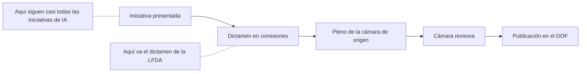
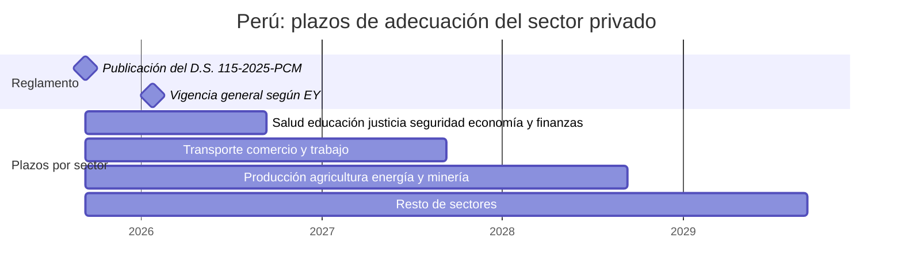
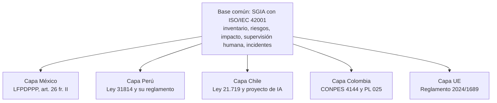

# México y Latinoamérica

:material-scale-balance: Regulación
:material-clock-outline: 25 min de lectura

!!! abstract "En una frase"
    En México no hay todavía una ley de IA, pero la IA ya está regulada por la vía de los datos personales, los contratos y algunas reformas puntuales; entre los países que revisamos, Perú es el único con una ley de IA y su reglamento vigentes, y el resto avanza con proyectos y políticas. Un SGIA con ISO/IEC 42001 te sirve como base común para todos esos frentes.

!!! legal "Información orientativa, con fecha de consulta"
    Esta página describe el estado de leyes, proyectos y políticas con información consultada el **9 de octubre de 2026**. Cada fecha, artículo y cifra lleva su fuente en una nota al pie, y te avisamos cuando la fuente es secundaria. Es material de orientación, **no asesoría legal**: los proyectos cambian de una semana a otra y la aplicación de una ley depende de los hechos de cada caso. Antes de decidir, consulta el texto oficial y a un abogado del país correspondiente (ver [aviso legal](../acerca-de.md#aviso-legal)).

## El panorama en cinco ideas {#panorama}

1. **México no tiene una ley general de IA** ni una reforma constitucional aprobada para legislar en la materia; hay muchas iniciativas, y conviene tratarlas como lo que son.
2. **La regla dura que hoy pesa sobre la IA en México es la nueva LFPDPPP**, vigente desde marzo de 2025, con un derecho expreso de oposición a ciertas decisiones automatizadas[^1].
3. **Perú es el caso más avanzado**: ley de 2023, reglamento de 2025, clasificación por riesgo y una referencia expresa a ISO/IEC 42001 para el sector público[^2][^3].
4. **Brasil, Chile y Colombia** tienen proyectos de ley en trámite; Chile, además, tiene una nueva ley de datos personales, próxima a entrar en plena vigencia, con reglas sobre decisiones automatizadas[^4].
5. **Los instrumentos internacionales** (UNESCO, OCDE, Consejo de Europa) orientan; solo el convenio del Consejo de Europa es un tratado, y el único firmante latinoamericano que pudimos confirmar es Uruguay.

## México {#mexico}

### El estado real: no hay ley general de IA {#mexico-estado}

Al 9 de octubre de 2026 no hay una ley general ni federal de inteligencia artificial aprobada y publicada en el Diario Oficial de la Federación (DOF), ni una reforma constitucional aprobada que faculte al Congreso de la Unión para legislar en la materia[^5][^6]. Lo que sí hay es mucha actividad:

- **Reforma constitucional al art. 73.** El senador Saúl Monreal presentó el 3 de febrero de 2026 una iniciativa para añadir una fracción XXXII, y la diputada Gabriela Jiménez Godoy presentó en agosto de 2026, ante la Comisión Permanente, otra para reformar la fracción XVII y facultar al Congreso a legislar sobre "el uso y la implementación de los sistemas de inteligencia artificial". Ambas son **iniciativas**[^6]. Una reforma constitucional requiere dos tercios de los votos en ambas cámaras y la aprobación de la mayoría de las legislaturas estatales[^6].
- **Comisión de IA del Senado.** El 16 de octubre de 2025, la Comisión de Análisis, Seguimiento y Evaluación sobre la Aplicación y Desarrollo de la IA en México aprobó un plan de trabajo con la meta de construir una "ley general para regular y fomentar el uso de la inteligencia artificial", analizando antes "el trazo constitucional". Es un plan, no una iniciativa formal[^5]. En abril de 2026 se anunció un proyecto de unos 223 artículos que, al cierre del periodo ordinario, no se votó en el pleno[^7].
- **Otras iniciativas, todas en comisión o solo presentadas**, según fuentes secundarias: una "Ley Nacional para Regular el Uso de la IA" que propone una Agencia Nacional de IA (senadora Karina Ruiz, 11 de febrero de 2026), una "Ley Federal para el Desarrollo Ético, Soberano e Inclusivo de la IA" (Cámara de Diputados, 24 de julio de 2026) y una "Ley General para la Regulación y Uso Responsable de la IA" (diputada Merilyn Gómez Pozos)[^8].
- **Iniciativa del Grupo Parlamentario del PAN en el Senado**, documento fechado el 29 de septiembre de 2026: propone una "Ley General para el Desarrollo de la Inteligencia Artificial y el Impulso del Futuro Digital" y una "Secretaría de Inteligencia Artificial y Futuro Digital"; su exposición de motivos describe el modelo europeo de prácticas prohibidas y sistemas de alto riesgo. Es solo una iniciativa[^9].
- **Dictamen de reforma a la Ley Federal del Derecho de Autor** sobre responsabilidad de plataformas (conocido en medios como "Ley Antimemes"): obliga a retirar contenidos infractores, incluidos los "alterados con IA". La Comisión de Economía, Comercio y Competitividad de la Cámara de Diputados lo aprobó el 29 de septiembre de 2026 por 18 votos contra 6; le faltan el Pleno y el Senado[^10].
- **Foros del Ejecutivo.** El 20 de julio de 2026 la Presidenta anunció foros nacionales para construir una propuesta de regulación de plataformas digitales, redes sociales e IA, con atención a niñas, niños y adolescentes; el 9 de octubre de 2026 reiteró que cualquier propuesta general se someterá a discusión pública[^11].

!!! tip "Cómo leer una noticia sobre «la ley de IA en México»"
    Pregúntate tres cosas: ¿es una **iniciativa**, un **dictamen** o una **ley publicada en el DOF**? ¿Es **federal**, **general** o **estatal**? ¿Necesita antes una **reforma constitucional**? Si la respuesta a la primera pregunta no es "publicada en el DOF", no genera obligaciones para tu empresa, aunque sí conviene registrarla en tu monitoreo regulatorio.

### Lo que sí se publicó con contenido de IA: LFT y LFDA {#lft-lfda}

El DOF del **14 de mayo de 2026** publicó un decreto en materia de derechos de las personas trabajadoras artistas intérpretes o ejecutantes que reforma la Ley Federal del Trabajo (LFT) y la Ley Federal del Derecho de Autor (LFDA), con referencias expresas a la IA[^12]:

| Ley y artículo | Texto (fragmento citado) |
|---|---|
| LFT, art. 305 Bis | Los contratos de las personas artistas deben estipular "las condiciones y la remuneración correspondiente para la utilización de su imagen o voz a través de sistemas de inteligencia artificial o cualquier otra tecnología" |
| LFDA, art. 87 | La protección de la imagen y la voz "abarca los resultados generados por sistemas de inteligencia artificial" |
| LFDA, art. 102 | "Los programas de computación, incluidos los de inteligencia artificial, se protegen en los mismos términos que las obras literarias" |
| LFDA, art. 118, fr. VII | Derecho a oponerse a "La suplantación de sus interpretaciones o ejecuciones por sistemas de inteligencia artificial" |
| LFDA, art. 121 | La clonación de la voz o la imagen con IA "requerirá de un acuerdo previo y por escrito" |

Su alcance es acotado: protege a artistas intérpretes y ejecutantes. Aun así, si tu empresa usa voces sintéticas, avatares o clones de voz en publicidad, capacitación o atención a clientes, en nuestra lectura conviene verificar los derechos de uso de voz e imagen antes de generar el contenido. En ISO/IEC 42001 eso cabe en [A.7.3](../anexo-a/a7-datos.md#a-7-3) (derechos sobre los datos que adquieres) y en [A.10.3](../anexo-a/a10-terceros.md#a-10-3) (lo que te entregan tus proveedores). Los nombres de los controles que usamos son traducción libre de referencia.

### Otras piezas del marco: ATDT y LMTR {#atdt-lmtr}

- **Agencia de Transformación Digital y Telecomunicaciones (ATDT).** La fecha del decreto de reforma a la Ley Orgánica de la Administración Pública Federal (LOAPF), DOF del 28 de noviembre de 2024, está verificada; que ese decreto creó la ATDT lo confirman fuentes secundarias[^13].
- **Ley en Materia de Telecomunicaciones y Radiodifusión (LMTR).** Se publicó en el DOF el 16 de julio de 2025, entró en vigor al día siguiente y crea la Comisión Reguladora de Telecomunicaciones como "órgano administrativo desconcentrado de la Agencia" (art. 7). Su texto no contiene las expresiones "inteligencia artificial", "algoritmo" ni "automatizado"[^14].

### La nueva LFPDPPP {#lfpdppp}

#### Publicación, vigencia y autoridad

La nueva Ley Federal de Protección de Datos Personales en Posesión de los Particulares se publicó en la edición vespertina del DOF del **20 de marzo de 2025**, como Artículo Tercero del decreto que también expidió las leyes generales de transparencia y de datos en posesión de sujetos obligados. Entró en vigor el **21 de marzo de 2025**: el Transitorio Primero dice "El presente Decreto entrará en vigor al día siguiente de su publicación en el Diario Oficial de la Federación". El Transitorio Segundo abrogó la ley del 5 de julio de 2010. Su única reforma posterior, publicada en el DOF el 14 de noviembre de 2025, solo modificó el art. 4[^1].

La autoridad cambió. El art. 2, fr. XV, define "Secretaría: Secretaría Anticorrupción y Buen Gobierno", y el art. 59 dispone que las infracciones "serán sancionadas por la Secretaría". Los transitorios trasladan a esa Secretaría el personal, los expedientes y los procedimientos en trámite del INAI, que se extinguió con el decreto constitucional de simplificación orgánica publicado en el DOF el 20 de diciembre de 2024[^1].

#### Decisiones automatizadas: el art. 26, fracción II

La ley define el tratamiento como cualquier operación "efectuadas mediante procedimientos manuales o automatizados aplicados a los datos personales" (art. 2, fr. XIX)[^1]. Y en el derecho de oposición incluye la disposición más relevante para la IA. El titular puede oponerse, o exigir que cese el tratamiento, cuando[^1]:

> "Sus datos personales sean objeto de un tratamiento automatizado, el cual le produzca efectos jurídicos no deseados o afecte de manera significativa sus intereses, derechos o libertades, y estén destinados a evaluar, sin intervención humana, determinados aspectos personales de la misma o analizar o predecir, en particular, su rendimiento profesional, situación económica, estado de salud, preferencias sexuales, fiabilidad o comportamiento."
>
> — LFPDPPP, art. 26, fr. II

El mismo artículo marca la excepción: "No procederá el ejercicio del derecho de oposición en aquellos casos en los que el tratamiento sea necesario para el cumplimiento de una obligación legal impuesta al responsable"[^1].

En nuestra lectura, deben coincidir cuatro elementos: tratamiento **automatizado**, **sin intervención humana**, que **evalúa o predice aspectos personales** (situación económica, fiabilidad, comportamiento, rendimiento profesional, salud) y que produce **efectos jurídicos no deseados o una afectación significativa**. Un modelo de crédito con rechazo automático, un filtro automático de candidaturas o un sistema que decide primas de seguro pueden encajar. Un asistente que contesta preguntas frecuentes, en principio, no.

#### Aviso de privacidad, consentimiento, seguridad y vulneraciones

- **Aviso de privacidad (arts. 14 a 17).** El art. 15 fija el contenido mínimo: identidad y domicilio del responsable, datos que se tratarán (señalando los sensibles), finalidades (distinguiendo las que requieren consentimiento), opciones para limitar uso o divulgación, mecanismos para ejercer los derechos ARCO y procedimiento para comunicar cambios. **No menciona expresamente las decisiones automatizadas ni la IA.** En medios electrónicos, el art. 16 pide una modalidad simplificada con las fracciones I a IV del art. 15 e indicando dónde consultar el aviso integral[^1].
- **Consentimiento.** Tácito como regla general, expreso para datos financieros o patrimoniales (art. 7) y expreso y por escrito para datos sensibles (art. 8)[^1].
- **Seguridad (art. 18).** Medidas administrativas, técnicas y físicas que consideren "el riesgo existente" y "el desarrollo tecnológico"[^1].
- **Vulneraciones (art. 19).** Aviso inmediato de las vulneraciones que afecten de forma significativa[^1].

En nuestra lectura, aunque el art. 15 no hable de IA, si usas datos personales para entrenar o mejorar modelos, esa es una **finalidad** que tiene que aparecer en el aviso; y si tu sistema decide sin intervención humana, informarlo de forma clara te prepara para el ejercicio del art. 26, fr. II.

#### Sanciones

El art. 59 prevé multas de 100 a 160 000 UMA o de 200 a 320 000 UMA, según la fracción, y una multa adicional de 100 a 320 000 UMA si la infracción persiste; los montos pueden duplicarse cuando se trata de datos sensibles. Los arts. 62 a 64 tipifican delitos con prisión de 3 meses a 3 años y de 6 meses a 5 años, que se duplican con datos sensibles[^1].

#### El reglamento pendiente y el art. 112 de 2011

A la fecha de consulta **no encontramos un reglamento nuevo** publicado bajo la ley de 2025. El Transitorio Décimo Segundo daba al Ejecutivo 90 días naturales para adecuar los reglamentos, y la Cámara de Diputados sigue listando como "TEXTO VIGENTE" el Reglamento publicado en el DOF el 21 de diciembre de 2011[^1][^15]. Un análisis de julio de 2026 sostiene que el reglamento nuevo "sigue sin publicarse" y que el de 2011 se aplica "de forma supletoria en todo lo que no contradiga a la nueva ley"; esa supletoriedad es una **interpretación**, no una norma expresa[^16].

Importa por su art. 112, que trata justo las decisiones sin valoración humana[^15]:

> "Cuando se traten datos personales como parte de un proceso de toma de decisiones sin que intervenga la valoración de una persona física, el responsable deberá informar al titular que esta situación ocurre."
>
> — Reglamento de la LFPDPPP (DOF, 21 de diciembre de 2011), art. 112

El mismo artículo prevé que el titular use sus derechos de acceso y rectificación para "solicitar la reconsideración de la decisión tomada"[^15].

!!! legal "Una cuestión abierta"
    Que el art. 112 siga siendo exigible bajo la ley de 2025 es dudoso y requiere revisión jurídica. En nuestra lectura, aunque no lo fuera, informar al titular y ofrecer reconsideración es la forma más sencilla de demostrar que tomas en serio el art. 26, fr. II, y cuesta poco si ya tienes un SGIA.

### Qué significa la LFPDPPP para tu SGIA {#lfpdppp-sgia}

ISO/IEC 42001 no es una norma de privacidad, pero sus controles cubren buena parte del terreno donde la IA y los datos personales se cruzan. Esta tabla es nuestra propuesta de enlace:

| Obligación de datos personales | Controles de 42001 que ayudan | Cómo se ve en la práctica |
|---|---|---|
| Aviso de privacidad con finalidades y datos (arts. 15 y 16) | [A.8.2](../anexo-a/a8-informacion-partes-interesadas.md#a-8-2), [A.7.3](../anexo-a/a7-datos.md#a-7-3), [A.9.4](../anexo-a/a9-uso.md#a-9-4) | La finalidad "desarrollo y mejora de modelos" figura en el aviso; el aviso simplificado aparece en el primer mensaje del chatbot |
| Consentimiento tácito, expreso o por escrito (arts. 7 y 8) | [A.7.3](../anexo-a/a7-datos.md#a-7-3), [A.7.5](../anexo-a/a7-datos.md#a-7-5), [A.7.2](../anexo-a/a7-datos.md#a-7-2) | Antes de entrenar, se verifica que cada fuente de datos tenga el consentimiento que corresponde y se registra su procedencia |
| Oposición a decisiones automatizadas (art. 26, fr. II) | [A.9.3](../anexo-a/a9-uso.md#a-9-3), [A.5.4](../anexo-a/a5-evaluacion-de-impacto.md#a-5-4), [A.6.2.2](../anexo-a/a6-ciclo-de-vida.md#a-6-2-2), [A.8.3](../anexo-a/a8-informacion-partes-interesadas.md#a-8-3) | Se decide dónde hay revisión humana, se evalúa el impacto en las personas y existe un canal para pedir reconsideración |
| Informar decisiones sin valoración humana (art. 112 del reglamento de 2011, si se considera aplicable) | [A.8.2](../anexo-a/a8-informacion-partes-interesadas.md#a-8-2), [A.8.3](../anexo-a/a8-informacion-partes-interesadas.md#a-8-3) | Mensaje claro en la resolución y procedimiento para revisarla |
| Medidas de seguridad según el riesgo y la tecnología (art. 18) | [A.6.2.4](../anexo-a/a6-ciclo-de-vida.md#a-6-2-4), [A.6.2.6](../anexo-a/a6-ciclo-de-vida.md#a-6-2-6), [A.4.5](../anexo-a/a4-recursos.md#a-4-5); tu SGSI si tienes ISO 27001 | Pruebas frente a fugas por instrucciones maliciosas, monitoreo de amenazas propias de la IA y controles de acceso a los datos de entrenamiento |
| Aviso de vulneraciones significativas (art. 19) | [A.8.4](../anexo-a/a8-informacion-partes-interesadas.md#a-8-4), [A.3.3](../anexo-a/a3-organizacion-interna.md#a-3-3), [10.2](../clausulas/c10-mejora.md#c-10-2) | El plan de incidentes de IA incluye el análisis de si hubo vulneración de datos personales |
| Relación con encargados y terceros que tratan datos por cuenta tuya | [A.10.2](../anexo-a/a10-terceros.md#a-10-2), [A.10.3](../anexo-a/a10-terceros.md#a-10-3) | Contratos con el proveedor del chatbot o del modelo que digan si puede usar tus datos para entrenar |
| Derechos ARCO | [A.7.5](../anexo-a/a7-datos.md#a-7-5), [A.6.2.8](../anexo-a/a6-ciclo-de-vida.md#a-6-2-8), [A.8.3](../anexo-a/a8-informacion-partes-interesadas.md#a-8-3) | Puedes localizar los datos de una persona en conjuntos de entrenamiento y en bitácoras, y responder a tiempo |

La brecha que queda es la propia del programa de privacidad: inventario de tratamientos, avisos, atención de derechos ARCO y contratos con encargados. Si quieres un sistema de gestión certificable también para la privacidad, ISO/IEC 27701:2025 es hoy una norma de sistema de gestión independiente[^17], y se integra bien con el SGIA (ver [La familia de normas de IA](../fundamentos/familia-de-normas.md)).

### Políticas que orientan, pero no obligan {#politicas-mx}

**Principios de Chapultepec.** El 29 de enero de 2026, la Secretaría de Ciencia, Humanidades, Tecnología e Innovación (Secihti) y la ATDT presentaron la "Declaración de ética y buenas prácticas para el uso y desarrollo de la IA", basada en diez principios y presentada como "una guía no vinculante"[^18]. Dos de ellos se traducen casi directo a controles del SGIA:

| Principio de Chapultepec | Dónde vive en tu SGIA |
|---|---|
| "Toda decisión apoyada por IA, debe tener responsables humanos" | [A.3.2](../anexo-a/a3-organizacion-interna.md#a-3-2) (matriz de responsabilidades por sistema) y [A.9.3](../anexo-a/a9-uso.md#a-9-3) (dónde hay supervisión humana) |
| "Si una decisión no puede explicarse, no debe automatizarse" | [A.6.2.2](../anexo-a/a6-ciclo-de-vida.md#a-6-2-2) (requisitos de explicabilidad), [A.8.2](../anexo-a/a8-informacion-partes-interesadas.md#a-8-2) (información para los usuarios) y [A.5.4](../anexo-a/a5-evaluacion-de-impacto.md#a-5-4) (impacto en las personas) |

**Plan Nacional de Inteligencia Artificial.** Según fuentes secundarias, la ATDT presentó en 2026 un plan con tres pilares (marco ético y legal; capacidades, talento y software público; e infraestructura, que incluye el supercomputador "Coatlicue") que propone "expedir un marco legal federal en materia de IA". Es una estrategia no vinculante y su fecha exacta es incierta: un rastreador la ubica el 1 de abril de 2026 y una nota periodística es del 9 de septiembre de 2026; no pudimos abrir el documento oficial[^19].

**Agenda Nacional de IA.** La Alianza Nacional de IA (ANIA), impulsada desde el Senado y formalizada en 2023, presentó en 2024 una propuesta de agenda para el gobierno 2024-2030 con 8 recomendaciones y 56 acciones, según CAF. Es una propuesta de política, no una norma[^20].

**Ámbito estatal.** El Congreso del Estado de México aprobó el 28 de abril de 2026 una ley para fomentar el uso responsable de la IA en la educación media superior y superior, según fuentes secundarias[^7].

Estas políticas no generan obligaciones, pero son buenas **entradas para tu política de IA** ([A.2.2](../anexo-a/a2-politicas.md#a-2-2)): citar los Principios de Chapultepec muestra a un cliente del sector público que tu marco está alineado con la referencia nacional.

### Certificación ISO/IEC 42001 en México {#certificacion-mx}

La certificación es **voluntaria**: ninguna ley mexicana la exige. Al 9 de octubre de 2026, el buscador de la entidad mexicana de acreditación (ema) mostraba dos organismos de certificación acreditados para ISO/IEC 42001:2023: **NYCE**, con el programa vigente desde el 8 de diciembre de 2024, y **QSR**, desde el 30 de julio de 2025. En ambos casos la norma de acreditación es ISO/IEC 17021-1:2015 y las fichas no mencionan ISO/IEC 42006[^21]. **No encontramos una NMX** que adopte ISO/IEC 42001 ni su declaratoria de vigencia en el DOF; NYCE ofrece la certificación sobre la norma internacional[^22][^21]. El detalle del proceso está en [Cómo se certifica](../auditoria/como-se-certifica.md).

### Sectores regulados {#sectores}

Que no exista una ley de IA no significa que la IA opere en el vacío. En nuestra lectura, las reglas sectoriales que ya te aplican siguen aplicando cuando una decisión la apoya un modelo:

- **Servicios financieros.** Si eres entidad financiera, tus supervisores, tus reglas de gestión de riesgos y las de protección a usuarios (con la Condusef como referencia para las quejas) no cambian porque el análisis lo haga un algoritmo.
- **Fiscal.** Si una IA captura un CFDI con error, la responsabilidad frente al SAT sigue siendo de quien declara.
- **Telecomunicaciones.** La LMTR no menciona la IA, pero sus obligaciones aplican a los servicios que la usen[^14].
- **Trabajo y creación artística.** La reforma de 2026 a la LFT y la LFDA ya regula voz e imagen de artistas frente a la IA[^12].

Revisa con tu área legal qué disposiciones de tu sector tocan tus sistemas y regístralas en [A.8.5](../anexo-a/a8-informacion-partes-interesadas.md#a-8-5). No te inventes obligaciones, pero tampoco des por hecho que "como no hay ley de IA, no hay reglas".

### Ejemplo: Contadores Alameda en México {#ejemplo-alameda}

??? example "Caso: Contadores Alameda — qué le aplica hoy y qué vigila"
    Contadores Alameda, despacho de Querétaro con unas 400 PyMEs cliente, **usa IA de terceros**: un asistente de ofimática, el chatbot "Alma" en WhatsApp (contratado como SaaS a BotNorte) y un módulo de captura de CFDI.

    **Lo que le aplica hoy.** No hay ley de IA, pero sí la LFPDPPP:

    - **Alma** trata datos personales de los clientes que escriben por WhatsApp. Como es un medio electrónico, el aviso simplificado puede ir en el primer mensaje, con enlace al aviso integral (art. 16)[^1]. El mismo mensaje dice que Alma es un asistente automatizado y cómo hablar con una persona ([A.8.2](../anexo-a/a8-informacion-partes-interesadas.md#a-8-2)).
    - **El incidente de la nómina.** Un colaborador pegó una nómina con datos personales en un chatbot gratuito. En nuestra lectura, el despacho actuaba como encargado de su PyME cliente, así que le avisó sin demora, documentó el incidente ([A.8.4](../anexo-a/a8-informacion-partes-interesadas.md#a-8-4), [10.2](../clausulas/c10-mejora.md#c-10-2)) y evaluó con ella si hubo una vulneración significativa (art. 19)[^1]. La acción correctiva fue una política de uso aceptable con herramientas autorizadas ([A.9.2](../anexo-a/a9-uso.md#a-9-2)).
    - **BotNorte** trata datos por cuenta del despacho: el contrato dice si puede usar las conversaciones para entrenar y cómo se borran ([A.10.3](../anexo-a/a10-terceros.md#a-10-3)).

    **Lo que vigila.** Las iniciativas de ley general, la reforma constitucional y el reglamento de la LFPDPPP entran en su registro de requisitos con estado "iniciativa" o "pendiente", y se revisan cada trimestre en el comité del SGIA y en la [revisión por la dirección](../clausulas/c9-evaluacion-del-desempeno.md#c-9-3).

    **Lo que le pide el mercado.** El cuestionario de gobierno de IA del banco cliente es, en la práctica, una obligación contractual más; se registra en [A.8.5](../anexo-a/a8-informacion-partes-interesadas.md#a-8-5) y se responde con evidencia del SGIA. La matriz de responsabilidades nombra un dueño humano por cada sistema, en línea con el principio de Chapultepec sobre responsables humanos[^18].

## Latinoamérica {#latam}

### Perú: ley, reglamento y una referencia expresa a ISO/IEC 42001 {#peru}

**Ley 31814**, "Ley que promueve el uso de la inteligencia artificial en favor del desarrollo económico y social del país", publicada en El Peruano el **5 de julio de 2023**. El principio a) de su Título Preliminar dice: "Se promueve un enfoque basado en riesgos para el uso y desarrollo de la inteligencia artificial"[^2].

**Reglamento: Decreto Supremo N.° 115-2025-PCM**, publicado el **9 de septiembre de 2025** (firmado el día anterior), con 6 títulos, 36 artículos y 6 disposiciones complementarias finales. Entra en vigencia "a los noventa (90) días hábiles siguientes de su publicación", salvo cuatro disposiciones finales que rigen desde el día siguiente[^3]. Según EY, la vigencia general efectiva fue el **22 de enero de 2026**; es un cálculo de esa firma[^23].

**Clasificación de riesgos (arts. 22 a 24)**[^3]:

- **Uso indebido (prohibido):** el que pueda "impactar de manera irreversible, significativa y negativa en los derechos fundamentales"; incluye la identificación biométrica en tiempo real en espacios públicos, con excepciones, y la predicción de delitos basada en perfiles.
- **Riesgo alto:** sistemas "cuyo uso supone un riesgo para la vida humana, la dignidad, la libertad", por ejemplo la **evaluación crediticia** y las decisiones de contratación o despido.
- **Riesgo aceptable:** todo lo demás.

**Obligaciones que prevé el reglamento**, entre otras: transparencia algorítmica (art. 25), análisis de impacto previo obligatorio para entidades públicas (art. 30.1) y voluntario para privadas (art. 32.1), un registro actualizado (art. 31.1) y supervisión humana con capacidad de "detener, corregir o invalidar las decisiones" (art. 31.4)[^3]. Qué artículos alcanzan a cada tipo de entidad y de sistema conviene confirmarlo con asesoría local.

**ISO/IEC 42001 en la norma peruana.** Es el dato más relevante de la región para esta guía[^3]:

- El **art. 28.2** dispone que las entidades públicas que desarrollen sistemas de IA "deben usar la NTP-ISO/IEC 42001:2025".
- El **art. 33.1** dice que la Secretaría de Gobierno y Transformación Digital (SGTD) "promueve" el uso de la NTP-ISO/IEC 42001:2025, de ISO/IEC 23053:2022, de ISO/IEC 38507:2022 y de otras.
- La **sexta disposición complementaria final** hace obligatorias para las entidades públicas la NTP-ISO/IEC 27002 y la NTP-ISO 31000.

Esa NTP existe: INACAL aprobó la NTP-ISO/IEC 42001:2025 (primera edición) con la R.D. N.° 000013-2025-INACAL/DN, publicada en El Peruano el 30 de junio de 2025, y su boletín la presenta como basada en ISO/IEC 42001[^24]. La resolución no indica el grado de equivalencia con la norma internacional; si necesitas saber si es una adopción idéntica, consulta la ficha en INACAL.

**Plazos para las entidades públicas** (primera disposición complementaria final, contados desde el día siguiente a la publicación del decreto; se refieren al art. 25 y al capítulo del reglamento que contiene el art. 28.2)[^3]: un año para los poderes Ejecutivo, Legislativo y Judicial y los organismos constitucionales autónomos, plazo que ya se cumplió en septiembre de 2026; dos años para EsSalud, los gobiernos regionales, las universidades públicas y las empresas públicas; tres años para los gobiernos locales de tipo A, B y C, y aplicación facultativa para los de tipo D a G.

**Plazos de adecuación del sector privado** (primera disposición complementaria final, contados desde el día siguiente a la publicación; las fechas son cálculo de EY y hay plazos diferenciados para las MYPE)[^3][^23]:

| Sector | Plazo | Fecha según EY |
|---|---|---|
| Salud, educación, justicia, seguridad, economía y finanzas | 1 año | 10 de septiembre de 2026 |
| Transporte, comercio y trabajo | 2 años | 10 de septiembre de 2027 |
| Producción, agricultura, energía y minería | 3 años | 10 de septiembre de 2028 |
| Resto | 4 años | 10 de septiembre de 2029 |

Además, la **Estrategia Nacional de IA 2026-2030** se aprobó con la Resolución Ministerial N.° 152-2026-PCM, emitida el 29 de abril de 2026 y publicada el 1 de mayo de 2026[^25].

### Brasil: el PL 2338/2023 sigue en la Cámara {#brasil}

El Senado aprobó el 10 de diciembre de 2024, en votación simbólica, el sustitutivo del **PL 2338/2023** (relator: senador Eduardo Gomes) y lo envió a la Cámara de Diputados. El texto clasifica los sistemas por riesgo, prohíbe los de "riesgo excesivo", fija reglas para el alto riesgo, designa a la ANPD como autoridad competente y prevé multas de hasta R$ 50 millones o el 2 % de la facturación; la mayoría de sus disposiciones entrarían en vigor a los 730 días y algunas a los 180 días de publicada la ley[^26].

En la Cámara, el proyecto se presentó el 17 de marzo de 2025; su ficha oficial dice "Aguardando Parecer do(a) Relator(a) na Comissão Especial", con régimen de "Prioridade", y en septiembre de 2026 se le anexaron más proyectos. **No es ley**[^27]. Según fuentes secundarias, la comisión especial se instaló el 20 de mayo de 2025, el relator anunció el 24 de agosto de 2026 que la votación quedaría para después de las elecciones de octubre de 2026 y se le anexó el PL 6237/2025 del Ejecutivo[^28].

Sobre la norma técnica: un revendedor muestra la ABNT NBR ISO/IEC 42001 (edición de abril de 2024) a la vez como vigente y como cancelada, así que su estado es contradictorio[^24].

### Chile: proyecto en el Senado y nueva ley de datos {#chile}

El proyecto que regula los sistemas de IA (boletines 16821-19 y 15869-19, refundidos) ingresó por mensaje del Ejecutivo el 7 de mayo de 2024, según fuentes secundarias[^29]. La Cámara lo despachó y, desde octubre de 2025, está en **segundo trámite constitucional en el Senado**, en la Comisión de Desafíos del Futuro, Ciencia, Tecnología e Innovación. Clasifica los usos en "riesgo inaceptable, alto riesgo, riesgo limitado y sin riesgo evidente", prevé multas de 5 000 a 20 000 UTM, encarga la fiscalización a la Agencia de Protección de Datos Personales y crea un Consejo Asesor Técnico de IA[^30].

Con el nuevo gobierno hubo un giro. El 26 de mayo de 2026, la ministra de Ciencia, Ximena Lincolao, presentó al Senado una "ley marco de IA para la innovación, la productividad y la competitividad". El presidente de la comisión anticipó "Muy probablemente una indicación sustitutiva", con un posible paso de la revisión previa (*ex ante*) a la posterior (*ex post*) y con modelos de Japón y Singapur en lugar del europeo. **No está aprobado**[^31]. La última anotación que vimos, del 1 de septiembre de 2026, registra que el Ejecutivo retiró la urgencia y presentó una urgencia simple (dato de fuente secundaria)[^32].

Lo que sí es ley: la **Ley 21.719**, publicada el 13 de diciembre de 2024, reforma la Ley 19.628 de protección de datos personales y crea la Agencia de Protección de Datos Personales. Entra en plena vigencia el **1 de diciembre de 2026**. Entre otros cambios, agrega a la Ley 19.628 un **art. 8° bis** sobre decisiones individuales automatizadas: la persona puede oponerse y no ser objeto de decisiones basadas en el tratamiento automatizado de sus datos, incluida la elaboración de perfiles, cuando le produzcan efectos jurídicos o la afecten significativamente, con excepciones como la ejecución de un contrato o el consentimiento expreso[^4]. A diferencia del art. 22 del RGPD europeo, el texto no dice "únicamente"; cómo se interpretará ese matiz lo dirá la práctica de la Agencia. Para cualquier empresa que decide con modelos sobre personas en Chile, esa es la fecha que hay que tener en el calendario.

### Colombia: política pública y un proyecto nuevo {#colombia}

El **CONPES 4144, "Política Nacional de Inteligencia Artificial"**, se aprobó el 14 de febrero de 2025, con 106 acciones hasta 2030 y una inversión cercana a COP 479 273 millones. Es una **política pública, no una ley**[^33].

El proyecto del Gobierno (PL 043 de 2025 Senado / 324 de 2025 Cámara) "fue archivado de acuerdo a lo dispuesto en el Artículo 190 de la Ley 5 de 1992". El 21 de julio de 2026, congresistas del Pacto Histórico radicaron el **PL 025 de 2026 Cámara**, que retoma la propuesta con un enfoque por niveles de riesgo inspirado en la UE; está en ponencia para primer debate en la Comisión Sexta de la Cámara, con ponentes designados el 29 de agosto y el 3 de septiembre de 2026. **No es ley**[^34].

Un despacho internacional afirma que Colombia "adoptó" ISO/IEC 42001:2023, sin dar designación NTC ni organismo; no pudimos confirmarlo[^24].

### Argentina {#argentina}

No hay una ley nacional de IA sancionada. Un análisis de CONICET y la UBA contó 53 iniciativas sobre IA presentadas en 2025, de las cuales unas 11 buscan una ley integral; el Ejecutivo se ha pronunciado por no regular, y la provincia de Buenos Aires dictó la Resolución 9/2025 sobre el uso de sistemas algorítmicos en la administración pública. Todo esto proviene de fuentes secundarias[^35].

### Uruguay {#uruguay}

La Ley 20.212 (promulgada el 6 de noviembre de 2023 y publicada el 17 de noviembre de 2023), en su art. 74, encarga a AGESIC "diseñar y desarrollar una estrategia nacional de datos e inteligencia artificial basada en estándares internacionales" y le da 180 días para presentar al Poder Legislativo un informe con recomendaciones regulatorias[^36]. Existe una Estrategia Nacional de IA 2024-2030, pero no encontramos una ley específica de IA aprobada en 2025 o 2026[^37]. Uruguay es, además, el primer país latinoamericano que firmó el Convenio Marco del Consejo de Europa sobre IA, el 2 de septiembre de 2025 (fuente secundaria)[^38].

### Declaraciones regionales e índices {#regional}

- **Declaración de Santiago** "para promover una inteligencia artificial ética en América Latina y el Caribe" (23 y 24 de octubre de 2023): la adoptaron unos 20 países, entre ellos México, y creó un grupo de trabajo con miras a un consejo intergubernamental de IA. No es vinculante[^39].
- **Declaración de Montevideo y Hoja de Ruta regional 2024-2025**, adoptadas en la Segunda Cumbre Ministerial sobre Ética de la IA (3 y 4 de octubre de 2024, organizada por AGESIC, UNESCO y CAF)[^40].
- **Declaración de Santo Domingo y Hoja de Ruta 2026-2027**, aprobadas en la Tercera Cumbre (25 y 26 de junio de 2026), con un horizonte de 12 meses y seguimiento trimestral[^41].
- **Índice Latinoamericano de IA (ILIA).** La tercera edición (ILIA 2025), elaborada por CENIA con la CEPAL, se presentó el 3 de octubre de 2025; la publicación de la CEPAL es de marzo de 2026, cubre 19 países y ubica a Chile, Brasil y Uruguay en los tres primeros lugares. No encontramos una edición 2026[^42].

## Instrumentos internacionales {#internacionales}

| Instrumento | Qué es | Datos clave | Para tu SGIA |
|---|---|---|---|
| Recomendación de la UNESCO sobre la Ética de la IA | Recomendación de aplicación voluntaria | Adoptada el 23 de noviembre de 2021 en la 41.ª Conferencia General, por aclamación de 193 Estados miembros[^43] | Fuente de principios para tu política de IA ([A.2.2](../anexo-a/a2-politicas.md#a-2-2)) |
| Principios de IA de la OCDE (OECD/LEGAL/0449) | Recomendación del Consejo de la OCDE | Adoptados el 22 de mayo de 2019, revisados el 8 de noviembre de 2023 y actualizados el 3 de mayo de 2024; 47 adherentes, entre ellos Argentina, Brasil, Chile, Colombia, Costa Rica, México y Perú (número y lista: fuente secundaria)[^44] | Base para tus objetivos de desarrollo y uso responsable ([A.6.1.2](../anexo-a/a6-ciclo-de-vida.md#a-6-1-2), [A.9.3](../anexo-a/a9-uso.md#a-9-3)) |
| Convenio Marco del Consejo de Europa sobre IA y Derechos Humanos, Democracia y Estado de Derecho (CETS 225) | Tratado internacional | Abierto a la firma en Vilna el 5 de septiembre de 2024; la UE lo concluyó con la Decisión (UE) 2026/1080 del Consejo, de 21 de abril de 2026. Argentina, Costa Rica, México, Perú y Uruguay participaron en la negociación; **el único firmante latinoamericano confirmado es Uruguay**, y no encontramos evidencia de que México lo haya firmado[^45] | Hoy, referencia de buenas prácticas; obligaría solo a los Estados que lo ratifiquen |

Ninguno de estos instrumentos te obliga directamente como empresa. Su valor práctico está en que los reguladores de la región los citan al redactar sus proyectos, así que alinear tu SGIA con ellos te adelanta a lo que viene. Lo desarrollamos en [Principios de IA responsable](../fundamentos/principios-ia-responsable.md).

## Tabla comparativa por país {#comparativa}

Estado al 9 de octubre de 2026, con las fuentes citadas en cada sección:

| País | Instrumento principal | Tipo | Estado | Enfoque de riesgo | Relación con ISO/IEC 42001 |
|---|---|---|---|---|---|
| México | LFPDPPP; iniciativas de ley general; Principios de Chapultepec | Ley de datos; iniciativas; política | LFPDPPP vigente desde el 21/03/2025; ninguna ley de IA aprobada | La LFPDPPP regula decisiones automatizadas; algunas iniciativas retoman el modelo europeo | Certificación voluntaria; dos organismos acreditados por la ema; sin NMX |
| Perú | Ley 31814 y D.S. 115-2025-PCM | Ley y reglamento | Vigentes; plazos privados escalonados de 2026 a 2029 | Uso indebido, riesgo alto y riesgo aceptable | Obligatoria la NTP-ISO/IEC 42001:2025 para entidades públicas que desarrollen IA; promovida en general |
| Brasil | PL 2338/2023 | Proyecto de ley | Aprobado en el Senado; en comisión especial de la Cámara | Riesgo excesivo (prohibido) y alto riesgo | Sin referencia verificada en el proyecto |
| Chile | Boletines 16821-19 y 15869-19; Ley 21.719 | Proyecto; ley de datos | Proyecto en el Senado, con posible indicación sustitutiva; Ley 21.719 en plena vigencia el 01/12/2026 | Inaceptable, alto, limitado y sin riesgo evidente; posible giro a supervisión *ex post* | Sin referencia verificada |
| Colombia | CONPES 4144; PL 025 de 2026 Cámara | Política; proyecto | CONPES aprobado; proyecto en ponencia para primer debate | Por niveles, inspirado en la UE | Adopción mencionada por una fuente secundaria, sin designación NTC |
| Argentina | Iniciativas en el Congreso; Res. 9/2025 de la provincia de Buenos Aires | Proyectos; norma provincial | Sin ley nacional | Sin enfoque nacional definido | Sin referencia verificada |
| Uruguay | Ley 20.212, art. 74; Estrategia 2024-2030; Convenio del Consejo de Europa | Mandato legal; política; tratado firmado | Sin ley específica de IA | Estrategia "basada en estándares internacionales" | Sin referencia verificada |
| UE, como referencia | Reglamento (UE) 2024/1689 | Reglamento | Aplicación general desde el 02/08/2026; alto riesgo del Anexo III desde el 02/12/2027[^46] | Cuatro niveles y modelos de uso general | No da presunción de conformidad (ver [Reglamento de IA de la UE](reglamento-ia-ue.md)) |

## Qué hacer hoy si operas en varios países de la región {#que-hacer}

Si tu empresa opera en tres o cuatro países, la tentación es armar un programa de cumplimiento por país. Te recomendamos lo contrario: **un solo SGIA como base común y una capa delgada por jurisdicción**.

**1. Lleva un registro de obligaciones por jurisdicción.** Es la forma concreta de cumplir [A.8.5](../anexo-a/a8-informacion-partes-interesadas.md#a-8-5) y de alimentar [4.1](../clausulas/c4-contexto.md#c-4-1) y [4.2](../clausulas/c4-contexto.md#c-4-2). Un formato mínimo:

| Jurisdicción | Instrumento | Tipo y estado | Fecha clave | Obligación | Sistemas afectados | Control de 42001 | Dueño | Próxima revisión |
|---|---|---|---|---|---|---|---|---|
| México | LFPDPPP, art. 26, fr. II | Ley vigente | 21/03/2025 | Atender oposición a decisiones automatizadas | Score Monarca v3 | A.9.3, A.8.3 | Oficial de Privacidad | Trimestral |
| Perú | D.S. 115-2025-PCM | Reglamento vigente | Plazo sectorial según EY | Supervisión humana, registro, transparencia | Por definir si se expande | A.9.3, A.6.2.8, A.8.2 | Oficial de Cumplimiento | Trimestral |
| Chile | Art. 8° bis de la Ley 19.628, incorporado por la Ley 21.719 | Ley con vigencia plena el 01/12/2026 | 01/12/2026 | Oposición a decisiones basadas en tratamiento automatizado | Por definir | A.9.3 | Legal | Mensual hasta la vigencia |
| Colombia | PL 025 de 2026 Cámara | Proyecto | — | Ninguna todavía | — | Monitoreo (4.1) | Legal | Trimestral |

La columna "tipo y estado" es la más importante: separa lo que **obliga** (ley vigente) de lo que **conviene vigilar** (proyecto, política). Así evitas sobrecumplir con borradores que pueden cambiar y, a la vez, no te sorprende una ley publicada.

**2. Usa criterios de riesgo con un "traductor" de categorías.** En [6.1.1](../clausulas/c6-planificacion.md#c-6-1-1) defines tus propios niveles de riesgo. Agrega una tabla que diga a qué categoría equivale cada nivel en cada jurisdicción: "riesgo alto" en Perú, "alto riesgo" en la UE o en los proyectos de Chile y Brasil. Un sistema de crédito, por ejemplo, aparece como de alto riesgo en el reglamento peruano[^3].

**3. Diseña la supervisión humana una sola vez.** El denominador común de la región es el control humano sobre decisiones automatizadas: el art. 26, fr. II, de la LFPDPPP; el art. 31.4 del reglamento peruano; el art. 8° bis de la ley chilena; y los Principios de Chapultepec. Un buen diseño de [A.9.3](../anexo-a/a9-uso.md#a-9-3), con revisión humana real y un canal de reconsideración, responde a todos.

**4. Reutiliza la evaluación de impacto.** El reglamento peruano pide análisis de impacto previo a las entidades públicas y lo deja voluntario para las privadas; el Reglamento europeo prevé evaluaciones de impacto en derechos fundamentales en ciertos casos. La evaluación de [A.5](../anexo-a/a5-evaluacion-de-impacto.md) puede ser el documento base, con un anexo por país.

**5. Revisa la política y los contratos cuando cambie la ley.** Un cambio legal relevante dispara la revisión de la política ([A.2.4](../anexo-a/a2-politicas.md#a-2-4)) y de los contratos con clientes y proveedores ([A.10.2](../anexo-a/a10-terceros.md#a-10-2), [A.10.4](../anexo-a/a10-terceros.md#a-10-4)). Lleva el tema a la [revisión por la dirección](../clausulas/c9-evaluacion-del-desempeno.md#c-9-3) como cambio en cuestiones externas.

**6. Monitorea con método.** Fuentes oficiales primero (DOF, El Peruano, portales del Congreso de cada país), con fecha de consulta registrada, y un responsable que revise al menos cada trimestre. Las fuentes secundarias sirven para enterarte; las primarias, para decidir.

!!! latam "En México y Latinoamérica"
    La pregunta que más escuchamos es "¿espero a que salga la ley?". Nuestra respuesta: no esperes para lo que ya es obligatorio (datos personales, contratos, reglas sectoriales) y no corras para lo que aún es proyecto. Un SGIA te deja listo para ambas cosas: cuando se publique una ley, agregas una capa en lugar de empezar de cero.

### Ejemplo: Monarca Crédito ante una expansión regional {#ejemplo-monarca}

Monarca Crédito, fintech de la Ciudad de México constituida como SOFOM E.N.R., decide con **Score Monarca v3** sobre unos 350 000 clientes. Su modelo tiene tres bandas: aprobación automática, rechazo automático y una **banda gris** que revisan analistas. Planea expandirse a Perú, Chile y Colombia.

| País | Regla que importa | Qué reutiliza de su SGIA | Qué tendría que agregar |
|---|---|---|---|
| México | LFPDPPP, art. 26, fr. II: oposición a decisiones automatizadas que evalúan situación económica o fiabilidad[^1] | Banda gris y canal de reconsideración ([A.9.3](../anexo-a/a9-uso.md#a-9-3), [A.8.3](../anexo-a/a8-informacion-partes-interesadas.md#a-8-3)); motivos de rechazo comprensibles ([A.8.2](../anexo-a/a8-informacion-partes-interesadas.md#a-8-2)) | Revisar si el rechazo automático debe pasar siempre por la banda gris cuando el solicitante se oponga |
| Perú | La evaluación crediticia es de **riesgo alto** en el reglamento; el plazo del sector economía y finanzas es de un año, que según EY venció el 10 de septiembre de 2026[^3][^23] | Inventario, evaluación de impacto ([A.5.4](../anexo-a/a5-evaluacion-de-impacto.md#a-5-4)), bitácoras ([A.6.2.8](../anexo-a/a6-ciclo-de-vida.md#a-6-2-8)), supervisión humana | Confirmar con asesoría peruana qué obligaciones le alcanzan; revalidar el modelo con datos peruanos; publicar la información de transparencia algorítmica que corresponda |
| Chile | Art. 8° bis de la Ley 19.628 (incorporado por la Ley 21.719), desde el 1 de diciembre de 2026; proyecto de IA pendiente[^4][^31] | El mismo diseño de supervisión humana | Ajustar avisos y procedimientos a la ley chilena; vigilar si el proyecto cambia a supervisión *ex post* |
| Colombia | CONPES 4144 (política) y PL 025 de 2026 (proyecto)[^33][^34] | Registro de obligaciones y monitoreo | Nada obligatorio por ahora en materia de IA; seguir el primer debate |

La lección: el trabajo pesado (sesgo, explicabilidad, supervisión humana, bitácoras, evaluación de impacto) lo hizo una sola vez para su certificación. Cada país agrega una capa delgada de requisitos locales. Y si algún día vende en la UE, la misma base le sirve como punto de partida (ver [Reglamento de IA de la UE](reglamento-ia-ue.md#ejemplo-monarca)).

## Preguntas para tu organización {#preguntas}

- [ ] ¿Sabemos qué sistemas de IA toman o apoyan decisiones automatizadas sobre personas y si encajan en el art. 26, fr. II, de la LFPDPPP?
- [ ] ¿Nuestro aviso de privacidad menciona las finalidades ligadas a la IA, como entrenar o mejorar modelos?
- [ ] ¿Tenemos un canal para pedir reconsideración de una decisión automatizada y lo usamos de verdad?
- [ ] ¿Nuestro registro de requisitos distingue leyes vigentes, proyectos y políticas, con fecha de consulta y fuente?
- [ ] ¿Sabemos en qué países operamos o tenemos usuarios, y qué ley de datos y de IA aplica en cada uno?
- [ ] ¿Alguien revisa al menos cada trimestre el estado de las iniciativas en México y de los proyectos en la región?
- [ ] ¿Nuestros contratos con proveedores de IA dicen si pueden usar nuestros datos para entrenar?

!!! warning "Errores comunes"
    - **Tratar una iniciativa como si fuera ley.** En México hay muchas propuestas, pero ninguna ley de IA publicada en el DOF a la fecha de consulta.
    - **Creer que sin ley de IA no hay reglas.** La LFPDPPP, los contratos y las reglas sectoriales ya alcanzan a la IA.
    - **Dar por hecho que el reglamento de 2011 sigue aplicando sin matices.** Su vigencia bajo la ley nueva es una interpretación.
    - **Buscar una NMX de ISO/IEC 42001.** No la encontramos; la certificación en México se hace sobre la norma internacional.
    - **Copiar el modelo de un país a otro sin revisar.** Perú, Chile y la UE usan categorías parecidas, pero no idénticas.
    - **Olvidar las fechas que ya pasaron.** En Perú, el primer plazo sectorial venció en septiembre de 2026, según el cálculo de EY.

## Relación con otras páginas

- [Reglamento de IA de la UE](reglamento-ia-ue.md): alcance extraterritorial, calendario y relación con ISO/IEC 42001.
- [Roles en la IA](../fundamentos/roles-en-la-ia.md): roles de IA y roles de datos personales (responsable y encargado).
- [Cláusula 4](../clausulas/c4-contexto.md) y [cláusula 6](../clausulas/c6-planificacion.md): contexto, requisitos legales, criterios de riesgo y evaluación de impacto.
- [A.7 Datos](../anexo-a/a7-datos.md), [A.8 Información para las partes interesadas](../anexo-a/a8-informacion-partes-interesadas.md), [A.9 Uso](../anexo-a/a9-uso.md) y [A.10 Terceros y clientes](../anexo-a/a10-terceros.md).
- [Principios de IA responsable](../fundamentos/principios-ia-responsable.md) y [Cómo se certifica](../auditoria/como-se-certifica.md).
- Plantillas: [Inventario de sistemas de IA](../plantillas/index.md#inventario-sistemas-ia), [Evaluación de impacto](../plantillas/index.md#evaluacion-de-impacto) y [Política de uso aceptable de IA generativa](../plantillas/index.md#uso-aceptable-ia-generativa).

[^1]: Ley Federal de Protección de Datos Personales en Posesión de los Particulares (DOF, 20 de marzo de 2025; última reforma DOF 14 de noviembre de 2025), texto vigente publicado por la Cámara de Diputados: <https://www.diputados.gob.mx/LeyesBiblio/pdf/LFPDPPP.pdf> (consultado el 9 de octubre de 2026). Fuente primaria para los arts. 2, 7, 8, 14 a 19, 26, 59 y 62 a 64 y para los transitorios. Las descripciones son resumen propio.
[^2]: Ley 31814, El Peruano, 5 de julio de 2023: <https://busquedas.elperuano.pe/dispositivo/NL/2192926-1> (consultada el 9 de octubre de 2026). Fuente primaria.
[^3]: Decreto Supremo N.° 115-2025-PCM, El Peruano, 9 de septiembre de 2025: <https://busquedas.elperuano.pe/dispositivo/NL/2436426-1> y nota de El Peruano: <https://www.elperuano.pe/noticia/278516-la-ia-ya-tiene-reglas-claras-en-peru-revisa-el-nuevo-reglamento-y-preparate-para-aplicarlo> (consultados el 9 de octubre de 2026). Fuente primaria para los arts. 22 a 33, la vigencia y las disposiciones complementarias finales.
[^4]: Ley 21.719, que regula la protección y el tratamiento de los datos personales y crea la Agencia de Protección de Datos Personales (Diario Oficial, 13 de diciembre de 2024), Biblioteca del Congreso Nacional de Chile: <https://www.bcn.cl/leychile/navegar?idNorma=1209272> (consultada el 9 de octubre de 2026). Fuente primaria para la fecha de publicación, el artículo primero transitorio (vigencia el primer día del mes vigésimo cuarto posterior a la publicación) y el texto del art. 8° bis que incorpora a la Ley 19.628. El comentario sobre la palabra "únicamente" es lectura propia.
[^5]: Senado de la República, comunicado 13261: <https://comunicacionsocial.senado.gob.mx/informacion/comunicados/13261-comision-del-senado-impulsa-ley-general-para-regular-y-fomentar-el-uso-de-la-inteligencia-artificial> (consultado el 9 de octubre de 2026). Fuente primaria.
[^6]: El Diario de Chihuahua, 6 de agosto de 2026: <https://eldiariodechihuahua.mx/nacional/2026/aug/06/proponen-facultar-a-congreso-para-legislar-en-materia-de-ia-825127.html> y Observatorio de IA México: <https://www.observatorio-ia-mexico.com/en/proceso-legislativo> (consultados el 9 de octubre de 2026). **Fuentes secundarias**.
[^7]: Infobae, 30 de abril de 2026: <https://www.infobae.com/mexico/2026/04/30/desde-comision-del-senado-impulsan-iniciativa-de-ley-para-regular-el-uso-de-inteligencia-artificial-en-mexico/> y Cadena Política, 23 de julio de 2026: <https://cadenapolitica.com/2026/07/23/regulacion-de-la-inteligencia-artificial-en-mexico-2026-leyes-sectoriales/> (consultados el 9 de octubre de 2026). **Fuentes secundarias**; la ley del Estado de México también proviene de Infobae.
[^8]: Academia de IA: <https://blog.academiadeia.com/blog/regulacion-inteligencia-artificial-mexico-2026/> y Observatorio de IA México: <https://www.observatorio-ia-mexico.com/en/proceso-legislativo> (consultados el 9 de octubre de 2026). **Fuentes secundarias**; esas fuentes hablan además de unas 85 iniciativas pendientes, cifra que no verificamos.
[^9]: Sistema de Información Legislativa (SIL), iniciativa del Grupo Parlamentario del PAN, documento del 29 de septiembre de 2026: <http://sil.gobernacion.gob.mx/Archivos/Documentos/2026/09/asun_5145594_20260929_1788971726.pdf> (consultado el 9 de octubre de 2026). Fuente primaria.
[^10]: El Imparcial, 29 de septiembre de 2026: <https://www.elimparcial.com/mexico/2026/09/29/camara-de-diputados-avala-en-comisiones-cambios-a-la-ley-federal-del-derecho-de-autor-llamada-ley-antimemes-que-obligarian-a-plataformas-a-retirar-contenido-infractor-y-podrian-generar-multas-de-hasta-43-millones-de-pesos-dictamen-pasa-al-pleno/> y Milenio: <https://www.milenio.com/politica/comision-en-san-lazaro-aprueba-reforma-a-ley-de-derechos-de-autor> (consultados el 9 de octubre de 2026). **Fuentes secundarias**; los montos de las multas difieren entre medios y no los verificamos en el dictamen.
[^11]: e-consulta, 20 de julio de 2026: <https://www.e-consulta.com/nota/2026-07-20/nacion/sheinbaum-anuncia-foros-para-propuesta-de-regulacion-de-ia-y-redes-sociales> y Por Esto, 9 de octubre de 2026: <https://www.poresto.com/mexico/2026/10/9/presidenta-claudia-sheinbaum-confirma-participacion-x-dialogo-redes-sociales-plantea-debatir-regulacion.html> (consultados el 9 de octubre de 2026). **Fuentes secundarias**.
[^12]: Cámara de Diputados, reformas a la LFT y a la LFDA (DOF, 14 de mayo de 2026): <https://www.diputados.gob.mx/LeyesBiblio/ref/lft.htm>, <https://www.diputados.gob.mx/LeyesBiblio/ref/lfda.htm>, <https://www.diputados.gob.mx/LeyesBiblio/pdf/LFT.pdf> y <https://www.diputados.gob.mx/LeyesBiblio/pdf/LFDA.pdf> (consultados el 9 de octubre de 2026). Fuente primaria.
[^13]: Cámara de Diputados, reformas a la LOAPF (decreto DOF 28 de noviembre de 2024): <https://www.diputados.gob.mx/LeyesBiblio/ref/loapf.htm> (fuente primaria para la fecha) y SIDOF: <https://sidof.segob.gob.mx/notas/docFuente/5768198> (consultados el 9 de octubre de 2026). La creación de la ATDT por ese decreto solo consta en **fuentes secundarias**.
[^14]: Cámara de Diputados, Ley en Materia de Telecomunicaciones y Radiodifusión: <https://www.diputados.gob.mx/LeyesBiblio/ref/lmtr.htm> y <https://www.diputados.gob.mx/LeyesBiblio/pdf/LMTR.pdf> (consultados el 9 de octubre de 2026). Fuente primaria; la ausencia de los términos se comprobó con búsqueda de texto.
[^15]: Reglamento de la Ley Federal de Protección de Datos Personales en Posesión de los Particulares (DOF, 21 de diciembre de 2011), acervo de la Cámara de Diputados: <https://www.diputados.gob.mx/LeyesBiblio/regley/Reg_LFPDPPP.pdf> (consultado el 9 de octubre de 2026). Fuente primaria para el texto del art. 112; que siga vigente bajo la ley de 2025 es dudoso.
[^16]: Sharkit, "Nueva LFPDPPP: reglamento pendiente", julio de 2026: <https://sharkit.mx/nueva-lfpdppp-reglamento-pendiente/> (consultado el 9 de octubre de 2026). **Fuente secundaria**.
[^17]: ISO, ficha de ISO/IEC 27701:2025: <https://www.iso.org/standard/85819.html> (leída en el espejo oficial <https://committee.iso.org/standard/85819.html>, consultado el 9 de octubre de 2026). Fuente primaria.
[^18]: Secihti y ATDT, comunicado conjunto del 29 de enero de 2026: <https://www.secihti.mx/wp-content/uploads/2026/01/Comunicado_conjunto_Secihti_ATDT_IA_29012026.pdf> y Principios de Chapultepec (edición bilingüe): <https://secihti.mx/wp-content/uploads/2026/05/Principios_de_chapultepec_Bilingue_web.pdf> (consultados el 9 de octubre de 2026). Fuente primaria.
[^19]: IDC Online, 9 de septiembre de 2026: <https://idconline.mx/corporativo/2026/09/09/inteligencia-artificial-asi-operara-el-nuevo-plan-de-mexico> y AI Policy Tracker: <https://aipolicytracker.org/policies/mexico-plan-nacional-de-inteligencia-artificial> (consultados el 9 de octubre de 2026). **Fuentes secundarias**; el documento oficial devolvió "Access Denied".
[^20]: DPL News: <https://dplnews.com/?p=234946> y CAF, Scioteca: <https://scioteca.caf.com/handle/123456789/2400> (consultados el 9 de octubre de 2026). **Fuentes secundarias**.
[^21]: Entidad mexicana de acreditación, buscador SAEMA por programa: <https://ema.mx/saema/ConsultaPublica/Acreditados/Busqueda/OCS> y fichas <https://ema.mx/saema/ConsultaPublica/Acreditados/SeleccionarOrganismo/77> (NYCE) y <https://ema.mx/saema/ConsultaPublica/Acreditados/SeleccionarOrganismo/74> (QSR) (consultados el 9 de octubre de 2026). Fuente primaria.
[^22]: NYCE, página de ISO/IEC 42001: <https://nyce.org.mx/iso-iec-42001-sistemas-de-gestion-de-inteligencia-artificial-ia/> (consultada el 9 de octubre de 2026). **Fuente secundaria**; la inexistencia de una NMX es evidencia negativa (no la encontramos), no un dato verificado.
[^23]: EY Perú, alerta sobre el reglamento: <https://www.ey.com/es_pe/technical/tax-alert/reglamento-ley-promueve-uso-inteligencia-artificial> (consultada el 9 de octubre de 2026). **Fuente secundaria**; las fechas son cálculos de EY y dependen de cómo se cuenten los plazos.
[^24]: Búsqueda en catálogos de normas para la investigación de esta guía, consultada el 9 de octubre de 2026: Brasil, <https://normas.com.br/visualizar/abnt-nbr-nm/13862/abnt-nbriso-iec42001-tecnologia-da-informacao-inteligencia-artificial-sistema-de-gestao> (**fuente secundaria**, datos contradictorios); Colombia, Baker McKenzie: <https://www.bakermckenzie.com/en/insight/publications/alerts/2025/09/colombia-adoption-of-iso-iec-42001-standard> (**fuente secundaria**); Perú: INACAL, Resolución Directoral N.° 000013-2025-INACAL/DN (El Peruano, 30 de junio de 2025), <https://www.gob.pe/institucion/inacal/normas-legales/6916171-000013-2025-inacal-dn>, y boletín de calidad de julio de 2025, <https://cdn.www.gob.pe/uploads/document/file/8431978/7002759-boletin-digital-calidad-julio-2025-1.pdf> (**fuente primaria**; no consultamos la ficha de la NTP en la tienda de INACAL).
[^25]: Resolución Ministerial N.° 152-2026-PCM, El Peruano: <https://busquedas.elperuano.pe/dispositivo/NL/2511535-1> (consultada el 9 de octubre de 2026). Fuente primaria.
[^26]: Agência Senado, 10 de diciembre de 2024: <https://www12.senado.leg.br/noticias/materias/2024/12/10/senado-aprova-regulamentacao-da-inteligencia-artificial-texto-vai-a-camara> y Rádio Senado: <https://www12.senado.leg.br/radio/1/noticia/2024/12/10/senado-envia-a-camara-proposta-que-regulamenta-uso-da-ia-no-brasil> (consultados el 9 de octubre de 2026). Fuente primaria leída a través del resumen del buscador.
[^27]: Câmara dos Deputados, ficha de tramitación del PL 2338/2023: <https://www.camara.leg.br/proposicoesWeb/fichadetramitacao?idProposicao=2487262> (consultada el 9 de octubre de 2026). Fuente primaria.
[^28]: LCF Consulting: <https://monitor.lcfconsulting.com.br/proposicoes/pl-2338-2023/> y Bairo González: <https://bairogonzalez.com/en/in-the-world/ia/pl-2338-brazil-ai-legal-framework-2026/> (consultados el 9 de octubre de 2026). **Fuentes secundarias**; difieren sobre si el relator presentó parecer en mayo de 2026.
[^29]: AI Policy Tracker, boletín 16821-19: <https://aipolicytracker.org/policies/chile-proyecto-de-ley-que-regula-los-sistemas-de-inteligencia-artificial-boletin-16821-19> (consultado el 9 de octubre de 2026). **Fuente secundaria**.
[^30]: Senado de Chile, nota del 24 de octubre de 2025: <https://www.senado.cl/comunicaciones/noticias/proyecto-que-regula-sistemas-de-inteligencia-artificial-sera-estudiado-por> (consultada el 9 de octubre de 2026). Fuente primaria.
[^31]: Senado de Chile, "Senadores conocen propuesta del Ejecutivo para ley marco de IA": <https://www.senado.cl/comunicaciones/noticias/senadores-conocen-propuesta-del-ejecutivo-para-ley-marco-de-ia> (consultada el 9 de octubre de 2026). Fuente primaria.
[^32]: Cámara de Diputadas y Diputados de Chile, tramitación del boletín 16821-19: <https://www.camara.cl/legislacion/proyectosdeley/tramitacion.aspx?prmID=17429&prmBOLETIN=16821-19> (consultada el 9 de octubre de 2026). **Fuente secundaria**: la página devolvió error 403 y el dato sale del resumen del buscador.
[^33]: Departamento Nacional de Planeación, documento CONPES 4144: <https://colaboracion.dnp.gov.co/CDT/Conpes/Econ%C3%B3micos/4144.pdf> y registro SisCONPES: <https://sisconpes.dnp.gov.co/SisCONPESWeb/AccesoPublico/Documento/?id=NDE0NCQxNC8wMi8yMDI1JFBvbMOtdGljYSBOYWNpb25hbCBkZSBJbnRlbGlnZW5jaWEgQXJ0aWZpY2lhbCRodHRwczovL2NvbGFib3JhY2lvbi5kbnAuZ292LmNvL0NEVC9Db25wZXMvRWNvbsOzbWljb3MvNDE0NC5wZGYkJGh0dHBzOi8vY29sYWJvcmFjaW9uLmRucC5nb3YuY28vQ0RUL0NvbnBlcy9FY29uw7NtaWNvcy9BbmV4byBBLiBQQVMgNDE0NC54bHN4> (consultados el 9 de octubre de 2026). Fuente primaria leída a través del resumen del buscador.
[^34]: Cámara de Representantes de Colombia, PL 025 de 2026 Cámara: <https://www.camara.gov.co/wp-content/uploads/2026/07/proyectos-ley/documentos/proyecto-36127/P.L.025-2026SC-INTELIGENCIA-ARTIFICIAL.pdf> y ponencia para primer debate: <https://www.camara.gov.co/wp-content/uploads/2026/09/proyectos-ley/publicaciones/proyecto-36127/PPD-PL-025-26C-CON-FIRMAS.pdf> (consultados el 9 de octubre de 2026). Fuente primaria.
[^35]: DPL News: <https://dplnews.com/?p=311680> e iProUP: <https://www.iproup.com/innovacion/62508-ley-de-inteligencia-artificial-chatgpt-proyecto-debate-congreso-resiste-javier-milei> (consultados el 9 de octubre de 2026). **Fuentes secundarias**.
[^36]: IMPO, Ley 20.212, art. 74: <https://www.impo.com.uy/bases/leyes/20212-2023/74> (consultado el 9 de octubre de 2026). Fuente primaria.
[^37]: Regulations.ai, resumen sobre Uruguay: <https://regulations.ai/regulations/RAI-UY-NA-SUMMARY-2026> (consultado el 9 de octubre de 2026). **Fuente secundaria**.
[^38]: DPL News: <https://dplnews.com/?p=288384> y resolución de plenos poderes de Presidencia de Uruguay: <https://medios.presidencia.gub.uy/legal/2025/resoluciones/02/mrree_1055_09.pdf> (consultados el 9 de octubre de 2026). **Fuente secundaria**; la resolución solo se vio en un resultado de búsqueda.
[^39]: Declaración de Santiago: <https://redclade.org/wp-content/uploads/declaracion_de_santiago.pdf> y DPL News: <https://dplnews.com/?p=211735> (consultados el 9 de octubre de 2026). **Fuentes secundarias**.
[^40]: AGESIC: <https://www.gub.uy/agencia-gobierno-electronico-sociedad-informacion-conocimiento/comunicacion/noticias/transcurrio-segunda-cumbre-ministerial-sobre-etica-inteligencia-artificial> y UNESCO: <https://www.unesco.org/es/articles/cumbre-ministerial-sobre-ia-en-montevideo-destaca-avances-regionales-y-presenta-informe-ram-de> (consultados el 9 de octubre de 2026). Fuente primaria institucional leída a través del resumen del buscador.
[^41]: AGESIC, "América Latina y el Caribe aprueban hoja de ruta para la IA ética en la región": <https://www.gub.uy/agencia-gobierno-electronico-sociedad-informacion-conocimiento/comunicacion/noticias/america-latina-caribe-aprueban-hoja-ruta-para-ia-etica-region> (consultado el 9 de octubre de 2026). Fuente primaria.
[^42]: CEPAL, nota sobre la tercera edición del ILIA: <https://www.cepal.org/es/noticias/tercera-edicion-indice-latinoamericano-inteligencia-artificial-se-presentara-3-octubre-la> y publicación LC/TS.2026/1: <https://www.cepal.org/es/publicaciones/86007-indice-latinoamericano-inteligencia-artificial-ilia-2025-hallazgos-principales> (consultados el 9 de octubre de 2026). Fuente primaria leída a través del resumen del buscador.
[^43]: UNESCO, Recomendación sobre la Ética de la IA: <https://www.unesco.org/en/legal-affairs/recommendation-ethics-artificial-intelligence> y <https://www.unesco.org/en/articles/unesco-adopts-first-global-standard-ethics-artificial-intelligence> (consultados el 9 de octubre de 2026). Fuente primaria leída a través del resumen del buscador.
[^44]: OCDE, comunicado del 3 de mayo de 2024: <https://www.oecd.org/en/about/news/press-releases/2024/05/oecd-updates-ai-principles-to-stay-abreast-of-rapid-technological-developments.html> (fuente primaria para las fechas) e informe sobre el sector público de América Latina y el Caribe: <https://www.oecd.org/en/publications/the-strategic-and-responsible-use-of-artificial-intelligence-in-the-public-sector-of-latin-america-and-the-caribbean_1f334543-en/full-report/component-3.html> (consultados el 9 de octubre de 2026). El número y la lista de adherentes son **fuente secundaria**.
[^45]: Decisión (UE) 2026/1080 del Consejo, en el DOUE: <https://www.boe.es/doue/2026/1080/L00001-00004.pdf>; Comisión Europea: <https://digital-strategy.ec.europa.eu/en/news/commission-signs-council-europe-framework-convention-artificial-intelligence>; DPL News: <https://dplnews.com/?p=288384> (consultados el 9 de octubre de 2026). Primaria para la Decisión y la apertura a firma; la firma de Uruguay es **fuente secundaria**. No pudimos abrir la tabla oficial de firmas del Consejo de Europa ni verificar ratificaciones o entrada en vigor.
[^46]: Reglamento (UE) 2026/1744: <https://eur-lex.europa.eu/eli/reg/2026/1744/oj/eng> y Comisión Europea: <https://digital-strategy.ec.europa.eu/en/policies/regulatory-framework-ai> (consultados el 9 de octubre de 2026). Fuente primaria.
