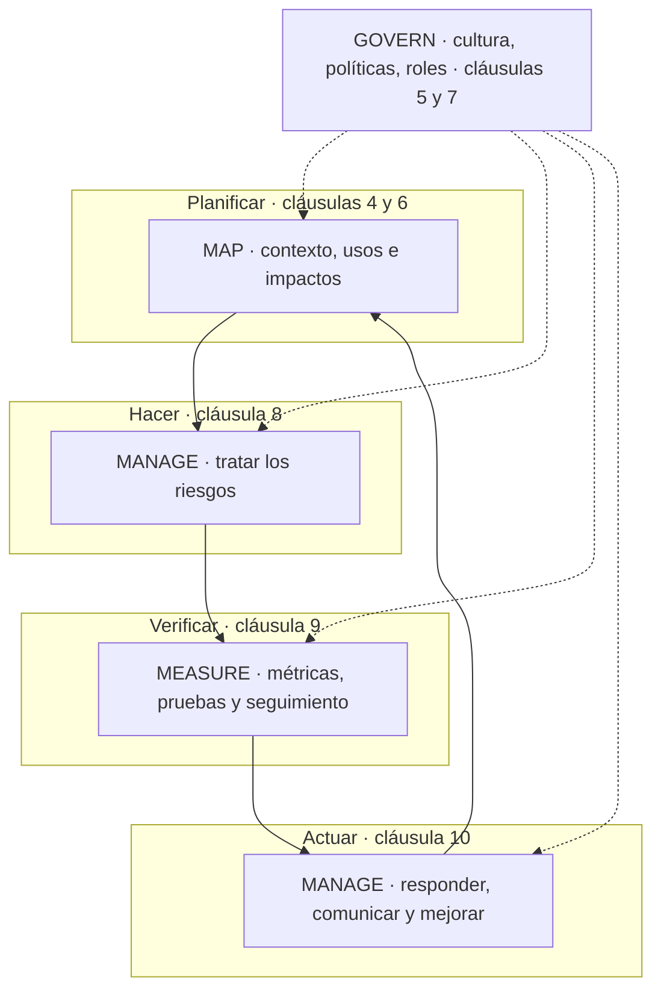

# NIST AI RMF

:material-link-variant: Integración
:material-clock-outline: 20 min de lectura

!!! abstract "En una frase"
    El AI RMF (*AI Risk Management Framework*), el marco del NIST para gestionar riesgos de la IA, es una guía voluntaria y gratuita del gobierno de Estados Unidos, organizada en cuatro funciones (Govern, Map, Measure, Manage); no se certifica, pero es una excelente **caja de herramientas** de prácticas para llenar de contenido el **sistema** que exige ISO/IEC 42001.

## Qué es el NIST AI RMF (y qué no es)

El NIST (Instituto Nacional de Estándares y Tecnología de Estados Unidos) publicó la versión 1.0 de su marco de gestión de riesgos de IA, identificada como NIST AI 100-1, el **26 de enero de 2023**[^rmf]. Es un documento de libre descarga, escrito para cualquier organización que diseñe, desarrolle, despliegue o use sistemas de IA, en cualquier sector y de cualquier tamaño, sin importar el país.

Tres ideas para ubicarlo bien desde el principio:

- **Es voluntario.** Ninguna ley mexicana o latinoamericana obliga a seguirlo. Su fuerza viene de la reputación del NIST y de que muchas empresas estadounidenses lo usan como referencia con sus proveedores.
- **No es certificable.** No contiene requisitos con "debe" contra los cuales un organismo pueda auditar y emitir un certificado. Es un catálogo de resultados deseables y de prácticas sugeridas.
- **Habla el mismo idioma que ISO/IEC 42001.** La propia ISO/IEC 42001 lo menciona en una nota de [4.1](../clausulas/c4-contexto.md#c-4-1) como referencia para entender qué tipos de actores de IA existen y en qué etapas intervienen. No son rivales: se complementan.

### Estado al 9 de octubre de 2026

La versión vigente sigue siendo la **AI RMF 1.0**. La página oficial del NIST indica que el marco **se está revisando** como parte del Plan de Acción de IA de la Casa Blanca; a la fecha de consulta, el NIST no había publicado una versión 1.1 o 2.0 ni un borrador público de la revisión, y su página solo ofrece descargar la 1.0[^rmf].

Ese plan, publicado por la Casa Blanca en julio de 2025, encarga al Departamento de Comercio, a través del NIST, revisar el marco para eliminar las referencias a desinformación, a diversidad, equidad e inclusión, y a cambio climático[^plan]. En nuestra lectura, eso podría tocar partes concretas del marco (por ejemplo, la categoría sobre diversidad de los equipos o algunas menciones a impactos ambientales), pero no sabemos cómo quedará la nueva versión. Por eso, en esta página describimos la 1.0 y te recomendamos revisar la página del NIST antes de citar una categoría o subcategoría en un documento formal.

!!! tip "Analogía: el recetario y la licencia sanitaria"
    ISO/IEC 42001 es como la licencia sanitaria de un restaurante: define qué procesos debes tener, alguien externo viene a verificarlos y, si cumples, te dan un documento que puedes mostrar. El AI RMF es como un buen recetario profesional: te dice cómo preparar cada platillo, qué ingredientes medir y qué errores evitar, pero nadie te da un certificado por tenerlo en la cocina. Los mejores restaurantes tienen ambos.

## Diferencia de naturaleza: marco voluntario frente a norma certificable

| Aspecto | NIST AI RMF 1.0 | ISO/IEC 42001:2023 |
|---|---|---|
| Quién lo emite | Agencia del gobierno de Estados Unidos (NIST) | ISO e IEC, por consenso internacional de organismos nacionales |
| Naturaleza | Marco voluntario de buenas prácticas | Norma de requisitos para un sistema de gestión |
| ¿Se certifica? | No | Sí, por organismos de certificación acreditados |
| Lenguaje | Resultados deseables y sugerencias | Requisitos ("debe") y controles de referencia |
| Estructura | 4 funciones, 19 categorías, 72 subcategorías | Cláusulas 4 a 10 y 38 controles del Anexo A |
| Costo | Gratuito | Se compra a ISO, IEC o a un organismo nacional |
| Fortaleza | Detalle técnico: medición, pruebas, características de confiabilidad, IA generativa | Disciplina de gestión: alcance, roles, auditoría interna, revisión por la dirección, mejora continua, SoA |
| Debilidad | Sin mecanismo de verificación independiente; puede quedarse en buenas intenciones | Menos detalle sobre cómo medir el comportamiento de un modelo |

Dicho en corto: si un cliente te pide **demostrar** que gestionas la IA, ISO/IEC 42001 te da la evidencia certificable. Si te pide **explicar cómo** mides sesgo, robustez o confabulaciones, el AI RMF y sus perfiles te dan el vocabulario y las prácticas. La comparación con otros tipos de referencias está en [¿Qué es un SGIA?](../fundamentos/que-es-un-sgia.md).

## Cómo está construido el marco

El documento tiene dos partes y varios apéndices.

### Parte 1: fundamentos

La primera parte explica cómo pensar el riesgo de IA: cómo se relacionan riesgos, impactos y daños; por qué es difícil medir el riesgo de IA (datos de terceros, comportamiento emergente, diferencias entre laboratorio y producción); qué significa tolerancia al riesgo y cómo priorizar. Un apéndice compara los riesgos de la IA con los del software tradicional, lectura muy recomendable si vienes de seguridad de la información.

También describe a los **actores de IA** según la etapa del ciclo de vida en la que participan (diseño, datos, construcción del modelo, verificación, despliegue, operación) e incluye expresamente a quienes usan el sistema o reciben sus efectos. Es una clasificación parecida, aunque no idéntica, a los roles de ISO/IEC 22989 que pide determinar ISO/IEC 42001; los comparamos en [Roles en la IA](../fundamentos/roles-en-la-ia.md).

### Las siete características de una IA confiable

El corazón conceptual del marco es la idea de **IA confiable** (*trustworthy AI*), descrita con siete características. Las presentamos con nuestras palabras y con el objetivo del Anexo C de ISO/IEC 42001 que más se le parece:

| Característica (AI RMF) | Qué significa, en corto | Objetivo afín en el Anexo C de ISO/IEC 42001 |
|---|---|---|
| Válida y confiable | Hace lo que se espera, con exactitud, y lo sostiene en el tiempo; es la base de las demás | Robustez; disponibilidad y calidad de los datos |
| Segura | No pone en peligro la vida, la salud, los bienes ni el entorno | Seguridad física (*safety*) |
| Protegida y resiliente | Resiste ataques y se recupera de eventos adversos | Seguridad (*security*); robustez |
| Responsable y transparente | Hay quién responda por ella y se puede saber qué hace y cómo se decidió | Rendición de cuentas; transparencia |
| Explicable e interpretable | Se entiende cómo llega a un resultado y qué significa ese resultado | Transparencia y explicabilidad |
| Con privacidad reforzada | Protege la autonomía y los datos de las personas | Privacidad |
| Justa, con sesgos dañinos gestionados | Identifica y reduce resultados discriminatorios | Equidad |

El marco insiste en que estas características se equilibran entre sí: más explicabilidad puede costar exactitud, más privacidad puede reducir la capacidad de detectar sesgos. Decidir esos equilibrios es justo lo que ISO/IEC 42001 pide documentar en los objetivos de desarrollo y uso responsable ([A.6.1.2](../anexo-a/a6-ciclo-de-vida.md#a-6-1-2) y [A.9.3](../anexo-a/a9-uso.md#a-9-3)). Los nombres de controles de ISO/IEC 42001 que usamos en esta guía son traducción libre de referencia.

### Parte 2: el núcleo (*Core*)

El núcleo organiza las prácticas en **cuatro funciones**, divididas en **19 categorías y 72 subcategorías**[^rmfpdf]:

| Función | Para qué sirve | Categorías | Subcategorías |
|---|---|---|---|
| **GOVERN** (gobernar) | Crear la cultura, las políticas, los roles y la rendición de cuentas; atraviesa a las otras tres | 6 | 19 |
| **MAP** (mapear) | Entender el contexto de cada sistema: para qué sirve, quién lo usa, a quién afecta, qué puede salir mal | 5 | 18 |
| **MEASURE** (medir) | Analizar, evaluar y dar seguimiento a los riesgos con métodos y métricas | 4 | 22 |
| **MANAGE** (gestionar) | Priorizar y tratar los riesgos, responder a incidentes y comunicar | 4 | 13 |

Fíjate en el peso de MEASURE: es la función con más subcategorías. Ahí está el valor diferencial del marco frente a ISO/IEC 42001.

### Perfiles

El marco propone adaptar el núcleo a situaciones concretas mediante **perfiles**: por caso de uso (por ejemplo, contratación de personal), por sector o tecnología, y en versión "actual" frente a "objetivo", para hacer análisis de brechas. El NIST ha publicado o está preparando perfiles específicos, que vemos más abajo.

## El Playbook: sugerencias, no una lista de verificación

El **Playbook** del AI RMF es un recurso en línea que ofrece, para cada subcategoría de las cuatro funciones, acciones sugeridas, documentación recomendada y referencias. El NIST es claro sobre su naturaleza: las sugerencias son voluntarias, no es una lista de verificación ni una secuencia de pasos que deba seguirse completa, y se irá actualizando (el NIST menciona actualizaciones aproximadamente dos veces al año). También advierte que el Playbook se actualizará cuando termine la revisión del marco. La página no muestra número de versión ni fecha[^playbook].

**Cómo usarlo con ISO/IEC 42001:** cuando tu evaluación de riesgos te diga que necesitas un control y el Anexo A solo te da la idea general, el Playbook es una buena fuente de prácticas concretas para diseñarlo. Por ejemplo, para definir cómo verificas la equidad de un modelo antes de liberarlo ([A.6.2.4](../anexo-a/a6-ciclo-de-vida.md#a-6-2-4)), las sugerencias de MEASURE te dan ideas de métricas, de documentación y de quién debe revisar. Recuerda que ISO/IEC 42001 permite y espera controles adicionales a los del Anexo A cuando el riesgo lo pide ([6.1.3](../clausulas/c6-planificacion.md#c-6-1-3)).

## El perfil de IA generativa: NIST AI 600-1

El **26 de julio de 2024** el NIST publicó el documento NIST AI 600-1, un perfil del AI RMF dedicado a la IA generativa[^ai600]. Es probablemente el recurso más útil del ecosistema NIST para empresas que usan o integran modelos de lenguaje.

El perfil identifica **12 riesgos** propios de la IA generativa o agravados por ella. Con nuestras palabras:

1. **Información química, biológica, radiológica o nuclear (QBRN):** facilitar el acceso a conocimiento peligroso.
2. **Confabulación:** contenido falso presentado con seguridad (lo que coloquialmente llamamos "alucinaciones").
3. **Contenido peligroso, violento o de odio.**
4. **Privacidad de datos:** filtración o inferencia de datos personales.
5. **Impactos ambientales:** consumo de energía y recursos del entrenamiento y la operación.
6. **Sesgo dañino u homogeneización:** resultados discriminatorios o pérdida de diversidad de perspectivas.
7. **Configuración humano-IA:** exceso de confianza, antropomorfismo, dependencia.
8. **Integridad de la información:** facilitar contenido engañoso a gran escala.
9. **Seguridad de la información:** nuevas superficies de ataque, como la inyección de instrucciones.
10. **Propiedad intelectual:** uso o reproducción de obras protegidas.
11. **Contenido obsceno, degradante o abusivo.**
12. **Cadena de valor e integración de componentes:** riesgos de modelos, datos y servicios de terceros.

Para cada riesgo el perfil propone acciones sugeridas organizadas por las cuatro funciones; el conteo propio que hicimos sobre el documento oficial da unas 212[^ai600].

**Cómo usarlo con ISO/IEC 42001:** esta lista es un excelente catálogo de **fuentes de riesgo** para tu evaluación de riesgos ([6.1.2](../clausulas/c6-planificacion.md#c-6-1-2)) y de temas para la evaluación de impacto ([6.1.4](../clausulas/c6-planificacion.md#c-6-1-4)). Varios riesgos se conectan directo con controles: confabulación con la verificación y validación ([A.6.2.4](../anexo-a/a6-ciclo-de-vida.md#a-6-2-4)) y la información a usuarios ([A.8.2](../anexo-a/a8-informacion-partes-interesadas.md#a-8-2)); configuración humano-IA con la supervisión humana ([A.9.3](../anexo-a/a9-uso.md#a-9-3)); cadena de valor con proveedores ([A.10.3](../anexo-a/a10-terceros.md#a-10-3)); privacidad con datos ([A.7](../anexo-a/a7-datos.md)).

## Otros perfiles y recursos del NIST

- **Perfil de ciberseguridad para IA (NIST IR 8596).** Es un perfil comunitario del Marco de Ciberseguridad (CSF 2.0) aplicado a la IA. Al 9 de octubre de 2026 existía solo como **borrador preliminar inicial**, publicado el 16 de diciembre de 2025, con periodo de comentarios cerrado el 30 de enero de 2026; no había borrador posterior ni versión final. Según resúmenes de terceros, aborda tres focos: proteger los sistemas de IA, usar la IA en la ciberdefensa y frustrar ataques que usan IA[^ir8596]. Si tu SGSI ya usa el CSF, vale la pena seguirlo.
- **Perfil para infraestructura crítica (en preparación).** El 7 de abril de 2026 el NIST publicó una nota conceptual para un perfil del AI RMF sobre IA confiable en infraestructura crítica. Es un concepto, no un perfil terminado[^rmf].
- **Hoja de ruta (*Roadmap*)** del AI RMF y página de **tablas de correspondencia** (*crosswalks*) con otros marcos, ambas enlazadas desde la página oficial[^rmf].

### El *crosswalk* con ISO/IEC 42001: quién lo hizo y qué mapea

En la página de tablas de correspondencia del NIST hay un documento que relaciona el AI RMF con ISO/IEC 42001. Antes de usarlo, conviene saber tres cosas[^crosswalk]:

1. **No lo elaboró el NIST.** El propio sitio lo atribuye a Microsoft como proveedor, y el NIST aclara que incluir una tabla de correspondencia en esa página no implica su respaldo.
2. **Mapea un borrador.** Su título se refiere al proyecto final (FDIS) de ISO/IEC 42001, no a la norma publicada. Los metadatos del archivo indican que se creó el 23 de mayo de 2023, antes de la publicación de la norma.
3. **Hay otras tablas más recientes** en la misma página, elaboradas por el comité INCITS/AI: una entre ISO/IEC 42005 y el AI RMF, y otra revisada entre ISO/IEC 23894 y el AI RMF, ambas del 14 de agosto de 2025; además de una entre NIST AI 600-1 y el marco AI Verify de Singapur, del 28 de mayo de 2025.

Puedes usar esas tablas como insumo, pero no como fuente de verdad sobre lo que exige ISO/IEC 42001.

## Mapeo: de las funciones del AI RMF a ISO/IEC 42001

!!! warning "Este es un mapeo propio del autor"
    Las tablas siguientes son una interpretación de esta guía, hecha sobre la versión 1.0 del AI RMF y la norma publicada ISO/IEC 42001:2023. No son una correspondencia oficial del NIST ni de ISO. Describimos cada categoría con nuestras palabras y apuntamos a las cláusulas y controles donde, en nuestra lectura, encaja mejor. Un mismo resultado del AI RMF puede atenderse en varios lugares de la norma.

### La vista de conjunto: funciones y ciclo PHVA

ISO/IEC 42001, como toda norma de sistema de gestión, sigue el ciclo PHVA (Planificar, Hacer, Verificar, Actuar). Las funciones del AI RMF no son fases secuenciales, pero encajan de forma natural en ese ciclo, con GOVERN como eje que lo atraviesa todo.

| Función AI RMF | Fase PHVA | Cláusulas de ISO/IEC 42001 más relacionadas |
|---|---|---|
| GOVERN | Eje transversal | [5](../clausulas/c5-liderazgo.md) Liderazgo, [7](../clausulas/c7-apoyo.md) Apoyo, [9.3](../clausulas/c9-evaluacion-del-desempeno.md#c-9-3) Revisión por la dirección |
| MAP | Planificar | [4.1](../clausulas/c4-contexto.md#c-4-1), [4.2](../clausulas/c4-contexto.md#c-4-2), [6.1.1](../clausulas/c6-planificacion.md#c-6-1-1), [6.1.4](../clausulas/c6-planificacion.md#c-6-1-4) |
| MEASURE | Verificar (y el análisis de riesgos al planificar) | [6.1.2](../clausulas/c6-planificacion.md#c-6-1-2), [8.2](../clausulas/c8-operacion.md#c-8-2), [9.1](../clausulas/c9-evaluacion-del-desempeno.md#c-9-1) |
| MANAGE | Hacer y Actuar | [6.1.3](../clausulas/c6-planificacion.md#c-6-1-3), [8.3](../clausulas/c8-operacion.md#c-8-3), [10.2](../clausulas/c10-mejora.md#c-10-2) |

### GOVERN: gobernar

| Categoría | Qué busca (con nuestras palabras) | Cláusulas | Controles |
|---|---|---|---|
| GOVERN 1 | Políticas, procesos y prácticas para gestionar el riesgo de IA: requisitos legales, nivel de esfuerzo según la tolerancia al riesgo, revisión periódica, inventario de sistemas y retiro ordenado | 4.1, 5.2, 6.1.1, 9.3 | [A.2.2](../anexo-a/a2-politicas.md#a-2-2), [A.2.4](../anexo-a/a2-politicas.md#a-2-4), [A.4.2](../anexo-a/a4-recursos.md#a-4-2), [A.6.1.3](../anexo-a/a6-ciclo-de-vida.md#a-6-1-3) |
| GOVERN 2 | Rendición de cuentas: responsabilidades claras, personas capacitadas y una dirección que responde por las decisiones | 5.1, 5.3, 7.2, 7.3 | [A.3.2](../anexo-a/a3-organizacion-interna.md#a-3-2), [A.4.6](../anexo-a/a4-recursos.md#a-4-6) |
| GOVERN 3 | Equipos diversos e interdisciplinarios, y roles definidos para la interacción y la supervisión humana | 7.2 | [A.3.2](../anexo-a/a3-organizacion-interna.md#a-3-2), [A.4.6](../anexo-a/a4-recursos.md#a-4-6), [A.9.3](../anexo-a/a9-uso.md#a-9-3) |
| GOVERN 4 | Cultura que pondera y comunica el riesgo: pensamiento crítico, documentación de impactos, intercambio de información sobre incidentes | 5.1, 7.3, 7.4 | [A.3.3](../anexo-a/a3-organizacion-interna.md#a-3-3), [A.5.3](../anexo-a/a5-evaluacion-de-impacto.md#a-5-3), [A.8.4](../anexo-a/a8-informacion-partes-interesadas.md#a-8-4) |
| GOVERN 5 | Diálogo con actores externos y con personas afectadas, e incorporación de su retroalimentación | 4.2, 7.4 | [A.5.4](../anexo-a/a5-evaluacion-de-impacto.md#a-5-4), [A.8.3](../anexo-a/a8-informacion-partes-interesadas.md#a-8-3), [A.8.5](../anexo-a/a8-informacion-partes-interesadas.md#a-8-5) |
| GOVERN 6 | Riesgos de terceros: software, datos, modelos y cadena de suministro, con planes de contingencia | 8.1 | [A.7.3](../anexo-a/a7-datos.md#a-7-3), [A.10.2](../anexo-a/a10-terceros.md#a-10-2), [A.10.3](../anexo-a/a10-terceros.md#a-10-3) |

**Lo que GOVERN añade a ISO/IEC 42001:** énfasis en la cultura y en equipos interdisciplinarios. **Lo que ISO/IEC 42001 añade a GOVERN:** la obligación de auditar internamente, revisar por la dirección y corregir no conformidades, con evidencia verificable.

### MAP: mapear

| Categoría | Qué busca (con nuestras palabras) | Cláusulas | Controles |
|---|---|---|---|
| MAP 1 | Establecer el contexto: propósito previsto, entorno de uso, leyes y expectativas, misión de la organización, tolerancia al riesgo y requisitos del sistema | 4.1, 4.2, 6.1.1 | [A.6.2.2](../anexo-a/a6-ciclo-de-vida.md#a-6-2-2), [A.9.4](../anexo-a/a9-uso.md#a-9-4) |
| MAP 2 | Categorizar el sistema: qué tarea hace y con qué método, qué límites tiene su conocimiento y cómo se usarán y supervisarán sus resultados | 4.1 | [A.4.2](../anexo-a/a4-recursos.md#a-4-2), [A.4.4](../anexo-a/a4-recursos.md#a-4-4), [A.6.2.3](../anexo-a/a6-ciclo-de-vida.md#a-6-2-3), [A.6.2.7](../anexo-a/a6-ciclo-de-vida.md#a-6-2-7) |
| MAP 3 | Entender capacidades, usos objetivo, beneficios y costos esperados (incluido el costo de equivocarse), competencias de quienes lo operan y procesos de supervisión humana | 6.2 | [A.6.1.2](../anexo-a/a6-ciclo-de-vida.md#a-6-1-2), [A.9.3](../anexo-a/a9-uso.md#a-9-3), [A.4.6](../anexo-a/a4-recursos.md#a-4-6), [A.8.2](../anexo-a/a8-informacion-partes-interesadas.md#a-8-2) |
| MAP 4 | Mapear riesgos y beneficios de cada componente, incluidos software, datos de terceros y propiedad intelectual | 6.1.2 | [A.4.3](../anexo-a/a4-recursos.md#a-4-3), [A.7.3](../anexo-a/a7-datos.md#a-7-3), [A.7.5](../anexo-a/a7-datos.md#a-7-5), [A.10.3](../anexo-a/a10-terceros.md#a-10-3) |
| MAP 5 | Caracterizar los impactos en personas, grupos, comunidades, organizaciones y sociedad, con su probabilidad, magnitud y vías de retroalimentación | 6.1.4, 8.4 | [A.5.2](../anexo-a/a5-evaluacion-de-impacto.md#a-5-2), [A.5.4](../anexo-a/a5-evaluacion-de-impacto.md#a-5-4), [A.5.5](../anexo-a/a5-evaluacion-de-impacto.md#a-5-5), [A.8.3](../anexo-a/a8-informacion-partes-interesadas.md#a-8-3) |

MAP es la función que mejor se alinea con ISO/IEC 42001: casi todo lo que pide encaja en la cláusula 4, en los criterios de riesgo y en la evaluación de impacto. Si ya cumples bien [4.1](../clausulas/c4-contexto.md#c-4-1) y [6.1.4](../clausulas/c6-planificacion.md#c-6-1-4), tienes MAP prácticamente cubierto.

### MEASURE: medir

| Categoría | Qué busca (con nuestras palabras) | Cláusulas | Controles |
|---|---|---|---|
| MEASURE 1 | Elegir métodos y métricas para los riesgos más importantes, documentar lo que no se puede medir y someter las métricas a revisión independiente | 6.1.2, 9.1 | [A.6.2.4](../anexo-a/a6-ciclo-de-vida.md#a-6-2-4) |
| MEASURE 2 | Evaluar el sistema contra cada característica de confiabilidad (validez, seguridad, protección, transparencia, explicabilidad, privacidad, equidad, impacto ambiental) con pruebas documentadas y representativas del uso real | 9.1 | [A.6.2.4](../anexo-a/a6-ciclo-de-vida.md#a-6-2-4), [A.6.2.6](../anexo-a/a6-ciclo-de-vida.md#a-6-2-6), [A.7.4](../anexo-a/a7-datos.md#a-7-4), [A.4.5](../anexo-a/a4-recursos.md#a-4-5) |
| MEASURE 3 | Dar seguimiento en el tiempo a riesgos conocidos y emergentes, con canales para que usuarios y personas afectadas reporten problemas | 8.2, 9.1 | [A.6.2.6](../anexo-a/a6-ciclo-de-vida.md#a-6-2-6), [A.6.2.8](../anexo-a/a6-ciclo-de-vida.md#a-6-2-8), [A.3.3](../anexo-a/a3-organizacion-interna.md#a-3-3), [A.8.3](../anexo-a/a8-informacion-partes-interesadas.md#a-8-3) |
| MEASURE 4 | Comprobar que las mediciones sirven: contrastarlas con el contexto de uso, con expertos del dominio y con la experiencia de los usuarios | 9.1, 9.3, 10.1 | [A.6.2.6](../anexo-a/a6-ciclo-de-vida.md#a-6-2-6) |

Aquí está la mayor aportación del AI RMF. ISO/IEC 42001 te pide definir qué medir y con qué métodos para obtener resultados válidos ([9.1](../clausulas/c9-evaluacion-del-desempeno.md#c-9-1)) y que tu evaluación de riesgos dé resultados consistentes y comparables ([6.1.2](../clausulas/c6-planificacion.md#c-6-1-2)), pero no te dice cómo medir el sesgo de un modelo de crédito o la tasa de confabulación de un asistente. MEASURE, el Playbook y el perfil de IA generativa sí lo abordan con mucho más detalle, incluida la disciplina de prueba, evaluación, verificación y validación (*TEVV*).

### MANAGE: gestionar

| Categoría | Qué busca (con nuestras palabras) | Cláusulas | Controles |
|---|---|---|---|
| MANAGE 1 | Decidir si el sistema cumple su propósito y si debe seguir adelante; priorizar y responder a los riesgos; documentar los riesgos residuales | 6.1.3, 8.3 | [A.6.2.5](../anexo-a/a6-ciclo-de-vida.md#a-6-2-5) |
| MANAGE 2 | Planear cómo maximizar beneficios y reducir impactos: recursos, alternativas sin IA, respuesta a riesgos imprevistos y mecanismos para desactivar o retirar un sistema | 6.1.3, 8.1 | [A.6.2.6](../anexo-a/a6-ciclo-de-vida.md#a-6-2-6), [A.9.4](../anexo-a/a9-uso.md#a-9-4) |
| MANAGE 3 | Gestionar riesgos y beneficios de terceros, incluidos modelos preentrenados, con monitoreo continuo | 8.1 | [A.10.2](../anexo-a/a10-terceros.md#a-10-2), [A.10.3](../anexo-a/a10-terceros.md#a-10-3), [A.4.4](../anexo-a/a4-recursos.md#a-4-4) |
| MANAGE 4 | Monitorear después del despliegue, responder y recuperarse de incidentes, comunicarlos y mejorar | 9.1, 10.1, 10.2 | [A.6.2.6](../anexo-a/a6-ciclo-de-vida.md#a-6-2-6), [A.8.4](../anexo-a/a8-informacion-partes-interesadas.md#a-8-4) |

Una idea de MANAGE que conviene llevarse a tu SGIA: tener previsto **cómo apagar o retirar** un sistema que se comporta mal, y quién tiene la autoridad para hacerlo. ISO/IEC 42001 lo cubre de forma general en la operación y el monitoreo ([A.6.2.6](../anexo-a/a6-ciclo-de-vida.md#a-6-2-6)); el AI RMF lo hace explícito.

## Cómo usar ambos juntos

La recomendación de esta guía es simple: **ISO/IEC 42001 como sistema, AI RMF como caja de herramientas.**

- **El sistema** (ISO/IEC 42001) te da la estructura que no se cae: alcance, roles, política, criterios de riesgo, Declaración de Aplicabilidad, auditoría interna, revisión por la dirección, acciones correctivas. Es lo que el auditor verifica y lo que da continuidad cuando cambian las personas.
- **La caja de herramientas** (AI RMF, Playbook, NIST AI 600-1) te da el contenido técnico para que esos procesos no sean cascarones: qué riesgos buscar en un modelo generativo, qué métricas usar, cómo documentar las pruebas, qué preguntar a un proveedor.

En la práctica, así se conectan:

1. **Al determinar el contexto** ([4.1](../clausulas/c4-contexto.md#c-4-1)), usa las preguntas de MAP 1 a MAP 3 como guía de entrevista con los dueños de cada sistema.
2. **Al evaluar riesgos** ([6.1.2](../clausulas/c6-planificacion.md#c-6-1-2)), usa los 12 riesgos del perfil NIST AI 600-1 como catálogo de fuentes de riesgo si trabajas con IA generativa.
3. **Al evaluar impactos** ([6.1.4](../clausulas/c6-planificacion.md#c-6-1-4)), usa MAP 5 y las características de confiabilidad como lista de dimensiones a revisar.
4. **Al diseñar controles adicionales** ([6.1.3](../clausulas/c6-planificacion.md#c-6-1-3)), consulta las acciones sugeridas del Playbook.
5. **Al definir indicadores** ([9.1](../clausulas/c9-evaluacion-del-desempeno.md#c-9-1)) y criterios de verificación ([A.6.2.4](../anexo-a/a6-ciclo-de-vida.md#a-6-2-4)), apóyate en MEASURE.
6. **Al hacer un diagnóstico inicial**, arma un perfil "actual" y uno "objetivo" con las 19 categorías: es una forma rápida de mostrarle a la dirección dónde estás.

!!! example "Caso: Conversa Labs y Monarca Crédito"
    **Conversa Labs**, la empresa de Guadalajara que vende asistentes virtuales con IA generativa, usa los 12 riesgos de NIST AI 600-1 como columnas de su catálogo de fuentes de riesgo. La confabulación (respuestas inventadas sobre pólizas o trámites escolares), la configuración humano-IA (usuarios que confían de más), la seguridad de la información (inyección de instrucciones) y la cadena de valor (cambios del proveedor del modelo fundacional) resultan los de mayor nivel. En la Declaración de Aplicabilidad, cada uno apunta a sus controles de ISO/IEC 42001, y en la documentación para clientes la empresa explica cómo los mide.

    **Monarca Crédito**, la fintech de la Ciudad de México con el modelo Score Monarca v3, usa MEASURE 2 para estructurar su plan de validación: exactitud por segmento, estabilidad en el tiempo, métricas de equidad por sexo, edad y entidad federativa, y pruebas con variables sustitutas como el código postal. El Comité de Modelos aprueba el plan, y la evidencia alimenta [A.6.2.4](../anexo-a/a6-ciclo-de-vida.md#a-6-2-4) y la revisión por la dirección. Cuando un banco aliado estadounidense le pregunta por el AI RMF, Monarca responde con su tabla de correspondencia y con la evidencia de su SGIA.

    Los casos completos están en [Empresa que desarrolla un chatbot](../casos-practicos/empresa-desarrolla-chatbot.md) y [Fintech con scoring crediticio](../casos-practicos/fintech-scoring.md).

## Cuándo le conviene a una empresa latinoamericana

El AI RMF no es obligatorio en ningún país de la región, pero hay situaciones en las que adoptarlo, o al menos poder hablar su idioma, te da ventaja:

| Situación | ¿Te conviene el AI RMF? | Comentario |
|---|---|---|
| Vendes software o servicios con IA a clientes en Estados Unidos | Sí, mucho | Sus cuestionarios de proveedores suelen usar el vocabulario del AI RMF; tener tu mapeo listo acelera las ventas |
| Eres proveedor de una empresa con matriz estadounidense (cadena de suministro) | Sí | La matriz puede exigir a su cadena prácticas alineadas con su propio programa de riesgos de IA |
| Buscas inversión o alianzas con bancos internacionales | Sí, como complemento | Los inversionistas valoran el certificado ISO/IEC 42001; el AI RMF ayuda a explicar tu práctica técnica |
| Necesitas un certificado para una licitación | No basta | Solo ISO/IEC 42001 da un certificado acreditado |
| Eres una PyME que solo usa IA de terceros y quieres empezar sin certificar | Puede ser un buen arranque | Gratuito y flexible; después puedes escalar a un SGIA formal |
| Desarrollas IA generativa | Sí, por el perfil NIST AI 600-1 | Es de las fuentes más completas sobre riesgos específicos de IA generativa |
| Ya tienes un SGSI con el Marco de Ciberseguridad del NIST | Sí | La familia NIST se integra bien; sigue de cerca el perfil de ciberseguridad para IA |

!!! latam "En México y Latinoamérica"
    Con el *nearshoring*, muchas empresas mexicanas de servicios de TI, centros de atención a clientes y desarrolladoras de software atienden a clientes estadounidenses que preguntan cómo gestionan la IA. En esos casos, una respuesta sólida suele combinar tres piezas: el certificado (o el proyecto) de ISO/IEC 42001, una tabla de correspondencia con el AI RMF y evidencia de cumplimiento de la normativa local de datos personales. Para el panorama regulatorio de la región, consulta [México y Latinoamérica](contexto-mexico-latam.md); si también tienes clientes en Europa, revisa el [Reglamento de IA de la UE](reglamento-ia-ue.md).

!!! warning "Errores comunes"
    - **Ofrecer o comprar una "certificación NIST AI RMF".** El NIST no plantea el marco como certificable; cualquier "sello" es un servicio privado de evaluación, no una certificación acreditada.
    - **Usar el *crosswalk* alojado por el NIST como si fuera oficial.** Lo elaboró un tercero y mapea un borrador de ISO/IEC 42001.
    - **Copiar las 72 subcategorías como controles en la SoA.** El AI RMF no se diseñó como catálogo de controles; úsalo para enriquecer los tuyos.
    - **Citar una categoría sin revisar la versión vigente.** El marco está en revisión; verifica la página del NIST antes de publicar documentos formales.
    - **Quedarse en GOVERN y MAP.** Muchas organizaciones documentan políticas y contexto, pero nunca miden. El valor diferencial está en MEASURE.

## Preguntas para tu organización

- [ ] ¿Algún cliente o socio nos ha preguntado por el NIST AI RMF o por prácticas de gestión de riesgos de IA?
- [ ] ¿Tenemos una tabla de correspondencia propia entre nuestro SGIA y las funciones del AI RMF?
- [ ] Si usamos IA generativa, ¿revisamos los 12 riesgos de NIST AI 600-1 en nuestra evaluación de riesgos?
- [ ] ¿Tenemos métricas definidas para validez, equidad, robustez y privacidad de nuestros sistemas de IA?
- [ ] ¿Sabemos cómo apagar o retirar un sistema de IA que se comporta mal, y quién decide hacerlo?
- [ ] ¿Alguien da seguimiento a la revisión del AI RMF y a los nuevos perfiles del NIST?

## Para seguir leyendo

- [Integración con ISO 27001](con-iso27001.md): cómo sumar el SGIA a un SGSI existente.
- [Cláusula 6 · Planificación](../clausulas/c6-planificacion.md) y [cláusula 9 · Evaluación del desempeño](../clausulas/c9-evaluacion-del-desempeno.md): donde más se aprovecha el AI RMF.
- [A.6 · Ciclo de vida](../anexo-a/a6-ciclo-de-vida.md) y [A.5 · Evaluación de impactos](../anexo-a/a5-evaluacion-de-impacto.md).
- [Principios de IA responsable](../fundamentos/principios-ia-responsable.md) y [La familia de normas de IA](../fundamentos/familia-de-normas.md).
- Plantillas: [Metodología y matriz de riesgos de IA](../plantillas/index.md#evaluacion-de-riesgos) y [Evaluación de impacto del sistema de IA](../plantillas/index.md#evaluacion-de-impacto).

[^rmf]: Página oficial del NIST AI Risk Management Framework (versión vigente AI RMF 1.0, publicada el 26 de enero de 2023; aviso de revisión en el marco del Plan de Acción de IA de la Casa Blanca; nota conceptual del 7 de abril de 2026 sobre un perfil para infraestructura crítica; enlaces a la hoja de ruta y a las tablas de correspondencia): <https://www.nist.gov/itl/ai-risk-management-framework>, consultado el 9 de octubre de 2026.

[^plan]: Casa Blanca, *America's AI Action Plan* (julio de 2025), p. 7: <https://www.whitehouse.gov/wp-content/uploads/2025/07/Americas-AI-Action-Plan.pdf>, consultado el 9 de octubre de 2026.

[^rmfpdf]: NIST AI 100-1, *Artificial Intelligence Risk Management Framework (AI RMF 1.0)*: <https://nvlpubs.nist.gov/nistpubs/ai/NIST.AI.100-1.pdf>, consultado el 9 de octubre de 2026. El número de categorías y subcategorías por función es un conteo hecho sobre el PDF oficial.

[^playbook]: NIST AIRC, *AI RMF Playbook*: <https://airc.nist.gov/airmf-resources/playbook/>, consultado el 9 de octubre de 2026.

[^ai600]: NIST AI 600-1, *Artificial Intelligence Risk Management Framework: Generative Artificial Intelligence Profile* (26 de julio de 2024), ficha: <https://www.nist.gov/publications/artificial-intelligence-risk-management-framework-generative-artificial-intelligence>; documento: <https://nvlpubs.nist.gov/nistpubs/ai/NIST.AI.600-1.pdf>. Consultados el 9 de octubre de 2026. El número aproximado de acciones sugeridas (unas 212) es un conteo propio de los identificadores del documento, no una cifra publicada por el NIST.

[^ir8596]: NIST IR 8596 (borrador preliminar inicial), *Cybersecurity Framework Profile for Artificial Intelligence (Cyber AI Profile)*: <https://csrc.nist.gov/pubs/ir/8596/iprd>, consultado el 9 de octubre de 2026. Fechas y estado verificados en esa página; la descripción de los tres focos procede de resúmenes de terceros (fuente secundaria).

[^crosswalk]: NIST AIRC, página de tablas de correspondencia: <https://airc.nist.gov/airmf-resources/crosswalks/>; documento *NIST AI RMF to ISO/IEC FDIS 42001 AI Management system Crosswalk*: <https://airc.nist.gov/docs/NIST_AI_RMF_to_ISO_IEC_42001_Crosswalk.pdf>. Consultados el 9 de octubre de 2026. La fecha de creación procede de los metadatos del PDF.
