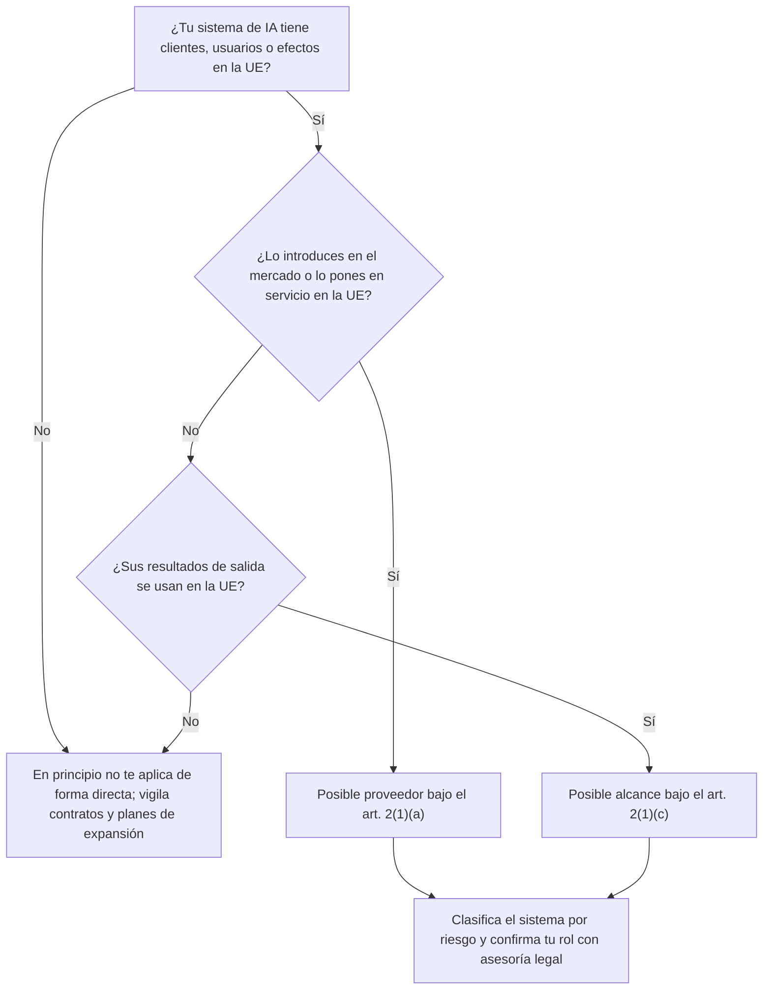
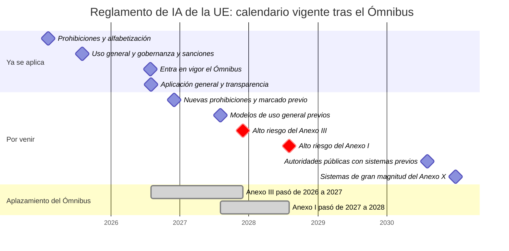
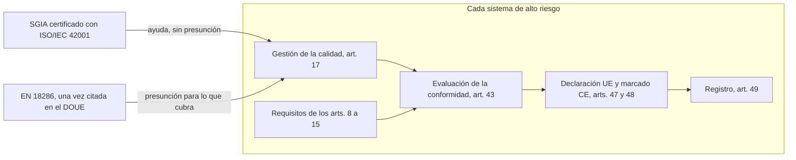

# Reglamento de IA de la UE

:material-scale-balance: Regulación
:material-clock-outline: 24 min de lectura

!!! abstract "En una frase"
    El Reglamento de IA de la Unión Europea funciona como una ley de seguridad de producto para la inteligencia artificial, y también alcanza a empresas mexicanas y latinoamericanas cuando venden IA en Europa o cuando los resultados de su IA se usan allá; un SGIA con ISO/IEC 42001 te da el andamiaje para ordenar ese cumplimiento, pero no lo sustituye.

!!! legal "Información orientativa, con fecha de consulta"
    Esta página resume el Reglamento con información consultada el **9 de octubre de 2026**. Cada fecha, artículo y cifra lleva su fuente en una nota al pie, y te avisamos cuando la fuente es secundaria. Es material de orientación, **no asesoría legal**: el texto cambia, su aplicación depende de los hechos de cada caso y solo el texto publicado en el Diario Oficial de la Unión Europea (DOUE) tiene valor jurídico. Antes de decidir, consulta la versión oficial y a un abogado especializado (ver [aviso legal](../acerca-de.md#aviso-legal)).

## Qué es y por qué te importa desde Latinoamérica {#que-es}

El Reglamento (UE) 2024/1689, conocido en inglés como *AI Act*, es la primera ley integral sobre inteligencia artificial de la Unión Europea. Su título oficial lo describe bien: es el reglamento "por el que se establecen normas armonizadas en materia de inteligencia artificial". Lleva fecha del 13 de junio de 2024, se publicó en el DOUE el 12 de julio de 2024 y entró en vigor el 1 de agosto de 2024, a los veinte días de su publicación (art. 113)[^1].

Entrar en vigor no es lo mismo que empezar a aplicarse. Las obligaciones se activan por etapas, y la Comisión Europea lo resume así: "The AI Act entered into force on 1 August 2024 and became applicable on 2 August 2026, with some exceptions"[^2]. Esas excepciones son justo lo que más le importa a una empresa, y las ordenamos en el [calendario](#calendario).

Al ser un reglamento europeo, se aplica directamente en todos los Estados miembros, sin que cada país tenga que convertirlo en ley nacional. Su lógica es la de la **seguridad de producto**: no regula "la IA" en abstracto, sino sistemas y modelos concretos que alguien pone en el mercado o en servicio, y gradúa las obligaciones según dos variables: el **riesgo del uso** y el **papel** que juega cada empresa en la cadena.

En julio de 2026 recibió su primera modificación sustantiva: el llamado **Ómnibus Digital sobre IA**, que es el Reglamento (UE) 2026/1744. Aplazó las obligaciones de alto riesgo y ajustó otras piezas[^3]. EUR-Lex ya lista una versión consolidada con fecha 27 de julio de 2026 que incorpora esos cambios[^4]. Si lees un análisis anterior a esa fecha, desconfía de su calendario.

!!! tip "Analogía: la NOM del producto y el sistema de calidad de la fábrica"
    Piensa en una plancha que se vende en México. Para salir a la venta debe cumplir la norma oficial mexicana de seguridad que le aplique, y eso se evalúa **producto por producto**. Que la fábrica tenga un sistema de gestión de la calidad certificado ayuda a que todas las planchas salgan bien, pero no reemplaza la evaluación del producto. Con la IA pasa algo parecido: el Reglamento evalúa **cada sistema** de alto riesgo como producto, y ISO/IEC 42001 ordena **la fábrica**, es decir, tu organización.

!!! note "Dos términos que conviene fijar"
    La versión oficial en español usa **responsable del despliegue** para el *deployer*, es decir, quien usa un sistema de IA bajo su propia autoridad, y **modelos de IA de uso general** para los *general-purpose AI models* (GPAI). En otras traducciones verás "de propósito general". Aquí seguimos la versión oficial[^1].

## A quién aplica: el alcance extraterritorial {#alcance}

El artículo 2 es el que convierte una ley europea en un tema para empresas de Querétaro, Guadalajara, Bogotá o Lima. Dos de sus supuestos importan especialmente[^1]:

- **Art. 2(1)(a).** El Reglamento alcanza a los proveedores que introducen en el mercado o ponen en servicio sistemas de IA en la Unión, o que introducen ahí modelos de uso general, "con independencia de si dichos proveedores están establecidos o ubicados en la Unión o en un tercer país".
- **Art. 2(1)(c).** También alcanza a "los proveedores y responsables del despliegue de sistemas de IA que estén establecidos o ubicados en un tercer país", cuando los resultados de salida del sistema se utilizan en la Unión.

A eso se suma una obligación práctica: según el art. 22(1), un proveedor de un tercer país que quiera comercializar un sistema de **alto riesgo** en la Unión debe nombrar antes, mediante mandato escrito, un **representante autorizado** establecido en la UE; el art. 54 prevé una figura equivalente para los proveedores de modelos de uso general[^5].

La consecuencia, dicha sin rodeos: una empresa de México o de Latinoamérica que vende o despliega IA cuyos resultados se usan en la UE **puede quedar sujeta al Reglamento** aunque no tenga oficina, servidores ni empleados en Europa[^1]. Cuatro situaciones típicas:

1. **Vendes un software como servicio con IA a clientes europeos.** Es el caso de Conversa Labs con su cliente en España, que desarrollamos [más abajo](#ejemplo-conversa).
2. **Tu IA produce resultados que se usan en Europa.** Por ejemplo, una empresa de reclutamiento en Monterrey que filtra con IA candidaturas para la filial española de un cliente: el servidor está en México, pero la salida se usa en la Unión.
3. **Eres proveedor de una empresa europea** que integra tu modelo o tu API en su propio producto.
4. **Planeas expandirte.** Si tu plan de negocio incluye Europa, el Reglamento ya es parte de tu contexto externo.

Hay además un efecto indirecto que en nuestra experiencia llega antes que cualquier autoridad: los clientes europeos, y las empresas latinoamericanas que forman parte de grupos europeos, trasladan sus obligaciones a sus proveedores por contrato y por cuestionarios. Aunque el Reglamento no te aplique de forma directa, puede llegarte por esa vía.

En términos de ISO/IEC 42001, esta pregunta pertenece a la cláusula [4.1](../clausulas/c4-contexto.md#c-4-1): entender el contexto externo, incluidos los requisitos legales de cada jurisdicción donde opera o tiene efectos tu sistema, y determinar tu rol frente a cada sistema.

## Las categorías de riesgo {#categorias}

La Comisión describe el Reglamento como una pirámide de cuatro niveles, más un régimen aparte para los modelos de uso general[^2]:

| Nivel | Qué abarca | Ejemplos que da la Comisión | Qué implica |
|---|---|---|---|
| **Riesgo inaceptable** | Prácticas prohibidas por el art. 5. La Comisión cuenta hoy nueve, incluida la que añadió el Ómnibus | Consulta la lista completa del art. 5 | Prohibidas desde el 2 de febrero de 2025; las prohibiciones nuevas, desde el 2 de diciembre de 2026[^3] |
| **Alto riesgo** | Usos que pueden afectar seriamente la salud, la seguridad o los derechos fundamentales | Productos regulados (Anexo I) y casos de uso listados (Anexo III) | Requisitos de los arts. 8 a 15 y obligaciones por rol, aplazados a 2027 y 2028 |
| **Riesgo de transparencia** | Sistemas en los que la persona podría no saber que trata con una IA o con contenido artificial | Avisar que se conversa con un chatbot; etiquetar *deepfakes* | Obligaciones del art. 50, aplicables desde el 2 de agosto de 2026 |
| **Riesgo mínimo o nulo** | Todo lo demás | Filtros de spam | Sin reglas nuevas |

Tres precisiones que suelen perderse:

- **Las prohibiciones crecieron.** El Ómnibus añadió al art. 5 dos supuestos que aplican desde el 2 de diciembre de 2026: la generación o manipulación de imágenes, audio o video íntimos y realistas de personas identificables sin su consentimiento, y la de material de abuso sexual infantil[^3].
- **El alto riesgo tiene dos puertas.** La del art. 6(1), para sistemas ligados a productos sujetos a la legislación de armonización de la UE (Anexo I), y la del art. 6(2), para los casos de uso del Anexo III. El art. 6(3) prevé una excepción para algunos sistemas del Anexo III; no confirmamos si el Ómnibus cambió el régimen de registro de esos casos, así que conviene revisarlo con asesoría[^1]. La Comisión publicó un **borrador** de directrices de clasificación el 19 de mayo de 2026 (el plazo legal era el 2 de febrero de 2026), amplió la consulta hasta el 23 de julio de 2026 y espera las directrices finales "by the end of 2026"[^6].
- **La alfabetización en IA no depende del nivel.** En nuestra lectura, la medida del art. 4 alcanza a todo proveedor y responsable del despliegue de sistemas de IA, también de los de riesgo mínimo. Lo vemos en el [calendario](#calendario).

### Modelos de IA de uso general

Los modelos de uso general, como los grandes modelos de lenguaje que ofrecen los proveedores fundacionales, tienen su propio capítulo (Capítulo V), aplicable desde el 2 de agosto de 2025[^2][^7]. Los modelos que ya estaban en el mercado antes de esa fecha tienen hasta el 2 de agosto de 2027 para cumplir (art. 111(3))[^7]. Según fuentes secundarias, el Ómnibus no aplazó estas obligaciones[^8].

Para aterrizar esas obligaciones existe un **Código de buenas prácticas para IA de uso general**. La Comisión recibió su versión final el 10 de julio de 2025, y la Comisión y el Comité de IA lo declararon adecuado el 1 de agosto de 2025. Tiene tres capítulos: transparencia, derechos de autor, y seguridad y protección; este último solo aplica a los modelos con riesgo sistémico. Lo acompañan unas directrices sobre el alcance de las obligaciones (18 de julio de 2025) y una plantilla para resumir los datos de entrenamiento (24 de julio de 2025)[^9].

Casi ninguna empresa latinoamericana es proveedora de un modelo de uso general; lo normal es ser **cliente** de uno. Aun así, te conviene saber qué documentación están obligados a preparar tus proveedores, porque es la que pedirás con [A.10.3](../anexo-a/a10-terceros.md#a-10-3) para tu propia evaluación de riesgos. (Los nombres de los controles de ISO/IEC 42001 que usamos en esta guía son traducción libre de referencia).

## Roles: proveedor, responsable del despliegue y los roles de ISO/IEC 22989 {#roles}

El Reglamento llama **operadores** a las figuras que asumen obligaciones. Las dos principales son:

- **Proveedor.** En términos generales, quien desarrolla un sistema o modelo de IA, o lo manda desarrollar, y lo introduce en el mercado o lo pone en servicio con su propio nombre o marca. Carga con la mayor parte de las obligaciones.
- **Responsable del despliegue.** Quien usa un sistema de IA bajo su autoridad en una actividad profesional. Sus obligaciones son menores, pero reales.

La sección del texto oficial que va del art. 22 al art. 27 reparte obligaciones también entre **representantes autorizados**, **importadores** y **distribuidores**, regula las responsabilidades **a lo largo de la cadena de valor** (art. 25) y fija las obligaciones del responsable del despliegue y la evaluación de impacto en derechos fundamentales (arts. 26 y 27)[^1]. Un matiz práctico del art. 25: en términos generales, quien pone su nombre o marca a un sistema de alto riesgo, lo modifica de forma sustancial o le cambia la finalidad puede pasar a ser considerado proveedor. Por eso los contratos de marca blanca merecen lectura cuidadosa.

ISO/IEC 42001 usa otro vocabulario: el de ISO/IEC 22989, que describe a las partes interesadas de la IA (lo explicamos en [Roles en la IA](../fundamentos/roles-en-la-ia.md)). Los dos juegos de roles **no se corresponden uno a uno**: los del Reglamento producen consecuencias jurídicas; los de ISO/IEC 22989 sirven para organizar tu sistema de gestión. Esta tabla es una orientación, no una equivalencia legal:

| Figura del Reglamento | Rol cercano en ISO/IEC 22989 | Comentario, en nuestra lectura |
|---|---|---|
| Proveedor | Proveedor de IA (producto, servicio o plataforma) y, casi siempre, también productor | Quien desarrolla y vende con su marca suele acumular ambos roles en 22989 |
| Responsable del despliegue | Cliente de IA (incluye al usuario) | En 22989 el cliente puede ser una organización o una persona; en el Reglamento interesa el uso profesional |
| Proveedor de un modelo de uso general | Proveedor de plataforma de IA y productor del modelo | El proveedor fundacional del que dependen los asistentes generativos |
| Representante autorizado | Sin equivalente directo | Figura jurídica creada por el Reglamento para proveedores de fuera de la UE |
| Importador y distribuidor | Sin equivalente exacto; a veces socio o proveedor | Depende de cómo participen en la cadena comercial |
| Persona afectada por el sistema | Sujeto de IA | Por ejemplo, el solicitante de crédito evaluado por un modelo |
| Autoridades nacionales, Oficina de IA, Comité de IA | Autoridades pertinentes (reguladores) | Supervisan, interpretan y sancionan |
| Organismo notificado | Sin equivalente como rol de 22989 | Evalúa la conformidad de productos; no es el organismo de certificación de ISO/IEC 42001 |

!!! warning "Un mismo actor, dos etiquetas"
    No copies los roles del Reglamento en tu inventario como si fueran los de ISO/IEC 22989, ni al revés. Te recomendamos dos columnas separadas en el [inventario de sistemas de IA](../plantillas/index.md): "rol según ISO/IEC 22989" y "figura según el Reglamento (si aplica)", esta última validada por tu área legal.

## Obligaciones principales por rol {#obligaciones}

Lo que sigue es un resumen propio de la estructura del texto oficial, no una lista exhaustiva[^1]. La lectura del artículo completo es indispensable antes de diseñar controles.

=== "Proveedor de un sistema de alto riesgo"

    - **Requisitos del sistema (arts. 8 a 15):** gestión de riesgos (art. 9), datos y su gobernanza (art. 10), documentación técnica (art. 11), registros o *logs* (art. 12), transparencia e información para el responsable del despliegue (art. 13), supervisión humana (art. 14) y precisión, solidez y ciberseguridad (art. 15).
    - **Sistema de gestión de la calidad (art. 17).** Es el punto de enlace más directo con ISO/IEC 42001 y con la norma europea EN 18286.
    - **Obligaciones generales (art. 16), evaluación de la conformidad (art. 43), declaración UE de conformidad (art. 47), marcado CE (art. 48) y registro (art. 49).** En algunos casos la evaluación de la conformidad requiere la intervención de un organismo notificado.
    - **Después de vender:** vigilancia poscomercialización (art. 72) y notificación de incidentes graves (art. 73).
    - **Si estás fuera de la UE:** representante autorizado con mandato escrito (art. 22)[^5].
    - **Si eres PyME:** el Ómnibus permite que las PyMEs sin empresas asociadas o vinculadas "may comply with certain elements of the quality management system required by Article 17 in a simplified manner" (art. 63 modificado), y extiende la documentación técnica simplificada del art. 11 a las empresas pequeñas de mediana capitalización (SMC)[^3].

=== "Responsable del despliegue"

    - **Art. 26.** En términos generales: usar el sistema conforme a las instrucciones del proveedor, encomendar la supervisión humana a personas con la competencia y la autoridad necesarias, vigilar su funcionamiento, conservar los registros que estén bajo su control e informar en los supuestos que el artículo prevé[^1].
    - **Art. 27.** En ciertos casos, una **evaluación de impacto en los derechos fundamentales** antes de poner en uso un sistema de alto riesgo. Revisa el artículo para saber si tu caso está incluido.
    - **Art. 4.** Tomar medidas para apoyar la alfabetización en IA de su personal.
    - **Art. 50.** Algunas obligaciones de transparencia recaen en quien despliega, no en quien desarrolla.

=== "Sistemas con obligaciones de transparencia"

    - **Qué cubre el art. 50.** Según la Comisión, casos como avisar a la persona que conversa con un chatbot o etiquetar *deepfakes*[^2]. El art. 50(2) trata, además, del **marcado** del contenido sintético que generan los sistemas de IA generativa[^3].
    - **Quién responde.** En términos generales, el diseño del aviso y el marcado corresponden al proveedor, y la divulgación de ciertos contenidos manipulados, a quien los despliega. Conviene que tu contrato lo deje escrito.
    - **Cuándo.** Desde el 2 de agosto de 2026. Los sistemas generativos comercializados antes de esa fecha tienen hasta el 2 de diciembre de 2026 para el marcado del art. 50(2) (art. 111(4))[^3].
    - **Cómo.** La versión final del **Código de buenas prácticas sobre marcado y etiquetado de contenido generado por IA** se publicó el 10 de junio de 2026; la Comisión y el Comité de IA lo consideran adecuado y es voluntario[^10].

=== "Proveedor de un modelo de uso general"

    - **Capítulo V**, aplicable desde el 2 de agosto de 2025; los modelos anteriores a esa fecha, hasta el 2 de agosto de 2027[^2][^7].
    - **Código de buenas prácticas**, declarado adecuado por la Comisión y el Comité de IA[^9].
    - **Representante autorizado** si el proveedor está fuera de la UE (art. 54)[^5].
    - **Multas propias** (art. 101), aplicables desde el 2 de agosto de 2026[^11].

## Calendario vigente tras el Ómnibus {#calendario}

Esta es la secuencia del art. 113 en su redacción actual, junto con las fechas transitorias del art. 111[^3][^2][^7]:

| Fecha | Qué empieza a aplicarse | Nota |
|---|---|---|
| 2 de febrero de 2025 | Disposiciones generales, incluida la **alfabetización en IA (art. 4)**, y **prácticas prohibidas (art. 5)** | El Ómnibus sustituyó después el texto del art. 4 |
| 2 de agosto de 2025 | Autoridades notificantes y organismos notificados (Capítulo III, Sección 4), **modelos de IA de uso general (Capítulo V)**, **gobernanza (Capítulo VII)**, **sanciones (Capítulo XII)** salvo el art. 101, y art. 78 | — |
| 27 de julio de 2026 | Entra en vigor el Ómnibus; desde ese día aplican los arts. 102 a 110 | Fecha propia del Ómnibus |
| 2 de agosto de 2026 | **Aplicación general**, incluidas las **obligaciones de transparencia del art. 50** y las multas a proveedores de modelos de uso general (art. 101) | — |
| 2 de diciembre de 2026 | **Nuevas prohibiciones** del art. 5 y fin del plazo de **marcado del art. 50(2)** para sistemas generativos comercializados antes del 2 de agosto de 2026 (art. 111(4)) | Ambas, novedades del Ómnibus |
| 2 de agosto de 2027 | Modelos de uso general comercializados antes del 2 de agosto de 2025 (art. 111(3)) | — |
| **2 de diciembre de 2027** | **Alto riesgo del Anexo III** (art. 6(2)): Capítulo III, Secciones 1 a 3 | Antes era el 2 de agosto de 2026 |
| **2 de agosto de 2028** | **Alto riesgo del Anexo I** (art. 6(1)): productos sujetos a legislación de armonización | Antes era el 2 de agosto de 2027 |
| 2 de agosto de 2030 | Sistemas de alto riesgo ya comercializados y destinados a autoridades públicas (art. 111(2)) | — |
| 31 de diciembre de 2030 | Componentes de los sistemas informáticos de gran magnitud del Anexo X (art. 111(1)) | — |

El texto modificado del art. 113 lo dice así: "2 December 2027 as regards AI systems classified as high-risk pursuant to Article 6(2) and Annex III" y "2 August 2028 as regards AI systems classified as high-risk pursuant to Article 6(1) and Annex I"[^3].

### Qué cambió con el Ómnibus y qué no {#que-cambio}

!!! success "Lo que cambió"
    - **Aplazamiento del alto riesgo:** el Anexo III pasa al 2 de diciembre de 2027 y el Anexo I al 2 de agosto de 2028[^3].
    - **Alfabetización en IA (art. 4):** el nuevo texto dice "Providers and deployers of AI systems shall take measures to support the development of AI literacy". Según un resumen fiable del texto, ya no exige garantizar un nivel concreto de alfabetización de cada persona[^3][^12].
    - **Dos prohibiciones nuevas** en el art. 5, desde el 2 de diciembre de 2026[^3].
    - **Marcado del art. 50(2):** plazo al 2 de diciembre de 2026 para sistemas generativos comercializados antes del 2 de agosto de 2026[^3].
    - **PyMEs y SMC:** sistema de gestión de la calidad simplificado para PyMEs (art. 63), multa por la cuantía menor también para las SMC (art. 99(6a)) y documentación técnica simplificada extendida a las SMC[^3].
    - **Normalización (art. 40):** la Comisión debe pedir a los organismos europeos "standardisation deliverables, including, as appropriate, harmonised standards"[^3].

!!! failure "Lo que no cambió"
    - **Las obligaciones de alto riesgo siguen ahí.** Es un aplazamiento: los arts. 8 a 27 no se derogaron[^3].
    - **Las prohibiciones originales** siguen aplicándose desde el 2 de febrero de 2025[^3].
    - **La transparencia del art. 50** se aplica desde el 2 de agosto de 2026, con la única salvedad del plazo de marcado para sistemas previos[^3].
    - **Los modelos de uso general** mantienen sus fechas; según fuentes secundarias, sus obligaciones no se aplazaron[^8].
    - **Las cuantías máximas de las multas** del art. 99 se mantienen; el cambio es la regla de la cuantía menor para las SMC[^11].

Otros cambios que reportan fuentes secundarias: la Oficina de IA tendrá supervisión exclusiva de ciertos sistemas basados en modelos de uso general del mismo proveedor y de los integrados en plataformas y buscadores de muy gran tamaño, y los Estados tendrían hasta el 2 de agosto de 2027 para crear sus espacios controlados de pruebas (*sandboxes*) regulatorios[^8].

!!! warning "Cuando las fuentes no coinciden, manda el Diario Oficial"
    El resumen del comunicado del Consejo habla de reducir el periodo de gracia del marcado "de seis a tres meses". El texto publicado fija el **2 de diciembre de 2026**, unos cuatro meses después del 2 de agosto de 2026. La fecha válida es la del DOUE[^3].

??? info "Cómo se aprobó el Ómnibus, para quien necesite la trazabilidad"
    - **Propuesta de la Comisión:** 19 de noviembre de 2025[^13], con referencia COM(2025) 836 y procedimiento 2025/0359(COD)[^14].
    - **Posición del Consejo:** 13 de marzo de 2026 (solo pudimos ver el título y la fecha del comunicado)[^15].
    - **Posición del Parlamento en primera lectura:** 26 de marzo de 2026 (texto TA-10-2026-0098); según el resumen de un buscador, la votación fue de 569 a favor, 45 en contra y 23 abstenciones[^16].
    - **Acuerdo provisional entre Parlamento y Consejo:** 7 de mayo de 2026[^17].
    - **Aprobación del acuerdo por el Pleno del Parlamento:** 16 de junio de 2026; la votación (423 a favor, 57 en contra y 174 abstenciones) solo la vimos en un resumen de buscador[^13][^18].
    - **Adopción final por el Consejo:** 29 de junio de 2026 (título del comunicado)[^19].
    - **Firma:** 8 de julio de 2026 en Estrasburgo. **Publicación:** DOUE del 24 de julio de 2026. **Entrada en vigor:** 27 de julio de 2026, porque su art. 4 la fija "on the third day following that of its publication"[^3].
    - Según fuentes secundarias, es la primera modificación sustantiva del Reglamento; no encontramos otro acto que lo modifique[^8].

## Multas {#multas}

Las cuantías máximas del art. 99 son estas[^11]:

| Infracción | Multa máxima |
|---|---|
| Prácticas prohibidas (art. 5) | Hasta 35 000 000 EUR o el 7 % del volumen de negocios mundial total anual del ejercicio anterior, la cuantía que sea mayor |
| Incumplir otras obligaciones de operadores u organismos notificados | Hasta 15 000 000 EUR o el 3 % |
| Dar información incorrecta, incompleta o engañosa a organismos notificados o autoridades | Hasta 7 500 000 EUR o el 1 % |
| Proveedores de modelos de uso general (art. 101), desde el 2 de agosto de 2026 | Hasta 15 000 000 EUR o el 3 % |

Para PyMEs y empresas emergentes se aplica la cuantía **menor** de las dos (art. 99(6)); desde el Ómnibus, también para las SMC (art. 99(6a))[^11][^3]. Son topes máximos, no tarifas. Para una empresa latinoamericana, el riesgo económico es real, pero suele pesar más algo previo: que un cliente europeo deje de contratarte porque no puedes demostrar cumplimiento.

## Normas armonizadas, EN 18286 e ISO/IEC 42001 {#normas-armonizadas}

### Qué es la presunción de conformidad

El art. 40 establece la regla: los sistemas que cumplen **normas armonizadas** cuyas referencias se han publicado en el DOUE se presumen conformes con los requisitos que esas normas cubren[^1]. Es el mecanismo clásico de la legislación europea de producto: la ley fija el *qué* y la norma técnica, una vez citada, ofrece un *cómo* aceptado. Sin cita en el DOUE no hay presunción, por buena que sea la norma.

### Qué normas se están preparando

La Comisión pidió a los organismos europeos de normalización CEN y CENELEC normas en diez áreas: gestión de riesgos, gobernanza y calidad de los datos, registros, transparencia, supervisión humana, precisión, solidez, ciberseguridad, gestión de la calidad y evaluación de la conformidad. Su página sobre normalización, actualizada el 3 de agosto de 2026, todavía menciona prEN 18286, que "became the first harmonised standard for AI to enter public enquiry" el 30 de octubre de 2025, y **no menciona ISO/IEC 42001**[^20].

La pieza clave es **EN 18286**, titulada "Artificial intelligence – Quality management system for EU AI Act regulatory purposes". CEN y CENELEC la aprobaron en junio de 2026 y, el 30 y 31 de julio de 2026, informaron que "has been published", describiéndola como "the first harmonized European standard for the AI Act regulatory purposes". Añaden que la Comisión "is expected to publish the reference to the standard in the Official Journal" más adelante en 2026[^21]. Las fechas exactas de aprobación y disponibilidad varían según la fuente secundaria que consultes[^22].

**Estado de la cita en el DOUE:** al 15 de septiembre de 2026 no había ninguna referencia de norma armonizada del Reglamento de IA publicada en el DOUE, según fuentes secundarias, y no encontramos ninguna cita posterior hasta el 9 de octubre de 2026. Por eso, a esa fecha, **ninguna norma da todavía presunción de conformidad**, tampoco EN 18286[^23].

??? info "El resto del programa europeo, según un boletín especializado (septiembre de 2026)"
    Estos estados vienen de una fuente secundaria y cambian rápido[^24]:

    | Proyecto | Tema | Estado reportado |
    |---|---|---|
    | prEN 18228 | Gestión de riesgos | Rechazado en encuesta |
    | prEN 18229 | Fiabilidad, en partes | Mixto: la parte de registros fue rechazada; la de supervisión humana, en encuesta hasta el 22 de octubre |
    | prEN 18282 | Ciberseguridad | Rechazado; alcance revisado en votación |
    | prEN 18283 y prEN 18284 | Sesgos y datos | En revisión previa a encuesta |
    | prEN 18285 | Evaluación de la conformidad | Alcance revisado en votación |
    | prEN ISO/IEC 42006 | Organismos que certifican sistemas de gestión de IA | En encuesta hasta el 29 de octubre de 2026 |

### Cómo se relacionan EN 18286 e ISO/IEC 42001

- **EN 18286 se escribió para el art. 17**, el sistema de gestión de la calidad del proveedor de sistemas de alto riesgo. Su Anexo ZA cubre el art. 17(1) y la primera frase del art. 11(1)[^25].
- **Su Anexo C relaciona sus cláusulas con ISO/IEC 42001**, y su Anexo B, con ISO 9001. Son ayudas de navegación, no una declaración de equivalencia[^25].
- **ISO/IEC 42001 por sí sola no da presunción de conformidad**, porque no es una norma armonizada citada en el DOUE[^25][^1]. Su adopción europea, EN ISO/IEC 42001:2026, figura en el catálogo de un organismo nacional miembro de CEN con la mención "Directives or regulations: None", es decir, sin vínculo con ningún reglamento[^26].
- **Miden cosas distintas.** ISO/IEC 42001 certifica el sistema de gestión de la organización; el Reglamento evalúa cada sistema de alto riesgo como producto[^25].

En nuestra lectura, si ya tienes un SGIA, adaptarlo a EN 18286 es mucho más corto que partir de cero, porque comparten la lógica de sistema de gestión. Pero la decisión depende de tu rol: EN 18286 le interesa sobre todo al **proveedor de sistemas de alto riesgo**. Si solo despliegas sistemas de terceros o tus sistemas son de transparencia, ISO/IEC 42001 sigue siendo el marco más útil para ordenar tu gobierno de IA.

!!! latam "Si tu cliente en España te pide «la UNE»"
    UNE publicó en 2025 la versión en español de la norma como UNE-ISO/IEC 42001:2025[^26]. Tras la adopción europea, la designación española pudo cambiar; no la confirmamos en el catálogo de UNE. Para efectos prácticos, el contenido es el de ISO/IEC 42001:2023, la misma que certifican los organismos acreditados en México (ver [Cómo se certifica](../auditoria/como-se-certifica.md)).

## Cómo ayuda un SGIA a cumplir el Reglamento {#como-ayuda-un-sgia}

Un SGIA bien implementado te da procesos, responsables, registros y evidencia que el Reglamento también pide. Lo que no te da es el **contenido específico** que la ley exige ni sus **trámites**. La tabla resume nuestra lectura; la primera columna resume el artículo y no lo sustituye.

| Obligación del Reglamento | Cláusulas y controles de 42001 que ayudan | Brecha que queda |
|---|---|---|
| **Gestión de riesgos (art. 9).** Un proceso de gestión de riesgos para cada sistema de alto riesgo, mantenido durante todo su ciclo de vida | [6.1.2](../clausulas/c6-planificacion.md#c-6-1-2), [6.1.3](../clausulas/c6-planificacion.md#c-6-1-3), [8.2](../clausulas/c8-operacion.md#c-8-2), [8.3](../clausulas/c8-operacion.md#c-8-3); [A.5.4](../anexo-a/a5-evaluacion-de-impacto.md#a-5-4) para impactos en personas; [A.6.2.4](../anexo-a/a6-ciclo-de-vida.md#a-6-2-4) para pruebas | Tus criterios de riesgo los fijas tú; el art. 9 se aplica por sistema, centra el análisis en salud, seguridad y derechos fundamentales e incluye pruebas. No basta con tu apetito de riesgo |
| **Datos y gobernanza de datos (art. 10)** | [A.7.2](../anexo-a/a7-datos.md#a-7-2) a [A.7.6](../anexo-a/a7-datos.md#a-7-6), [A.4.3](../anexo-a/a4-recursos.md#a-4-3) | El Reglamento fija exigencias propias para los conjuntos de entrenamiento, validación y prueba, incluido el examen de posibles sesgos. 42001 deja la profundidad a tu criterio |
| **Documentación técnica (art. 11)** | [A.6.2.3](../anexo-a/a6-ciclo-de-vida.md#a-6-2-3), [A.6.2.7](../anexo-a/a6-ciclo-de-vida.md#a-6-2-7), [A.4.2](../anexo-a/a4-recursos.md#a-4-2) a [A.4.5](../anexo-a/a4-recursos.md#a-4-5), [7.5](../clausulas/c7-apoyo.md#c-7-5) | El contenido mínimo lo define el propio Reglamento; hay versión simplificada para PyMEs y SMC |
| **Registros (art. 12)** | [A.6.2.8](../anexo-a/a6-ciclo-de-vida.md#a-6-2-8), [A.6.2.6](../anexo-a/a6-ciclo-de-vida.md#a-6-2-6) | El sistema debe permitir técnicamente el registro de eventos; 42001 te deja decidir qué registrar y cuándo |
| **Transparencia hacia el responsable del despliegue (art. 13)** | [A.8.2](../anexo-a/a8-informacion-partes-interesadas.md#a-8-2), [A.6.2.7](../anexo-a/a6-ciclo-de-vida.md#a-6-2-7), [A.10.4](../anexo-a/a10-terceros.md#a-10-4), [A.9.4](../anexo-a/a9-uso.md#a-9-4) | Las instrucciones de uso tienen un contenido mínimo legal que conviene revisar punto por punto |
| **Transparencia de ciertos sistemas (art. 50)** | [A.8.2](../anexo-a/a8-informacion-partes-interesadas.md#a-8-2), [A.6.2.2](../anexo-a/a6-ciclo-de-vida.md#a-6-2-2), [A.8.5](../anexo-a/a8-informacion-partes-interesadas.md#a-8-5), [A.10.4](../anexo-a/a10-terceros.md#a-10-4) | Es obligación legal con fecha. El marcado del contenido sintético es una exigencia técnica que 42001 no pide como tal |
| **Supervisión humana (art. 14)** | [A.9.3](../anexo-a/a9-uso.md#a-9-3), [A.6.1.3](../anexo-a/a6-ciclo-de-vida.md#a-6-1-3), [A.6.2.2](../anexo-a/a6-ciclo-de-vida.md#a-6-2-2), [A.4.6](../anexo-a/a4-recursos.md#a-4-6) | El Reglamento espera que el **diseño** permita a las personas entender la salida, decidir no usarla e intervenir o detener el sistema |
| **Precisión, solidez y ciberseguridad (art. 15)** | [A.6.2.4](../anexo-a/a6-ciclo-de-vida.md#a-6-2-4), [A.6.2.6](../anexo-a/a6-ciclo-de-vida.md#a-6-2-6), [A.6.1.2](../anexo-a/a6-ciclo-de-vida.md#a-6-1-2); tu SGSI si tienes ISO 27001 | Niveles declarados y resiliencia frente a ataques propios de la IA, evaluados por sistema |
| **Sistema de gestión de la calidad (art. 17)** | El SGIA completo: cláusulas 4 a 10 y Anexo A | El SGIA ayuda pero no da presunción; EN 18286 es la norma escrita para este artículo y aún no está citada en el DOUE |
| **Vigilancia poscomercialización (art. 72)** | [9.1](../clausulas/c9-evaluacion-del-desempeno.md#c-9-1), [A.6.2.6](../anexo-a/a6-ciclo-de-vida.md#a-6-2-6), [A.8.3](../anexo-a/a8-informacion-partes-interesadas.md#a-8-3), [10.2](../clausulas/c10-mejora.md#c-10-2) | Un plan formal de vigilancia, ligado a la documentación técnica y alimentado con datos del uso real |
| **Incidentes graves (art. 73)** | [A.8.4](../anexo-a/a8-informacion-partes-interesadas.md#a-8-4), [A.3.3](../anexo-a/a3-organizacion-interna.md#a-3-3), [A.8.3](../anexo-a/a8-informacion-partes-interesadas.md#a-8-3), [10.2](../clausulas/c10-mejora.md#c-10-2) | La definición legal de incidente grave, los destinatarios y los plazos de notificación los fija el Reglamento, no tu SGIA |
| **Obligaciones del responsable del despliegue (art. 26)** | [A.9.2](../anexo-a/a9-uso.md#a-9-2), [A.9.3](../anexo-a/a9-uso.md#a-9-3), [A.9.4](../anexo-a/a9-uso.md#a-9-4), [A.4.6](../anexo-a/a4-recursos.md#a-4-6), [A.6.2.8](../anexo-a/a6-ciclo-de-vida.md#a-6-2-8), [A.10.3](../anexo-a/a10-terceros.md#a-10-3) | Deberes legales concretos frente al proveedor, el personal y las personas afectadas que hay que mapear uno por uno |
| **Evaluación de impacto en derechos fundamentales (art. 27)** | [6.1.4](../clausulas/c6-planificacion.md#c-6-1-4), [8.4](../clausulas/c8-operacion.md#c-8-4), [A.5.2](../anexo-a/a5-evaluacion-de-impacto.md#a-5-2) a [A.5.5](../anexo-a/a5-evaluacion-de-impacto.md#a-5-5) | Alcance, contenido y comunicación a la autoridad definidos por la ley; la evaluación de 42001 es una gran base, no el formato legal |
| **Alfabetización en IA (art. 4)** | [7.2](../clausulas/c7-apoyo.md#c-7-2), [7.3](../clausulas/c7-apoyo.md#c-7-3), [A.4.6](../anexo-a/a4-recursos.md#a-4-6) | Poca: documenta qué medidas tomaste y para quién |

Para la evaluación de impacto, ISO/IEC 42005:2025 (publicada el 28 de mayo de 2025) es la guía de referencia del comité de normas de IA y, en nuestra lectura, encaja bien con el art. 27[^27]. Lo explicamos en [A.5](../anexo-a/a5-evaluacion-de-impacto.md).

!!! auditor "Lo que mira el auditor de 42001 (y lo que no)"
    Un auditor de ISO/IEC 42001 verificará que identificaste el Reglamento como requisito aplicable si te alcanza ([4.1](../clausulas/c4-contexto.md#c-4-1) y [4.2](../clausulas/c4-contexto.md#c-4-2)), que tu evaluación de riesgos lo considera y que [A.8.5](../anexo-a/a8-informacion-partes-interesadas.md#a-8-5) recoge tus obligaciones de información. **No** dictaminará si cumples el Reglamento: eso corresponde a tu evaluación de la conformidad y, en su caso, a las autoridades europeas.

Lo que un SGIA **no** hace por ti:

- No clasifica legalmente tus sistemas ni define tu figura jurídica.
- No sustituye la evaluación de la conformidad, la declaración UE, el marcado CE ni el registro.
- No nombra a tu representante autorizado.
- No conoce los plazos legales: tienes que traerlos tú al sistema.

## Ejemplo 1: Conversa Labs y su cliente en España {#ejemplo-conversa}

Conversa Labs, en Guadalajara, vende **Conversa**, su plataforma de asistentes virtuales con IA generativa, a aseguradoras, universidades y comercios de México, Colombia y Chile, y a **un cliente en España**. La plataforma usa el modelo de un proveedor fundacional vía API, generación aumentada por recuperación (RAG) sobre la base de conocimiento de cada cliente, filtros de seguridad (*guardrails*) y traspaso a un agente humano.

**1. ¿Le alcanza el Reglamento?** En nuestra lectura, sí: Conversa pone su sistema a disposición de un cliente en la Unión y sus resultados se usan ahí (art. 2(1)(a) y (c))[^1]. Lo más probable es que Conversa actúe como **proveedor** del sistema y su cliente español como **responsable del despliegue**. Si el cliente presenta el asistente con su propia marca o lo modifica a fondo, el reparto podría cambiar; por eso conviene que su área legal lo confirme y lo deje por escrito en el contrato ([A.10.2](../anexo-a/a10-terceros.md#a-10-2)).

**2. ¿En qué nivel de riesgo cae?** Un asistente de atención a clientes no está entre las prácticas prohibidas ni es, por sí mismo, de alto riesgo. Cae en el nivel de **transparencia** (art. 50)[^2]. La clasificación podría cambiar si un cliente lo usara para un fin que el Anexo III considera de alto riesgo; por eso conviene que el contrato delimite el uso previsto ([A.9.4](../anexo-a/a9-uso.md#a-9-4), [A.10.4](../anexo-a/a10-terceros.md#a-10-4)).

**3. ¿Desde cuándo?** Las obligaciones de transparencia se aplican desde el 2 de agosto de 2026, así que **ya están vigentes** a la fecha de consulta. Si Conversa ya comercializaba su asistente en la UE antes de esa fecha, en nuestra lectura el plazo para el marcado del art. 50(2) es el 2 de diciembre de 2026 (art. 111(4))[^3]. Cómo se aplica ese marcado a las respuestas de texto de un asistente conversacional es un punto que conviene analizar con asesoría y con el Código de buenas prácticas sobre marcado y etiquetado[^10].

**4. ¿Y el modelo fundacional?** El proveedor del modelo de uso general tiene sus propias obligaciones desde el 2 de agosto de 2025[^2][^7]. Conversa es su cliente: con [A.10.3](../anexo-a/a10-terceros.md#a-10-3) le pide la documentación que ese proveedor prepara y la usa en su evaluación de riesgos.

**5. ¿Qué más?** El personal de Conversa que diseña, prueba y da soporte al asistente entra en las medidas de alfabetización del art. 4[^3].

Así lo aterriza su SGIA:

| Acción | Control de 42001 | Evidencia |
|---|---|---|
| Aviso de "estás hablando con un asistente de IA" activado por defecto y no desactivable para clientes de la UE | [A.8.2](../anexo-a/a8-informacion-partes-interesadas.md#a-8-2), [A.6.2.2](../anexo-a/a6-ciclo-de-vida.md#a-6-2-2) | Requisito de producto, prueba de regresión y captura de pantalla por versión |
| Anexo contractual que reparte obligaciones del art. 50 entre Conversa y el cliente | [A.10.2](../anexo-a/a10-terceros.md#a-10-2), [A.10.4](../anexo-a/a10-terceros.md#a-10-4) | Contrato firmado y matriz de responsabilidades |
| Registro de obligaciones por jurisdicción con fechas (2 de agosto y 2 de diciembre de 2026) | [A.8.5](../anexo-a/a8-informacion-partes-interesadas.md#a-8-5) | Registro con dueño, fecha de revisión y fuente |
| Análisis del marcado de contenido generado y decisión técnica documentada | [A.6.2.3](../anexo-a/a6-ciclo-de-vida.md#a-6-2-3), [A.6.2.4](../anexo-a/a6-ciclo-de-vida.md#a-6-2-4) | Nota de diseño y resultados de prueba |
| Plan para comunicar incidentes al cliente español | [A.8.4](../anexo-a/a8-informacion-partes-interesadas.md#a-8-4) | Procedimiento, contactos y simulacro |
| Capacitación sobre el Reglamento para producto, soporte y ventas | [7.2](../clausulas/c7-apoyo.md#c-7-2), [7.3](../clausulas/c7-apoyo.md#c-7-3) | Listas de asistencia y evaluación |

Lo que el SGIA no le resuelve: confirmar jurídicamente su figura, decidir la solución técnica de marcado y revisar otras normas europeas que también aplican a un servicio así, como las de protección de datos.

## Ejemplo 2: Monarca Crédito, si vendiera en la UE {#ejemplo-monarca}

Monarca Crédito, una SOFOM E.N.R. de la Ciudad de México, decide con **Score Monarca v3** si aprueba, rechaza o manda a revisión humana una solicitud de microcrédito. Hoy opera solo en México. Supongamos que quiere licenciar su modelo a una financiera española o prestar directamente en la UE.

Entre los casos de uso de alto riesgo del Anexo III (punto 5, letra b) están los sistemas destinados a **evaluar la solvencia de personas físicas o establecer su calificación crediticia**, con excepción de los que se usan para detectar fraude financiero[^28]. Por eso Score Monarca sería un sistema de **alto riesgo**, con obligaciones aplicables desde el **2 de diciembre de 2027**[^3], mientras que su API de detección de fraude quedaría fuera de ese punto.

En ese escenario:

- **Monarca, como proveedor**, tendría que cumplir los requisitos de los arts. 8 a 15, operar un sistema de gestión de la calidad (art. 17), pasar la evaluación de la conformidad (art. 43), emitir la declaración UE (art. 47), colocar el marcado CE (art. 48), registrar el sistema (art. 49), vigilarlo después de la venta (art. 72), notificar incidentes graves (art. 73) y nombrar un representante autorizado en la UE (art. 22)[^1][^5].
- **La financiera española, como responsable del despliegue**, tendría sus propias obligaciones (art. 26) y, en nuestra lectura, podría quedar alcanzada por la evaluación de impacto en derechos fundamentales del art. 27; conviene revisarlo con su asesor[^1].

!!! success "Lo que Monarca ya tiene gracias a su SGIA"
    - **Comité de Modelos** que aprueba versiones ([A.6.1.3](../anexo-a/a6-ciclo-de-vida.md#a-6-1-3)).
    - **Banda gris de revisión humana** y reconsideración ([A.9.3](../anexo-a/a9-uso.md#a-9-3)), base para el art. 14.
    - **Análisis de sesgo** por sexo, edad y entidad federativa, y control de variables sustitutas como el código postal ([A.7.4](../anexo-a/a7-datos.md#a-7-4)), base para el art. 10.
    - **Motivos de rechazo comprensibles** ([A.8.2](../anexo-a/a8-informacion-partes-interesadas.md#a-8-2)), base para el art. 13.
    - **Monitoreo de deriva** ([A.6.2.6](../anexo-a/a6-ciclo-de-vida.md#a-6-2-6)), base para el art. 72.
    - **Evaluaciones de impacto** documentadas ([A.5.4](../anexo-a/a5-evaluacion-de-impacto.md#a-5-4)), base para el art. 27 de su cliente.

!!! tip "Lo que le faltaría"
    - **Clasificación y figura jurídica** confirmadas por asesoría europea.
    - **Documentación técnica** con el contenido mínimo del Reglamento, no solo la de su SGIA.
    - **Datos representativos de la población europea**: un modelo entrenado con solicitantes mexicanos no se valida para España sin nuevos datos y pruebas.
    - **Evaluación de la conformidad, declaración UE, marcado CE y registro.**
    - **Representante autorizado** en la UE.
    - **Notificación de incidentes graves** con los destinatarios y plazos legales.
    - En nuestra lectura, revisar **EN 18286** para su sistema de gestión de la calidad cuando se cite en el DOUE.

Hay un paralelo útil con México: la nueva LFPDPPP ya permite oponerse a decisiones automatizadas que evalúan, sin intervención humana, aspectos como la situación económica o la fiabilidad de una persona[^29]. La banda gris que Monarca diseñó para cumplir en México es, en buena medida, la misma pieza que necesitaría en Europa. Lo desarrollamos en [México y Latinoamérica](contexto-mexico-latam.md).

## Qué hacer ahora si operas desde México o Latinoamérica {#que-hacer}

- [ ] ¿Tenemos identificados los sistemas de IA con clientes, usuarios o resultados en la UE?
- [ ] ¿Clasificamos cada uno en un nivel de riesgo y dejamos escrito por qué?
- [ ] ¿Sabemos qué figura jurídica tenemos en cada sistema (proveedor, responsable del despliegue u otra) y la validó alguien con conocimiento del derecho europeo?
- [ ] ¿Nuestro registro de obligaciones ([A.8.5](../anexo-a/a8-informacion-partes-interesadas.md#a-8-5)) tiene las fechas de este calendario y un responsable de revisarlas?
- [ ] ¿Los contratos con clientes y proveedores reparten las obligaciones del Reglamento ([A.10.2](../anexo-a/a10-terceros.md#a-10-2))?
- [ ] ¿Documentamos las medidas de alfabetización en IA de nuestro personal?
- [ ] ¿Damos seguimiento a las directrices de clasificación de alto riesgo y a la cita de EN 18286 en el DOUE?
- [ ] ¿La revisión por la dirección ([9.3](../clausulas/c9-evaluacion-del-desempeno.md#c-9-3)) incluye los cambios regulatorios europeos?

!!! warning "Errores comunes"
    - **"Estamos en México, no nos aplica."** El art. 2 alcanza a proveedores y responsables del despliegue de terceros países cuando sus sistemas o sus resultados llegan a la UE.
    - **"Con el certificado 42001 ya cumplimos."** ISO/IEC 42001 no es norma armonizada y no da presunción de conformidad. Ayuda mucho, pero no basta.
    - **"El alto riesgo se aplazó, así que podemos esperar."** Se aplazó la fecha, no la obligación. Documentación técnica, pruebas, sistema de gestión de la calidad y evaluación de la conformidad llevan tiempo; en nuestra lectura, conviene empezar ya.
    - **"Nuestro chatbot no es de alto riesgo, así que no hay nada que hacer."** Las obligaciones de transparencia del art. 50 ya se aplican.
    - **Confundir los roles del Reglamento con los de ISO/IEC 22989**, o copiar el calendario de un artículo de 2025 que no considera el Ómnibus.

## Relación con otras páginas

- [Roles en la IA](../fundamentos/roles-en-la-ia.md#reglamento-ue): cómo se relacionan los términos del Reglamento con ISO/IEC 22989.
- [Cláusula 4](../clausulas/c4-contexto.md) (contexto y roles) y [cláusula 6](../clausulas/c6-planificacion.md) (riesgos y evaluación de impacto).
- [A.5 Evaluación de impactos](../anexo-a/a5-evaluacion-de-impacto.md), [A.8 Información para las partes interesadas](../anexo-a/a8-informacion-partes-interesadas.md) y [A.10 Terceros y clientes](../anexo-a/a10-terceros.md).
- [México y Latinoamérica](contexto-mexico-latam.md): LFPDPPP, iniciativas mexicanas y marcos de la región.
- [Integración con ISO 27001](con-iso27001.md) y [NIST AI RMF](nist-ai-rmf.md).
- [La familia de normas de IA](../fundamentos/familia-de-normas.md) y [Cómo se certifica](../auditoria/como-se-certifica.md).
- Plantillas: [Inventario de sistemas de IA](../plantillas/index.md), [Evaluación de impacto](../plantillas/index.md) y [Registro de incidentes](../plantillas/index.md).

[^1]: Reglamento (UE) 2024/1689 del Parlamento Europeo y del Consejo, de 13 de junio de 2024, versión oficial en español en EUR-Lex: <https://eur-lex.europa.eu/eli/reg/2024/1689/oj/spa> (consultado el 9 de octubre de 2026). Fuente primaria para el título, la publicación (DO L, 12 de julio de 2024), la entrada en vigor (art. 113), el art. 2(1), la regla del art. 40 y la estructura de los arts. 8 a 27. Las descripciones del contenido de cada artículo son resumen propio.
[^2]: Comisión Europea, "AI Act" (marco regulatorio de la IA), página actualizada el 3 de agosto de 2026: <https://digital-strategy.ec.europa.eu/en/policies/regulatory-framework-ai> (consultado el 9 de octubre de 2026). Fuente primaria para los cuatro niveles de riesgo, sus ejemplos y los hitos del calendario.
[^3]: Reglamento (UE) 2026/1744 del Parlamento Europeo y del Consejo, de 8 de julio de 2026 ("Digital Omnibus on AI"), DO L de 24 de julio de 2026: <https://eur-lex.europa.eu/eli/reg/2026/1744/oj/eng> (consultado el 9 de octubre de 2026). Fuente primaria para el art. 113 modificado, las nuevas prohibiciones, el art. 4 sustituido, el art. 111(4), los arts. 40, 63 y 99(6a) y la entrada en vigor.
[^4]: EUR-Lex, versión consolidada del Reglamento (UE) 2024/1689 con fecha 27 de julio de 2026 (CELEX 02024R1689-20260727): <https://eur-lex.europa.eu/eli/reg/2024/1689/2026-07-27/eng> (consultado el 9 de octubre de 2026). Solo verificamos su existencia en un resultado de búsqueda.
[^5]: Reproducción del art. 22 del Reglamento en artificialintelligenceact.eu: <https://artificialintelligenceact.eu/article/22/> (consultado el 9 de octubre de 2026). **Fuente secundaria** que reproduce el texto oficial; el art. 2 se verificó en EUR-Lex.
[^6]: Comisión Europea, borrador de directrices sobre la clasificación de sistemas de IA de alto riesgo: <https://digital-strategy.ec.europa.eu/en/library/draft-commission-guidelines-classification-high-risk-ai-systems> (consultado el 9 de octubre de 2026). Fuente primaria, pero solo vimos el resumen del buscador; la página no se abrió.
[^7]: Reproducción de los arts. 111 y 113 en artificialintelligenceact.eu: <https://artificialintelligenceact.eu/article/111/> y <https://artificialintelligenceact.eu/article/113/> (consultados el 9 de octubre de 2026). **Fuente secundaria** que reproduce el texto oficial y coincide con el texto publicado.
[^8]: K&L Gates, "EU Digital Omnibus on AI enters into force", Cyber Law Watch, 31 de julio de 2026: <https://www.cyberlawwatch.com/2026/07/31/eu-digital-omnibus-on-ai-enters-into-force/> (consultado el 9 de octubre de 2026). **Fuente secundaria**, complementada con el resumen del buscador del comunicado del Consejo del 29 de junio de 2026.
[^9]: Comisión Europea, "General-purpose AI Code of Practice now available": <https://digital-strategy.ec.europa.eu/en/news/general-purpose-ai-code-practice-now-available> y página del código: <https://digital-strategy.ec.europa.eu/en/policies/ai-code-practice> (consultadas el 9 de octubre de 2026). Fuente primaria leída a través del resumen del buscador.
[^10]: Comisión Europea, publicación del código de buenas prácticas sobre marcado y etiquetado: <https://digital-strategy.ec.europa.eu/en/news/commission-publishes-code-practice-marking-and-labelling-ai-generated-content> y preguntas frecuentes sobre el art. 50: <https://digital-strategy.ec.europa.eu/en/faqs/transparency-obligations-under-article-50-ai-act> (consultadas el 9 de octubre de 2026). Fuente primaria leída a través del resumen del buscador.
[^11]: Reproducción del art. 99 (texto consolidado) en artificialintelligenceact.eu: <https://artificialintelligenceact.eu/article/99/> (consultado el 9 de octubre de 2026). **Fuente secundaria** que reproduce el texto oficial; no pudimos leer el art. 99 directamente en EUR-Lex por la extensión de la página.
[^12]: Resumen del Ómnibus en artificialintelligenceact.eu: <https://artificialintelligenceact.eu/ai-act-explorer/digital-omnibus/> (consultado el 9 de octubre de 2026). **Fuente secundaria** para la lectura de que el nuevo art. 4 no exige garantizar un nivel concreto de alfabetización.
[^13]: Servicio de Estudios del Parlamento Europeo (EPRS), briefing EPRS_BRI(2026)782651: <https://www.europarl.europa.eu/thinktank/en/document/EPRS_BRI(2026)782651> (consultado el 9 de octubre de 2026). Fuente primaria para la fecha de la propuesta y la del Pleno.
[^14]: Memorando explicativo del Gobierno del Reino Unido: <https://www.gov.uk/government/publications/em-on-proposal-to-amend-eu-regulations-on-ai-rules-com2025836> y documento del Consejo: <https://data.consilium.europa.eu/doc/document/WK-3257-2026-INIT/en/pdf> (consultados el 9 de octubre de 2026). **Fuente secundaria** y primaria parcial (solo vimos el título del documento).
[^15]: Consejo de la UE, comunicado del 13 de marzo de 2026: <https://www.consilium.europa.eu/en/press/press-releases/2026/03/13/council-agrees-position-to-streamline-rules-on-artificial-intelligence/> (consultado el 9 de octubre de 2026). Primaria parcial: la página devolvió error 403 y solo vimos título y fecha.
[^16]: Parlamento Europeo, texto aprobado TA-10-2026-0098: <https://www.europarl.europa.eu/doceo/document/TA-10-2026-0098_EN.html> y nota de prensa: <https://www.europarl.europa.eu/news/en/press-room/20260323IPR38829/artificial-intelligence-act-delayed-application-ban-on-nudifier-apps> (consultados el 9 de octubre de 2026). Primaria para la fecha; las cifras de la votación son **fuente secundaria** (resumen del buscador).
[^17]: Consejo de la UE, comunicado del 7 de mayo de 2026 (solo título y fecha; error 403): <https://www.consilium.europa.eu/en/press/press-releases/2026/05/07/artificial-intelligence-council-and-parliament-agree-to-simplify-and-streamline-rules/>, y Comisión Europea: <https://digital-strategy.ec.europa.eu/en/policies/regulatory-framework-ai> (consultados el 9 de octubre de 2026). Verificado en la página de la Comisión.
[^18]: Observatorio Legislativo del Parlamento Europeo (OEIL), resumen del documento: <https://oeil.europarl.europa.eu/oeil/en/document-summary?id=1905596> (consultado el 9 de octubre de 2026). **Fuente secundaria** para la votación: solo vimos el resumen del buscador.
[^19]: Consejo de la UE, comunicado del 29 de junio de 2026: <https://www.consilium.europa.eu/en/press/press-releases/2026/06/29/artificial-intelligence-council-gives-final-green-light-to-simplify-and-streamline-rules/> (consultado el 9 de octubre de 2026). Primaria parcial: solo vimos el título; el contenido devolvió error 403.
[^20]: Comisión Europea, "Standardisation of the AI Act", página actualizada el 3 de agosto de 2026: <https://digital-strategy.ec.europa.eu/en/policies/ai-act-standardisation> (consultado el 9 de octubre de 2026). Fuente primaria.
[^21]: CEN-CENELEC, boletín OTS 75: <https://www.cencenelec.eu/news-events/news/2026/newsletter/ots-75-anec/> y nota del 30 de julio de 2026: <https://www.cencenelec.eu/news-events/news/2026/en-in-the-spotlight/2026-07-30-ai-quality-management/> (consultados el 9 de octubre de 2026). Fuente primaria.
[^22]: Ficha de EN 18286:2026 en iTeh Standards: <https://standards.iteh.ai/catalog/standards/cen/34ea911c-a980-4433-85ac-1344f93da01b/en-18286-2026> y boletín de Krog Rules, edición 16 de septiembre de 2026: <https://krogrules.com/news/edition-16-september-2026> (consultados el 9 de octubre de 2026). **Fuente secundaria**: dan aprobación el 12 de julio de 2026 y disponibilidad el 21 o 22 de julio de 2026.
[^23]: Krog Rules, edición 16 de septiembre de 2026: <https://krogrules.com/news/edition-16-september-2026> y AI Act Insight, normas armonizadas: <https://aiactinsight.eu/en/standards/harmonised-standards/> (consultados el 9 de octubre de 2026). **Fuente secundaria**; la ausencia de cita es coherente con la página de la Comisión. No pudimos confirmar en EUR-Lex si hubo alguna cita entre el 15 de septiembre y el 9 de octubre de 2026.
[^24]: Krog Rules, edición 16 de septiembre de 2026: <https://krogrules.com/news/edition-16-september-2026> (consultado el 9 de octubre de 2026). **Fuente secundaria**.
[^25]: Modulos, "EN 18286": <https://docs.modulos.ai/frameworks/eu-ai-act/harmonized-standards/en-18286>; Lumenova: <https://www.lumenova.ai/blog/en-18286-eu-ai-act-standard/>; Cloud Security Alliance, nota de investigación: <https://labs.cloudsecurityalliance.org/research/csa-research-note-eu-ai-act-pren-18286-iso-42001-20260428-cs/> (consultados el 9 de octubre de 2026). **Fuentes secundarias**. La regla de la presunción sale del art. 40 del Reglamento (nota 1).
[^26]: Ficha de EVS-EN ISO/IEC 42001:2026 del organismo de normalización de Estonia: <https://www.evs.ee/en/evs-en-iso-iec-42001-2026> (fuente primaria) y nota de prensa de UNE sobre UNE-ISO/IEC 42001:2025: <https://www.une.org/salainformaciondocumentos/NP_Estandar_UNE_ISO_IA.pdf> (fuente primaria), ambas consultadas el 9 de octubre de 2026. La fecha de publicación de EN ISO/IEC 42001:2026 (18 de marzo de 2026) solo consta en **fuentes secundarias**: <https://bivdanewsletter.com/tag/en-iso-iec-420012026/> y <https://genorma.com/en/standards/en-iso-iec-42001-2026>.
[^27]: ISO, ficha de ISO/IEC 42005:2025: <https://www.iso.org/standard/44545.html> (leída en el espejo oficial <https://committee.iso.org/standard/44545.html>, consultado el 9 de octubre de 2026). Fuente primaria.
[^28]: Reglamento (UE) 2024/1689, Anexo III, punto 5, letra b), en la reproducción del texto consolidado de <https://artificialintelligenceact.eu/annex/3/> (fuente secundaria que reproduce el texto oficial; texto oficial en <https://eur-lex.europa.eu/eli/reg/2024/1689/oj/spa>), consultado el 9 de octubre de 2026.
[^29]: Ley Federal de Protección de Datos Personales en Posesión de los Particulares (DOF, 20 de marzo de 2025), art. 26, fracción II, texto vigente publicado por la Cámara de Diputados: <https://www.diputados.gob.mx/LeyesBiblio/pdf/LFPDPPP.pdf> (consultado el 9 de octubre de 2026). Fuente primaria.
